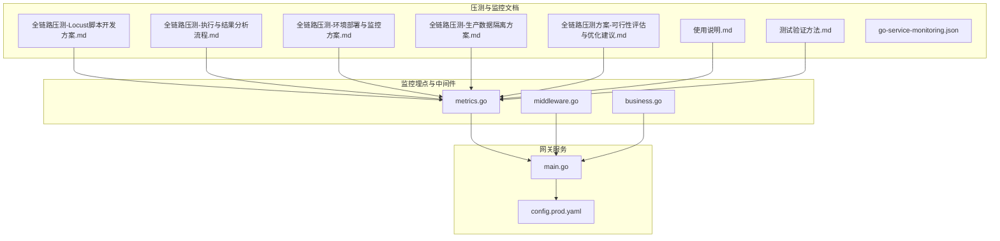
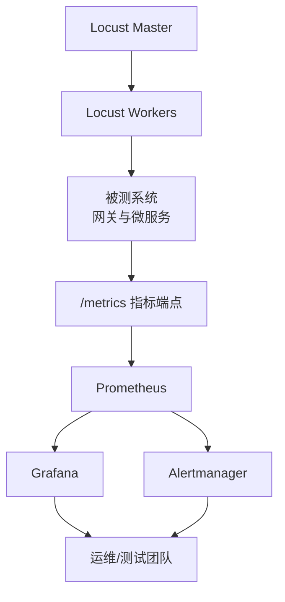
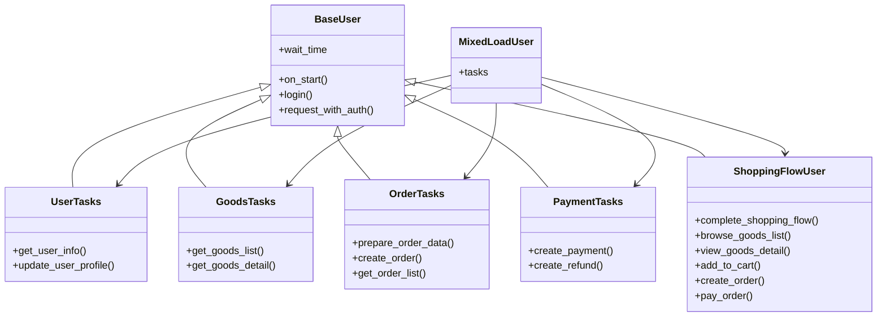
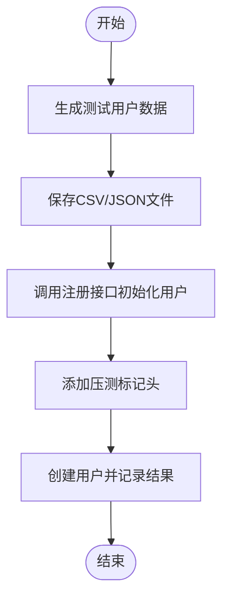
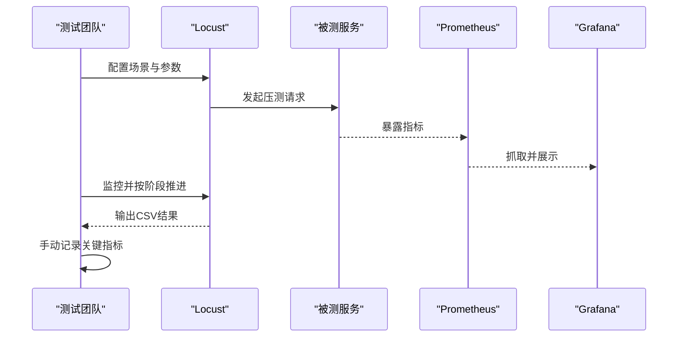
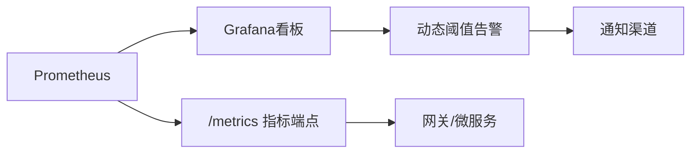
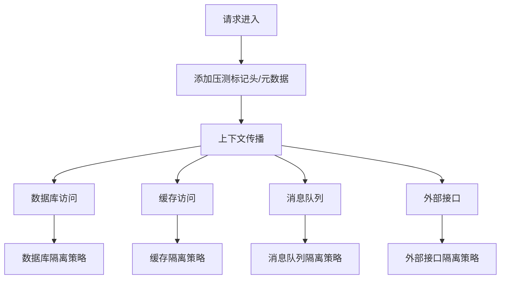
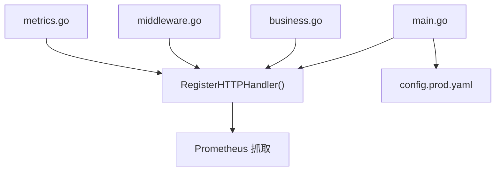

# 性能测试与压测

<cite>
**本文引用的文件**
- [全链路压测-Locust脚本开发方案.md](file://doc/全链路压测-Locust脚本开发方案.md)
- [全链路压测-执行与结果分析流程.md](file://doc/全链路压测-执行与结果分析流程.md)
- [全链路压测-环境部署与监控方案.md](file://doc/全链路压测-环境部署与监控方案.md)
- [全链路压测-生产数据隔离方案.md](file://doc/全链路压测-生产数据隔离方案.md)
- [全链路压测方案-可行性评估与优化建议.md](file://doc/全链路压测方案-可行性评估与优化建议.md)
- [使用说明.md](file://doc/grafana/使用说明.md)
- [测试验证方法.md](file://doc/grafana/测试验证方法.md)
- [go-service-monitoring.json](file://doc/grafana/dashboards/go-service-monitoring.json)
- [metrics.go](file://utility/metrics/metrics.go)
- [middleware.go](file://utility/metrics/middleware.go)
- [business.go](file://utility/metrics/business.go)
- [main.go](file://app/gateway-h5/main.go)
- [config.prod.yaml](file://app/gateway-h5/manifest/config/config.prod.yaml)
</cite>

## 目录
1. [引言](#引言)
2. [项目结构](#项目结构)
3. [核心组件](#核心组件)
4. [架构总览](#架构总览)
5. [详细组件分析](#详细组件分析)
6. [依赖分析](#依赖分析)
7. [性能考虑](#性能考虑)
8. [故障排查指南](#故障排查指南)
9. [结论](#结论)
10. [附录](#附录)

## 引言
本文件面向shop-goframe微服务项目，系统化阐述全链路压测的实施方法，覆盖测试环境搭建、测试数据准备、Locust压测脚本开发、压测执行流程、结果分析与性能回归、生产数据隔离、压测报告模板与持续监控等关键环节。文档以仓库内现有压测与监控文档为基础，结合GoFrame微服务架构与Prometheus/Grafana监控体系，提供可落地的实践指南。

## 项目结构
- 压测与监控相关文档集中在doc目录，包含Locust脚本开发、执行流程、环境部署、监控方案、生产数据隔离、可行性评估以及Grafana看板与动态阈值告警的使用说明与测试验证方法。
- 监控埋点与中间件位于utility/metrics，提供HTTP请求、错误、业务指标的Prometheus导出能力，并在网关服务中注册/metrics端点。
- 网关服务配置文件展示了服务端口、日志、Etcd注册中心等关键配置，为压测环境部署提供参考。

**章节来源**
- file://doc/全链路压测-Locust脚本开发方案.md#L1-L630
- file://doc/全链路压测-执行与结果分析流程.md#L1-L467
- file://doc/全链路压测-环境部署与监控方案.md#L1-L502
- file://doc/全链路压测-生产数据隔离方案.md#L1-L228
- file://doc/全链路压测方案-可行性评估与优化建议.md#L1-L276
- file://utility/metrics/metrics.go#L1-L71
- file://utility/metrics/middleware.go#L1-L62
- file://utility/metrics/business.go#L1-L70
- file://app/gateway-h5/main.go#L1-L38
- file://app/gateway-h5/manifest/config/config.prod.yaml#L1-L18

## 核心组件
- Locust压测脚本与场景：提供用户、商品、订单、支付等核心业务流程的脚本骨架，支持混合负载与专项压测用户类，具备任务权重配置与完整购物流程编排。
- 测试数据准备：包含用户数据生成器与初始化脚本，支持批量生成测试用户并注入压测标记，便于隔离与溯源。
- 监控与指标：基于Prometheus的HTTP请求计数、延迟直方图、错误计数与业务指标（订单创建、成功率、库存），并通过Grafana看板可视化。
- 压测环境与监控：定义Locust分布式架构、硬件资源建议、监控系统（Prometheus、Grafana、Alertmanager）部署与指标采集配置。
- 生产数据隔离：通过请求标记、数据库/缓存/消息队列隔离、幂等性保障等多层机制，确保压测不影响生产数据与业务。

**章节来源**
- file://doc/全链路压测-Locust脚本开发方案.md#L406-L446
- file://doc/全链路压测-执行与结果分析流程.md#L208-L255
- file://doc/全链路压测-环境部署与监控方案.md#L111-L281
- file://doc/全链路压测-生产数据隔离方案.md#L13-L228
- file://utility/metrics/metrics.go#L14-L43
- file://utility/metrics/business.go#L10-L37

## 架构总览
下图展示压测执行与监控的整体架构：Locust Master/Worker集群生成流量，被测系统（网关与微服务）暴露Prometheus指标，Prometheus抓取并存储，Grafana可视化与动态阈值告警，Alertmanager统一告警。

**图表来源**
- file://doc/全链路压测-环境部署与监控方案.md#L450-L489

**章节来源**
- file://doc/全链路压测-环境部署与监控方案.md#L9-L23
- file://doc/全链路压测-环境部署与监控方案.md#L141-L281
- file://app/gateway-h5/main.go#L23-L35

## 详细组件分析

### 组件A：Locust压测脚本与场景
- 脚本架构：包含基础用户类、HTTP客户端、工具函数、任务模块（用户/商品/订单/支付）、完整购物流程与主入口混合用户类。
- 用户行为模拟：通过任务权重与思考时间模拟真实用户行为；支持登录鉴权与压测标记头。
- 负载生成：支持Locust Web界面与无头模式执行，支持分布式Master/Worker集群。
- 场景设计：覆盖商品浏览、下单购买、退款处理等核心流程，支持混合场景与专项压测。

**图表来源**
- file://doc/全链路压测-Locust脚本开发方案.md#L44-L89
- file://doc/全链路压测-Locust脚本开发方案.md#L126-L159
- file://doc/全链路压测-Locust脚本开发方案.md#L163-L206
- file://doc/全链路压测-Locust脚本开发方案.md#L209-L268
- file://doc/全链路压测-Locust脚本开发方案.md#L270-L320
- file://doc/全链路压测-Locust脚本开发方案.md#L322-L404
- file://doc/全链路压测-Locust脚本开发方案.md#L408-L446

**章节来源**
- file://doc/全链路压测-Locust脚本开发方案.md#L7-L41
- file://doc/全链路压测-Locust脚本开发方案.md#L406-L446

### 组件B：测试数据准备与初始化
- 用户数据生成：支持批量生成测试用户并输出CSV/JSON，便于注册与登录。
- 初始化脚本：通过HTTP请求创建测试用户，添加压测标记头，记录成功/失败情况。
- 商品数据：建议准备普通、热门、促销等多类型商品，模拟高并发访问与复杂价格计算。

**图表来源**
- file://doc/全链路压测-Locust脚本开发方案.md#L452-L494
- file://doc/全链路压测-Locust脚本开发方案.md#L498-L545

**章节来源**
- file://doc/全链路压测-Locust脚本开发方案.md#L448-L494
- file://doc/全链路压测-Locust脚本开发方案.md#L496-L545

### 组件C：压测执行流程与结果分析
- 执行流程：预热、逐步加压、稳定运行、极限测试四个阶段，明确梯度与持续时间。
- 监控要点：性能（响应时间/RPS/错误率）、资源（CPU/内存/IO/网络）、业务（订单/支付/退款）指标。
- 结束条件：错误率、响应时间、资源使用率等阈值触发紧急停止。
- 结果收集：自动CSV导出与手动记录表，便于对比分析。

**图表来源**
- file://doc/全链路压测-执行与结果分析流程.md#L121-L176
- file://doc/全链路压测-执行与结果分析流程.md#L177-L207
- file://doc/全链路压测-执行与结果分析流程.md#L208-L255

**章节来源**
- file://doc/全链路压测-执行与结果分析流程.md#L11-L30
- file://doc/全链路压测-执行与结果分析流程.md#L121-L176
- file://doc/全链路压测-执行与结果分析流程.md#L177-L207
- file://doc/全链路压测-执行与结果分析流程.md#L208-L255

### 组件D：监控系统与Grafana看板
- 指标体系：HTTP请求速率/状态分布、错误率、响应时间（P95/P99/Avg）、CPU使用率、业务指标（订单创建/成功率/库存）。
- Grafana看板：提供一键导入的监控面板，支持动态阈值告警（基于历史数据的智能阈值）。
- 验证方法：通过Docker Compose搭建本地测试环境，模拟指标数据，验证看板与告警功能。

**图表来源**
- file://doc/grafana/使用说明.md#L1-L204
- file://doc/grafana/测试验证方法.md#L1-L534
- file://doc/grafana/dashboards/go-service-monitoring.json#L1-L715

**章节来源**
- file://doc/grafana/使用说明.md#L1-L204
- file://doc/grafana/测试验证方法.md#L1-L534
- file://doc/grafana/dashboards/go-service-monitoring.json#L1-L715

### 组件E：生产数据隔离方案
- 请求标记：HTTP/HTTPS请求头、gRPC元数据、上下文传播，便于日志与审计。
- 数据库隔离：表前缀/标记字段/事务隔离，确保压测数据与生产数据互不干扰。
- 缓存隔离：键前缀/Redis数据库编号/短过期策略，避免污染生产缓存。
- 消息队列隔离：交换机/队列命名隔离、消息头标记与消费过滤。
- 外部接口隔离：支付沙箱/测试账号、第三方服务Mock。
- 幂等性保障：压测专用幂等键与分布式锁命名空间。

**图表来源**
- file://doc/全链路压测-生产数据隔离方案.md#L13-L228

**章节来源**
- file://doc/全链路压测-生产数据隔离方案.md#L13-L228

## 依赖分析
- 监控埋点依赖：utility/metrics/metrics.go与utility/metrics/middleware.go在网关服务main.go中注册，暴露/metrics端点，供Prometheus抓取。
- 指标类型：计数器（请求/错误）、直方图（延迟）、Gauge（业务指标），标签维度覆盖方法、路径、状态、错误类型、服务名等。
- 服务配置：网关服务配置文件定义服务端口、日志、Etcd注册中心等，为压测环境部署提供基础。

**图表来源**
- file://utility/metrics/metrics.go#L45-L55
- file://utility/metrics/middleware.go#L9-L34
- file://utility/metrics/business.go#L10-L37
- file://app/gateway-h5/main.go#L23-L35
- file://app/gateway-h5/manifest/config/config.prod.yaml#L1-L18

**章节来源**
- file://utility/metrics/metrics.go#L14-L43
- file://utility/metrics/middleware.go#L9-L34
- file://utility/metrics/business.go#L10-L37
- file://app/gateway-h5/main.go#L13-L37
- file://app/gateway-h5/manifest/config/config.prod.yaml#L1-L18

## 性能考虑
- 指标维度与基数：路径标签可能导致高基数，建议使用路由模式替代具体路径，降低查询与存储压力。
- 监控覆盖：确保所有关键服务与组件均暴露/metrics端点，Prometheus配置包含所有目标。
- 告警阈值：结合业务SLA设定RPS/响应时间/错误率阈值，动态阈值需足够学习周期以避免误报。
- 资源隔离：压测流量与限流策略、数据库/缓存/消息队列隔离，避免压测影响生产。
- 性能基线：建立性能基线与回归测试，定期压测并跟踪趋势。

[本节为通用指导，无需引用具体文件]

## 故障排查指南
- Locust连接问题：检查Master/Worker网络连通性、端口开放与IP配置。
- 监控数据缺失：确认Prometheus配置、服务/metrics端点可达、抓取间隔合理。
- 压测异常：立即停止压测，检查系统日志，验证数据隔离有效性，调整并发或资源。
- Grafana告警：验证动态阈值学习周期、敏感度与检测模式，确保通知渠道配置正确。

**章节来源**
- file://doc/全链路压测-环境部署与监控方案.md#L423-L449
- file://doc/grafana/使用说明.md#L129-L157

## 结论
本方案基于仓库现有压测与监控文档，结合GoFrame微服务架构与Prometheus/Grafana体系，提供了从环境搭建、脚本开发、执行流程到结果分析与持续监控的完整实践路径。通过严格的生产数据隔离与资源控制，可在保障生产安全的前提下开展系统化的全链路压测，持续优化系统性能与稳定性。

[本节为总结，无需引用具体文件]

## 附录

### A. 压测报告模板（结构化）
- 压测概述：目的、环境、时间、参与人员
- 测试场景：场景描述、压测参数、测试数据说明
- 性能结果：总体指标、接口级指标、资源使用情况
- 问题分析：性能问题、根因分析、影响范围
- 优化建议：短期/中长期建议、架构调整
- 结论：是否满足要求、稳定性评估、后续工作

**章节来源**
- file://doc/全链路压测-执行与结果分析流程.md#L349-L383

### B. 性能基线与持续监控
- 基线建立：在稳定状态下采集RPS、响应时间、错误率、资源使用率等指标，形成基线。
- 回归测试：每次重大变更后执行回归压测，对比基线差异。
- 持续监控：通过Grafana看板与动态阈值告警，持续观测系统健康度。

**章节来源**
- file://doc/全链路压测-执行与结果分析流程.md#L401-L433
- file://doc/grafana/使用说明.md#L109-L157

### C. 常用命令与配置参考
- Locust启动与分布式运行命令
- Prometheus/Grafana/Alertmanager部署与配置要点
- 网关服务端口与Etcd配置

**章节来源**
- file://doc/全链路压测-环境部署与监控方案.md#L452-L466
- file://app/gateway-h5/manifest/config/config.prod.yaml#L1-L18