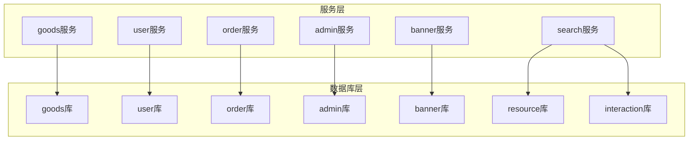
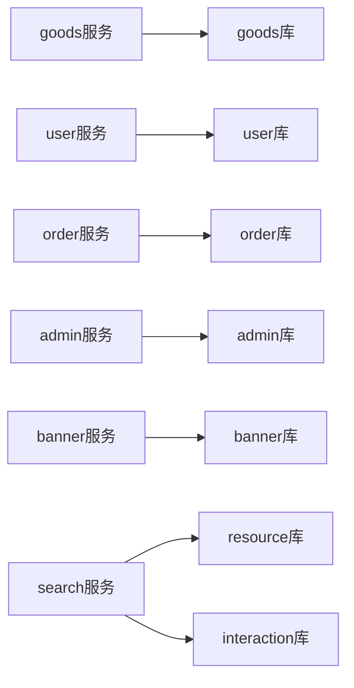
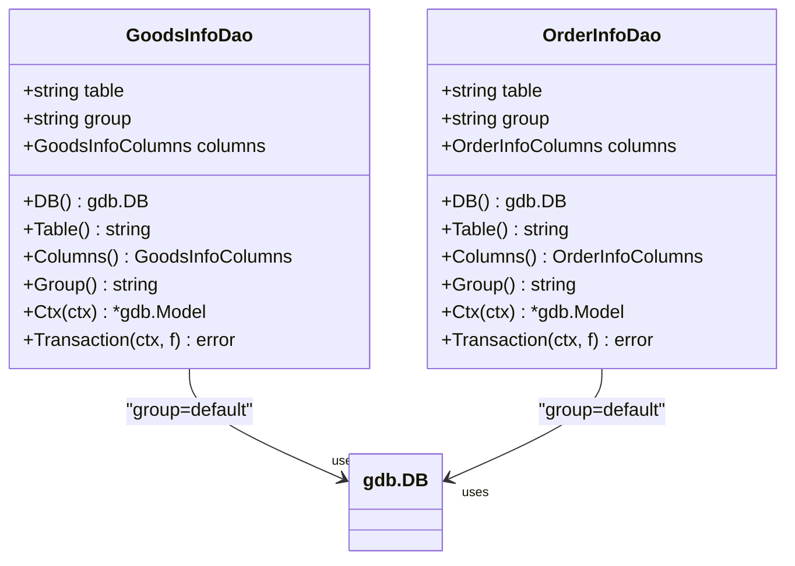
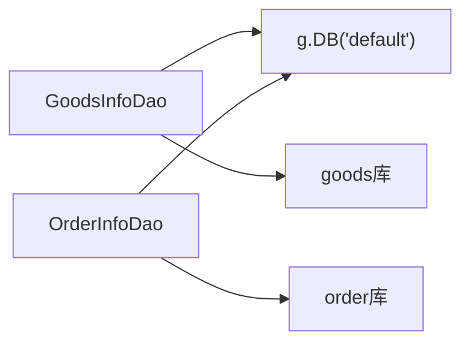

# 数据库性能优化

<cite>
**本文引用的文件**
- [init-db/01_init.sql](file://init-db/01_init.sql)
- [app/admin/hack/admin.sql](file://app/admin/hack/admin.sql)
- [app/goods/hack/goods.sql](file://app/goods/hack/goods.sql)
- [app/order/hack/order.sql](file://app/order/hack/order.sql)
- [app/user/hack/user_info.sql](file://app/user/hack/user_info.sql)
- [app/banner/hack/banner.sql](file://app/banner/hack/banner.sql)
- [app/interaction/hack/interaction.sql](file://app/interaction/hack/interaction.sql)
- [app/goods/manifest/config/config.prod.yaml](file://app/goods/manifest/config/config.prod.yaml)
- [app/order/manifest/config/config.prod.yaml](file://app/order/manifest/config/config.prod.yaml)
- [app/user/manifest/config/config.prod.yaml](file://app/user/manifest/config/config.prod.yaml)
- [app/goods/internal/dao/internal/goods_info.go](file://app/goods/internal/dao/internal/goods_info.go)
- [app/order/internal/dao/internal/order_info.go](file://app/order/internal/dao/internal/order_info.go)
- [app/goods/internal/dao/goods_info.go](file://app/goods/internal/dao/goods_info.go)
- [app/order/internal/dao/order_info.go](file://app/order/internal/dao/order_info.go)
</cite>

## 目录
1. [简介](#简介)
2. [项目结构](#项目结构)
3. [核心组件](#核心组件)
4. [架构总览](#架构总览)
5. [详细组件分析](#详细组件分析)
6. [依赖关系分析](#依赖关系分析)
7. [性能考量](#性能考量)
8. [故障排查指南](#故障排查指南)
9. [结论](#结论)
10. [附录](#附录)

## 简介
本文件聚焦于该微服务项目中的数据库性能优化，围绕查询优化策略（索引设计、查询语句优化、连接池配置）、表结构与索引策略、SQL执行计划与性能瓶颈分析、连接池优化、读写分离与分库分表扩展方案、慢查询监控与性能分析工具使用以及数据库维护最佳实践进行系统化梳理与落地建议。文档基于仓库内现有的数据库初始化脚本、各服务配置与DAO层实现进行分析。

## 项目结构
该项目采用多数据库、多服务的微服务架构，每个业务域独立数据库，通过gRPC进行服务间通信。数据库初始化脚本集中于init-db目录，按模块拆分；各服务在manifest/config下提供生产环境配置，DAO层由GoFrame自动生成，封装了底层数据库访问。

**图表来源**
- [init-db/01_init.sql](file://init-db/01_init.sql#L14-L545)
- [app/goods/manifest/config/config.prod.yaml](file://app/goods/manifest/config/config.prod.yaml#L15-L18)
- [app/user/manifest/config/config.prod.yaml](file://app/user/manifest/config/config.prod.yaml#L15-L18)
- [app/order/manifest/config/config.prod.yaml](file://app/order/manifest/config/config.prod.yaml#L15-L18)

**章节来源**
- [init-db/01_init.sql](file://init-db/01_init.sql#L1-L800)
- [app/goods/manifest/config/config.prod.yaml](file://app/goods/manifest/config/config.prod.yaml#L1-L60)
- [app/user/manifest/config/config.prod.yaml](file://app/user/manifest/config/config.prod.yaml#L1-L42)
- [app/order/manifest/config/config.prod.yaml](file://app/order/manifest/config/config.prod.yaml#L1-L86)

## 核心组件
- 数据库初始化与表结构
  - 商品域：goods_info、goods_images、category_info、cart_info、coupon_info、user_coupon_info、bargain_info、bargain_history
  - 用户域：user_info、consignee_info
  - 订单域：order_info、order_goods_info、refund_info
  - 轮播与Banner：rotation_info、position_info
  - 交互域：comment_info、praise_info、collection_info
  - 管理后台：admin_info、role_info、role_permission_info、permission_info
  - 资源与文件：file_info
- DAO层与数据库访问
  - 各服务均通过GoFrame生成的DAO层访问对应数据库，统一通过Group(default)与对应的数据库连接字符串进行访问
- 连接池与配置
  - 各服务在config.prod.yaml中定义数据库连接字符串，未显式声明连接池参数，遵循GoFrame默认行为

**章节来源**
- [init-db/01_init.sql](file://init-db/01_init.sql#L17-L545)
- [app/goods/internal/dao/internal/goods_info.go](file://app/goods/internal/dao/internal/goods_info.go#L14-L116)
- [app/order/internal/dao/internal/order_info.go](file://app/order/internal/dao/internal/order_info.go#L14-L110)
- [app/goods/manifest/config/config.prod.yaml](file://app/goods/manifest/config/config.prod.yaml#L15-L18)
- [app/user/manifest/config/config.prod.yaml](file://app/user/manifest/config/config.prod.yaml#L15-L18)
- [app/order/manifest/config/config.prod.yaml](file://app/order/manifest/config/config.prod.yaml#L15-L18)

## 架构总览
服务与数据库的映射关系如下：

**图表来源**
- [app/goods/manifest/config/config.prod.yaml](file://app/goods/manifest/config/config.prod.yaml#L15-L18)
- [app/user/manifest/config/config.prod.yaml](file://app/user/manifest/config/config.prod.yaml#L15-L18)
- [app/order/manifest/config/config.prod.yaml](file://app/order/manifest/config/config.prod.yaml#L15-L18)
- [init-db/01_init.sql](file://init-db/01_init.sql#L14-L545)

## 详细组件分析

### 商品域表结构与索引策略
- 关键表
  - goods_info：主表，包含基础商品信息、价格、库存、销量、分类层级、标签、排序、砍价开关与最低价等
  - goods_images：商品详情图，按goods_id建立索引
  - category_info：三级分类，包含parent_id、level、sort
  - cart_info：购物车，按user_id与goods_id组合查询
  - coupon_info：优惠券，按goods_id与deadline建立索引
  - user_coupon_info：用户优惠券，按user_id、coupon_id、status建立索引与唯一约束
  - bargain_info/bargain_history：砍价相关表
- 索引现状与建议
  - goods_images.idx_goods：有效支撑按商品查询详情图
  - coupon_info.idx_goods_id、coupon_info.idx_deadline：支撑按商品筛选与过期时间扫描
  - user_coupon_info.idx_user_id、idx_coupon_id、idx_status：支撑用户维度查询与状态过滤
  - 建议
    - 在goods_info上增加复合索引：(level1_category_id, level2_category_id, level3_category_id, sale, sort)，用于类目筛选与排序
    - 在user_coupon_info上考虑增加联合查询索引：(status, deadline)，结合业务“即将过期”提醒
    - 对高频搜索字段如name、tags建立全文索引或前缀索引（需结合具体查询模式）

**章节来源**
- [init-db/01_init.sql](file://init-db/01_init.sql#L17-L88)
- [app/goods/hack/goods.sql](file://app/goods/hack/goods.sql#L1-L119)

### 用户域表结构与索引策略
- 关键表
  - user_info：用户基本信息，含open_id、phone、status等
  - consignee_info：收货地址，默认地址标记
- 索引现状与建议
  - user_info主键id；建议对open_id、phone建立唯一索引以支撑登录与绑定场景
  - consignee_info主键id；建议对user_id建立索引以支撑用户地址列表查询

**章节来源**
- [init-db/01_init.sql](file://init-db/01_init.sql#L246-L293)
- [app/user/hack/user_info.sql](file://app/user/hack/user_info.sql#L1-L58)

### 订单域表结构与索引策略
- 关键表
  - order_info：订单主表，包含状态、支付方式、收货人信息、金额等
  - order_goods_info：订单商品明细
  - refund_info：退款申请
- 索引现状与建议
  - order_info主键id；建议对user_id、status、pay_at建立索引以支撑用户订单列表与状态筛选
  - order_goods_info主键id；建议对order_id、goods_id建立索引以支撑订单详情与商品维度查询
  - refund_info主键id；建议对order_id、user_id建立索引以支撑退款关联查询

**章节来源**
- [init-db/01_init.sql](file://init-db/01_init.sql#L411-L472)
- [app/order/hack/order.sql](file://app/order/hack/order.sql#L1-L96)

### Banner与轮播表结构与索引策略
- 关键表
  - rotation_info：轮播图
  - position_info：广告位，包含goods_id
- 索引现状与建议
  - position_info.goods_id：支撑广告位商品查询
  - 建议对rotation_info.sort建立索引以支撑排序展示

**章节来源**
- [init-db/01_init.sql](file://init-db/01_init.sql#L508-L539)
- [app/banner/hack/banner.sql](file://app/banner/hack/banner.sql#L1-L44)

### 交互域表结构与索引策略
- 关键表
  - comment_info：评论，含唯一索引(user_id, object_id, type, content, parent_id)
  - praise_info：点赞，含唯一索引(user_id, type, object_id)
  - collection_info：收藏，含唯一索引(user_id, object_id, type)
- 索引现状与建议
  - 唯一索引已覆盖去重与快速定位，建议对object_id、type建立普通索引以支撑对象维度查询

**章节来源**
- [init-db/01_init.sql](file://init-db/01_init.sql#L308-L366)
- [app/interaction/hack/interaction.sql](file://app/interaction/hack/interaction.sql#L1-L72)

### 管理后台表结构与索引策略
- 关键表
  - admin_info：管理员，含唯一索引(name)
  - role_info：角色
  - role_permission_info：角色权限
  - permission_info：权限
- 索引现状与建议
  - admin_info.name唯一索引：支撑登录名查询
  - 建议对role_permission_info(role_id, permission_id)建立唯一索引，确保权限去重

**章节来源**
- [init-db/01_init.sql](file://init-db/01_init.sql#L557-L612)
- [app/admin/hack/admin.sql](file://app/admin/hack/admin.sql#L1-L83)

### DAO层与数据库访问
- DAO层职责
  - 封装表名、列名、事务、上下文传递
  - 通过g.DB(group)获取数据库实例，group为"default"
- 访问模式
  - 通过Ctx(ctx)传入上下文，Safe()保证安全模式
  - 支持Transaction(ctx, f)封装事务逻辑

**图表来源**
- [app/goods/internal/dao/internal/goods_info.go](file://app/goods/internal/dao/internal/goods_info.go#L14-L116)
- [app/order/internal/dao/internal/order_info.go](file://app/order/internal/dao/internal/order_info.go#L14-L110)

**章节来源**
- [app/goods/internal/dao/internal/goods_info.go](file://app/goods/internal/dao/internal/goods_info.go#L78-L116)
- [app/order/internal/dao/internal/order_info.go](file://app/order/internal/dao/internal/order_info.go#L72-L110)
- [app/goods/internal/dao/goods_info.go](file://app/goods/internal/dao/goods_info.go#L11-L23)
- [app/order/internal/dao/order_info.go](file://app/order/internal/dao/order_info.go#L11-L23)

### SQL执行计划与性能瓶颈分析
- 执行计划获取
  - 使用EXPLAIN/EXPLAIN ANALYZE查看查询计划，关注是否使用索引、回表次数、扫描行数
- 常见瓶颈与优化方向
  - 全表扫描：为高频过滤字段补充合适索引（如goods_info类目与状态）
  - 回表过多：将常用查询字段纳入覆盖索引
  - 联合查询：为JOIN字段建立索引，避免笛卡尔积
  - 排序与分页：对排序字段建立索引，LIMIT配合WHERE减少扫描
  - 软删除：deleted_at字段需配合索引，避免全表扫描

[本节为通用分析方法，不直接引用具体文件]

### 数据库连接池配置优化
- 当前状况
  - 各服务配置中仅设置了数据库连接字符串，未显式配置连接池参数
- 优化建议
  - 连接数设置
    - 最小空闲连接：建议与并发峰值接近，保障瞬时高并发
    - 最大连接数：建议为CPU核心数×2~4倍，结合慢查询与IO能力调优
  - 超时配置
    - 连接超时：建议10~30s
    - 读写超时：建议10~60s，长事务场景适当放宽
  - 连接复用
    - 合理设置连接生命周期，避免长时间占用导致资源枯竭
    - 使用连接池健康检查，剔除异常连接
- 配置示例（概念性说明）
  - mysql连接池参数：maxOpenConns、maxIdleConns、connMaxLifetime、connMaxIdleTime
  - 结合服务QPS与RT目标进行压测校准

[本节为通用配置建议，不直接引用具体文件]

### 读写分离与分库分表扩展方案
- 读写分离
  - 主库写入：订单、用户、商品主表写入
  - 从库读取：商品列表、用户信息、评论等读多写少场景
  - 切换策略：基于路由规则或中间件实现透明切换
- 分库分表
  - 水平分片：按用户ID取模分库，订单按时间分表
  - 垂直分片：将大字段（如详情、图片JSON）拆分至独立表
  - 路由规则：基于分片键选择目标库表，保证跨分片查询成本可控
- 注意事项
  - 事务边界：跨分片事务需采用最终一致或分布式事务
  - 查询一致性：读写分离下的强一致读可通过主库直连或延迟双写解决

[本节为扩展性方案概述，不直接引用具体文件]

### 慢查询监控与性能分析
- 慢查询日志
  - 开启slow_query_log，设置long_query_time阈值（建议>100ms）
  - 定位慢SQL，结合执行计划分析
- 性能分析工具
  - EXPLAIN/EXPLAIN ANALYZE：查看执行计划与代价
  - 指标采集：QPS、RT、错误率、连接数、锁等待
- 告警与治理
  - 基于Prometheus/Grafana设置阈值告警
  - 对热点表与慢SQL建立治理清单，定期复盘

[本节为通用监控与分析方法，不直接引用具体文件]

### 数据库维护最佳实践
- 索引维护
  - 定期重建碎片索引，清理冗余索引
  - 基于查询日志与慢查询分析，持续优化索引
- 版本升级与备份
  - 渐进式升级，先影子库验证，再灰度切换
  - 定期备份与恢复演练，确保RTO/RPO达标
- 安全与合规
  - 敏感字段脱敏与最小授权
  - 审计日志与变更审批

[本节为通用维护建议，不直接引用具体文件]

## 依赖关系分析
- 服务与数据库
  - goods服务 -> goods库
  - user服务 -> user库
  - order服务 -> order库
  - admin服务 -> admin库
  - banner服务 -> banner库
  - search服务 -> resource库、interaction库
- DAO与数据库
  - GoodsInfoDao/OrderInfoDao通过g.DB("default")访问对应数据库
  - 事务通过Transaction(ctx, f)统一封装

**图表来源**
- [app/goods/internal/dao/internal/goods_info.go](file://app/goods/internal/dao/internal/goods_info.go#L78-L81)
- [app/order/internal/dao/internal/order_info.go](file://app/order/internal/dao/internal/order_info.go#L72-L75)

**章节来源**
- [app/goods/internal/dao/internal/goods_info.go](file://app/goods/internal/dao/internal/goods_info.go#L78-L116)
- [app/order/internal/dao/internal/order_info.go](file://app/order/internal/dao/internal/order_info.go#L72-L110)

## 性能考量
- 索引设计
  - 针对高频过滤与排序字段建立复合索引，减少回表与全表扫描
  - 对唯一约束字段建立唯一索引，避免重复数据与重复扫描
- 查询优化
  - 使用覆盖索引减少回表
  - LIMIT与分页优化，避免深度分页
  - JOIN查询优先使用小表驱动大表，确保连接字段有索引
- 连接池
  - 合理设置最大连接数与空闲连接，避免资源争用
  - 设置合理的超时与健康检查，提升稳定性
- 扩展性
  - 读写分离与分库分表降低单库压力
  - 缓存与异步化处理热点数据与长尾任务

[本节为通用性能指导，不直接引用具体文件]

## 故障排查指南
- 常见问题
  - 查询慢：检查执行计划、索引缺失、回表过多
  - 连接池耗尽：检查最大连接数、超时配置、连接泄漏
  - 死锁：检查事务范围与锁顺序，必要时降级为单表写入
- 排查步骤
  - 获取慢查询日志与执行计划
  - 校验索引使用情况与覆盖情况
  - 观察连接池指标与数据库负载
  - 通过压测验证优化效果

[本节为通用排查方法，不直接引用具体文件]

## 结论
本项目已具备清晰的多库多服务架构与完善的表结构设计。建议在现有基础上进一步完善索引策略、优化连接池参数、引入慢查询监控与治理机制，并在业务增长期逐步实施读写分离与分库分表，以持续提升数据库性能与稳定性。

## 附录
- 初始化脚本与表结构参考
  - [init-db/01_init.sql](file://init-db/01_init.sql#L17-L545)
  - [app/goods/hack/goods.sql](file://app/goods/hack/goods.sql#L1-L119)
  - [app/user/hack/user_info.sql](file://app/user/hack/user_info.sql#L1-L58)
  - [app/order/hack/order.sql](file://app/order/hack/order.sql#L1-L96)
  - [app/banner/hack/banner.sql](file://app/banner/hack/banner.sql#L1-L44)
  - [app/interaction/hack/interaction.sql](file://app/interaction/hack/interaction.sql#L1-L72)
  - [app/admin/hack/admin.sql](file://app/admin/hack/admin.sql#L1-L83)
- 服务配置参考
  - [app/goods/manifest/config/config.prod.yaml](file://app/goods/manifest/config/config.prod.yaml#L15-L18)
  - [app/user/manifest/config/config.prod.yaml](file://app/user/manifest/config/config.prod.yaml#L15-L18)
  - [app/order/manifest/config/config.prod.yaml](file://app/order/manifest/config/config.prod.yaml#L15-L18)