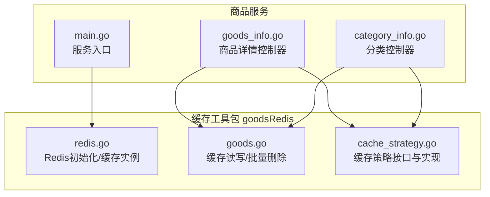
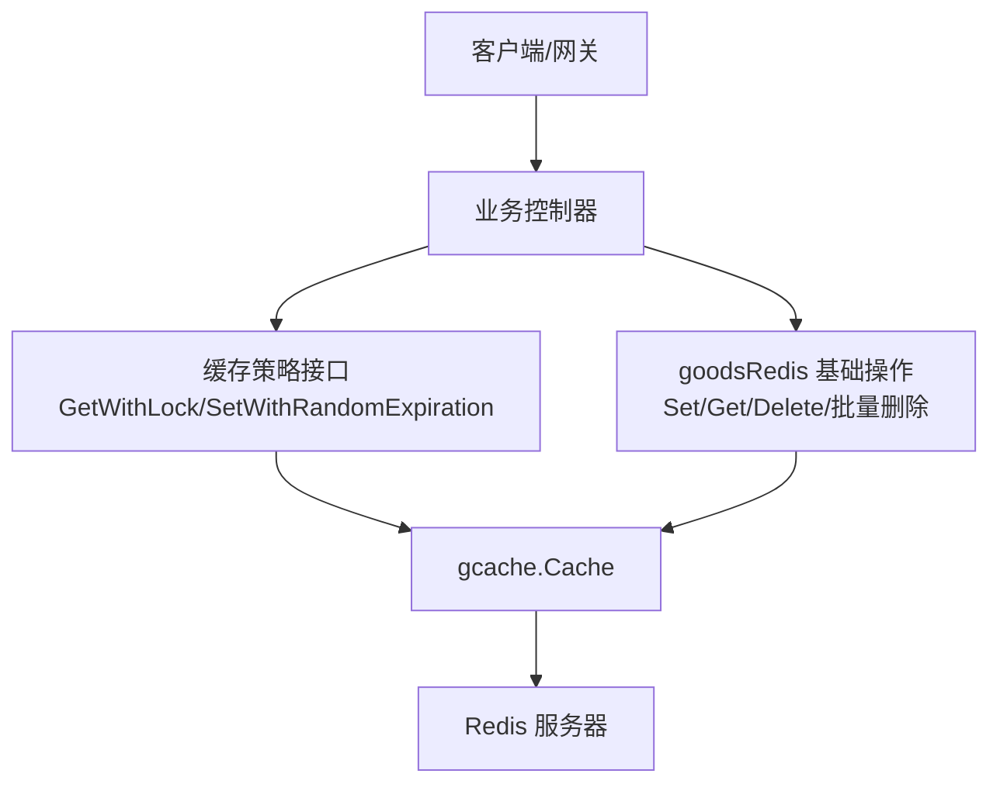
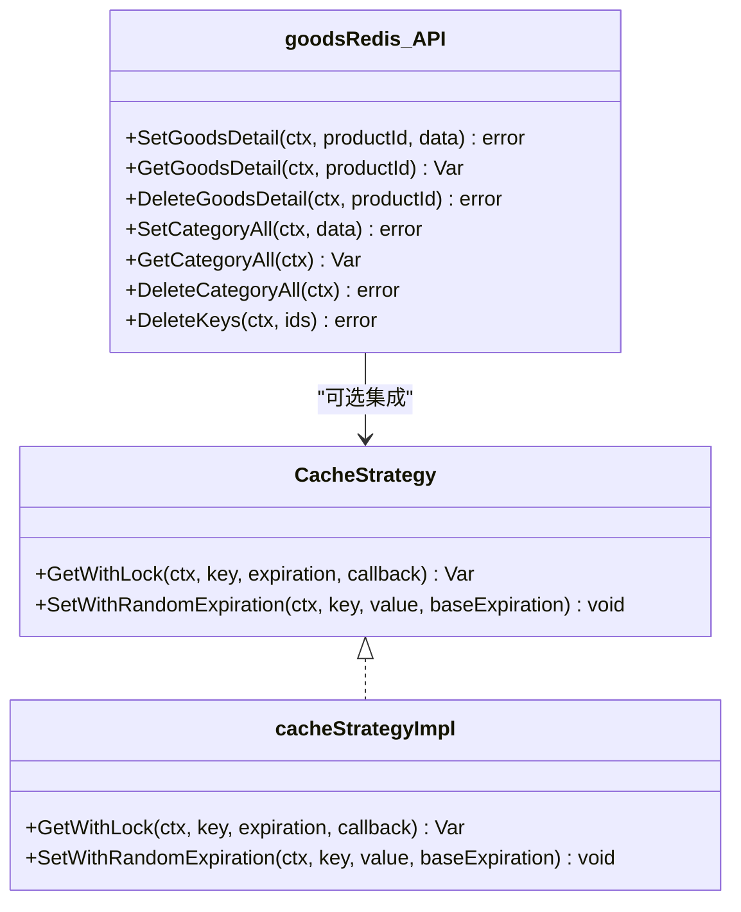
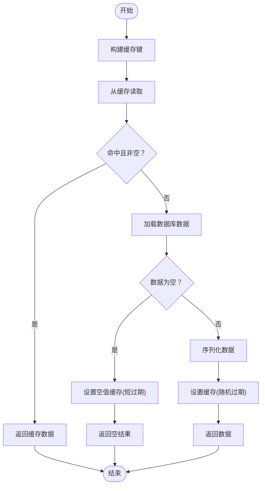
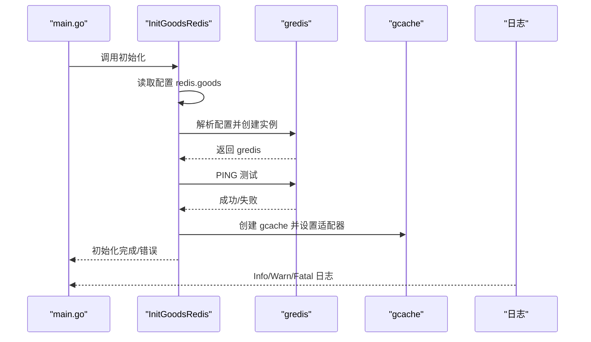
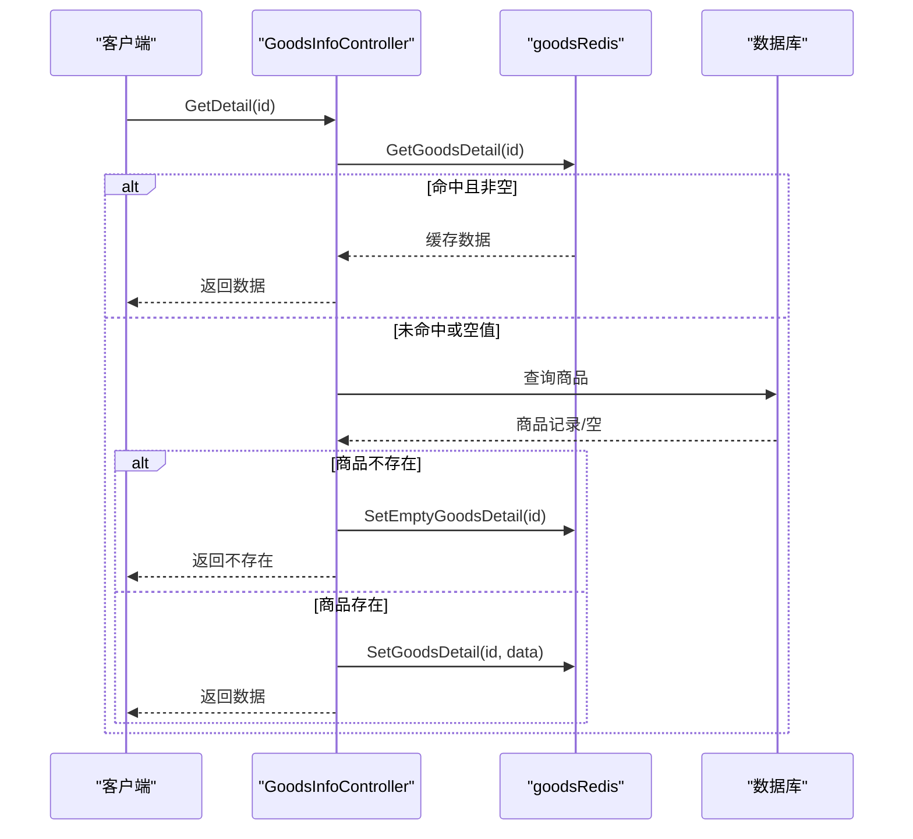
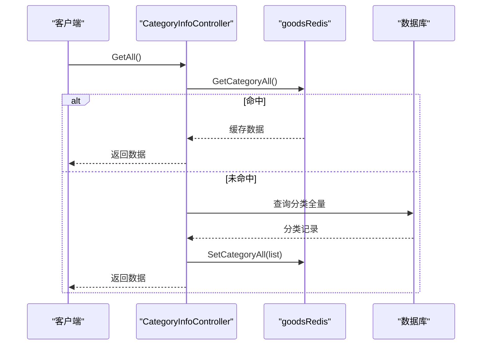
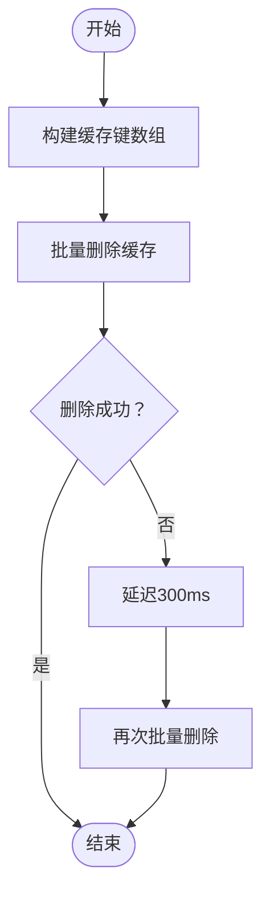
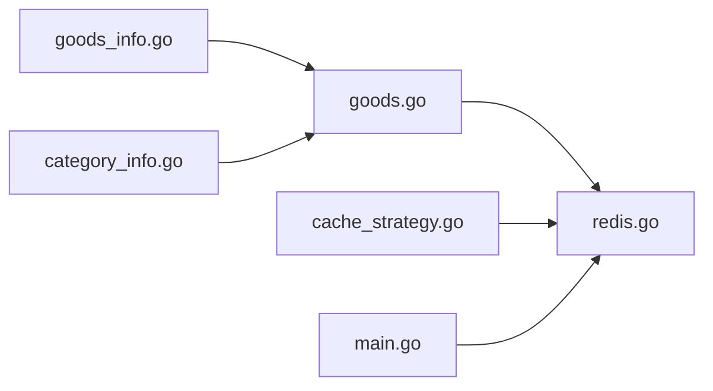

# 缓存使用指南

<cite>
**本文档引用的文件**
- [cache_strategy.go](file://app/goods/utility/goodsRedis/cache_strategy.go)
- [goods.go](file://app/goods/utility/goodsRedis/goods.go)
- [redis.go](file://app/goods/utility/goodsRedis/redis.go)
- [goods_info.go](file://app/goods/internal/controller/goods_info/goods_info.go)
- [category_info.go](file://app/goods/internal/controller/category_info/category_info.go)
- [main.go](file://app/goods/main.go)
- [config.prod.yaml](file://app/goods/manifest/config/config.prod.yaml)
</cite>

## 目录
1. [简介](#简介)
2. [项目结构](#项目结构)
3. [核心组件](#核心组件)
4. [架构总览](#架构总览)
5. [详细组件分析](#详细组件分析)
6. [依赖关系分析](#依赖关系分析)
7. [性能考量](#性能考量)
8. [故障排查指南](#故障排查指南)
9. [结论](#结论)
10. [附录](#附录)

## 简介
本指南面向在商品服务中集成与使用新缓存策略的开发者，提供从初始化、导入到业务调用的完整路径，覆盖商品详情、分类全量数据等典型场景，并给出缓存键命名规范、过期时间设置、空值缓存处理、性能优化与常见问题排查等最佳实践。

## 项目结构
商品服务的缓存能力由独立的 goodsRedis 工具包提供，核心文件包括：
- 缓存策略接口与实现：cache_strategy.go
- 基础缓存操作与批量删除：goods.go
- Redis 初始化与缓存实例：redis.go
- 业务控制器中的使用示例：goods_info.go、category_info.go
- 服务入口初始化：main.go
- 配置文件：config.prod.yaml

**图表来源**
- [main.go](file://app/goods/main.go#L15-L34)
- [redis.go](file://app/goods/utility/goodsRedis/redis.go#L13-L48)
- [goods.go](file://app/goods/utility/goodsRedis/goods.go#L12-L121)
- [cache_strategy.go](file://app/goods/utility/goodsRedis/cache_strategy.go#L18-L96)
- [goods_info.go](file://app/goods/internal/controller/goods_info/goods_info.go#L94-L159)
- [category_info.go](file://app/goods/internal/controller/category_info/category_info.go#L84-L154)

**章节来源**
- [main.go](file://app/goods/main.go#L15-L34)
- [redis.go](file://app/goods/utility/goodsRedis/redis.go#L13-L48)

## 核心组件
- 缓存策略接口与实现
  - 接口定义：GetWithLock、SetWithRandomExpiration
  - 实现：带本地锁的双重检查缓存获取，空值缓存与随机过期时间
- 基础缓存操作
  - 商品详情：设置、获取、删除、空值缓存
  - 分类全量数据：设置、获取、删除
  - 批量删除与延迟双删
- Redis 初始化
  - 从配置读取连接参数，创建 gcache 的 Redis 适配器，测试连通性

**章节来源**
- [cache_strategy.go](file://app/goods/utility/goodsRedis/cache_strategy.go#L18-L96)
- [goods.go](file://app/goods/utility/goodsRedis/goods.go#L12-L121)
- [redis.go](file://app/goods/utility/goodsRedis/redis.go#L13-L48)

## 架构总览
缓存架构采用 gcache + Redis 适配器，业务层通过 goodsRedis 提供的高层封装进行读写；对于热点数据，优先使用基础封装；对于需要强一致与并发安全的场景，推荐使用缓存策略接口。

**图表来源**
- [goods_info.go](file://app/goods/internal/controller/goods_info/goods_info.go#L94-L159)
- [category_info.go](file://app/goods/internal/controller/category_info/category_info.go#L84-L154)
- [cache_strategy.go](file://app/goods/utility/goodsRedis/cache_strategy.go#L32-L90)
- [goods.go](file://app/goods/utility/goodsRedis/goods.go#L25-L121)
- [redis.go](file://app/goods/utility/goodsRedis/redis.go#L33-L34)

## 详细组件分析

### 缓存策略接口与实现
- 设计要点
  - GetWithLock：先查缓存，命中则返回；未命中则加本地锁，双重检查后调用回调加载数据，空值设置短过期的空值缓存，非空值序列化并设置随机过期时间
  - SetWithRandomExpiration：在基础过期时间上增加 5%~15% 的随机抖动，降低雪崩风险
  - 本地锁：使用 sync.Map 存储每个 key 对应的互斥锁，避免缓存击穿
- 适用场景
  - 商品详情、搜索结果等热点数据
  - 需要强一致与并发安全的读取流程

**图表来源**
- [cache_strategy.go](file://app/goods/utility/goodsRedis/cache_strategy.go#L18-L96)
- [goods.go](file://app/goods/utility/goodsRedis/goods.go#L25-L121)

**章节来源**
- [cache_strategy.go](file://app/goods/utility/goodsRedis/cache_strategy.go#L32-L90)

### 基础缓存操作
- 商品详情
  - SetGoodsDetail：序列化后设置 1 小时过期
  - GetGoodsDetail：检查空值标记，返回空或数据
  - DeleteGoodsDetail：删除指定商品详情缓存
  - SetEmptyGoodsDetail：设置短时间空值缓存，防止穿透
- 分类全量数据
  - SetCategoryAll：序列化后设置 7 天过期
  - GetCategoryAll：检查空值标记，返回空或数据
  - DeleteCategoryAll：删除全量缓存
- 批量删除与延迟双删
  - DeleteKeys：批量删除商品详情缓存，失败后延迟双删

**图表来源**
- [goods.go](file://app/goods/utility/goodsRedis/goods.go#L25-L52)
- [cache_strategy.go](file://app/goods/utility/goodsRedis/cache_strategy.go#L32-L78)

**章节来源**
- [goods.go](file://app/goods/utility/goodsRedis/goods.go#L18-L121)

### Redis 初始化与配置
- 初始化流程
  - 从配置读取 redis.goods 段，解析为 gredis.Config
  - 创建 gredis 实例并测试 PING
  - 创建 gcache 并设置 Redis 适配器
- 配置项
  - 地址、数据库编号、连接超时、最大活跃连接、空闲连接等

**图表来源**
- [main.go](file://app/goods/main.go#L22-L26)
- [redis.go](file://app/goods/utility/goodsRedis/redis.go#L14-L42)

**章节来源**
- [main.go](file://app/goods/main.go#L22-L26)
- [redis.go](file://app/goods/utility/goodsRedis/redis.go#L14-L42)
- [config.prod.yaml](file://app/goods/manifest/config/config.prod.yaml#L23-L32)

### 业务控制器中的使用示例

#### 商品详情缓存
- 读取流程
  - 先尝试从缓存读取，命中则反序列化返回
  - 未命中或反序列化失败则查询数据库，若商品不存在则设置空值缓存
  - 成功后异步设置缓存（带超时避免阻塞主流程）
- 更新流程
  - 数据库更新成功后异步删除缓存

**图表来源**
- [goods_info.go](file://app/goods/internal/controller/goods_info/goods_info.go#L94-L159)
- [goods.go](file://app/goods/utility/goodsRedis/goods.go#L25-L52)

**章节来源**
- [goods_info.go](file://app/goods/internal/controller/goods_info/goods_info.go#L94-L159)

#### 分类全量数据缓存
- 读取流程
  - 先尝试从缓存读取，命中则反序列化返回
  - 未命中则查询数据库，构造响应后异步设置 7 天过期缓存
- 更新流程
  - 数据库更新成功后异步删除全量缓存

**图表来源**
- [category_info.go](file://app/goods/internal/controller/category_info/category_info.go#L84-L154)
- [goods.go](file://app/goods/utility/goodsRedis/goods.go#L61-L91)

**章节来源**
- [category_info.go](file://app/goods/internal/controller/category_info/category_info.go#L84-L154)

#### 批量删除与延迟双删
- DeleteKeys：构建多个商品详情键，批量删除；失败后延迟双删
- 适用场景：批量更新商品或清理缓存

**图表来源**
- [goods.go](file://app/goods/utility/goodsRedis/goods.go#L93-L121)

**章节来源**
- [goods.go](file://app/goods/utility/goodsRedis/goods.go#L93-L121)

## 依赖关系分析
- 控制器依赖 goodsRedis 提供的基础操作
- 缓存策略接口与实现可选集成，用于需要强一致与并发安全的场景
- Redis 初始化在服务启动时完成，全局共享 gcache 实例

**图表来源**
- [goods_info.go](file://app/goods/internal/controller/goods_info/goods_info.go#L10-L10)
- [category_info.go](file://app/goods/internal/controller/category_info/category_info.go#L11-L11)
- [goods.go](file://app/goods/utility/goodsRedis/goods.go#L12-L16)
- [redis.go](file://app/goods/utility/goodsRedis/redis.go#L11-L11)
- [cache_strategy.go](file://app/goods/utility/goodsRedis/cache_strategy.go#L25-L25)
- [main.go](file://app/goods/main.go#L22-L26)

**章节来源**
- [goods_info.go](file://app/goods/internal/controller/goods_info/goods_info.go#L10-L10)
- [category_info.go](file://app/goods/internal/controller/category_info/category_info.go#L11-L11)
- [redis.go](file://app/goods/utility/goodsRedis/redis.go#L11-L11)
- [cache_strategy.go](file://app/goods/utility/goodsRedis/cache_strategy.go#L25-L25)
- [main.go](file://app/goods/main.go#L22-L26)

## 性能考量
- 过期时间设置
  - 商品详情：1 小时
  - 分类全量：7 天
  - 空值缓存：短时间（如 1 分钟），防止穿透
- 随机过期抖动
  - 在基础过期时间上增加 5%~15% 的随机抖动，降低雪崩概率
- 异步缓存写入
  - 设置缓存时使用短超时上下文，避免阻塞主流程
- 批量删除与延迟双删
  - 减少缓存不一致窗口，提升最终一致性

[本节为通用性能建议，无需特定文件引用]

## 故障排查指南
- Redis 连接失败
  - 检查配置项 redis.goods 的地址、密码、数据库编号
  - 查看初始化日志，确认 PING 测试是否通过
- 缓存未命中或频繁回源
  - 确认缓存键是否正确（模块:类型:id）
  - 检查过期时间是否过短
  - 关注空值缓存是否生效
- 并发击穿/雪崩
  - 对热点数据使用 GetWithLock 或随机过期策略
  - 监控缓存命中率与延迟，必要时增加预热
- 批量删除异常
  - 观察延迟双删日志，确认是否重复删除成功

**章节来源**
- [redis.go](file://app/goods/utility/goodsRedis/redis.go#L14-L42)
- [goods.go](file://app/goods/utility/goodsRedis/goods.go#L93-L121)
- [cache_strategy.go](file://app/goods/utility/goodsRedis/cache_strategy.go#L80-L90)

## 结论
通过引入缓存策略接口与基础缓存操作，商品服务在保证性能的同时提升了缓存的可靠性与一致性。建议在热点读取场景优先使用缓存策略接口，在非强一致场景使用基础封装；配合合理的过期时间与随机抖动，可有效缓解穿透、击穿与雪崩问题。

[本节为总结性内容，无需特定文件引用]

## 附录

### 缓存键命名规范
- 格式：模块:类型:唯一标识
- 示例：
  - 商品详情：goods:detail:{id}
  - 分类全量：category:all:data

**章节来源**
- [goods.go](file://app/goods/utility/goodsRedis/goods.go#L12-L16)

### 过期时间建议
- 常规数据：1 小时
- 空值缓存：1 分钟
- 热点数据：根据访问频率调整（30 分钟~2 小时）
- 不常变化数据：较长过期（如 7 天）

**章节来源**
- [goods.go](file://app/goods/utility/goodsRedis/goods.go#L25-L71)
- [cache_strategy.go](file://app/goods/utility/goodsRedis/cache_strategy.go#L80-L90)

### 业务代码示例路径
- 商品详情读取与缓存设置
  - [goods_info.go](file://app/goods/internal/controller/goods_info/goods_info.go#L94-L159)
- 分类全量数据读取与缓存设置
  - [category_info.go](file://app/goods/internal/controller/category_info/category_info.go#L84-L154)
- 批量删除与延迟双删
  - [goods.go](file://app/goods/utility/goodsRedis/goods.go#L93-L121)
- 缓存策略接口与实现
  - [cache_strategy.go](file://app/goods/utility/goodsRedis/cache_strategy.go#L18-L96)