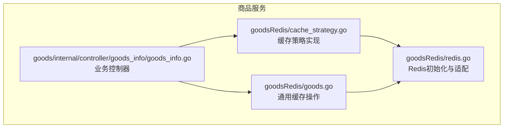
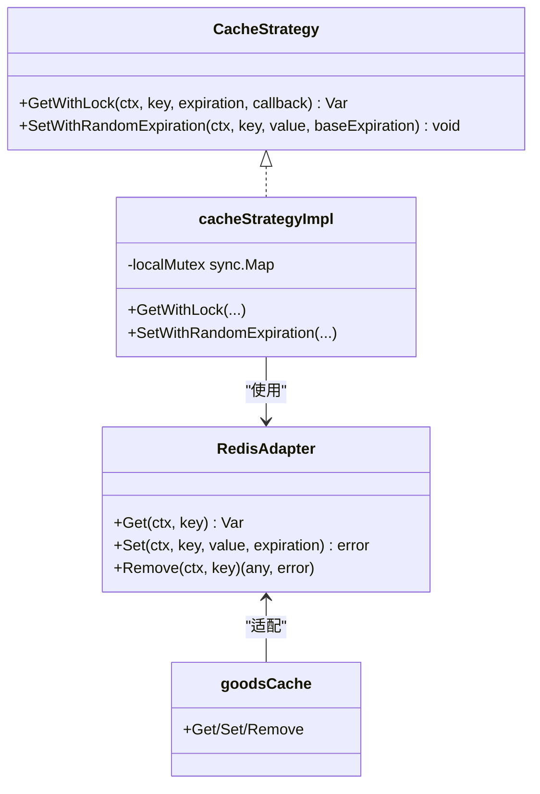
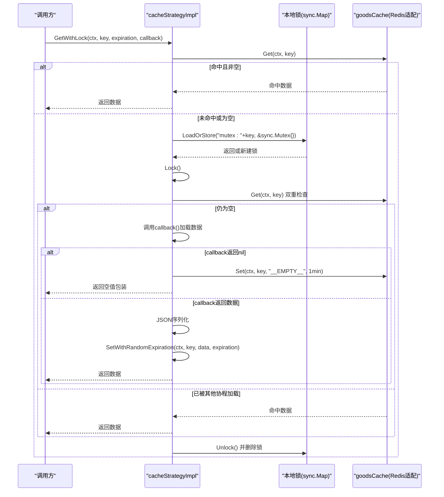
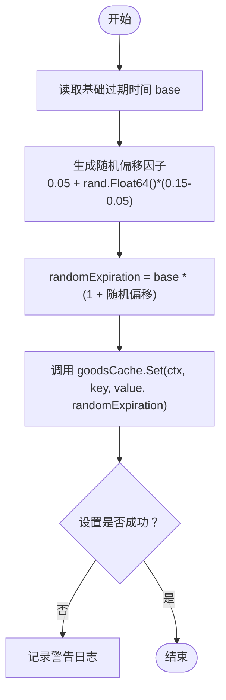
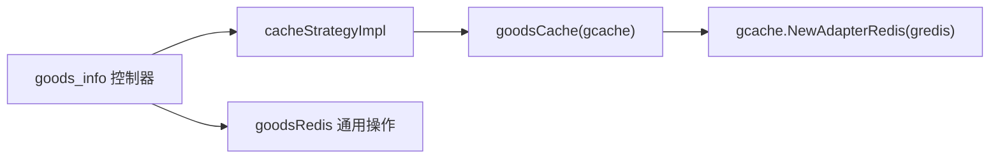

# 缓存实现细节

<cite>
**本文引用的文件**
- [cache_strategy.go](file://app/goods/utility/goodsRedis/cache_strategy.go)
- [goods.go](file://app/goods/utility/goodsRedis/goods.go)
- [redis.go](file://app/goods/utility/goodsRedis/redis.go)
- [goods_info.go](file://app/goods/internal/controller/goods_info/goods_info.go)
- [Redis缓存策略-穿透-击穿-雪崩全解决方案.md](file://doc/Redis缓存策略-穿透-击穿-雪崩全解决方案.md)
</cite>

## 目录
1. [简介](#简介)
2. [项目结构](#项目结构)
3. [核心组件](#核心组件)
4. [架构总览](#架构总览)
5. [详细组件分析](#详细组件分析)
6. [依赖关系分析](#依赖关系分析)
7. [性能考量](#性能考量)
8. [故障排查指南](#故障排查指南)
9. [结论](#结论)

## 简介
本文聚焦于商品服务中的缓存实现细节，深入解析 cacheStrategyImpl 的具体实现，涵盖 GetWithLock 方法的完整流程（缓存查询、双重检查、本地锁机制、回调函数调用）、SetWithRandomExpiration 方法的随机过期时间算法（5%-15% 随机偏移的数学原理与防雪崩效果）、本地锁的实现机制（sync.Map 的使用与锁生命周期管理），并提供具体的执行流程图与最佳实践，帮助开发者系统性地理解并解决缓存穿透、击穿、雪崩问题。

## 项目结构
缓存相关代码集中在商品服务的 goodsRedis 工具包中，配合 Redis 初始化与通用缓存操作，形成“缓存策略层 + 缓存适配层”的分层架构。



图表来源
- [cache_strategy.go](file://app/goods/utility/goodsRedis/cache_strategy.go#L1-L96)
- [redis.go](file://app/goods/utility/goodsRedis/redis.go#L1-L49)
- [goods.go](file://app/goods/utility/goodsRedis/goods.go#L1-L121)
- [goods_info.go](file://app/goods/internal/controller/goods_info/goods_info.go#L1-L257)

章节来源
- [cache_strategy.go](file://app/goods/utility/goodsRedis/cache_strategy.go#L1-L96)
- [redis.go](file://app/goods/utility/goodsRedis/redis.go#L1-L49)
- [goods.go](file://app/goods/utility/goodsRedis/goods.go#L1-L121)
- [goods_info.go](file://app/goods/internal/controller/goods_info/goods_info.go#L1-L257)

## 核心组件
- 缓存策略接口与实现
  - 接口定义：GetWithLock、SetWithRandomExpiration 等
  - 实现类：cacheStrategyImpl
- 本地锁机制
  - 使用 sync.Map 存储互斥锁，键为缓存键，值为 sync.Mutex
- Redis 缓存适配
  - 通过 gcache.NewAdapterRedis 初始化 Redis 适配器
  - goodsCache 作为全局缓存实例
- 通用缓存操作
  - GetGoodsDetail/SetGoodsDetail/DeleteGoodsDetail 等封装

章节来源
- [cache_strategy.go](file://app/goods/utility/goodsRedis/cache_strategy.go#L18-L30)
- [cache_strategy.go](file://app/goods/utility/goodsRedis/cache_strategy.go#L15-L16)
- [redis.go](file://app/goods/utility/goodsRedis/redis.go#L11-L34)
- [goods.go](file://app/goods/utility/goodsRedis/goods.go#L12-L36)

## 架构总览
缓存策略层通过统一接口对外提供能力，内部结合本地锁与随机过期时间，既防止缓存击穿，又缓解缓存雪崩；同时通过空值缓存标记防止缓存穿透。



图表来源
- [cache_strategy.go](file://app/goods/utility/goodsRedis/cache_strategy.go#L18-L30)
- [cache_strategy.go](file://app/goods/utility/goodsRedis/cache_strategy.go#L32-L90)
- [redis.go](file://app/goods/utility/goodsRedis/redis.go#L33-L34)

## 详细组件分析

### GetWithLock 方法完整流程
GetWithLock 是防止缓存击穿的核心流程，采用“缓存查询 + 本地锁 + 双重检查 + 回调加载 + 随机过期”的组合策略。



图表来源
- [cache_strategy.go](file://app/goods/utility/goodsRedis/cache_strategy.go#L32-L78)
- [cache_strategy.go](file://app/goods/utility/goodsRedis/cache_strategy.go#L15-L16)

章节来源
- [cache_strategy.go](file://app/goods/utility/goodsRedis/cache_strategy.go#L32-L78)

### SetWithRandomExpiration 随机过期时间算法
SetWithRandomExpiration 通过在基础过期时间上叠加 5%-15% 的随机偏移，避免大量缓存同时过期引发的雪崩效应。



图表来源
- [cache_strategy.go](file://app/goods/utility/goodsRedis/cache_strategy.go#L80-L90)

章节来源
- [cache_strategy.go](file://app/goods/utility/goodsRedis/cache_strategy.go#L80-L90)

### 本地锁实现机制与生命周期
- 锁存储：使用 sync.Map 以“mutex:{key}”为键存储 sync.Mutex，避免为所有可能键创建锁对象，节省内存。
- 生命周期：
  - 获取：LoadOrStore 返回或新建锁
  - 加锁：Lock() 进入临界区
  - 双重检查：解锁前再次查询缓存，避免重复加载
  - 解锁：Unlock() 释放锁
  - 清理：defer 中删除锁，避免内存泄漏

```mermaid
flowchart TD
A["进入 GetWithLock"] --> B["计算 mutexKey = \"mutex:\" + key"]
B --> C["localMutex.LoadOrStore(mutexKey, &sync.Mutex{})"]
C --> D["Lock()"]
D --> E["双重检查：再次 Get(ctx, key)"]
E --> F{"缓存是否已存在？"}
F --> |是| G["Unlock() 并删除锁"]
F --> |否| H["调用 callback() 加载数据"]
H --> I["序列化/设置随机过期缓存"]
I --> J["Unlock() 并删除锁"]
```

图表来源
- [cache_strategy.go](file://app/goods/utility/goodsRedis/cache_strategy.go#L40-L47)
- [cache_strategy.go](file://app/goods/utility/goodsRedis/cache_strategy.go#L49-L53)

章节来源
- [cache_strategy.go](file://app/goods/utility/goodsRedis/cache_strategy.go#L15-L16)
- [cache_strategy.go](file://app/goods/utility/goodsRedis/cache_strategy.go#L40-L47)
- [cache_strategy.go](file://app/goods/utility/goodsRedis/cache_strategy.go#L49-L53)

### 缓存穿透、击穿、雪崩的综合解决方案
- 缓存穿透：通过空值缓存标记（如 "__EMPTY__"）与短过期时间（如 1 分钟）拦截不存在的请求，避免打到数据库。
- 缓存击穿：通过本地锁 + 双重检查，确保同一时刻仅一个协程加载数据，其余协程从缓存返回。
- 缓存雪崩：通过随机过期时间（5%-15% 偏移）打散缓存过期时间，避免集中过期。

章节来源
- [cache_strategy.go](file://app/goods/utility/goodsRedis/cache_strategy.go#L61-L66)
- [cache_strategy.go](file://app/goods/utility/goodsRedis/cache_strategy.go#L80-L90)
- [goods.go](file://app/goods/utility/goodsRedis/goods.go#L18-L23)

### Redis 初始化与缓存适配
- 初始化：从配置读取 Redis 连接信息，创建 gredis.New，再通过 gcache.NewAdapterRedis 构建适配器。
- 实例：全局 goodsCache 作为统一缓存入口，提供 Get/Set/Remove 能力。

章节来源
- [redis.go](file://app/goods/utility/goodsRedis/redis.go#L13-L43)
- [redis.go](file://app/goods/utility/goodsRedis/redis.go#L11-L11)

### 业务控制器中的使用示例
- 控制器在获取商品详情时，优先尝试从 Redis 获取；若未命中或为空标记，则回退到数据库，并在成功后异步设置缓存。
- 更新操作后删除缓存，避免脏读。

章节来源
- [goods_info.go](file://app/goods/internal/controller/goods_info/goods_info.go#L94-L159)
- [goods_info.go](file://app/goods/internal/controller/goods_info/goods_info.go#L175-L194)

## 依赖关系分析
- cacheStrategyImpl 依赖 goodsCache（gcache + Redis 适配器）
- goodsCache 依赖 gredis 与 gcache
- 业务控制器依赖 goodsRedis 的通用缓存操作与缓存策略



图表来源
- [cache_strategy.go](file://app/goods/utility/goodsRedis/cache_strategy.go#L32-L90)
- [redis.go](file://app/goods/utility/goodsRedis/redis.go#L33-L34)
- [goods_info.go](file://app/goods/internal/controller/goods_info/goods_info.go#L94-L159)

章节来源
- [cache_strategy.go](file://app/goods/utility/goodsRedis/cache_strategy.go#L32-L90)
- [redis.go](file://app/goods/utility/goodsRedis/redis.go#L33-L34)
- [goods_info.go](file://app/goods/internal/controller/goods_info/goods_info.go#L94-L159)

## 性能考量
- 本地锁粒度：以“mutex:{key}”为粒度，避免全局锁竞争，提升并发吞吐。
- 双重检查：减少不必要的数据库访问，提高命中率。
- 随机过期：打散过期时间，降低雪崩风险，但需注意随机数种子初始化。
- 异步写入：设置缓存时使用短超时上下文，避免阻塞主流程。
- 序列化成本：JSON 序列化/反序列化带来额外开销，建议对大对象进行压缩或分层缓存。

## 故障排查指南
- 缓存未命中：检查键生成规则与空值标记识别逻辑。
- 锁未释放：确认 defer 中的 Unlock 与锁删除逻辑是否执行。
- 雪崩现象：检查随机过期是否生效，确认随机数种子初始化。
- 写入失败：关注 goodsCache.Set 的返回错误与日志输出。
- 并发冲突：观察本地锁是否正确命中，避免锁粒度过粗导致竞争。

章节来源
- [cache_strategy.go](file://app/goods/utility/goodsRedis/cache_strategy.go#L87-L89)
- [cache_strategy.go](file://app/goods/utility/goodsRedis/cache_strategy.go#L92-L95)
- [goods.go](file://app/goods/utility/goodsRedis/goods.go#L107-L117)

## 结论
通过 cacheStrategyImpl 的 GetWithLock 与 SetWithRandomExpiration，结合本地锁与空值缓存标记，系统在缓存穿透、击穿、雪崩三方面形成了完整的防护闭环。建议在生产环境中持续监控缓存命中率、过期分布与锁竞争情况，按业务特征动态调整过期时间与随机偏移范围，以达到最佳性能与稳定性平衡。