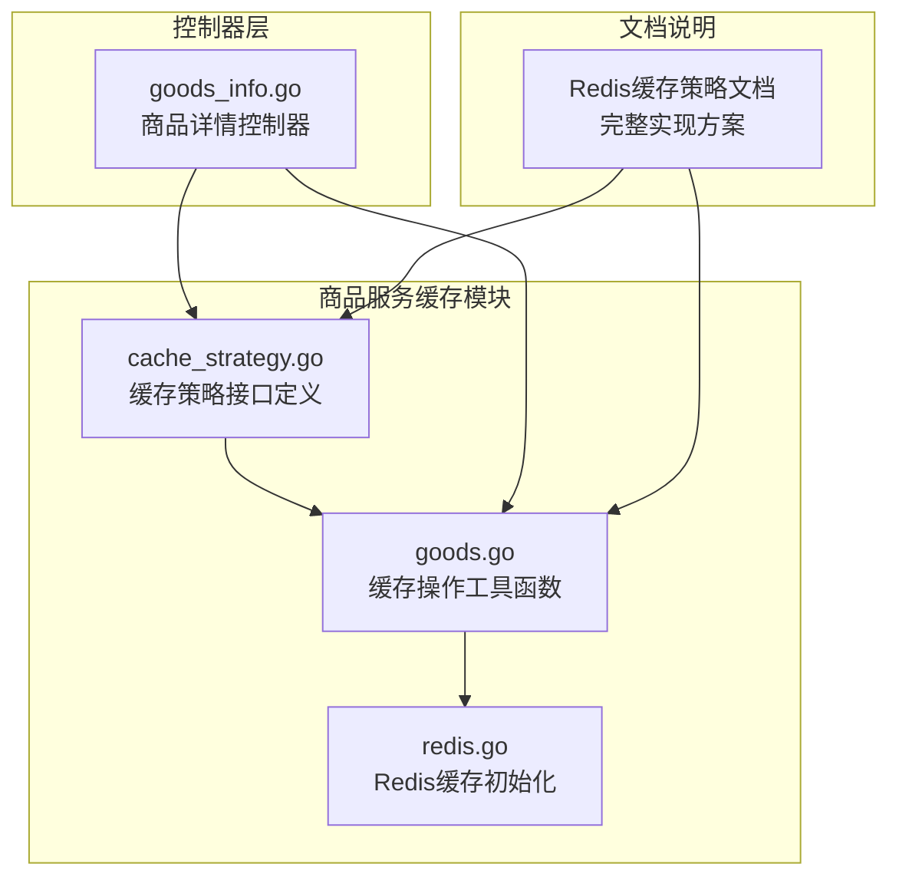
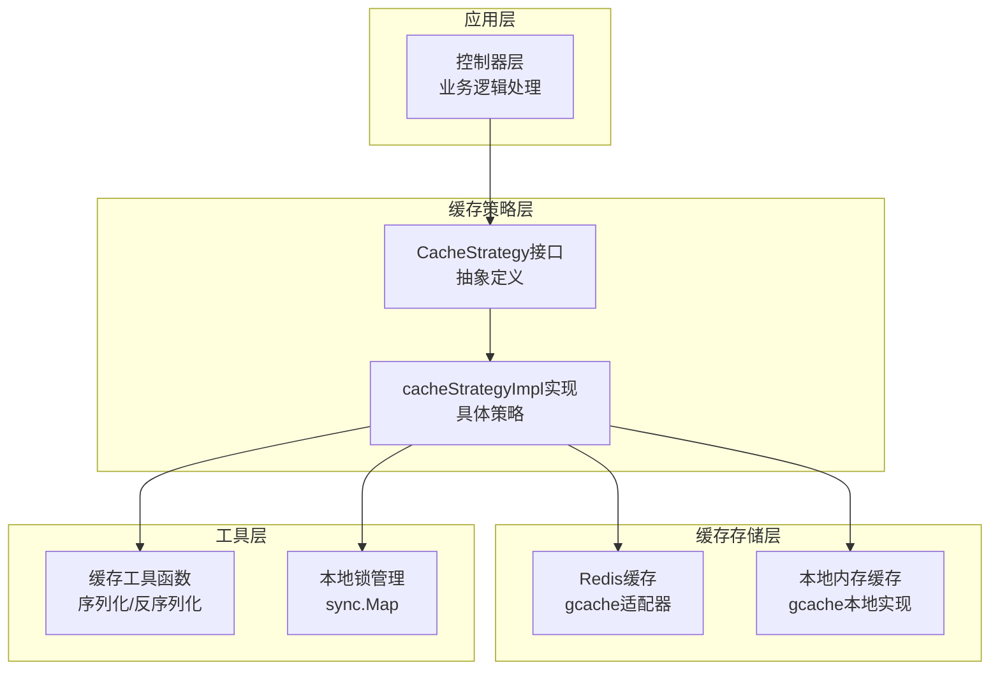
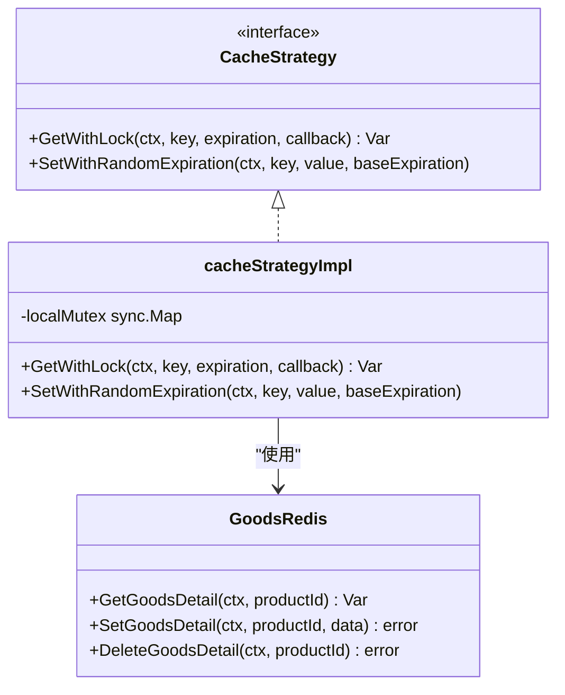
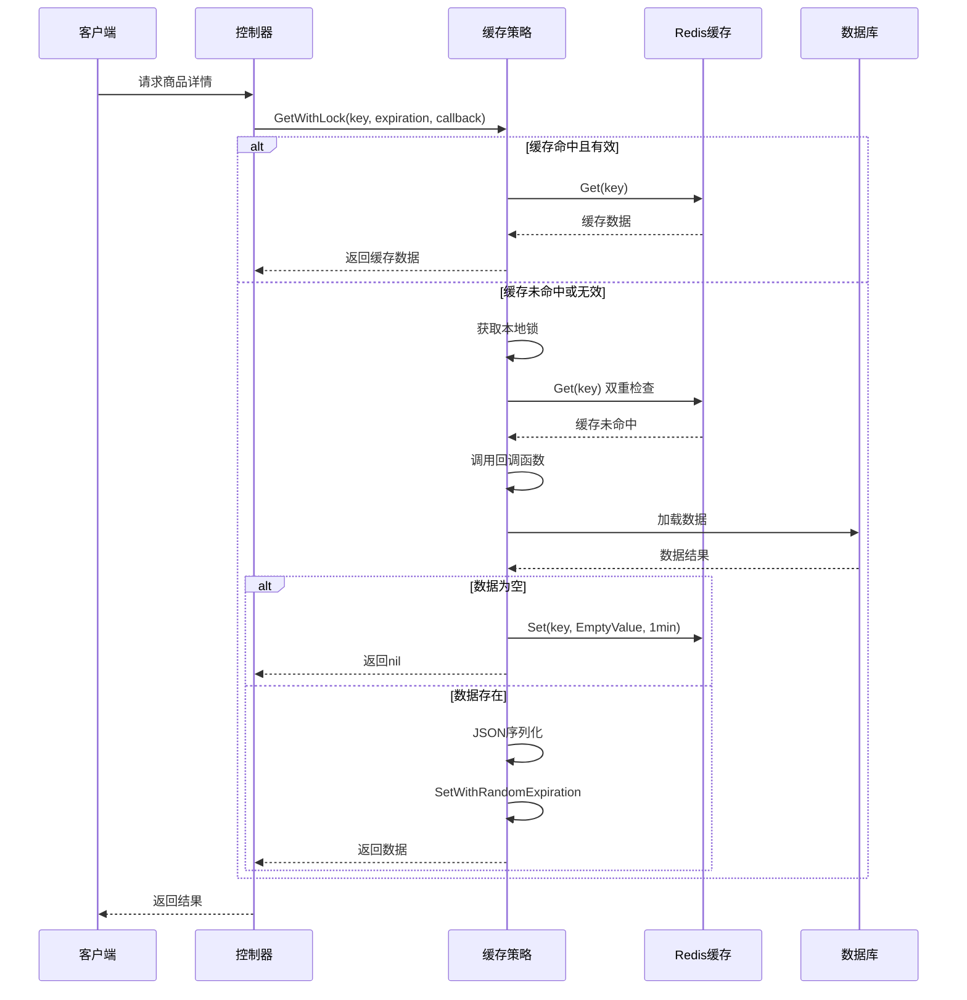
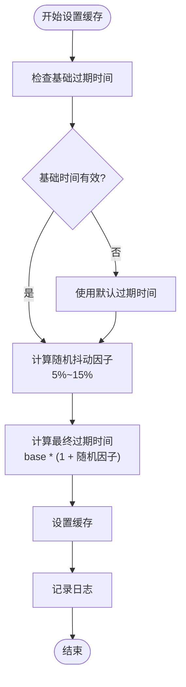
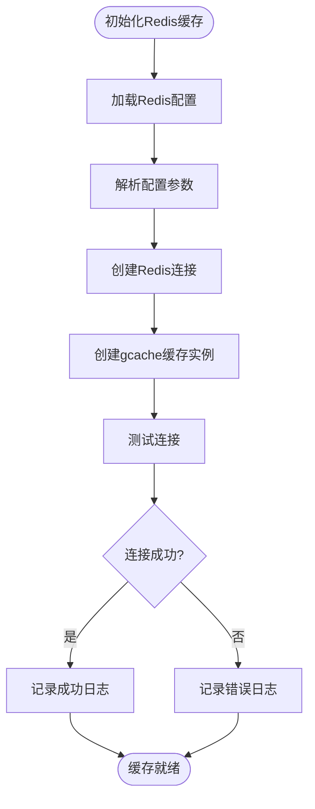
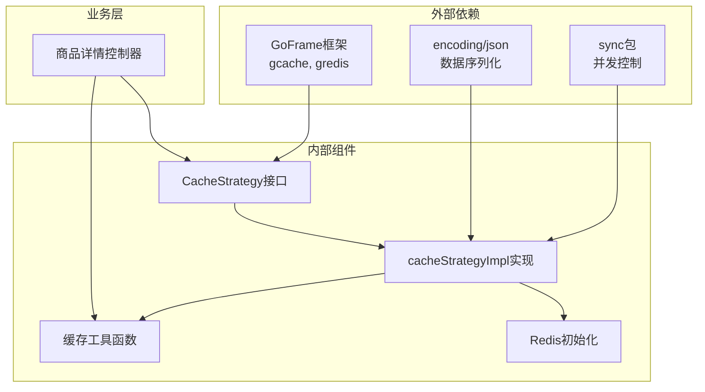

# 缓存策略接口设计

<cite>
**本文档引用的文件**
- [cache_strategy.go](file://app/goods/utility/goodsRedis/cache_strategy.go)
- [goods.go](file://app/goods/utility/goodsRedis/goods.go)
- [redis.go](file://app/goods/utility/goodsRedis/redis.go)
- [goods_info.go](file://app/goods/internal/controller/goods_info/goods_info.go)
- [Redis缓存策略-穿透-击穿-雪崩全解决方案.md](file://doc/Redis缓存策略-穿透-击穿-雪崩全解决方案.md)
</cite>

## 目录
1. [简介](#简介)
2. [项目结构](#项目结构)
3. [核心组件](#核心组件)
4. [架构概览](#架构概览)
5. [详细组件分析](#详细组件分析)
6. [依赖关系分析](#依赖关系分析)
7. [性能考量](#性能考量)
8. [故障排除指南](#故障排除指南)
9. [结论](#结论)

## 简介

本文档深入分析了基于GoFrame框架的缓存策略接口设计。该设计实现了两个关键接口方法：`GetWithLock`和`SetWithRandomExpiration`，旨在解决微服务架构中的缓存穿透、缓存击穿和缓存雪崩三大核心问题。

该缓存策略接口设计采用抽象接口模式，通过接口定义统一的缓存操作规范，支持不同缓存实现策略的灵活替换，为微服务系统的高性能缓存提供了标准化解决方案。

## 项目结构

该项目是一个基于GoFrame框架的微服务电商系统，缓存策略相关的核心文件位于商品服务模块中：

**图表来源**
- [cache_strategy.go](file://app/goods/utility/goodsRedis/cache_strategy.go#L1-L96)
- [goods.go](file://app/goods/utility/goodsRedis/goods.go#L1-L121)
- [redis.go](file://app/goods/utility/goodsRedis/redis.go#L1-L49)

**章节来源**
- [cache_strategy.go](file://app/goods/utility/goodsRedis/cache_strategy.go#L1-L96)
- [goods.go](file://app/goods/utility/goodsRedis/goods.go#L1-L121)
- [redis.go](file://app/goods/utility/goodsRedis/redis.go#L1-L49)

## 核心组件

### CacheStrategy 接口设计

CacheStrategy接口定义了缓存策略的核心抽象，包含两个关键方法：

#### GetWithLock 方法
- **职责**：带分布式锁的缓存获取，防止缓存击穿
- **参数**：
  - `ctx context.Context`：请求上下文，支持超时和取消
  - `key string`：缓存键
  - `expiration time.Duration`：基础过期时间
  - `callback func() (interface{}, error)`：数据加载回调函数
- **返回值**：缓存数据和错误信息

#### SetWithRandomExpiration 方法
- **职责**：设置带随机过期时间的缓存，防止缓存雪崩
- **参数**：
  - `ctx context.Context`：请求上下文
  - `key string`：缓存键
  - `value interface{}`：缓存值
  - `baseExpiration time.Duration`：基础过期时间
- **返回值**：无（错误通过日志记录）

**章节来源**
- [cache_strategy.go](file://app/goods/utility/goodsRedis/cache_strategy.go#L18-L22)

## 架构概览

该缓存策略采用分层架构设计，实现了缓存策略的解耦和灵活替换：

**图表来源**
- [cache_strategy.go](file://app/goods/utility/goodsRedis/cache_strategy.go#L24-L30)
- [redis.go](file://app/goods/utility/goodsRedis/redis.go#L11-L11)

## 详细组件分析

### CacheStrategy 接口实现

#### cacheStrategyImpl 结构体
实现了CacheStrategy接口的具体缓存策略类，包含以下核心特性：

**图表来源**
- [cache_strategy.go](file://app/goods/utility/goodsRedis/cache_strategy.go#L18-L30)
- [goods.go](file://app/goods/utility/goodsRedis/goods.go#L12-L16)

#### GetWithLock 方法详细流程

**图表来源**
- [cache_strategy.go](file://app/goods/utility/goodsRedis/cache_strategy.go#L32-L78)

#### SetWithRandomExpiration 方法实现

该方法通过添加5%-15%的随机抖动来防止缓存雪崩：

**图表来源**
- [cache_strategy.go](file://app/goods/utility/goodsRedis/cache_strategy.go#L80-L90)

**章节来源**
- [cache_strategy.go](file://app/goods/utility/goodsRedis/cache_strategy.go#L32-L90)

### 缓存工具函数

#### 缓存键管理
系统定义了标准的缓存键命名规范：
- `GoodsDetailKey`：商品详情缓存键前缀
- `categoryAllKey`：分类全量数据缓存键
- `EmptyValue`：空值缓存标记常量

#### 批量操作支持
提供了批量删除缓存的高级功能：
- `DeleteKeys`：支持批量删除多个缓存键
- 实现延迟双删策略，提高缓存一致性

**章节来源**
- [goods.go](file://app/goods/utility/goodsRedis/goods.go#L12-L16)
- [goods.go](file://app/goods/utility/goodsRedis/goods.go#L93-L120)

### Redis 缓存初始化

#### 初始化流程

**图表来源**
- [redis.go](file://app/goods/utility/goodsRedis/redis.go#L13-L43)

**章节来源**
- [redis.go](file://app/goods/utility/goodsRedis/redis.go#L13-L49)

## 依赖关系分析

### 组件依赖图

**图表来源**
- [cache_strategy.go](file://app/goods/utility/goodsRedis/cache_strategy.go#L3-L13)
- [goods.go](file://app/goods/utility/goodsRedis/goods.go#L3-L10)

### 关键依赖特性

1. **GoFrame集成**：完全基于GoFrame框架的gcache和gredis组件
2. **并发安全**：使用sync.Map实现线程安全的本地锁管理
3. **序列化支持**：内置JSON序列化机制确保数据一致性
4. **上下文支持**：全面支持context.Context进行超时和取消控制

**章节来源**
- [cache_strategy.go](file://app/goods/utility/goodsRedis/cache_strategy.go#L3-L13)
- [goods.go](file://app/goods/utility/goodsRedis/goods.go#L3-L10)

## 性能考量

### 缓存性能优化策略

#### 1. 缓存穿透防护
- 空值缓存标记机制
- 短时间过期策略（1分钟）
- 防止恶意请求和异常数据

#### 2. 缓存击穿防护
- 本地锁机制防止并发击穿
- 双重检查缓存避免重复加载
- 本地锁使用sync.Map实现高效管理

#### 3. 缓存雪崩防护
- 随机抖动算法（5%-15%）
- 动态过期时间计算
- 避免大量缓存同时失效

#### 4. 内存管理
- 本地锁的及时清理
- 缓存数据的及时释放
- 内存泄漏的预防措施

## 故障排除指南

### 常见问题及解决方案

#### 1. 缓存初始化失败
**症状**：Redis连接失败，缓存功能不可用
**原因**：
- Redis配置错误
- 网络连接问题
- 权限认证失败

**解决方案**：
- 检查Redis配置参数
- 验证网络连通性
- 确认认证信息正确

#### 2. 缓存击穿问题
**症状**：高并发场景下数据库压力过大
**原因**：
- 本地锁未正确获取
- 缓存键设计不合理
- 并发访问控制不当

**解决方案**：
- 检查本地锁实现
- 优化缓存键命名
- 调整锁的超时时间

#### 3. 缓存一致性问题
**症状**：更新后读取到旧数据
**原因**：
- 缓存删除时机不当
- 批量操作失败
- 延迟双删策略未生效

**解决方案**：
- 实施延迟双删策略
- 检查批量删除逻辑
- 确认缓存更新顺序

**章节来源**
- [redis.go](file://app/goods/utility/goodsRedis/redis.go#L14-L43)
- [cache_strategy.go](file://app/goods/utility/goodsRedis/cache_strategy.go#L32-L78)

## 结论

该缓存策略接口设计通过抽象接口模式实现了缓存功能的标准化和模块化，具有以下优势：

### 设计优势
1. **高度抽象**：通过接口定义统一的缓存操作规范
2. **灵活替换**：支持不同缓存实现策略的无缝切换
3. **性能优化**：针对缓存穿透、击穿、雪崩问题提供专门解决方案
4. **并发安全**：完善的并发控制机制确保线程安全

### 扩展性考虑
1. **接口扩展**：可根据需求添加更多缓存操作方法
2. **实现多样化**：支持Redis、Memcached、本地内存等多种实现
3. **配置灵活**：支持动态配置缓存参数和策略
4. **监控集成**：可轻松集成缓存性能监控和统计

### 最佳实践建议
1. **合理设计缓存键**：遵循统一的命名规范
2. **正确使用上下文**：合理设置超时和取消机制
3. **监控缓存性能**：建立缓存命中率和性能指标监控
4. **定期维护缓存**：及时清理过期和无效缓存数据

该设计为微服务架构下的缓存管理提供了标准化的解决方案，既保证了系统的高性能，又确保了代码的可维护性和可扩展性。