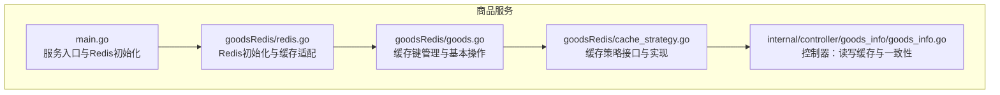
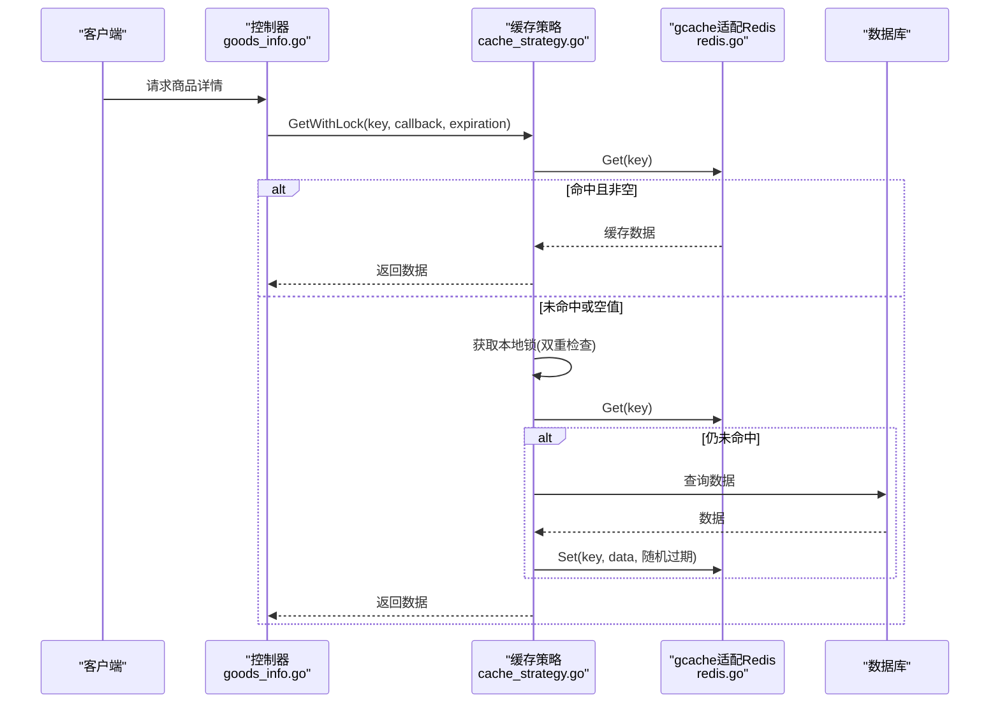
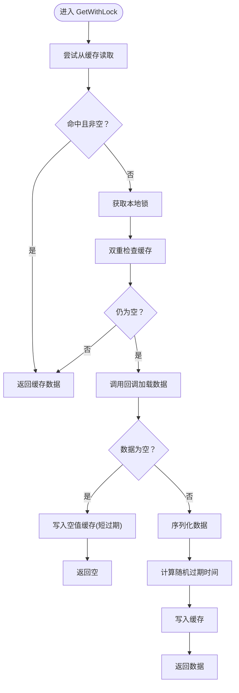
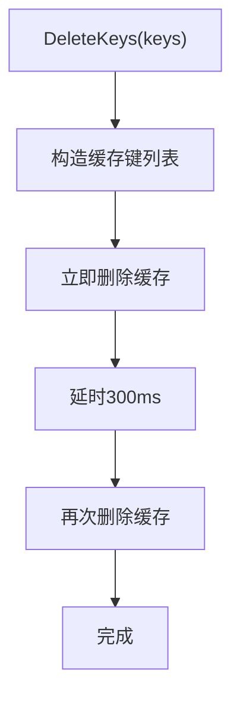
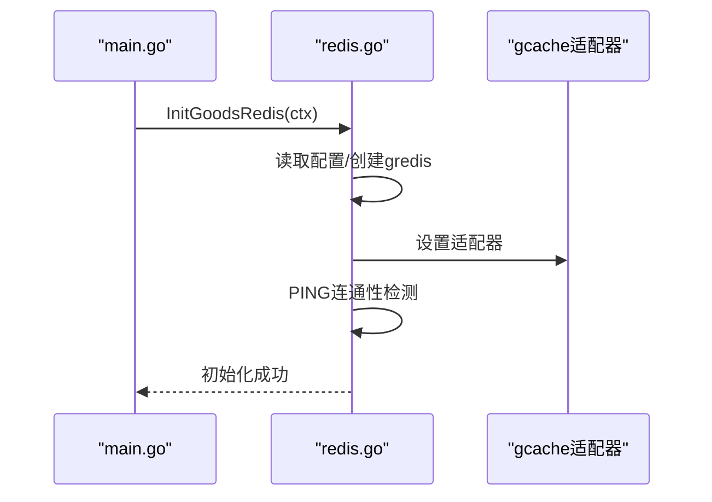
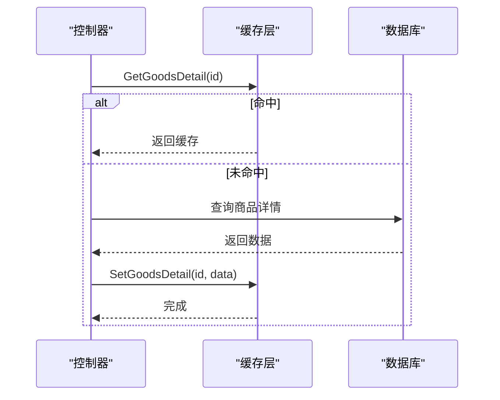
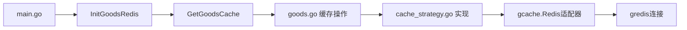

# 缓存策略设计

<cite>
**本文引用的文件**
- [app/goods/utility/goodsRedis/cache_strategy.go](file://app/goods/utility/goodsRedis/cache_strategy.go)
- [app/goods/utility/goodsRedis/goods.go](file://app/goods/utility/goodsRedis/goods.go)
- [app/goods/utility/goodsRedis/redis.go](file://app/goods/utility/goodsRedis/redis.go)
- [app/goods/internal/controller/goods_info/goods_info.go](file://app/goods/internal/controller/goods_info/goods_info.go)
- [app/goods/main.go](file://app/goods/main.go)
- [doc/Redis缓存策略-穿透-击穿-雪崩全解决方案.md](file://doc/Redis缓存策略-穿透-击穿-雪崩全解决方案.md)
- [app/goods/utility/stock/distributed_lock.go](file://app/goods/utility/stock/distributed_lock.go)
- [app/goods/utility/stock/redis_lua.go](file://app/goods/utility/stock/redis_lua.go)
</cite>

## 目录
1. [简介](#简介)
2. [项目结构](#项目结构)
3. [核心组件](#核心组件)
4. [架构总览](#架构总览)
5. [详细组件分析](#详细组件分析)
6. [依赖关系分析](#依赖关系分析)
7. [性能考量](#性能考量)
8. [故障排查指南](#故障排查指南)
9. [结论](#结论)
10. [附录](#附录)

## 简介
本文件面向“缓存策略设计”，围绕Redis缓存穿透、击穿、雪崩三大问题，系统阐述项目中实现的完整解决方案，包括接口设计、空值缓存、本地锁防击穿、随机过期时间防雪崩、缓存键管理、延迟双删策略、缓存一致性保障等。文档提供在商品服务中的具体落地方式与最佳实践，帮助读者在高并发场景下稳定、高效地使用Redis缓存。

## 项目结构
本项目采用微服务分层架构，商品服务内的缓存策略集中在 goodsRedis 子包中，配合控制器层完成缓存读写与一致性控制；库存模块提供分布式锁与Lua脚本保障高并发下的库存安全。

图表来源
- [app/goods/main.go](file://app/goods/main.go#L15-L34)
- [app/goods/utility/goodsRedis/redis.go](file://app/goods/utility/goodsRedis/redis.go#L13-L48)
- [app/goods/utility/goodsRedis/goods.go](file://app/goods/utility/goodsRedis/goods.go#L12-L16)
- [app/goods/utility/goodsRedis/cache_strategy.go](file://app/goods/utility/goodsRedis/cache_strategy.go#L18-L30)
- [app/goods/internal/controller/goods_info/goods_info.go](file://app/goods/internal/controller/goods_info/goods_info.go#L94-L159)

章节来源
- [app/goods/main.go](file://app/goods/main.go#L15-L34)
- [app/goods/utility/goodsRedis/redis.go](file://app/goods/utility/goodsRedis/redis.go#L13-L48)
- [app/goods/utility/goodsRedis/goods.go](file://app/goods/utility/goodsRedis/goods.go#L12-L16)
- [app/goods/utility/goodsRedis/cache_strategy.go](file://app/goods/utility/goodsRedis/cache_strategy.go#L18-L30)
- [app/goods/internal/controller/goods_info/goods_info.go](file://app/goods/internal/controller/goods_info/goods_info.go#L94-L159)

## 核心组件
- 缓存策略接口与实现
  - 接口定义：GetWithLock、SetWithRandomExpiration 等，统一缓存行为，便于扩展与替换。
  - 实现要点：本地锁防击穿、空值缓存防穿透、随机过期时间防雪崩。
- 缓存键管理与基本操作
  - 统一前缀与命名规范：如 goods:detail:{id}、category:all:data。
  - 基本操作：设置、获取、删除、批量删除、空值缓存。
- Redis初始化与适配
  - 通过 gcache 的 Redis 适配器接入，支持 PING 连通性检测。
- 控制器层的缓存使用
  - 优先读缓存，未命中再回源数据库；更新后删除缓存，保障一致性。
- 库存模块的并发安全
  - 分布式锁与Lua脚本，确保扣减/返还库存的原子性与一致性。

章节来源
- [app/goods/utility/goodsRedis/cache_strategy.go](file://app/goods/utility/goodsRedis/cache_strategy.go#L18-L95)
- [app/goods/utility/goodsRedis/goods.go](file://app/goods/utility/goodsRedis/goods.go#L12-L16)
- [app/goods/utility/goodsRedis/redis.go](file://app/goods/utility/goodsRedis/redis.go#L11-L48)
- [app/goods/internal/controller/goods_info/goods_info.go](file://app/goods/internal/controller/goods_info/goods_info.go#L94-L159)
- [app/goods/utility/stock/distributed_lock.go](file://app/goods/utility/stock/distributed_lock.go#L13-L89)
- [app/goods/utility/stock/redis_lua.go](file://app/goods/utility/stock/redis_lua.go#L12-L165)

## 架构总览
下图展示了缓存策略在商品服务中的整体交互：控制器发起读写请求，策略层负责并发控制与过期策略，底层通过 gcache 的 Redis 适配器访问 Redis。

图表来源
- [app/goods/internal/controller/goods_info/goods_info.go](file://app/goods/internal/controller/goods_info/goods_info.go#L94-L159)
- [app/goods/utility/goodsRedis/cache_strategy.go](file://app/goods/utility/goodsRedis/cache_strategy.go#L32-L78)
- [app/goods/utility/goodsRedis/redis.go](file://app/goods/utility/goodsRedis/redis.go#L33-L34)

## 详细组件分析

### 缓存策略接口与实现
- 接口职责
  - GetWithLock：带本地锁的缓存获取，防止缓存击穿。
  - SetWithRandomExpiration：设置带随机过期时间的缓存，缓解雪崩。
- 并发控制
  - 使用 sync.Map 为每个 key 维护本地互斥锁，进入临界区后进行双重检查，避免惊群效应。
- 空值缓存
  - 当回调返回空值时，写入短时过期的空值标记，防止缓存穿透。
- 随机过期
  - 在基础过期时间上叠加 5%~15% 的随机抖动，避免大量缓存在同一时刻过期。

图表来源
- [app/goods/utility/goodsRedis/cache_strategy.go](file://app/goods/utility/goodsRedis/cache_strategy.go#L32-L90)

章节来源
- [app/goods/utility/goodsRedis/cache_strategy.go](file://app/goods/utility/goodsRedis/cache_strategy.go#L18-L95)

### 缓存键管理与基本操作
- 键命名规范
  - 商品详情：goods:detail:{id}
  - 分类全量：category:all:data
- 基本操作
  - 设置/获取/删除商品详情缓存；设置/获取/删除分类全量缓存；批量删除缓存并延迟双删。
- 空值缓存
  - 对不存在的数据写入短时过期的空值标记，拦截后续请求直达数据库。

图表来源
- [app/goods/utility/goodsRedis/goods.go](file://app/goods/utility/goodsRedis/goods.go#L93-L120)

章节来源
- [app/goods/utility/goodsRedis/goods.go](file://app/goods/utility/goodsRedis/goods.go#L12-L16)
- [app/goods/utility/goodsRedis/goods.go](file://app/goods/utility/goodsRedis/goods.go#L93-L120)

### Redis初始化与适配
- 初始化流程
  - 从配置读取 Redis 连接参数，创建 gredis 实例，设置为 gcache 的适配器，最后 PING 检测连通性。
- 服务启动时调用
  - main 中在启动命令之前完成 Redis 初始化，确保后续缓存可用。

图表来源
- [app/goods/main.go](file://app/goods/main.go#L22-L26)
- [app/goods/utility/goodsRedis/redis.go](file://app/goods/utility/goodsRedis/redis.go#L14-L42)

章节来源
- [app/goods/main.go](file://app/goods/main.go#L22-L26)
- [app/goods/utility/goodsRedis/redis.go](file://app/goods/utility/goodsRedis/redis.go#L14-L48)

### 控制器层的缓存使用与一致性
- 读路径
  - 优先从缓存读取，命中则直接返回；未命中或空值标记则回源数据库，并将结果写入缓存。
- 写路径
  - 更新成功后删除缓存，避免脏读；可结合延迟双删进一步降低竞态窗口。
- 批量读取
  - 对已命中的缓存直接使用，未命中的走数据库批量查询，再合并结果。

图表来源
- [app/goods/internal/controller/goods_info/goods_info.go](file://app/goods/internal/controller/goods_info/goods_info.go#L94-L159)

章节来源
- [app/goods/internal/controller/goods_info/goods_info.go](file://app/goods/internal/controller/goods_info/goods_info.go#L94-L159)
- [app/goods/internal/controller/goods_info/goods_info.go](file://app/goods/internal/controller/goods_info/goods_info.go#L175-L194)

### 库存模块的并发安全（对比参考）
- 分布式锁
  - 使用 SET NX EX 原子加锁，Lua 脚本安全释放，避免误删。
- Lua脚本
  - 扣减/返还库存使用 EVAL 原子脚本，保证库存一致性。
- 与缓存策略的关系
  - 库存并发控制与缓存击穿防护互补：前者解决“写”的原子性，后者解决“读”的并发风暴。

章节来源
- [app/goods/utility/stock/distributed_lock.go](file://app/goods/utility/stock/distributed_lock.go#L46-L89)
- [app/goods/utility/stock/redis_lua.go](file://app/goods/utility/stock/redis_lua.go#L75-L125)

## 依赖关系分析
- 组件耦合
  - 控制器依赖缓存工具层；缓存工具层依赖 gcache 适配器；适配器依赖 gredis。
- 关键依赖链
  - main → InitGoodsRedis → GetGoodsCache → goodsRedis 方法 → gcache → gredis。
- 并发与一致性
  - 策略层通过本地锁与双重检查降低击穿风险；随机过期降低雪崩概率；延迟双删降低不一致窗口。

图表来源
- [app/goods/main.go](file://app/goods/main.go#L22-L26)
- [app/goods/utility/goodsRedis/redis.go](file://app/goods/utility/goodsRedis/redis.go#L33-L34)
- [app/goods/utility/goodsRedis/goods.go](file://app/goods/utility/goodsRedis/goods.go#L94-L120)
- [app/goods/utility/goodsRedis/cache_strategy.go](file://app/goods/utility/goodsRedis/cache_strategy.go#L32-L78)

章节来源
- [app/goods/main.go](file://app/goods/main.go#L22-L26)
- [app/goods/utility/goodsRedis/redis.go](file://app/goods/utility/goodsRedis/redis.go#L33-L34)
- [app/goods/utility/goodsRedis/goods.go](file://app/goods/utility/goodsRedis/goods.go#L94-L120)
- [app/goods/utility/goodsRedis/cache_strategy.go](file://app/goods/utility/goodsRedis/cache_strategy.go#L32-L78)

## 性能考量
- 过期时间设计
  - 常规数据：1小时；空值缓存：短时（如1分钟）；热点数据可适当缩短以降低击穿影响。
- 随机抖动
  - 5%~15% 的随机偏移，显著降低雪崩概率。
- 批量与异步
  - 设置缓存使用短超时上下文，避免阻塞主流程。
- 键设计
  - 规范化的键前缀与命名，便于运维与清理。

## 故障排查指南
- 缓存命中率低
  - 检查键设计是否合理、过期时间是否过短、是否频繁触发空值缓存。
- 缓存更新不及时
  - 确认删除缓存流程是否执行、延迟双删是否生效、是否遗漏某些更新路径。
- 并发击穿
  - 检查本地锁是否正确使用、双重检查是否遗漏、热点键是否过期过快。
- 雪崩风险
  - 核对随机过期是否启用、是否统一过期时间、是否进行缓存预热。
- 日志与监控
  - 关注缓存读写失败、空值缓存命中、延迟双删警告等日志。

章节来源
- [app/goods/utility/goodsRedis/cache_strategy.go](file://app/goods/utility/goodsRedis/cache_strategy.go#L86-L89)
- [app/goods/internal/controller/goods_info/goods_info.go](file://app/goods/internal/controller/goods_info/goods_info.go#L150-L157)

## 结论
本项目通过统一的缓存策略接口与实现，结合空值缓存、本地锁防击穿、随机过期防雪崩、延迟双删与规范的键管理，形成了一套完整且可扩展的缓存解决方案。在商品服务中，控制器层以最小侵入的方式复用策略层能力，既提升了性能，也增强了稳定性。建议在生产环境中持续监控命中率、延迟与错误率，并根据业务特征动态调整过期策略与预热策略。

## 附录
- 使用指南与最佳实践
  - 初始化：服务启动时调用 Redis 初始化。
  - 读取：优先使用 GetWithLock，传入键、加载函数与过期时间。
  - 更新：更新数据库后删除缓存，必要时配合延迟双删。
  - 键命名：采用“模块:类型:标识”规范，避免冲突与混淆。
- 参考文档
  - 项目内完整方案文档提供了更详细的实现细节与示例。

章节来源
- [doc/Redis缓存策略-穿透-击穿-雪崩全解决方案.md](file://doc/Redis缓存策略-穿透-击穿-雪崩全解决方案.md#L516-L587)