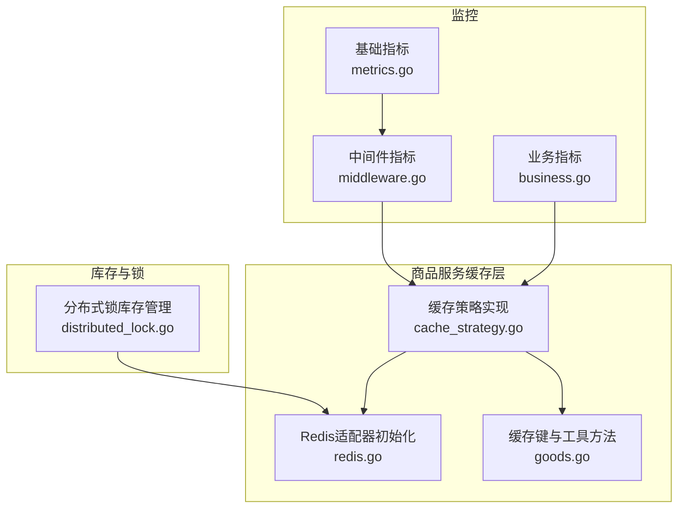
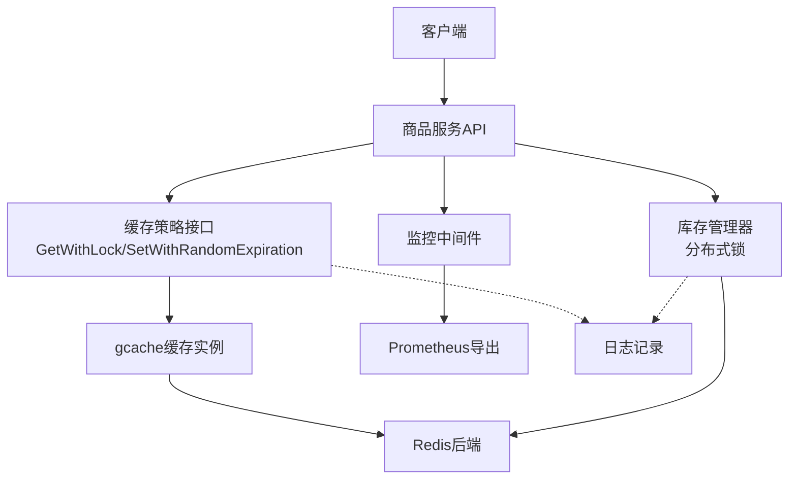
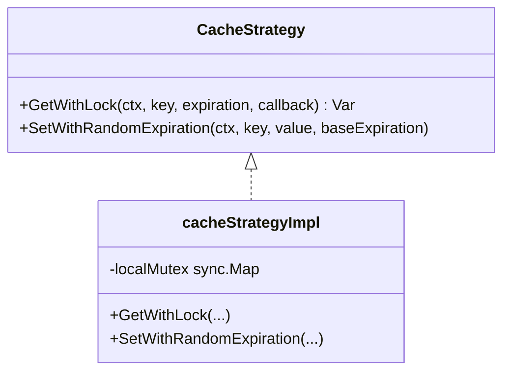
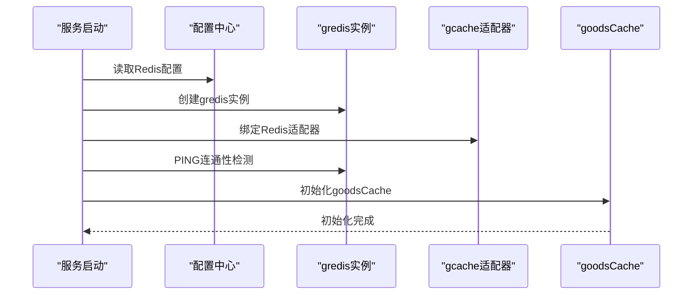
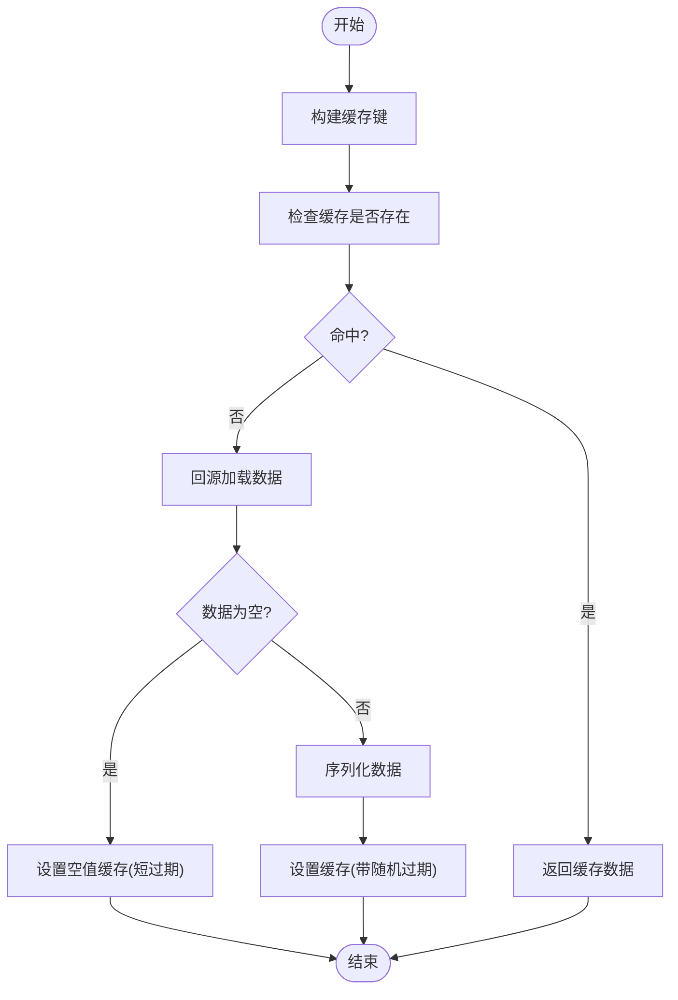
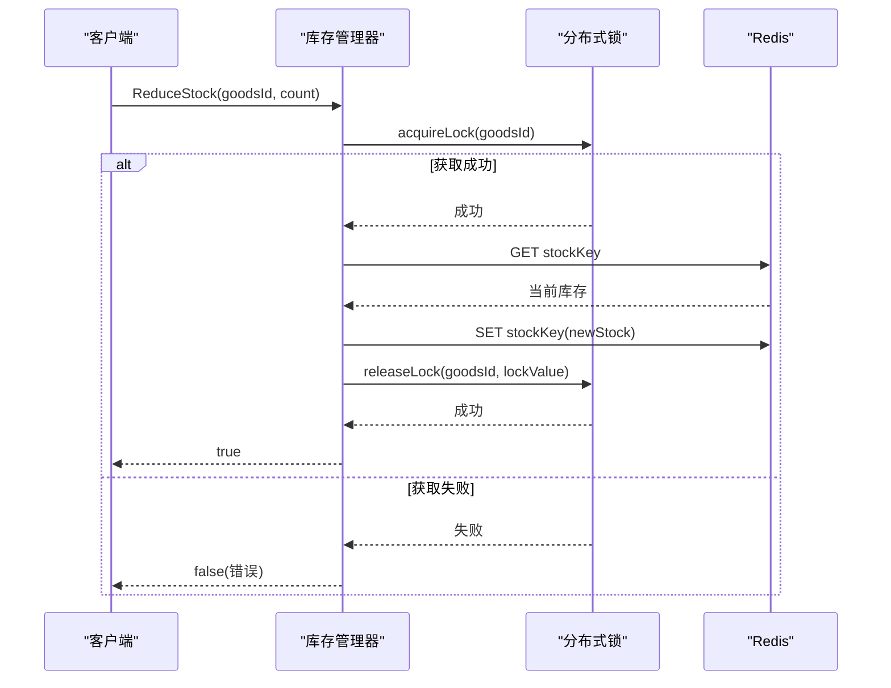
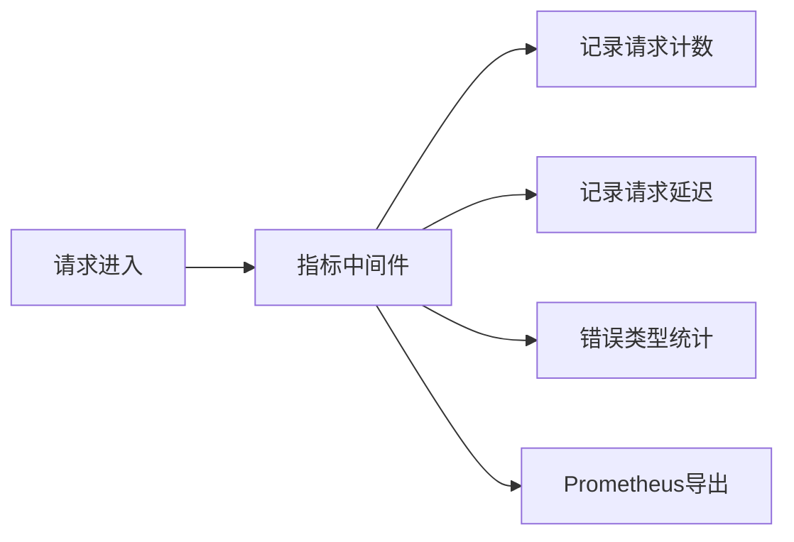
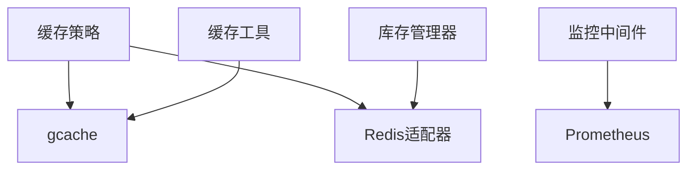

# 缓存问题解决方案

<cite>
**本文引用的文件**
- [Redis缓存策略-穿透-击穿-雪崩全解决方案.md](file://doc/Redis缓存策略-穿透-击穿-雪崩全解决方案.md)
- [cache_strategy.go](file://app/goods/utility/goodsRedis/cache_strategy.go)
- [redis.go](file://app/goods/utility/goodsRedis/redis.go)
- [goods.go](file://app/goods/utility/goodsRedis/goods.go)
- [distributed_lock.go](file://app/goods/utility/stock/distributed_lock.go)
- [metrics.go](file://utility/metrics/metrics.go)
- [middleware.go](file://utility/metrics/middleware.go)
- [business.go](file://utility/metrics/business.go)
</cite>

## 目录
1. [简介](#简介)
2. [项目结构](#项目结构)
3. [核心组件](#核心组件)
4. [架构总览](#架构总览)
5. [详细组件分析](#详细组件分析)
6. [依赖关系分析](#依赖关系分析)
7. [性能考量](#性能考量)
8. [故障排查指南](#故障排查指南)
9. [结论](#结论)
10. [附录](#附录)

## 简介
本文件面向缓存穿透、击穿、雪崩三大问题，结合项目现有实现，提供系统化的解决方案与落地实践。内容涵盖：
- 原理与危害
- 防护机制与实现要点
- 代码级流程图与时序图
- 监控指标与故障排查方法
- 性能对比与适用场景建议

## 项目结构
围绕缓存问题的解决方案，项目中涉及的关键目录与文件如下：
- 缓存策略实现：app/goods/utility/goodsRedis/cache_strategy.go、redis.go、goods.go
- 库存防超卖（与击穿治理相关）：app/goods/utility/stock/distributed_lock.go
- 监控指标：utility/metrics/metrics.go、middleware.go、business.go
- 文档与方案：doc/Redis缓存策略-穿透-击穿-雪崩全解决方案.md

图表来源
- [cache_strategy.go](file://app/goods/utility/goodsRedis/cache_strategy.go#L1-L96)
- [redis.go](file://app/goods/utility/goodsRedis/redis.go#L1-L49)
- [goods.go](file://app/goods/utility/goodsRedis/goods.go#L1-L121)
- [distributed_lock.go](file://app/goods/utility/stock/distributed_lock.go#L1-L266)
- [metrics.go](file://utility/metrics/metrics.go#L1-L71)
- [middleware.go](file://utility/metrics/middleware.go#L1-L62)
- [business.go](file://utility/metrics/business.go#L1-L69)

章节来源
- [cache_strategy.go](file://app/goods/utility/goodsRedis/cache_strategy.go#L1-L96)
- [redis.go](file://app/goods/utility/goodsRedis/redis.go#L1-L49)
- [goods.go](file://app/goods/utility/goodsRedis/goods.go#L1-L121)
- [distributed_lock.go](file://app/goods/utility/stock/distributed_lock.go#L1-L266)
- [metrics.go](file://utility/metrics/metrics.go#L1-L71)
- [middleware.go](file://utility/metrics/middleware.go#L1-L62)
- [business.go](file://utility/metrics/business.go#L1-L69)

## 核心组件
- 缓存策略接口与实现：统一的缓存策略接口，支持空值缓存、本地锁防击穿、随机过期时间防雪崩。
- Redis适配器初始化：封装gcache的Redis适配器，提供统一的缓存实例。
- 缓存键管理与工具：提供商品详情、分类等缓存键生成与批量删除、延迟双删等工具。
- 分布式锁库存管理：库存扣减/返还/查询的分布式锁实现，避免超卖与并发竞争。
- 监控指标：HTTP请求计数、延迟、错误计数与业务指标（订单、库存）采集与导出。

章节来源
- [cache_strategy.go](file://app/goods/utility/goodsRedis/cache_strategy.go#L18-L30)
- [redis.go](file://app/goods/utility/goodsRedis/redis.go#L13-L43)
- [goods.go](file://app/goods/utility/goodsRedis/goods.go#L12-L91)
- [distributed_lock.go](file://app/goods/utility/stock/distributed_lock.go#L13-L29)
- [metrics.go](file://utility/metrics/metrics.go#L14-L43)

## 架构总览
整体架构围绕“缓存策略 + Redis适配器 + 监控”展开，商品详情等热点数据通过缓存策略实现进行读取与更新；库存操作采用分布式锁保障一致性；监控中间件统一采集指标并暴露给Prometheus。

图表来源
- [cache_strategy.go](file://app/goods/utility/goodsRedis/cache_strategy.go#L32-L78)
- [redis.go](file://app/goods/utility/goodsRedis/redis.go#L33-L34)
- [distributed_lock.go](file://app/goods/utility/stock/distributed_lock.go#L92-L158)
- [metrics.go](file://utility/metrics/metrics.go#L45-L55)

## 详细组件分析

### 缓存策略接口与实现
- 接口职责
  - Get：从缓存读取，若命中返回；若未命中且提供loader则回源加载。
  - GetWithLock：带本地锁的读取，双重检查避免击穿。
  - SetWithRandomExpiration：设置带随机抖动过期时间的缓存，缓解雪崩。
  - SetEmptyValue：设置空值缓存，短时间过期，防止穿透。
- 关键实现点
  - 本地锁：使用sync.Map按key存储互斥锁，避免为所有可能键创建锁对象。
  - 双重检查：获取锁后再次检查缓存，避免重复回源。
  - 随机抖动：基础过期时间±5%~15%，打散过期时间。
  - 空值缓存：对不存在数据设置特殊标记与短过期时间。

图表来源
- [cache_strategy.go](file://app/goods/utility/goodsRedis/cache_strategy.go#L18-L30)
- [cache_strategy.go](file://app/goods/utility/goodsRedis/cache_strategy.go#L32-L90)

章节来源
- [cache_strategy.go](file://app/goods/utility/goodsRedis/cache_strategy.go#L18-L90)

### Redis适配器初始化
- 功能：从配置读取Redis连接信息，创建gredis实例并绑定到gcache适配器，提供Ping连通性检测。
- 使用：全局缓存实例goodsCache由该初始化函数创建，供缓存策略与工具方法使用。

图表来源
- [redis.go](file://app/goods/utility/goodsRedis/redis.go#L14-L43)

章节来源
- [redis.go](file://app/goods/utility/goodsRedis/redis.go#L14-L43)

### 缓存键管理与工具
- 缓存键命名：goods:detail:{id}、category:all:data等，统一前缀与分隔符。
- 工具方法：
  - SetEmptyGoodsDetail：设置空值缓存（短过期）。
  - Set/Get/Delete：商品详情与分类全量数据的缓存读写。
  - DeleteKeys：批量删除并延迟双删，保证一致性。

图表来源
- [goods.go](file://app/goods/utility/goodsRedis/goods.go#L18-L52)
- [cache_strategy.go](file://app/goods/utility/goodsRedis/cache_strategy.go#L61-L77)

章节来源
- [goods.go](file://app/goods/utility/goodsRedis/goods.go#L12-L121)
- [cache_strategy.go](file://app/goods/utility/goodsRedis/cache_strategy.go#L61-L90)

### 分布式锁库存管理（与击穿治理相关）
- 设计目标：在高并发场景下，确保库存扣减/返还的原子性，避免超卖。
- 关键点：
  - NX+EX：SET命令的NX与EX选项，避免死锁。
  - Lua脚本释放：仅释放持有者自身的锁，保证安全性。
  - 重试机制：获取锁失败时进行有限次重试。
  - 事务性：在锁范围内完成库存读取与更新。

图表来源
- [distributed_lock.go](file://app/goods/utility/stock/distributed_lock.go#L92-L158)
- [distributed_lock.go](file://app/goods/utility/stock/distributed_lock.go#L66-L89)

章节来源
- [distributed_lock.go](file://app/goods/utility/stock/distributed_lock.go#L13-L266)

### 监控指标与中间件
- 基础指标：HTTP请求总数、请求延迟直方图、服务错误计数。
- 业务指标：订单创建计数、成功率、产品库存。
- 中间件：在请求前后计算耗时并上报指标，支持错误类型统计。

图表来源
- [middleware.go](file://utility/metrics/middleware.go#L10-L34)
- [metrics.go](file://utility/metrics/metrics.go#L14-L43)
- [business.go](file://utility/metrics/business.go#L11-L37)

章节来源
- [metrics.go](file://utility/metrics/metrics.go#L14-L71)
- [middleware.go](file://utility/metrics/middleware.go#L9-L62)
- [business.go](file://utility/metrics/business.go#L11-L69)

## 依赖关系分析
- 缓存策略依赖Redis适配器与gcache；商品工具方法依赖全局缓存实例。
- 库存管理器依赖Redis客户端与Lua脚本释放锁。
- 监控中间件依赖ghttp服务器与Prometheus客户端，统一采集与导出。

图表来源
- [cache_strategy.go](file://app/goods/utility/goodsRedis/cache_strategy.go#L1-L13)
- [redis.go](file://app/goods/utility/goodsRedis/redis.go#L33-L34)
- [goods.go](file://app/goods/utility/goodsRedis/goods.go#L1-L10)
- [distributed_lock.go](file://app/goods/utility/stock/distributed_lock.go#L3-L11)
- [metrics.go](file://utility/metrics/metrics.go#L1-L12)

章节来源
- [cache_strategy.go](file://app/goods/utility/goodsRedis/cache_strategy.go#L1-L13)
- [redis.go](file://app/goods/utility/goodsRedis/redis.go#L33-L34)
- [goods.go](file://app/goods/utility/goodsRedis/goods.go#L1-L10)
- [distributed_lock.go](file://app/goods/utility/stock/distributed_lock.go#L3-L11)
- [metrics.go](file://utility/metrics/metrics.go#L1-L12)

## 性能考量
- 缓存穿透
  - 空值缓存：对不存在数据设置短过期时间的空值标记，避免持续回源。
  - 布隆过滤器（可选）：在高频访问不存在数据场景下，可进一步降低无效回源。
- 缓存击穿
  - 本地锁+双重检查：在热点键过期瞬间，仅单线程回源，其余线程从缓存获取。
  - 锁管理：使用sync.Map按需创建锁，避免内存浪费。
- 缓存雪崩
  - 随机过期抖动：基础过期时间±5%~15%，打散过期时间，避免集中过期。
  - 缓存预热：低峰期加载热点数据，减少高峰期冷启动。
  - 多级缓存：结合本地缓存与Redis，降低远端压力。
- 库存一致性
  - 分布式锁：保证扣减/返还的原子性，避免超卖。
  - 延迟双删：更新数据库后先删缓存，再延迟二次删除，确保最终一致性。

章节来源
- [cache_strategy.go](file://app/goods/utility/goodsRedis/cache_strategy.go#L61-L90)
- [distributed_lock.go](file://app/goods/utility/stock/distributed_lock.go#L92-L158)
- [goods.go](file://app/goods/utility/goodsRedis/goods.go#L112-L120)

## 故障排查指南
- 缓存命中率低
  - 检查缓存键命名是否规范、过期时间是否过短。
  - 确认是否正确使用空值缓存与随机过期抖动。
- 缓存更新不及时
  - 检查延迟双删是否正确实现与延迟时间是否合理。
  - 观察监控指标中请求延迟与错误计数。
- 内存占用过高
  - 检查是否存在大对象未压缩、缓存未及时过期。
- 性能问题
  - 检查是否存在缓存热点，考虑本地缓存分担压力。
- Redis不可用
  - 检查Redis连接配置与连通性检测。
  - 在缓存降级场景下，确认是否回退到数据库直连。

章节来源
- [redis.go](file://app/goods/utility/goodsRedis/redis.go#L36-L42)
- [goods.go](file://app/goods/utility/goodsRedis/goods.go#L112-L120)
- [metrics.go](file://utility/metrics/metrics.go#L45-L55)

## 结论
通过统一的缓存策略接口与Redis适配器，结合空值缓存、本地锁双重检查、随机过期抖动与延迟双删等机制，项目能够有效应对缓存穿透、击穿与雪崩问题。同时，完善的监控体系为问题定位与性能优化提供了可靠支撑。建议在生产环境中：
- 合理设置过期时间与抖动范围
- 对热点数据进行缓存预热
- 使用本地锁与分布式锁相结合的方式治理击穿与超卖
- 持续观察监控指标，建立告警与应急预案

## 附录
- 相关实现参考路径
  - 缓存策略接口与实现：[cache_strategy.go](file://app/goods/utility/goodsRedis/cache_strategy.go#L18-L90)
  - Redis适配器初始化：[redis.go](file://app/goods/utility/goodsRedis/redis.go#L14-L43)
  - 缓存键与工具：[goods.go](file://app/goods/utility/goodsRedis/goods.go#L12-L121)
  - 分布式锁库存管理：[distributed_lock.go](file://app/goods/utility/stock/distributed_lock.go#L13-L266)
  - 监控指标与中间件：[metrics.go](file://utility/metrics/metrics.go#L14-L71)、[middleware.go](file://utility/metrics/middleware.go#L9-L62)、[business.go](file://utility/metrics/business.go#L11-L69)
  - 方案文档：[Redis缓存策略-穿透-击穿-雪崩全解决方案.md](file://doc/Redis缓存策略-穿透-击穿-雪崩全解决方案.md)