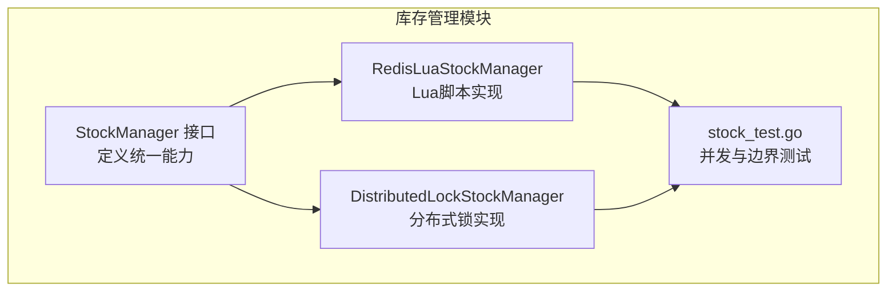
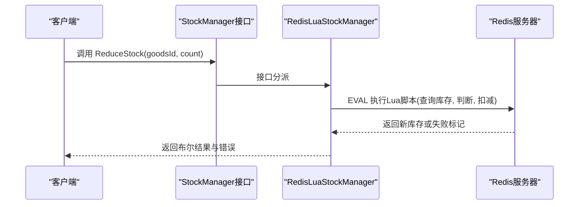
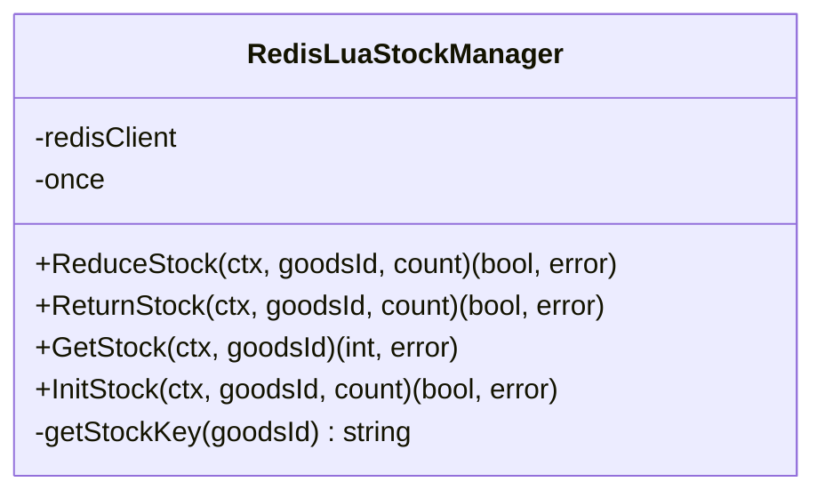
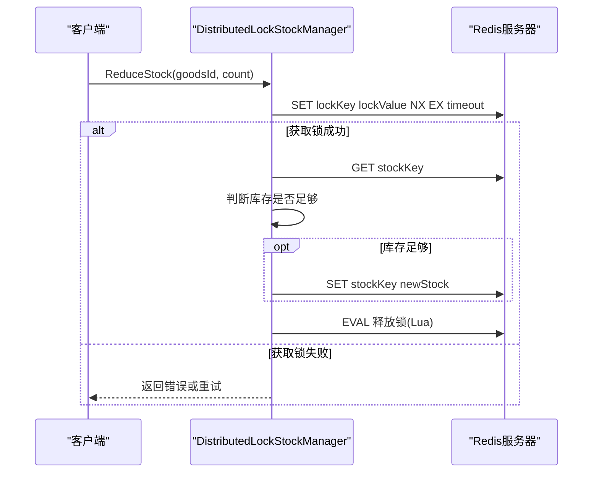
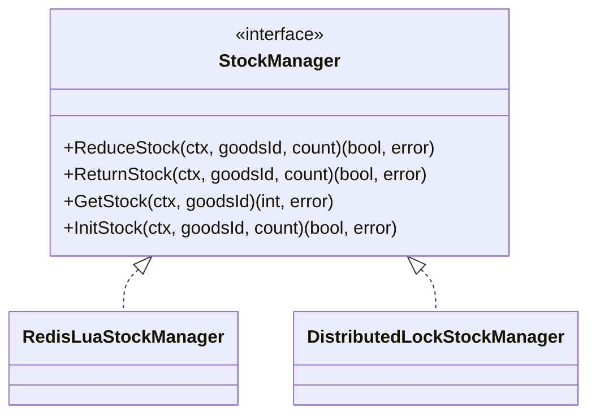
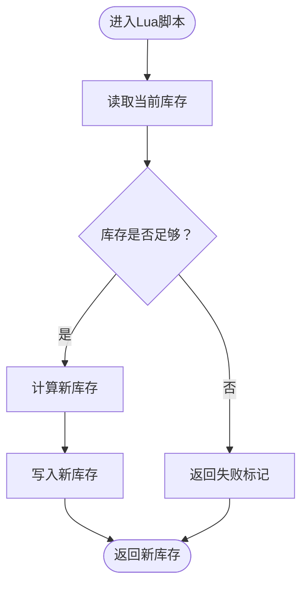
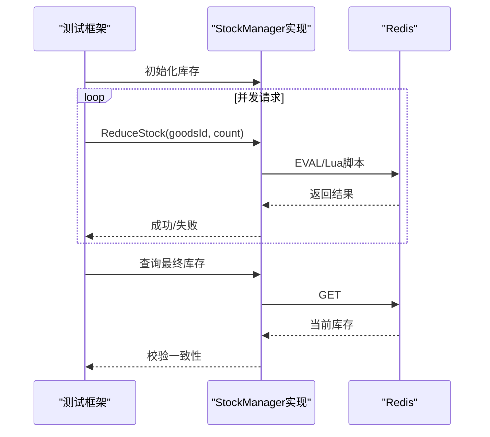
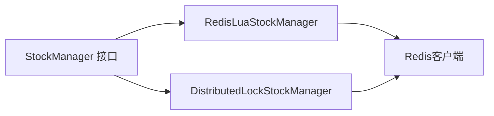

# Redis Lua脚本优化

<cite>
**本文引用的文件列表**
- [redis_lua.go](file://app/goods/utility/stock/redis_lua.go)
- [distributed_lock.go](file://app/goods/utility/stock/distributed_lock.go)
- [stock.go](file://app/goods/utility/stock/stock.go)
- [stock_test.go](file://app/goods/utility/stock/stock_test.go)
- [stock_manager.go](file://app/flash-sale/utility/stock_manager.go)
- [库存防超卖（Redis Lua+分布式锁对比实践）.md](file://doc/库存防超卖（Redis Lua+分布式锁对比实践）.md)
</cite>

## 目录
1. [引言](#引言)
2. [项目结构](#项目结构)
3. [核心组件](#核心组件)
4. [架构概览](#架构概览)
5. [详细组件分析](#详细组件分析)
6. [依赖关系分析](#依赖关系分析)
7. [性能考量](#性能考量)
8. [故障排查指南](#故障排查指南)
9. [结论](#结论)
10. [附录](#附录)

## 引言
本文件聚焦于Redis Lua脚本在库存扣减操作中的优化实践，系统阐述原子性保障、性能优化策略以及调试与测试方法。文档基于仓库中提供的库存管理实现，对比分布式锁与Lua脚本两种方案，总结在高并发场景下（如秒杀）的适用性与最佳实践。

## 项目结构
围绕库存扣减，项目在goods模块下提供了统一的接口与两种实现：
- 接口定义：统一的StockManager接口，便于替换实现
- Lua脚本实现：基于Redis EVAL的原子库存扣减、返还与初始化
- 分布式锁实现：基于Redis SET NX + Lua释放锁的互斥方案
- 测试与文档：对比测试、边界测试与完整实现说明文档

图表来源
- [stock.go](file://app/goods/utility/stock/stock.go#L7-L31)
- [redis_lua.go](file://app/goods/utility/stock/redis_lua.go#L12-L23)
- [distributed_lock.go](file://app/goods/utility/stock/distributed_lock.go#L13-L19)
- [stock_test.go](file://app/goods/utility/stock/stock_test.go#L80-L201)

章节来源
- [stock.go](file://app/goods/utility/stock/stock.go#L7-L31)
- [redis_lua.go](file://app/goods/utility/stock/redis_lua.go#L12-L23)
- [distributed_lock.go](file://app/goods/utility/stock/distributed_lock.go#L13-L19)
- [stock_test.go](file://app/goods/utility/stock/stock_test.go#L80-L201)

## 核心组件
- StockManager接口：定义扣减、返还、查询、初始化等能力，支持替换实现
- RedisLuaStockManager：基于Lua脚本的原子库存操作，减少网络往返，提升吞吐
- DistributedLockStockManager：基于Redis分布式锁的互斥库存操作，适用于复杂业务
- 测试套件：并发压力测试、边界条件测试与结果验证

章节来源
- [stock.go](file://app/goods/utility/stock/stock.go#L7-L31)
- [redis_lua.go](file://app/goods/utility/stock/redis_lua.go#L12-L23)
- [distributed_lock.go](file://app/goods/utility/stock/distributed_lock.go#L13-L19)
- [stock_test.go](file://app/goods/utility/stock/stock_test.go#L80-L201)

## 架构概览
Lua脚本方案将“查询-判断-扣减”封装为单个原子操作，避免客户端与Redis之间的竞态；分布式锁方案通过加锁/解锁确保互斥，但需要额外的网络往返与锁管理。

图表来源
- [redis_lua.go](file://app/goods/utility/stock/redis_lua.go#L75-L102)
- [库存防超卖（Redis Lua+分布式锁对比实践）.md](file://doc/库存防超卖（Redis Lua+分布式锁对比实践）.md#L359-L437)

章节来源
- [redis_lua.go](file://app/goods/utility/stock/redis_lua.go#L75-L102)
- [库存防超卖（Redis Lua+分布式锁对比实践）.md](file://doc/库存防超卖（Redis Lua+分布式锁对比实践）.md#L359-L437)

## 详细组件分析

### RedisLuaStockManager（Lua脚本实现）
- 原子性：通过EVAL一次性执行Lua脚本，内部完成查询、判断与扣减，避免竞态
- 关键脚本：库存扣减、返还、初始化三类脚本，分别对应不同业务动作
- 错误处理：参数校验、库存不足返回、结果解析与错误包装
- 性能优势：单次网络往返，减少客户端逻辑与网络开销

图表来源
- [redis_lua.go](file://app/goods/utility/stock/redis_lua.go#L12-L23)
- [redis_lua.go](file://app/goods/utility/stock/redis_lua.go#L75-L145)

章节来源
- [redis_lua.go](file://app/goods/utility/stock/redis_lua.go#L12-L23)
- [redis_lua.go](file://app/goods/utility/stock/redis_lua.go#L30-L73)
- [redis_lua.go](file://app/goods/utility/stock/redis_lua.go#L75-L145)

### DistributedLockStockManager（分布式锁实现）
- 互斥机制：使用SET NX + EX设置锁，Lua脚本释放锁，避免误删
- 重试策略：获取锁失败时按固定间隔重试，提升成功率
- 业务流程：加锁 -> 查询库存 -> 判断 -> 扣减 -> 解锁
- 适用场景：复杂业务逻辑、需要协调多个资源或跨键操作

图表来源
- [distributed_lock.go](file://app/goods/utility/stock/distributed_lock.go#L46-L89)
- [distributed_lock.go](file://app/goods/utility/stock/distributed_lock.go#L91-L159)

章节来源
- [distributed_lock.go](file://app/goods/utility/stock/distributed_lock.go#L46-L89)
- [distributed_lock.go](file://app/goods/utility/stock/distributed_lock.go#L91-L159)

### StockManager接口与实现对比
- 统一接口：StockManager定义了四类能力，便于替换实现
- 两种实现：Lua脚本与分布式锁，分别面向高并发原子性与复杂业务互斥
- 文档与测试：对比实践文档与测试用例覆盖性能、边界与异常恢复

图表来源
- [stock.go](file://app/goods/utility/stock/stock.go#L7-L31)
- [redis_lua.go](file://app/goods/utility/stock/redis_lua.go#L12-L23)
- [distributed_lock.go](file://app/goods/utility/stock/distributed_lock.go#L13-L19)

章节来源
- [stock.go](file://app/goods/utility/stock/stock.go#L7-L31)
- [redis_lua.go](file://app/goods/utility/stock/redis_lua.go#L12-L23)
- [distributed_lock.go](file://app/goods/utility/stock/distributed_lock.go#L13-L19)

### Lua脚本在库存扣减中的原子性与性能
- 原子性：脚本在Redis服务器端单线程执行，查询-判断-扣减整体原子，避免竞态
- 性能：单次EVAL调用替代多次网络往返，降低RTT与客户端逻辑复杂度
- 脚本设计：简洁逻辑，返回值明确（成功/失败），便于客户端处理

图表来源
- [redis_lua.go](file://app/goods/utility/stock/redis_lua.go#L30-L53)

章节来源
- [redis_lua.go](file://app/goods/utility/stock/redis_lua.go#L30-L53)
- [库存防超卖（Redis Lua+分布式锁对比实践）.md](file://doc/库存防超卖（Redis Lua+分布式锁对比实践）.md#L63-L81)

### 不同场景下的Lua脚本优化策略
- 高并发库存扣减：优先Lua脚本，减少锁竞争与网络往返
- 复杂业务逻辑：分布式锁更合适，可在锁内执行多步操作
- 批量操作：可将多个商品的扣减合并到单个EVAL中（需自定义脚本），进一步降低网络开销
- 条件判断：在脚本中集中处理库存检查与业务规则，避免客户端分支

章节来源
- [库存防超卖（Redis Lua+分布式锁对比实践）.md](file://doc/库存防超卖（Redis Lua+分布式锁对比实践）.md#L100-L140)
- [redis_lua.go](file://app/goods/utility/stock/redis_lua.go#L30-L73)

### Lua脚本调试与性能测试指南
- 调试方法：
  - 在脚本中加入日志输出（如使用Redis日志级别），或通过外部监控观察脚本执行
  - 使用Redis客户端直接EVAL脚本进行单元级调试
  - 观察错误返回值与异常堆栈，定位参数与键名问题
- 性能测试：
  - 并发压力测试：模拟多goroutine同时扣减，统计成功/失败次数与平均RTT
  - 边界测试：库存为0、负数扣减、超卖场景验证
  - 结果验证：最终库存与预期值一致性校验

图表来源
- [stock_test.go](file://app/goods/utility/stock/stock_test.go#L32-L78)
- [stock_test.go](file://app/goods/utility/stock/stock_test.go#L104-L200)

章节来源
- [stock_test.go](file://app/goods/utility/stock/stock_test.go#L32-L78)
- [stock_test.go](file://app/goods/utility/stock/stock_test.go#L104-L200)

## 依赖关系分析
- 组件耦合：StockManager接口解耦具体实现；Lua与分布式锁实现均依赖Redis客户端
- 外部依赖：Redis客户端接口（Do/Eval等），Go标准库与gf框架错误包装
- 潜在风险：分布式锁实现存在锁竞争与死锁风险；Lua脚本实现需注意脚本超时与复杂度

图表来源
- [stock.go](file://app/goods/utility/stock/stock.go#L7-L31)
- [redis_lua.go](file://app/goods/utility/stock/redis_lua.go#L12-L23)
- [distributed_lock.go](file://app/goods/utility/stock/distributed_lock.go#L13-L19)

章节来源
- [stock.go](file://app/goods/utility/stock/stock.go#L7-L31)
- [redis_lua.go](file://app/goods/utility/stock/redis_lua.go#L12-L23)
- [distributed_lock.go](file://app/goods/utility/stock/distributed_lock.go#L13-L19)

## 性能考量
- 网络开销：Lua脚本方案仅一次EVAL往返，显著低于分布式锁的加锁/解锁往返
- 吞吐量：Lua脚本避免锁竞争，随并发增加更接近线性扩展
- 资源占用：Lua脚本执行时间短，Redis连接占用时间短
- 适用场景：高并发秒杀、抢购等场景优先Lua脚本；复杂业务与多资源协调优先分布式锁

章节来源
- [库存防超卖（Redis Lua+分布式锁对比实践）.md](file://doc/库存防超卖（Redis Lua+分布式锁对比实践）.md#L110-L140)

## 故障排查指南
- 常见问题：
  - 库存不足：Lua脚本返回失败标记，客户端应提示用户或回滚
  - 脚本执行错误：检查键名、参数类型与Redis连接状态
  - 超时与异常：Lua脚本超时时间设置合理，监控脚本执行时间
- 排查步骤：
  - 使用Redis客户端直接执行脚本，确认脚本逻辑
  - 查看测试输出与断言，定位并发与边界问题
  - 校验最终库存与预期值一致性，确保原子性未被破坏

章节来源
- [redis_lua.go](file://app/goods/utility/stock/redis_lua.go#L75-L102)
- [stock_test.go](file://app/goods/utility/stock/stock_test.go#L139-L198)

## 结论
在高并发库存扣减场景中，Redis Lua脚本方案通过原子性与低网络开销显著优于分布式锁方案。结合完善的测试与监控，Lua脚本可有效避免超卖并提升系统稳定性。对于复杂业务与多资源协调，分布式锁仍是可行选择。实践中可根据业务复杂度与并发特征选择合适方案，或采用混合策略。

## 附录
- 秒杀库存管理：Flash Sale模块使用本地缓存进行库存检查与扣减，适合低并发与本地化场景
- 文档参考：对比实践文档提供了完整的实现说明、测试与最佳实践建议

章节来源
- [stock_manager.go](file://app/flash-sale/utility/stock_manager.go#L33-L73)
- [库存防超卖（Redis Lua+分布式锁对比实践）.md](file://doc/库存防超卖（Redis Lua+分布式锁对比实践）.md#L225-L250)