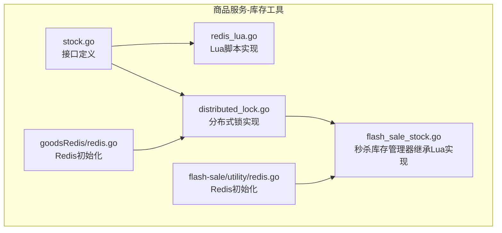
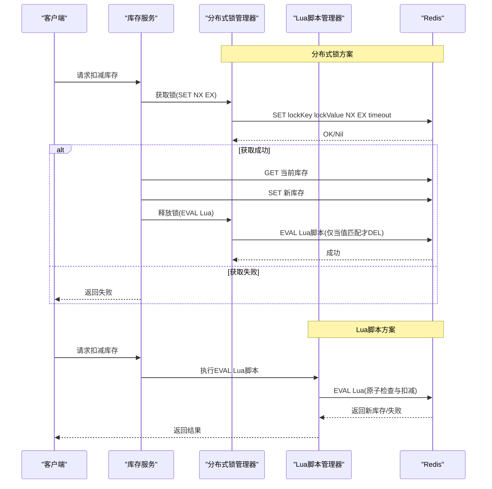
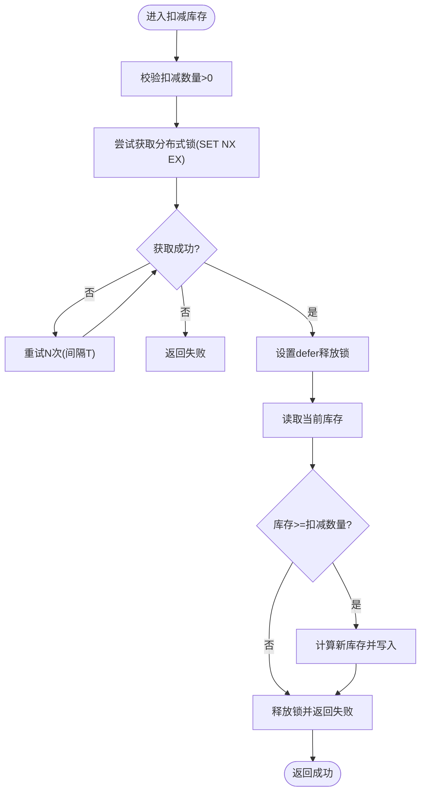
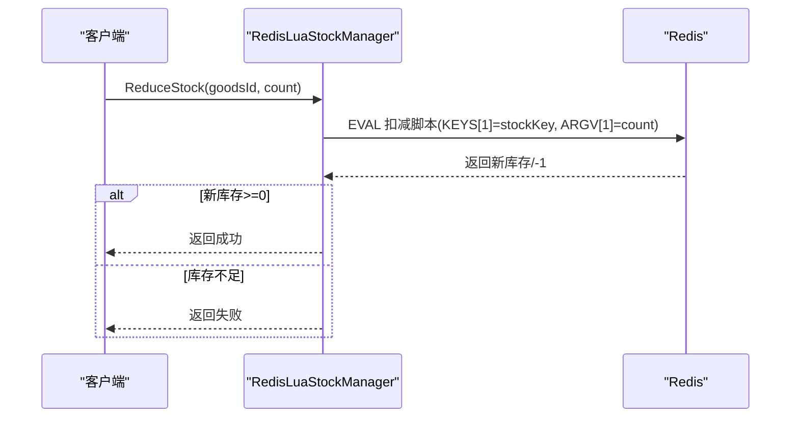
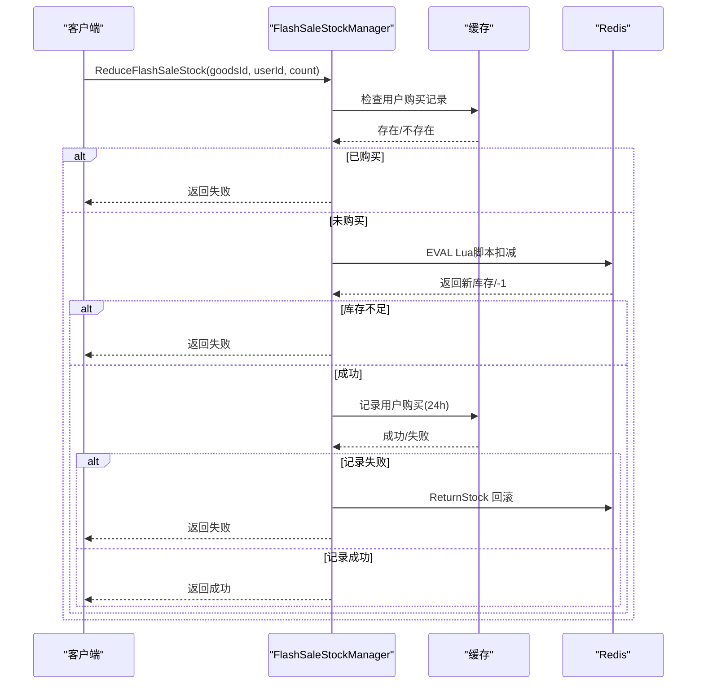
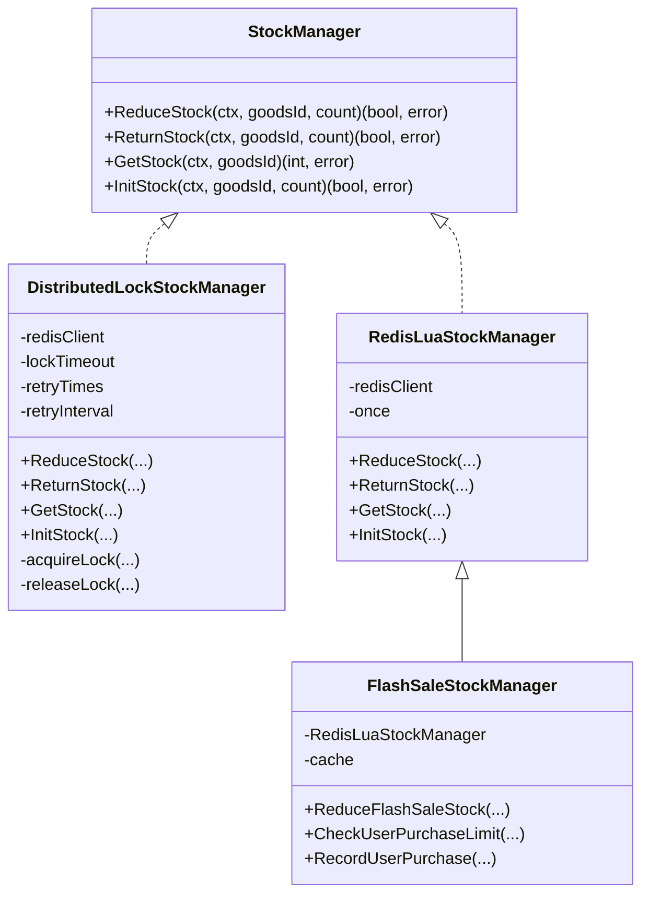
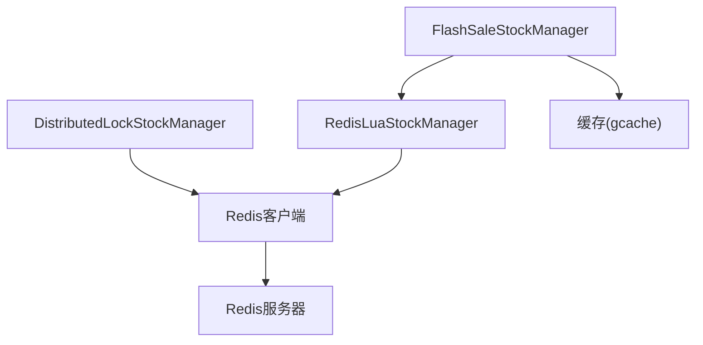

# 分布式锁实现

<cite>
**本文引用的文件**
- [distributed_lock.go](file://app/goods/utility/stock/distributed_lock.go)
- [redis_lua.go](file://app/goods/utility/stock/redis_lua.go)
- [stock.go](file://app/goods/utility/stock/stock.go)
- [stock_test.go](file://app/goods/utility/stock/stock_test.go)
- [flash_sale_stock.go](file://app/goods/utility/stock/flash_sale_stock.go)
- [redis.go](file://app/goods/utility/goodsRedis/redis.go)
- [redis.go](file://app/flash-sale/utility/redis.go)
- [库存防超卖（Redis Lua+分布式锁对比实践）.md](file://doc/库存防超卖（Redis Lua+分布式锁对比实践）.md)
</cite>

## 目录
1. [简介](#简介)
2. [项目结构](#项目结构)
3. [核心组件](#核心组件)
4. [架构概览](#架构概览)
5. [详细组件分析](#详细组件分析)
6. [依赖关系分析](#依赖关系分析)
7. [性能考量](#性能考量)
8. [故障排查指南](#故障排查指南)
9. [结论](#结论)
10. [附录](#附录)

## 简介
本文件围绕基于Redis的分布式锁实现展开，系统性阐述锁的获取、释放与安全性保障，重点讲解Lua脚本的安全释放机制，防止锁被错误释放的问题。文档同时覆盖锁的实现原理（SET NX EX命令、锁值生成策略、锁超时机制）、在库存管理中的应用场景（并发控制、数据一致性）、使用示例与最佳实践（重试机制、异常处理）。

## 项目结构
本仓库中与分布式锁相关的核心代码位于商品服务的库存工具模块，包含两类实现：
- 基于分布式锁的库存管理器：通过Redis SET NX EX命令获取锁，使用Lua脚本安全释放锁。
- 基于Redis Lua脚本的库存管理器：将库存检查与扣减封装为原子脚本，避免锁竞争。

**图表来源**
- [stock.go](file://app/goods/utility/stock/stock.go#L1-L32)
- [distributed_lock.go](file://app/goods/utility/stock/distributed_lock.go#L1-L266)
- [redis_lua.go](file://app/goods/utility/stock/redis_lua.go#L1-L166)
- [flash_sale_stock.go](file://app/goods/utility/stock/flash_sale_stock.go#L1-L152)
- [redis.go](file://app/goods/utility/goodsRedis/redis.go#L1-L49)
- [redis.go](file://app/flash-sale/utility/redis.go#L1-L56)

**章节来源**
- [stock.go](file://app/goods/utility/stock/stock.go#L1-L32)
- [distributed_lock.go](file://app/goods/utility/stock/distributed_lock.go#L1-L266)
- [redis_lua.go](file://app/goods/utility/stock/redis_lua.go#L1-L166)
- [flash_sale_stock.go](file://app/goods/utility/stock/flash_sale_stock.go#L1-L152)
- [redis.go](file://app/goods/utility/goodsRedis/redis.go#L1-L49)
- [redis.go](file://app/flash-sale/utility/redis.go#L1-L56)

## 核心组件
- StockManager 接口：统一定义库存管理能力（扣减、返还、查询、初始化）。
- DistributedLockStockManager：基于分布式锁的库存管理器，使用Redis SET NX EX获取锁，Lua脚本安全释放。
- RedisLuaStockManager：基于Redis Lua脚本的库存管理器，原子化执行库存检查与扣减。
- FlashSaleStockManager：秒杀场景下的库存管理器，继承Lua实现并增加用户购买限制与记录。

**章节来源**
- [stock.go](file://app/goods/utility/stock/stock.go#L7-L31)
- [distributed_lock.go](file://app/goods/utility/stock/distributed_lock.go#L13-L29)
- [redis_lua.go](file://app/goods/utility/stock/redis_lua.go#L12-L23)
- [flash_sale_stock.go](file://app/goods/utility/stock/flash_sale_stock.go#L14-L40)

## 架构概览
分布式锁与Lua脚本两种方案在库存管理中的整体交互如下：

**图表来源**
- [distributed_lock.go](file://app/goods/utility/stock/distributed_lock.go#L46-L89)
- [redis_lua.go](file://app/goods/utility/stock/redis_lua.go#L75-L102)

**章节来源**
- [distributed_lock.go](file://app/goods/utility/stock/distributed_lock.go#L91-L159)
- [redis_lua.go](file://app/goods/utility/stock/redis_lua.go#L75-L102)

## 详细组件分析

### 分布式锁实现（DistributedLockStockManager）
- 锁键与锁值
  - 锁键命名规则：基于商品ID生成唯一锁键，避免跨商品干扰。
  - 锁值生成策略：使用随机数作为锁值，确保释放时只能释放自身持有的锁。
- 锁获取与释放
  - 获取：使用Redis命令 SET key value NX EX expireTime，仅在键不存在时设置并设置过期时间。
  - 释放：使用Lua脚本读取锁键值并与传入锁值比较，相等才删除，防止误删他人锁。
- 重试与异常
  - 获取失败时按固定次数与间隔重试，提升高并发下的成功率。
  - 使用defer确保即使业务逻辑异常也能释放锁，避免死锁。
- 并发控制与一致性
  - 在业务操作前后加锁，保证同一商品在同一时刻只有一个请求执行库存变更。
  - 通过锁超时避免长时间占用导致的阻塞。

**图表来源**
- [distributed_lock.go](file://app/goods/utility/stock/distributed_lock.go#L91-L159)

**章节来源**
- [distributed_lock.go](file://app/goods/utility/stock/distributed_lock.go#L46-L89)
- [distributed_lock.go](file://app/goods/utility/stock/distributed_lock.go#L91-L159)

### Lua脚本实现（RedisLuaStockManager）
- 原子性保障
  - 将“读取库存→判断→写入新库存”封装为Redis EVAL脚本，服务器端原子执行，避免竞态。
- 脚本设计
  - 扣减脚本：读取当前库存，若不足返回失败码；否则写入新库存并返回新值。
  - 返还脚本：直接累加并写入新库存。
- 错误处理
  - 脚本执行失败或库存不足时返回明确错误，上层可据此判定。

**图表来源**
- [redis_lua.go](file://app/goods/utility/stock/redis_lua.go#L75-L102)

**章节来源**
- [redis_lua.go](file://app/goods/utility/stock/redis_lua.go#L30-L53)
- [redis_lua.go](file://app/goods/utility/stock/redis_lua.go#L75-L102)

### 秒杀库存管理器（FlashSaleStockManager）
- 场景特点
  - 在Lua脚本基础上增加用户购买限制与购买记录，防止重复购买。
- 关键流程
  - 用户购买限制检查（缓存中是否存在购买记录）。
  - 执行Lua脚本扣减库存。
  - 记录用户购买（设置24小时过期）。
  - 若记录失败，回滚库存并返回错误。

**图表来源**
- [flash_sale_stock.go](file://app/goods/utility/stock/flash_sale_stock.go#L52-L99)

**章节来源**
- [flash_sale_stock.go](file://app/goods/utility/stock/flash_sale_stock.go#L52-L99)

### 类关系图

**图表来源**
- [stock.go](file://app/goods/utility/stock/stock.go#L7-L31)
- [distributed_lock.go](file://app/goods/utility/stock/distributed_lock.go#L13-L29)
- [redis_lua.go](file://app/goods/utility/stock/redis_lua.go#L12-L23)
- [flash_sale_stock.go](file://app/goods/utility/stock/flash_sale_stock.go#L14-L40)

**章节来源**
- [stock.go](file://app/goods/utility/stock/stock.go#L7-L31)
- [distributed_lock.go](file://app/goods/utility/stock/distributed_lock.go#L13-L29)
- [redis_lua.go](file://app/goods/utility/stock/redis_lua.go#L12-L23)
- [flash_sale_stock.go](file://app/goods/utility/stock/flash_sale_stock.go#L14-L40)

## 依赖关系分析
- 组件耦合
  - DistributedLockStockManager与Redis客户端强耦合，通过统一的Do方法执行命令。
  - FlashSaleStockManager组合RedisLuaStockManager，并依赖缓存组件实现用户购买限制。
- 外部依赖
  - Redis：提供SET、GET、EVAL、DEL等命令支持。
  - 缓存：用于用户购买记录的快速查询与去重。
- 潜在风险
  - 锁超时与业务执行时间需匹配，避免锁过期导致的并发问题。
  - Lua脚本释放锁的条件必须严格匹配锁值，防止误删。

**图表来源**
- [distributed_lock.go](file://app/goods/utility/stock/distributed_lock.go#L14-L18)
- [redis_lua.go](file://app/goods/utility/stock/redis_lua.go#L13-L16)
- [flash_sale_stock.go](file://app/goods/utility/stock/flash_sale_stock.go#L28-L32)

**章节来源**
- [distributed_lock.go](file://app/goods/utility/stock/distributed_lock.go#L14-L18)
- [redis_lua.go](file://app/goods/utility/stock/redis_lua.go#L13-L16)
- [flash_sale_stock.go](file://app/goods/utility/stock/flash_sale_stock.go#L28-L32)

## 性能考量
- 分布式锁方案
  - 网络交互：至少三次（加锁、操作、解锁），高并发下锁竞争明显。
  - 重试与退避：可通过指数退避降低竞争，但会增加平均延迟。
- Lua脚本方案
  - 网络交互：一次EVAL即可完成检查与扣减，吞吐更高。
  - 原子性：服务器端原子执行，避免锁竞争，适合高并发场景。
- 最佳实践
  - 高并发库存扣减优先Lua脚本方案。
  - Redis连接池与超时配置需合理，避免成为瓶颈。
  - 对Lua脚本进行单元测试与压力测试，确保在极端情况下仍满足一致性要求。

[本节为通用性能讨论，无需列出具体文件来源]

## 故障排查指南
- 常见问题
  - 获取锁失败：检查Redis连通性、锁键冲突、重试次数与间隔配置。
  - 释放锁失败：确认锁值是否正确传递，Lua脚本是否被正确执行。
  - 死锁风险：确保业务逻辑异常路径也能触发defer释放。
  - 超卖问题：分布式锁方案需严格校验库存；Lua脚本方案需保证脚本原子性。
- 排查步骤
  - 核对锁键命名与锁值生成策略，确保唯一性与可识别性。
  - 在高并发场景下观察锁竞争与重试次数，必要时优化重试策略。
  - 对Lua脚本进行边界测试（库存为0、负数扣减、返还等）。
  - 查看Redis日志与监控指标，定位网络延迟与执行耗时异常。

**章节来源**
- [distributed_lock.go](file://app/goods/utility/stock/distributed_lock.go#L91-L159)
- [redis_lua.go](file://app/goods/utility/stock/redis_lua.go#L75-L102)
- [stock_test.go](file://app/goods/utility/stock/stock_test.go#L241-L275)

## 结论
- 分布式锁方案适用于需要在锁内执行复杂业务逻辑的场景，但存在锁竞争与网络交互开销。
- Lua脚本方案在高并发与原子性方面表现更优，适合简单的库存扣减与返还操作。
- 在实际应用中，可根据业务复杂度与并发需求选择合适方案，或采用混合策略：核心库存扣减使用Lua脚本，复杂业务流程使用分布式锁。

[本节为总结性内容，无需列出具体文件来源]

## 附录

### 使用示例与最佳实践
- 示例路径
  - 分布式锁扣减库存：参考函数路径 [ReduceStock](file://app/goods/utility/stock/distributed_lock.go#L91-L159)
  - Lua脚本扣减库存：参考函数路径 [ReduceStock](file://app/goods/utility/stock/redis_lua.go#L75-L102)
  - 秒杀扣减库存（含用户限制）：参考函数路径 [ReduceFlashSaleStock](file://app/goods/utility/stock/flash_sale_stock.go#L52-L99)
- 最佳实践
  - 锁超时与业务执行时间匹配，避免过短导致频繁重试或过长导致资源占用。
  - Lua脚本释放锁必须基于锁值匹配，防止误删他人锁。
  - 高并发场景优先Lua脚本，配合缓存与限流策略。
  - 对关键路径进行压测与监控，持续优化重试与超时参数。

**章节来源**
- [distributed_lock.go](file://app/goods/utility/stock/distributed_lock.go#L91-L159)
- [redis_lua.go](file://app/goods/utility/stock/redis_lua.go#L75-L102)
- [flash_sale_stock.go](file://app/goods/utility/stock/flash_sale_stock.go#L52-L99)
- [库存防超卖（Redis Lua+分布式锁对比实践）.md](file://doc/库存防超卖（Redis Lua+分布式锁对比实践）.md#L141-L156)