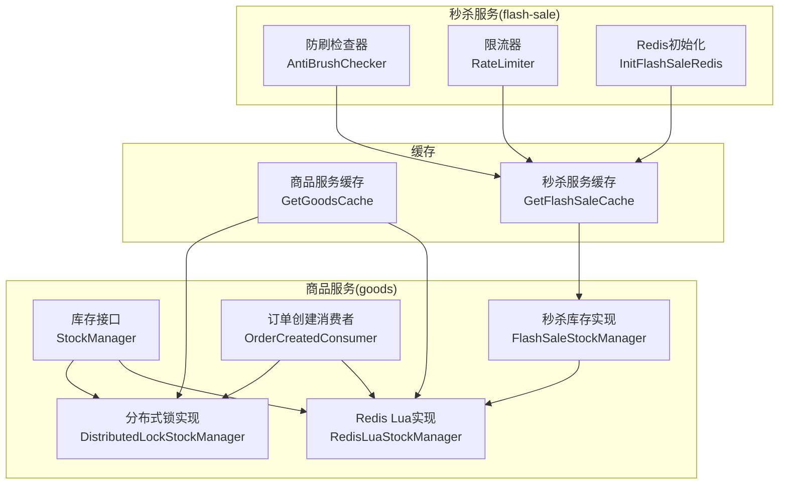
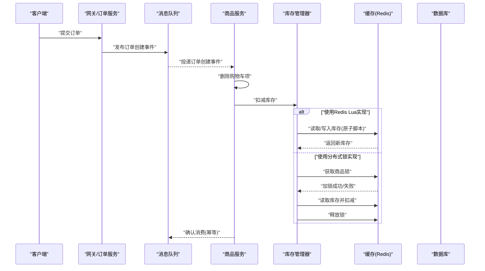
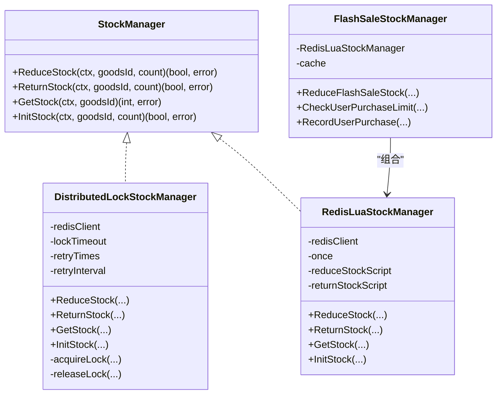
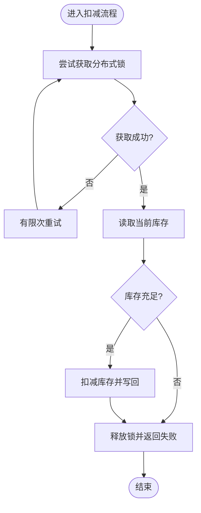
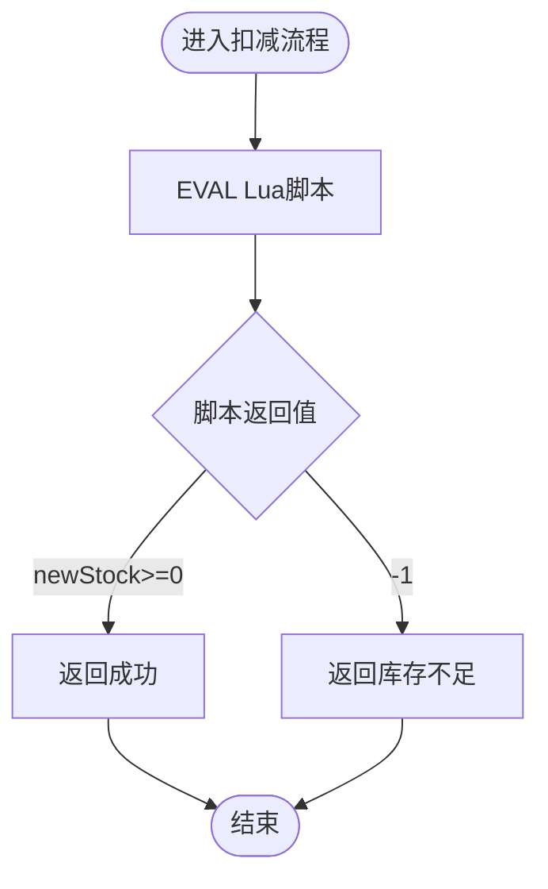
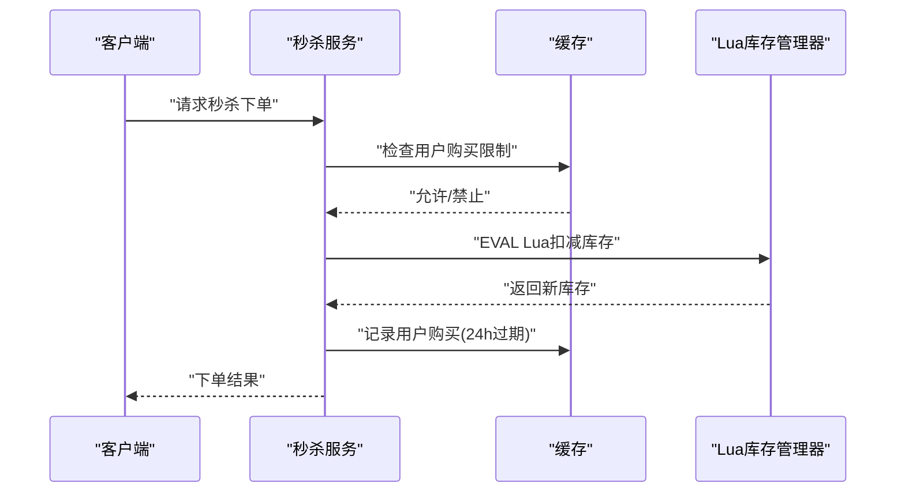
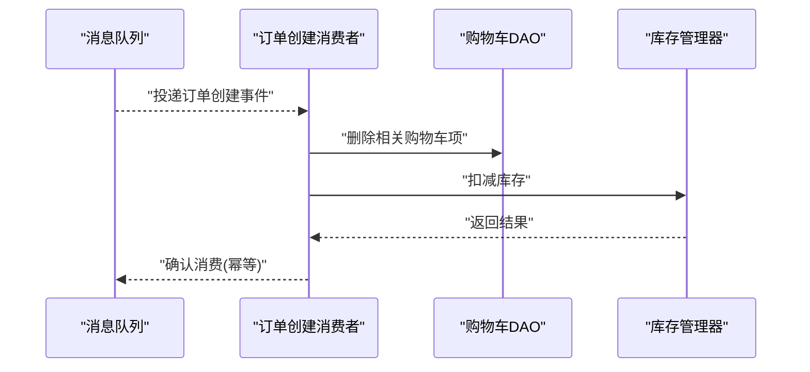
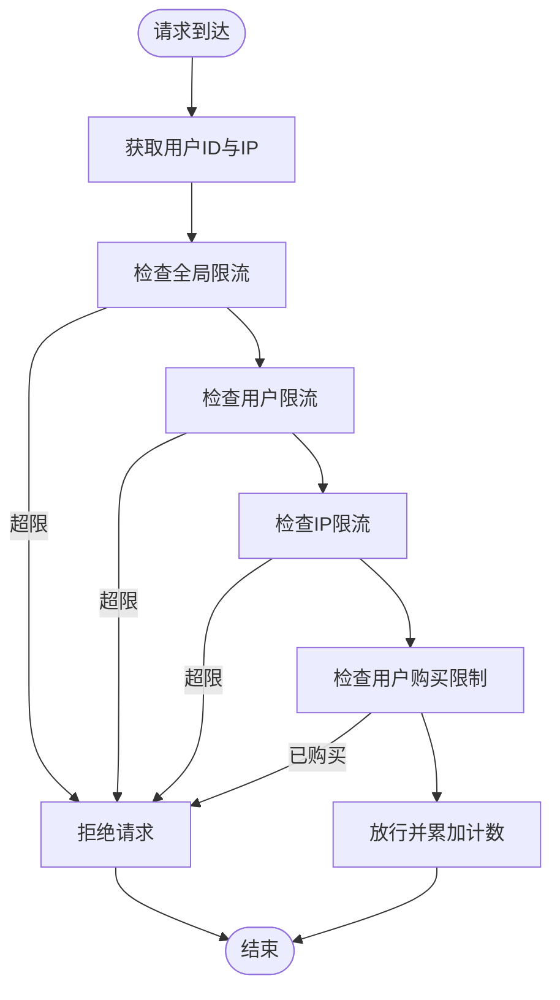
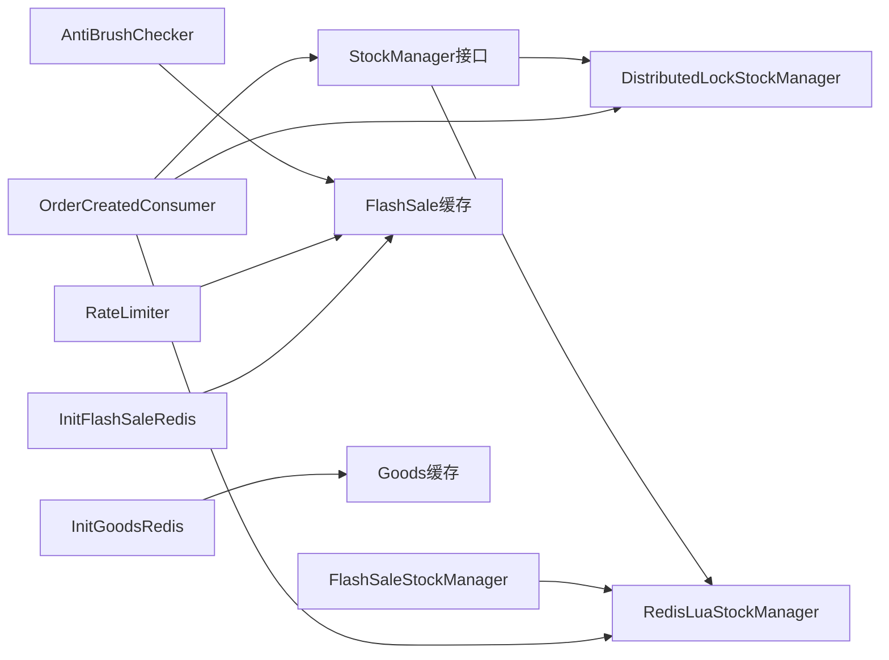

# 并发控制策略

<cite>
**本文引用的文件**
- [app/goods/utility/stock/stock.go](file://app/goods/utility/stock/stock.go)
- [app/goods/utility/stock/distributed_lock.go](file://app/goods/utility/stock/distributed_lock.go)
- [app/goods/utility/stock/redis_lua.go](file://app/goods/utility/stock/redis_lua.go)
- [app/goods/utility/stock/flash_sale_stock.go](file://app/goods/utility/stock/flash_sale_stock.go)
- [app/goods/utility/consumer/order_created_consumer.go](file://app/goods/utility/consumer/order_created_consumer.go)
- [app/flash-sale/utility/anti_brush.go](file://app/flash-sale/utility/anti_brush.go)
- [app/flash-sale/utility/rate_limit.go](file://app/flash-sale/utility/rate_limit.go)
- [app/flash-sale/utility/redis.go](file://app/flash-sale/utility/redis.go)
- [app/goods/utility/goodsRedis/redis.go](file://app/goods/utility/goodsRedis/redis.go)
- [doc/库存防超卖（Redis Lua+分布式锁对比实践）.md](file://doc/库存防超卖（Redis Lua+分布式锁对比实践）.md)
</cite>

## 目录
1. [引言](#引言)
2. [项目结构](#项目结构)
3. [核心组件](#核心组件)
4. [架构总览](#架构总览)
5. [组件详细分析](#组件详细分析)
6. [依赖关系分析](#依赖关系分析)
7. [性能考量](#性能考量)
8. [故障排查指南](#故障排查指南)
9. [结论](#结论)
10. [附录](#附录)

## 引言
本文件聚焦于本仓库中的并发控制策略，系统性阐述乐观锁与悲观锁在库存管理、订单处理等场景的应用与取舍；并结合项目现有实现，总结数据库与缓存层面的并发控制手段，覆盖死锁预防、超时处理、重试机制、限流与幂等等关键主题，给出可落地的最佳实践与性能优化建议。

## 项目结构
围绕并发控制的相关模块主要分布在以下位置：
- 库存管理与并发控制：goods 服务的 stock 包提供统一接口与两种实现（分布式锁、Redis Lua 原子脚本）
- 秒杀场景扩展：flash-sale 服务在库存基础上引入缓存限流、用户购买限制与幂等记录
- 订单事件驱动与库存扣减：goods 服务的消息消费者在订单创建后触发库存扣减
- 缓存初始化与共享：goods 与 flash-sale 服务各自初始化 Redis 缓存适配器

图表来源
- [app/goods/utility/stock/stock.go](file://app/goods/utility/stock/stock.go#L7-L31)
- [app/goods/utility/stock/distributed_lock.go](file://app/goods/utility/stock/distributed_lock.go#L13-L29)
- [app/goods/utility/stock/redis_lua.go](file://app/goods/utility/stock/redis_lua.go#L12-L23)
- [app/goods/utility/stock/flash_sale_stock.go](file://app/goods/utility/stock/flash_sale_stock.go#L14-L40)
- [app/goods/utility/consumer/order_created_consumer.go](file://app/goods/utility/consumer/order_created_consumer.go#L13-L30)
- [app/flash-sale/utility/anti_brush.go](file://app/flash-sale/utility/anti_brush.go#L12-L22)
- [app/flash-sale/utility/rate_limit.go](file://app/flash-sale/utility/rate_limit.go#L13-L23)
- [app/flash-sale/utility/redis.go](file://app/flash-sale/utility/redis.go#L16-L50)
- [app/goods/utility/goodsRedis/redis.go](file://app/goods/utility/goodsRedis/redis.go#L13-L48)

章节来源
- [app/goods/utility/stock/stock.go](file://app/goods/utility/stock/stock.go#L7-L31)
- [app/goods/utility/stock/distributed_lock.go](file://app/goods/utility/stock/distributed_lock.go#L13-L29)
- [app/goods/utility/stock/redis_lua.go](file://app/goods/utility/stock/redis_lua.go#L12-L23)
- [app/goods/utility/stock/flash_sale_stock.go](file://app/goods/utility/stock/flash_sale_stock.go#L14-L40)
- [app/goods/utility/consumer/order_created_consumer.go](file://app/goods/utility/consumer/order_created_consumer.go#L13-L30)
- [app/flash-sale/utility/anti_brush.go](file://app/flash-sale/utility/anti_brush.go#L12-L22)
- [app/flash-sale/utility/rate_limit.go](file://app/flash-sale/utility/rate_limit.go#L13-L23)
- [app/flash-sale/utility/redis.go](file://app/flash-sale/utility/redis.go#L16-L50)
- [app/goods/utility/goodsRedis/redis.go](file://app/goods/utility/goodsRedis/redis.go#L13-L48)

## 核心组件
- 库存管理接口：统一定义扣减、返还、查询、初始化库存等能力，便于替换实现
- 分布式锁库存管理器：基于 Redis SET NX + Lua 原子释放，保障同一商品在同一时刻仅有一个操作在执行
- Redis Lua 原子库存管理器：将“读取-判断-写入”封装为单条 Lua 脚本，避免竞态条件
- 秒杀库存管理器：在 Lua 基础上叠加缓存层的用户购买限制与记录，提升高并发下的吞吐
- 订单创建消费者：接收订单创建事件，删除购物车并调用库存扣减，具备幂等与失败处理
- 限流与防刷：按用户/IP/全局维度进行限流，配合缓存记录用户购买状态，降低重复购买风险
- 缓存初始化：分别在 goods 与 flash-sale 服务中初始化 Redis 缓存适配器，供库存与秒杀逻辑使用

章节来源
- [app/goods/utility/stock/stock.go](file://app/goods/utility/stock/stock.go#L7-L31)
- [app/goods/utility/stock/distributed_lock.go](file://app/goods/utility/stock/distributed_lock.go#L13-L29)
- [app/goods/utility/stock/redis_lua.go](file://app/goods/utility/stock/redis_lua.go#L12-L23)
- [app/goods/utility/stock/flash_sale_stock.go](file://app/goods/utility/stock/flash_sale_stock.go#L14-L40)
- [app/goods/utility/consumer/order_created_consumer.go](file://app/goods/utility/consumer/order_created_consumer.go#L13-L30)
- [app/flash-sale/utility/anti_brush.go](file://app/flash-sale/utility/anti_brush.go#L12-L22)
- [app/flash-sale/utility/rate_limit.go](file://app/flash-sale/utility/rate_limit.go#L13-L23)
- [app/flash-sale/utility/redis.go](file://app/flash-sale/utility/redis.go#L16-L50)
- [app/goods/utility/goodsRedis/redis.go](file://app/goods/utility/goodsRedis/redis.go#L13-L48)

## 架构总览
下图展示从订单创建到库存扣减的端到端流程，以及库存实现的两条路径（分布式锁 vs Redis Lua）：

图表来源
- [app/goods/utility/consumer/order_created_consumer.go](file://app/goods/utility/consumer/order_created_consumer.go#L32-L64)
- [app/goods/utility/stock/redis_lua.go](file://app/goods/utility/stock/redis_lua.go#L75-L102)
- [app/goods/utility/stock/distributed_lock.go](file://app/goods/utility/stock/distributed_lock.go#L46-L64)

章节来源
- [app/goods/utility/consumer/order_created_consumer.go](file://app/goods/utility/consumer/order_created_consumer.go#L32-L64)
- [app/goods/utility/stock/redis_lua.go](file://app/goods/utility/stock/redis_lua.go#L75-L102)
- [app/goods/utility/stock/distributed_lock.go](file://app/goods/utility/stock/distributed_lock.go#L46-L64)

## 组件详细分析

### 库存管理接口与实现类图

图表来源
- [app/goods/utility/stock/stock.go](file://app/goods/utility/stock/stock.go#L7-L31)
- [app/goods/utility/stock/distributed_lock.go](file://app/goods/utility/stock/distributed_lock.go#L13-L29)
- [app/goods/utility/stock/redis_lua.go](file://app/goods/utility/stock/redis_lua.go#L12-L23)
- [app/goods/utility/stock/flash_sale_stock.go](file://app/goods/utility/stock/flash_sale_stock.go#L14-L40)

章节来源
- [app/goods/utility/stock/stock.go](file://app/goods/utility/stock/stock.go#L7-L31)
- [app/goods/utility/stock/distributed_lock.go](file://app/goods/utility/stock/distributed_lock.go#L13-L29)
- [app/goods/utility/stock/redis_lua.go](file://app/goods/utility/stock/redis_lua.go#L12-L23)
- [app/goods/utility/stock/flash_sale_stock.go](file://app/goods/utility/stock/flash_sale_stock.go#L14-L40)

### 分布式锁库存管理器（悲观锁）
- 加锁：使用 Redis SET NX + EX 获取锁，避免死锁
- 释放：使用 Lua 脚本仅在锁值匹配时删除，保证原子释放
- 重试：在获取失败时进行有限次重试，降低高并发下的锁竞争
- 适用场景：复杂业务需要在锁内串行执行多个步骤，或需要跨资源协调

图表来源
- [app/goods/utility/stock/distributed_lock.go](file://app/goods/utility/stock/distributed_lock.go#L46-L64)
- [app/goods/utility/stock/distributed_lock.go](file://app/goods/utility/stock/distributed_lock.go#L91-L159)

章节来源
- [app/goods/utility/stock/distributed_lock.go](file://app/goods/utility/stock/distributed_lock.go#L46-L64)
- [app/goods/utility/stock/distributed_lock.go](file://app/goods/utility/stock/distributed_lock.go#L91-L159)

### Redis Lua 原子库存管理器（乐观锁思想）
- 原子性：将“读取-判断-写入”封装为单条 Lua 脚本，Redis 服务器端原子执行
- 网络开销：一次 EVAL 即可完成，减少往返
- 适用场景：高并发、简单原子操作（如库存扣减/返还）

图表来源
- [app/goods/utility/stock/redis_lua.go](file://app/goods/utility/stock/redis_lua.go#L75-L102)
- [app/goods/utility/stock/redis_lua.go](file://app/goods/utility/stock/redis_lua.go#L30-L53)

章节来源
- [app/goods/utility/stock/redis_lua.go](file://app/goods/utility/stock/redis_lua.go#L75-L102)
- [app/goods/utility/stock/redis_lua.go](file://app/goods/utility/stock/redis_lua.go#L30-L53)

### 秒杀库存管理器（Lua + 缓存限流）
- 在 Lua 原子扣减基础上，增加缓存层的用户购买限制与记录
- 通过缓存记录用户购买状态，避免重复购买
- 与订单创建事件配合，实现“扣减库存失败时的回滚”思路（记录失败后返还库存）

图表来源
- [app/goods/utility/stock/flash_sale_stock.go](file://app/goods/utility/stock/flash_sale_stock.go#L52-L99)
- [app/goods/utility/stock/flash_sale_stock.go](file://app/goods/utility/stock/flash_sale_stock.go#L101-L125)

章节来源
- [app/goods/utility/stock/flash_sale_stock.go](file://app/goods/utility/stock/flash_sale_stock.go#L52-L99)
- [app/goods/utility/stock/flash_sale_stock.go](file://app/goods/utility/stock/flash_sale_stock.go#L101-L125)

### 订单创建消费者（事件驱动与幂等）
- 订阅订单创建事件，删除购物车并调用库存扣减
- 失败时返回错误（Nack），交由消息中间件重试
- 与库存实现解耦，支持替换为分布式锁或 Lua 实现

图表来源
- [app/goods/utility/consumer/order_created_consumer.go](file://app/goods/utility/consumer/order_created_consumer.go#L32-L64)

章节来源
- [app/goods/utility/consumer/order_created_consumer.go](file://app/goods/utility/consumer/order_created_consumer.go#L32-L64)

### 限流与防刷（缓存层面的并发控制）
- 用户/IP/全局限流：基于缓存计数与过期时间，实现每秒请求数控制
- 用户购买限制：基于缓存记录用户对某商品的购买次数，防止重复购买
- 防刷检查：对用户行为与 IP 行为进行频率检测，异常则拒绝请求

图表来源
- [app/flash-sale/utility/rate_limit.go](file://app/flash-sale/utility/rate_limit.go#L25-L49)
- [app/flash-sale/utility/rate_limit.go](file://app/flash-sale/utility/rate_limit.go#L104-L154)
- [app/flash-sale/utility/anti_brush.go](file://app/flash-sale/utility/anti_brush.go#L24-L80)

章节来源
- [app/flash-sale/utility/rate_limit.go](file://app/flash-sale/utility/rate_limit.go#L25-L49)
- [app/flash-sale/utility/rate_limit.go](file://app/flash-sale/utility/rate_limit.go#L104-L154)
- [app/flash-sale/utility/anti_brush.go](file://app/flash-sale/utility/anti_brush.go#L24-L80)

## 依赖关系分析
- 接口与实现解耦：通过 StockManager 接口屏蔽具体实现差异，可在分布式锁与 Lua 实现间切换
- 组合与继承：FlashSaleStockManager 组合 RedisLuaStockManager，复用原子扣减能力
- 缓存共享：goods 与 flash-sale 服务分别初始化独立的 gcache.Redis 适配器，避免耦合
- 事件驱动：订单创建消费者与库存实现解耦，通过消息中间件异步协作

图表来源
- [app/goods/utility/stock/stock.go](file://app/goods/utility/stock/stock.go#L7-L31)
- [app/goods/utility/stock/distributed_lock.go](file://app/goods/utility/stock/distributed_lock.go#L13-L29)
- [app/goods/utility/stock/redis_lua.go](file://app/goods/utility/stock/redis_lua.go#L12-L23)
- [app/goods/utility/stock/flash_sale_stock.go](file://app/goods/utility/stock/flash_sale_stock.go#L14-L40)
- [app/goods/utility/consumer/order_created_consumer.go](file://app/goods/utility/consumer/order_created_consumer.go#L13-L30)
- [app/flash-sale/utility/anti_brush.go](file://app/flash-sale/utility/anti_brush.go#L12-L22)
- [app/flash-sale/utility/rate_limit.go](file://app/flash-sale/utility/rate_limit.go#L13-L23)
- [app/flash-sale/utility/redis.go](file://app/flash-sale/utility/redis.go#L16-L50)
- [app/goods/utility/goodsRedis/redis.go](file://app/goods/utility/goodsRedis/redis.go#L13-L48)

章节来源
- [app/goods/utility/stock/stock.go](file://app/goods/utility/stock/stock.go#L7-L31)
- [app/goods/utility/stock/distributed_lock.go](file://app/goods/utility/stock/distributed_lock.go#L13-L29)
- [app/goods/utility/stock/redis_lua.go](file://app/goods/utility/stock/redis_lua.go#L12-L23)
- [app/goods/utility/stock/flash_sale_stock.go](file://app/goods/utility/stock/flash_sale_stock.go#L14-L40)
- [app/goods/utility/consumer/order_created_consumer.go](file://app/goods/utility/consumer/order_created_consumer.go#L13-L30)
- [app/flash-sale/utility/anti_brush.go](file://app/flash-sale/utility/anti_brush.go#L12-L22)
- [app/flash-sale/utility/rate_limit.go](file://app/flash-sale/utility/rate_limit.go#L13-L23)
- [app/flash-sale/utility/redis.go](file://app/flash-sale/utility/redis.go#L16-L50)
- [app/goods/utility/goodsRedis/redis.go](file://app/goods/utility/goodsRedis/redis.go#L13-L48)

## 性能考量
- 网络往返与锁竞争
  - 分布式锁：至少三次网络交互（加锁/操作/解锁），高并发下锁竞争明显，吞吐受限
  - Redis Lua：一次 EVAL 即可完成，减少往返，避免锁竞争，高并发下更稳定
- 原子性与一致性
  - Lua 脚本在 Redis 服务器端原子执行，天然强一致
  - 分布式锁依赖锁的正确实现与释放，需关注超时与异常恢复
- 资源占用与扩展性
  - Lua 实现连接占用时间短，CPU 利用率低，随并发增加更接近线性扩展
  - 分布式锁在高并发下易出现线程等待与饥饿，扩展性较差
- 适用场景
  - 高并发秒杀/抢购：优先 Lua 脚本
  - 复杂业务（需要跨资源协调、多步骤事务）：优先分布式锁

章节来源
- [doc/库存防超卖（Redis Lua+分布式锁对比实践）.md](file://doc/库存防超卖（Redis Lua+分布式锁对比实践）.md#L110-L140)
- [doc/库存防超卖（Redis Lua+分布式锁对比实践）.md](file://doc/库存防超卖（Redis Lua+分布式锁对比实践）.md#L180-L202)

## 故障排查指南
- 死锁与锁超时
  - 分布式锁实现中需设置合理锁超时时间，避免因持有方崩溃导致的永久阻塞
  - 使用 Lua 脚本释放锁，确保仅持有者可释放，避免误删
- 超时与重试
  - 分布式锁实现内置有限次重试与固定间隔，降低锁竞争失败概率
  - 对外部 Redis/EVAL 调用设置合理超时，避免请求堆积
- 重试机制与幂等
  - 订单创建消费者在扣减失败时返回错误，交由消息中间件重试
  - 秒杀扣减失败时记录购买失败并返还库存，保证一致性
- 缓存一致性
  - 限流与购买记录均基于缓存，需关注缓存失效与过期策略
  - Redis 初始化失败时应快速报错并告警，避免静默失败

章节来源
- [app/goods/utility/stock/distributed_lock.go](file://app/goods/utility/stock/distributed_lock.go#L46-L64)
- [app/goods/utility/stock/distributed_lock.go](file://app/goods/utility/stock/distributed_lock.go#L91-L159)
- [app/goods/utility/stock/flash_sale_stock.go](file://app/goods/utility/stock/flash_sale_stock.go#L87-L93)
- [app/goods/utility/consumer/order_created_consumer.go](file://app/goods/utility/consumer/order_created_consumer.go#L54-L60)
- [app/flash-sale/utility/redis.go](file://app/flash-sale/utility/redis.go#L16-L50)
- [app/goods/utility/goodsRedis/redis.go](file://app/goods/utility/goodsRedis/redis.go#L13-L48)

## 结论
- 在高并发的库存扣减场景（如秒杀），优先采用 Redis Lua 原子脚本实现，以获得更低的延迟与更高的吞吐
- 当业务复杂度较高、需要跨资源协调或多步骤事务时，采用分布式锁实现，但需重视锁超时、重试与异常恢复
- 通过缓存层的限流与防刷策略，可有效削峰填谷，降低后端压力
- 事件驱动与幂等设计，使库存扣减与订单流程解耦，提升整体稳定性

## 附录
- 最佳实践清单
  - 选择：高并发简单操作用 Lua；复杂业务用分布式锁
  - 锁：设置合理超时、使用 Lua 原子释放、实现有限重试
  - 缓存：合理过期、预热热点、分级缓存
  - 限流：按用户/IP/全局维度限流，避免攻击与抖动
  - 监控：监控 Redis 性能、库存成功率与错误率，建立告警

章节来源
- [doc/库存防超卖（Redis Lua+分布式锁对比实践）.md](file://doc/库存防超卖（Redis Lua+分布式锁对比实践）.md#L141-L202)