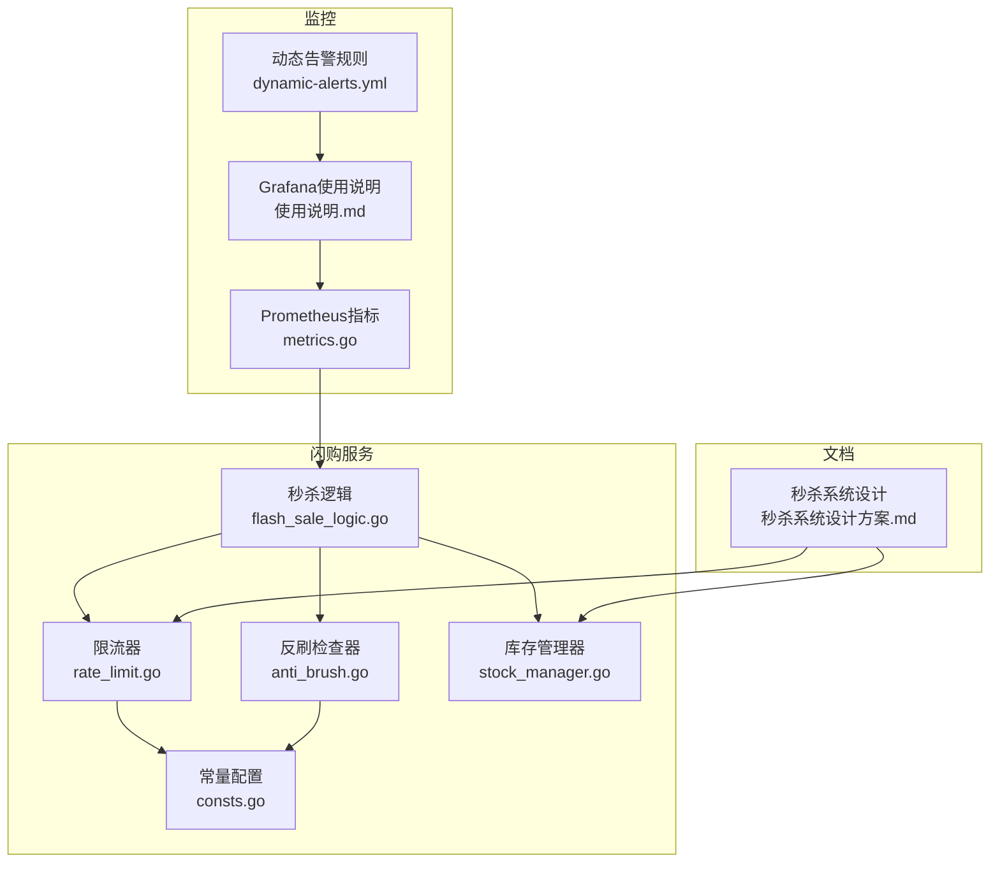
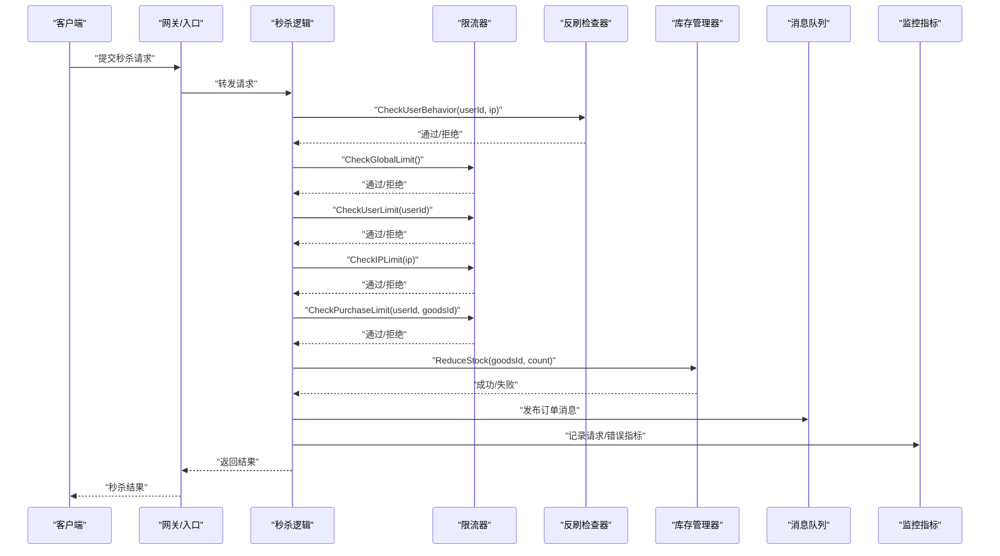
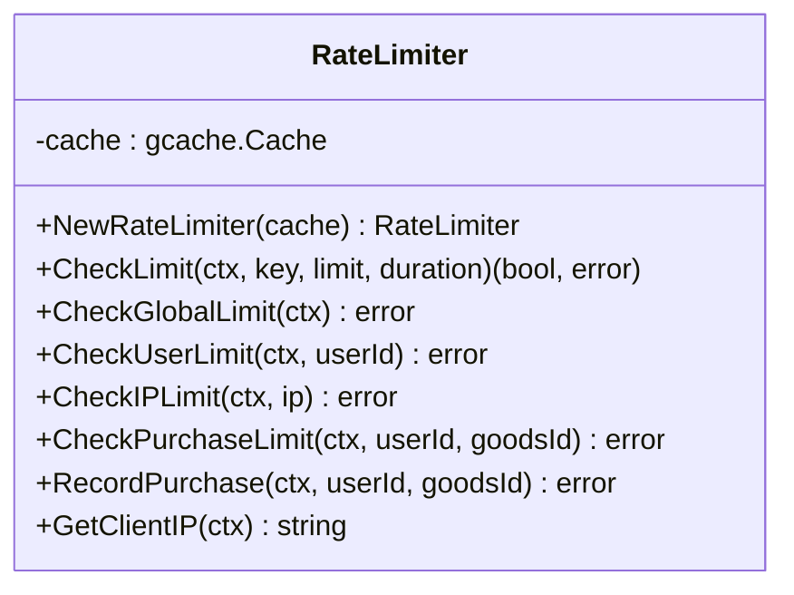
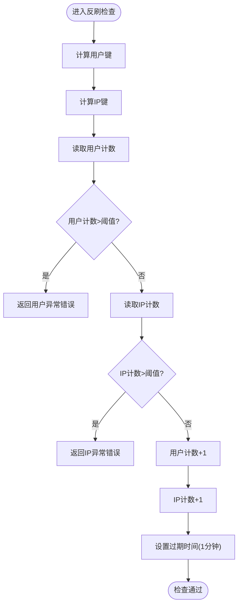
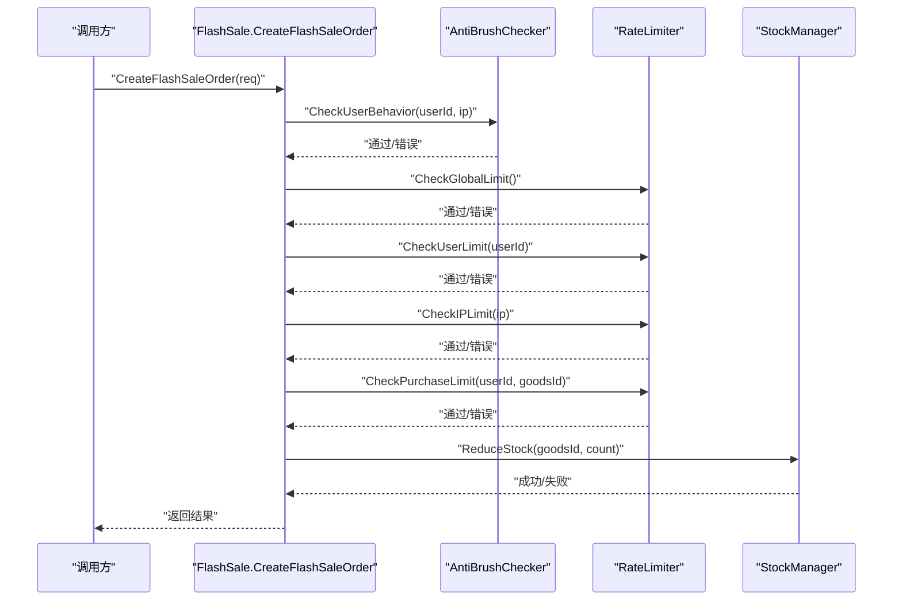
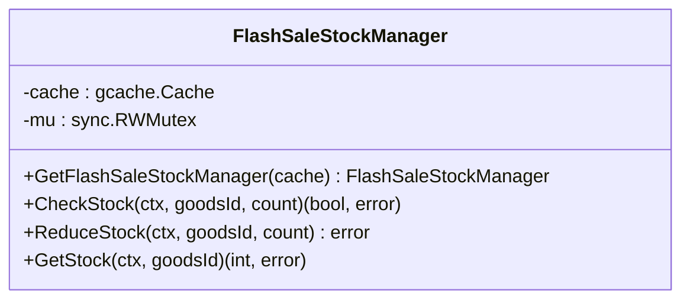
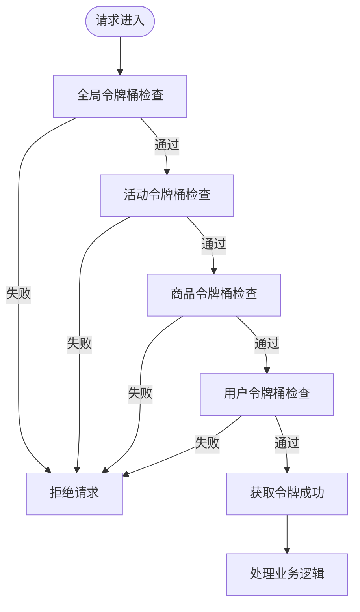
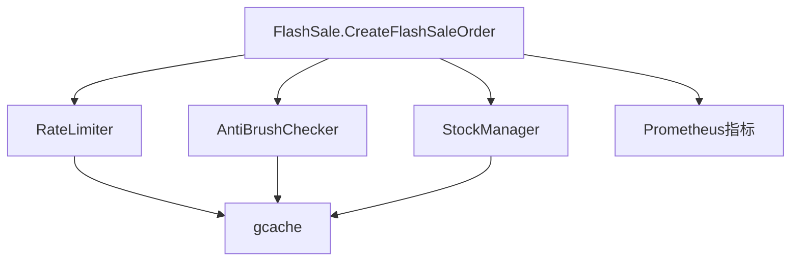

# 限流算法实现

<cite>
**本文档引用的文件**
- [app/flash-sale/utility/rate_limit.go](file://app/flash-sale/utility/rate_limit.go)
- [app/flash-sale/utility/anti_brush.go](file://app/flash-sale/utility/anti_brush.go)
- [app/flash-sale/internal/consts/consts.go](file://app/flash-sale/internal/consts/consts.go)
- [app/flash-sale/internal/logic/flash_sale_logic.go](file://app/flash-sale/internal/logic/flash_sale_logic.go)
- [app/flash-sale/utility/stock_manager.go](file://app/flash-sale/utility/stock_manager.go)
- [doc/秒杀系统设计方案.md](file://doc/秒杀系统设计方案.md)
- [utility/metrics/metrics.go](file://utility/metrics/metrics.go)
- [doc/grafana/使用说明.md](file://doc/grafana/使用说明.md)
- [doc/grafana/alert-rules/dynamic-alerts.yml](file://doc/grafana/alert-rules/dynamic-alerts.yml)
</cite>

## 目录
1. [简介](#简介)
2. [项目结构](#项目结构)
3. [核心组件](#核心组件)
4. [架构概览](#架构概览)
5. [详细组件分析](#详细组件分析)
6. [依赖关系分析](#依赖关系分析)
7. [性能考虑](#性能考虑)
8. [故障排查指南](#故障排查指南)
9. [结论](#结论)
10. [附录](#附录)

## 简介
本文件系统性梳理了微服务项目中的限流算法实现，重点覆盖秒杀场景下的限流策略与反刷机制。内容包括：
- 限流算法原理与实现细节（计数器、滑动窗口、令牌桶等）
- 秒杀场景的多层级限流策略（全局、用户、IP、购买限制）
- 反刷机制（IP限制、用户行为分析、黑名单）
- 监控与调优方法（Prometheus指标、Grafana告警）

## 项目结构
围绕限流与反刷的关键目录与文件：
- app/flash-sale/utility：限流与反刷工具类
- app/flash-sale/internal/logic：秒杀业务逻辑，集成限流与反刷
- app/flash-sale/internal/consts：限流与反刷常量配置
- app/flash-sale/utility/stock_manager.go：库存管理（与限流配合防超卖）
- doc/秒杀系统设计方案.md：整体架构与令牌桶设计
- utility/metrics：Prometheus指标埋点
- doc/grafana：Grafana监控与告警配置

**图表来源**
- [app/flash-sale/utility/rate_limit.go](file://app/flash-sale/utility/rate_limit.go#L1-L161)
- [app/flash-sale/utility/anti_brush.go](file://app/flash-sale/utility/anti_brush.go#L1-L81)
- [app/flash-sale/utility/stock_manager.go](file://app/flash-sale/utility/stock_manager.go#L1-L90)
- [app/flash-sale/internal/logic/flash_sale_logic.go](file://app/flash-sale/internal/logic/flash_sale_logic.go#L102-L254)
- [app/flash-sale/internal/consts/consts.go](file://app/flash-sale/internal/consts/consts.go#L1-L43)
- [utility/metrics/metrics.go](file://utility/metrics/metrics.go#L1-L71)
- [doc/grafana/使用说明.md](file://doc/grafana/使用说明.md#L46-L190)
- [doc/grafana/alert-rules/dynamic-alerts.yml](file://doc/grafana/alert-rules/dynamic-alerts.yml#L1-L32)
- [doc/秒杀系统设计方案.md](file://doc/秒杀系统设计方案.md#L1-L200)

**章节来源**
- [app/flash-sale/utility/rate_limit.go](file://app/flash-sale/utility/rate_limit.go#L1-L161)
- [app/flash-sale/utility/anti_brush.go](file://app/flash-sale/utility/anti_brush.go#L1-L81)
- [app/flash-sale/internal/logic/flash_sale_logic.go](file://app/flash-sale/internal/logic/flash_sale_logic.go#L102-L254)
- [app/flash-sale/internal/consts/consts.go](file://app/flash-sale/internal/consts/consts.go#L1-L43)
- [utility/metrics/metrics.go](file://utility/metrics/metrics.go#L1-L71)
- [doc/grafana/使用说明.md](file://doc/grafana/使用说明.md#L46-L190)
- [doc/grafana/alert-rules/dynamic-alerts.yml](file://doc/grafana/alert-rules/dynamic-alerts.yml#L1-L32)
- [doc/秒杀系统设计方案.md](file://doc/秒杀系统设计方案.md#L1-L200)

## 核心组件
- 限流器（RateLimiter）：基于gcache实现的计数器限流，支持全局、用户、IP、购买限制
- 反刷检查器（AntiBrushChecker）：基于gcache的行为分析与异常检测
- 秒杀逻辑（FlashSale.CreateFlashSaleOrder）：串联限流与反刷检查，执行库存扣减与异步处理
- 常量配置（consts）：统一管理限流阈值、过期时间、黑名单配置
- 库存管理器（StockManager）：提供库存检查与扣减能力，与限流共同防止超卖
- 监控指标（metrics）：HTTP请求计数、延迟、错误等指标，便于限流效果评估与调优

**章节来源**
- [app/flash-sale/utility/rate_limit.go](file://app/flash-sale/utility/rate_limit.go#L13-L49)
- [app/flash-sale/utility/anti_brush.go](file://app/flash-sale/utility/anti_brush.go#L12-L80)
- [app/flash-sale/internal/logic/flash_sale_logic.go](file://app/flash-sale/internal/logic/flash_sale_logic.go#L102-L254)
- [app/flash-sale/internal/consts/consts.go](file://app/flash-sale/internal/consts/consts.go#L9-L42)
- [app/flash-sale/utility/stock_manager.go](file://app/flash-sale/utility/stock_manager.go#L12-L89)
- [utility/metrics/metrics.go](file://utility/metrics/metrics.go#L14-L71)

## 架构概览
下图展示了秒杀请求在进入核心业务前的多层限流与反刷检查流程，以及与库存管理、监控系统的交互。

**图表来源**
- [app/flash-sale/internal/logic/flash_sale_logic.go](file://app/flash-sale/internal/logic/flash_sale_logic.go#L102-L254)
- [app/flash-sale/utility/rate_limit.go](file://app/flash-sale/utility/rate_limit.go#L105-L141)
- [app/flash-sale/utility/anti_brush.go](file://app/flash-sale/utility/anti_brush.go#L24-L80)
- [app/flash-sale/utility/stock_manager.go](file://app/flash-sale/utility/stock_manager.go#L50-L73)
- [utility/metrics/metrics.go](file://utility/metrics/metrics.go#L62-L71)

## 详细组件分析

### 限流器（RateLimiter）
- 设计要点
  - 基于gcache的计数器限流，每次请求增加计数并设置过期时间
  - 支持多粒度限流：全局、用户、IP、购买限制
  - 提供便捷的IP解析函数，优先从代理头获取真实IP
- 关键方法
  - CheckLimit：通用限流检查，内部实现计数与过期时间维护
  - CheckGlobalLimit：全局限流
  - CheckUserLimit：用户级别限流（每秒/每分钟）
  - CheckIPLimit：IP级别限流
  - CheckPurchaseLimit：购买限制（每小时仅一次）
  - RecordPurchase：记录购买，用于限购检查
- 算法选择与复杂度
  - 实现为计数器限流（滑动窗口的简化版），时间复杂度O(1)，空间复杂度O(k)（k为键数量）
  - 适合高并发场景，但对突发流量的平滑能力有限
- 参数配置
  - 全局限流：每秒1000次
  - 用户限流：每秒10次，每分钟10次
  - IP限流：每秒50次，每分钟50次
  - 购买限制：每小时1次
- 适用场景
  - 防刷与削峰填谷
  - 防止个别用户或IP滥用

**图表来源**
- [app/flash-sale/utility/rate_limit.go](file://app/flash-sale/utility/rate_limit.go#L13-L161)

**章节来源**
- [app/flash-sale/utility/rate_limit.go](file://app/flash-sale/utility/rate_limit.go#L13-L161)
- [app/flash-sale/internal/consts/consts.go](file://app/flash-sale/internal/consts/consts.go#L28-L42)

### 反刷检查器（AntiBrushChecker）
- 设计要点
  - 基于gcache的用户与IP行为计数，每分钟统计请求次数
  - 异常行为检测：超过阈值则拒绝请求
  - 支持黑名单扩展（通过常量定义）
- 关键方法
  - CheckUserBehavior：检查用户与IP行为频率，超过阈值返回错误
  - 内部维护用户与IP计数键，过期时间为1分钟
- 阈值配置
  - 用户每分钟最多20次
  - IP每分钟最多50次
- 适用场景
  - 识别异常刷单行为，保护系统稳定性

**图表来源**
- [app/flash-sale/utility/anti_brush.go](file://app/flash-sale/utility/anti_brush.go#L24-L80)

**章节来源**
- [app/flash-sale/utility/anti_brush.go](file://app/flash-sale/utility/anti_brush.go#L12-L80)
- [app/flash-sale/internal/consts/consts.go](file://app/flash-sale/internal/consts/consts.go#L37-L42)

### 秒杀逻辑（CreateFlashSaleOrder）
- 流程要点
  - 参数校验
  - 获取客户端IP
  - 创建限流器与反刷检查器
  - 反刷检查
  - 全局限流检查
  - 用户限流检查
  - IP限流检查
  - 购买限制检查
  - 库存扣减
  - 记录购买
  - 生成订单号
  - 记录秒杀结果
  - 发布消息到队列
- 关键决策点
  - 任一限流或反刷检查失败均直接返回错误
  - 库存扣减失败返回失败结果
  - 记录购买失败不影响主流程

**图表来源**
- [app/flash-sale/internal/logic/flash_sale_logic.go](file://app/flash-sale/internal/logic/flash_sale_logic.go#L102-L254)

**章节来源**
- [app/flash-sale/internal/logic/flash_sale_logic.go](file://app/flash-sale/internal/logic/flash_sale_logic.go#L102-L254)

### 库存管理器（StockManager）
- 设计要点
  - 提供库存检查与扣减能力
  - 使用互斥锁保证并发安全
  - 与限流器配合，避免超卖
- 关键方法
  - CheckStock：检查可用库存
  - ReduceStock：扣减库存（并发安全）
  - GetStock：获取当前库存
- 注意事项
  - 当前实现为内存计数，未使用Redis Lua脚本
  - 与限流器配合可满足基本防超卖需求

**图表来源**
- [app/flash-sale/utility/stock_manager.go](file://app/flash-sale/utility/stock_manager.go#L12-L89)

**章节来源**
- [app/flash-sale/utility/stock_manager.go](file://app/flash-sale/utility/stock_manager.go#L12-L89)

### 令牌桶与多层削峰（设计文档）
- 设计概述
  - 文档提出基于Sentinel网关限流与令牌桶削峰的整体方案
  - 多层令牌桶策略：全局、活动、商品、用户四级
- 令牌桶Lua脚本
  - 基于Redis Hash存储桶状态（上次补给时间、可用令牌数）
  - 原子性判断与扣减令牌
- 多层令牌桶策略
  - 全局令牌桶：1000个/秒
  - 活动令牌桶：500个/秒
  - 商品令牌桶：100个/秒
  - 用户令牌桶：5个/秒
- 自适应调整
  - 基于系统负载动态调整令牌生成速率
  - 支持监控与配置持久化

**图表来源**
- [doc/秒杀系统设计方案.md](file://doc/秒杀系统设计方案.md#L720-L830)
- [doc/秒杀系统设计方案.md](file://doc/秒杀系统设计方案.md#L832-L950)
- [doc/秒杀系统设计方案.md](file://doc/秒杀系统设计方案.md#L1125-L1162)

**章节来源**
- [doc/秒杀系统设计方案.md](file://doc/秒杀系统设计方案.md#L720-L830)
- [doc/秒杀系统设计方案.md](file://doc/秒杀系统设计方案.md#L832-L950)
- [doc/秒杀系统设计方案.md](file://doc/秒杀系统设计方案.md#L1125-L1162)

## 依赖关系分析
- 组件耦合
  - 秒杀逻辑依赖限流器与反刷检查器，耦合度适中
  - 限流器与反刷检查器共享gcache缓存，降低外部依赖
  - 库存管理器与限流器相互配合，共同保障一致性
- 外部依赖
  - gcache：作为限流与行为计数的存储
  - Prometheus/Grafana：监控与告警
  - 文档中的Sentinel与RabbitMQ：整体架构的其他组件

**图表来源**
- [app/flash-sale/internal/logic/flash_sale_logic.go](file://app/flash-sale/internal/logic/flash_sale_logic.go#L102-L254)
- [app/flash-sale/utility/rate_limit.go](file://app/flash-sale/utility/rate_limit.go#L13-L49)
- [app/flash-sale/utility/anti_brush.go](file://app/flash-sale/utility/anti_brush.go#L12-L22)
- [app/flash-sale/utility/stock_manager.go](file://app/flash-sale/utility/stock_manager.go#L12-L31)
- [utility/metrics/metrics.go](file://utility/metrics/metrics.go#L45-L55)

**章节来源**
- [app/flash-sale/internal/logic/flash_sale_logic.go](file://app/flash-sale/internal/logic/flash_sale_logic.go#L102-L254)
- [app/flash-sale/utility/rate_limit.go](file://app/flash-sale/utility/rate_limit.go#L13-L49)
- [app/flash-sale/utility/anti_brush.go](file://app/flash-sale/utility/anti_brush.go#L12-L22)
- [app/flash-sale/utility/stock_manager.go](file://app/flash-sale/utility/stock_manager.go#L12-L31)
- [utility/metrics/metrics.go](file://utility/metrics/metrics.go#L45-L55)

## 性能考虑
- 计数器限流优势
  - O(1)时间复杂度，适合高并发
  - 无跨进程共享状态，部署简单
- 局限性
  - 对突发流量平滑能力有限
  - 需要更精细的限流策略（如令牌桶）应对尖峰流量
- 优化建议
  - 引入令牌桶（参考设计文档中的Lua脚本与多层策略）
  - 使用Redis Lua脚本实现原子性库存扣减，避免超卖
  - 结合Sentinel网关限流与动态阈值告警，提升系统稳定性

[本节为通用性能讨论，无需特定文件分析]

## 故障排查指南
- 常见问题
  - 限流频繁触发：检查阈值配置与流量特征，适当放宽或引入令牌桶
  - 反刷误判：调整用户/IP阈值，结合黑名单策略
  - 库存超卖：确认库存扣减是否原子化，必要时迁移至Redis Lua脚本
  - 监控缺失：确认Prometheus指标暴露与Grafana看板导入
- 排查步骤
  - 查看日志：定位限流/反刷/库存扣减失败的具体环节
  - 指标核对：通过Prometheus查询请求量、错误率、延迟
  - 告警联动：启用动态阈值告警，及时发现异常波动
- 相关配置
  - 监控指标暴露端点与中间件集成
  - Grafana看板与动态告警规则

**章节来源**
- [utility/metrics/metrics.go](file://utility/metrics/metrics.go#L45-L71)
- [doc/grafana/使用说明.md](file://doc/grafana/使用说明.md#L46-L190)
- [doc/grafana/alert-rules/dynamic-alerts.yml](file://doc/grafana/alert-rules/dynamic-alerts.yml#L1-L32)

## 结论
- 现有实现采用计数器限流与行为分析，满足基础防刷与削峰需求
- 秒杀场景建议引入令牌桶与Sentinel网关限流，结合Redis Lua脚本实现原子性库存扣减
- 通过Prometheus与Grafana建立完善的监控与告警体系，持续优化限流阈值与策略

[本节为总结性内容，无需特定文件分析]

## 附录

### 限流策略与参数配置清单
- 全局限流：每秒1000次
- 用户限流：每秒10次，每分钟10次
- IP限流：每秒50次，每分钟50次
- 购买限制：每小时1次
- 反刷阈值：用户每分钟20次，IP每分钟50次

**章节来源**
- [app/flash-sale/utility/rate_limit.go](file://app/flash-sale/utility/rate_limit.go#L105-L141)
- [app/flash-sale/internal/consts/consts.go](file://app/flash-sale/internal/consts/consts.go#L28-L42)
- [app/flash-sale/utility/anti_brush.go](file://app/flash-sale/utility/anti_brush.go#L30-L54)

### 监控与告警配置
- 指标暴露：/metrics端点
- 关键指标：HTTP请求计数、延迟、服务错误
- Grafana看板：导入go-service-monitoring.json
- 动态阈值告警：基于历史数据的异常检测

**章节来源**
- [utility/metrics/metrics.go](file://utility/metrics/metrics.go#L45-L71)
- [doc/grafana/使用说明.md](file://doc/grafana/使用说明.md#L46-L190)
- [doc/grafana/alert-rules/dynamic-alerts.yml](file://doc/grafana/alert-rules/dynamic-alerts.yml#L1-L32)