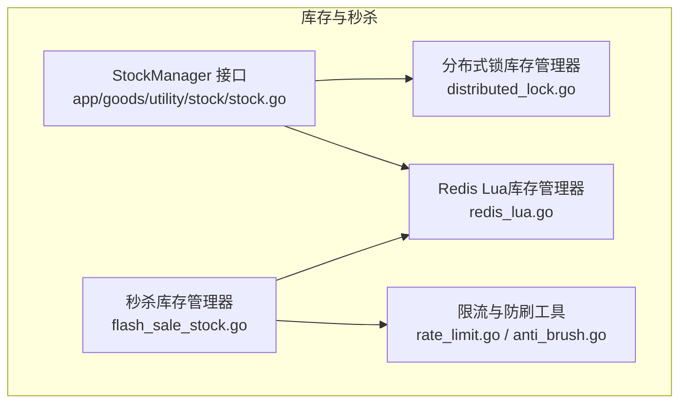
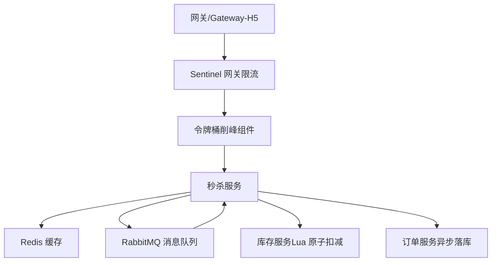
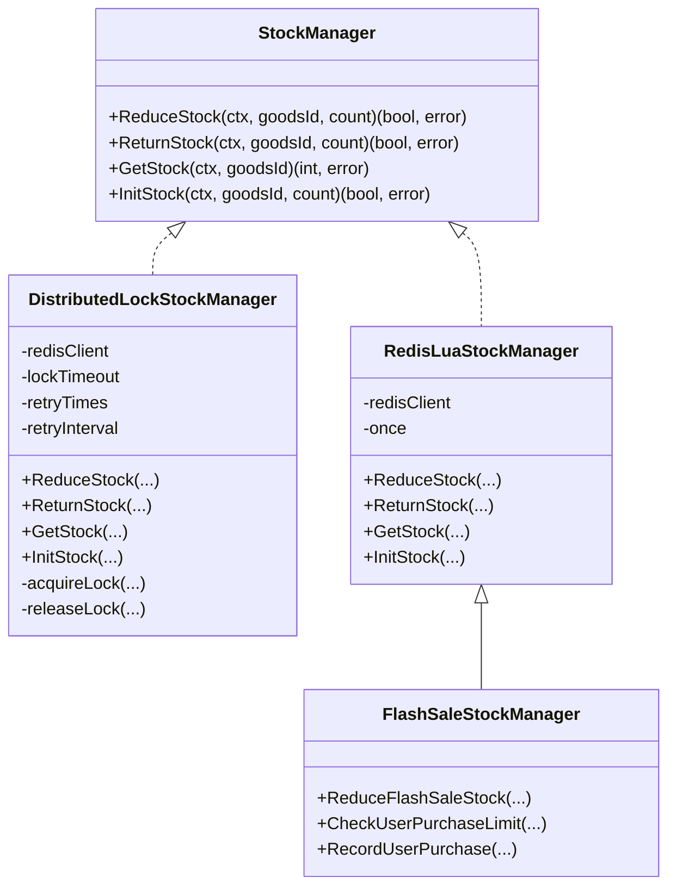
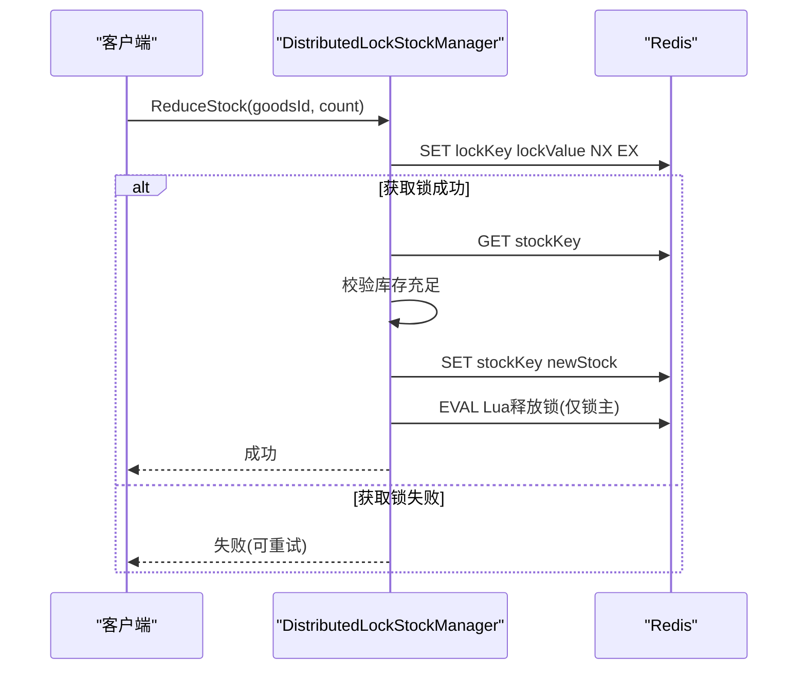
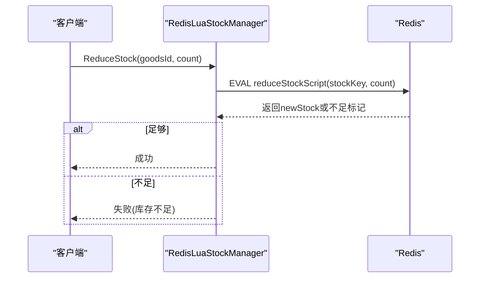
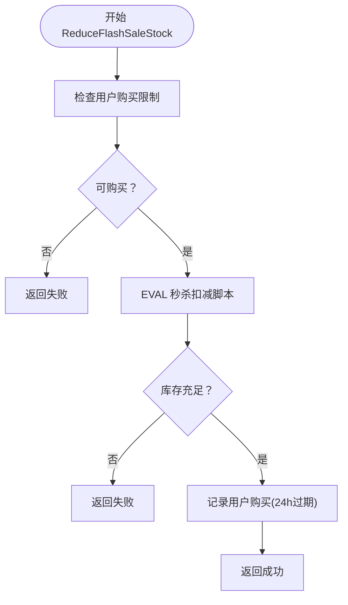
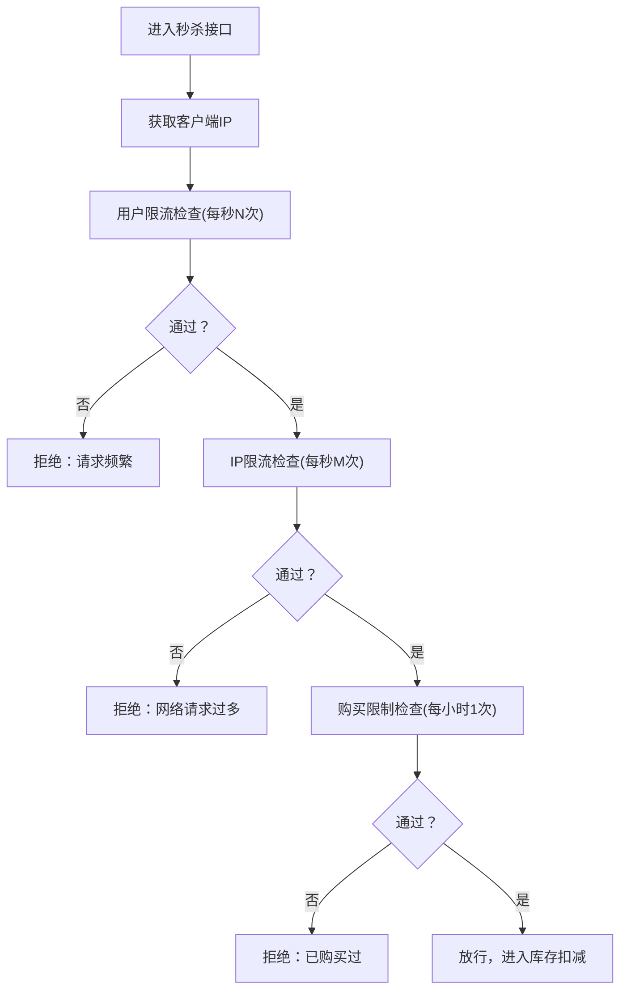
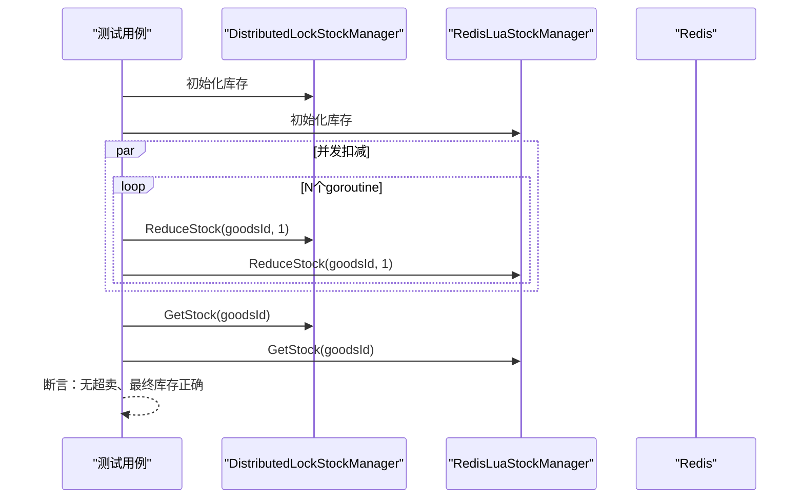
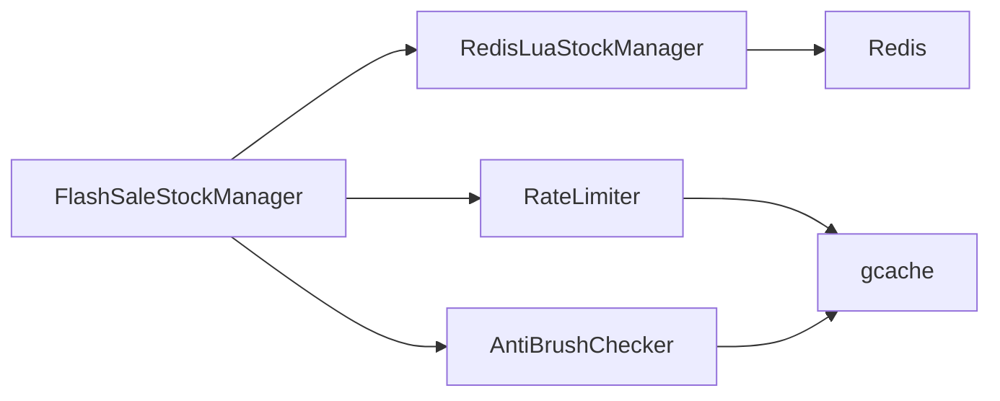

# 高并发处理机制

<cite>
**本文引用的文件**
- [app/goods/utility/stock/stock.go](file://app/goods/utility/stock/stock.go)
- [app/goods/utility/stock/distributed_lock.go](file://app/goods/utility/stock/distributed_lock.go)
- [app/goods/utility/stock/redis_lua.go](file://app/goods/utility/stock/redis_lua.go)
- [app/goods/utility/stock/flash_sale_stock.go](file://app/goods/utility/stock/flash_sale_stock.go)
- [app/goods/utility/stock/stock_test.go](file://app/goods/utility/stock/stock_test.go)
- [app/flash-sale/utility/rate_limit.go](file://app/flash-sale/utility/rate_limit.go)
- [app/flash-sale/utility/anti_brush.go](file://app/flash-sale/utility/anti_brush.go)
- [doc/库存防超卖（Redis Lua+分布式锁对比实践）.md](file://doc/库存防超卖（Redis Lua+分布式锁对比实践）.md)
- [doc/秒杀系统设计方案.md](file://doc/秒杀系统设计方案.md)
</cite>

## 目录
1. [引言](#引言)
2. [项目结构](#项目结构)
3. [核心组件](#核心组件)
4. [架构总览](#架构总览)
5. [详细组件分析](#详细组件分析)
6. [依赖分析](#依赖分析)
7. [性能考量](#性能考量)
8. [故障排查指南](#故障排查指南)
9. [结论](#结论)
10. [附录](#附录)

## 引言
本文件聚焦于高并发处理机制，围绕库存扣减、分布式锁、限流策略、并发控制与秒杀系统方案展开，结合仓库中的实现与文档，给出可操作的技术方案、可视化流程图与排障建议。目标读者既包括一线开发者，也包括对高并发主题感兴趣的非技术读者。

## 项目结构
本项目的高并发相关实现主要集中在以下模块：
- 库存管理与扣减：goods/utility/stock（接口、分布式锁实现、Lua脚本实现、秒杀扩展）
- 秒杀系统限流与防刷：flash-sale/utility（令牌桶、限流、防刷）
- 文档支撑：doc（库存防超卖对比实践、秒杀系统设计方案）

图表来源
- [app/goods/utility/stock/stock.go](file://app/goods/utility/stock/stock.go#L7-L31)
- [app/goods/utility/stock/distributed_lock.go](file://app/goods/utility/stock/distributed_lock.go#L13-L29)
- [app/goods/utility/stock/redis_lua.go](file://app/goods/utility/stock/redis_lua.go#L12-L23)
- [app/goods/utility/stock/flash_sale_stock.go](file://app/goods/utility/stock/flash_sale_stock.go#L14-L40)
- [app/flash-sale/utility/rate_limit.go](file://app/flash-sale/utility/rate_limit.go#L13-L23)
- [app/flash-sale/utility/anti_brush.go](file://app/flash-sale/utility/anti_brush.go#L12-L22)

章节来源
- [app/goods/utility/stock/stock.go](file://app/goods/utility/stock/stock.go#L7-L31)
- [app/goods/utility/stock/distributed_lock.go](file://app/goods/utility/stock/distributed_lock.go#L13-L29)
- [app/goods/utility/stock/redis_lua.go](file://app/goods/utility/stock/redis_lua.go#L12-L23)
- [app/goods/utility/stock/flash_sale_stock.go](file://app/goods/utility/stock/flash_sale_stock.go#L14-L40)
- [app/flash-sale/utility/rate_limit.go](file://app/flash-sale/utility/rate_limit.go#L13-L23)
- [app/flash-sale/utility/anti_brush.go](file://app/flash-sale/utility/anti_brush.go#L12-L22)

## 核心组件
- StockManager 接口：定义库存扣减、返还、查询、初始化的标准能力，便于替换实现。
- 分布式锁库存管理器：基于 Redis SET NX + Lua 原子释放，保障同一商品在同一时刻只有一个扣减操作。
- Redis Lua 库存管理器：将“读取—判断—写入”封装为原子脚本，避免竞态条件。
- 秒杀库存管理器：在 Lua 基础上增加用户购买限制与缓存记录，支持原子扣减与幂等记录。
- 限流与防刷：基于 gcache 的计数器实现用户/IP/全局限流与购买限制；配合 Sentinel 与令牌桶削峰。

章节来源
- [app/goods/utility/stock/stock.go](file://app/goods/utility/stock/stock.go#L7-L31)
- [app/goods/utility/stock/distributed_lock.go](file://app/goods/utility/stock/distributed_lock.go#L13-L29)
- [app/goods/utility/stock/redis_lua.go](file://app/goods/utility/stock/redis_lua.go#L12-L23)
- [app/goods/utility/stock/flash_sale_stock.go](file://app/goods/utility/stock/flash_sale_stock.go#L14-L40)
- [app/flash-sale/utility/rate_limit.go](file://app/flash-sale/utility/rate_limit.go#L13-L23)
- [app/flash-sale/utility/anti_brush.go](file://app/flash-sale/utility/anti_brush.go#L12-L22)

## 架构总览
下图展示了秒杀系统在高并发下的关键路径：网关限流/Sentinel、令牌桶削峰、Redis 缓存与库存服务、消息队列异步处理。

图表来源
- [doc/秒杀系统设计方案.md](file://doc/秒杀系统设计方案.md#L7-L21)
- [doc/秒杀系统设计方案.md](file://doc/秒杀系统设计方案.md#L252-L343)
- [doc/秒杀系统设计方案.md](file://doc/秒杀系统设计方案.md#L628-L758)

## 详细组件分析

### 库存接口与实现对比
- 接口职责清晰：扣减/返还/查询/初始化，便于替换与测试。
- 分布式锁实现：通过 NX + EX 获取锁，Lua 原子释放，避免误删；重试机制缓解短暂拥塞。
- Lua 脚本实现：将“读取—判断—写入”封装为原子脚本，减少网络往返，避免竞态。

图表来源
- [app/goods/utility/stock/stock.go](file://app/goods/utility/stock/stock.go#L7-L31)
- [app/goods/utility/stock/distributed_lock.go](file://app/goods/utility/stock/distributed_lock.go#L13-L29)
- [app/goods/utility/stock/redis_lua.go](file://app/goods/utility/stock/redis_lua.go#L12-L23)
- [app/goods/utility/stock/flash_sale_stock.go](file://app/goods/utility/stock/flash_sale_stock.go#L14-L40)

章节来源
- [app/goods/utility/stock/stock.go](file://app/goods/utility/stock/stock.go#L7-L31)
- [app/goods/utility/stock/distributed_lock.go](file://app/goods/utility/stock/distributed_lock.go#L13-L29)
- [app/goods/utility/stock/redis_lua.go](file://app/goods/utility/stock/redis_lua.go#L12-L23)
- [app/goods/utility/stock/flash_sale_stock.go](file://app/goods/utility/stock/flash_sale_stock.go#L14-L40)

### 分布式锁库存扣减流程
- 获取锁：SET NX EX，避免死锁。
- 执行业务：读取库存、判断、写入新库存。
- 原子释放：Lua 校验锁值后 DEL，避免误删。
- 重试与兜底：失败时按配置重试，确保一致性。

图表来源
- [app/goods/utility/stock/distributed_lock.go](file://app/goods/utility/stock/distributed_lock.go#L46-L89)
- [app/goods/utility/stock/distributed_lock.go](file://app/goods/utility/stock/distributed_lock.go#L91-L159)

章节来源
- [app/goods/utility/stock/distributed_lock.go](file://app/goods/utility/stock/distributed_lock.go#L46-L89)
- [app/goods/utility/stock/distributed_lock.go](file://app/goods/utility/stock/distributed_lock.go#L91-L159)

### Redis Lua 原子扣减流程
- 通过 EVAL 执行脚本，脚本内完成“读取—判断—写入”，保证原子性。
- 返回值语义明确：不足返回特定标记，成功返回新库存，便于上层判断。

图表来源
- [app/goods/utility/stock/redis_lua.go](file://app/goods/utility/stock/redis_lua.go#L75-L102)
- [app/goods/utility/stock/redis_lua.go](file://app/goods/utility/stock/redis_lua.go#L30-L53)

章节来源
- [app/goods/utility/stock/redis_lua.go](file://app/goods/utility/stock/redis_lua.go#L75-L102)
- [app/goods/utility/stock/redis_lua.go](file://app/goods/utility/stock/redis_lua.go#L30-L53)

### 秒杀库存与用户限购
- 秒杀库存键与普通库存分离，避免干扰。
- 用户限购：基于缓存检查用户是否已购买，设置短期过期，实现幂等记录。
- 原子扣减：Lua 脚本保证库存一致性；记录失败时回滚库存，降低不一致风险。

图表来源
- [app/goods/utility/stock/flash_sale_stock.go](file://app/goods/utility/stock/flash_sale_stock.go#L52-L99)
- [app/goods/utility/stock/flash_sale_stock.go](file://app/goods/utility/stock/flash_sale_stock.go#L101-L125)

章节来源
- [app/goods/utility/stock/flash_sale_stock.go](file://app/goods/utility/stock/flash_sale_stock.go#L52-L99)
- [app/goods/utility/stock/flash_sale_stock.go](file://app/goods/utility/stock/flash_sale_stock.go#L101-L125)

### 限流与防刷策略
- 用户/IP/全局限流：基于 gcache 计数器，首请求设置过期时间，后续递增。
- 购买限制：按用户+商品维度设置小时级限制，防止重复购买。
- 防刷检查：对用户与 IP 的行为频率进行分钟级统计，异常则拦截。

图表来源
- [app/flash-sale/utility/rate_limit.go](file://app/flash-sale/utility/rate_limit.go#L51-L83)
- [app/flash-sale/utility/rate_limit.go#L117-L141)
- [app/flash-sale/utility/rate_limit.go#L143-L154)
- [app/flash-sale/utility/anti_brush.go](file://app/flash-sale/utility/anti_brush.go#L24-L80)

章节来源
- [app/flash-sale/utility/rate_limit.go](file://app/flash-sale/utility/rate_limit.go#L51-L83)
- [app/flash-sale/utility/rate_limit.go](file://app/flash-sale/utility/rate_limit.go#L117-L141)
- [app/flash-sale/utility/rate_limit.go](file://app/flash-sale/utility/rate_limit.go#L143-L154)
- [app/flash-sale/utility/anti_brush.go](file://app/flash-sale/utility/anti_brush.go#L24-L80)

### 并发测试与对比验证
- 并发测试：多 goroutine 同时发起扣减请求，统计成功/失败与平均耗时。
- 对比验证：分别使用分布式锁与 Lua 脚本方案，验证最终库存与是否发生超卖。
- 边界测试：库存为 0、负数扣减、返还等场景覆盖。

图表来源
- [app/goods/utility/stock/stock_test.go](file://app/goods/utility/stock/stock_test.go#L32-L78)
- [app/goods/utility/stock/stock_test.go](file://app/goods/utility/stock/stock_test.go#L80-L201)

章节来源
- [app/goods/utility/stock/stock_test.go](file://app/goods/utility/stock/stock_test.go#L32-L78)
- [app/goods/utility/stock/stock_test.go](file://app/goods/utility/stock/stock_test.go#L80-L201)

## 依赖分析
- 组件耦合：秒杀库存管理器组合 Redis Lua 管理器，复用原子扣减能力；限流与防刷工具独立，便于注入到业务流程。
- 外部依赖：Redis（SET/NX/EX/EVAL/GET/SET）、gcache（计数器与过期控制）、Sentinel（网关限流）。
- 潜在风险：分布式锁的锁释放需严格使用 Lua；Lua 脚本执行超时需合理配置；缓存过期与回滚策略需一致。

图表来源
- [app/goods/utility/stock/flash_sale_stock.go](file://app/goods/utility/stock/flash_sale_stock.go#L28-L40)
- [app/flash-sale/utility/rate_limit.go](file://app/flash-sale/utility/rate_limit.go#L13-L23)
- [app/flash-sale/utility/anti_brush.go](file://app/flash-sale/utility/anti_brush.go#L12-L22)

章节来源
- [app/goods/utility/stock/flash_sale_stock.go](file://app/goods/utility/stock/flash_sale_stock.go#L28-L40)
- [app/flash-sale/utility/rate_limit.go](file://app/flash-sale/utility/rate_limit.go#L13-L23)
- [app/flash-sale/utility/anti_brush.go](file://app/flash-sale/utility/anti_brush.go#L12-L22)

## 性能考量
- 原子性与网络开销：Lua 脚本将多次往返合并为一次 EVAL，显著降低 RTT 与竞态风险。
- 锁竞争与吞吐：分布式锁在高并发下易产生锁竞争与等待，Lua 方案吞吐更高、扩展性更好。
- 缓存与预热：热点商品库存预热至 Redis，减少冷启动抖动。
- 限流与削峰：Sentinel 全局限流与热点参数限流，结合令牌桶削峰，平滑突发流量。

章节来源
- [doc/库存防超卖（Redis Lua+分布式锁对比实践）.md](file://doc/库存防超卖（Redis Lua+分布式锁对比实践）.md#L110-L140)
- [doc/秒杀系统设计方案.md](file://doc/秒杀系统设计方案.md#L628-L758)

## 故障排查指南
- 超卖排查：核对最终库存与成功请求数，确认 Lua 脚本原子性执行；检查 Redis 是否启用持久化与主从同步。
- 锁相关问题：检查锁过期时间是否过短导致误释放；确认 Lua 释放脚本仅删除锁主持有的锁值。
- 限流误伤：核对用户/IP/全局限流阈值与时间窗口；观察 Sentinel 规则是否生效。
- 缓存一致性：购买记录过期时间与业务流程是否匹配；失败回滚是否触发。
- 性能异常：关注 Redis 命令耗时分布、Lua 脚本执行时间、Sentinel 拦截率与熔断触发。

章节来源
- [app/goods/utility/stock/distributed_lock.go](file://app/goods/utility/stock/distributed_lock.go#L46-L89)
- [app/goods/utility/stock/redis_lua.go](file://app/goods/utility/stock/redis_lua.go#L75-L102)
- [app/flash-sale/utility/rate_limit.go](file://app/flash-sale/utility/rate_limit.go#L104-L141)
- [doc/库存防超卖（Redis Lua+分布式锁对比实践）.md](file://doc/库存防超卖（Redis Lua+分布式锁对比实践）.md#L161-L224)

## 结论
- 在高并发库存扣减场景，优先采用 Redis Lua 原子脚本方案，具备更高的吞吐与稳定性。
- 分布式锁适用于需要跨多步操作与复杂业务协调的场景，但需谨慎处理锁的获取/释放与超时。
- 秒杀系统应结合 Sentinel 限流、令牌桶削峰、用户/IP/全局限流与防刷策略，形成多层防护。
- 通过对比测试与边界测试，持续验证库存一致性与系统鲁棒性。

## 附录
- 术语
  - 原子性：Redis 脚本或 Lua 原子释放，保证操作要么全部成功，要么全部不生效。
  - 削峰：通过令牌桶将突发流量平滑为恒定速率，降低下游压力。
  - 幂等：用户限购与购买记录通过短期过期实现，避免重复购买。