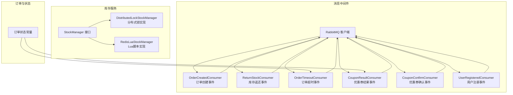
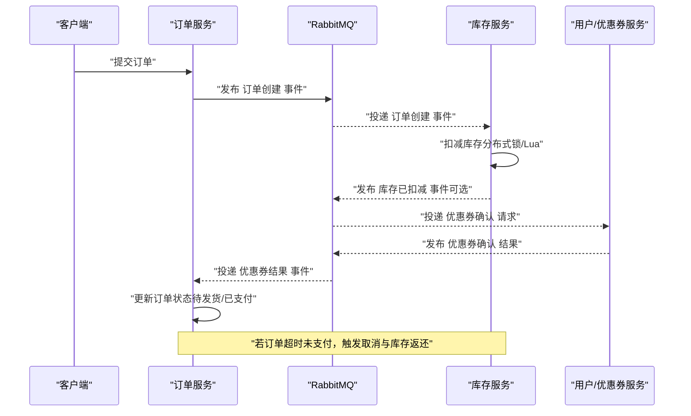
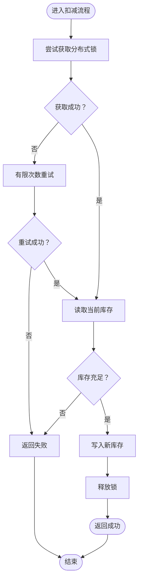
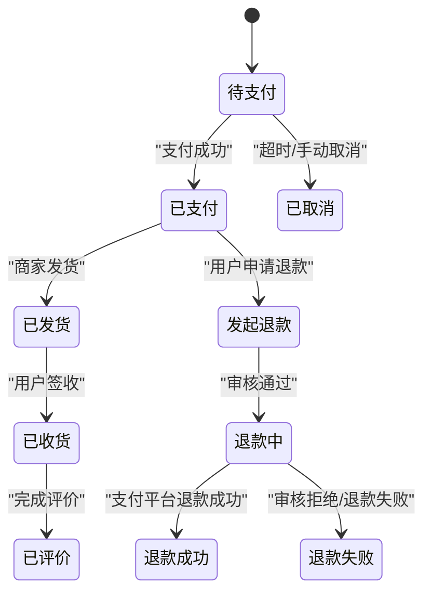
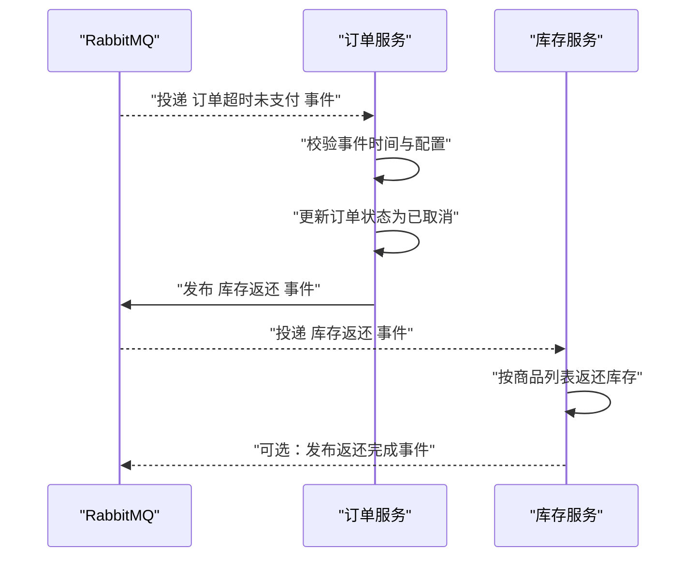
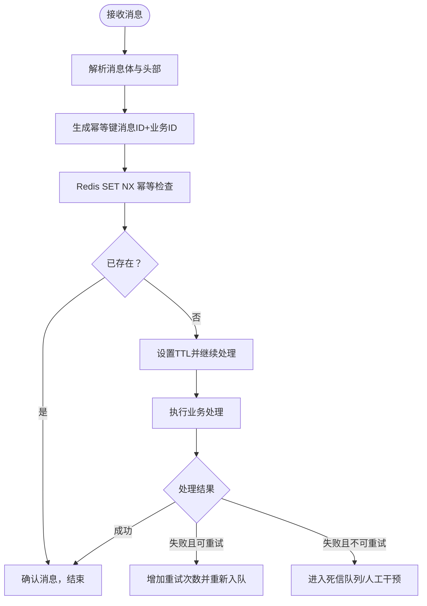
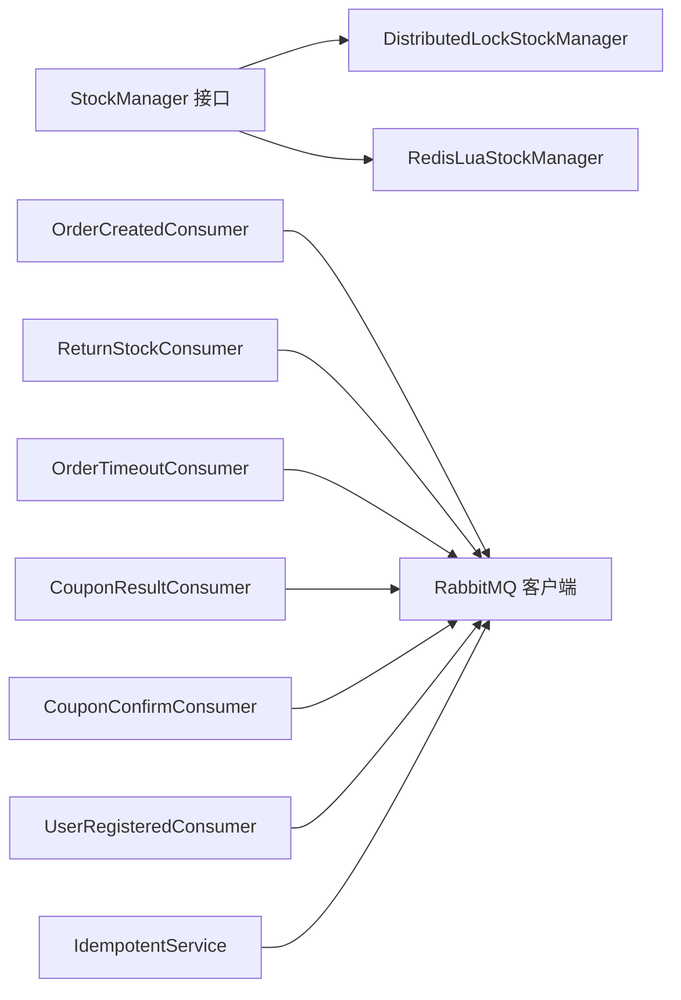

# 数据一致性

<cite>
**本文引用的文件**
- [app/goods/utility/stock/stock.go](file://app/goods/utility/stock/stock.go)
- [app/goods/utility/stock/distributed_lock.go](file://app/goods/utility/stock/distributed_lock.go)
- [app/goods/utility/stock/redis_lua.go](file://app/goods/utility/stock/redis_lua.go)
- [app/goods/utility/stock/stock_test.go](file://app/goods/utility/stock/stock_test.go)
- [app/goods/utility/consumer/order_created_consumer.go](file://app/goods/utility/consumer/order_created_consumer.go)
- [app/goods/utility/consumer/DEMO_WECHAT_OPEN_ID.go](file://app/goods/utility/consumer/DEMO_WECHAT_OPEN_ID.go)
- [app/goods/utility/consumer/coupon_confirm_consumer.go](file://app/goods/utility/consumer/coupon_confirm_consumer.go)
- [app/goods/utility/consumer/user_registered_consumer.go](file://app/goods/utility/consumer/user_registered_consumer.go)
- [app/order/utility/consumer/order_timeout_consumer.go](file://app/order/utility/consumer/order_timeout_consumer.go)
- [app/order/utility/consumer/coupon_result_consumer.go](file://app/order/utility/consumer/coupon_result_consumer.go)
- [app/order/internal/consts/order_status.go](file://app/order/internal/consts/order_status.go)
- [utility/rabbitmq/rabbitmq.go](file://utility/rabbitmq/rabbitmq.go)
- [utility/idempotent/idempotent.go](file://utility/idempotent/idempotent.go)
- [doc/RabbitMQ消息处理优化实战-幂等性与重试策略.md](file://doc/RabbitMQ消息处理优化实战-幂等性与重试策略.md)
</cite>

## 目录
1. [引言](#引言)
2. [项目结构](#项目结构)
3. [核心组件](#核心组件)
4. [架构总览](#架构总览)
5. [详细组件分析](#详细组件分析)
6. [依赖关系分析](#依赖关系分析)
7. [性能考量](#性能考量)
8. [故障排查指南](#故障排查指南)
9. [结论](#结论)
10. [附录](#附录)

## 引言
本文件聚焦于分布式环境下的数据一致性保障机制，结合仓库中的库存管理、订单状态同步与支付状态一致性实践，系统阐述最终一致性策略、消息幂等性与重试机制，并给出故障恢复与异常处理建议。文档以代码为依据，辅以可视化图示，帮助读者快速理解与落地。

## 项目结构
围绕数据一致性，系统主要由以下模块构成：
- 库存管理：提供两种库存扣减实现（分布式锁与Redis Lua原子脚本）
- 消息队列：统一RabbitMQ客户端与消费者管理，支撑事件驱动的最终一致性
- 订单与优惠券：通过消息事件完成跨服务的状态同步与补偿
- 幂等性与重试：在消息层面对重复投递与失败进行治理

图表来源
- [app/goods/utility/stock/stock.go](file://app/goods/utility/stock/stock.go#L7-L31)
- [app/goods/utility/stock/distributed_lock.go](file://app/goods/utility/stock/distributed_lock.go#L13-L29)
- [app/goods/utility/stock/redis_lua.go](file://app/goods/utility/stock/redis_lua.go#L12-L23)
- [app/goods/utility/consumer/order_created_consumer.go](file://app/goods/utility/consumer/order_created_consumer.go#L13-L30)
- [app/goods/utility/consumer/DEMO_WECHAT_OPEN_ID.go](file://app/goods/utility/consumer/DEMO_WECHAT_OPEN_ID.go#L12-L29)
- [app/order/utility/consumer/order_timeout_consumer.go](file://app/order/utility/consumer/order_timeout_consumer.go#L16-L37)
- [app/order/utility/consumer/coupon_result_consumer.go](file://app/order/utility/consumer/coupon_result_consumer.go#L11-L32)
- [app/goods/utility/consumer/coupon_confirm_consumer.go](file://app/goods/utility/consumer/coupon_confirm_consumer.go#L11-L32)
- [app/goods/utility/consumer/user_registered_consumer.go](file://app/goods/utility/consumer/user_registered_consumer.go#L11-L32)
- [utility/rabbitmq/rabbitmq.go](file://utility/rabbitmq/rabbitmq.go#L13-L82)
- [app/order/internal/consts/order_status.go](file://app/order/internal/consts/order_status.go#L3-L16)

章节来源
- [app/goods/utility/stock/stock.go](file://app/goods/utility/stock/stock.go#L1-L32)
- [utility/rabbitmq/rabbitmq.go](file://utility/rabbitmq/rabbitmq.go#L1-L196)

## 核心组件
- 库存管理接口与实现
  - StockManager：定义扣减、返还、查询、初始化库存的标准能力
  - DistributedLockStockManager：基于Redis SET NX + Lua安全释放，保证同一时刻仅一个请求写库存
  - RedisLuaStockManager：基于Lua脚本原子性判断与扣减，避免分布式锁的复杂性
- 消息消费者
  - 订单创建事件消费者：扣减库存、清理购物车
  - 库存返还事件消费者：订单取消/超时触发的库存返还
  - 订单超时事件消费者：超时未支付触发取消与库存返还
  - 优惠券确认/结果消费者：跨服务状态同步
  - 用户注册事件消费者：发放优惠券
- 幂等性与重试
  - 幂等性服务：基于Redis SET NX实现消息幂等键
  - RabbitMQ客户端：指数退避重连、持久化消息、延迟消息

章节来源
- [app/goods/utility/stock/stock.go](file://app/goods/utility/stock/stock.go#L7-L31)
- [app/goods/utility/stock/distributed_lock.go](file://app/goods/utility/stock/distributed_lock.go#L13-L266)
- [app/goods/utility/stock/redis_lua.go](file://app/goods/utility/stock/redis_lua.go#L12-L166)
- [app/goods/utility/consumer/order_created_consumer.go](file://app/goods/utility/consumer/order_created_consumer.go#L13-L65)
- [app/goods/utility/consumer/DEMO_WECHAT_OPEN_ID.go](file://app/goods/utility/consumer/DEMO_WECHAT_OPEN_ID.go#L12-L58)
- [app/order/utility/consumer/order_timeout_consumer.go](file://app/order/utility/consumer/order_timeout_consumer.go#L16-L87)
- [app/order/utility/consumer/coupon_result_consumer.go](file://app/order/utility/consumer/coupon_result_consumer.go#L11-L54)
- [app/goods/utility/consumer/coupon_confirm_consumer.go](file://app/goods/utility/consumer/coupon_confirm_consumer.go#L11-L55)
- [app/goods/utility/consumer/user_registered_consumer.go](file://app/goods/utility/consumer/user_registered_consumer.go#L11-L55)
- [utility/idempotent/idempotent.go](file://utility/idempotent/idempotent.go#L11-L153)
- [utility/rabbitmq/rabbitmq.go](file://utility/rabbitmq/rabbitmq.go#L19-L196)

## 架构总览
系统采用事件驱动的最终一致性模型：
- 订单服务产生事件（创建、超时、优惠券结果）
- 库存服务与优惠券服务订阅事件，执行本地业务并更新自身状态
- 库存扣减通过分布式锁或Lua脚本保证原子性
- 消息层通过幂等性与重试策略保证可靠性

图表来源
- [app/goods/utility/consumer/order_created_consumer.go](file://app/goods/utility/consumer/order_created_consumer.go#L32-L64)
- [app/goods/utility/consumer/DEMO_WECHAT_OPEN_ID.go](file://app/goods/utility/consumer/DEMO_WECHAT_OPEN_ID.go#L31-L57)
- [app/order/utility/consumer/order_timeout_consumer.go](file://app/order/utility/consumer/order_timeout_consumer.go#L39-L86)
- [app/order/utility/consumer/coupon_result_consumer.go](file://app/order/utility/consumer/coupon_result_consumer.go#L34-L54)
- [app/goods/utility/consumer/coupon_confirm_consumer.go](file://app/goods/utility/consumer/coupon_confirm_consumer.go#L34-L54)
- [utility/rabbitmq/rabbitmq.go](file://utility/rabbitmq/rabbitmq.go#L84-L124)

## 详细组件分析

### 库存管理：分布式锁 vs Lua脚本
- 分布式锁实现要点
  - 获取锁：使用Redis SET命令带NX与过期，避免死锁
  - 安全释放：Lua脚本比较锁值后DEL，保证释放的原子性
  - 扣减流程：获取锁 -> 读取当前库存 -> 比较 -> 写入新库存 -> 释放锁
  - 重试策略：固定次数与间隔重试，失败返回“获取锁失败”
- Lua脚本实现要点
  - 原子判断与扣减：Lua脚本内GET/比较/SET，避免竞态
  - 返回码约定：库存不足返回特定值，上层据此判定
  - 查询与初始化：GET/SET键值，保证一致性

图表来源
- [app/goods/utility/stock/distributed_lock.go](file://app/goods/utility/stock/distributed_lock.go#L91-L159)
- [app/goods/utility/stock/redis_lua.go](file://app/goods/utility/stock/redis_lua.go#L75-L102)

章节来源
- [app/goods/utility/stock/distributed_lock.go](file://app/goods/utility/stock/distributed_lock.go#L46-L159)
- [app/goods/utility/stock/redis_lua.go](file://app/goods/utility/stock/redis_lua.go#L30-L102)
- [app/goods/utility/stock/stock_test.go](file://app/goods/utility/stock/stock_test.go#L32-L201)

### 订单状态同步与支付状态一致性
- 订单状态常量
  - 定义待支付、已支付、已发货、已收货、已完成、待确认、已取消、发起退款等状态
  - 退款状态与审核状态分离，分别对应“退款流程”和“审核流程”
- 支付与优惠券流程
  - 订单创建后，向用户服务发送优惠券确认请求
  - 用户服务处理完成后，回传优惠券结果事件
  - 订单服务根据结果更新订单状态

图表来源
- [app/order/internal/consts/order_status.go](file://app/order/internal/consts/order_status.go#L3-L38)

章节来源
- [app/order/internal/consts/order_status.go](file://app/order/internal/consts/order_status.go#L3-L38)
- [app/order/utility/consumer/coupon_result_consumer.go](file://app/order/utility/consumer/coupon_result_consumer.go#L34-L54)

### 订单超时与库存返还
- 订单超时未支付事件
  - 消费者解析事件并判断是否到达取消时间
  - 调用订单服务处理超时逻辑
  - 触发库存返还事件，交由库存服务处理
- 库存返还流程
  - 消费者读取事件中的商品清单
  - 调用库存返还逻辑，失败时可考虑重试（注释中提示）

图表来源
- [app/order/utility/consumer/order_timeout_consumer.go](file://app/order/utility/consumer/order_timeout_consumer.go#L39-L86)
- [app/goods/utility/consumer/DEMO_WECHAT_OPEN_ID.go](file://app/goods/utility/consumer/DEMO_WECHAT_OPEN_ID.go#L31-L57)

章节来源
- [app/order/utility/consumer/order_timeout_consumer.go](file://app/order/utility/consumer/order_timeout_consumer.go#L39-L86)
- [app/goods/utility/consumer/DEMO_WECHAT_OPEN_ID.go](file://app/goods/utility/consumer/DEMO_WECHAT_OPEN_ID.go#L31-L57)

### 消息幂等性与重试机制
- 幂等性
  - 基于Redis SET NX实现幂等键，键格式包含消息ID与业务ID
  - 消费前检查幂等键，已存在则直接确认消息，避免重复处理
- 重试策略
  - RabbitMQ客户端支持指数退避重连，降低雪崩风险
  - 文档中提供消费者侧的重试次数限制与错误分类（临时/永久）思路
  - 建议在消费者中对“可重试错误”进行限次重试，并将永久错误转至死信或人工介入

图表来源
- [utility/idempotent/idempotent.go](file://utility/idempotent/idempotent.go#L35-L79)
- [utility/rabbitmq/rabbitmq.go](file://utility/rabbitmq/rabbitmq.go#L19-L54)
- [doc/RabbitMQ消息处理优化实战-幂等性与重试策略.md](file://doc/RabbitMQ消息处理优化实战-幂等性与重试策略.md#L162-L195)

章节来源
- [utility/idempotent/idempotent.go](file://utility/idempotent/idempotent.go#L11-L153)
- [utility/rabbitmq/rabbitmq.go](file://utility/rabbitmq/rabbitmq.go#L19-L196)
- [doc/RabbitMQ消息处理优化实战-幂等性与重试策略.md](file://doc/RabbitMQ消息处理优化实战-幂等性与重试策略.md#L1-L492)

### 优惠券与用户注册事件
- 优惠券确认
  - 用户注册后，库存服务向用户服务发送优惠券确认请求
  - 用户服务处理后回传结果事件，订单服务据此更新状态
- 用户注册
  - 用户注册事件消费者发放优惠券，幂等键避免重复发券

章节来源
- [app/goods/utility/consumer/coupon_confirm_consumer.go](file://app/goods/utility/consumer/coupon_confirm_consumer.go#L34-L54)
- [app/order/utility/consumer/coupon_result_consumer.go](file://app/order/utility/consumer/coupon_result_consumer.go#L34-L54)
- [app/goods/utility/consumer/user_registered_consumer.go](file://app/goods/utility/consumer/user_registered_consumer.go#L34-L54)

## 依赖关系分析
- 库存服务内部依赖
  - StockManager接口被两种实现共同实现，便于替换与测试
  - 分布式锁实现依赖Redis客户端与Lua脚本释放
  - Lua脚本实现依赖Redis EVAL命令
- 消费者依赖
  - 各消费者依赖统一的RabbitMQ BaseConsumer与配置
  - 订单超时消费者依赖订单服务的处理函数与订单详情查询
- 幂等性与消息
  - 幂等性服务与消费者管理器配合，确保消息只处理一次
  - RabbitMQ客户端提供持久化与延迟消息能力

图表来源
- [app/goods/utility/stock/stock.go](file://app/goods/utility/stock/stock.go#L7-L31)
- [app/goods/utility/stock/distributed_lock.go](file://app/goods/utility/stock/distributed_lock.go#L13-L29)
- [app/goods/utility/stock/redis_lua.go](file://app/goods/utility/stock/redis_lua.go#L12-L23)
- [app/goods/utility/consumer/order_created_consumer.go](file://app/goods/utility/consumer/order_created_consumer.go#L13-L30)
- [app/goods/utility/consumer/DEMO_WECHAT_OPEN_ID.go](file://app/goods/utility/consumer/DEMO_WECHAT_OPEN_ID.go#L12-L29)
- [app/order/utility/consumer/order_timeout_consumer.go](file://app/order/utility/consumer/order_timeout_consumer.go#L16-L37)
- [app/order/utility/consumer/coupon_result_consumer.go](file://app/order/utility/consumer/coupon_result_consumer.go#L11-L32)
- [app/goods/utility/consumer/coupon_confirm_consumer.go](file://app/goods/utility/consumer/coupon_confirm_consumer.go#L11-L32)
- [app/goods/utility/consumer/user_registered_consumer.go](file://app/goods/utility/consumer/user_registered_consumer.go#L11-L32)
- [utility/idempotent/idempotent.go](file://utility/idempotent/idempotent.go#L11-L33)
- [utility/rabbitmq/rabbitmq.go](file://utility/rabbitmq/rabbitmq.go#L13-L82)

章节来源
- [app/goods/utility/stock/stock.go](file://app/goods/utility/stock/stock.go#L7-L31)
- [utility/rabbitmq/rabbitmq.go](file://utility/rabbitmq/rabbitmq.go#L13-L196)

## 性能考量
- 库存扣减
  - Lua脚本方案具备更强的原子性与更低的往返开销，适合高并发场景
  - 分布式锁方案在极端情况下存在锁竞争与释放成本，需合理设置重试参数
- 消息处理
  - 幂等键TTL建议结合业务最长处理时间设定，避免过长占用空间
  - 重试策略采用指数退避，防止雪崩；同时限制最大重试次数
- 缓存与数据库
  - 库存以Redis为主，数据库为辅，减少热点竞争

## 故障排查指南
- 库存超卖/不足
  - 检查库存扣减路径是否使用Lua脚本或分布式锁
  - 查看扣减前后的库存读取与比较逻辑
- 消息重复处理
  - 确认幂等键生成规则与TTL设置
  - 检查消费者是否在幂等检查后直接ACK
- 连接失败与重试
  - RabbitMQ客户端具备指数退避重连，关注日志中的重连次数
  - 对“临时性错误”与“永久性错误”进行区分，避免无限制重试
- 订单状态异常
  - 核对订单状态常量与更新条件，确保状态流转符合业务预期

章节来源
- [app/goods/utility/stock/distributed_lock.go](file://app/goods/utility/stock/distributed_lock.go#L91-L159)
- [app/goods/utility/stock/redis_lua.go](file://app/goods/utility/stock/redis_lua.go#L75-L102)
- [utility/idempotent/idempotent.go](file://utility/idempotent/idempotent.go#L35-L79)
- [utility/rabbitmq/rabbitmq.go](file://utility/rabbitmq/rabbitmq.go#L19-L54)
- [app/order/internal/consts/order_status.go](file://app/order/internal/consts/order_status.go#L3-L38)

## 结论
本项目通过“事件驱动 + 幂等性 + 原子性库存扣减”的组合，有效实现了分布式环境下的数据最终一致性。库存层面优先采用Lua脚本以获得更强的原子性与吞吐；消息层面通过幂等键与重试策略提升可靠性；状态同步通过明确的状态常量与事件流保障一致性。建议在生产环境中持续完善重试上限、死信路由与人工干预通道，以进一步增强韧性。

## 附录
- 术语
  - 最终一致性：系统在一段时间后达到一致状态，期间允许短暂不一致
  - 幂等性：重复执行同一操作结果不变
  - 原子性：操作要么全部成功，要么全部失败
- 参考文档
  - RabbitMQ消息处理优化实战：幂等性与重试策略