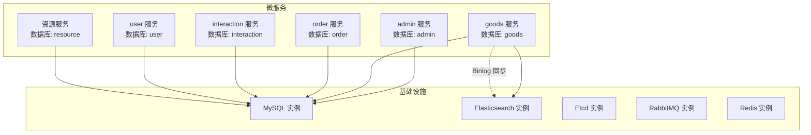
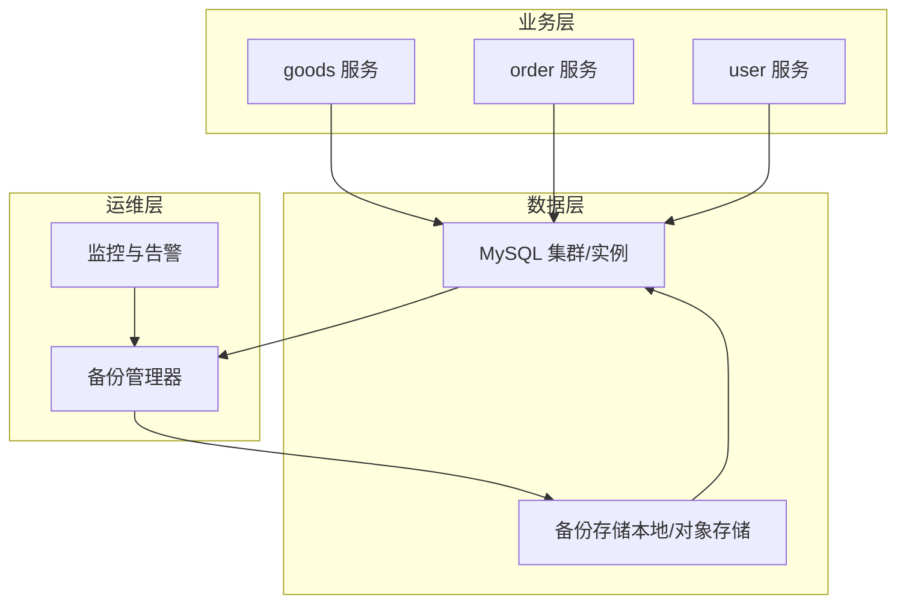
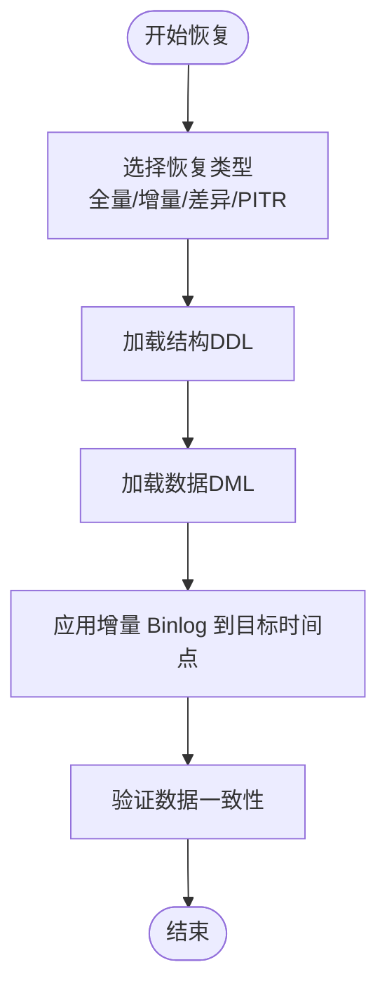
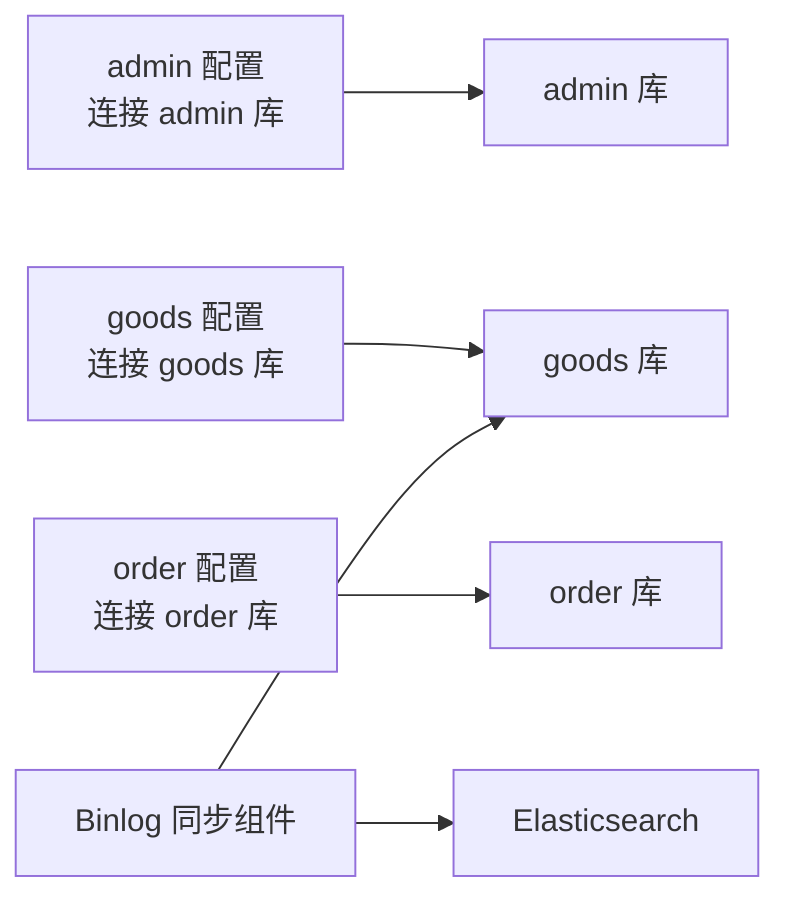

# 数据备份与恢复

<cite>
**本文引用的文件**
- [app/admin/hack/admin.sql](file://app/admin/hack/admin.sql)
- [app/goods/hack/goods.sql](file://app/goods/hack/goods.sql)
- [app/order/hack/order.sql](file://app/order/hack/order.sql)
- [app/interaction/hack/interaction.sql](file://app/interaction/hack/interaction.sql)
- [app/user/hack/user_info.sql](file://app/user/hack/user_info.sql)
- [app/gateway-resource/hack/resource.sql](file://app/gateway-resource/hack/resource.sql)
- [init-db/01_init.sql](file://init-db/01_init.sql)
- [init-db/goods_info.sql](file://init-db/goods_info.sql)
- [app/search/utility/binlog/client.go](file://app/search/utility/binlog/client.go)
- [app/admin/manifest/config/config.prod.yaml](file://app/admin/manifest/config/config.prod.yaml)
- [app/goods/manifest/config/config.prod.yaml](file://app/goods/manifest/config/config.prod.yaml)
- [app/order/manifest/config/config.prod.yaml](file://app/order/manifest/config/config.prod.yaml)
- [doc/grafana/alert-rules/dynamic-alerts.yml](file://doc/grafana/alert-rules/dynamic-alerts.yml)
- [doc/grafana/dashboards/go-service-monitoring.json](file://doc/grafana/dashboards/go-service-monitoring.json)
</cite>

## 目录
1. [简介](#简介)
2. [项目结构](#项目结构)
3. [核心组件](#核心组件)
4. [架构总览](#架构总览)
5. [详细组件分析](#详细组件分析)
6. [依赖关系分析](#依赖关系分析)
7. [性能考量](#性能考量)
8. [故障排查指南](#故障排查指南)
9. [结论](#结论)
10. [附录](#附录)

## 简介
本文件面向“数据备份与恢复”的工程实践，结合仓库中的数据库初始化脚本、服务配置与监控告警样例，系统化阐述备份策略（全量/增量/差异）、备份频率、存储策略、验证机制、恢复流程、灾难恢复计划（DRP）、RTO/RPO 指标、MySQL 主从复制与 Binlog 备份、Point-in-Time Recovery（PITR）、以及备份监控与自动化脚本思路。由于仓库未提供现成的备份脚本与外部存储配置，本文在“实现方案”部分给出可落地的工程化建议与流程图示。

## 项目结构
项目采用多微服务架构，数据库按业务域拆分为独立数据库（如 goods、order、user、interaction、admin、resource、banner）。每个服务通过独立配置文件连接各自的数据库，并在初始化脚本中定义了完整的表结构与初始数据。

**图表来源**
- [app/admin/manifest/config/config.prod.yaml](file://app/admin/manifest/config/config.prod.yaml#L15-L18)
- [app/goods/manifest/config/config.prod.yaml](file://app/goods/manifest/config/config.prod.yaml#L15-L18)
- [app/order/manifest/config/config.prod.yaml](file://app/order/manifest/config/config.prod.yaml#L15-L18)
- [app/search/utility/binlog/client.go](file://app/search/utility/binlog/client.go#L14-L62)

**章节来源**
- [app/admin/manifest/config/config.prod.yaml](file://app/admin/manifest/config/config.prod.yaml#L15-L18)
- [app/goods/manifest/config/config.prod.yaml](file://app/goods/manifest/config/config.prod.yaml#L15-L18)
- [app/order/manifest/config/config.prod.yaml](file://app/order/manifest/config/config.prod.yaml#L15-L18)
- [init-db/01_init.sql](file://init-db/01_init.sql#L5-L12)

## 核心组件
- 数据库初始化与表结构
  - 初始化脚本定义了各业务域数据库及表结构，包含主键、索引、注释等，便于后续备份与恢复时的结构一致性校验。
- Binlog 同步组件
  - 提供从 MySQL 读取 Binlog 并同步到 Elasticsearch 的能力，可用于近实时的数据变更订阅与二次索引同步。
- 监控与告警
  - Grafana 动态阈值告警规则与服务监控看板，可用于发现备份/恢复过程中的异常波动。

**章节来源**
- [init-db/01_init.sql](file://init-db/01_init.sql#L17-L88)
- [app/search/utility/binlog/client.go](file://app/search/utility/binlog/client.go#L14-L62)
- [doc/grafana/alert-rules/dynamic-alerts.yml](file://doc/grafana/alert-rules/dynamic-alerts.yml#L1-L112)
- [doc/grafana/dashboards/go-service-monitoring.json](file://doc/grafana/dashboards/go-service-monitoring.json#L1-L715)

## 架构总览
下图展示备份与恢复在整体系统中的位置与交互：

[此图为概念性架构示意，不直接映射到具体源码文件]

## 详细组件分析

### 备份策略与实施方案
- 全量备份
  - 建议每日执行一次全量逻辑备份（mysqldump 或 Percona XtraBackup 物理备份），保留数据库清单与表清单，确保结构与数据一致。
  - 结构与数据分离：先导出结构（DDL），再导出数据（DML），便于后续差异/增量备份比对。
- 增量备份
  - 基于 Binlog 的增量备份：启用 MySQL Binary Log，定期归档 Binlog 文件至备份存储；结合位点（Position）实现精确恢复。
  - 与现有 Binlog 同步组件配合：可参考服务端 Binlog 同步逻辑，提取事件类型与位点，作为增量备份的依据。
- 差异备份
  - 建议每周执行一次差异备份，比较自上次全量以来的变更，减少存储占用与恢复时间。
- 备份频率建议
  - 全量：日
  - 增量：小时（Binlog 归档）
  - 差异：周
- 备份存储策略
  - 本地磁盘 + 对象存储（如 S3/OSS）双写，异地冗余；按生命周期策略清理过期备份。
- 备份验证机制
  - 定期抽样恢复演练（Restore Test），验证备份文件完整性与可恢复性；校验关键表的数据一致性。
- RTO/RPO 指标
  - RPO：以 Binlog 增量为主，目标 RPO=数分钟；全量+增量组合可满足多数业务需求。
  - RTO：通过并行恢复与预热、自动化脚本缩短恢复时间，目标 RTO=数小时以内（视数据量与硬件而定）。

**章节来源**
- [app/search/utility/binlog/client.go](file://app/search/utility/binlog/client.go#L14-L62)
- [init-db/01_init.sql](file://init-db/01_init.sql#L17-L88)

### 数据恢复流程

[此图为通用恢复流程示意，不直接映射到具体源码文件]

### 灾难恢复计划（DRP）
- 目标
  - 在发生数据丢失、硬件故障或网络中断时，快速恢复业务可用性。
- 关键步骤
  - 快速识别故障范围与影响面（受影响数据库与服务）。
  - 选择最近可用的备份集（全量+增量）进行恢复。
  - 执行 PITR 至业务可接受的时间点。
  - 运行恢复验证与回归测试。
  - 切换流量并持续监控。

**章节来源**
- [doc/grafana/alert-rules/dynamic-alerts.yml](file://doc/grafana/alert-rules/dynamic-alerts.yml#L1-L112)

### MySQL 主从复制配置与 Binlog 备份
- 主从复制
  - Master 启用二进制日志，配置 server-id；Slave 配置 relay log 与复制用户；定期校验主从延迟。
- Binlog 备份
  - 定时归档 Binlog 至备份存储；记录每个 Binlog 的起止 Position，用于恢复定位。
- Point-in-Time Recovery（PITR）
  - 结合全量备份与增量 Binlog，恢复到指定时间点；注意事务边界与一致性。

**章节来源**
- [app/search/utility/binlog/client.go](file://app/search/utility/binlog/client.go#L14-L62)

### 备份监控、告警与自动化
- 监控指标
  - 备份任务执行状态、备份文件大小、归档耗时、主从延迟、Binlog 归档进度。
- 告警规则
  - 备份失败、归档超时、主从延迟过高、Binlog 缺失等。
- 自动化脚本
  - 建议使用定时任务（如 Cron）触发备份脚本，脚本内包含：
    - 全量/增量/差异选择
    - 校验与压缩
    - 上传与归档
    - 清理过期备份
    - 发送通知与记录日志
  - 脚本可对接对象存储 SDK，实现跨地域冗余。

**章节来源**
- [doc/grafana/alert-rules/dynamic-alerts.yml](file://doc/grafana/alert-rules/dynamic-alerts.yml#L1-L112)
- [doc/grafana/dashboards/go-service-monitoring.json](file://doc/grafana/dashboards/go-service-monitoring.json#L1-L715)

## 依赖关系分析
- 服务与数据库
  - 各服务通过独立配置文件连接各自数据库，避免交叉影响。
- Binlog 同步
  - goods 服务的 Binlog 同步组件仅针对 goods_info 表进行监听与同步，体现“按表粒度”的精细化订阅。

**图表来源**
- [app/admin/manifest/config/config.prod.yaml](file://app/admin/manifest/config/config.prod.yaml#L15-L18)
- [app/goods/manifest/config/config.prod.yaml](file://app/goods/manifest/config/config.prod.yaml#L15-L18)
- [app/order/manifest/config/config.prod.yaml](file://app/order/manifest/config/config.prod.yaml#L15-L18)
- [app/search/utility/binlog/client.go](file://app/search/utility/binlog/client.go#L14-L62)

**章节来源**
- [app/admin/manifest/config/config.prod.yaml](file://app/admin/manifest/config/config.prod.yaml#L15-L18)
- [app/goods/manifest/config/config.prod.yaml](file://app/goods/manifest/config/config.prod.yaml#L15-L18)
- [app/order/manifest/config/config.prod.yaml](file://app/order/manifest/config/config.prod.yaml#L15-L18)
- [app/search/utility/binlog/client.go](file://app/search/utility/binlog/client.go#L14-L62)

## 性能考量
- 备份窗口与业务影响
  - 全量备份建议在业务低峰期执行；增量备份采用 Binlog 归档，尽量减少对在线业务的影响。
- 存储与带宽
  - 对象存储归档成本更低，建议开启压缩与去重；控制并发下载与恢复速度，避免冲击数据库实例。
- 恢复效率
  - 使用物理备份（如 Percona XtraBackup）可显著缩短恢复时间；并行恢复与预热可进一步提升 RTO。

[本节为通用指导，不直接分析具体文件]

## 故障排查指南
- 备份失败
  - 检查备份脚本日志、存储空间、网络连通性与权限；确认 Binlog 是否正常产生。
- 恢复异常
  - 校验备份文件完整性；核对结构与数据一致性；检查 PITR 时间点是否包含完整事务。
- 监控告警
  - 关注动态阈值告警规则，结合 Grafana 看板定位异常趋势与根因。

**章节来源**
- [doc/grafana/alert-rules/dynamic-alerts.yml](file://doc/grafana/alert-rules/dynamic-alerts.yml#L1-L112)
- [doc/grafana/dashboards/go-service-monitoring.json](file://doc/grafana/dashboards/go-service-monitoring.json#L1-L715)

## 结论
本项目具备良好的数据库初始化与服务配置基础，结合现有的 Binlog 同步组件与监控告警样例，可快速构建一套覆盖全量/增量/差异与 PITR 的备份与恢复体系。建议尽快落地自动化备份脚本与异地归档策略，并通过定期演练验证 RTO/RPO 指标，确保在真实故障场景下能够稳定、可控地恢复业务。

[本节为总结性内容，不直接分析具体文件]

## 附录
- 初始化脚本与表结构
  - goods、order、user、interaction、admin、resource 等数据库的建库与建表语句，便于恢复时进行结构重建与数据装载。
- Binlog 同步示例
  - 展示如何从 MySQL 读取 Binlog 并写入 Elasticsearch，可迁移为 Binlog 归档与恢复工具的基础逻辑。

**章节来源**
- [init-db/01_init.sql](file://init-db/01_init.sql#L17-L88)
- [app/goods/hack/goods.sql](file://app/goods/hack/goods.sql#L1-L119)
- [app/order/hack/order.sql](file://app/order/hack/order.sql#L1-L96)
- [app/user/hack/user_info.sql](file://app/user/hack/user_info.sql#L1-L58)
- [app/interaction/hack/interaction.sql](file://app/interaction/hack/interaction.sql#L1-L72)
- [app/admin/hack/admin.sql](file://app/admin/hack/admin.sql#L1-L83)
- [app/gateway-resource/hack/resource.sql](file://app/gateway-resource/hack/resource.sql#L1-L13)
- [app/search/utility/binlog/client.go](file://app/search/utility/binlog/client.go#L14-L62)