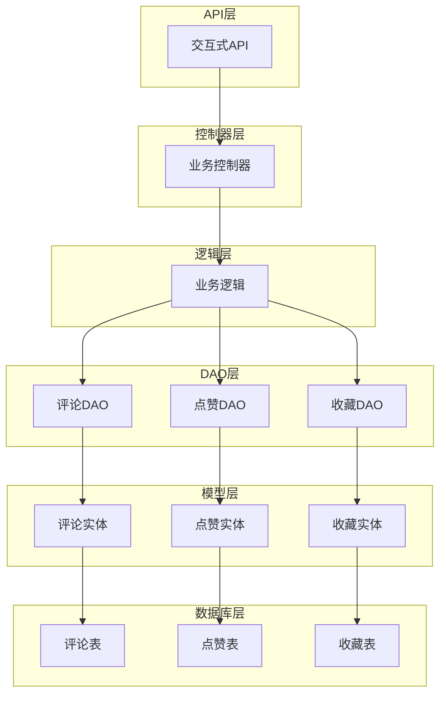
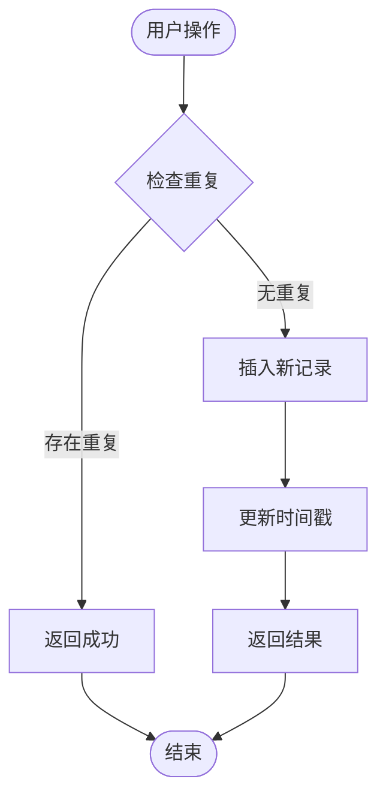
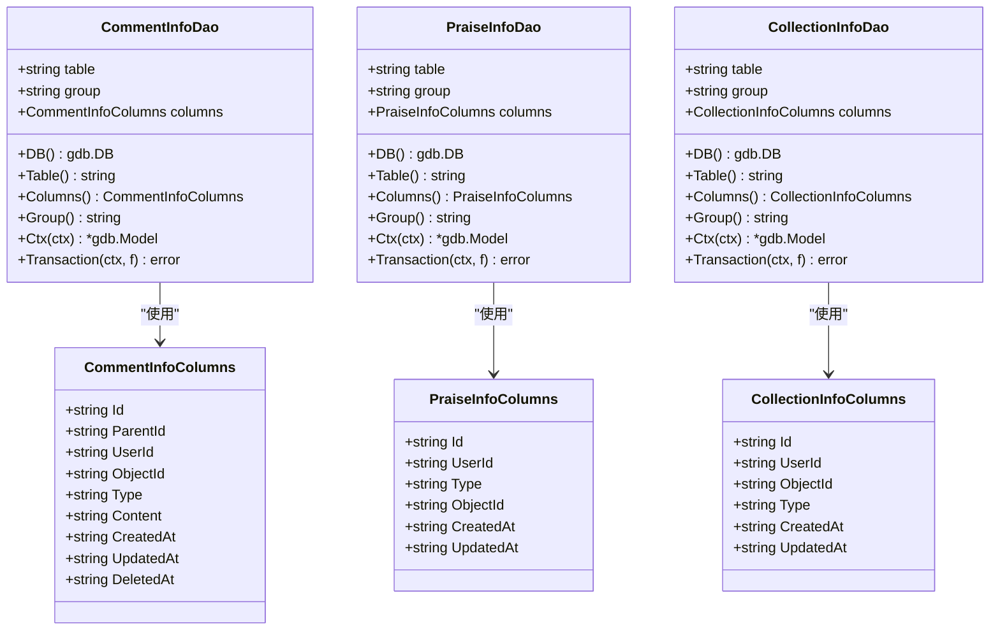
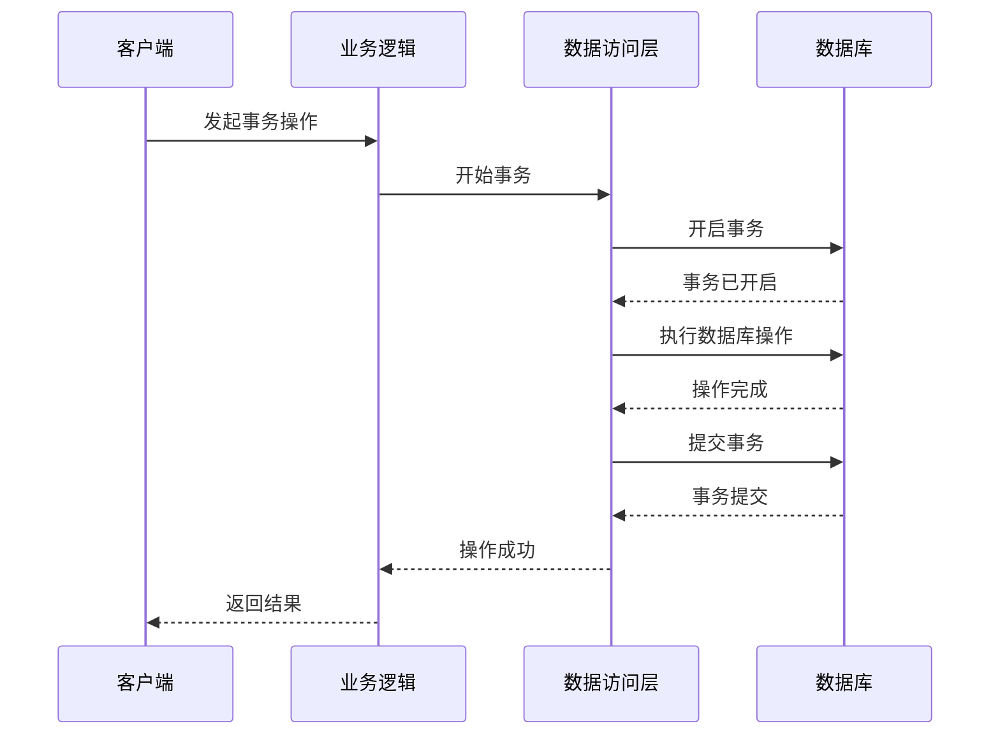
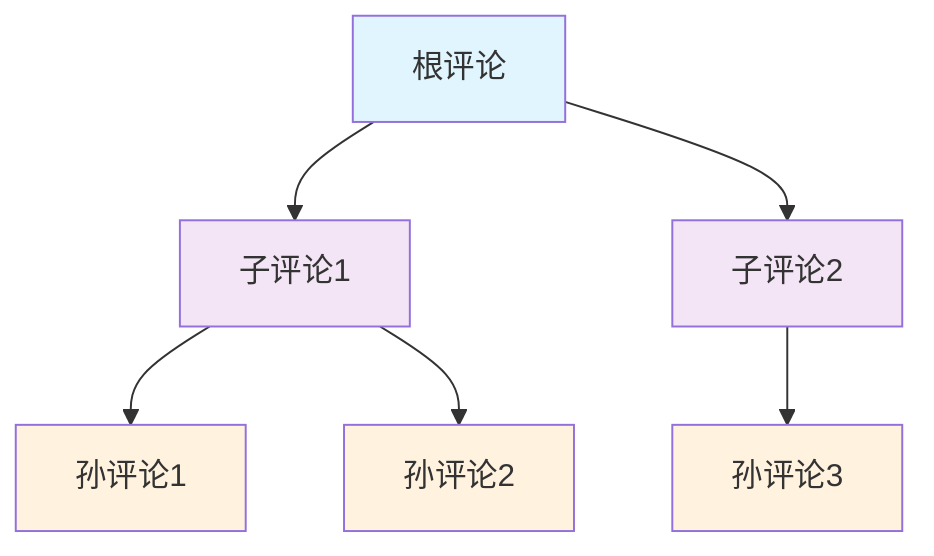
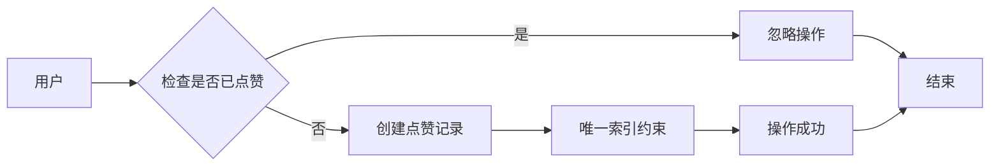
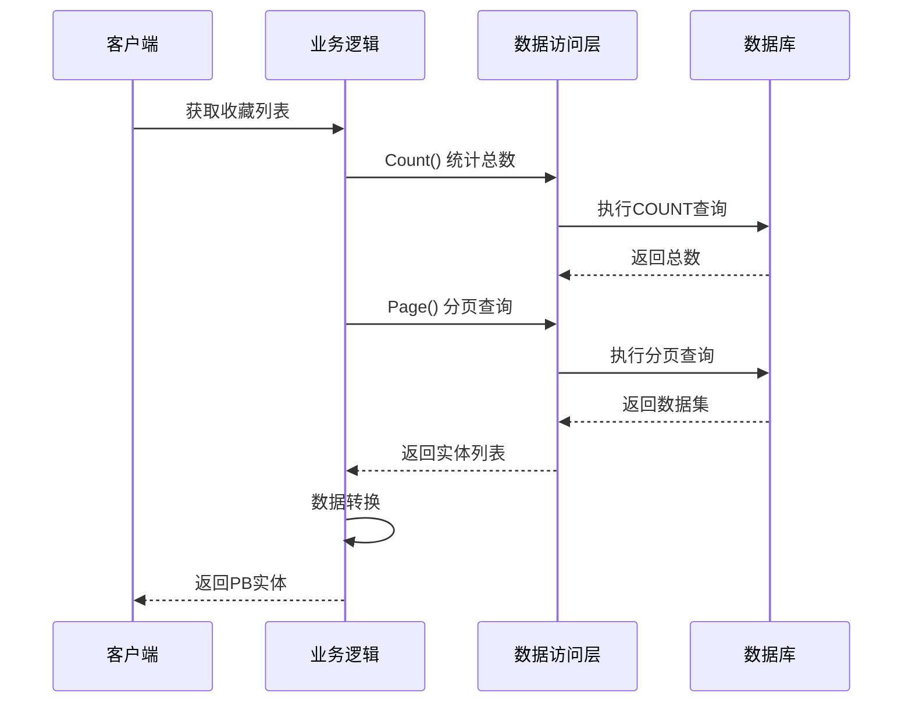
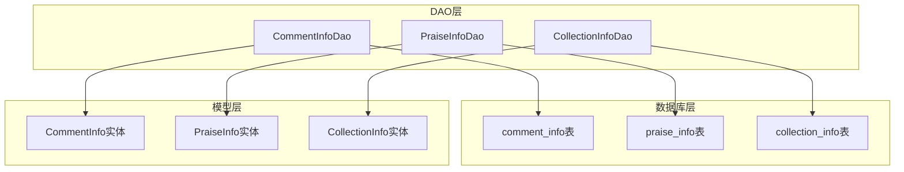

# 互动数据库设计

<cite>
**本文档引用的文件**
- [interaction.sql](file://app/interaction/hack/interaction.sql)
- [comment_info.go](file://app/interaction/internal/dao/comment_info.go)
- [praise_info.go](file://app/interaction/internal/dao/praise_info.go)
- [collection_info.go](file://app/interaction/internal/dao/collection_info.go)
- [comment_info.go](file://app/interaction/internal/dao/internal/comment_info.go)
- [praise_info.go](file://app/interaction/internal/dao/internal/praise_info.go)
- [collection_info.go](file://app/interaction/internal/dao/internal/collection_info.go)
- [comment_info.go](file://app/interaction/internal/model/entity/comment_info.go)
- [praise_info.go](file://app/interaction/internal/model/entity/praise_info.go)
- [collection_info.go](file://app/interaction/internal/model/entity/collection_info.go)
- [collection_info.go](file://app/interaction/internal/logic/collection_info/collection_info.go)
- [01_init.sql](file://init-db/01_init.sql)
</cite>

## 目录
1. [简介](#简介)
2. [项目结构](#项目结构)
3. [核心组件](#核心组件)
4. [架构概览](#架构概览)
5. [详细组件分析](#详细组件分析)
6. [依赖关系分析](#依赖关系分析)
7. [性能考虑](#性能考虑)
8. [故障排除指南](#故障排除指南)
9. [结论](#结论)

## 简介

本文件详细阐述了基于GoFrame框架的互动数据库设计，重点分析了interaction数据库的核心表结构，包括comment_info评论表、praise_info点赞表、collection_info收藏表的设计理念。该设计采用分层架构模式，通过DAO（数据访问对象）模式实现数据持久化，结合唯一索引确保数据完整性，并提供了完整的去重机制。

## 项目结构

互动数据库模块采用标准的GoFrame微服务架构，主要包含以下层次：

**图表来源**
- [comment_info.go](file://app/interaction/internal/dao/comment_info.go#L1-L23)
- [praise_info.go](file://app/interaction/internal/dao/praise_info.go#L1-L23)
- [collection_info.go](file://app/interaction/internal/dao/collection_info.go#L1-L23)

**章节来源**
- [comment_info.go](file://app/interaction/internal/dao/comment_info.go#L1-L23)
- [praise_info.go](file://app/interaction/internal/dao/praise_info.go#L1-L23)
- [collection_info.go](file://app/interaction/internal/dao/collection_info.go#L1-L23)

## 核心组件

### 数据库表结构设计

#### 评论表（comment_info）设计理念

评论表采用了层级结构设计，支持多级回复功能。表结构包含以下关键字段：

- `id`: 主键标识符
- `parent_id`: 父级评论ID，实现评论层级嵌套
- `user_id`: 评论用户标识
- `object_id`: 评论对象ID（商品或文章）
- `type`: 评论类型（1商品，2文章）
- `content`: 评论内容（最大255字符）
- `created_at/updated_at`: 时间戳字段

**章节来源**
- [interaction.sql](file://app/interaction/hack/interaction.sql#L6-L19)
- [comment_info.go](file://app/interaction/internal/model/entity/comment_info.go#L11-L22)

#### 点赞表（praise_info）设计理念

点赞表采用简洁设计，专注于核心点赞功能：

- `id`: 主键标识符
- `user_id`: 点赞用户标识
- `type`: 点赞类型（1商品，2文章）
- `object_id`: 被点赞对象ID
- `created_at/updated_at`: 时间戳字段

**章节来源**
- [interaction.sql](file://app/interaction/hack/interaction.sql#L34-L44)
- [praise_info.go](file://app/interaction/internal/model/entity/praise_info.go#L11-L19)

#### 收藏表（collection_info）设计理念

收藏表设计遵循最小必要原则：

- `id`: 主键标识符
- `user_id`: 收藏用户标识
- `object_id`: 收藏对象ID
- `type`: 收藏类型（1商品，2文章）
- `created_at/updated_at`: 时间戳字段

**章节来源**
- [interaction.sql](file://app/interaction/hack/interaction.sql#L55-L65)
- [collection_info.go](file://app/interaction/internal/model/entity/collection_info.go#L11-L19)

### 去重机制设计

所有核心表都实现了唯一索引约束，确保数据完整性：

**图表来源**
- [collection_info.go](file://app/interaction/internal/logic/collection_info/collection_info.go#L57-L78)

**章节来源**
- [collection_info.go](file://app/interaction/internal/logic/collection_info/collection_info.go#L57-L78)

## 架构概览

### 数据访问层架构

**图表来源**
- [comment_info.go](file://app/interaction/internal/dao/internal/comment_info.go#L14-L96)
- [praise_info.go](file://app/interaction/internal/dao/internal/praise_info.go#L14-L90)
- [collection_info.go](file://app/interaction/internal/dao/internal/collection_info.go#L14-L90)

### 事务处理机制

**图表来源**
- [comment_info.go](file://app/interaction/internal/dao/internal/comment_info.go#L87-L96)
- [praise_info.go](file://app/interaction/internal/dao/internal/praise_info.go#L81-L90)
- [collection_info.go](file://app/interaction/internal/dao/internal/collection_info.go#L81-L90)

## 详细组件分析

### 评论系统层级结构设计

#### 多级评论实现机制

评论系统支持无限层级的回复结构，通过parent_id字段实现父子关系：

**图表来源**
- [interaction.sql](file://app/interaction/hack/interaction.sql#L8-L18)

#### 评论内容存储策略

评论内容采用UTF-8MB4编码，支持emoji表情符号和多语言字符。内容长度限制为255字符，平衡存储效率和用户体验。

**章节来源**
- [interaction.sql](file://app/interaction/hack/interaction.sql#L12-L14)
- [comment_info.go](file://app/interaction/internal/model/entity/comment_info.go#L17-L18)

### 点赞去重逻辑

#### 唯一索引设计

点赞表通过复合唯一索引确保每个用户对特定对象的点赞唯一性：

- 组合键：(user_id, type, object_id)
- 防止重复点赞
- 支持快速查询

**图表来源**
- [interaction.sql](file://app/interaction/hack/interaction.sql#L42-L44)

**章节来源**
- [interaction.sql](file://app/interaction/hack/interaction.sql#L34-L44)
- [praise_info.go](file://app/interaction/internal/model/entity/praise_info.go#L13-L18)

### 收藏管理机制

#### 收藏去重策略

收藏表同样采用复合唯一索引，确保收藏的唯一性：

- 组合键：(user_id, object_id, type)
- 防止重复收藏
- 支持批量查询

#### 收藏列表查询优化

收藏列表查询通过以下方式优化性能：

**图表来源**
- [collection_info.go](file://app/interaction/internal/logic/collection_info/collection_info.go#L14-L54)

**章节来源**
- [collection_info.go](file://app/interaction/internal/logic/collection_info/collection_info.go#L14-L54)

## 依赖关系分析

### 数据库依赖关系

**图表来源**
- [comment_info.go](file://app/interaction/internal/dao/internal/comment_info.go#L14-L56)
- [praise_info.go](file://app/interaction/internal/dao/internal/praise_info.go#L14-L50)
- [collection_info.go](file://app/interaction/internal/dao/internal/collection_info.go#L14-L50)

### 索引优化策略

#### 唯一索引设计

每个核心表都配置了相应的唯一索引：

| 表名 | 唯一索引字段 | 设计目的 |
|------|-------------|----------|
| comment_info | (user_id, object_id, type, content, parent_id) | 防止重复评论，支持内容去重 |
| praise_info | (user_id, type, object_id) | 确保点赞唯一性 |
| collection_info | (user_id, object_id, type) | 防止重复收藏 |

#### 性能影响分析

唯一索引在保证数据完整性的同时，也带来了以下性能考量：

- 插入操作：需要检查索引唯一性，增加少量开销
- 查询操作：通过索引快速定位，提升查询性能
- 存储空间：索引占用额外存储空间

**章节来源**
- [interaction.sql](file://app/interaction/hack/interaction.sql#L18-L18)
- [interaction.sql](file://app/interaction/hack/interaction.sql#L43-L43)
- [interaction.sql](file://app/interaction/hack/interaction.sql#L64-L64)

## 性能考虑

### 查询优化建议

1. **索引利用**：针对常用查询条件建立合适的索引
2. **分页查询**：大量数据时使用分页避免全表扫描
3. **连接查询**：减少N+1查询问题
4. **缓存策略**：热点数据添加缓存层

### 存储优化策略

1. **字符集选择**：使用utf8mb4支持完整Unicode字符
2. **字段长度**：合理设置字段长度避免浪费
3. **索引数量**：平衡查询性能和写入性能
4. **分区策略**：大数据量时考虑表分区

## 故障排除指南

### 常见问题及解决方案

#### 重复数据插入错误

**问题描述**：尝试插入重复的点赞或收藏记录

**解决方案**：
1. 检查唯一索引约束
2. 实现幂等性处理
3. 添加适当的错误处理逻辑

#### 查询性能问题

**问题描述**：复杂查询导致响应缓慢

**解决方案**：
1. 分析查询执行计划
2. 添加必要的索引
3. 优化SQL语句
4. 考虑查询缓存

#### 事务处理异常

**问题描述**：事务无法正常提交或回滚

**解决方案**：
1. 检查事务边界
2. 确保资源正确释放
3. 实现适当的错误恢复机制

**章节来源**
- [collection_info.go](file://app/interaction/internal/logic/collection_info/collection_info.go#L57-L78)

## 结论

该互动数据库设计通过合理的表结构设计、完善的去重机制和优化的索引策略，为用户互动功能提供了稳定可靠的数据基础。分层架构模式确保了代码的可维护性和扩展性，而唯一索引约束则有效保证了数据的一致性和完整性。

设计特点总结：
- 层级化评论支持多级回复
- 唯一索引确保数据去重
- 分层架构便于维护扩展
- 事务处理保证数据一致性
- 性能优化考虑全面

该设计为后续的功能扩展和性能优化奠定了良好的基础，能够满足电商场景下的互动需求。