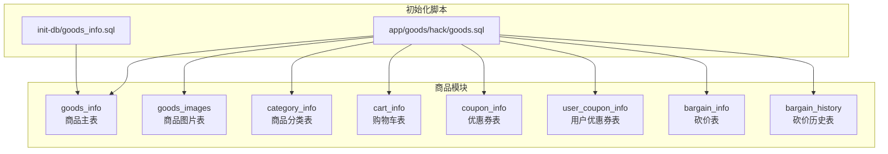
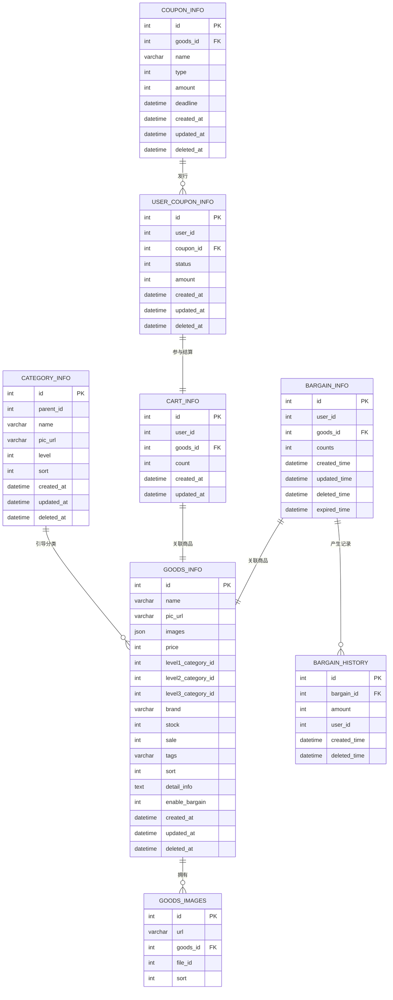
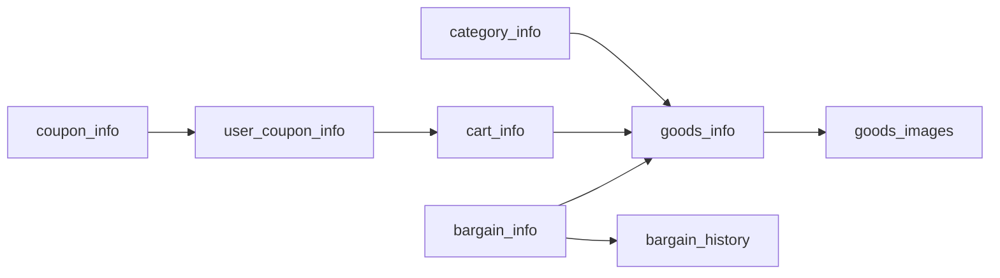

# 商品数据库设计

<cite>
**本文引用的文件**
- [goods_info.sql](file://init-db/goods_info.sql)
- [goods.sql](file://app/goods/hack/goods.sql)
- [goods_info.go（DO）](file://app/goods/internal/model/do/goods_info.go)
- [category_info.go（DO）](file://app/goods/internal/model/do/category_info.go)
- [cart_info.go（DO）](file://app/goods/internal/model/do/cart_info.go)
- [coupon_info.go（DO）](file://app/goods/internal/model/do/coupon_info.go)
- [bargain_info.go（DO）](file://app/goods/internal/model/do/bargain_info.go)
- [bargain_history.go（DO）](file://app/goods/internal/model/do/bargain_history.go)
- [goods_info.go（Entity）](file://app/goods/internal/model/entity/goods_info.go)
- [category_info.go（Entity）](file://app/goods/internal/model/entity/category_info.go)
- [cart_info.go（Entity）](file://app/goods/internal/model/entity/cart_info.go)
- [coupon_info.go（Entity）](file://app/goods/internal/model/entity/coupon_info.go)
- [bargain_info.go（Entity）](file://app/goods/internal/model/entity/bargain_info.go)
- [bargain_history.go（Entity）](file://app/goods/internal/model/entity/bargain_history.go)
</cite>

## 目录
1. [简介](#简介)
2. [项目结构](#项目结构)
3. [核心组件](#核心组件)
4. [架构总览](#架构总览)
5. [详细组件分析](#详细组件分析)
6. [依赖分析](#依赖分析)
7. [性能考虑](#性能考虑)
8. [故障排查指南](#故障排查指南)
9. [结论](#结论)
10. [附录](#附录)

## 简介
本文件面向商品域数据库设计，围绕 goods 数据库的核心表进行系统化梳理，覆盖以下主题：
- 表结构与字段语义、数据类型选择与索引策略
- 外键关系与业务约束
- 关联查询示例与常见用法
- 性能优化建议与数据迁移策略
- 商品状态管理、库存控制与价格计算逻辑

## 项目结构
本仓库采用多模块微服务架构，商品相关能力集中在 app/goods 模块中，数据库初始化与建表脚本位于 app/goods/hack/goods.sql 以及 init-db/goods_info.sql。ORM 层通过 GoFrame 的 DO/Entity 结构映射各表，DAO 层在 internal/dao 下生成。

**图示来源**
- [goods.sql](file://app/goods/hack/goods.sql#L1-L119)
- [goods_info.sql](file://init-db/goods_info.sql#L1-L54)

**章节来源**
- [goods.sql](file://app/goods/hack/goods.sql#L1-L119)
- [goods_info.sql](file://init-db/goods_info.sql#L1-L54)

## 核心组件
本节对各核心表进行字段定义、数据类型、索引与约束说明，并给出 ORM 映射结构的对应关系。

- 商品主表 goods_info
  - 字段要点：名称、主图、JSON 图集、价格（分）、三级分类 ID、品牌、库存、销量、标签、排序、详情、是否允许砍价、软删时间戳
  - 数据类型：整型、字符串、JSON 文本、文本、时间戳
  - 索引：主键 id
  - 约束：无显式外键；分类与品牌通过 ID 引导业务一致性
  - ORM 映射：entity.GoodsInfo 与 do.GoodsInfo
  - 参考路径：
    - [goods_info.go（Entity）](file://app/goods/internal/model/entity/goods_info.go#L11-L32)
    - [goods_info.go（DO）](file://app/goods/internal/model/do/goods_info.go#L12-L34)

- 商品图片表 goods_images
  - 字段要点：URL、所属商品 ID、文件 ID、排序
  - 索引：goods_id 上建立普通索引
  - 约束：无显式外键；file_id 用于关联资源系统
  - ORM 映射：entity.GoodsImages 与 do.GoodsImages
  - 参考路径：
    - [goods_images.go（Entity）](file://app/goods/internal/model/entity/goods_images.go#L1-L20)
    - [goods_images.go（DO）](file://app/goods/internal/model/do/goods_images.go#L1-L20)

- 分类表 category_info
  - 字段要点：父级 ID、名称、图标、层级、排序、软删时间戳
  - 索引：主键 id
  - 约束：无显式外键；父子关系由 parent_id 维护
  - ORM 映射：entity.CategoryInfo 与 do.CategoryInfo
  - 参考路径：
    - [category_info.go（Entity）](file://app/goods/internal/model/entity/category_info.go#L11-L22)
    - [category_info.go（DO）](file://app/goods/internal/model/do/category_info.go#L12-L24)

- 购物车表 cart_info
  - 字段要点：用户 ID、商品 ID、数量、更新时间
  - 索引：主键 id
  - 约束：无显式外键；数量为正整数
  - ORM 映射：entity.CartInfo 与 do.CartInfo
  - 参考路径：
    - [cart_info.go（Entity）](file://app/goods/internal/model/entity/cart_info.go#L11-L19)
    - [cart_info.go（DO）](file://app/goods/internal/model/do/cart_info.go#L12-L21)

- 优惠券表 coupon_info
  - 字段要点：适用商品 ID（0 表示全场）、名称、类型、面额（分）、截止时间、软删时间戳
  - 索引：goods_id、deadline
  - 约束：无显式外键；deadline 用于过期筛选
  - ORM 映射：entity.CouponInfo 与 do.CouponInfo
  - 参考路径：
    - [coupon_info.go（Entity）](file://app/goods/internal/model/entity/coupon_info.go#L11-L22)
    - [coupon_info.go（DO）](file://app/goods/internal/model/do/coupon_info.go#L12-L24)

- 用户优惠券表 user_coupon_info
  - 字段要点：用户 ID、优惠券 ID、状态（待使用/已使用/已过期）、面额（分）、软删时间戳
  - 索引：user_id、coupon_id、status；唯一索引：(user_id, coupon_id)
  - 约束：唯一性保证同一用户不可重复领取同张券
  - ORM 映射：entity.UserCouponInfo 与 do.UserCouponInfo
  - 参考路径：
    - [user_coupon_info.go（Entity）](file://app/goods/internal/model/entity/user_coupon_info.go#L1-L20)
    - [user_coupon_info.go（DO）](file://app/goods/internal/model/do/user_coupon_info.go#L1-L20)

- 砍价表 bargain_info
  - 字段要点：用户 ID、商品 ID、参与次数、创建/更新/删除/过期时间
  - 索引：主键 id
  - 约束：无显式外键；ExpiredTime 用于活动时效控制
  - ORM 映射：entity.BargainInfo 与 do.BargainInfo
  - 参考路径：
    - [bargain_info.go（Entity）](file://app/goods/internal/model/entity/bargain_info.go#L11-L21)
    - [bargain_info.go（DO）](file://app/goods/internal/model/do/bargain_info.go#L12-L23)

- 砍价历史表 bargain_history
  - 字段要点：砍价记录 ID、金额、用户 ID、删除时间
  - 索引：主键 id
  - 约束：无显式外键；金额与记录关联
  - ORM 映射：entity.BargainHistory 与 do.BargainHistory
  - 参考路径：
    - [bargain_history.go（Entity）](file://app/goods/internal/model/entity/bargain_history.go#L11-L19)
    - [bargain_history.go（DO）](file://app/goods/internal/model/do/bargain_history.go#L12-L21)

**章节来源**
- [goods_info.go（Entity）](file://app/goods/internal/model/entity/goods_info.go#L11-L32)
- [goods_info.go（DO）](file://app/goods/internal/model/do/goods_info.go#L12-L34)
- [goods_images.go（Entity）](file://app/goods/internal/model/entity/goods_images.go#L1-L20)
- [goods_images.go（DO）](file://app/goods/internal/model/do/goods_images.go#L1-L20)
- [category_info.go（Entity）](file://app/goods/internal/model/entity/category_info.go#L11-L22)
- [category_info.go（DO）](file://app/goods/internal/model/do/category_info.go#L12-L24)
- [cart_info.go（Entity）](file://app/goods/internal/model/entity/cart_info.go#L11-L19)
- [cart_info.go（DO）](file://app/goods/internal/model/do/cart_info.go#L12-L21)
- [coupon_info.go（Entity）](file://app/goods/internal/model/entity/coupon_info.go#L11-L22)
- [coupon_info.go（DO）](file://app/goods/internal/model/do/coupon_info.go#L12-L24)
- [user_coupon_info.go（Entity）](file://app/goods/internal/model/entity/user_coupon_info.go#L1-L20)
- [user_coupon_info.go（DO）](file://app/goods/internal/model/do/user_coupon_info.go#L1-L20)
- [bargain_info.go（Entity）](file://app/goods/internal/model/entity/bargain_info.go#L11-L21)
- [bargain_info.go（DO）](file://app/goods/internal/model/do/bargain_info.go#L12-L23)
- [bargain_history.go（Entity）](file://app/goods/internal/model/entity/bargain_history.go#L11-L19)
- [bargain_history.go（DO）](file://app/goods/internal/model/do/bargain_history.go#L12-L21)

## 架构总览
下图展示商品域核心表之间的逻辑关系与典型查询路径：

**图示来源**
- [goods.sql](file://app/goods/hack/goods.sql#L1-L119)
- [goods_info.go（Entity）](file://app/goods/internal/model/entity/goods_info.go#L11-L32)
- [goods_images.go（Entity）](file://app/goods/internal/model/entity/goods_images.go#L1-L20)
- [category_info.go（Entity）](file://app/goods/internal/model/entity/category_info.go#L11-L22)
- [cart_info.go（Entity）](file://app/goods/internal/model/entity/cart_info.go#L11-L19)
- [coupon_info.go（Entity）](file://app/goods/internal/model/entity/coupon_info.go#L11-L22)
- [user_coupon_info.go（Entity）](file://app/goods/internal/model/entity/user_coupon_info.go#L1-L20)
- [bargain_info.go（Entity）](file://app/goods/internal/model/entity/bargain_info.go#L11-L21)
- [bargain_history.go（Entity）](file://app/goods/internal/model/entity/bargain_history.go#L11-L19)

## 详细组件分析

### 商品主表 goods_info
- 设计理念
  - 以“商品”为中心，聚合基础属性与元数据；使用 JSON 存储多图集合，便于扩展与灵活查询。
  - 价格统一以“分”为最小单位，避免浮点误差；库存与销量分离，便于统计与风控。
  - 三级分类字段用于快速过滤与报表；enable_bargain 控制是否参与砍价活动。
- 字段与类型
  - 名称、主图、品牌、标签、详情：字符串或文本
  - 价格、库存、销量、排序：整型
  - 分类 ID：整型（引导业务一致性）
  - 是否允许砍价：布尔化整型
  - 时间戳：datetime（软删）
- 索引与约束
  - 主键 id；无外键
- ORM 映射
  - entity.GoodsInfo 与 do.GoodsInfo 定义一致
- 关联查询示例
  - 查询某分类下的商品列表（按排序倒序）
  - 查询启用砍价的商品并关联图片
  - 查询商品详情（含 JSON 图集）与分类路径
- 性能建议
  - 在 level1/level2/level3_category_id 上建立复合索引，加速分类筛选
  - 对 enable_bargain 建立二级索引，加速活动商品检索
- 数据迁移
  - 从旧表迁移时，注意将图片 URL 列表转换为 JSON 数组格式
  - 将价格从元转为分，确保存量数据一致性

**章节来源**
- [goods_info.go（Entity）](file://app/goods/internal/model/entity/goods_info.go#L11-L32)
- [goods_info.go（DO）](file://app/goods/internal/model/do/goods_info.go#L12-L34)
- [goods_info.sql](file://init-db/goods_info.sql#L24-L44)

### 商品图片表 goods_images
- 设计理念
  - 将详情图与主商品解耦，支持多图与排序；通过 file_id 关联资源系统。
- 字段与类型
  - url、sort：字符串与整型
  - goods_id：整型（外键）
- 索引与约束
  - idx_goods(goods_id) 辅助按商品批量读取图片
- ORM 映射
  - entity.GoodsImages 与 do.GoodsImages 定义一致
- 关联查询示例
  - 获取某商品的所有图片并按 sort 升序排列
- 性能建议
  - 若图片数量巨大，可考虑分表或按商品 ID 哈希分区
- 数据迁移
  - 从 goods_info.images 迁移时，拆分为多条记录并保留原始顺序

**章节来源**
- [goods_images.go（Entity）](file://app/goods/internal/model/entity/goods_images.go#L1-L20)
- [goods_images.go（DO）](file://app/goods/internal/model/do/goods_images.go#L1-L20)
- [goods.sql](file://app/goods/hack/goods.sql#L25-L34)

### 分类表 category_info
- 设计理念
  - 支持多级分类（示例为 1~3 级），通过 parent_id 实现树形结构；level 字段标识层级。
- 字段与类型
  - parent_id、level、sort：整型
  - name、pic_url：字符串
  - 时间戳：datetime（软删）
- 索引与约束
  - 主键 id；无外键
- ORM 映射
  - entity.CategoryInfo 与 do.CategoryInfo 定义一致
- 关联查询示例
  - 查询某分类及其子分类树
  - 查询某商品的三级分类路径
- 性能建议
  - 在 parent_id 上建立索引，加速父子查找
- 数据迁移
  - 导入时需保持 parent_id 与 id 的一致性

**章节来源**
- [category_info.go（Entity）](file://app/goods/internal/model/entity/category_info.go#L11-L22)
- [category_info.go（DO）](file://app/goods/internal/model/do/category_info.go#L12-L24)
- [goods.sql](file://app/goods/hack/goods.sql#L40-L52)

### 购物车表 cart_info
- 设计理念
  - 记录用户与商品的临时绑定关系，支持数量变更与批量操作。
- 字段与类型
  - user_id、goods_id、count：整型
  - 时间戳：datetime
- 索引与约束
  - 主键 id；无外键
- ORM 映射
  - entity.CartInfo 与 do.CartInfo 定义一致
- 关联查询示例
  - 查询某用户的购物车清单并关联商品与图片
- 性能建议
  - 在 user_id 上建立索引，加速用户维度查询
- 数据迁移
  - 需要清理过期或无效数据，避免脏数据影响用户体验

**章节来源**
- [cart_info.go（Entity）](file://app/goods/internal/model/entity/cart_info.go#L11-L19)
- [cart_info.go（DO）](file://app/goods/internal/model/do/cart_info.go#L12-L21)
- [goods.sql](file://app/goods/hack/goods.sql#L68-L79)

### 优惠券表 coupon_info 与用户优惠券表 user_coupon_info
- 设计理念
  - coupon_info 描述优惠券规则（适用范围、类型、有效期、面额）；user_coupon_info 记录用户持有状态与使用轨迹。
- 字段与类型
  - coupon_info：goods_id、name、type、amount、deadline、软删
  - user_coupon_info：user_id、coupon_id、status、amount、软删
- 索引与约束
  - coupon_info：idx_goods_id、idx_deadline
  - user_coupon_info：idx_user_id、idx_coupon_id、idx_status；uk_user_coupon(user_id, coupon_id)
- ORM 映射
  - entity.CouponInfo/UserCouponInfo 与 do.CouponInfo/UserCouponInfo 定义一致
- 关联查询示例
  - 查询某用户未过期且可用的优惠券
  - 查询某商品可用的优惠券并按截止时间排序
- 性能建议
  - deadline 建立索引，加速过期筛选
  - uk_user_coupon 防止重复领取
- 数据迁移
  - 导入时需校验 goods_id 的有效性与 deadline 的合法性

**章节来源**
- [coupon_info.go（Entity）](file://app/goods/internal/model/entity/coupon_info.go#L11-L22)
- [coupon_info.go（DO）](file://app/goods/internal/model/do/coupon_info.go#L12-L24)
- [user_coupon_info.go（Entity）](file://app/goods/internal/model/entity/user_coupon_info.go#L1-L20)
- [user_coupon_info.go（DO）](file://app/goods/internal/model/do/user_coupon_info.go#L1-L20)
- [goods.sql](file://app/goods/hack/goods.sql#L82-L119)

### 砍价表 bargain_info 与砍价历史表 bargain_history
- 设计理念
  - bargain_info 记录用户发起的砍价活动；bargain_history 记录每次砍价动作与金额。
- 字段与类型
  - bargain_info：user_id、goods_id、counts、expired_time 等
  - bargain_history：bargain_id、amount、user_id 等
- 索引与约束
  - 主键 id；无外键
- ORM 映射
  - entity.BargainInfo/BargainHistory 与 do.BargainInfo/BargainHistory 定义一致
- 关联查询示例
  - 查询某用户的砍价活动及历史记录
  - 查询某商品的砍价活动汇总
- 性能建议
  - expired_time 用于活动时效控制，可在定时任务中清理过期数据
- 数据迁移
  - 导入时需校验 expired_time 与活动状态一致性

**章节来源**
- [bargain_info.go（Entity）](file://app/goods/internal/model/entity/bargain_info.go#L11-L21)
- [bargain_info.go（DO）](file://app/goods/internal/model/do/bargain_info.go#L12-L23)
- [bargain_history.go（Entity）](file://app/goods/internal/model/entity/bargain_history.go#L11-L19)
- [bargain_history.go（DO）](file://app/goods/internal/model/do/bargain_history.go#L12-L21)
- [goods.sql](file://app/goods/hack/goods.sql#L1-L119)

## 依赖分析
- 内聚性
  - 各表职责清晰：goods_info 聚合商品元数据；goods_images 提供详情图；category_info 提供分类树；cart_info 提供购物车；coupon_info 与 user_coupon_info 提供优惠体系；bargain_info 与 bargain_history 提供砍价活动。
- 耦合度
  - 除 goods_images.file_id 与资源系统外，其余均为业务 ID 引导的弱耦合；无显式外键约束，降低跨模块依赖风险。
- 外部依赖
  - 资源系统（file_id）与支付/订单系统（后续模块）存在潜在集成点。

**图示来源**
- [goods.sql](file://app/goods/hack/goods.sql#L1-L119)

**章节来源**
- [goods.sql](file://app/goods/hack/goods.sql#L1-L119)

## 性能考虑
- 索引策略
  - goods_info：在 level1/level2/level3_category_id 建立复合索引；enable_bargain 建立二级索引
  - goods_images：idx_goods(goods_id)
  - coupon_info：idx_goods_id、idx_deadline
  - user_coupon_info：idx_user_id、idx_coupon_id、idx_status、uk_user_coupon(user_id, coupon_id)
  - cart_info：idx_user_id（如需按用户查询）
- 查询优化
  - 使用覆盖索引减少回表
  - 对大表分页查询时，优先使用基于索引的游标分页
- 缓存策略
  - 商品详情与分类树可引入 Redis 缓存，结合失效策略
- 分库分表
  - 高并发场景下，可按 user_id 或 goods_id 哈希分片
- 事务与锁
  - 优惠券核销与库存扣减需在同一事务内完成，必要时使用行级锁或分布式锁

## 故障排查指南
- 常见问题
  - 优惠券重复领取：检查 uk_user_coupon 约束是否生效
  - 价格不一致：确认所有金额均以“分”存储，前端/后端换算一致
  - 库存超卖：核对扣减逻辑与事务边界，必要时引入分布式锁
  - 图片缺失：检查 goods_images 与资源系统 file_id 的一致性
- 排查步骤
  - 核对索引是否存在与是否命中
  - 检查软删字段 deleted_at 的使用
  - 对关键写入路径增加日志与埋点
- 监控建议
  - 关注慢查询、索引使用率、锁等待与死锁
  - 对库存与优惠券核销增加告警

## 结论
该商品数据库设计以“商品”为核心，通过 JSON 图集与多表协作实现高扩展性与灵活性。通过合理的索引与缓存策略，可在高并发场景下保持良好性能。建议在后续迭代中逐步完善外键约束与统一的业务字典，提升数据一致性与可维护性。

## 附录

### 关联查询示例（路径指引）
- 查询某用户购物车中的商品详情与图片
  - 路径参考：[cart_info.go（Entity）](file://app/goods/internal/model/entity/cart_info.go#L11-L19)，[goods_info.go（Entity）](file://app/goods/internal/model/entity/goods_info.go#L11-L32)，[goods_images.go（Entity）](file://app/goods/internal/model/entity/goods_images.go#L1-L20)
- 查询某商品可用的优惠券并按截止时间排序
  - 路径参考：[coupon_info.go（Entity）](file://app/goods/internal/model/entity/coupon_info.go#L11-L22)，[user_coupon_info.go（Entity）](file://app/goods/internal/model/entity/user_coupon_info.go#L1-L20)
- 查询某商品的三级分类路径
  - 路径参考：[category_info.go（Entity）](file://app/goods/internal/model/entity/category_info.go#L11-L22)，[goods_info.go（Entity）](file://app/goods/internal/model/entity/goods_info.go#L11-L32)

### 数据迁移策略（路径指引）
- 从 goods_info.images 迁移图片至 goods_images
  - 路径参考：[goods_info.sql](file://init-db/goods_info.sql#L24-L44)，[goods.sql](file://app/goods/hack/goods.sql#L25-L34)
- 导入分类数据并校验 parent_id
  - 路径参考：[goods.sql](file://app/goods/hack/goods.sql#L40-L52)
- 导入优惠券与用户优惠券数据并校验唯一性
  - 路径参考：[goods.sql](file://app/goods/hack/goods.sql#L82-L119)