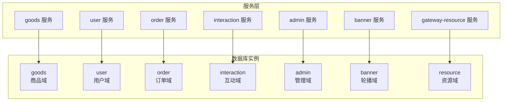
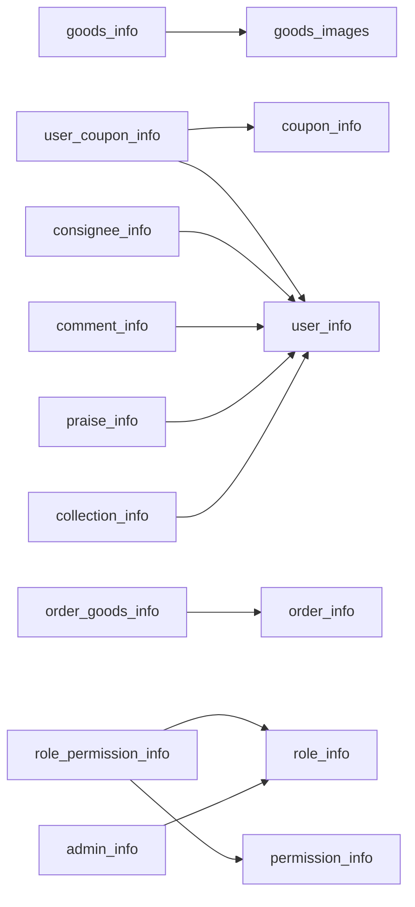

# 数据库设计

<cite>
**本文引用的文件**
- [init-db/01_init.sql](file://init-db/01_init.sql)
- [init-db/goods_info.sql](file://init-db/goods_info.sql)
- [app/goods/hack/goods.sql](file://app/goods/hack/goods.sql)
- [app/user/hack/user_info.sql](file://app/user/hack/user_info.sql)
- [app/order/hack/order.sql](file://app/order/hack/order.sql)
- [app/interaction/hack/interaction.sql](file://app/interaction/hack/interaction.sql)
- [app/banner/hack/banner.sql](file://app/banner/hack/banner.sql)
- [app/admin/hack/admin.sql](file://app/admin/hack/admin.sql)
- [app/gateway-resource/hack/resource.sql](file://app/gateway-resource/hack/resource.sql)
- [app/goods/internal/dao/internal/goods_info.go](file://app/goods/internal/dao/internal/goods_info.go)
- [app/user/internal/dao/internal/user_info.go](file://app/user/internal/dao/internal/user_info.go)
- [app/order/internal/dao/internal/order_info.go](file://app/order/internal/dao/internal/order_info.go)
</cite>

## 目录
1. [简介](#简介)
2. [项目结构](#项目结构)
3. [核心组件](#核心组件)
4. [架构总览](#架构总览)
5. [详细组件分析](#详细组件分析)
6. [依赖分析](#依赖分析)
7. [性能考量](#性能考量)
8. [故障排查指南](#故障排查指南)
9. [结论](#结论)
10. [附录](#附录)

## 简介
本文件系统化梳理该微服务项目的数据库设计，覆盖多数据库模式（goods、user、order、interaction、admin、banner、resource）的整体架构与各模块表结构设计。重点阐述：
- 设计原则与分库策略
- 表结构、字段定义、数据类型与约束
- 主键/外键关系、索引策略与复合索引设计
- 查询优化与常见场景的SQL路径
- 初始化脚本解析、表创建语句说明与数据迁移策略
- 软删除机制、时间戳字段设计与数据一致性保障

## 项目结构
项目采用“按业务域分库”的架构，每个微服务对应独立数据库，通过服务间API交互完成跨库协作。数据库初始化脚本集中于 init-db 目录，模块内还提供 hack/*.sql 用于快速重建或演示。

**图表来源**
- [init-db/01_init.sql](file://init-db/01_init.sql#L1-L14)
- [app/goods/hack/goods.sql](file://app/goods/hack/goods.sql#L1-L22)
- [app/user/hack/user_info.sql](file://app/user/hack/user_info.sql#L1-L21)
- [app/order/hack/order.sql](file://app/order/hack/order.sql#L1-L52)
- [app/interaction/hack/interaction.sql](file://app/interaction/hack/interaction.sql#L1-L44)
- [app/banner/hack/banner.sql](file://app/banner/hack/banner.sql#L1-L38)
- [app/admin/hack/admin.sql](file://app/admin/hack/admin.sql#L1-L16)
- [app/gateway-resource/hack/resource.sql](file://app/gateway-resource/hack/resource.sql#L1-L13)

**章节来源**
- [init-db/01_init.sql](file://init-db/01_init.sql#L1-L14)

## 核心组件
- goods（商品域）
  - 关键表：goods_info、goods_images、category_info、cart_info、coupon_info、user_coupon_info、bargain_info、bargain_history
  - 设计要点：JSON 字段存储多图；分类树形结构；购物车按用户聚合；优惠券与用户绑定并支持软删除
- user（用户域）
  - 关键表：user_info、consignee_info（收货地址）
  - 设计要点：用户基础信息、默认地址标识、软删除
- order（订单域）
  - 关键表：order_info、order_goods_info、refund_info
  - 设计要点：订单与商品明细分离；退款流程拆分；金额统一分为“分”单位
- interaction（互动域）
  - 关键表：comment_info、praise_info、collection_info
  - 设计要点：评论去重（用户+对象+类型+内容+父评论）、点赞/收藏唯一性
- admin（管理域）
  - 关键表：admin_info、role_info、role_permission_info、permission_info、casbin_rule
  - 设计要点：RBAC 权限模型，Casbin 规则持久化
- banner（轮播域）
  - 关键表：rotation_info、position_info
  - 设计要点：轮播图与商品位配置
- resource（资源域）
  - 关键表：file_info
  - 设计要点：统一文件元数据，支持图片/视频/其他类型

**章节来源**
- [init-db/01_init.sql](file://init-db/01_init.sql#L17-L54)
- [init-db/01_init.sql](file://init-db/01_init.sql#L246-L293)
- [init-db/01_init.sql](file://init-db/01_init.sql#L380-L472)
- [init-db/01_init.sql](file://init-db/01_init.sql#L307-L366)
- [init-db/01_init.sql](file://init-db/01_init.sql#L556-L682)
- [init-db/01_init.sql](file://init-db/01_init.sql#L507-L539)
- [init-db/01_init.sql](file://init-db/01_init.sql#L487-L498)

## 架构总览
下图展示多数据库模式下的表结构与关系概览，突出主键、外键与索引策略。

```mermaid
erDiagram
GOODS_INFO {
int id PK
varchar name
varchar pic_url
json images
int price
int level1_category_id
int level2_category_id
int level3_category_id
varchar brand
int stock
int sale
varchar tags
tinyint sort
text detail_info
tinyint enable_bargain
int bargain_price
datetime created_at
datetime updated_at
datetime deleted_at
}
GOODS_IMAGES {
int id PK
varchar url
int goods_id FK
int file_id
tinyint sort
}
CATEGORY_INFO {
int id PK
int parent_id
varchar name
varchar pic_url
tinyint level
tinyint sort
datetime created_at
datetime updated_at
datetime deleted_at
}
CART_INFO {
int id PK
int user_id
int goods_id
int count
datetime created_at
datetime updated_at
}
COUPON_INFO {
int id PK
int goods_id
varchar name
tinyint type
int amount
datetime deadline
datetime created_at
datetime updated_at
datetime deleted_at
}
USER_COUPON_INFO {
int id PK
int user_id
int coupon_id
tinyint status
int amount
datetime created_at
datetime updated_at
datetime deleted_at
}
ORDER_INFO {
int id PK
varchar number
int user_id
tinyint pay_type
varchar remark
datetime pay_at
tinyint status
varchar transaction_id
varchar consignee_name
varchar consignee_phone
varchar consignee_address
int price
int coupon_price
int actual_price
datetime created_at
datetime updated_at
}
ORDER_GOODS_INFO {
int id PK
int order_id FK
int goods_id
int goods_options_id
int count
varchar remark
int price
int coupon_price
int actual_price
datetime created_at
datetime updated_at
}
REFUND_INFO {
int id PK
varchar number
int order_id
int goods_id
varchar reason
tinyint status
int user_id
datetime created_at
datetime updated_at
datetime deleted_at
}
USER_INFO {
int id PK
varchar name
varchar avatar
varchar password
varchar user_salt
varchar open_id
char phone
tinyint sex
tinyint status
varchar sign
varchar secret_answer
datetime created_at
datetime updated_at
datetime deleted_at
}
CONSIGNEE_INFO {
int id PK
int user_id
tinyint is_default
varchar name
varchar phone
varchar province
varchar city
varchar town
varchar street
varchar detail
datetime created_at
datetime updated_at
datetime deleted_at
}
COMMENT_INFO {
int id PK
int parent_id
int user_id
int object_id
tinyint type
varchar content
datetime created_at
datetime updated_at
datetime deleted_at
}
PRAISE_INFO {
int id PK
int user_id
tinyint type
int object_id
datetime created_at
datetime updated_at
}
COLLECTION_INFO {
int id PK
int user_id
int object_id
tinyint type
datetime created_at
datetime updated_at
}
ADMIN_INFO {
int id PK
varchar name
varchar password
varchar role_ids
datetime created_at
datetime updated_at
varchar user_salt
tinyint is_admin
}
ROLE_INFO {
int id PK
varchar name
varchar desc
datetime created_at
datetime updated_at
datetime deleted_at
}
ROLE_PERMISSION_INFO {
int id PK
int role_id
int permission_id
datetime created_at
datetime updated_at
}
PERMISSION_INFO {
int id PK
varchar name
varchar path
datetime created_at
datetime updated_at
datetime deleted_at
}
CASBIN_RULE {
varchar ptype
varchar v0
varchar v1
varchar v2
varchar v3
varchar v4
varchar v5
}
ROTATION_INFO {
int id PK
varchar pic_url
varchar link
tinyint sort
datetime created_at
datetime updated_at
datetime deleted_at
}
POSITION_INFO {
int id PK
varchar pic_url
varchar goods_name
varchar link
tinyint sort
int goods_id
datetime created_at
datetime updated_at
datetime deleted_at
}
FILE_INFO {
int id PK
varchar name
varchar url
int uploader_id
tinyint uploader_type
tinyint file_type
datetime created_at
datetime deleted_at
}
GOODS_IMAGES }o--|| GOODS_INFO : "属于"
USER_COUPON_INFO }o--|| COUPON_INFO : "关联"
USER_COUPON_INFO }o--|| USER_INFO : "关联"
ORDER_GOODS_INFO }o--|| ORDER_INFO : "属于"
CONSIGNEE_INFO }o--|| USER_INFO : "属于"
COMMENT_INFO }o--|| USER_INFO : "属于"
PRAISE_INFO }o--|| USER_INFO : "属于"
COLLECTION_INFO }o--|| USER_INFO : "属于"
ROLE_PERMISSION_INFO }o--|| ROLE_INFO : "属于"
ROLE_PERMISSION_INFO }o--|| PERMISSION_INFO : "属于"
ADMIN_INFO }o--|| ROLE_INFO : "拥有"
```

**图表来源**
- [init-db/01_init.sql](file://init-db/01_init.sql#L17-L54)
- [init-db/01_init.sql](file://init-db/01_init.sql#L41-L50)
- [init-db/01_init.sql](file://init-db/01_init.sql#L93-L105)
- [init-db/01_init.sql](file://init-db/01_init.sql#L122-L131)
- [init-db/01_init.sql](file://init-db/01_init.sql#L136-L170)
- [init-db/01_init.sql](file://init-db/01_init.sql#L380-L406)
- [init-db/01_init.sql](file://init-db/01_init.sql#L408-L451)
- [init-db/01_init.sql](file://init-db/01_init.sql#L454-L480)
- [init-db/01_init.sql](file://init-db/01_init.sql#L246-L293)
- [init-db/01_init.sql](file://init-db/01_init.sql#L277-L293)
- [init-db/01_init.sql](file://init-db/01_init.sql#L307-L366)
- [init-db/01_init.sql](file://init-db/01_init.sql#L332-L345)
- [init-db/01_init.sql](file://init-db/01_init.sql#L353-L366)
- [init-db/01_init.sql](file://init-db/01_init.sql#L556-L682)
- [init-db/01_init.sql](file://init-db/01_init.sql#L507-L539)
- [init-db/01_init.sql](file://init-db/01_init.sql#L487-L498)

## 详细组件分析

### 商品域（goods）
- 表结构与字段
  - goods_info：主键自增 id；名称、主图、多图(JSON)、价格(分)、三级分类、品牌、库存、销量、标签、排序、详情、砍价开关与最低价、时间戳、软删除
  - goods_images：主键自增 id；url、goods_id 外键、file_id、排序
  - category_info：分类树形结构，含 parent_id、level、sort、软删除
  - cart_info：用户购物车，user_id+goods_id 聚合
  - coupon_info：优惠券，支持商品限定与全局通用，deadline 索引
  - user_coupon_info：用户优惠券，状态、金额、唯一性约束（user_id+coupon_id）
  - bargain_info/bargain_history：砍价活动与历史
- 索引策略
  - goods_images.idx_goods(goods_id)
  - coupon_info.idx_goods_id(goods_id)、idx_deadline(deadline)
  - user_coupon_info.idx_user_id(user_id)、idx_coupon_id(coupon_id)、idx_status(status)、uk_user_coupon(user_id,coupon_id)
- 查询优化
  - 商品列表/详情：goods_info 主键查询
  - 优惠券核销：user_coupon_info.uk_user_coupon 保证幂等
  - 过期清理：coupon_info.idx_deadline 按截止时间批量扫描
- 软删除
  - deleted_at 字段统一用于软删除标记

**章节来源**
- [init-db/01_init.sql](file://init-db/01_init.sql#L17-L54)
- [init-db/01_init.sql](file://init-db/01_init.sql#L41-L50)
- [init-db/01_init.sql](file://init-db/01_init.sql#L93-L105)
- [init-db/01_init.sql](file://init-db/01_init.sql#L122-L131)
- [init-db/01_init.sql](file://init-db/01_init.sql#L136-L170)
- [init-db/01_init.sql](file://init-db/01_init.sql#L172-L221)
- [app/goods/hack/goods.sql](file://app/goods/hack/goods.sql#L1-L119)
- [init-db/goods_info.sql](file://init-db/goods_info.sql#L24-L44)

### 用户域（user）
- 表结构与字段
  - user_info：基础信息、头像、密码盐、open_id、手机号、性别、状态、签名、密保答案、时间戳、软删除
  - consignee_info：收货地址，默认地址标识、省市区街道详情、时间戳、软删除
- 索引策略
  - 无显式索引，按需在高频查询字段上建立
- 查询优化
  - 默认地址查询：consignee_info.is_default
  - 用户登录/注册：user_info.open_id 或 phone 唯一性校验
- 软删除
  - deleted_at 字段统一用于软删除标记

**章节来源**
- [init-db/01_init.sql](file://init-db/01_init.sql#L246-L293)
- [init-db/01_init.sql](file://init-db/01_init.sql#L277-L293)
- [app/user/hack/user_info.sql](file://app/user/hack/user_info.sql#L1-L58)

### 订单域（order）
- 表结构与字段
  - order_info：订单号、用户、支付方式、备注、支付时间、状态、收货人信息、金额（分）、时间戳
  - order_goods_info：订单商品明细，含 SKU、数量、原价、券减、实付
  - refund_info：退款申请，状态与退款状态双维度
- 索引策略
  - 无显式索引，建议在 order_info.user_id、order_info.status、order_goods_info.order_id 上建立
- 查询优化
  - 订单列表：按 user_id+status 分页
  - 明细查询：order_goods_info.order_id
  - 退款处理：refund_info.order_id、refund_info.goods_id
- 软删除
  - 本模块未见 deleted_at 字段，如需软删除可在表结构中补充

**章节来源**
- [init-db/01_init.sql](file://init-db/01_init.sql#L380-L451)
- [init-db/01_init.sql](file://init-db/01_init.sql#L408-L451)
- [init-db/01_init.sql](file://init-db/01_init.sql#L454-L480)
- [app/order/hack/order.sql](file://app/order/hack/order.sql#L1-L96)

### 互动域（interaction）
- 表结构与字段
  - comment_info：评论内容、父子关系、去重索引（用户+对象+类型+内容+父评论）
  - praise_info：点赞唯一索引（用户+类型+对象）
  - collection_info：收藏唯一索引（用户+类型+对象）
- 索引策略
  - 唯一索引确保幂等写入
- 查询优化
  - 评论去重：利用唯一索引避免重复插入
  - 点赞/收藏幂等：唯一索引保证重复操作安全

**章节来源**
- [init-db/01_init.sql](file://init-db/01_init.sql#L307-L366)
- [init-db/01_init.sql](file://init-db/01_init.sql#L332-L345)
- [init-db/01_init.sql](file://init-db/01_init.sql#L353-L366)
- [app/interaction/hack/interaction.sql](file://app/interaction/hack/interaction.sql#L1-L72)

### 管理域（admin）
- 表结构与字段
  - admin_info：用户名、密码、角色集合、盐值、是否超级管理员、时间戳
  - role_info：角色名称唯一、描述、时间戳
  - role_permission_info：角色-权限唯一组合
  - permission_info：权限名称唯一、路径、时间戳
  - casbin_rule：RBAC 规则持久化
- 索引策略
  - 唯一索引保证角色/权限/管理员名称唯一
- 查询优化
  - 权限校验：基于 casbin_rule 的规则匹配

**章节来源**
- [init-db/01_init.sql](file://init-db/01_init.sql#L556-L682)
- [app/admin/hack/admin.sql](file://app/admin/hack/admin.sql#L1-L83)

### 轮播域（banner）
- 表结构与字段
  - rotation_info：轮播图、链接、排序、时间戳、软删除
  - position_info：商品位配置、链接、排序、商品ID、时间戳、软删除
- 索引策略
  - 无显式索引，建议在 position_info.goods_id 上建立
- 查询优化
  - 轮播列表：rotation_info.sort
  - 商品位：position_info.goods_id

**章节来源**
- [init-db/01_init.sql](file://init-db/01_init.sql#L507-L539)
- [app/banner/hack/banner.sql](file://app/banner/hack/banner.sql#L1-L44)

### 资源域（resource）
- 表结构与字段
  - file_info：文件名、URL、上传者ID/类型（用户/管理员）、文件类型（图片/视频/其他）、时间戳、软删除
- 索引策略
  - 无显式索引，建议在 uploader_id、uploader_type、file_type 上建立
- 查询优化
  - 文件检索：按上传者与类型过滤

**章节来源**
- [init-db/01_init.sql](file://init-db/01_init.sql#L487-L498)
- [app/gateway-resource/hack/resource.sql](file://app/gateway-resource/hack/resource.sql#L1-L13)

### DAO 层与查询模式
- DAO 层通过统一的列名映射与事务封装，屏蔽底层差异
- 典型模式
  - 通过 Dao.Columns 获取列名常量，避免硬编码
  - 使用 Ctx(ctx).Transaction(ctx, f) 管理事务
  - 常见查询路径
    - 商品查询：[app/goods/internal/dao/internal/goods_info.go](file://app/goods/internal/dao/internal/goods_info.go#L99-L104)
    - 用户查询：[app/user/internal/dao/internal/user_info.go](file://app/user/internal/dao/internal/user_info.go#L89-L94)
    - 订单查询：[app/order/internal/dao/internal/order_info.go](file://app/order/internal/dao/internal/order_info.go#L93-L98)

**章节来源**
- [app/goods/internal/dao/internal/goods_info.go](file://app/goods/internal/dao/internal/goods_info.go#L1-L116)
- [app/user/internal/dao/internal/user_info.go](file://app/user/internal/dao/internal/user_info.go#L1-L106)
- [app/order/internal/dao/internal/order_info.go](file://app/order/internal/dao/internal/order_info.go#L1-L110)

## 依赖分析
- 内部依赖
  - goods_images.goods_id → goods_info.id
  - user_coupon_info.coupon_id → coupon_info.id
  - user_coupon_info.user_id → user_info.id
  - order_goods_info.order_id → order_info.id
  - consignee_info.user_id → user_info.id
  - comment_info.user_id → user_info.id
  - praise_info.user_id → user_info.id
  - collection_info.user_id → user_info.id
  - role_permission_info.role_id → role_info.id
  - role_permission_info.permission_id → permission_info.id
  - admin_info.role_ids → role_info.id（字符串逗号分隔）
- 外部依赖
  - file_info.file_id → resource.file_info.id（跨库引用）

**图表来源**
- [init-db/01_init.sql](file://init-db/01_init.sql#L17-L54)
- [init-db/01_init.sql](file://init-db/01_init.sql#L41-L50)
- [init-db/01_init.sql](file://init-db/01_init.sql#L136-L170)
- [init-db/01_init.sql](file://init-db/01_init.sql#L380-L451)
- [init-db/01_init.sql](file://init-db/01_init.sql#L277-L293)
- [init-db/01_init.sql](file://init-db/01_init.sql#L307-L366)
- [init-db/01_init.sql](file://init-db/01_init.sql#L332-L345)
- [init-db/01_init.sql](file://init-db/01_init.sql#L353-L366)
- [init-db/01_init.sql](file://init-db/01_init.sql#L556-L682)

## 性能考量
- 索引与查询
  - 在高频过滤字段（如 user_id、goods_id、status、deadline）上建立单列或复合索引
  - 对热点查询（订单列表、商品详情、评论列表）建立覆盖索引
- 分页与排序
  - 使用主键或唯一索引作为游标，避免 deep page
- 写入优化
  - 批量插入优惠券与订单明细，减少往返
  - 利用唯一索引避免重复写入
- 存储与格式
  - JSON 字段仅存放必要结构，避免过大
  - 时间戳统一使用 datetime，便于范围查询

## 故障排查指南
- 软删除相关
  - 若出现“数据消失”，检查 deleted_at 是否非空
  - 软删除恢复：更新 deleted_at 为空（谨慎操作）
- 唯一性冲突
  - 用户重复领券：uk_user_coupon 冲突，需提示用户已持有
  - 评论重复：comment_info 唯一索引冲突，需去重后再提交
- 订单状态异常
  - 订单状态字段为 tinyint，注意枚举值范围
  - 退款状态与审核状态双维度，需同时关注
- 权限问题
  - 确认 admin_info.role_ids 与 role_info.id 对应
  - 检查 casbin_rule 是否正确导入

**章节来源**
- [init-db/01_init.sql](file://init-db/01_init.sql#L117-L119)
- [init-db/01_init.sql](file://init-db/01_init.sql#L165-L169)
- [init-db/01_init.sql](file://init-db/01_init.sql#L317-L319)
- [init-db/01_init.sql](file://init-db/01_init.sql#L343-L345)
- [init-db/01_init.sql](file://init-db/01_init.sql#L364-L366)
- [init-db/01_init.sql](file://init-db/01_init.sql#L570-L612)

## 结论
本项目采用“按域分库”的清晰架构，结合软删除、唯一索引与幂等写入策略，满足高并发下的数据一致性与可维护性。建议后续在热点字段上完善索引，并对跨库引用（如 file_id）进行统一治理与审计。

## 附录
- 初始化脚本说明
  - init-db/01_init.sql：创建所有数据库与表，包含 goods、user、order、interaction、admin、banner、resource
  - init-db/goods_info.sql：商品主表示例
  - 各模块 hack/*.sql：用于快速重建或演示
- 数据迁移策略
  - 新增字段：使用 DEFAULT 与 COMMENT 保持向后兼容
  - 删除字段：先迁移数据，再禁用旧字段，最后删除
  - 索引变更：使用在线 DDL 工具，避免阻塞
- 时间戳与软删除
  - 统一使用 created_at/updated_at，软删除使用 deleted_at
  - 建议在 DAO 层默认过滤 deleted_at IS NULL

**章节来源**
- [init-db/01_init.sql](file://init-db/01_init.sql#L1-L14)
- [init-db/01_init.sql](file://init-db/01_init.sql#L17-L54)
- [init-db/goods_info.sql](file://init-db/goods_info.sql#L1-L54)
- [app/goods/hack/goods.sql](file://app/goods/hack/goods.sql#L1-L119)
- [app/user/hack/user_info.sql](file://app/user/hack/user_info.sql#L1-L58)
- [app/order/hack/order.sql](file://app/order/hack/order.sql#L1-L96)
- [app/interaction/hack/interaction.sql](file://app/interaction/hack/interaction.sql#L1-L72)
- [app/banner/hack/banner.sql](file://app/banner/hack/banner.sql#L1-L44)
- [app/admin/hack/admin.sql](file://app/admin/hack/admin.sql#L1-L83)
- [app/gateway-resource/hack/resource.sql](file://app/gateway-resource/hack/resource.sql#L1-L13)