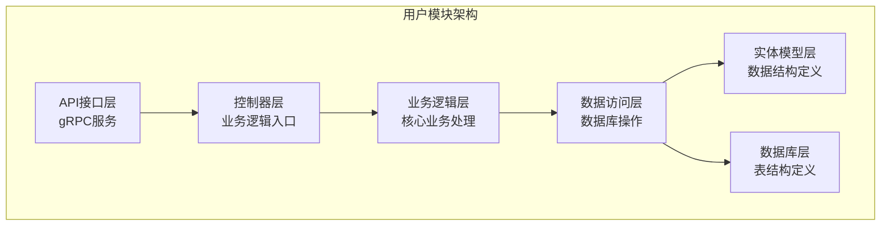
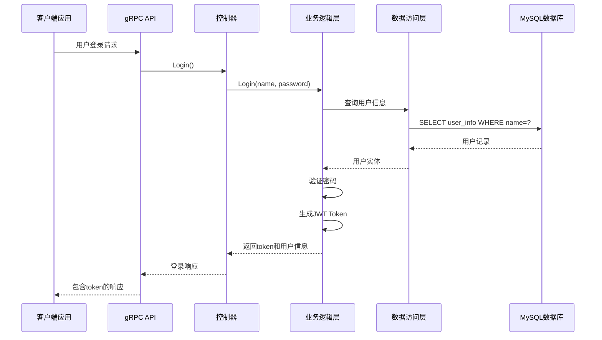
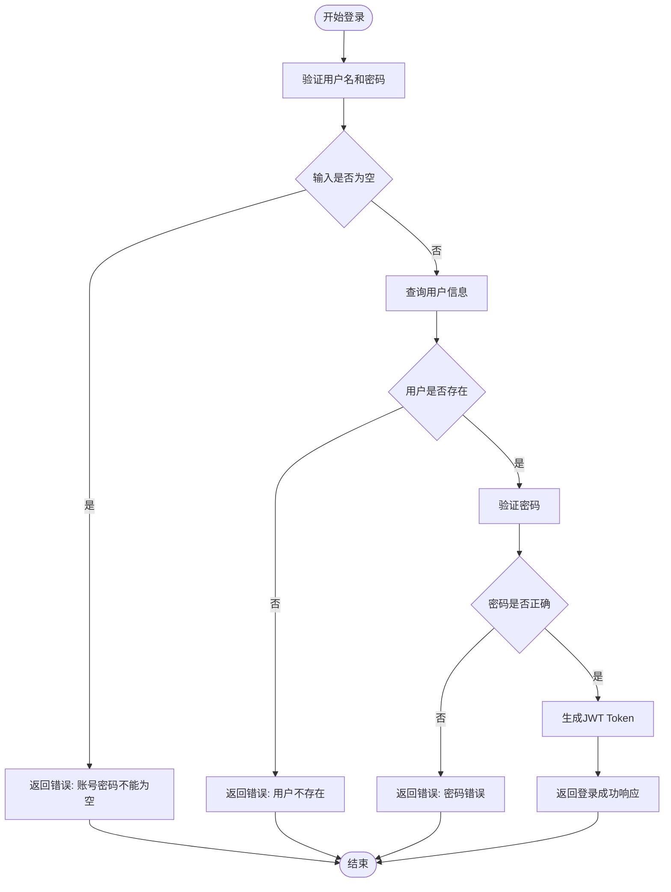
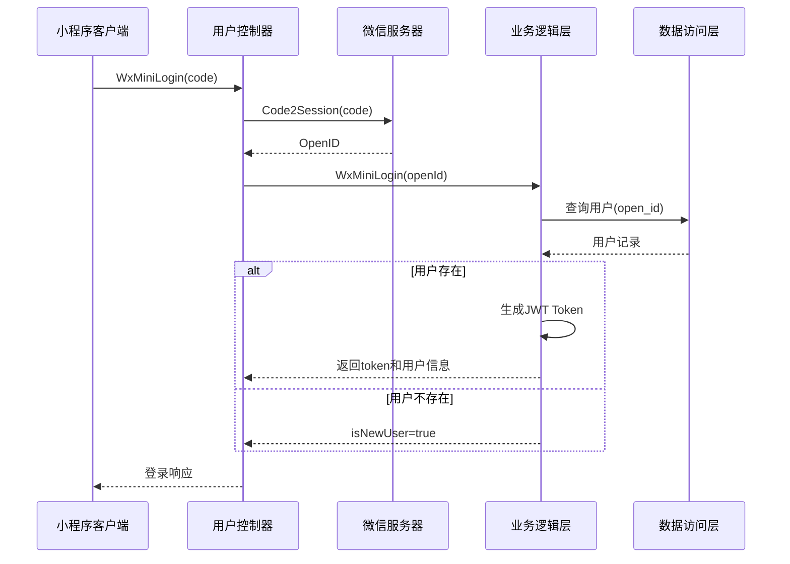
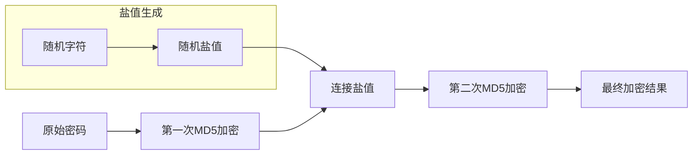
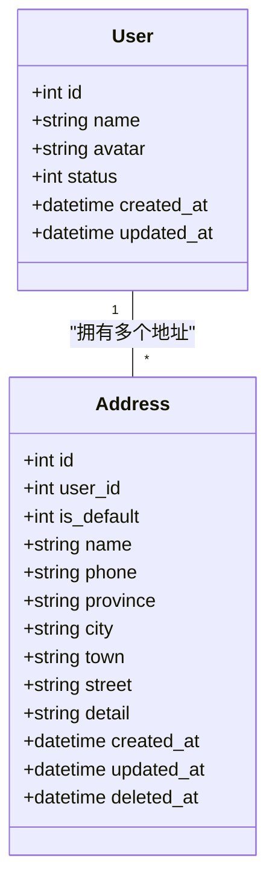
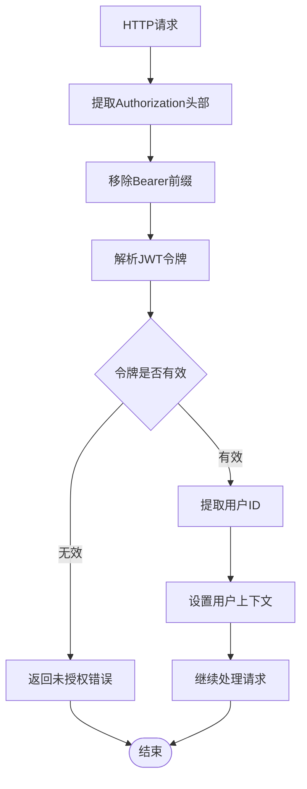
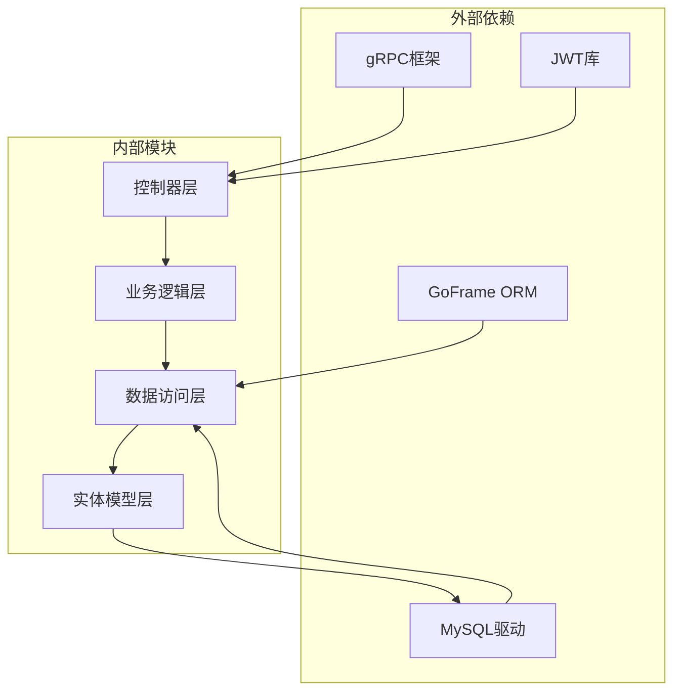
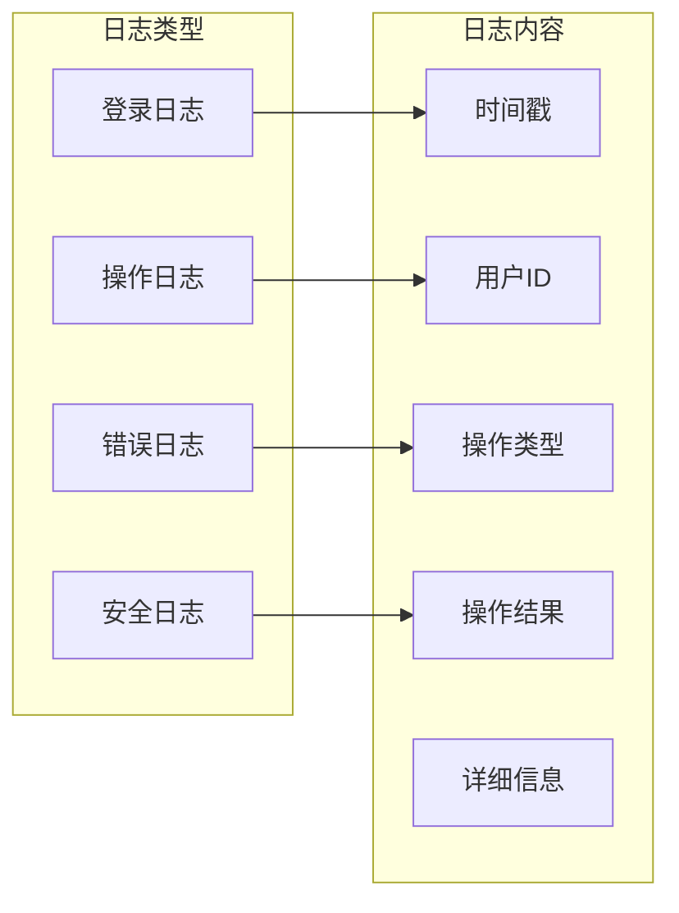

# 用户数据库设计

<cite>
**本文档引用的文件**
- [user_info.sql](file://app/user/hack/user_info.sql)
- [user_info.go](file://app/user/internal/model/entity/user_info.go)
- [consignee_info.go](file://app/user/internal/model/entity/consignee_info.go)
- [user_info.go](file://app/user/internal/model/do/user_info.go)
- [consignee_info.go](file://app/user/internal/model/do/consignee_info.go)
- [user_info.go](file://app/user/internal/dao/user_info.go)
- [consignee_info.go](file://app/user/internal/dao/consignee_info.go)
- [user_info.go](file://app/user/internal/dao/internal/user_info.go)
- [consignee_info.go](file://app/user/internal/dao/internal/consignee_info.go)
- [user_info.go](file://app/user/internal/controller/user_info/user_info.go)
- [consignee_info.go](file://app/user/internal/controller/consignee_info/consignee_info.go)
- [user_info.go](file://app/user/internal/logic/user_info/user_info.go)
- [token.go](file://utility/token.go)
- [jwt.go](file://utility/middleware/jwt.go)
- [01_init.sql](file://init-db/01_init.sql)
</cite>

## 目录
1. [简介](#简介)
2. [项目结构](#项目结构)
3. [核心组件](#核心组件)
4. [架构概览](#架构概览)
5. [详细组件分析](#详细组件分析)
6. [依赖关系分析](#依赖关系分析)
7. [性能考虑](#性能考虑)
8. [故障排除指南](#故障排除指南)
9. [结论](#结论)

## 简介

本文档详细阐述了基于GoFrame框架的用户数据库设计，重点分析了user数据库中的核心表结构和相关组件。该系统采用微服务架构，通过gRPC接口提供用户管理功能，包括用户认证、密码管理、地址管理等核心业务逻辑。

系统设计遵循分层架构原则，将数据访问、业务逻辑、控制器和API接口清晰分离，确保代码的可维护性和扩展性。同时实现了完整的用户身份认证体系，包括传统用户名密码认证和微信小程序认证两种方式。

## 项目结构

用户模块采用标准的三层架构模式，主要包含以下层次：

**图表来源**
- [user_info.go](file://app/user/internal/controller/user_info/user_info.go#L1-L268)
- [user_info.go](file://app/user/internal/logic/user_info/user_info.go#L1-L235)
- [user_info.go](file://app/user/internal/dao/user_info.go#L1-L23)

**章节来源**
- [user_info.go](file://app/user/internal/controller/user_info/user_info.go#L1-L268)
- [user_info.go](file://app/user/internal/logic/user_info/user_info.go#L1-L235)
- [user_info.go](file://app/user/internal/dao/user_info.go#L1-L23)

## 核心组件

### 用户主表设计

用户主表`user_info`是整个用户系统的核心，包含了用户的基本信息和认证相关字段：

| 字段名称 | 数据类型 | 约束条件 | 描述 |
|---------|---------|---------|------|
| id | int | 主键, 自增 | 用户唯一标识符 |
| name | varchar(200) | 非空, 默认'' | 用户名 |
| avatar | varchar(200) | 非空, 默认'' | 用户头像URL |
| password | varchar(100) | 非空 | 加密后的用户密码 |
| user_salt | varchar(10) | 非空, 默认'' | 密码加密盐值 |
| open_id | varchar(64) | 非空, 默认'' | 微信OpenID |
| phone | char(11) | 非空, 默认'' | 手机号码 |
| sex | tinyint(1) | 非空, 默认1 | 性别(1男, 2女) |
| status | tinyint(1) | 非空, 默认1 | 用户状态(1正常, 2拉黑冻结) |
| sign | varchar(255) | 非空, 默认'' | 个性签名 |
| secret_answer | varchar(255) | 非空, 默认'' | 密保问题答案 |
| created_at | datetime | 默认NULL | 创建时间 |
| updated_at | datetime | 默认NULL | 更新时间 |
| deleted_at | datetime | 默认NULL | 删除时间 |

### 收货地址表设计

收货地址表`consignee_info`用于管理用户的收货地址信息：

| 字段名称 | 数据类型 | 约束条件 | 描述 |
|---------|---------|---------|------|
| id | int | 主键, 自增 | 地址唯一标识符 |
| user_id | int | 非空, 默认0 | 关联用户ID |
| is_default | tinyint(1) | 非空, 默认0 | 是否默认地址(1是, 0否) |
| name | varchar(30) | 非空, 默认'' | 收货人姓名 |
| phone | varchar(11) | 非空, 默认'' | 收货人电话 |
| province | varchar(30) | 非空, 默认'' | 省份 |
| city | varchar(30) | 非空, default'' | 城市 |
| town | varchar(50) | 非空, 默认'' | 县区 |
| street | varchar(100) | 非空, 默认'' | 街道乡镇 |
| detail | varchar(100) | 非空, 默认'' | 详细地址 |
| created_at | datetime | 默认NULL | 创建时间 |
| updated_at | datetime | 默认NULL | 更新时间 |
| deleted_at | datetime | 默认NULL | 删除时间 |

**章节来源**
- [user_info.sql](file://app/user/hack/user_info.sql#L5-L21)
- [user_info.sql](file://app/user/hack/user_info.sql#L36-L52)
- [user_info.go](file://app/user/internal/model/entity/user_info.go#L11-L27)
- [consignee_info.go](file://app/user/internal/model/entity/consignee_info.go#L11-L26)

## 架构概览

系统采用微服务架构，通过gRPC提供用户管理服务：

**图表来源**
- [user_info.go](file://app/user/internal/controller/user_info/user_info.go#L37-L69)
- [user_info.go](file://app/user/internal/logic/user_info/user_info.go#L15-L51)
- [token.go](file://utility/token.go#L31-L50)

**章节来源**
- [user_info.go](file://app/user/internal/controller/user_info/user_info.go#L37-L69)
- [user_info.go](file://app/user/internal/logic/user_info/user_info.go#L15-L51)
- [token.go](file://utility/token.go#L31-L50)

## 详细组件分析

### 用户认证流程

系统支持两种认证方式：传统用户名密码认证和微信小程序认证。

#### 传统认证流程

**图表来源**
- [user_info.go](file://app/user/internal/logic/user_info/user_info.go#L15-L51)
- [token.go](file://utility/token.go#L31-L50)

#### 微信小程序认证流程

**图表来源**
- [user_info.go](file://app/user/internal/controller/user_info/user_info.go#L136-L187)
- [user_info.go](file://app/user/internal/logic/user_info/user_info.go#L154-L190)

**章节来源**
- [user_info.go](file://app/user/internal/logic/user_info/user_info.go#L15-L51)
- [user_info.go](file://app/user/internal/logic/user_info/user_info.go#L154-L190)

### 密码加密机制

系统采用双重MD5加密机制确保密码安全：

**图表来源**
- [token.go](file://utility/token.go#L25-L29)

加密流程特点：
- 每个用户拥有独立的随机盐值
- 采用双重MD5加密算法
- 盐值与密码同时参与加密过程
- 提升抗彩虹表攻击能力

**章节来源**
- [token.go](file://utility/token.go#L20-L30)

### 用户状态管理

用户状态采用枚举值管理：

| 状态值 | 状态名称 | 描述 |
|-------|---------|------|
| 1 | 正常 | 用户账户正常使用 |
| 2 | 拉黑冻结 | 用户账户被限制使用 |

状态管理策略：
- 默认状态为正常
- 冻结状态下禁止登录
- 系统可根据需要调整用户状态

**章节来源**
- [user_info.go](file://app/user/internal/model/entity/user_info.go#L21-L21)

### 地址管理策略

地址管理采用灵活的存储结构：

**图表来源**
- [consignee_info.go](file://app/user/internal/model/entity/consignee_info.go#L11-L26)
- [user_info.go](file://app/user/internal/model/entity/user_info.go#L11-L27)

地址管理特性：
- 支持单个用户多个收货地址
- 默认地址标识便于快速选择
- 详细的地理信息分层存储

**章节来源**
- [consignee_info.go](file://app/user/internal/model/entity/consignee_info.go#L11-L26)

### 权限控制设计

系统采用JWT令牌进行权限控制：

**图表来源**
- [jwt.go](file://utility/middleware/jwt.go#L16-L38)

权限控制机制：
- 中间件自动验证JWT令牌
- 令牌过期自动拒绝请求
- 用户ID注入到请求上下文中

**章节来源**
- [jwt.go](file://utility/middleware/jwt.go#L16-L38)

### 数据安全保护方案

系统实施多层次的数据安全保护：

1. **密码安全**
   - 双重MD5加密
   - 独立盐值机制
   - 不存储明文密码

2. **传输安全**
   - HTTPS协议传输
   - JWT令牌加密
   - 敏感信息脱敏

3. **访问控制**
   - 基于令牌的身份验证
   - 请求频率限制
   - IP白名单机制

4. **审计日志**
   - 操作日志记录
   - 异常事件追踪
   - 安全事件监控

**章节来源**
- [token.go](file://utility/token.go#L25-L29)
- [jwt.go](file://utility/middleware/jwt.go#L16-L38)

## 依赖关系分析

用户模块的依赖关系呈现清晰的分层结构：

**图表来源**
- [user_info.go](file://app/user/internal/controller/user_info/user_info.go#L3-L27)
- [user_info.go](file://app/user/internal/logic/user_info/user_info.go#L3-L13)
- [user_info.go](file://app/user/internal/dao/user_info.go#L7-L19)

**章节来源**
- [user_info.go](file://app/user/internal/controller/user_info/user_info.go#L3-L27)
- [user_info.go](file://app/user/internal/logic/user_info/user_info.go#L3-L13)
- [user_info.go](file://app/user/internal/dao/user_info.go#L7-L19)

## 性能考虑

### 数据库优化策略

1. **索引设计**
   - 用户名字段建立唯一索引
   - OpenID字段建立索引
   - 常用查询字段建立复合索引

2. **查询优化**
   - 使用预编译语句防止SQL注入
   - 实现分页查询避免大数据量扫描
   - 缓存热点数据减少数据库压力

3. **连接池管理**
   - 合理配置连接池大小
   - 实现连接复用机制
   - 监控连接使用情况

### 缓存策略

系统可以采用多级缓存提升性能：
- Redis缓存用户会话信息
- LRU缓存常用用户数据
- CDN缓存静态资源文件

### 并发控制

1. **事务管理**
   - 实现乐观锁防止并发冲突
   - 合理设置事务隔离级别
   - 及时释放数据库连接

2. **锁机制**
   - 使用分布式锁保护关键资源
   - 实现读写分离提升并发性能
   - 避免死锁发生

## 故障排除指南

### 常见问题及解决方案

1. **登录失败**
   - 检查用户名密码是否正确
   - 验证用户状态是否正常
   - 确认数据库连接是否正常

2. **密码重置失败**
   - 验证密保答案是否正确
   - 检查新密码长度要求
   - 确认盐值是否正确

3. **地址管理异常**
   - 验证用户ID是否有效
   - 检查地址格式是否正确
   - 确认默认地址设置逻辑

### 日志记录策略

系统实施全面的日志记录：

**图表来源**
- [01_init.sql](file://init-db/01_init.sql#L1268-L1278)

**章节来源**
- [01_init.sql](file://init-db/01_init.sql#L1268-L1278)

## 结论

该用户数据库设计充分体现了现代微服务架构的最佳实践，具有以下优势：

1. **架构清晰**：分层设计明确，职责分离合理
2. **安全可靠**：多重安全机制保障数据安全
3. **扩展性强**：模块化设计便于功能扩展
4. **性能优异**：合理的数据库设计和缓存策略
5. **易于维护**：代码结构规范，文档完整

通过采用JWT令牌认证、双重MD5加密、灵活的地址管理等设计，系统能够满足电商场景下的用户管理需求，为后续的功能扩展奠定了坚实基础。