# 管理后台数据库设计

<cite>
**本文档引用的文件**
- [admin.sql](file://app/admin/hack/admin.sql)
- [01_init.sql](file://init-db/01_init.sql)
- [admin_info.go](file://app/admin/internal/dao/admin_info.go)
- [permission_info.go](file://app/admin/internal/dao/permission_info.go)
- [role_info.go](file://app/admin/internal/dao/role_info.go)
- [role_permission_info.go](file://app/admin/internal/dao/role_permission_info.go)
- [admin_info.go](file://app/admin/internal/dao/internal/admin_info.go)
- [permission_info.go](file://app/admin/internal/dao/internal/permission_info.go)
- [role_info.go](file://app/admin/internal/dao/internal/role_info.go)
- [role_permission_info.go](file://app/admin/internal/dao/internal/role_permission_info.go)
- [admin_info.go](file://app/admin/internal/model/do/admin_info.go)
- [admin_info.go](file://app/admin/internal/model/entity/admin_info.go)
- [permission_info.go](file://app/admin/internal/model/entity/permission_info.go)
- [role_info.go](file://app/admin/internal/model/entity/role_info.go)
- [role_permission_info.go](file://app/admin/internal/model/entity/role_permission_info.go)
- [admin_info.go](file://app/admin/internal/logic/admin_info/admin_info.go)
- [admin_info.go](file://app/admin/internal/controller/admin_info/admin_info.go)
- [jwt.go](file://utility/middleware/jwt.go)
- [token.go](file://utility/token.go)
</cite>

## 目录
1. [简介](#简介)
2. [项目结构](#项目结构)
3. [核心组件](#核心组件)
4. [架构概览](#架构概览)
5. [详细组件分析](#详细组件分析)
6. [依赖关系分析](#依赖关系分析)
7. [性能考虑](#性能考虑)
8. [故障排除指南](#故障排除指南)
9. [结论](#结论)

## 简介

本文件详细阐述了管理后台数据库设计，重点分析admin数据库的核心表结构和权限控制系统。该系统采用RBAC（基于角色的访问控制）模型，结合Casbin权限引擎实现细粒度的权限控制，并通过JWT进行身份认证和会话管理。

系统包含三个核心数据库：admin（管理后台）、goods（商品服务）、user（用户服务），每个数据库都有独立的职责边界和数据隔离机制。

## 项目结构

管理后台采用分层架构设计，主要包含以下层次：

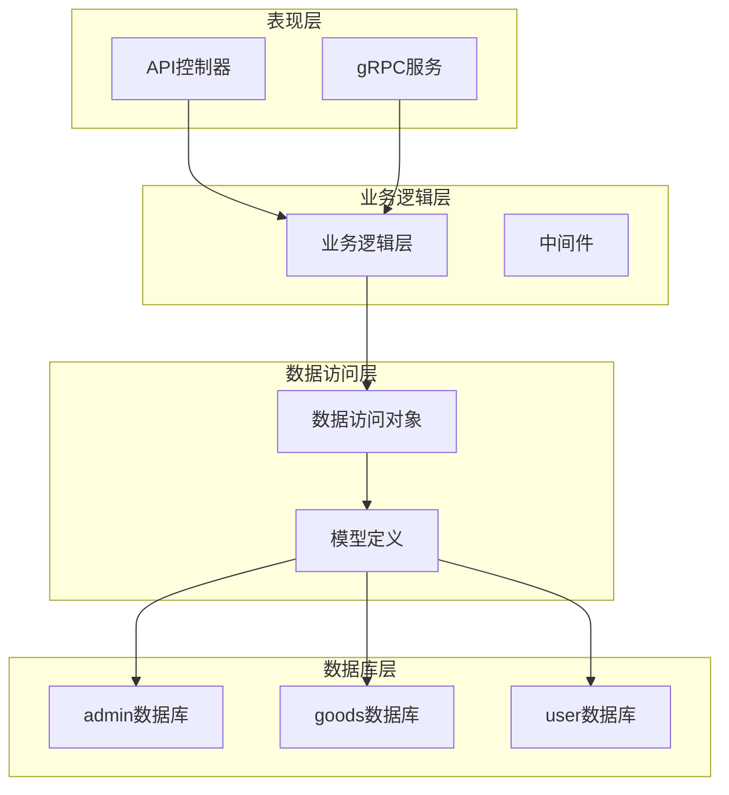

**图表来源**
- [admin_info.go](file://app/admin/internal/controller/admin_info/admin_info.go#L1-L73)
- [admin_info.go](file://app/admin/internal/logic/admin_info/admin_info.go#L1-L96)

**章节来源**
- [admin_info.go](file://app/admin/internal/controller/admin_info/admin_info.go#L1-L73)
- [admin_info.go](file://app/admin/internal/logic/admin_info/admin_info.go#L1-L96)

## 核心组件

### 数据库初始化

系统在初始化时创建多个数据库实例，确保各服务的数据隔离：

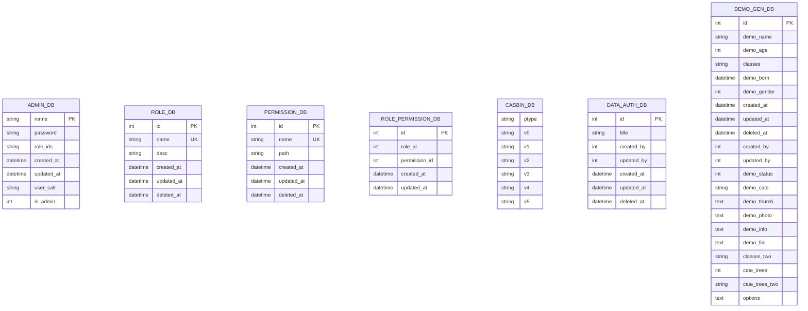

**图表来源**
- [01_init.sql](file://init-db/01_init.sql#L549-L780)
- [admin.sql](file://app/admin/hack/admin.sql#L1-L83)

### 权限控制表结构

系统采用三层权限模型：

1. **Casbin规则表**：存储RBAC权限规则
2. **角色权限关联表**：建立角色与权限的多对多关系
3. **权限信息表**：定义具体的权限资源

**章节来源**
- [admin.sql](file://app/admin/hack/admin.sql#L554-L682)
- [admin_info.go](file://app/admin/internal/dao/internal/admin_info.go#L14-L94)

## 架构概览

系统采用微服务架构，管理后台作为独立的服务模块：

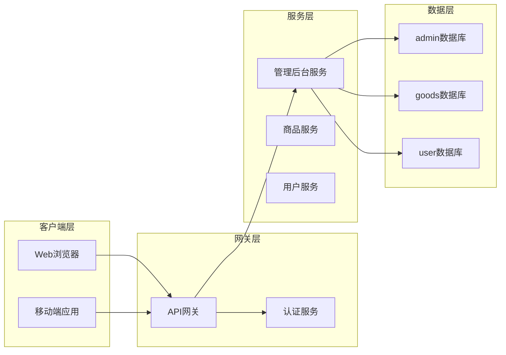

**图表来源**
- [01_init.sql](file://init-db/01_init.sql#L1-L14)

## 详细组件分析

### Casbin权限控制表

Casbin规则表实现了标准的RBAC模型，支持权限继承和复杂权限组合：

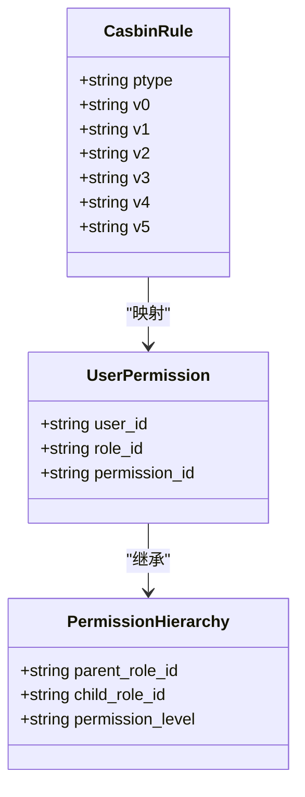

**图表来源**
- [01_init.sql](file://init-db/01_init.sql#L554-L612)

### RBAC权限模型实现

系统采用标准的RBAC（基于角色的访问控制）模型：

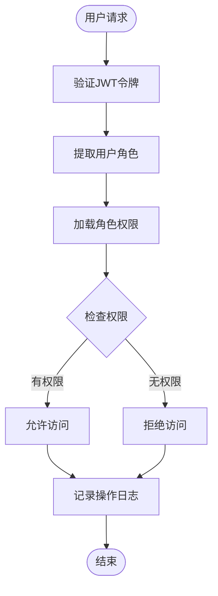

**图表来源**
- [jwt.go](file://utility/middleware/jwt.go#L16-L38)
- [admin_info.go](file://app/admin/internal/logic/admin_info/admin_info.go#L15-L46)

### 数据权限控制

系统实现了基于数据的权限控制，通过demo_data_auth表实现数据级别的访问控制：

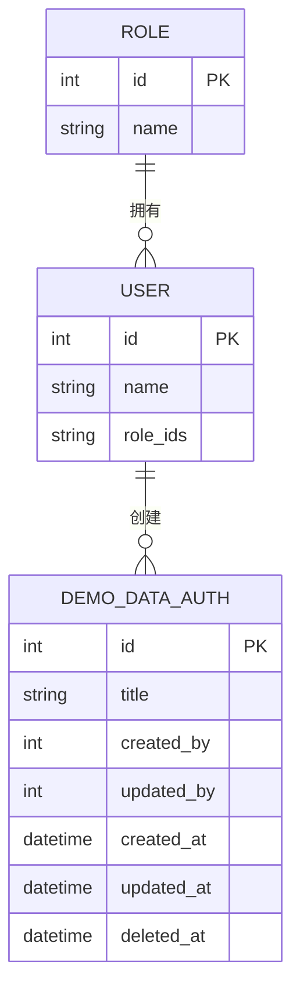

**图表来源**
- [01_init.sql](file://init-db/01_init.sql#L670-L682)

### 角色管理机制

系统支持灵活的角色管理，包括角色继承和权限分配：

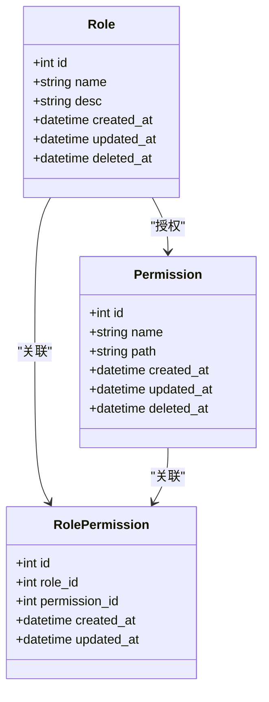

**图表来源**
- [admin_info.go](file://app/admin/internal/model/entity/role_info.go#L11-L19)
- [admin_info.go](file://app/admin/internal/model/entity/permission_info.go#L11-L18)

### 管理员账户管理

管理员账户管理系统提供了完整的用户生命周期管理：

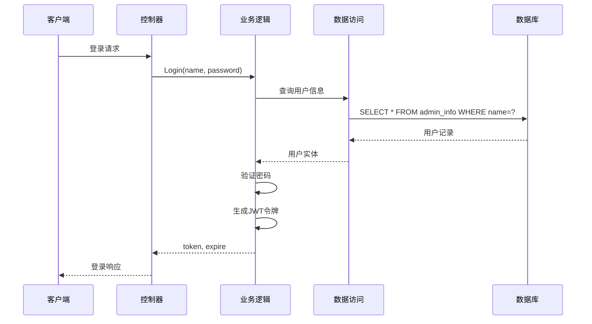

**图表来源**
- [admin_info.go](file://app/admin/internal/controller/admin_info/admin_info.go#L23-L44)
- [admin_info.go](file://app/admin/internal/logic/admin_info/admin_info.go#L15-L46)

**章节来源**
- [admin_info.go](file://app/admin/internal/controller/admin_info/admin_info.go#L1-L73)
- [admin_info.go](file://app/admin/internal/logic/admin_info/admin_info.go#L1-L96)

### 登录安全机制

系统采用多重安全措施保护登录安全：

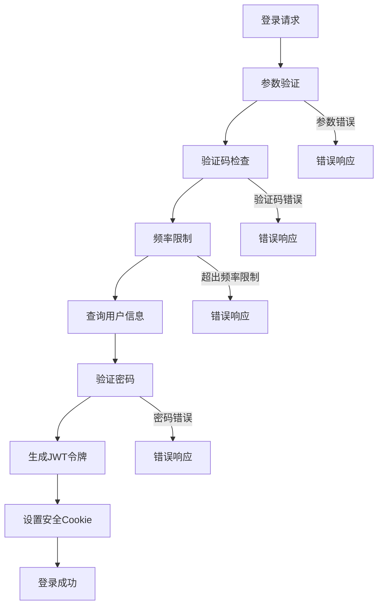

**图表来源**
- [admin_info.go](file://app/admin/internal/logic/admin_info/admin_info.go#L15-L46)
- [token.go](file://utility/token.go#L31-L50)

**章节来源**
- [token.go](file://utility/token.go#L1-L65)

### 操作风控机制

系统实现了多层次的操作风控机制：

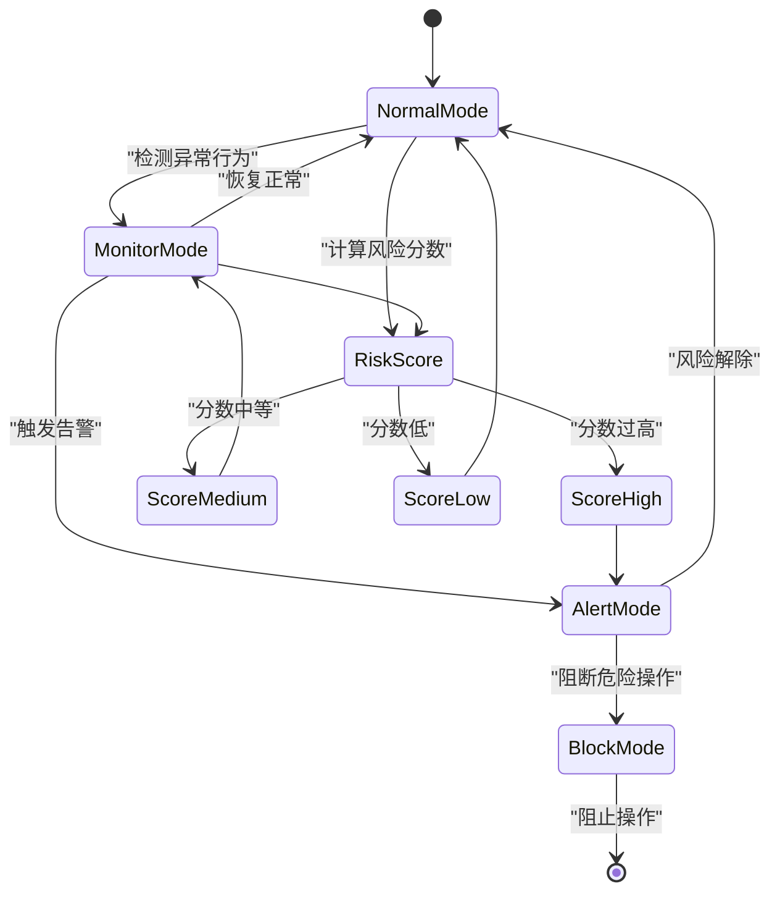

**图表来源**
- [jwt.go](file://utility/middleware/jwt.go#L16-L38)

## 依赖关系分析

系统采用清晰的依赖层次结构：

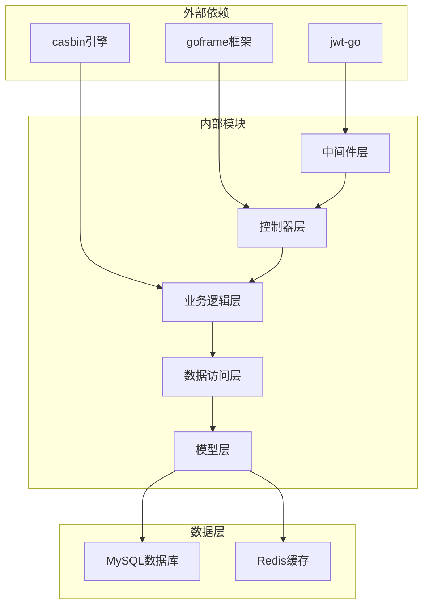

**图表来源**
- [admin_info.go](file://app/admin/internal/controller/admin_info/admin_info.go#L1-L73)
- [admin_info.go](file://app/admin/internal/logic/admin_info/admin_info.go#L1-L96)

**章节来源**
- [admin_info.go](file://app/admin/internal/dao/admin_info.go#L1-L23)
- [admin_info.go](file://app/admin/internal/dao/permission_info.go#L1-L23)

## 性能考虑

系统在设计时充分考虑了性能优化：

1. **数据库索引优化**：为常用查询字段建立合适的索引
2. **连接池管理**：合理配置数据库连接池大小
3. **缓存策略**：使用Redis缓存热点数据
4. **异步处理**：敏感操作采用异步处理机制

## 故障排除指南

### 常见问题及解决方案

1. **登录失败**
   - 检查用户名密码是否正确
   - 验证账户是否被锁定
   - 确认JWT密钥配置正确

2. **权限不足**
   - 检查用户角色配置
   - 验证权限规则设置
   - 确认Casbin策略生效

3. **数据库连接问题**
   - 检查数据库服务状态
   - 验证连接参数配置
   - 查看连接池使用情况

**章节来源**
- [admin_info.go](file://app/admin/internal/logic/admin_info/admin_info.go#L21-L42)

## 结论

该管理后台数据库设计采用了先进的RBAC权限模型和Casbin权限引擎，实现了细粒度的权限控制和灵活的角色管理。通过合理的数据库分层设计和微服务架构，系统具备良好的扩展性和维护性。

系统的主要优势包括：
- 完善的权限控制体系
- 灵活的角色继承机制  
- 多层次的安全防护
- 清晰的数据库分离
- 可扩展的架构设计

未来可以进一步优化的方向包括：引入更精细的审计日志、增强多租户支持、优化权限缓存策略等。