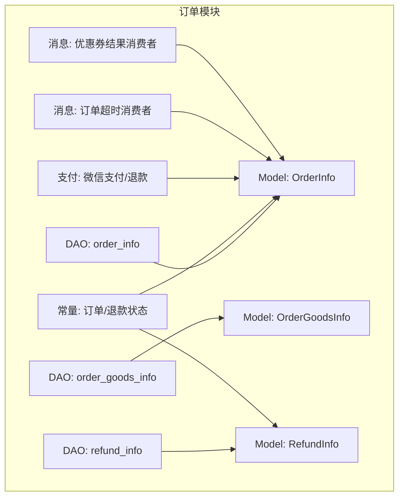
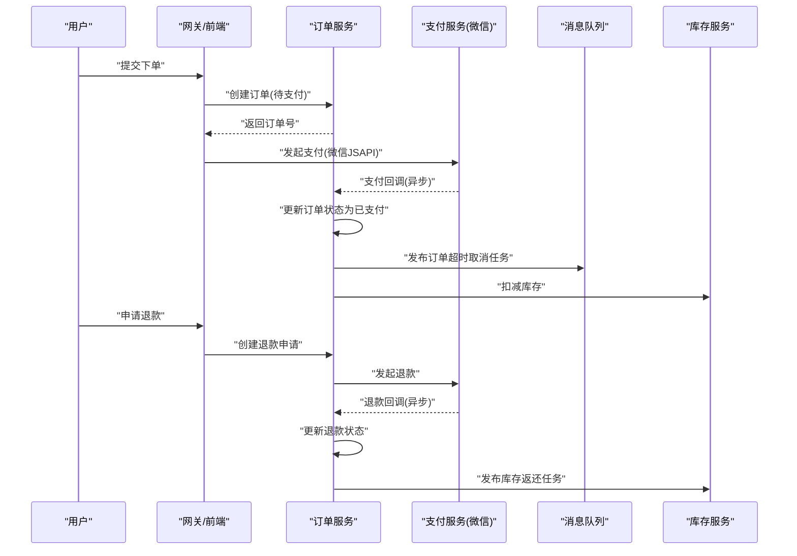
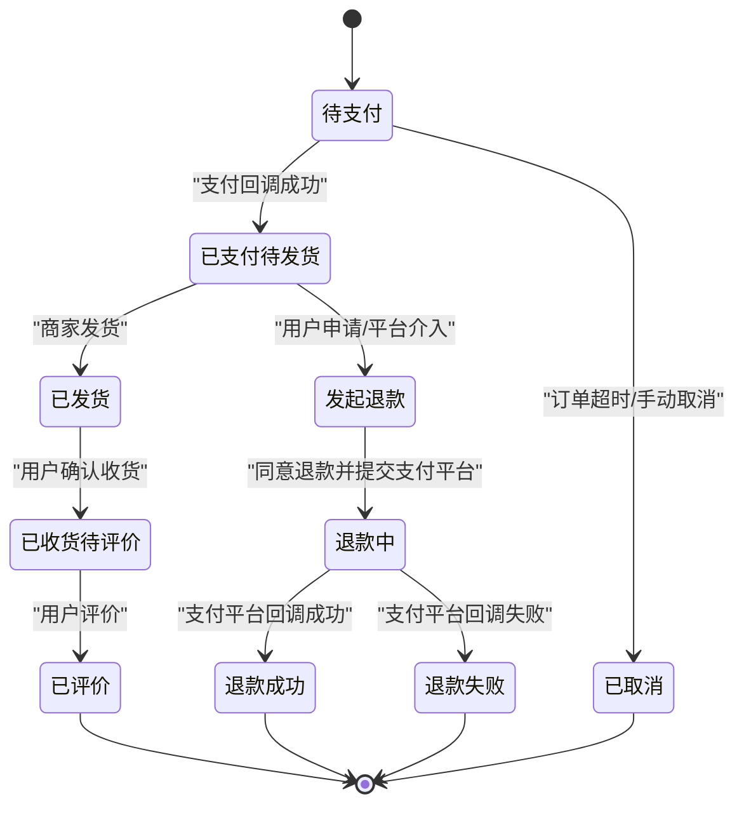
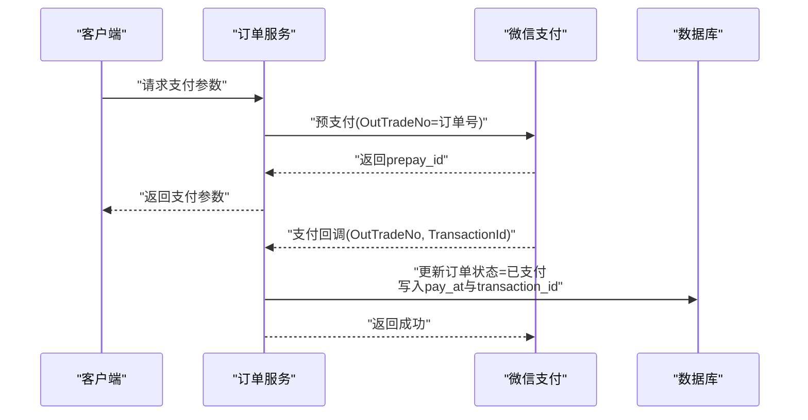
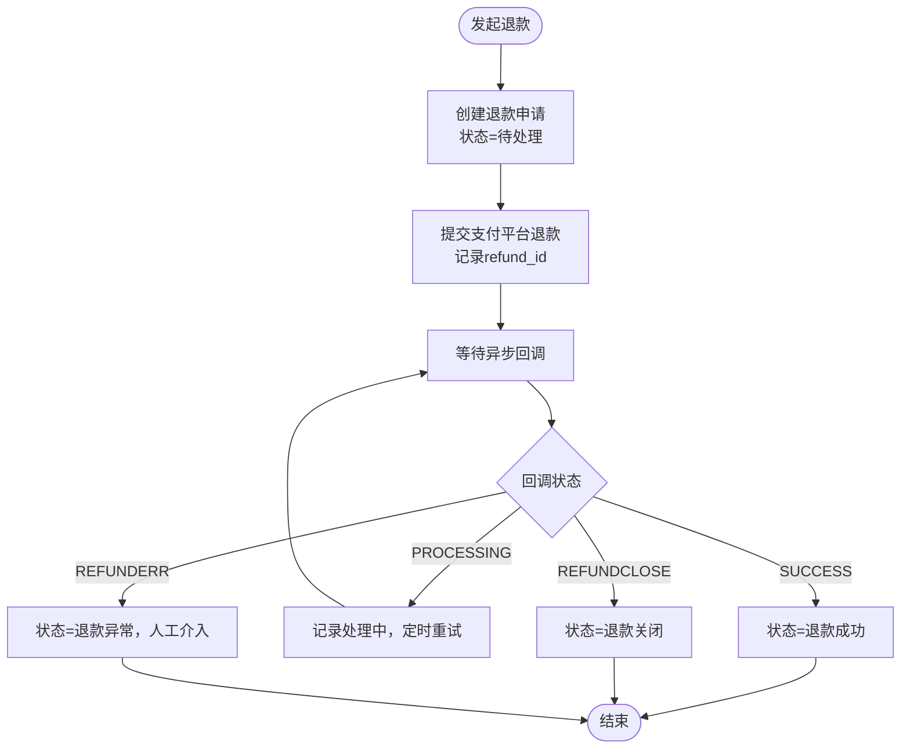
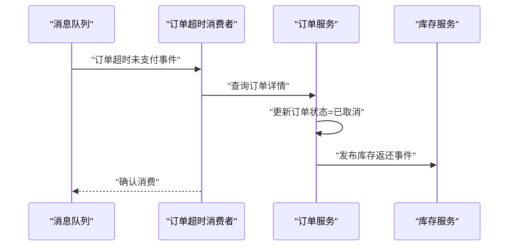
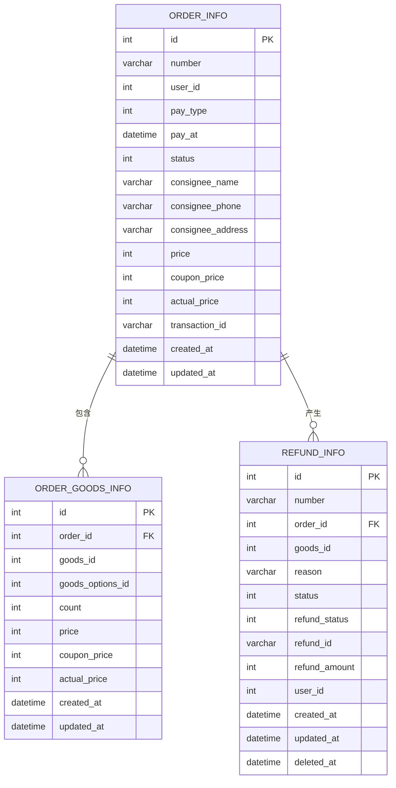

# 订单数据库设计

<cite>
**本文引用的文件**
- [order.sql](file://app/order/hack/order.sql)
- [order_status.go](file://app/order/internal/consts/order_status.go)
- [order_info.go](file://app/order/internal/model/entity/order_info.go)
- [order_goods_info.go](file://app/order/internal/model/entity/order_goods_info.go)
- [refund_info.go](file://app/order/internal/model/entity/refund_info.go)
- [order_info_dao.go](file://app/order/internal/dao/order_info.go)
- [order_goods_info_dao.go](file://app/order/internal/dao/order_goods_info.go)
- [refund_info_dao.go](file://app/order/internal/dao/refund_info.go)
- [order_timeout_consumer.go](file://app/order/utility/consumer/order_timeout_consumer.go)
- [coupon_result_consumer.go](file://app/order/utility/consumer/coupon_result_consumer.go)
- [wxchat.go](file://app/order/utility/payment/wxchat.go)
- [refund_config.go](file://app/order/internal/config/refund_config.go)
</cite>

## 目录
1. [引言](#引言)
2. [项目结构](#项目结构)
3. [核心组件](#核心组件)
4. [架构总览](#架构总览)
5. [详细组件分析](#详细组件分析)
6. [依赖关系分析](#依赖关系分析)
7. [性能考量](#性能考量)
8. [故障排查指南](#故障排查指南)
9. [结论](#结论)
10. [附录](#附录)

## 引言
本文件面向订单数据库设计与实现，围绕 order 数据库的核心表结构展开，重点覆盖：
- 订单主表 order_info 的设计与字段语义
- 订单商品明细表 order_goods_info 的设计与与主表的关系
- 退款表 refund_info 的设计与状态流转
- 订单状态机与业务规则
- 支付流程与微信回调处理
- 退款处理机制与对账思路
- 订单生命周期管理与审计追踪
- 异常处理与幂等性保障

## 项目结构
订单模块采用分层架构：DAO 层负责数据库访问；Model 层定义实体结构；Logic 层封装业务逻辑；Utility 层提供支付与消息消费能力；Config 层提供配置与常量。

图表来源
- [order_info_dao.go](file://app/order/internal/dao/order_info.go#L1-L23)
- [order_goods_info_dao.go](file://app/order/internal/dao/order_goods_info.go#L1-L23)
- [refund_info_dao.go](file://app/order/internal/dao/refund_info.go#L1-L30)
- [order_info.go](file://app/order/internal/model/entity/order_info.go#L1-L30)
- [order_goods_info.go](file://app/order/internal/model/entity/order_goods_info.go#L1-L25)
- [refund_info.go](file://app/order/internal/model/entity/refund_info.go#L1-L27)
- [order_status.go](file://app/order/internal/consts/order_status.go#L1-L38)
- [order_timeout_consumer.go](file://app/order/utility/consumer/order_timeout_consumer.go#L1-L87)
- [coupon_result_consumer.go](file://app/order/utility/consumer/coupon_result_consumer.go#L1-L54)
- [wxchat.go](file://app/order/utility/payment/wxchat.go#L1-L328)

章节来源
- [order_info_dao.go](file://app/order/internal/dao/order_info.go#L1-L23)
- [order_goods_info_dao.go](file://app/order/internal/dao/order_goods_info.go#L1-L23)
- [refund_info_dao.go](file://app/order/internal/dao/refund_info.go#L1-L30)
- [order_info.go](file://app/order/internal/model/entity/order_info.go#L1-L30)
- [order_goods_info.go](file://app/order/internal/model/entity/order_goods_info.go#L1-L25)
- [refund_info.go](file://app/order/internal/model/entity/refund_info.go#L1-L27)
- [order_status.go](file://app/order/internal/consts/order_status.go#L1-L38)
- [order_timeout_consumer.go](file://app/order/utility/consumer/order_timeout_consumer.go#L1-L87)
- [coupon_result_consumer.go](file://app/order/utility/consumer/coupon_result_consumer.go#L1-L54)
- [wxchat.go](file://app/order/utility/payment/wxchat.go#L1-L328)

## 核心组件
- 订单主表 order_info：存储订单基础信息、金额、收货信息、支付信息与状态。
- 订单商品明细表 order_goods_info：按商品维度记录每笔订单中的具体商品、数量、价格与优惠分摊。
- 退款表 refund_info：记录退款申请、审核状态、退款状态与第三方退款编号。

章节来源
- [order.sql](file://app/order/hack/order.sql#L32-L71)
- [order_info.go](file://app/order/internal/model/entity/order_info.go#L11-L29)
- [order_goods_info.go](file://app/order/internal/model/entity/order_goods_info.go#L11-L24)
- [refund_info.go](file://app/order/internal/model/entity/refund_info.go#L11-L26)

## 架构总览
订单系统围绕“订单主表 + 明细表 + 退款表”的三表结构，结合支付回调、消息队列与配置化常量，形成完整的订单生命周期闭环。

图表来源
- [wxchat.go](file://app/order/utility/payment/wxchat.go#L84-L171)
- [order_timeout_consumer.go](file://app/order/utility/consumer/order_timeout_consumer.go#L39-L86)
- [coupon_result_consumer.go](file://app/order/utility/consumer/coupon_result_consumer.go#L34-L53)

## 详细组件分析

### 订单主表 order_info 设计
- 字段要点
  - 订单编号 number：全局唯一标识，用于与支付平台对接与对账。
  - 用户标识 user_id：关联用户。
  - 支付方式 pay_type：1 微信，2 支付宝，3 云闪付。
  - 支付时间 pay_at：记录支付完成时间。
  - 状态 status：见“订单状态机”。
  - 收货信息：收件人姓名、电话、地址。
  - 金额字段：price、coupon_price、actual_price（单位分），确保精确计算与对账。
  - 第三方交易号 transaction_id：微信支付交易号。
- 设计理念
  - 将“订单级”信息与“商品级”信息分离，便于扩展与统计。
  - 金额统一以“分”存储，避免浮点误差。
  - 状态字段集中管理，配合常量与状态机控制流转。

章节来源
- [order.sql](file://app/order/hack/order.sql#L32-L52)
- [order_info.go](file://app/order/internal/model/entity/order_info.go#L11-L29)

### 订单商品明细表 order_goods_info 设计
- 字段要点
  - 关联主订单 order_id。
  - 商品标识 goods_id 与规格 goods_options_id（SKU）。
  - 数量 count、单价与优惠分摊、实付金额。
  - 订单级优惠 coupon_price 与明细级优惠拆分，保证对账清晰。
- 设计理念
  - 明细表承载商品维度的价格与优惠，支持多商品订单的精细化核算。
  - 与主表通过 order_id 关联，便于查询与统计。

章节来源
- [order.sql](file://app/order/hack/order.sql#L4-L18)
- [order_goods_info.go](file://app/order/internal/model/entity/order_goods_info.go#L11-L24)

### 退款表 refund_info 设计
- 字段要点
  - 售后单号 number：退款单号。
  - 关联订单 order_id 与商品 goods_id。
  - 审核状态 status：1 待处理、2 同意、3 拒绝。
  - 退款状态 refund_status：0 未退款、1 退款中、2 成功、3 失败。
  - 第三方退款编号 refund_id：微信退款单号。
  - 退款金额 refund_amount：单位分。
  - 申请原因 reason、用户标识 user_id。
- 设计理念
  - 审核状态与退款状态分离，便于区分“平台侧审核”和“支付平台状态”。
  - 保留第三方退款编号，便于对账与异步回调处理。

章节来源
- [order.sql](file://app/order/hack/order.sql#L75-L90)
- [refund_info.go](file://app/order/internal/model/entity/refund_info.go#L11-L26)

### 订单状态机与业务规则
- 订单状态枚举
  - 1 待支付、2 已支付待发货、3 已发货、4 已收货待评价、5 已评价、6 待确认（优惠券）、7 已取消、8 发起退款。
- 退款状态
  - 审核状态：1 待处理、2 同意、3 拒绝。
  - 退款状态：0 未退款、1 退款中、2 成功、3 失败。
- 规则约束
  - 仅“已支付待发货”及以上状态允许发起退款。
  - “已取消/已完成”不可再次发起退款。
  - 退款成功后触发库存返还与资金结算。

图表来源
- [order_status.go](file://app/order/internal/consts/order_status.go#L6-L26)

章节来源
- [order_status.go](file://app/order/internal/consts/order_status.go#L1-L38)

### 支付流程与回调处理
- 支付流程
  - 生成预支付请求，返回前端支付参数（时间戳、随机串、签名包等）。
  - 微信回调通知携带 out_trade_no 与 transaction_id。
- 回调处理
  - 验签与解密，解析回调内容，提取订单号与第三方交易号。
  - 更新订单状态为“已支付”，写入支付时间与第三方交易号。
- 幂等性
  - 回调处理需基于订单号进行幂等判断，避免重复更新。

图表来源
- [wxchat.go](file://app/order/utility/payment/wxchat.go#L84-L171)
- [order_info.go](file://app/order/internal/model/entity/order_info.go#L18-L20)

章节来源
- [wxchat.go](file://app/order/utility/payment/wxchat.go#L84-L171)

### 退款处理机制与对账
- 退款流程
  - 创建退款申请，设置审核状态为“待处理”。
  - 提交支付平台退款，记录 refund_id。
  - 支付平台异步回调，根据状态更新退款状态。
- 对账机制
  - 以订单号与第三方交易号作为对账依据。
  - 退款对账以 refund_id 与退款金额为准。
  - 配置化查询间隔与最大尝试次数，避免频繁轮询。
- 异常处理
  - 状态未知或失败时，记录日志并人工介入。
  - 退款关闭/异常场景下，禁止重复提交。

图表来源
- [wxchat.go](file://app/order/utility/payment/wxchat.go#L184-L246)
- [refund_config.go](file://app/order/internal/config/refund_config.go#L38-L75)

章节来源
- [wxchat.go](file://app/order/utility/payment/wxchat.go#L184-L246)
- [refund_config.go](file://app/order/internal/config/refund_config.go#L1-L105)

### 订单生命周期管理与消息驱动
- 订单超时取消
  - 通过延迟队列发布“订单超时未支付”事件，消费者在到期后执行取消与库存返还。
- 优惠券确认
  - 接收优惠券确认结果，更新订单状态（如从“待确认”转为“待支付”）。
- 库存联动
  - 订单支付成功后扣减库存；取消/退款完成后返还库存。

图表来源
- [order_timeout_consumer.go](file://app/order/utility/consumer/order_timeout_consumer.go#L39-L86)

章节来源
- [order_timeout_consumer.go](file://app/order/utility/consumer/order_timeout_consumer.go#L1-L87)
- [coupon_result_consumer.go](file://app/order/utility/consumer/coupon_result_consumer.go#L1-L54)

### 订单号生成策略
- 订单号由外部网关/前端生成，格式建议为“时间戳 + 业务标识 + 序列号”，确保全局唯一且具备可读性。
- 订单表 number 字段与支付平台 out_trade_no 保持一致，便于对账与追溯。

章节来源
- [order_info.go](file://app/order/internal/model/entity/order_info.go#L14-L14)
- [wxchat.go](file://app/order/utility/payment/wxchat.go#L94-L94)

### 审计追踪与异常处理
- 审计追踪
  - 所有关键操作均记录 created_at/updated_at，便于审计与对账。
  - 退款表新增 deleted_at 字段，支持软删除与历史归档。
- 异常处理
  - 支付/退款回调需严格验签与解密，失败时记录错误上下文。
  - 幂等校验：回调与重试均需基于订单号与第三方流水号进行去重。
  - 日志分级：错误、警告、信息，便于定位问题。

章节来源
- [order_info.go](file://app/order/internal/model/entity/order_info.go#L27-L28)
- [refund_info.go](file://app/order/internal/model/entity/refund_info.go#L23-L25)
- [wxchat.go](file://app/order/utility/payment/wxchat.go#L134-L171)

## 依赖关系分析
- 表间关系
  - order_info.id → order_goods_info.order_id（一对多）
  - order_info.id → refund_info.order_id（一对多）
- 组件耦合
  - DAO 层与 Model 层解耦，便于单元测试与替换实现。
  - 支付模块与订单模块通过订单号与回调参数解耦。
  - 消费者通过消息队列与订单服务解耦。

图表来源
- [order.sql](file://app/order/hack/order.sql#L4-L90)
- [order_info.go](file://app/order/internal/model/entity/order_info.go#L11-L29)
- [order_goods_info.go](file://app/order/internal/model/entity/order_goods_info.go#L11-L24)
- [refund_info.go](file://app/order/internal/model/entity/refund_info.go#L11-L26)

章节来源
- [order.sql](file://app/order/hack/order.sql#L4-L90)

## 性能考量
- 索引建议
  - 订单表：索引 number、user_id、status、pay_at；复合索引用于常见查询（如用户+状态）。
  - 明细表：索引 order_id；必要时增加 goods_id 维度索引。
  - 退款表：索引 order_id、refund_id、status、created_at。
- 分库分表
  - 按用户 ID 或时间维度分片，降低热点与单表膨胀。
- 缓存策略
  - 订单详情与热门商品信息缓存，减少数据库压力。
- 异步处理
  - 超时取消、库存扣减与返还、优惠券确认等通过消息队列异步化，提升吞吐。

## 故障排查指南
- 支付回调未生效
  - 检查回调验签与解密流程，确认 headers 与 body 是否正确传递。
  - 核对 OutTradeNo 与订单号一致性。
- 退款状态异常
  - 查看 refund_id 与回调状态映射，确认是否进入“处理中/失败/关闭”分支。
  - 结合配置项（超时、查询间隔、最大尝试次数）检查重试策略。
- 订单超时未取消
  - 检查延迟队列配置与消费者日志，确认事件是否到达与处理。
  - 核对订单状态是否被提前修改导致跳过处理。

章节来源
- [wxchat.go](file://app/order/utility/payment/wxchat.go#L134-L171)
- [refund_config.go](file://app/order/internal/config/refund_config.go#L38-L75)
- [order_timeout_consumer.go](file://app/order/utility/consumer/order_timeout_consumer.go#L39-L86)

## 结论
该订单数据库设计以“三表合一”为核心，通过清晰的状态机、完善的退款与支付回调机制、消息驱动的异步处理以及配置化的对账策略，实现了高可用、可扩展、易审计的订单体系。建议在生产环境中进一步完善索引、缓存与分片策略，并持续优化回调与重试的可观测性与告警能力。

## 附录
- 关键字段说明
  - 订单号 number：全局唯一，与支付平台 out_trade_no 一致。
  - 金额字段：统一以“分”存储，避免精度问题。
  - 第三方交易号 transaction_id/refund_id：用于对账与异步回调识别。
- 常用查询建议
  - 订单列表：按 user_id + status + created_at 排序。
  - 退款明细：按 order_id + refund_status 查询。
  - 对账：以 number 与 transaction_id 为维度进行交叉核对。