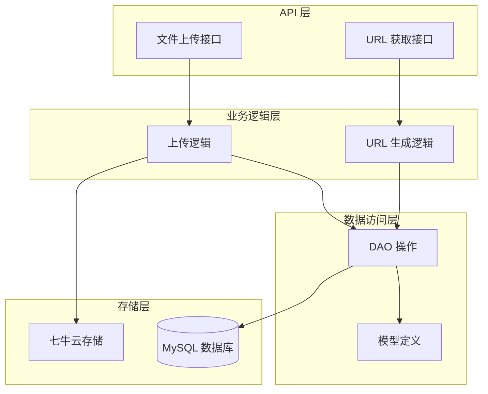
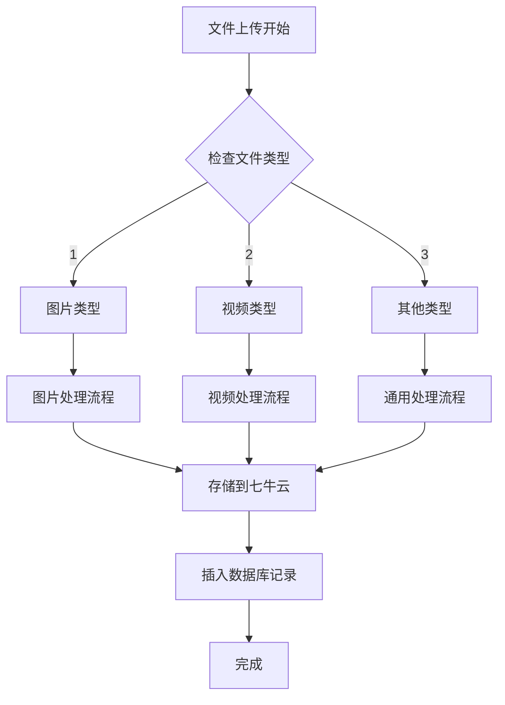
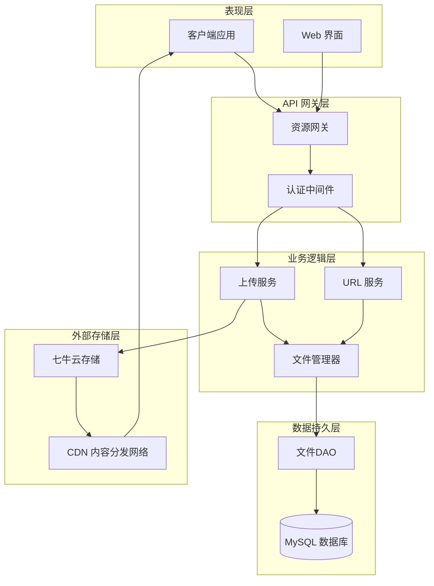
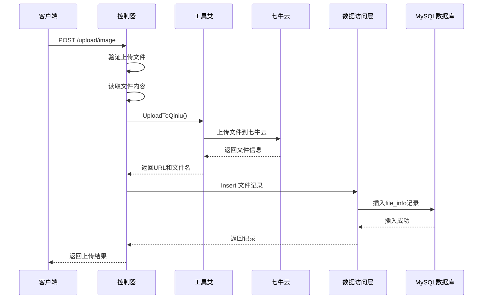
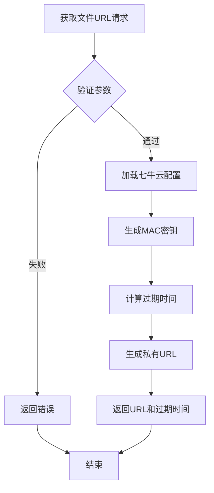
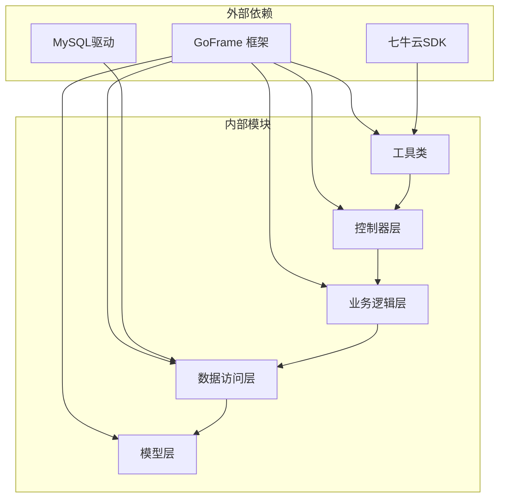

# 资源文件数据库设计

<cite>
**本文档引用的文件**
- [resource.sql](file://app/gateway-resource/hack/resource.sql)
- [file_info.go](file://app/gateway-resource/internal/dao/file_info.go)
- [qiniu.go](file://app/gateway-resource/utility/qiniu.go)
- [file_info.go](file://app/gateway-resource/internal/model/entity/file_info.go)
- [file_info.go](file://app/gateway-resource/internal/logic/file_info/file_info.go)
- [file_info.go](file://app/gateway-resource/internal/controller/file/file_v1_upload_image.go)
- [file_info.go](file://app/gateway-resource/internal/controller/file/file_v1_get_avatar_image.go)
- [file_info.go](file://app/gateway-resource/api/file/v1/file_info.go)
- [config.prod.yaml](file://app/gateway-resource/manifest/config/config.prod.yaml)
- [file_info.go](file://app/gateway-resource/internal/model/do/file_info.go)
</cite>

## 目录
1. [引言](#引言)
2. [项目结构](#项目结构)
3. [核心组件](#核心组件)
4. [架构概览](#架构概览)
5. [详细组件分析](#详细组件分析)
6. [依赖关系分析](#依赖关系分析)
7. [性能考虑](#性能考虑)
8. [故障排除指南](#故障排除指南)
9. [结论](#结论)

## 引言

本文档详细阐述了基于 GoFrame 微服务框架的资源文件数据库设计。该系统采用统一文件存储表 `file_info` 来管理所有类型的文件资源，集成了七牛云存储服务，实现了完整的文件上传、存储、访问和管理功能。

系统设计遵循微服务架构原则，通过独立的资源网关服务处理所有文件相关操作，确保了系统的模块化和可维护性。

## 项目结构

资源文件管理系统采用典型的三层架构模式：



**图表来源**
- [file_info.go](file://app/gateway-resource/internal/controller/file/file_v1_upload_image.go#L20-L71)
- [file_info.go](file://app/gateway-resource/internal/controller/file/file_v1_get_avatar_image.go#L13-L22)
- [file_info.go](file://app/gateway-resource/internal/dao/file_info.go#L13-L20)

**章节来源**
- [file_info.go](file://app/gateway-resource/internal/controller/file/file_v1_upload_image.go#L1-L72)
- [file_info.go](file://app/gateway-resource/internal/controller/file/file_v1_get_avatar_image.go#L1-L23)

## 核心组件

### 数据库表结构设计

`file_info` 表作为统一文件存储的核心表，采用了精心设计的字段结构来满足各种文件管理需求：

| 字段名 | 类型 | 约束 | 描述 |
|--------|------|------|------|
| id | INT UNSIGNED | PRIMARY KEY, AUTO_INCREMENT | 文件唯一标识符 |
| name | VARCHAR(255) | NOT NULL | 文件原始名称 |
| url | VARCHAR(255) | NOT NULL | 七牛云文件访问URL |
| uploader_id | INT UNSIGNED | NOT NULL, DEFAULT 0 | 上传者ID（用户ID或管理员ID） |
| uploader_type | TINYINT UNSIGNED | NOT NULL, DEFAULT 0 | 上传者类型：1-H5用户，2-管理员 |
| file_type | TINYINT UNSIGNED | NOT NULL, DEFAULT 0 | 文件类型：1-图片，2-视频，3-其他 |
| created_at | DATETIME | DEFAULT NULL | 创建时间 |
| deleted_at | DATETIME | DEFAULT NULL | 删除时间 |

### 文件类型分类体系

系统实现了灵活的文件类型分类机制：



**图表来源**
- [resource.sql](file://app/gateway-resource/hack/resource.sql#L3-L12)
- [file_info.go](file://app/gateway-resource/internal/model/entity/file_info.go#L12-L21)

**章节来源**
- [resource.sql](file://app/gateway-resource/hack/resource.sql#L1-L13)
- [file_info.go](file://app/gateway-resource/internal/model/entity/file_info.go#L11-L21)

## 架构概览

系统采用分层架构设计，确保了各层职责清晰分离：



**图表来源**
- [file_info.go](file://app/gateway-resource/internal/controller/file/file_v1_upload_image.go#L20-L71)
- [file_info.go](file://app/gateway-resource/utility/qiniu.go#L18-L79)

## 详细组件分析

### 文件上传组件

文件上传组件是整个系统的核心功能模块，负责处理各类文件的上传和存储：

#### 上传流程序列图



**图表来源**
- [file_info.go](file://app/gateway-resource/internal/controller/file/file_v1_upload_image.go#L20-L71)
- [qiniu.go](file://app/gateway-resource/utility/qiniu.go#L18-L79)
- [file_info.go](file://app/gateway-resource/internal/logic/file_info/file_info.go#L11-L25)

#### 文件上传处理逻辑

上传组件实现了完整的文件处理流程：

1. **文件验证**：检查上传文件是否存在且有效
2. **内容读取**：将文件内容读取到内存中
3. **云存储上传**：调用七牛云 SDK 进行文件上传
4. **数据库记录**：在 `file_info` 表中创建文件记录
5. **响应返回**：向客户端返回文件访问信息

**章节来源**
- [file_info.go](file://app/gateway-resource/internal/controller/file/file_v1_upload_image.go#L20-L71)

### URL 生成组件

URL 生成组件负责为已上传的文件生成安全的访问链接：

#### URL 生成流程



**图表来源**
- [file_info.go](file://app/gateway-resource/internal/controller/file/file_v1_get_avatar_image.go#L13-L22)
- [qiniu.go](file://app/gateway-resource/utility/qiniu.go#L81-L101)

**章节来源**
- [file_info.go](file://app/gateway-resource/internal/controller/file/file_v1_get_avatar_image.go#L13-L22)
- [qiniu.go](file://app/gateway-resource/utility/qiniu.go#L81-L101)

### 数据模型设计

系统采用了标准的 MVC 设计模式，通过数据模型实现数据的结构化管理：

#### 实体模型类图

```mermaid
classDiagram
class FileInfo {
+uint Id
+string Name
+string Url
+uint UploaderId
+uint UploaderType
+uint FileType
+gtime.Time CreatedAt
+gtime.Time DeletedAt
}
class FileInfoDO {
+interface{} Id
+interface{} Name
+interface{} Url
+interface{} UploaderId
+interface{} UploaderType
+interface{} FileType
+gtime.Time CreatedAt
+gtime.Time DeletedAt
}
class FileInfoDao {
+FileInfoDao FileInfo
+NewFileInfoDao() FileInfoDao
+Ctx(ctx) FileInfoDao
+Insert(data) Result
+Where(conditions) FileInfoDao
+One() FileInfo
+Lists() []FileInfo
}
FileInfo <|-- FileInfoDO : "数据传输对象"
FileInfoDao --> FileInfo : "操作"
FileInfoDao --> FileInfoDO : "查询条件"
```

**图表来源**
- [file_info.go](file://app/gateway-resource/internal/model/entity/file_info.go#L12-L21)
- [file_info.go](file://app/gateway-resource/internal/model/do/file_info.go#L13-L23)
- [file_info.go](file://app/gateway-resource/internal/dao/file_info.go#L13-L20)

**章节来源**
- [file_info.go](file://app/gateway-resource/internal/model/entity/file_info.go#L11-L21)
- [file_info.go](file://app/gateway-resource/internal/model/do/file_info.go#L12-L23)
- [file_info.go](file://app/gateway-resource/internal/dao/file_info.go#L11-L20)

### 七牛云集成方案

系统深度集成了七牛云存储服务，实现了企业级的文件存储解决方案：

#### 存储配置结构

| 配置项 | 类型 | 默认值 | 描述 |
|--------|------|--------|------|
| accessKey | string | 必填 | 七牛云访问密钥 |
| secretKey | string | 必填 | 七牛云私有密钥 |
| bucket | string | 必填 | 存储桶名称 |
| domain | string | 必填 | 访问域名 |
| expireTime | int64 | 604800秒 | URL过期时间（秒） |

#### 文件命名策略

系统采用智能的文件命名策略，确保文件名的唯一性和安全性：

1. **原始文件名保留**：保留用户上传的原始文件名
2. **时间戳追加**：添加精确到秒的时间戳
3. **随机数生成**：生成4位随机字符串
4. **特殊字符清理**：移除路径分隔符和非法字符
5. **扩展名保持**：确保文件扩展名完整

**章节来源**
- [config.prod.yaml](file://app/gateway-resource/manifest/config/config.prod.yaml#L24-L29)
- [qiniu.go](file://app/gateway-resource/utility/qiniu.go#L103-L140)

## 依赖关系分析

系统各组件之间的依赖关系清晰明确，遵循了依赖倒置原则：



**图表来源**
- [file_info.go](file://app/gateway-resource/internal/controller/file/file_v1_upload_image.go#L3-L18)
- [file_info.go](file://app/gateway-resource/internal/dao/file_info.go#L7-L15)

**章节来源**
- [file_info.go](file://app/gateway-resource/internal/controller/file/file_v1_upload_image.go#L1-L72)
- [file_info.go](file://app/gateway-resource/internal/dao/file_info.go#L1-L23)

## 性能考虑

系统在设计时充分考虑了性能优化，采用了多种策略来提升整体性能：

### 缓存策略
- **URL 缓存**：短期缓存常用的文件URL，减少重复生成
- **配置缓存**：缓存七牛云配置信息，避免频繁读取
- **连接池**：使用数据库连接池优化数据库访问

### 并发处理
- **异步上传**：支持大文件的异步上传处理
- **并发限制**：限制同时上传的文件数量
- **资源回收**：及时释放上传过程中的临时资源

### 存储优化
- **CDN 加速**：利用七牛云CDN提升文件访问速度
- **压缩策略**：对图片进行适当的压缩处理
- **分片上传**：支持大文件的分片上传功能

## 故障排除指南

### 常见问题及解决方案

#### 上传失败问题
1. **检查七牛云配置**：确认 accessKey、secretKey、bucket 配置正确
2. **验证网络连接**：确保能够正常访问七牛云服务
3. **检查存储空间**：确认存储桶有足够的剩余空间

#### URL 生成错误
1. **验证文件存在**：确认文件在七牛云中确实存在
2. **检查过期时间**：确认 URL 未过期
3. **重新生成 URL**：调用重新生成接口获取新的访问链接

#### 数据库连接问题
1. **检查连接字符串**：确认 MySQL 连接信息正确
2. **验证数据库状态**：确认 MySQL 服务正常运行
3. **检查权限设置**：确认数据库用户具有相应权限

**章节来源**
- [file_info.go](file://app/gateway-resource/utility/qiniu.go#L20-L24)
- [config.prod.yaml](file://app/gateway-resource/manifest/config/config.prod.yaml#L16-L19)

## 结论

资源文件数据库设计通过统一的 `file_info` 表实现了对各类文件的集中管理，结合七牛云存储服务提供了高效、安全的文件存储解决方案。系统采用分层架构设计，确保了良好的可维护性和扩展性。

主要设计亮点包括：
- 统一的文件存储表结构，支持多种文件类型
- 智能的文件命名策略，确保文件唯一性
- 安全的 URL 生成机制，支持过期控制
- 完善的错误处理和故障恢复机制
- 优秀的性能优化策略

该设计为后续的功能扩展和系统升级奠定了坚实的基础，能够满足现代 Web 应用对文件管理的各种需求。