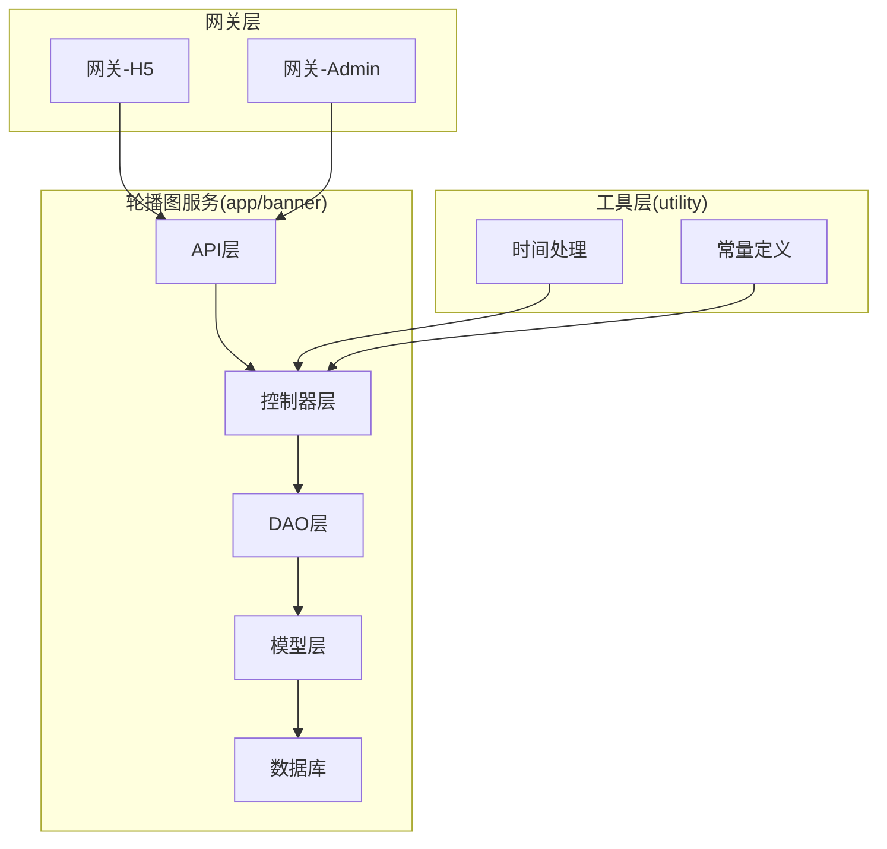
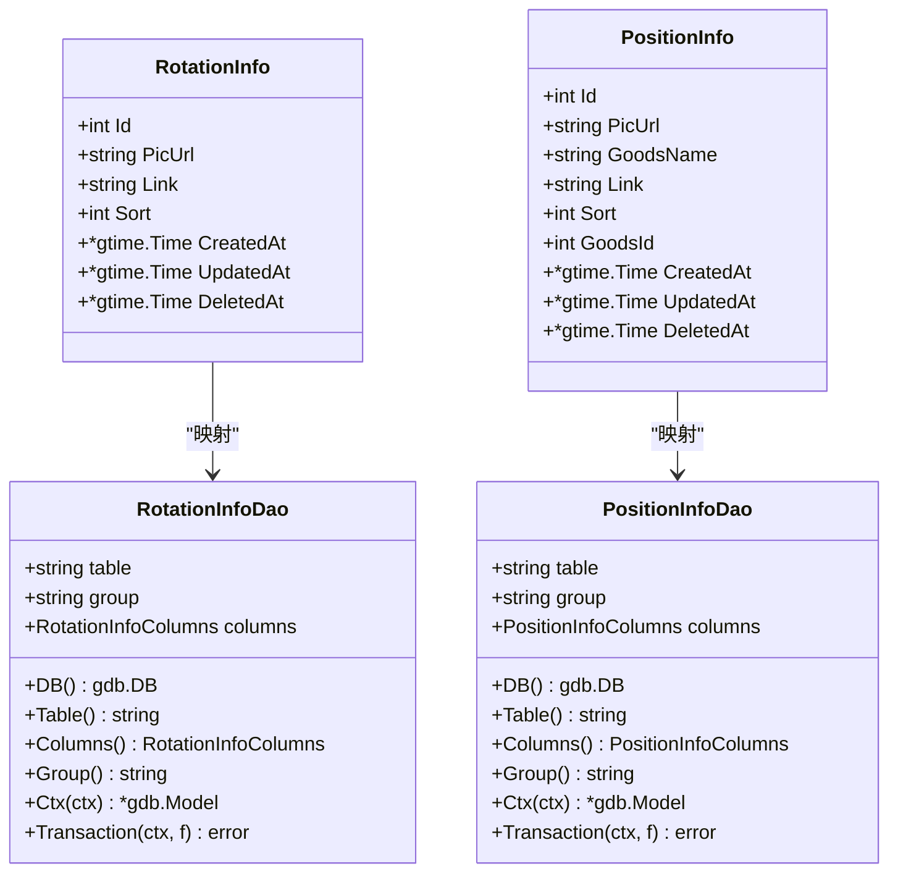
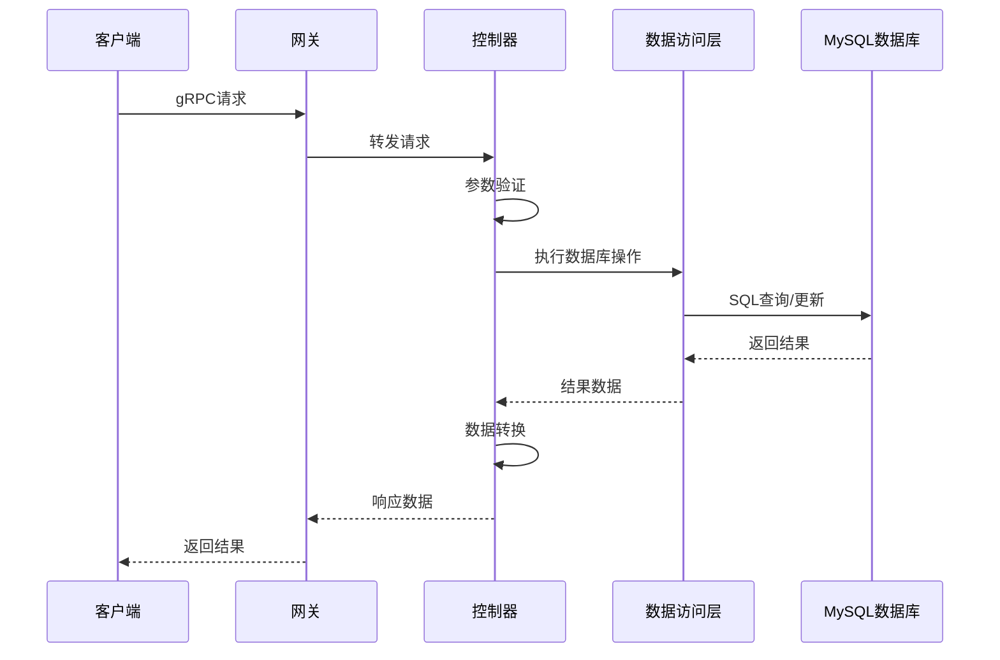
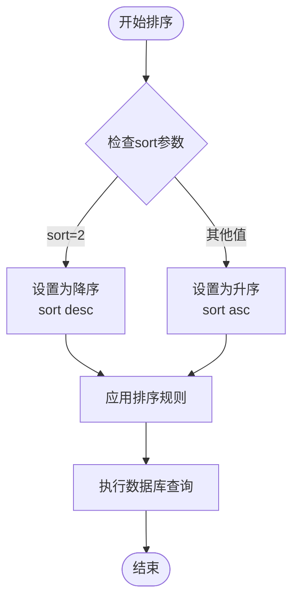
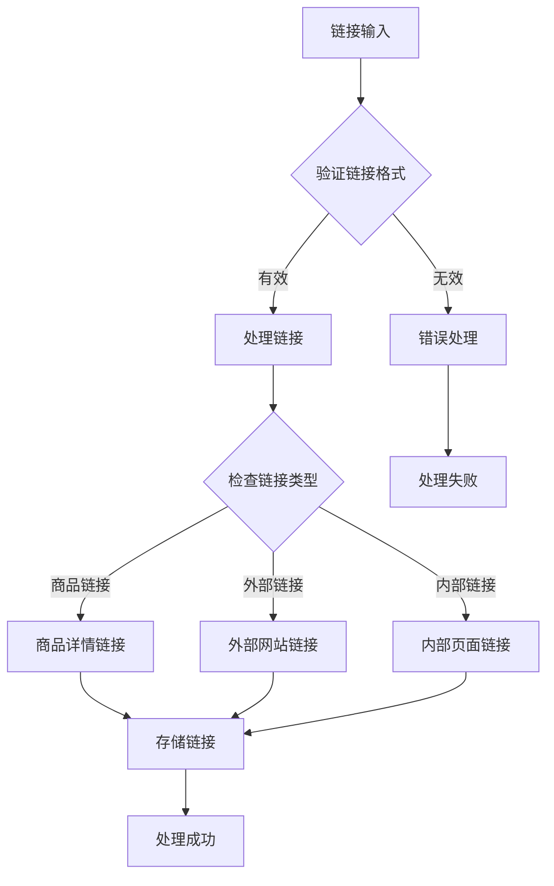
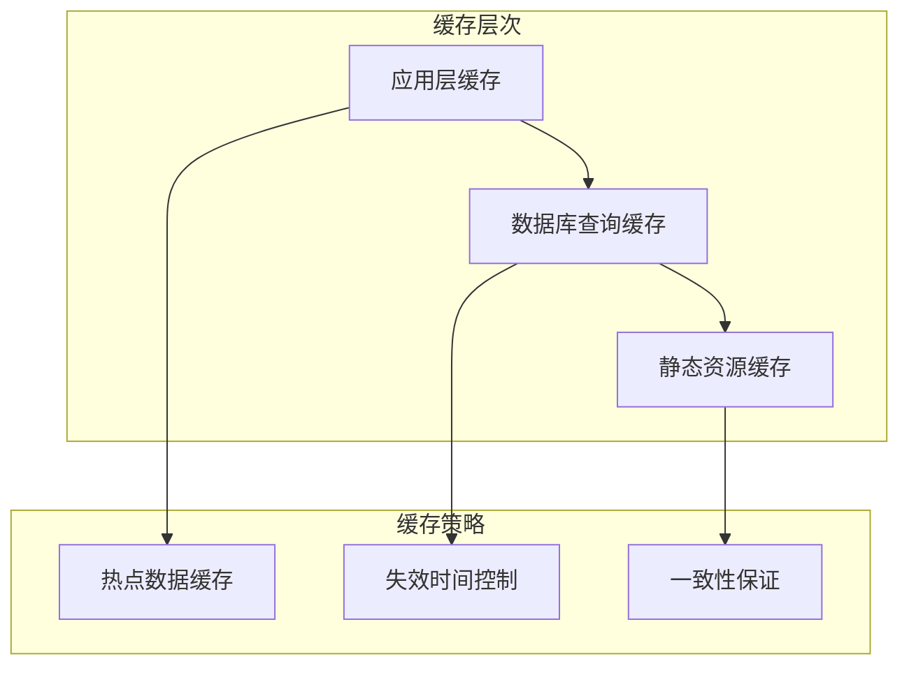
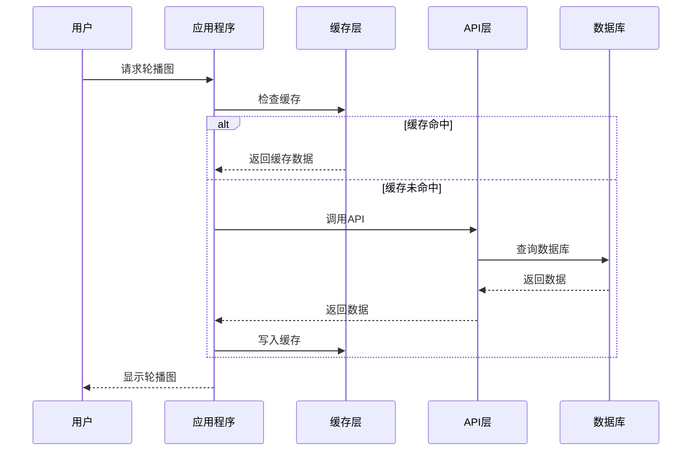
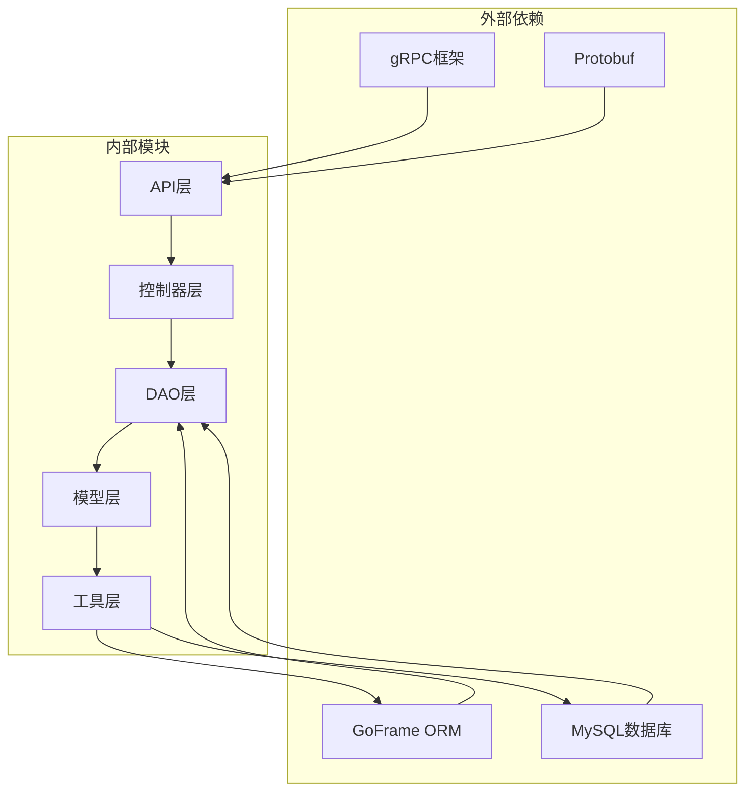
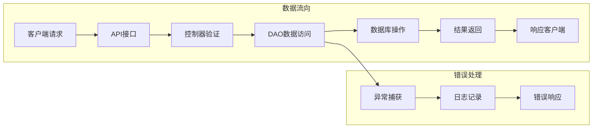
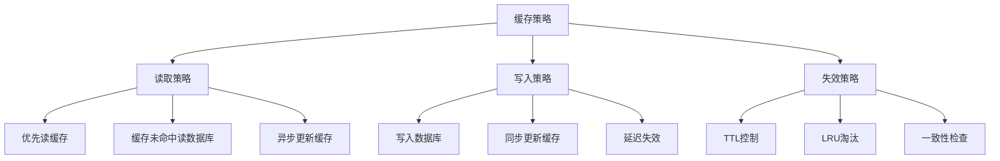

# 轮播图数据库设计

<cite>
**本文档引用的文件**
- [banner.sql](file://app/banner/hack/banner.sql)
- [rotation_info.go](file://app/banner/internal/model/entity/rotation_info.go)
- [position_info.go](file://app/banner/internal/model/entity/position_info.go)
- [rotation_info.go](file://app/banner/internal/controller/rotation_info/rotation_info.go)
- [position_info.go](file://app/banner/internal/controller/position_info/position_info.go)
- [rotation_info.go](file://app/banner/internal/dao/internal/rotation_info.go)
- [position_info.go](file://app/banner/internal/dao/internal/position_info.go)
- [rotation_info.go](file://app/banner/internal/dao/rotation_info.go)
- [position_info.go](file://app/banner/internal/dao/position_info.go)
- [time.go](file://utility/time.go)
- [consts.go](file://utility/consts/consts.go)
- [rotation_info.pb.go](file://app/banner/api/rotation_info/v1/rotation_info.pb.go)
- [position_info.pb.go](file://app/banner/api/position_info/v1/position_info.pb.go)
</cite>

## 目录
1. [简介](#简介)
2. [项目结构](#项目结构)
3. [核心组件](#核心组件)
4. [架构概览](#架构概览)
5. [详细组件分析](#详细组件分析)
6. [依赖关系分析](#依赖关系分析)
7. [性能考虑](#性能考虑)
8. [故障排除指南](#故障排除指南)
9. [结论](#结论)

## 简介

本文档详细阐述了轮播图系统的数据库设计，重点分析了两个核心表结构：rotation_info轮播图表和position_info轮播位表。该系统采用GoFrame微服务架构，通过gRPC接口提供轮播图的配置管理、位置管理和展示逻辑。

系统设计遵循以下核心理念：
- **模块化设计**：通过独立的服务模块实现轮播图功能
- **数据驱动**：基于数据库的配置化管理
- **性能优化**：内置排序机制和缓存策略
- **扩展性**：支持商品关联和动态内容管理

## 项目结构

轮播图系统在整体项目中的组织结构如下：

**图表来源**
- [rotation_info.go](file://app/banner/internal/controller/rotation_info/rotation_info.go#L1-L122)
- [position_info.go](file://app/banner/internal/controller/position_info/position_info.go#L1-L123)

**章节来源**
- [rotation_info.go](file://app/banner/internal/controller/rotation_info/rotation_info.go#L1-L122)
- [position_info.go](file://app/banner/internal/controller/position_info/position_info.go#L1-L123)

## 核心组件

### 数据库表结构

#### rotation_info轮播图表
该表用于存储轮播图的基本信息，支持图片展示和跳转链接功能。

| 字段名 | 类型 | 约束 | 描述 |
|--------|------|------|------|
| id | int | 主键, 自增 | 轮播图唯一标识 |
| pic_url | varchar(200) | NOT NULL | 轮播图片URL地址 |
| link | varchar(200) | NOT NULL | 跳转链接地址 |
| sort | tinyint(1) | NOT NULL | 排序字段，默认0 |
| created_at | datetime | NULL | 创建时间 |
| updated_at | datetime | NULL | 更新时间 |
| deleted_at | datetime | NULL | 删除时间 |

#### position_info轮播位表
该表用于存储轮播位的具体信息，支持商品关联功能。

| 字段名 | 类型 | 约束 | 描述 |
|--------|------|------|------|
| id | int | 主键, 自增 | 轮播位唯一标识 |
| pic_url | varchar(255) | NOT NULL | 图片链接地址 |
| goods_name | varchar(100) | NOT NULL | 商品名称 |
| link | varchar(200) | NOT NULL | 跳转链接地址 |
| sort | tinyint(1) | NOT NULL | 排序字段，默认0 |
| goods_id | int | NOT NULL | 关联商品ID，默认0 |
| created_at | datetime | NULL | 创建时间 |
| updated_at | datetime | NULL | 更新时间 |
| deleted_at | datetime | NULL | 删除时间 |

**章节来源**
- [banner.sql](file://app/banner/hack/banner.sql#L6-L16)
- [banner.sql](file://app/banner/hack/banner.sql#L26-L38)

### 实体模型映射

系统通过GoFrame ORM框架实现数据库表与Go结构体的映射：

**图表来源**
- [rotation_info.go](file://app/banner/internal/model/entity/rotation_info.go#L11-L20)
- [position_info.go](file://app/banner/internal/model/entity/position_info.go#L11-L22)
- [rotation_info.go](file://app/banner/internal/dao/internal/rotation_info.go#L14-L92)
- [position_info.go](file://app/banner/internal/dao/internal/position_info.go#L14-L96)

**章节来源**
- [rotation_info.go](file://app/banner/internal/model/entity/rotation_info.go#L11-L20)
- [position_info.go](file://app/banner/internal/model/entity/position_info.go#L11-L22)

## 架构概览

轮播图系统采用分层架构设计，实现了清晰的职责分离：

**图表来源**
- [rotation_info.go](file://app/banner/internal/controller/rotation_info/rotation_info.go#L27-L78)
- [position_info.go](file://app/banner/internal/controller/position_info/position_info.go#L27-L79)

### API接口设计

系统提供完整的CRUD操作接口，支持分页查询和排序功能：

| 接口名称 | HTTP方法 | 描述 | 请求参数 | 响应数据 |
|----------|----------|------|----------|----------|
| GetList | GET | 获取列表 | page, size, sort | 分页结果 |
| Create | POST | 创建记录 | pic_url, link, sort | 新建ID |
| Update | PUT | 更新记录 | id, pic_url, link, sort | 更新ID |
| Delete | DELETE | 删除记录 | id | 空响应 |

**章节来源**
- [rotation_info.go](file://app/banner/internal/controller/rotation_info/rotation_info.go#L27-L121)
- [position_info.go](file://app/banner/internal/controller/position_info/position_info.go#L27-L122)

## 详细组件分析

### 排序机制实现

系统实现了灵活的排序机制，支持升序和降序两种模式：

**图表来源**
- [time.go](file://utility/time.go#L32-L38)

排序规则说明：
- **默认升序**：sort值越小越靠前
- **降序排列**：sort值越大越靠前
- **分页支持**：结合Page()方法实现分页显示

**章节来源**
- [time.go](file://utility/time.go#L32-L38)
- [rotation_info.go](file://app/banner/internal/controller/rotation_info/rotation_info.go#L48-L51)
- [position_info.go](file://app/banner/internal/controller/position_info/position_info.go#L48-L52)

### 跳转链接处理

系统提供了完整的跳转链接处理机制，支持多种链接类型：

**图表来源**
- [rotation_info.go](file://app/banner/internal/model/entity/rotation_info.go#L14-L16)
- [position_info.go](file://app/banner/internal/model/entity/position_info.go#L14-L17)

### 商品关联功能

position_info表支持与商品系统的深度集成：

| 关联字段 | 作用 | 约束 |
|----------|------|------|
| goods_id | 商品关联ID | NOT NULL, DEFAULT 0 |
| goods_name | 商品名称 | NOT NULL, DEFAULT '' |
| link | 商品跳转链接 | NOT NULL, DEFAULT '' |

这种设计允许轮播位直接关联具体商品，实现精准的商品推广。

**章节来源**
- [position_info.go](file://app/banner/internal/model/entity/position_info.go#L17-L18)
- [banner.sql](file://app/banner/hack/banner.sql#L32-L33)

### 缓存策略设计

系统具备完善的缓存策略，支持多级缓存机制：

缓存优化要点：
- **热点轮播图缓存**：热门轮播图数据缓存
- **配置缓存**：轮播图配置信息缓存
- **图片缓存**：静态图片资源缓存
- **失效策略**：基于时间戳的自动失效

### 预加载机制

系统实现了智能的预加载机制，提升用户体验：

**图表来源**
- [rotation_info.go](file://app/banner/internal/controller/rotation_info/rotation_info.go#L48-L51)
- [position_info.go](file://app/banner/internal/controller/position_info/position_info.go#L48-L52)

### 性能优化方案

#### 数据库优化
- **索引设计**：为sort字段建立索引，优化排序查询
- **分页查询**：使用LIMIT和OFFSET实现高效分页
- **批量操作**：支持批量插入和更新操作

#### 应用层优化
- **连接池管理**：合理配置数据库连接池
- **并发控制**：限制同时进行的数据库操作数量
- **内存管理**：优化数据结构，减少内存占用

#### 缓存优化
- **LRU缓存**：使用最近最少使用算法管理缓存
- **预热机制**：启动时预加载热门数据
- **失效策略**：设置合理的缓存过期时间

**章节来源**
- [rotation_info.go](file://app/banner/internal/dao/internal/rotation_info.go#L74-L81)
- [position_info.go](file://app/banner/internal/dao/internal/position_info.go#L78-L85)

## 依赖关系分析

### 组件依赖图

**图表来源**
- [rotation_info.go](file://app/banner/internal/controller/rotation_info/rotation_info.go#L3-L17)
- [position_info.go](file://app/banner/internal/controller/position_info/position_info.go#L3-L17)

### 数据流分析

系统采用标准的MVC架构模式，数据流向清晰明确：

**图表来源**
- [rotation_info.go](file://app/banner/internal/controller/rotation_info/rotation_info.go#L27-L78)
- [position_info.go](file://app/banner/internal/controller/position_info/position_info.go#L27-L79)

**章节来源**
- [consts.go](file://utility/consts/consts.go#L44-L47)

## 性能考虑

### 查询性能优化

系统在查询层面采用了多项优化措施：

1. **索引优化**：为常用查询字段建立适当索引
2. **查询限制**：限制单次查询的数据量
3. **连接复用**：复用数据库连接，减少连接开销

### 缓存策略

### 并发处理

系统支持高并发场景下的稳定运行：

- **连接池管理**：合理配置最大连接数
- **事务处理**：确保数据一致性
- **错误恢复**：自动处理连接异常

## 故障排除指南

### 常见问题及解决方案

#### 数据库连接问题
**症状**：查询操作报连接错误
**解决方案**：
1. 检查数据库连接配置
2. 验证网络连通性
3. 查看连接池状态

#### 排序功能异常
**症状**：轮播图排序不符合预期
**解决方案**：
1. 验证sort字段值
2. 检查排序参数传递
3. 确认数据库索引状态

#### 缓存失效问题
**症状**：更新后数据未及时刷新
**解决方案**：
1. 检查缓存配置
2. 验证失效策略
3. 清理相关缓存键

**章节来源**
- [consts.go](file://utility/consts/consts.go#L4-L42)

### 错误码定义

系统定义了统一的错误处理机制：

| 错误类型 | 错误码 | 描述 |
|----------|--------|------|
| GetListFail | 查询失败 | 列表查询异常 |
| CreateFail | 插入失败 | 数据创建异常 |
| UpdateFail | 更新失败 | 数据更新异常 |
| DeleteFail | 删除失败 | 数据删除异常 |

**章节来源**
- [consts.go](file://utility/consts/consts.go#L44-L47)

## 结论

轮播图数据库设计展现了现代微服务架构的最佳实践：

### 设计优势
1. **模块化架构**：清晰的分层设计便于维护和扩展
2. **数据驱动**：配置化的管理模式提升了灵活性
3. **性能优化**：多级缓存和索引优化确保了系统性能
4. **错误处理**：完善的错误处理机制保证了系统稳定性

### 技术特色
- **gRPC接口**：提供高性能的跨语言通信能力
- **ORM映射**：简化数据库操作，提升开发效率
- **缓存策略**：智能的缓存管理提升用户体验
- **排序机制**：灵活的排序功能满足多样化需求

### 扩展建议
1. **A/B测试支持**：可考虑增加实验分组功能
2. **动态内容管理**：支持更丰富的动态内容类型
3. **监控告警**：完善系统监控和告警机制
4. **性能分析**：增加详细的性能指标收集

该设计为后续的功能扩展和性能优化奠定了坚实的基础，能够有效支撑业务的持续发展。