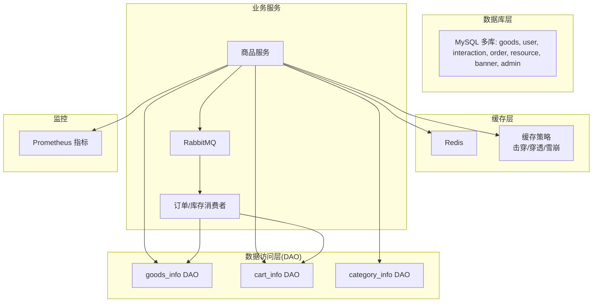
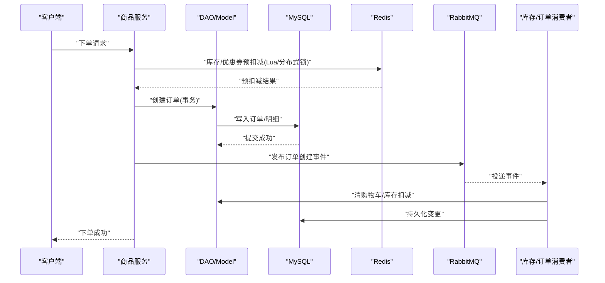
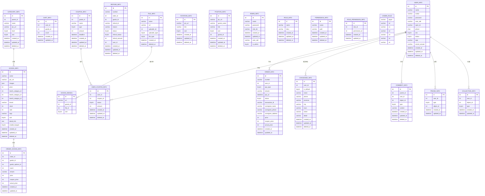
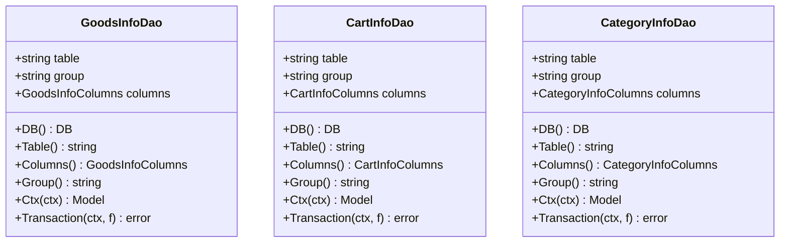
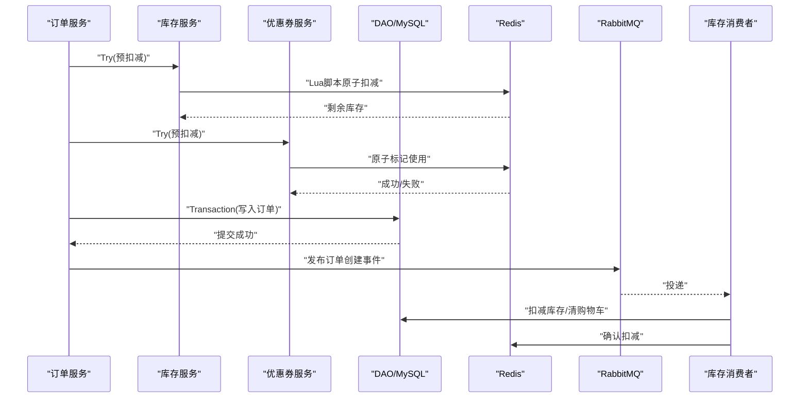
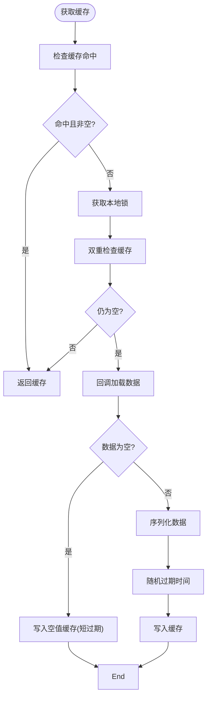
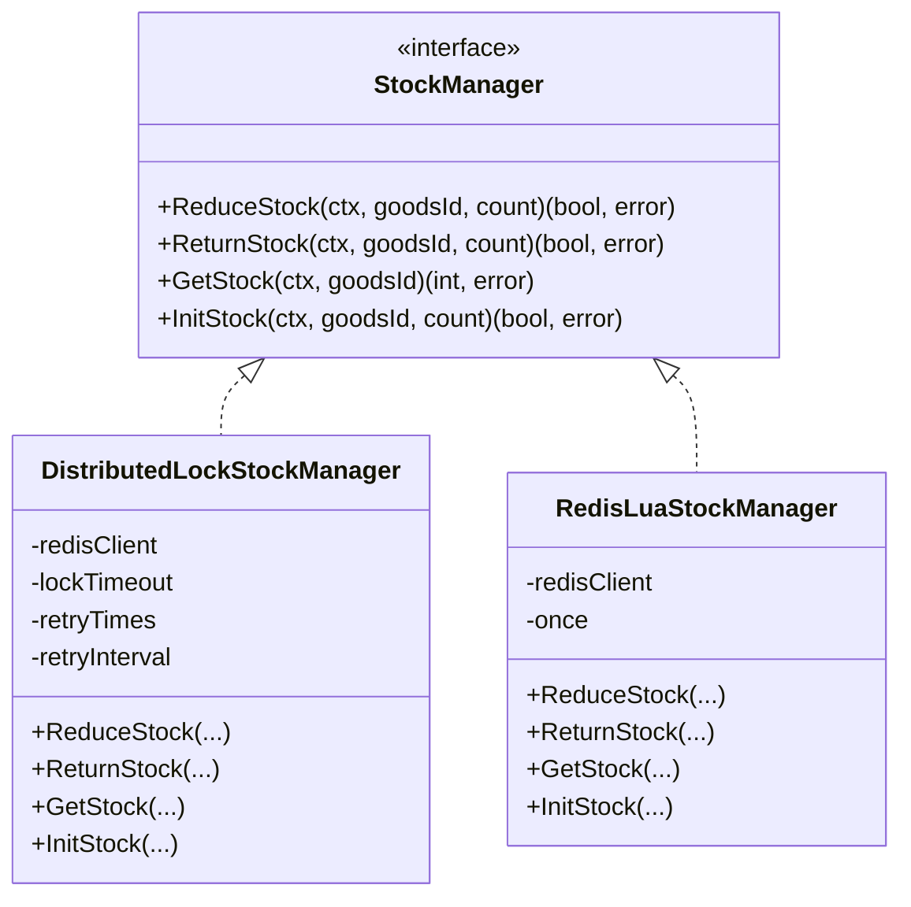
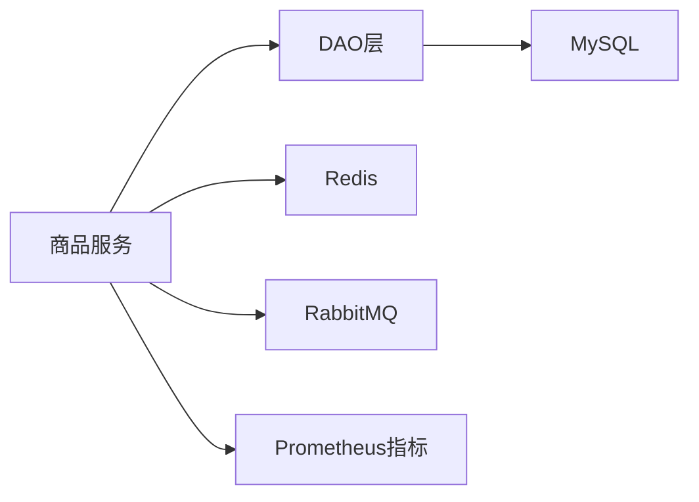

# 数据管理与存储

<cite>
**本文引用的文件**
- [init-db/01_init.sql](file://init-db/01_init.sql)
- [init-db/goods_info.sql](file://init-db/goods_info.sql)
- [app/admin/hack/admin.sql](file://app/admin/hack/admin.sql)
- [app/goods/internal/dao/internal/goods_info.go](file://app/goods/internal/dao/internal/goods_info.go)
- [app/goods/internal/dao/internal/cart_info.go](file://app/goods/internal/dao/internal/cart_info.go)
- [app/goods/internal/dao/internal/category_info.go](file://app/goods/internal/dao/internal/category_info.go)
- [app/goods/utility/stock/stock.go](file://app/goods/utility/stock/stock.go)
- [app/goods/utility/stock/distributed_lock.go](file://app/goods/utility/stock/distributed_lock.go)
- [app/goods/utility/stock/redis_lua.go](file://app/goods/utility/stock/redis_lua.go)
- [app/goods/utility/consumer/order_created_consumer.go](file://app/goods/utility/consumer/order_created_consumer.go)
- [app/goods/utility/consumer/DEMO_WECHAT_OPEN_ID.go](file://app/goods/utility/consumer/DEMO_WECHAT_OPEN_ID.go)
- [app/goods/utility/goodsRedis/redis.go](file://app/goods/utility/goodsRedis/redis.go)
- [app/goods/utility/goodsRedis/cache_strategy.go](file://app/goods/utility/goodsRedis/cache_strategy.go)
- [utility/metrics/business.go](file://utility/metrics/business.go)
- [doc/Redis缓存策略-穿透-击穿-雪崩全解决方案.md](file://doc/Redis缓存策略-穿透-击穿-雪崩全解决方案.md)
- [doc/数据库和缓存一致性问题&做到下单成功即代表可成功付款的体验.md](file://doc/数据库和缓存一致性问题&做到下单成功即代表可成功付款的体验.md)
</cite>

## 目录
1. [简介](#简介)
2. [项目结构](#项目结构)
3. [核心组件](#核心组件)
4. [架构总览](#架构总览)
5. [详细组件分析](#详细组件分析)
6. [依赖分析](#依赖分析)
7. [性能考量](#性能考量)
8. [故障排查指南](#故障排查指南)
9. [结论](#结论)
10. [附录](#附录)

## 简介
本文件聚焦于本项目的“数据管理与存储”，系统性阐述数据库设计原则、表结构与关系模型、MySQL初始化脚本与索引约束策略；深入解析数据访问层（DAO）设计与实现；总结事务处理、数据一致性保障、缓存策略（穿透/击穿/雪崩）、Redis使用场景与缓存-数据库同步机制；并给出数据迁移策略、备份恢复、性能优化与监控方案，帮助读者在微服务架构下构建高性能、高可靠的数据层。

## 项目结构
围绕数据管理与存储，项目在以下层次组织：
- 数据库初始化与表结构：init-db 目录提供多库初始化SQL，涵盖商品、用户、互动、订单、资源、轮播与管理后台等模块。
- 数据访问层（DAO）：app/*/internal/dao/internal 下按表生成的DAO封装，统一提供模型构造、事务包装与上下文传递。
- 缓存与库存：app/goods/utility/goodsRedis 与 app/goods/utility/stock 提供Redis初始化、缓存策略与库存管理（分布式锁、Redis Lua）。
- 消息与事件：app/goods/utility/consumer 下的订单创建与库存返还消费者，基于RabbitMQ实现异步解耦。
- 指标与监控：utility/metrics 提供Prometheus业务指标埋点，doc目录提供缓存与一致性专题文档。

**图表来源**
- [init-db/01_init.sql](file://init-db/01_init.sql#L1-L800)
- [app/goods/internal/dao/internal/goods_info.go](file://app/goods/internal/dao/internal/goods_info.go#L1-L116)
- [app/goods/internal/dao/internal/cart_info.go](file://app/goods/internal/dao/internal/cart_info.go#L1-L90)
- [app/goods/internal/dao/internal/category_info.go](file://app/goods/internal/dao/internal/category_info.go#L1-L96)
- [app/goods/utility/goodsRedis/redis.go](file://app/goods/utility/goodsRedis/redis.go#L1-L49)
- [app/goods/utility/goodsRedis/cache_strategy.go](file://app/goods/utility/goodsRedis/cache_strategy.go#L1-L96)
- [app/goods/utility/consumer/order_created_consumer.go](file://app/goods/utility/consumer/order_created_consumer.go#L1-L65)
- [app/goods/utility/consumer/DEMO_WECHAT_OPEN_ID.go](file://app/goods/utility/consumer/DEMO_WECHAT_OPEN_ID.go#L1-L58)
- [utility/metrics/business.go](file://utility/metrics/business.go#L1-L70)

**章节来源**
- [init-db/01_init.sql](file://init-db/01_init.sql#L1-L800)
- [app/goods/internal/dao/internal/goods_info.go](file://app/goods/internal/dao/internal/goods_info.go#L1-L116)
- [app/goods/internal/dao/internal/cart_info.go](file://app/goods/internal/dao/internal/cart_info.go#L1-L90)
- [app/goods/internal/dao/internal/category_info.go](file://app/goods/internal/dao/internal/category_info.go#L1-L96)
- [app/goods/utility/goodsRedis/redis.go](file://app/goods/utility/goodsRedis/redis.go#L1-L49)
- [app/goods/utility/goodsRedis/cache_strategy.go](file://app/goods/utility/goodsRedis/cache_strategy.go#L1-L96)
- [app/goods/utility/consumer/order_created_consumer.go](file://app/goods/utility/consumer/order_created_consumer.go#L1-L65)
- [app/goods/utility/consumer/DEMO_WECHAT_OPEN_ID.go](file://app/goods/utility/consumer/DEMO_WECHAT_OPEN_ID.go#L1-L58)
- [utility/metrics/business.go](file://utility/metrics/business.go#L1-L70)

## 核心组件
- 数据库与初始化
  - 多库初始化：goods、user、interaction、order、resource、banner、admin，分别包含对应业务表及索引/约束。
  - 关键表：goods_info、cart_info、category_info、coupon_info、user_coupon_info、order_info、order_goods_info、refund_info、file_info、rotation_info、position_info、admin_info、role_info、permission_info、role_permission_info、casbin_rule等。
- 数据访问层（DAO）
  - 自动生成的DAO封装，提供表名、列名、模型构造、事务包装、上下文传递，统一事务语义。
- 缓存与库存
  - Redis初始化与适配器注入；缓存策略（空值缓存、本地锁、随机过期）；库存管理接口与两种实现：分布式锁与Redis Lua脚本。
- 消息与事件
  - 订单创建事件消费者：清购物车、库存预扣减；库存返还事件消费者：库存返还与幂等处理。
- 监控与指标
  - Prometheus业务指标：订单创建计数/成功率、库存指标，便于观测与告警。

**章节来源**
- [init-db/01_init.sql](file://init-db/01_init.sql#L1-L800)
- [app/goods/internal/dao/internal/goods_info.go](file://app/goods/internal/dao/internal/goods_info.go#L1-L116)
- [app/goods/utility/goodsRedis/redis.go](file://app/goods/utility/goodsRedis/redis.go#L1-L49)
- [app/goods/utility/goodsRedis/cache_strategy.go](file://app/goods/utility/goodsRedis/cache_strategy.go#L1-L96)
- [app/goods/utility/stock/stock.go](file://app/goods/utility/stock/stock.go#L1-L32)
- [app/goods/utility/stock/distributed_lock.go](file://app/goods/utility/stock/distributed_lock.go#L1-L266)
- [app/goods/utility/stock/redis_lua.go](file://app/goods/utility/stock/redis_lua.go#L1-L166)
- [app/goods/utility/consumer/order_created_consumer.go](file://app/goods/utility/consumer/order_created_consumer.go#L1-L65)
- [app/goods/utility/consumer/DEMO_WECHAT_OPEN_ID.go](file://app/goods/utility/consumer/DEMO_WECHAT_OPEN_ID.go#L1-L58)
- [utility/metrics/business.go](file://utility/metrics/business.go#L1-L70)

## 架构总览
下图展示数据层在微服务中的交互：业务服务通过DAO访问MySQL，使用Redis缓存与库存预扣减；通过RabbitMQ异步事件解耦订单与库存/优惠券；Prometheus采集业务指标。

**图表来源**
- [app/goods/utility/consumer/order_created_consumer.go](file://app/goods/utility/consumer/order_created_consumer.go#L32-L64)
- [app/goods/utility/consumer/DEMO_WECHAT_OPEN_ID.go](file://app/goods/utility/consumer/DEMO_WECHAT_OPEN_ID.go#L31-L57)
- [app/goods/internal/dao/internal/goods_info.go](file://app/goods/internal/dao/internal/goods_info.go#L107-L116)
- [app/goods/utility/stock/redis_lua.go](file://app/goods/utility/stock/redis_lua.go#L75-L102)
- [app/goods/utility/stock/distributed_lock.go](file://app/goods/utility/stock/distributed_lock.go#L91-L159)

## 详细组件分析

### 数据库设计与表结构
- 设计原则
  - 字符集：统一utf8mb4，支持emoji与多语言。
  - 引擎：InnoDB，支持事务与外键（部分表启用外键检查开关）。
  - 时间戳：统一使用datetime，支持created_at/updated_at/soft delete字段。
  - JSON字段：goods_info.images使用JSON类型存储多图。
- 关系模型
  - 商品与分类：goods_info.level1/2/3_category_id三级分类。
  - 订单与商品：order_info与order_goods_info一对多。
  - 用户与优惠券：user_info与user_coupon_info、coupon_info多对多。
  - 文件与资源：file_info统一文件存储。
  - 轮播与位置：banner库的rotation_info与position_info。
  - 管理后台：admin库的admin_info、role_info、permission_info、role_permission_info、casbin_rule支撑RBAC。
- 关键索引与约束
  - goods_info：主键id；goods_images.idx_goods；coupon_info.idx_goods_id、idx_deadline；user_coupon_info.idx_user_id、idx_coupon_id、idx_status、uk_user_coupon；category_info主键；cart_info主键；order_goods_info主键；order_info主键；refund_info主键；file_info主键；rotation_info/position_info主键；admin库多表唯一索引与主键。
- 初始化脚本
  - init-db/01_init.sql：多库创建与表结构定义、索引与约束、示例数据。
  - init-db/goods_info.sql：goods库goods_info表结构与示例数据。
  - app/admin/hack/admin.sql：admin库admin_info、role_info、permission_info、role_permission_info、casbin_rule表结构与示例数据。

**图表来源**
- [init-db/01_init.sql](file://init-db/01_init.sql#L17-L262)
- [init-db/01_init.sql](file://init-db/01_init.sql#L240-L371)
- [init-db/01_init.sql](file://init-db/01_init.sql#L375-L480)
- [init-db/01_init.sql](file://init-db/01_init.sql#L483-L544)
- [init-db/01_init.sql](file://init-db/01_init.sql#L549-L723)
- [init-db/goods_info.sql](file://init-db/goods_info.sql#L23-L51)
- [app/admin/hack/admin.sql](file://app/admin/hack/admin.sql#L4-L83)

**章节来源**
- [init-db/01_init.sql](file://init-db/01_init.sql#L1-L800)
- [init-db/goods_info.sql](file://init-db/goods_info.sql#L1-L54)
- [app/admin/hack/admin.sql](file://app/admin/hack/admin.sql#L1-L83)

### 数据访问层（DAO）设计与实现
- 设计要点
  - 代码生成：DAO类与列名常量由工具生成，保证强类型与列名一致性。
  - 上下文与事务：Ctx(ctx)返回带上下文的安全模型；Transaction(ctx, f)自动开启/提交/回滚事务，避免在f中手动控制。
  - 组织结构：按表生成internal/*_info.go，统一暴露DB/Model/Table/Columns/Group/Transaction。
- 使用建议
  - 在业务逻辑层通过DAO进行CRUD，必要时使用Transaction包裹多表写入。
  - 通过Model处理器（handlers）实现通用过滤（如软删除）。

**图表来源**
- [app/goods/internal/dao/internal/goods_info.go](file://app/goods/internal/dao/internal/goods_info.go#L14-L116)
- [app/goods/internal/dao/internal/cart_info.go](file://app/goods/internal/dao/internal/cart_info.go#L14-L90)
- [app/goods/internal/dao/internal/category_info.go](file://app/goods/internal/dao/internal/category_info.go#L14-L96)

**章节来源**
- [app/goods/internal/dao/internal/goods_info.go](file://app/goods/internal/dao/internal/goods_info.go#L1-L116)
- [app/goods/internal/dao/internal/cart_info.go](file://app/goods/internal/dao/internal/cart_info.go#L1-L90)
- [app/goods/internal/dao/internal/category_info.go](file://app/goods/internal/dao/internal/category_info.go#L1-L96)

### 事务处理与一致性保障
- 事务封装
  - DAO层提供Transaction(ctx, f)自动事务控制，避免在业务函数中重复处理提交/回滚。
- 一致性策略
  - 订单创建：先预扣减库存/优惠券（Redis原子操作），再写入MySQL订单；失败时回滚预扣减。
  - 消费者幂等：订单创建消费者清购物车并扣减库存，失败时可重试；库存返还消费者对失败商品进行重试。
  - 指标埋点：Prometheus记录订单创建计数与成功率，辅助观测一致性与性能。

**图表来源**
- [app/goods/utility/consumer/order_created_consumer.go](file://app/goods/utility/consumer/order_created_consumer.go#L32-L64)
- [app/goods/utility/consumer/DEMO_WECHAT_OPEN_ID.go](file://app/goods/utility/consumer/DEMO_WECHAT_OPEN_ID.go#L31-L57)
- [app/goods/utility/stock/redis_lua.go](file://app/goods/utility/stock/redis_lua.go#L75-L102)
- [app/goods/utility/stock/distributed_lock.go](file://app/goods/utility/stock/distributed_lock.go#L91-L159)
- [utility/metrics/business.go](file://utility/metrics/business.go#L41-L58)

**章节来源**
- [app/goods/internal/dao/internal/goods_info.go](file://app/goods/internal/dao/internal/goods_info.go#L107-L116)
- [app/goods/utility/consumer/order_created_consumer.go](file://app/goods/utility/consumer/order_created_consumer.go#L1-L65)
- [app/goods/utility/consumer/DEMO_WECHAT_OPEN_ID.go](file://app/goods/utility/consumer/DEMO_WECHAT_OPEN_ID.go#L1-L58)
- [app/goods/utility/stock/redis_lua.go](file://app/goods/utility/stock/redis_lua.go#L1-L166)
- [app/goods/utility/stock/distributed_lock.go](file://app/goods/utility/stock/distributed_lock.go#L1-L266)
- [utility/metrics/business.go](file://utility/metrics/business.go#L1-L70)

### 缓存策略与Redis使用
- Redis初始化
  - 从配置读取连接参数，创建gredis实例并注入gcache适配器，PING测试连通性。
- 缓存策略
  - 空值缓存：缓存不存在数据时写入特殊空值并设置短过期，防止穿透。
  - 本地锁：双重检查+本地互斥锁，避免缓存击穿。
  - 随机过期：为缓存项添加5%-15%抖动，避免雪崩。
- 使用场景
  - 商品详情、分类信息等读多写少数据；库存预扣减（Redis Lua）；订单创建后清购物车与扣减库存。

**图表来源**
- [app/goods/utility/goodsRedis/cache_strategy.go](file://app/goods/utility/goodsRedis/cache_strategy.go#L32-L78)
- [app/goods/utility/goodsRedis/redis.go](file://app/goods/utility/goodsRedis/redis.go#L13-L43)

**章节来源**
- [app/goods/utility/goodsRedis/redis.go](file://app/goods/utility/goodsRedis/redis.go#L1-L49)
- [app/goods/utility/goodsRedis/cache_strategy.go](file://app/goods/utility/goodsRedis/cache_strategy.go#L1-L96)
- [doc/Redis缓存策略-穿透-击穿-雪崩全解决方案.md](file://doc/Redis缓存策略-穿透-击穿-雪崩全解决方案.md#L1-L587)

### 库存管理与防超卖
- 接口抽象
  - StockManager定义扣减、返还、查询、初始化库存。
- 两种实现
  - 分布式锁：基于Redis SET NX EX，Lua脚本安全释放，适合通用场景。
  - Redis Lua：原子脚本一次性判断与扣减，避免竞态，适合高并发防超卖。
- 事件驱动
  - 订单创建消费者触发库存扣减；库存返还消费者处理退款/取消后的库存返还。

**图表来源**
- [app/goods/utility/stock/stock.go](file://app/goods/utility/stock/stock.go#L7-L31)
- [app/goods/utility/stock/distributed_lock.go](file://app/goods/utility/stock/distributed_lock.go#L13-L29)
- [app/goods/utility/stock/redis_lua.go](file://app/goods/utility/stock/redis_lua.go#L12-L23)

**章节来源**
- [app/goods/utility/stock/stock.go](file://app/goods/utility/stock/stock.go#L1-L32)
- [app/goods/utility/stock/distributed_lock.go](file://app/goods/utility/stock/distributed_lock.go#L1-L266)
- [app/goods/utility/stock/redis_lua.go](file://app/goods/utility/stock/redis_lua.go#L1-L166)
- [app/goods/utility/consumer/order_created_consumer.go](file://app/goods/utility/consumer/order_created_consumer.go#L32-L64)
- [app/goods/utility/consumer/DEMO_WECHAT_OPEN_ID.go](file://app/goods/utility/consumer/DEMO_WECHAT_OPEN_ID.go#L31-L57)

### 数据迁移策略
- 版本化迁移
  - init-db/01_init.sql提供多库初始化与表结构，goods_info.sql提供goods库示例表结构与数据。
  - admin.sql提供管理后台表结构与示例数据。
- 迁移步骤建议
  - 先执行多库初始化脚本，再导入各业务库示例数据。
  - 对生产库采用灰度迁移，先在影子库验证，再切换流量。
- 索引与约束
  - 新增索引前评估查询模式与写入成本；软删除字段统一命名与查询过滤。

**章节来源**
- [init-db/01_init.sql](file://init-db/01_init.sql#L1-L800)
- [init-db/goods_info.sql](file://init-db/goods_info.sql#L1-L54)
- [app/admin/hack/admin.sql](file://app/admin/hack/admin.sql#L1-L83)

### 备份恢复与监控
- 备份恢复
  - MySQL：mysqldump导出多库结构与数据；恢复时注意字符集与外键检查开关。
  - Redis：BGREWRITEAOF/BGSV持久化策略；RDB快照定期备份。
- 监控方案
  - Prometheus指标：订单创建计数/成功率、库存指标；结合Grafana仪表盘与告警规则。
  - 业务可观测：日志聚合、链路追踪、慢查询分析。

**章节来源**
- [utility/metrics/business.go](file://utility/metrics/business.go#L1-L70)
- [doc/Redis缓存策略-穿透-击穿-雪崩全解决方案.md](file://doc/Redis缓存策略-穿透-击穿-雪崩全解决方案.md#L1-L587)

## 依赖分析
- 组件耦合
  - 商品服务依赖DAO层访问MySQL，依赖Redis进行缓存与库存预扣减，依赖RabbitMQ进行事件解耦。
  - DAO层与MySQL耦合，通过gdb.Model与事务封装降低业务层对底层细节的关注。
- 外部依赖
  - MySQL：InnoDB引擎、utf8mb4字符集、索引与约束。
  - Redis：gcache适配器、Lua脚本原子操作、本地锁。
  - RabbitMQ：Topic交换机、队列与路由键。
  - Prometheus/Grafana：指标采集与可视化。

**图表来源**
- [app/goods/internal/dao/internal/goods_info.go](file://app/goods/internal/dao/internal/goods_info.go#L78-L116)
- [app/goods/utility/goodsRedis/redis.go](file://app/goods/utility/goodsRedis/redis.go#L13-L43)
- [app/goods/utility/consumer/order_created_consumer.go](file://app/goods/utility/consumer/order_created_consumer.go#L18-L30)
- [utility/metrics/business.go](file://utility/metrics/business.go#L10-L37)

**章节来源**
- [app/goods/internal/dao/internal/goods_info.go](file://app/goods/internal/dao/internal/goods_info.go#L1-L116)
- [app/goods/utility/goodsRedis/redis.go](file://app/goods/utility/goodsRedis/redis.go#L1-L49)
- [app/goods/utility/consumer/order_created_consumer.go](file://app/goods/utility/consumer/order_created_consumer.go#L1-L65)
- [utility/metrics/business.go](file://utility/metrics/business.go#L1-L70)

## 性能考量
- 查询优化
  - 为高频查询字段建立合适索引（如coupon_info.idx_goods_id、user_coupon_info.idx_user_id等）。
  - 使用覆盖索引减少回表；避免SELECT *，按需投影。
- 写入优化
  - 批量插入/更新；事务合并写入；避免长事务。
- 缓存优化
  - 热点数据设置随机过期，避免雪崩；本地锁防止击穿；空值缓存防止穿透。
- Redis优化
  - Lua脚本原子化操作；合理设置过期时间；连接池与pipeline。
- 监控与压测
  - 基于Prometheus/Grafana的业务指标与告警；结合Locust进行全链路压测。

[本节为通用指导，无需特定文件引用]

## 故障排查指南
- 缓存问题
  - 缓存穿透：检查空值缓存是否生效；确认短过期策略。
  - 缓存击穿：确认本地锁与双重检查是否正确实现。
  - 缓存雪崩：检查随机过期抖动是否启用。
- 库存问题
  - 预扣减失败：检查Redis Lua脚本返回码与日志；确认TCC Confirm/Cancel流程。
  - 并发超卖：确认Lua脚本原子性与锁策略。
- 消息问题
  - 消费失败：查看消费者日志与重试策略；确认幂等性设计。
- 指标异常
  - 订单成功率下降：检查Prometheus指标与告警；定位失败环节。

**章节来源**
- [app/goods/utility/goodsRedis/cache_strategy.go](file://app/goods/utility/goodsRedis/cache_strategy.go#L32-L78)
- [app/goods/utility/stock/redis_lua.go](file://app/goods/utility/stock/redis_lua.go#L75-L102)
- [app/goods/utility/consumer/order_created_consumer.go](file://app/goods/utility/consumer/order_created_consumer.go#L32-L64)
- [utility/metrics/business.go](file://utility/metrics/business.go#L41-L58)

## 结论
本项目在数据管理与存储方面，采用多库分离、DAO统一封装、Redis缓存与Lua原子操作、RabbitMQ事件解耦与Prometheus指标监控的综合方案。通过严格的索引与约束设计、事务封装与幂等处理、缓存穿透/击穿/雪崩防护，以及TCC一致性与定时补偿机制，实现了高性能、高可靠、可扩展的数据层。建议在生产环境中持续完善监控与压测体系，确保系统在高并发场景下的稳定性与一致性。

[本节为总结，无需特定文件引用]

## 附录
- 术语
  - TCC：Try-Confirm-Cancel分布式事务模式。
  - 幂等：多次执行与单次执行结果一致。
  - 软删除：通过deleted_at字段标记删除，保留历史数据。
- 参考文档
  - [Redis缓存策略-穿透-击穿-雪崩全解决方案.md](file://doc/Redis缓存策略-穿透-击穿-雪崩全解决方案.md#L1-L587)
  - [数据库和缓存一致性问题&做到下单成功即代表可成功付款的体验.md](file://doc/数据库和缓存一致性问题&做到下单成功即代表可成功付款的体验.md#L1-L287)

[本节为补充说明，无需特定文件引用]