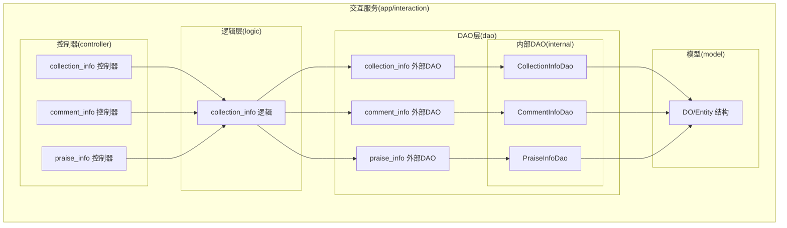
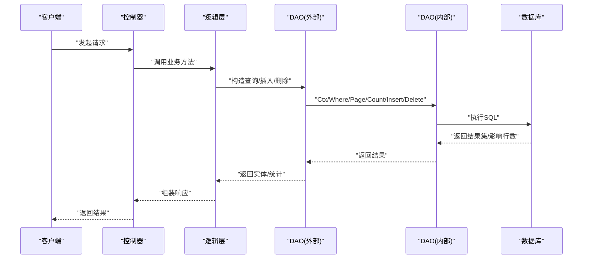
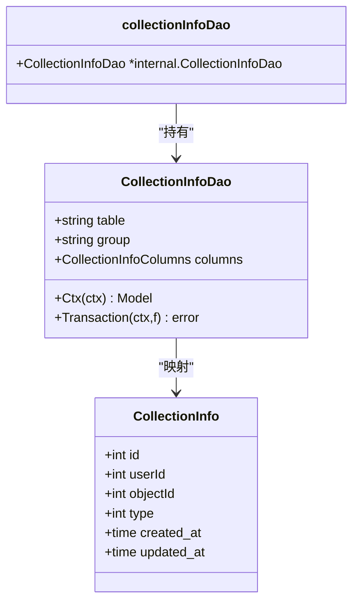
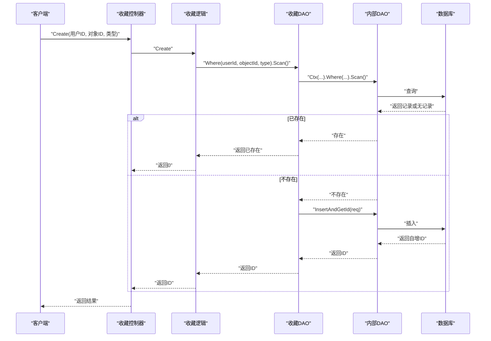
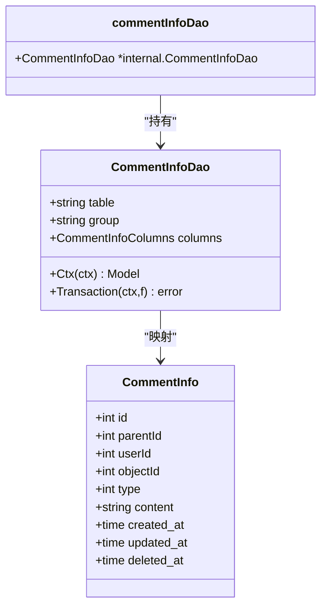
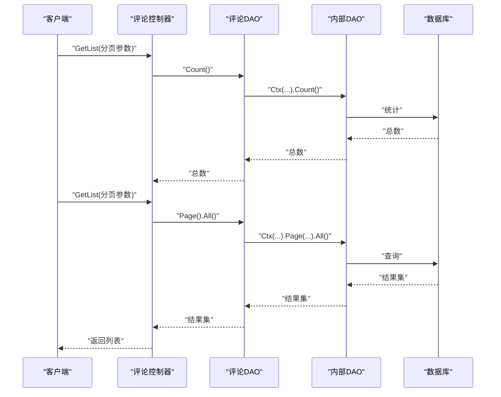
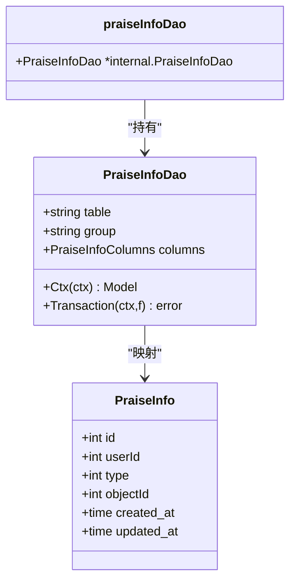
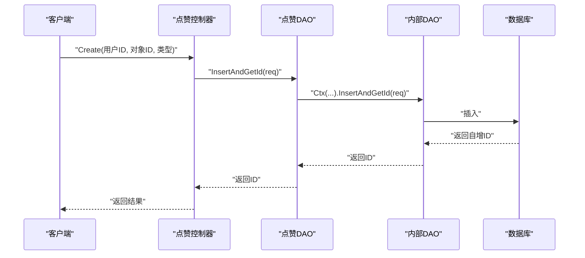
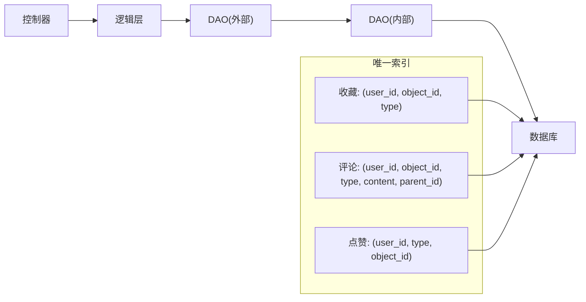

# 互动数据访问层

<cite>
**本文引用的文件**
- [app/interaction/internal/dao/collection_info.go](file://app/interaction/internal/dao/collection_info.go)
- [app/interaction/internal/dao/comment_info.go](file://app/interaction/internal/dao/comment_info.go)
- [app/interaction/internal/dao/praise_info.go](file://app/interaction/internal/dao/praise_info.go)
- [app/interaction/internal/dao/internal/collection_info.go](file://app/interaction/internal/dao/internal/collection_info.go)
- [app/interaction/internal/dao/internal/comment_info.go](file://app/interaction/internal/dao/internal/comment_info.go)
- [app/interaction/internal/dao/internal/praise_info.go](file://app/interaction/internal/dao/internal/praise_info.go)
- [app/interaction/internal/model/do/collection_info.go](file://app/interaction/internal/model/do/collection_info.go)
- [app/interaction/internal/model/do/comment_info.go](file://app/interaction/internal/model/do/comment_info.go)
- [app/interaction/internal/model/do/praise_info.go](file://app/interaction/internal/model/do/praise_info.go)
- [app/interaction/internal/model/entity/collection_info.go](file://app/interaction/internal/model/entity/collection_info.go)
- [app/interaction/internal/model/entity/comment_info.go](file://app/interaction/internal/model/entity/comment_info.go)
- [app/interaction/internal/model/entity/praise_info.go](file://app/interaction/internal/model/entity/praise_info.go)
- [app/interaction/hack/interaction.sql](file://app/interaction/hack/interaction.sql)
- [app/interaction/internal/logic/collection_info/collection_info.go](file://app/interaction/internal/logic/collection_info/collection_info.go)
- [app/interaction/internal/controller/collection_info/collection_info.go](file://app/interaction/internal/controller/collection_info/collection_info.go)
- [app/interaction/internal/controller/comment_info/comment_info.go](file://app/interaction/internal/controller/comment_info/comment_info.go)
- [app/interaction/internal/controller/praise_info/praise_info.go](file://app/interaction/internal/controller/praise_info/praise_info.go)
</cite>

## 目录
1. [简介](#简介)
2. [项目结构](#项目结构)
3. [核心组件](#核心组件)
4. [架构总览](#架构总览)
5. [详细组件分析](#详细组件分析)
6. [依赖关系分析](#依赖关系分析)
7. [性能考量](#性能考量)
8. [故障排查指南](#故障排查指南)
9. [结论](#结论)
10. [附录](#附录)

## 简介
本文件聚焦于“互动数据访问层”，系统化梳理收藏、评论、点赞三类互动数据的DAO实现、存储模式、去重策略与统计计算机制，并给出增删改查、数量统计与历史追踪的数据访问实现路径。同时提供与用户行为分析的集成模式、数据聚合策略与性能优化建议，帮助读者快速理解并高效使用该层能力。

## 项目结构
互动数据访问层位于交互服务模块中，采用“控制器-逻辑层-数据访问层”的分层设计，DAO层基于GoFrame ORM，通过内部DAO封装统一的表访问能力，并在外部DAO中提供全局单例以供上层调用。

图表来源
- [app/interaction/internal/controller/collection_info/collection_info.go](file://app/interaction/internal/controller/collection_info/collection_info.go#L1-L83)
- [app/interaction/internal/controller/comment_info/comment_info.go](file://app/interaction/internal/controller/comment_info/comment_info.go#L1-L107)
- [app/interaction/internal/controller/praise_info/praise_info.go](file://app/interaction/internal/controller/praise_info/praise_info.go#L1-L107)
- [app/interaction/internal/logic/collection_info/collection_info.go](file://app/interaction/internal/logic/collection_info/collection_info.go#L1-L110)
- [app/interaction/internal/dao/collection_info.go](file://app/interaction/internal/dao/collection_info.go#L1-L23)
- [app/interaction/internal/dao/comment_info.go](file://app/interaction/internal/dao/comment_info.go#L1-L23)
- [app/interaction/internal/dao/praise_info.go](file://app/interaction/internal/dao/praise_info.go#L1-L23)
- [app/interaction/internal/dao/internal/collection_info.go](file://app/interaction/internal/dao/internal/collection_info.go#L1-L90)
- [app/interaction/internal/dao/internal/comment_info.go](file://app/interaction/internal/dao/internal/comment_info.go#L1-L96)
- [app/interaction/internal/dao/internal/praise_info.go](file://app/interaction/internal/dao/internal/praise_info.go#L1-L90)

章节来源
- [app/interaction/internal/dao/collection_info.go](file://app/interaction/internal/dao/collection_info.go#L1-L23)
- [app/interaction/internal/dao/comment_info.go](file://app/interaction/internal/dao/comment_info.go#L1-L23)
- [app/interaction/internal/dao/praise_info.go](file://app/interaction/internal/dao/praise_info.go#L1-L23)
- [app/interaction/internal/dao/internal/collection_info.go](file://app/interaction/internal/dao/internal/collection_info.go#L1-L90)
- [app/interaction/internal/dao/internal/comment_info.go](file://app/interaction/internal/dao/internal/comment_info.go#L1-L96)
- [app/interaction/internal/dao/internal/praise_info.go](file://app/interaction/internal/dao/internal/praise_info.go#L1-L90)

## 核心组件
- 外部DAO包装器：为每个表提供全局单例，便于跨模块调用；内部持有对应的内部DAO实例。
- 内部DAO：封装表名、列名、上下文模型、事务封装等通用能力。
- DO/Entity：分别用于ORM查询映射与对外传输结构。
- 控制器与逻辑层：控制器负责请求校验与错误包装，逻辑层负责具体业务与DAO调用。

章节来源
- [app/interaction/internal/dao/collection_info.go](file://app/interaction/internal/dao/collection_info.go#L11-L23)
- [app/interaction/internal/dao/comment_info.go](file://app/interaction/internal/dao/comment_info.go#L11-L23)
- [app/interaction/internal/dao/praise_info.go](file://app/interaction/internal/dao/praise_info.go#L11-L23)
- [app/interaction/internal/dao/internal/collection_info.go](file://app/interaction/internal/dao/internal/collection_info.go#L14-L90)
- [app/interaction/internal/dao/internal/comment_info.go](file://app/interaction/internal/dao/internal/comment_info.go#L14-L96)
- [app/interaction/internal/dao/internal/praise_info.go](file://app/interaction/internal/dao/internal/praise_info.go#L14-L90)

## 架构总览
下图展示控制器-逻辑层-DAO层的调用关系与数据流向：

图表来源
- [app/interaction/internal/controller/collection_info/collection_info.go](file://app/interaction/internal/controller/collection_info/collection_info.go#L24-L82)
- [app/interaction/internal/logic/collection_info/collection_info.go](file://app/interaction/internal/logic/collection_info/collection_info.go#L14-L110)
- [app/interaction/internal/dao/internal/collection_info.go](file://app/interaction/internal/dao/internal/collection_info.go#L72-L89)

## 详细组件分析

### 收藏数据访问层
- 存储模式与去重
  - 表结构包含唯一索引，确保同一用户对同一对象的同类型收藏仅保留一条记录，避免重复收藏。
  - 唯一索引组合通常包含用户标识、对象标识与类型字段，保证去重效果。
- DAO实现要点
  - 外部DAO提供全局单例，内部DAO封装表名、列名、上下文模型与事务。
  - 逻辑层在创建前先查询是否已存在，若不存在再插入，从而利用数据库唯一约束避免重复。
- 增删改查与统计
  - 列表：按类型与用户ID过滤，支持分页与总数统计。
  - 创建：先查后插，利用唯一约束保证幂等。
  - 删除：按ID与用户ID匹配删除。
- 历史追踪
  - 通过时间戳字段记录创建与更新时间，结合唯一索引可实现历史版本追踪与去重。

图表来源
- [app/interaction/internal/dao/collection_info.go](file://app/interaction/internal/dao/collection_info.go#L13-L20)
- [app/interaction/internal/dao/internal/collection_info.go](file://app/interaction/internal/dao/internal/collection_info.go#L14-L50)
- [app/interaction/internal/model/do/collection_info.go](file://app/interaction/internal/model/do/collection_info.go#L12-L22)
- [app/interaction/internal/model/entity/collection_info.go](file://app/interaction/internal/model/entity/collection_info.go#L11-L20)

图表来源
- [app/interaction/internal/logic/collection_info/collection_info.go](file://app/interaction/internal/logic/collection_info/collection_info.go#L56-L78)
- [app/interaction/internal/dao/internal/collection_info.go](file://app/interaction/internal/dao/internal/collection_info.go#L72-L89)

章节来源
- [app/interaction/internal/dao/collection_info.go](file://app/interaction/internal/dao/collection_info.go#L11-L23)
- [app/interaction/internal/dao/internal/collection_info.go](file://app/interaction/internal/dao/internal/collection_info.go#L14-L90)
- [app/interaction/internal/model/do/collection_info.go](file://app/interaction/internal/model/do/collection_info.go#L12-L22)
- [app/interaction/internal/model/entity/collection_info.go](file://app/interaction/internal/model/entity/collection_info.go#L11-L20)
- [app/interaction/internal/logic/collection_info/collection_info.go](file://app/interaction/internal/logic/collection_info/collection_info.go#L14-L110)
- [app/interaction/internal/controller/collection_info/collection_info.go](file://app/interaction/internal/controller/collection_info/collection_info.go#L23-L82)
- [app/interaction/hack/interaction.sql](file://app/interaction/hack/interaction.sql#L52-L65)

### 评论数据访问层
- 存储模式与去重
  - 评论表包含唯一索引，组合字段包括用户ID、对象ID、类型、内容与父评论ID，确保相同用户对同一对象的同类评论内容不会重复。
- DAO实现要点
  - 外部DAO提供全局单例，内部DAO封装表名、列名、上下文模型与事务。
  - 控制器提供列表、创建、删除接口，逻辑层负责参数校验与DAO调用。
- 增删改查与统计
  - 列表：支持分页与总数统计。
  - 创建：直接插入，由唯一索引保证去重。
  - 删除：按ID删除。
- 历史追踪
  - 通过时间戳字段记录创建与更新时间，结合唯一索引可实现历史版本追踪与去重。

图表来源
- [app/interaction/internal/dao/comment_info.go](file://app/interaction/internal/dao/comment_info.go#L13-L20)
- [app/interaction/internal/dao/internal/comment_info.go](file://app/interaction/internal/dao/internal/comment_info.go#L14-L56)
- [app/interaction/internal/model/do/comment_info.go](file://app/interaction/internal/model/do/comment_info.go#L12-L25)
- [app/interaction/internal/model/entity/comment_info.go](file://app/interaction/internal/model/entity/comment_info.go#L11-L23)

图表来源
- [app/interaction/internal/controller/comment_info/comment_info.go](file://app/interaction/internal/controller/comment_info/comment_info.go#L27-L77)
- [app/interaction/internal/dao/internal/comment_info.go](file://app/interaction/internal/dao/internal/comment_info.go#L78-L95)

章节来源
- [app/interaction/internal/dao/comment_info.go](file://app/interaction/internal/dao/comment_info.go#L11-L23)
- [app/interaction/internal/dao/internal/comment_info.go](file://app/interaction/internal/dao/internal/comment_info.go#L14-L96)
- [app/interaction/internal/model/do/comment_info.go](file://app/interaction/internal/model/do/comment_info.go#L12-L25)
- [app/interaction/internal/model/entity/comment_info.go](file://app/interaction/internal/model/entity/comment_info.go#L11-L23)
- [app/interaction/internal/controller/comment_info/comment_info.go](file://app/interaction/internal/controller/comment_info/comment_info.go#L27-L107)
- [app/interaction/hack/interaction.sql](file://app/interaction/hack/interaction.sql#L3-L19)

### 点赞数据访问层
- 存储模式与去重
  - 点赞表包含唯一索引，组合字段包括用户ID、类型与对象ID，确保同一用户对同一对象的同类型点赞仅保留一条记录。
- DAO实现要点
  - 外部DAO提供全局单例，内部DAO封装表名、列名、上下文模型与事务。
  - 控制器提供列表、创建、删除接口，逻辑层负责参数校验与DAO调用。
- 增删改查与统计
  - 列表：支持分页与总数统计。
  - 创建：直接插入，由唯一索引保证去重。
  - 删除：按ID删除。
- 历史追踪
  - 通过时间戳字段记录创建与更新时间，结合唯一索引可实现历史版本追踪与去重。

图表来源
- [app/interaction/internal/dao/praise_info.go](file://app/interaction/internal/dao/praise_info.go#L13-L20)
- [app/interaction/internal/dao/internal/praise_info.go](file://app/interaction/internal/dao/internal/praise_info.go#L14-L50)
- [app/interaction/internal/model/do/praise_info.go](file://app/interaction/internal/model/do/praise_info.go#L12-L22)
- [app/interaction/internal/model/entity/praise_info.go](file://app/interaction/internal/model/entity/praise_info.go#L11-L20)

图表来源
- [app/interaction/internal/controller/praise_info/praise_info.go](file://app/interaction/internal/controller/praise_info/praise_info.go#L79-L92)
- [app/interaction/internal/dao/internal/praise_info.go](file://app/interaction/internal/dao/internal/praise_info.go#L72-L89)

章节来源
- [app/interaction/internal/dao/praise_info.go](file://app/interaction/internal/dao/praise_info.go#L11-L23)
- [app/interaction/internal/dao/internal/praise_info.go](file://app/interaction/internal/dao/internal/praise_info.go#L14-L90)
- [app/interaction/internal/model/do/praise_info.go](file://app/interaction/internal/model/do/praise_info.go#L12-L22)
- [app/interaction/internal/model/entity/praise_info.go](file://app/interaction/internal/model/entity/praise_info.go#L11-L20)
- [app/interaction/internal/controller/praise_info/praise_info.go](file://app/interaction/internal/controller/praise_info/praise_info.go#L79-L107)
- [app/interaction/hack/interaction.sql](file://app/interaction/hack/interaction.sql#L32-L44)

### 统计计算与历史追踪
- 统计计算
  - 列表总数：通过DAO层的Count方法获取。
  - 分页查询：通过DAO层的Page方法实现。
- 历史追踪
  - 时间戳字段用于记录创建与更新时间，结合唯一索引可实现历史版本追踪与去重。
- 与用户行为分析的集成
  - 可将收藏、评论、点赞作为用户行为事件写入事件流或分析平台，结合唯一索引与时间戳进行去重与排序。
  - 可通过定时任务或流式处理对互动数据进行聚合统计，生成用户画像与内容热度指标。

章节来源
- [app/interaction/internal/logic/collection_info/collection_info.go](file://app/interaction/internal/logic/collection_info/collection_info.go#L14-L54)
- [app/interaction/internal/controller/collection_info/collection_info.go](file://app/interaction/internal/controller/collection_info/collection_info.go#L23-L45)
- [app/interaction/internal/controller/comment_info/comment_info.go](file://app/interaction/internal/controller/comment_info/comment_info.go#L27-L77)
- [app/interaction/internal/controller/praise_info/praise_info.go](file://app/interaction/internal/controller/praise_info/praise_info.go#L27-L77)

## 依赖关系分析
- 组件耦合
  - 控制器依赖逻辑层，逻辑层依赖DAO层，DAO层依赖内部DAO与数据库。
  - 外部DAO通过组合内部DAO实现能力复用，降低重复代码。
- 去重与唯一索引
  - 收藏、评论、点赞表均定义唯一索引，DAO层通过唯一约束实现去重，逻辑层在创建前查询可进一步保证幂等。
- 外部依赖
  - 基于GoFrame ORM与gdb.Model，提供统一的上下文、事务与查询能力。

图表来源
- [app/interaction/internal/dao/internal/collection_info.go](file://app/interaction/internal/dao/internal/collection_info.go#L14-L50)
- [app/interaction/internal/dao/internal/comment_info.go](file://app/interaction/internal/dao/internal/comment_info.go#L14-L56)
- [app/interaction/internal/dao/internal/praise_info.go](file://app/interaction/internal/dao/internal/praise_info.go#L14-L50)
- [app/interaction/hack/interaction.sql](file://app/interaction/hack/interaction.sql#L18-L18)
- [app/interaction/hack/interaction.sql](file://app/interaction/hack/interaction.sql#L43-L43)
- [app/interaction/hack/interaction.sql](file://app/interaction/hack/interaction.sql#L64-L64)

章节来源
- [app/interaction/internal/dao/internal/collection_info.go](file://app/interaction/internal/dao/internal/collection_info.go#L14-L90)
- [app/interaction/internal/dao/internal/comment_info.go](file://app/interaction/internal/dao/internal/comment_info.go#L14-L96)
- [app/interaction/internal/dao/internal/praise_info.go](file://app/interaction/internal/dao/internal/praise_info.go#L14-L90)
- [app/interaction/hack/interaction.sql](file://app/interaction/hack/interaction.sql#L1-L72)

## 性能考量
- 唯一索引与去重
  - 利用数据库唯一索引避免重复写入，减少无效写操作，提高写入吞吐。
- 分页与统计
  - 列表查询使用Count与Page，避免一次性加载全部数据，降低内存占用与网络开销。
- 事务与上下文
  - DAO层提供Transaction封装，逻辑层在需要时使用事务保证一致性；Ctx传入上下文，便于链路追踪与资源管理。
- 批量与异步
  - 对高频写入场景，可考虑批量写入或异步队列，配合唯一索引实现最终一致。

## 故障排查指南
- 常见错误类型
  - 数据库操作错误：控制器对DAO层返回的错误进行包装，便于统一处理与日志记录。
  - 参数校验失败：控制器对请求参数进行校验，逻辑层对业务条件进行判断。
- 排查步骤
  - 检查唯一索引冲突：确认用户、对象与类型组合是否已存在。
  - 检查上下文与事务：确认Ctx是否正确传递，事务是否正确提交或回滚。
  - 检查分页参数：确认页码与大小是否合理，避免超界。
- 日志与错误码
  - 控制器使用统一错误包装，便于定位问题来源与分类处理。

章节来源
- [app/interaction/internal/controller/collection_info/collection_info.go](file://app/interaction/internal/controller/collection_info/collection_info.go#L23-L82)
- [app/interaction/internal/controller/comment_info/comment_info.go](file://app/interaction/internal/controller/comment_info/comment_info.go#L27-L107)
- [app/interaction/internal/controller/praise_info/praise_info.go](file://app/interaction/internal/controller/praise_info/praise_info.go#L27-L107)

## 结论
互动数据访问层通过统一的DAO抽象、明确的唯一索引与事务封装，实现了收藏、评论、点赞等互动数据的可靠增删改查与去重处理。结合分页统计与时间戳追踪，能够满足用户行为分析与内容热度统计的需求。建议在高并发场景下继续完善批量化与异步化策略，并持续优化索引与查询计划以提升整体性能。

## 附录
- 数据库初始化脚本
  - 包含收藏、评论、点赞三张表的建表语句与唯一索引定义，可直接用于初始化数据库。
- 实体与DO结构
  - DO结构用于ORM查询映射，Entity结构用于对外传输，两者字段保持一致，便于数据转换。

章节来源
- [app/interaction/hack/interaction.sql](file://app/interaction/hack/interaction.sql#L1-L72)
- [app/interaction/internal/model/do/collection_info.go](file://app/interaction/internal/model/do/collection_info.go#L12-L22)
- [app/interaction/internal/model/do/comment_info.go](file://app/interaction/internal/model/do/comment_info.go#L12-L25)
- [app/interaction/internal/model/do/praise_info.go](file://app/interaction/internal/model/do/praise_info.go#L12-L22)
- [app/interaction/internal/model/entity/collection_info.go](file://app/interaction/internal/model/entity/collection_info.go#L11-L20)
- [app/interaction/internal/model/entity/comment_info.go](file://app/interaction/internal/model/entity/comment_info.go#L11-L23)
- [app/interaction/internal/model/entity/praise_info.go](file://app/interaction/internal/model/entity/praise_info.go#L11-L20)