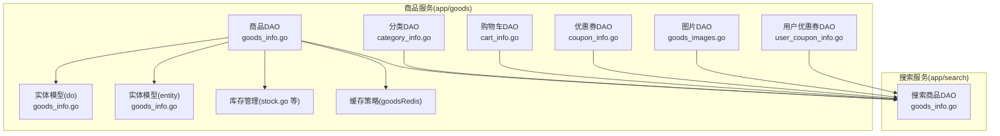
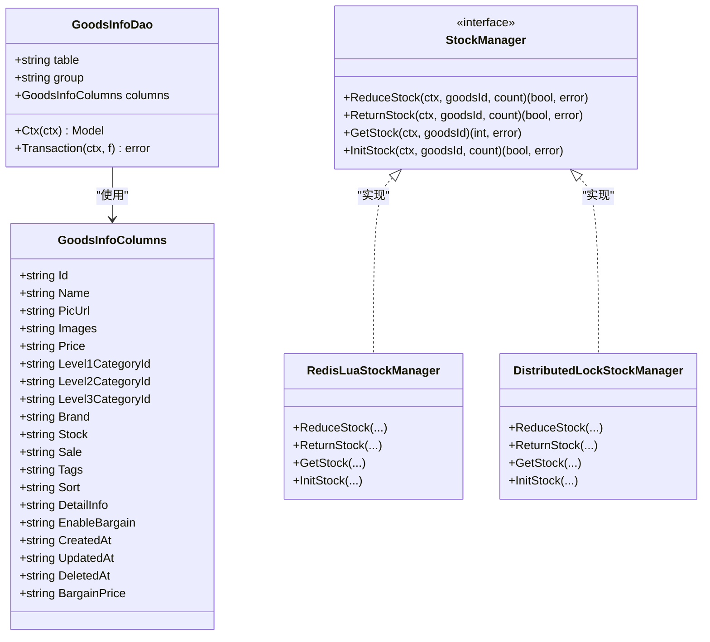
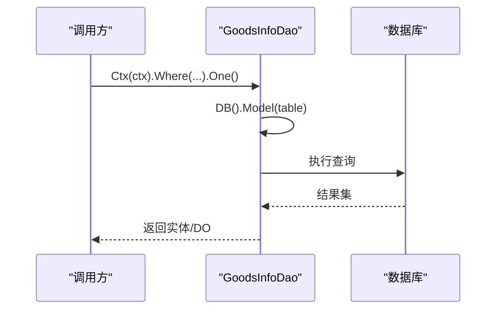
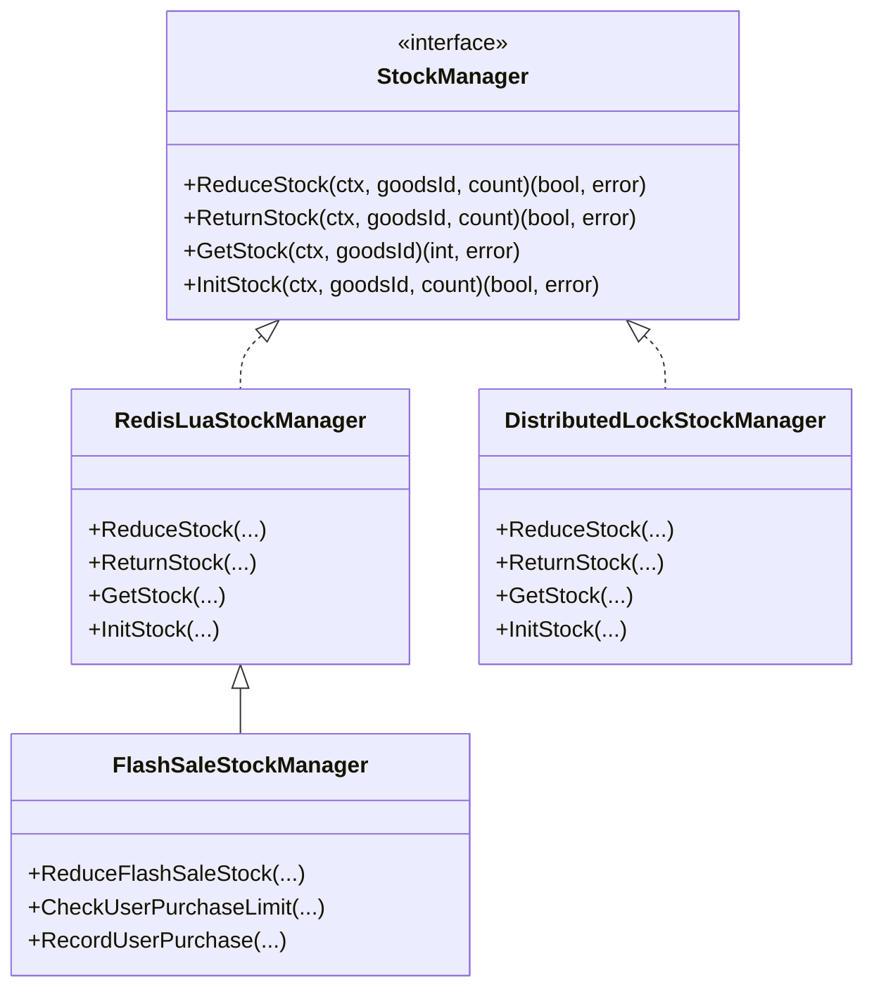
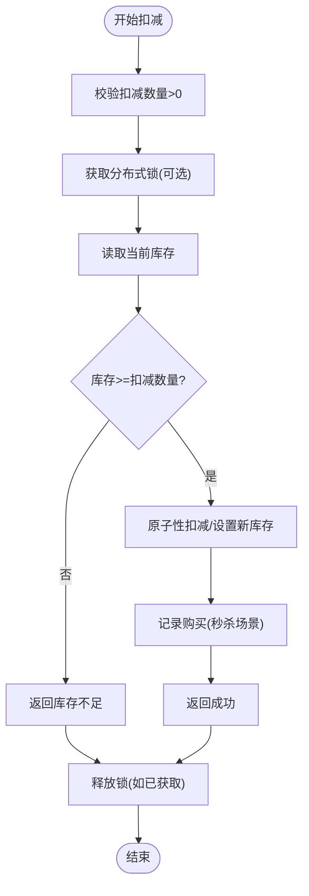
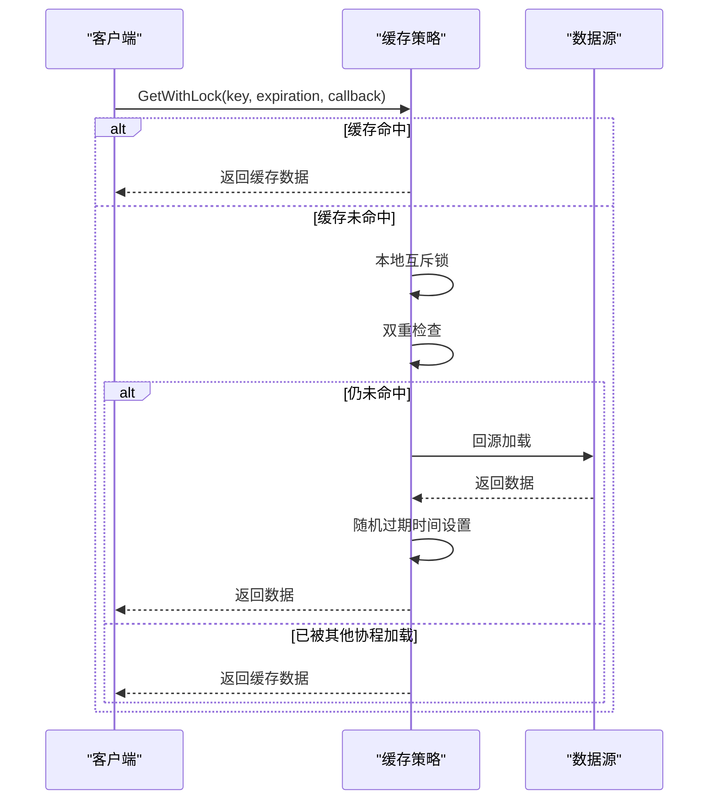
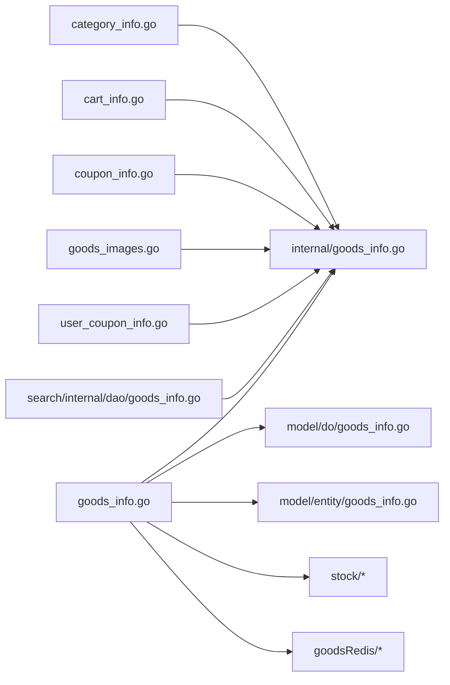

# 商品数据访问层

<cite>
**本文引用的文件**
- [app/goods/internal/dao/goods_info.go](file://app/goods/internal/dao/goods_info.go)
- [app/goods/internal/dao/category_info.go](file://app/goods/internal/dao/category_info.go)
- [app/goods/internal/dao/cart_info.go](file://app/goods/internal/dao/cart_info.go)
- [app/goods/internal/dao/coupon_info.go](file://app/goods/internal/dao/coupon_info.go)
- [app/goods/internal/dao/goods_images.go](file://app/goods/internal/dao/goods_images.go)
- [app/goods/internal/dao/user_coupon_info.go](file://app/goods/internal/dao/user_coupon_info.go)
- [app/goods/internal/dao/internal/goods_info.go](file://app/goods/internal/dao/internal/goods_info.go)
- [app/goods/internal/model/do/goods_info.go](file://app/goods/internal/model/do/goods_info.go)
- [app/goods/internal/model/entity/goods_info.go](file://app/goods/internal/model/entity/goods_info.go)
- [app/goods/utility/stock/stock.go](file://app/goods/utility/stock/stock.go)
- [app/goods/utility/stock/distributed_lock.go](file://app/goods/utility/stock/distributed_lock.go)
- [app/goods/utility/stock/redis_lua.go](file://app/goods/utility/stock/redis_lua.go)
- [app/goods/utility/stock/flash_sale_stock.go](file://app/goods/utility/stock/flash_sale_stock.go)
- [app/goods/utility/goodsRedis/goods.go](file://app/goods/utility/goodsRedis/goods.go)
- [app/goods/utility/goodsRedis/cache_strategy.go](file://app/goods/utility/goodsRedis/cache_strategy.go)
- [app/search/internal/dao/goods_info.go](file://app/search/internal/dao/goods_info.go)
- [app/search/internal/dao/internal/goods_info.go](file://app/search/internal/dao/internal/goods_info.go)
</cite>

## 目录
1. [引言](#引言)
2. [项目结构](#项目结构)
3. [核心组件](#核心组件)
4. [架构总览](#架构总览)
5. [详细组件分析](#详细组件分析)
6. [依赖关系分析](#依赖关系分析)
7. [性能考量](#性能考量)
8. [故障排查指南](#故障排查指南)
9. [结论](#结论)
10. [附录](#附录)

## 引言
本文件聚焦于商品数据访问层的设计与实现，覆盖商品信息、分类、图片、购物车、优惠券等DAO的组织方式；阐述库存管理的数据访问模式、库存扣减事务处理与库存预警机制；说明商品搜索与推荐相关的数据访问实现、商品图片存储管理与购物车持久化策略；并总结商品数据与缓存层的交互模式、批量操作优化与高并发场景下的一致性保障。

## 项目结构
商品数据访问层由“业务服务层”和“DAO层”组成，其中：
- 业务服务层位于 app/goods，负责领域逻辑与对外API控制器交互；
- DAO层位于 app/goods/internal/dao 与 app/search/internal/dao，分别服务于商品域与搜索域；
- 实体模型位于 app/goods/internal/model/entity 与 app/goods/internal/model/do；
- 库存管理与缓存策略位于 app/goods/utility 下的 stock 与 goodsRedis 子目录。

图表来源
- [app/goods/internal/dao/goods_info.go](file://app/goods/internal/dao/goods_info.go#L1-L23)
- [app/goods/internal/dao/category_info.go](file://app/goods/internal/dao/category_info.go#L1-L23)
- [app/goods/internal/dao/cart_info.go](file://app/goods/internal/dao/cart_info.go#L1-L23)
- [app/goods/internal/dao/coupon_info.go](file://app/goods/internal/dao/coupon_info.go#L1-L23)
- [app/goods/internal/dao/goods_images.go](file://app/goods/internal/dao/goods_images.go#L1-L23)
- [app/goods/internal/dao/user_coupon_info.go](file://app/goods/internal/dao/user_coupon_info.go#L1-L23)
- [app/goods/internal/dao/internal/goods_info.go](file://app/goods/internal/dao/internal/goods_info.go#L1-L116)
- [app/goods/internal/model/do/goods_info.go](file://app/goods/internal/model/do/goods_info.go#L1-L35)
- [app/goods/internal/model/entity/goods_info.go](file://app/goods/internal/model/entity/goods_info.go#L1-L33)
- [app/goods/utility/stock/stock.go](file://app/goods/utility/stock/stock.go#L1-L32)
- [app/goods/utility/goodsRedis/goods.go](file://app/goods/utility/goodsRedis/goods.go#L1-L121)
- [app/search/internal/dao/goods_info.go](file://app/search/internal/dao/goods_info.go#L1-L23)

章节来源
- [app/goods/internal/dao/goods_info.go](file://app/goods/internal/dao/goods_info.go#L1-L23)
- [app/goods/internal/dao/internal/goods_info.go](file://app/goods/internal/dao/internal/goods_info.go#L1-L116)
- [app/goods/internal/model/do/goods_info.go](file://app/goods/internal/model/do/goods_info.go#L1-L35)
- [app/goods/internal/model/entity/goods_info.go](file://app/goods/internal/model/entity/goods_info.go#L1-L33)
- [app/search/internal/dao/internal/goods_info.go](file://app/search/internal/dao/internal/goods_info.go#L1-L112)

## 核心组件
- 商品DAO：封装对 goods_info 表的增删改查、事务与列名常量，提供全局访问对象。
- 分类DAO：封装对 category_info 表的访问。
- 购物车DAO：封装对 cart_info 表的访问。
- 优惠券DAO：封装对 coupon_info 表的访问。
- 图片DAO：封装对 goods_images 表的访问。
- 用户优惠券DAO：封装对 user_coupon_info 表的访问。
- 库存管理器：定义统一接口，提供基于Redis Lua与分布式锁两种实现。
- 缓存策略：提供缓存穿透、击穿、雪崩防护与批量删除策略。

章节来源
- [app/goods/internal/dao/goods_info.go](file://app/goods/internal/dao/goods_info.go#L1-L23)
- [app/goods/internal/dao/category_info.go](file://app/goods/internal/dao/category_info.go#L1-L23)
- [app/goods/internal/dao/cart_info.go](file://app/goods/internal/dao/cart_info.go#L1-L23)
- [app/goods/internal/dao/coupon_info.go](file://app/goods/internal/dao/coupon_info.go#L1-L23)
- [app/goods/internal/dao/goods_images.go](file://app/goods/internal/dao/goods_images.go#L1-L23)
- [app/goods/internal/dao/user_coupon_info.go](file://app/goods/internal/dao/user_coupon_info.go#L1-L23)
- [app/goods/utility/stock/stock.go](file://app/goods/utility/stock/stock.go#L1-L32)
- [app/goods/utility/goodsRedis/goods.go](file://app/goods/utility/goodsRedis/goods.go#L1-L121)

## 架构总览
商品数据访问层采用“DAO聚合 + 模型映射 + 工具库”的分层设计：
- DAO层通过内部DAO持有表名、列名与数据库连接组，提供上下文感知的Model与事务封装；
- 模型层提供DO与Entity两类结构，分别面向DAO操作与对外传输；
- 库存管理器与缓存策略作为工具库，为高并发场景提供一致性的数据访问模式。

图表来源
- [app/goods/internal/dao/internal/goods_info.go](file://app/goods/internal/dao/internal/goods_info.go#L14-L116)
- [app/goods/utility/stock/stock.go](file://app/goods/utility/stock/stock.go#L8-L31)
- [app/goods/utility/stock/redis_lua.go](file://app/goods/utility/stock/redis_lua.go#L12-L166)
- [app/goods/utility/stock/distributed_lock.go](file://app/goods/utility/stock/distributed_lock.go#L13-L266)

## 详细组件分析

### 商品DAO与模型映射
- 商品DAO通过内部GoodsInfoDao封装表名、列名与数据库组，并提供Ctx与Transaction方法，确保所有查询在请求上下文中执行且支持事务包裹。
- 模型层提供DO与Entity两类结构，分别用于DAO操作与对外传输，避免ORM字段污染业务层。

图表来源
- [app/goods/internal/dao/internal/goods_info.go](file://app/goods/internal/dao/internal/goods_info.go#L94-L116)
- [app/goods/internal/model/do/goods_info.go](file://app/goods/internal/model/do/goods_info.go#L12-L35)
- [app/goods/internal/model/entity/goods_info.go](file://app/goods/internal/model/entity/goods_info.go#L11-L33)

章节来源
- [app/goods/internal/dao/internal/goods_info.go](file://app/goods/internal/dao/internal/goods_info.go#L1-L116)
- [app/goods/internal/model/do/goods_info.go](file://app/goods/internal/model/do/goods_info.go#L1-L35)
- [app/goods/internal/model/entity/goods_info.go](file://app/goods/internal/model/entity/goods_info.go#L1-L33)

### 分类、图片、购物车、优惠券DAO
- 分类DAO、图片DAO、购物车DAO、优惠券DAO与用户优惠券DAO均采用与商品DAO相同的聚合模式，内部持有对应表的DAO实例并通过全局变量暴露给业务层使用。
- 这些DAO与搜索域的DAO共享底层表结构，确保跨服务的数据一致性。

章节来源
- [app/goods/internal/dao/category_info.go](file://app/goods/internal/dao/category_info.go#L1-L23)
- [app/goods/internal/dao/goods_images.go](file://app/goods/internal/dao/goods_images.go#L1-L23)
- [app/goods/internal/dao/cart_info.go](file://app/goods/internal/dao/cart_info.go#L1-L23)
- [app/goods/internal/dao/coupon_info.go](file://app/goods/internal/dao/coupon_info.go#L1-L23)
- [app/goods/internal/dao/user_coupon_info.go](file://app/goods/internal/dao/user_coupon_info.go#L1-L23)
- [app/search/internal/dao/goods_info.go](file://app/search/internal/dao/goods_info.go#L1-L23)

### 库存管理：接口与实现
- StockManager定义统一的库存操作接口，包括扣减、返还、查询与初始化。
- RedisLuaStockManager基于Redis Lua脚本实现原子性扣减与返还，适合高并发场景。
- DistributedLockStockManager基于分布式锁实现，适用于对一致性要求更高但吞吐略低的场景。
- FlashSaleStockManager扩展秒杀场景，增加用户购买限制与购买记录缓存，结合Lua脚本实现原子性扣减与失败回滚。

图表来源
- [app/goods/utility/stock/stock.go](file://app/goods/utility/stock/stock.go#L8-L31)
- [app/goods/utility/stock/redis_lua.go](file://app/goods/utility/stock/redis_lua.go#L12-L166)
- [app/goods/utility/stock/distributed_lock.go](file://app/goods/utility/stock/distributed_lock.go#L13-L266)
- [app/goods/utility/stock/flash_sale_stock.go](file://app/goods/utility/stock/flash_sale_stock.go#L14-L152)

章节来源
- [app/goods/utility/stock/stock.go](file://app/goods/utility/stock/stock.go#L1-L32)
- [app/goods/utility/stock/redis_lua.go](file://app/goods/utility/stock/redis_lua.go#L1-L166)
- [app/goods/utility/stock/distributed_lock.go](file://app/goods/utility/stock/distributed_lock.go#L1-L266)
- [app/goods/utility/stock/flash_sale_stock.go](file://app/goods/utility/stock/flash_sale_stock.go#L1-L152)

### 库存扣减事务处理与一致性
- Redis Lua脚本在单命令内完成读取、判断与写入，天然具备原子性，避免竞态条件。
- 分布式锁实现中，扣减前先获取锁，失败则重试或直接返回，成功后defer释放锁，确保临界区串行化。
- 秒杀场景中，扣减成功后记录用户购买，若记录失败则回滚库存，保证最终一致性。

图表来源
- [app/goods/utility/stock/distributed_lock.go](file://app/goods/utility/stock/distributed_lock.go#L91-L159)
- [app/goods/utility/stock/redis_lua.go](file://app/goods/utility/stock/redis_lua.go#L75-L102)
- [app/goods/utility/stock/flash_sale_stock.go](file://app/goods/utility/stock/flash_sale_stock.go#L52-L99)

章节来源
- [app/goods/utility/stock/distributed_lock.go](file://app/goods/utility/stock/distributed_lock.go#L91-L159)
- [app/goods/utility/stock/redis_lua.go](file://app/goods/utility/stock/redis_lua.go#L75-L102)
- [app/goods/utility/stock/flash_sale_stock.go](file://app/goods/utility/stock/flash_sale_stock.go#L52-L99)

### 库存预警机制
- 当前代码未直接实现“库存预警”触发逻辑。可在调用端根据GetStock返回值与阈值比较后触发告警或异步通知，或在应用层维护阈值配置并通过消息队列推送预警事件。
- 建议在业务层增加“库存预警”开关与阈值配置，结合消息中间件实现解耦告警。

章节来源
- [app/goods/utility/stock/redis_lua.go](file://app/goods/utility/stock/redis_lua.go#L127-L145)
- [app/goods/utility/stock/distributed_lock.go](file://app/goods/utility/stock/distributed_lock.go#L212-L230)

### 商品搜索与推荐的数据访问
- 商品搜索域DAO同样基于内部GoodsInfoDao，提供统一的列名与上下文模型封装，便于跨服务共享。
- 搜索域DAO与商品域DAO共享表结构，确保搜索索引与数据库一致性。

章节来源
- [app/search/internal/dao/goods_info.go](file://app/search/internal/dao/goods_info.go#L1-L23)
- [app/search/internal/dao/internal/goods_info.go](file://app/search/internal/dao/internal/goods_info.go#L1-L112)

### 商品图片存储管理
- 图片DAO封装对 goods_images 的访问，配合资源服务与文件上传能力实现图片的增删改查。
- 商品详情中的Images字段以字符串形式存储，可按约定格式保存多图URL列表，便于前端渲染。

章节来源
- [app/goods/internal/dao/goods_images.go](file://app/goods/internal/dao/goods_images.go#L1-L23)
- [app/goods/internal/model/entity/goods_info.go](file://app/goods/internal/model/entity/goods_info.go#L16-L17)

### 购物车持久化策略
- 购物车DAO封装对 cart_info 的访问，支持按用户维度的增删改查。
- 建议在业务层对购物车项进行幂等写入与批量同步，结合缓存实现快速读取与延迟落库。

章节来源
- [app/goods/internal/dao/cart_info.go](file://app/goods/internal/dao/cart_info.go#L1-L23)

### 商品数据与缓存层的交互模式
- 商品详情缓存：提供设置、获取、删除与空值缓存（穿透防护）；支持批量删除与延迟双删策略。
- 分类全量数据缓存：提供设置、获取、删除，支持较长有效期。
- 缓存策略：带本地互斥锁的击穿防护、随机过期时间的雪崩防护，提升缓存命中率与稳定性。

图表来源
- [app/goods/utility/goodsRedis/cache_strategy.go](file://app/goods/utility/goodsRedis/cache_strategy.go#L32-L78)
- [app/goods/utility/goodsRedis/goods.go](file://app/goods/utility/goodsRedis/goods.go#L18-L52)

章节来源
- [app/goods/utility/goodsRedis/goods.go](file://app/goods/utility/goodsRedis/goods.go#L1-L121)
- [app/goods/utility/goodsRedis/cache_strategy.go](file://app/goods/utility/goodsRedis/cache_strategy.go#L1-L96)

### 批量操作优化与高并发一致性
- 批量删除：提供批量删除与延迟双删策略，降低缓存不一致风险。
- 随机过期：为热点键设置随机过期时间，避免缓存雪崩。
- 原子操作：库存扣减采用Redis Lua脚本或分布式锁，确保高并发下的一致性。

章节来源
- [app/goods/utility/goodsRedis/goods.go](file://app/goods/utility/goodsRedis/goods.go#L93-L120)
- [app/goods/utility/goodsRedis/cache_strategy.go](file://app/goods/utility/goodsRedis/cache_strategy.go#L80-L90)
- [app/goods/utility/stock/redis_lua.go](file://app/goods/utility/stock/redis_lua.go#L30-L53)
- [app/goods/utility/stock/distributed_lock.go](file://app/goods/utility/stock/distributed_lock.go#L46-L89)

## 依赖关系分析
- 商品DAO依赖内部GoodsInfoDao与模型层结构，向上提供全局访问对象；
- 搜索域DAO复用内部GoodsInfoDao，保持与商品域一致的列名与上下文；
- 库存管理器与缓存策略作为独立工具库，被各业务模块复用；
- DAO层与工具库之间无循环依赖，职责清晰。

图表来源
- [app/goods/internal/dao/goods_info.go](file://app/goods/internal/dao/goods_info.go#L1-L23)
- [app/goods/internal/dao/internal/goods_info.go](file://app/goods/internal/dao/internal/goods_info.go#L1-L116)
- [app/goods/internal/model/do/goods_info.go](file://app/goods/internal/model/do/goods_info.go#L1-L35)
- [app/goods/internal/model/entity/goods_info.go](file://app/goods/internal/model/entity/goods_info.go#L1-L33)
- [app/search/internal/dao/goods_info.go](file://app/search/internal/dao/goods_info.go#L1-L23)

章节来源
- [app/goods/internal/dao/goods_info.go](file://app/goods/internal/dao/goods_info.go#L1-L23)
- [app/search/internal/dao/goods_info.go](file://app/search/internal/dao/goods_info.go#L1-L23)

## 性能考量
- Redis Lua脚本：单命令原子性，减少网络往返与竞态，适合高并发扣减。
- 分布式锁：通过NX+EX与Lua释放，避免锁误删，但需注意锁粒度与重试策略。
- 缓存策略：本地互斥锁+双重检查+随机过期，有效缓解击穿与雪崩。
- 批量操作：批量删除与延迟双删降低缓存不一致概率。

## 故障排查指南
- 库存不足：检查扣减数量与当前库存，确认Lua脚本或锁逻辑是否正确执行。
- 扣减失败：查看锁获取与释放日志，确认是否存在长时间持有锁导致的超时。
- 缓存穿透：确认空值缓存是否正确设置与过期时间是否合理。
- 缓存击穿：确认本地互斥锁是否生效，回源加载是否异常。
- 缓存雪崩：检查随机过期时间是否启用，过期时间分布是否均匀。

章节来源
- [app/goods/utility/stock/distributed_lock.go](file://app/goods/utility/stock/distributed_lock.go#L91-L159)
- [app/goods/utility/stock/redis_lua.go](file://app/goods/utility/stock/redis_lua.go#L75-L102)
- [app/goods/utility/goodsRedis/cache_strategy.go](file://app/goods/utility/goodsRedis/cache_strategy.go#L32-L78)
- [app/goods/utility/goodsRedis/goods.go](file://app/goods/utility/goodsRedis/goods.go#L18-L52)

## 结论
商品数据访问层通过DAO聚合、模型映射与工具库的清晰分工，实现了对商品、分类、图片、购物车、优惠券等领域的统一数据访问。库存管理提供了Redis Lua与分布式锁两种高可靠方案，并在秒杀场景中引入用户购买限制与回滚机制。缓存策略覆盖穿透、击穿、雪崩的常见问题，并提供批量删除与延迟双删优化。整体设计在高并发场景下兼顾性能与一致性，满足电商核心业务的数据访问需求。

## 附录
- 关键路径参考
  - 商品DAO：[app/goods/internal/dao/goods_info.go](file://app/goods/internal/dao/goods_info.go#L1-L23)
  - 内部DAO与事务：[app/goods/internal/dao/internal/goods_info.go](file://app/goods/internal/dao/internal/goods_info.go#L107-L116)
  - 库存接口与实现：[app/goods/utility/stock/stock.go](file://app/goods/utility/stock/stock.go#L8-L31)
  - Redis Lua实现：[app/goods/utility/stock/redis_lua.go](file://app/goods/utility/stock/redis_lua.go#L12-L166)
  - 分布式锁实现：[app/goods/utility/stock/distributed_lock.go](file://app/goods/utility/stock/distributed_lock.go#L13-L266)
  - 秒杀库存实现：[app/goods/utility/stock/flash_sale_stock.go](file://app/goods/utility/stock/flash_sale_stock.go#L14-L152)
  - 缓存策略与商品详情缓存：[app/goods/utility/goodsRedis/cache_strategy.go](file://app/goods/utility/goodsRedis/cache_strategy.go#L18-L96), [app/goods/utility/goodsRedis/goods.go](file://app/goods/utility/goodsRedis/goods.go#L12-L121)
  - 搜索域DAO复用：[app/search/internal/dao/goods_info.go](file://app/search/internal/dao/goods_info.go#L1-L23), [app/search/internal/dao/internal/goods_info.go](file://app/search/internal/dao/internal/goods_info.go#L1-L112)