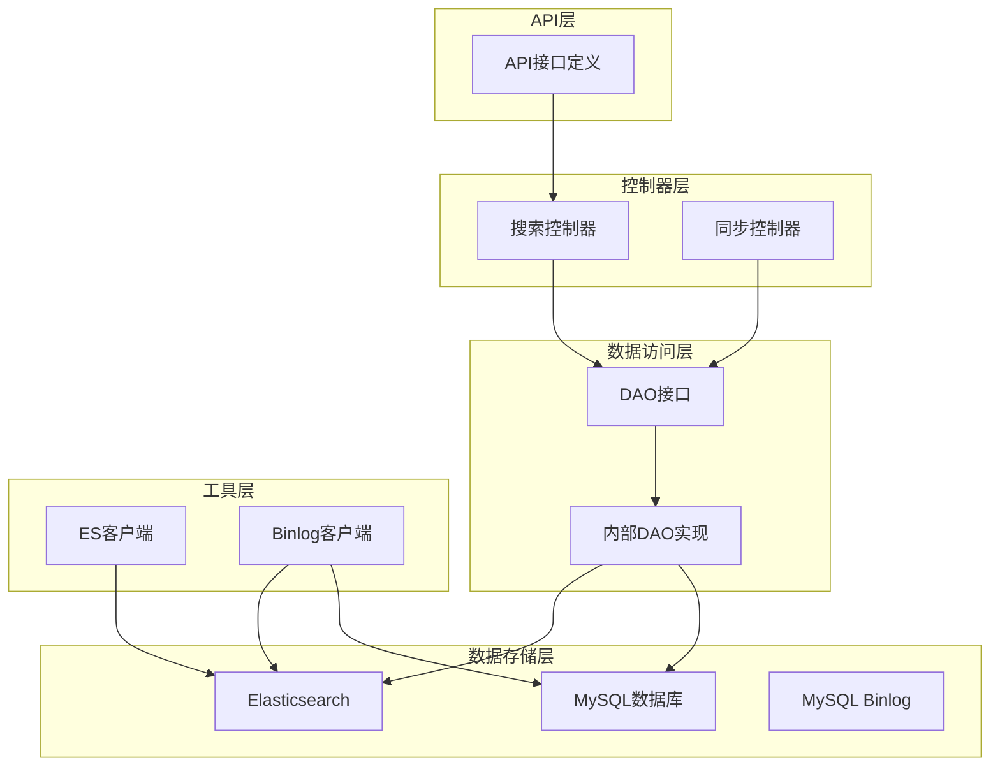
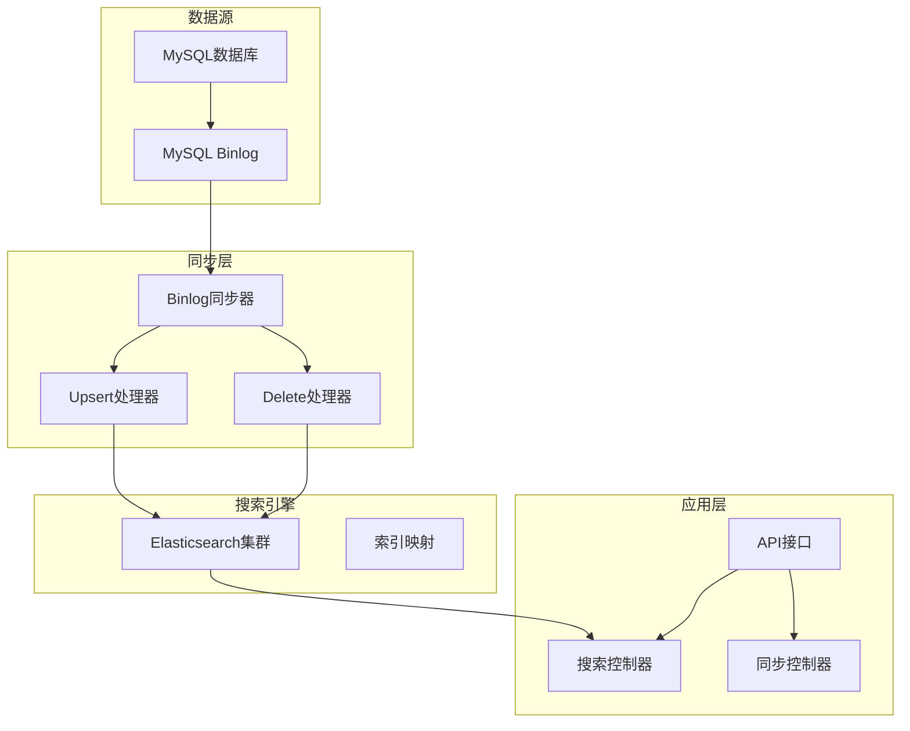
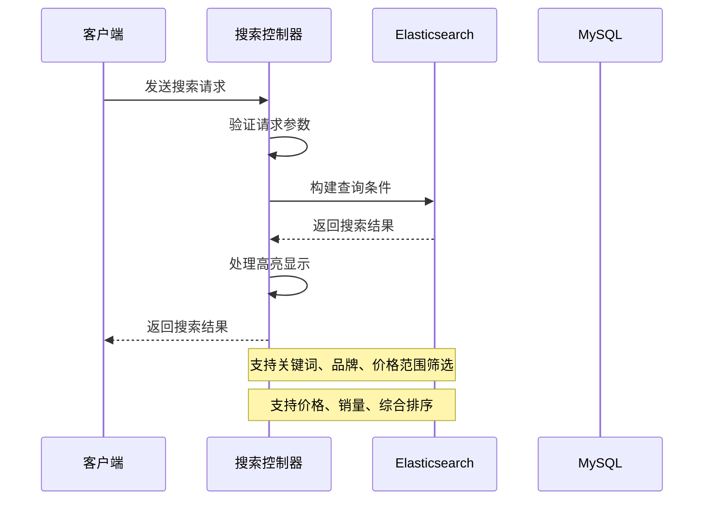
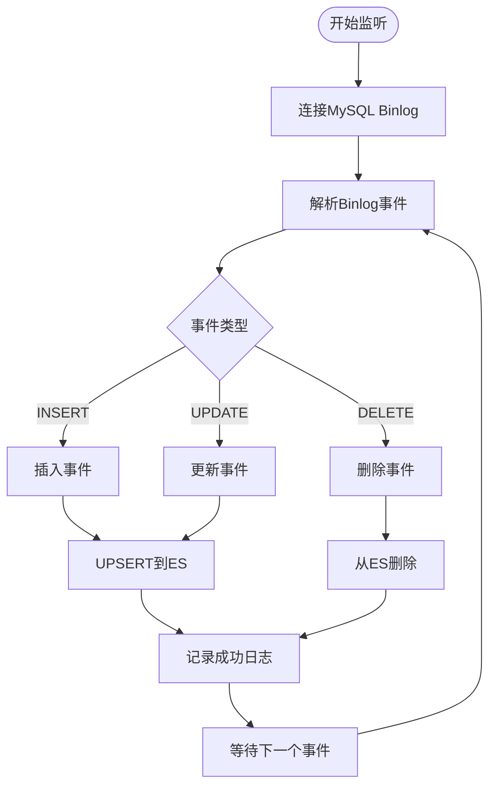
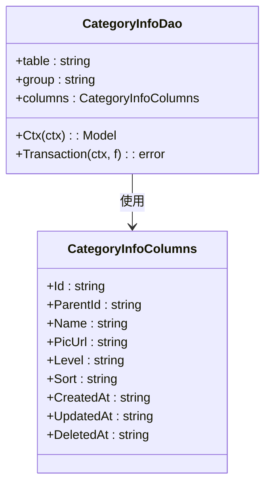
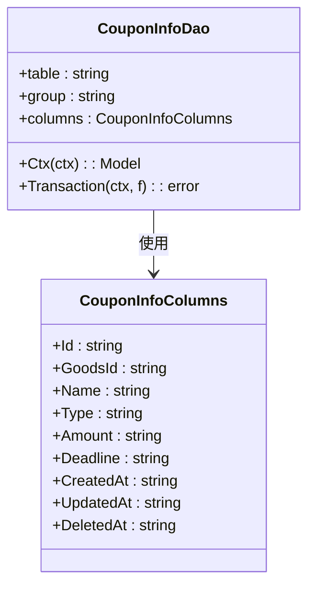
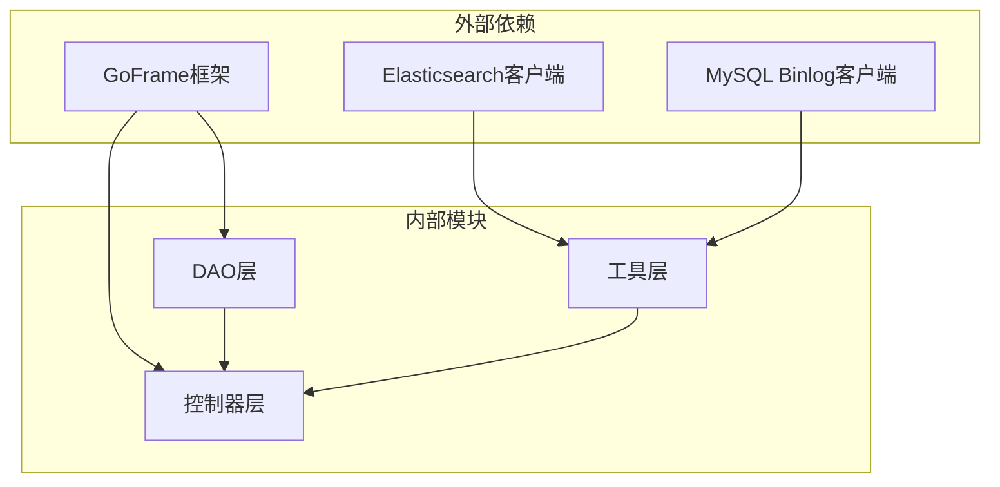

# 搜索数据访问层

<cite>
**本文档引用的文件**
- [app/search/internal/dao/goods_info.go](file://app/search/internal/dao/goods_info.go)
- [app/search/internal/dao/category_info.go](file://app/search/internal/dao/category_info.go)
- [app/search/internal/dao/cart_info.go](file://app/search/internal/dao/cart_info.go)
- [app/search/internal/dao/coupon_info.go](file://app/search/internal/dao/coupon_info.go)
- [app/search/internal/dao/internal/goods_info.go](file://app/search/internal/dao/internal/goods_info.go)
- [app/search/internal/dao/internal/category_info.go](file://app/search/internal/dao/internal/category_info.go)
- [app/search/internal/dao/internal/cart_info.go](file://app/search/internal/dao/internal/cart_info.go)
- [app/search/internal/dao/internal/coupon_info.go](file://app/search/internal/dao/internal/coupon_info.go)
- [app/search/utility/elasticsearch/client.go](file://app/search/utility/elasticsearch/client.go)
- [app/search/utility/binlog/client.go](file://app/search/utility/binlog/client.go)
- [app/search/internal/controller/search/search_v1_search_goods.go](file://app/search/internal/controller/search/search_v1_search_goods.go)
- [app/search/internal/controller/search/search_v1_sync_goods.go](file://app/search/internal/controller/search/search_v1_sync_goods.go)
- [app/search/api/search/v1/search_mysql.go](file://app/search/api/search/v1/search_mysql.go)
- [app/search/api/search/v1/sync.go](file://app/search/api/search/v1/sync.go)
</cite>

## 目录
1. [简介](#简介)
2. [项目结构](#项目结构)
3. [核心组件](#核心组件)
4. [架构概览](#架构概览)
5. [详细组件分析](#详细组件分析)
6. [依赖关系分析](#依赖关系分析)
7. [性能考虑](#性能考虑)
8. [故障排除指南](#故障排除指南)
9. [结论](#结论)

## 简介

搜索数据访问层是微服务架构中的关键组件，负责管理商品搜索相关的数据访问模式。该层采用MySQL和Elasticsearch双引擎架构，实现了数据的实时同步、一致性保证和高性能搜索。

本层主要包含以下核心功能：
- 商品搜索的MySQL和Elasticsearch双引擎数据访问
- 搜索数据的增量同步和全量重建机制
- 数据一致性保证策略
- 搜索性能优化方案
- 分类查询、购物车同步、优惠券查询等搜索相关功能

## 项目结构

搜索数据访问层采用分层架构设计，主要分为以下几个层次：

**图表来源**
- [app/search/internal/dao/goods_info.go](file://app/search/internal/dao/goods_info.go#L1-L23)
- [app/search/utility/elasticsearch/client.go](file://app/search/utility/elasticsearch/client.go#L1-L113)
- [app/search/utility/binlog/client.go](file://app/search/utility/binlog/client.go#L1-L203)

**章节来源**
- [app/search/internal/dao/goods_info.go](file://app/search/internal/dao/goods_info.go#L1-L23)
- [app/search/internal/dao/category_info.go](file://app/search/internal/dao/category_info.go#L1-L23)
- [app/search/internal/dao/cart_info.go](file://app/search/internal/dao/cart_info.go#L1-L23)
- [app/search/internal/dao/coupon_info.go](file://app/search/internal/dao/coupon_info.go#L1-L23)

## 核心组件

### DAO抽象层

搜索数据访问层的核心是DAO（Data Access Object）模式，为每个业务实体提供了统一的数据访问接口。

#### 商品信息DAO
商品信息DAO提供了对商品表的完整数据访问能力，包括基本的CRUD操作和复杂查询。

#### 分类信息DAO  
分类信息DAO负责商品分类的数据访问，支持层级分类结构的查询和管理。

#### 购物车信息DAO
购物车信息DAO处理用户购物车数据的增删改查操作。

#### 优惠券信息DAO
优惠券信息DAO管理优惠券相关数据，支持优惠券的查询和状态管理。

**章节来源**
- [app/search/internal/dao/internal/goods_info.go](file://app/search/internal/dao/internal/goods_info.go#L1-L112)
- [app/search/internal/dao/internal/category_info.go](file://app/search/internal/dao/internal/category_info.go#L1-L96)
- [app/search/internal/dao/internal/cart_info.go](file://app/search/internal/dao/internal/cart_info.go#L1-L90)
- [app/search/internal/dao/internal/coupon_info.go](file://app/search/internal/dao/internal/coupon_info.go#L1-L96)

### Elasticsearch集成

Elasticsearch客户端提供了完整的搜索引擎集成能力，包括索引管理和文档操作。

#### 客户端初始化
- 支持配置化的ES地址和连接参数
- 自动健康检查和连接测试
- 商品索引的自动创建和映射配置

#### 索引映射配置
- 商品名称使用IK分词器进行中文分词
- 多字段支持不同的分析器配置
- 性能优化的字段类型选择

**章节来源**
- [app/search/utility/elasticsearch/client.go](file://app/search/utility/elasticsearch/client.go#L1-L113)

### Binlog同步机制

通过MySQL Binlog实现实时数据同步，确保MySQL和Elasticsearch数据的一致性。

#### 同步流程
- 监听MySQL Binlog事件
- 解析INSERT、UPDATE、DELETE事件
- 实时同步到Elasticsearch
- 错误处理和重试机制

**章节来源**
- [app/search/utility/binlog/client.go](file://app/search/utility/binlog/client.go#L1-L203)

## 架构概览

搜索数据访问层采用双引擎架构，结合传统关系型数据库和现代搜索引擎的优势。

**图表来源**
- [app/search/utility/binlog/client.go](file://app/search/utility/binlog/client.go#L14-L62)
- [app/search/utility/elasticsearch/client.go](file://app/search/utility/elasticsearch/client.go#L52-L112)
- [app/search/internal/controller/search/search_v1_search_goods.go](file://app/search/internal/controller/search/search_v1_search_goods.go#L17-L135)

## 详细组件分析

### 商品搜索功能

商品搜索功能实现了基于关键词的商品检索，支持多种筛选条件和排序方式。

#### 搜索流程

**图表来源**
- [app/search/internal/controller/search/search_v1_search_goods.go](file://app/search/internal/controller/search/search_v1_search_goods.go#L17-L135)

#### 查询条件构建

搜索功能支持多种查询条件的组合：

1. **关键词搜索**：基于商品名称的全文检索
2. **品牌筛选**：精确匹配商品品牌
3. **价格范围**：支持最小值和最大值的范围查询
4. **软删除过滤**：自动过滤已删除的商品记录

#### 排序策略

支持多种排序方式以满足不同场景需求：

- **综合排序**：基于搜索相关性评分
- **价格升序**：按价格从低到高排序
- **价格降序**：按价格从高到低排序
- **销量排序**：按商品销量排序

**章节来源**
- [app/search/internal/controller/search/search_v1_search_goods.go](file://app/search/internal/controller/search/search_v1_search_goods.go#L40-L86)

### 数据同步机制

数据同步机制确保MySQL和Elasticsearch之间的数据一致性。

#### 增量同步流程

**图表来源**
- [app/search/utility/binlog/client.go](file://app/search/utility/binlog/client.go#L64-L86)

#### 同步策略

1. **实时同步**：通过Binlog实现近实时的数据同步
2. **错误处理**：对同步失败的记录进行重试和错误日志记录
3. **数据一致性**：通过事务保证数据的一致性

**章节来源**
- [app/search/utility/binlog/client.go](file://app/search/utility/binlog/client.go#L88-L133)

### 分类查询功能

分类查询功能支持商品分类的层级结构查询和导航。

#### 分类数据模型

**图表来源**
- [app/search/internal/dao/internal/category_info.go](file://app/search/internal/dao/internal/category_info.go#L14-L46)

**章节来源**
- [app/search/internal/dao/internal/category_info.go](file://app/search/internal/dao/internal/category_info.go#L22-L46)

### 购物车同步功能

购物车同步功能处理用户购物车数据的实时更新。

#### 购物车数据模型

购物车数据模型设计简洁明了，支持基本的购物车操作。

**章节来源**
- [app/search/internal/dao/internal/cart_info.go](file://app/search/internal/dao/internal/cart_info.go#L22-L40)

### 优惠券查询功能

优惠券查询功能支持优惠券的检索和状态管理。

#### 优惠券数据模型

**图表来源**
- [app/search/internal/dao/internal/coupon_info.go](file://app/search/internal/dao/internal/coupon_info.go#L22-L46)

**章节来源**
- [app/search/internal/dao/internal/coupon_info.go](file://app/search/internal/dao/internal/coupon_info.go#L22-L46)

## 依赖关系分析

搜索数据访问层的依赖关系清晰明确，各组件职责分离。

**图表来源**
- [app/search/internal/dao/internal/goods_info.go](file://app/search/internal/dao/internal/goods_info.go#L7-L12)
- [app/search/utility/elasticsearch/client.go](file://app/search/utility/elasticsearch/client.go#L3-L8)

### 组件耦合度分析

- **DAO层**：与GoFrame框架深度集成，提供标准化的数据访问接口
- **控制器层**：依赖DAO层和工具层，处理业务逻辑
- **工具层**：独立性强，封装了ES和Binlog的具体实现细节

**章节来源**
- [app/search/internal/dao/internal/goods_info.go](file://app/search/internal/dao/internal/goods_info.go#L74-L112)

## 性能考虑

### 搜索性能优化

1. **索引优化**：针对商品名称使用IK分词器，提高中文搜索效果
2. **字段映射**：合理选择字段类型，平衡存储和查询性能
3. **查询优化**：支持多种排序方式，满足不同场景需求

### 同步性能优化

1. **批量处理**：Binlog事件的批量处理减少网络开销
2. **异步处理**：ES操作采用异步方式进行，提高响应速度
3. **错误重试**：实现智能重试机制，保证数据最终一致性

## 故障排除指南

### 常见问题及解决方案

#### Elasticsearch连接问题
- **症状**：搜索功能不可用，返回连接错误
- **原因**：ES客户端未正确初始化
- **解决方案**：检查ES配置参数，确认服务可用性

#### 数据同步失败
- **症状**：商品数据更新后搜索结果未及时反映
- **原因**：Binlog同步器异常或ES连接失败
- **解决方案**：重启同步器，检查网络连接

#### 搜索结果异常
- **症状**：搜索结果不准确或排序错误
- **原因**：查询条件构建错误或索引映射问题
- **解决方案**：检查查询参数，重新创建索引

**章节来源**
- [app/search/utility/elasticsearch/client.go](file://app/search/utility/elasticsearch/client.go#L13-L44)
- [app/search/utility/binlog/client.go](file://app/search/utility/binlog/client.go#L42-L61)

## 结论

搜索数据访问层通过MySQL和Elasticsearch双引擎架构，实现了高效的商品搜索功能。该架构具有以下优势：

1. **高性能**：利用Elasticsearch的全文检索能力，提供快速的搜索体验
2. **实时性**：通过Binlog实现近实时的数据同步
3. **可扩展性**：模块化设计便于功能扩展和维护
4. **可靠性**：完善的错误处理和重试机制保证系统稳定性

该实现为微服务架构下的搜索功能提供了坚实的技术基础，能够满足电商场景下的各种搜索需求。