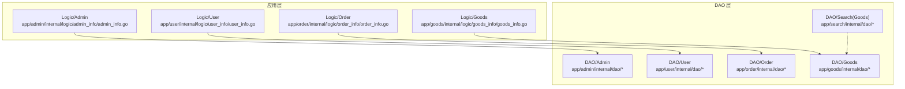
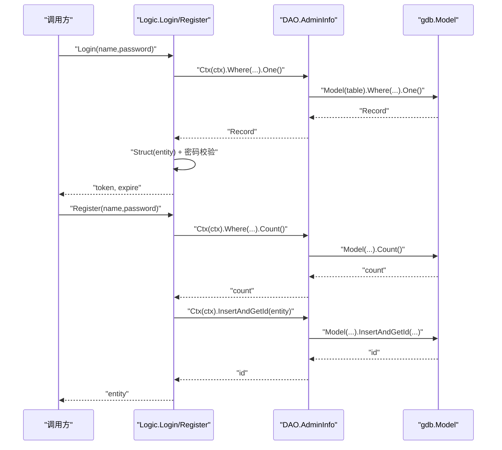
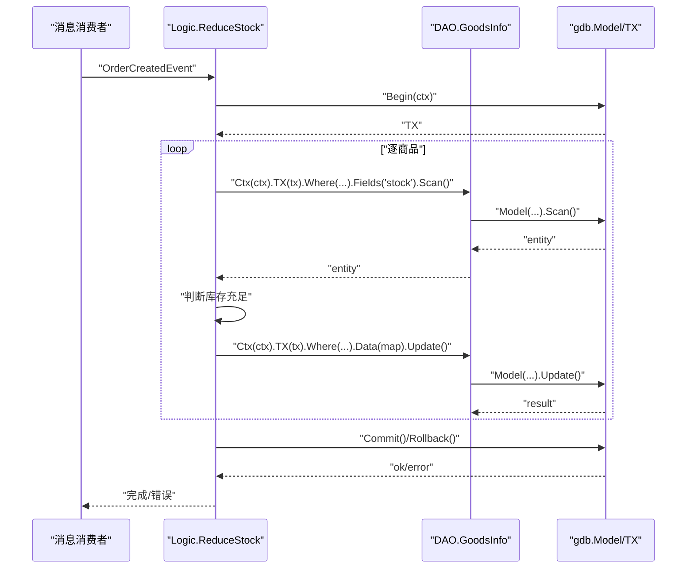
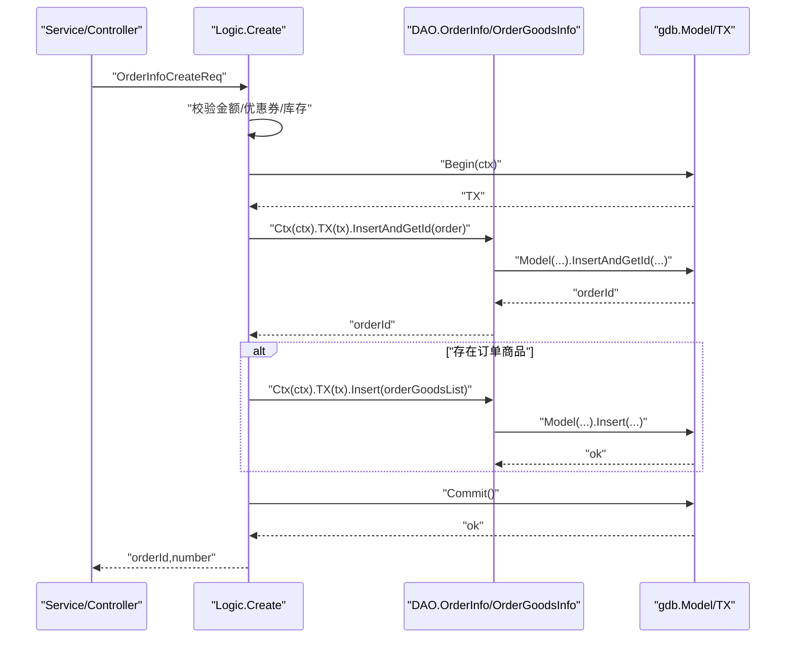
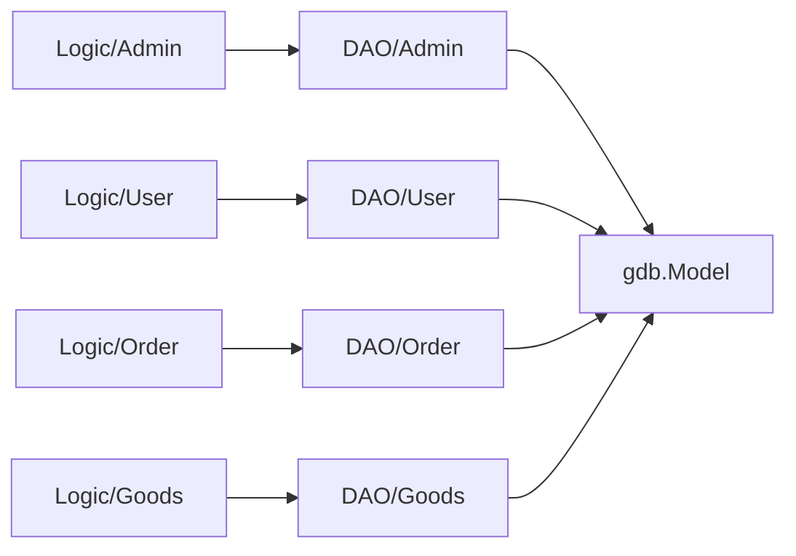

# 数据访问层(DAO)

<cite>
**本文引用的文件**
- [app/admin/internal/dao/admin_info.go](file://app/admin/internal/dao/admin_info.go)
- [app/admin/internal/dao/internal/admin_info.go](file://app/admin/internal/dao/internal/admin_info.go)
- [app/goods/internal/dao/goods_info.go](file://app/goods/internal/dao/goods_info.go)
- [app/goods/internal/dao/internal/goods_info.go](file://app/goods/internal/dao/internal/goods_info.go)
- [app/order/internal/dao/order_info.go](file://app/order/internal/dao/order_info.go)
- [app/order/internal/dao/internal/order_info.go](file://app/order/internal/dao/internal/order_info.go)
- [app/user/internal/dao/user_info.go](file://app/user/internal/dao/user_info.go)
- [app/user/internal/dao/internal/user_info.go](file://app/user/internal/dao/internal/user_info.go)
- [app/search/internal/dao/goods_info.go](file://app/search/internal/dao/goods_info.go)
- [app/search/internal/dao/internal/goods_info.go](file://app/search/internal/dao/internal/goods_info.go)
- [app/admin/internal/logic/admin_info/admin_info.go](file://app/admin/internal/logic/admin_info/admin_info.go)
- [app/goods/internal/logic/goods_info/goods_info.go](file://app/goods/internal/logic/goods_info/goods_info.go)
- [app/order/internal/logic/order_info/order_info.go](file://app/order/internal/logic/order_info/order_info.go)
- [app/user/internal/logic/user_info/user_info.go](file://app/user/internal/logic/user_info/user_info.go)
</cite>

## 目录
1. [引言](#引言)
2. [项目结构](#项目结构)
3. [核心组件](#核心组件)
4. [架构总览](#架构总览)
5. [详细组件分析](#详细组件分析)
6. [依赖关系分析](#依赖关系分析)
7. [性能考量](#性能考量)
8. [故障排查指南](#故障排查指南)
9. [结论](#结论)
10. [附录](#附录)

## 引言
本文件系统化梳理本仓库中的数据访问层(DAO)设计与实现，覆盖以下主题：
- DAO 层职责与接口设计：统一的数据访问抽象、模型封装、上下文与事务支持
- 连接管理与事务：基于 GoFrame 的 gdb 模型与事务封装
- CRUD 实现与批量操作：查询、插入、更新、删除及批量写入
- 查询优化策略：字段选择、分页、聚合统计、索引利用
- 与 Service/Logic 层交互模式：DAO 作为数据源，Logic 组织业务流程
- 错误处理与异常管理：错误包装、状态码、日志与可观测性
- 数据映射与实体转换：Record/Struct/Map 的转换与 ORM 最佳实践

## 项目结构
DAO 层采用“外部公开层 + 内部生成层”的双层结构：
- 外层 public 包：对外暴露全局单例 DAO 对象，便于上层直接调用
- 内层 internal 包：由 GoFrame CLI 自动生成，封装表名、列名、上下文模型、事务等通用能力

```mermaid
graph TB
subgraph "admin 模块"
A_pub["app/admin/internal/dao/admin_info.go<br/>公开层"]
A_int["app/admin/internal/dao/internal/admin_info.go<br/>内部生成层"]
A_pub --> A_int
end
subgraph "goods 模块"
G_pub["app/goods/internal/dao/goods_info.go<br/>公开层"]
G_int["app/goods/internal/dao/internal/goods_info.go<br/>内部生成层"]
G_pub --> G_int
end
subgraph "order 模块"
O_pub["app/order/internal/dao/order_info.go<br/>公开层"]
O_int["app/order/internal/dao/internal/order_info.go<br/>内部生成层"]
O_pub --> O_int
end
subgraph "user 模块"
U_pub["app/user/internal/dao/user_info.go<br/>公开层"]
U_int["app/user/internal/dao/internal/user_info.go<br/>内部生成层"]
U_pub --> U_int
end
subgraph "search 模块"
S_pub["app/search/internal/dao/goods_info.go<br/>公开层"]
S_int["app/search/internal/dao/internal/goods_info.go<br/>内部生成层"]
S_pub --> S_int
end
```

图表来源
- [app/admin/internal/dao/admin_info.go](file://app/admin/internal/dao/admin_info.go#L1-L23)
- [app/admin/internal/dao/internal/admin_info.go](file://app/admin/internal/dao/internal/admin_info.go#L1-L94)
- [app/goods/internal/dao/goods_info.go](file://app/goods/internal/dao/goods_info.go#L1-L23)
- [app/goods/internal/dao/internal/goods_info.go](file://app/goods/internal/dao/internal/goods_info.go#L1-L116)
- [app/order/internal/dao/order_info.go](file://app/order/internal/dao/order_info.go#L1-L23)
- [app/order/internal/dao/internal/order_info.go](file://app/order/internal/dao/internal/order_info.go#L1-L110)
- [app/user/internal/dao/user_info.go](file://app/user/internal/dao/user_info.go#L1-L23)
- [app/user/internal/dao/internal/user_info.go](file://app/user/internal/dao/internal/user_info.go#L1-L106)
- [app/search/internal/dao/goods_info.go](file://app/search/internal/dao/goods_info.go#L1-L23)
- [app/search/internal/dao/internal/goods_info.go](file://app/search/internal/dao/internal/goods_info.go#L1-L112)

章节来源
- [app/admin/internal/dao/admin_info.go](file://app/admin/internal/dao/admin_info.go#L1-L23)
- [app/admin/internal/dao/internal/admin_info.go](file://app/admin/internal/dao/internal/admin_info.go#L1-L94)
- [app/goods/internal/dao/goods_info.go](file://app/goods/internal/dao/goods_info.go#L1-L23)
- [app/goods/internal/dao/internal/goods_info.go](file://app/goods/internal/dao/internal/goods_info.go#L1-L116)
- [app/order/internal/dao/order_info.go](file://app/order/internal/dao/order_info.go#L1-L23)
- [app/order/internal/dao/internal/order_info.go](file://app/order/internal/dao/internal/order_info.go#L1-L110)
- [app/user/internal/dao/user_info.go](file://app/user/internal/dao/user_info.go#L1-L23)
- [app/user/internal/dao/internal/user_info.go](file://app/user/internal/dao/internal/user_info.go#L1-L106)
- [app/search/internal/dao/goods_info.go](file://app/search/internal/dao/goods_info.go#L1-L23)
- [app/search/internal/dao/internal/goods_info.go](file://app/search/internal/dao/internal/goods_info.go#L1-L112)

## 核心组件
- DAO 结构体与列名定义：每个表对应一个 DAO 结构体，内含表名、列名集合、数据库组名等
- 上下文模型 Ctx：自动注入 context，支持安全模型与链式条件
- 事务封装 Transaction：统一事务入口，避免重复提交/回滚
- 典型 CRUD 方法族：Where/Fields/Scan/One/Count/Insert/InsertAndGetId/Update/Delete/Save/Remove 等
- 批量写入：Insert/Replace/Save 等支持批量参数
- 聚合与分组：Fields + Group + Count 统计

章节来源
- [app/admin/internal/dao/internal/admin_info.go](file://app/admin/internal/dao/internal/admin_info.go#L14-L94)
- [app/goods/internal/dao/internal/goods_info.go](file://app/goods/internal/dao/internal/goods_info.go#L14-L116)
- [app/order/internal/dao/internal/order_info.go](file://app/order/internal/dao/internal/order_info.go#L14-L110)
- [app/user/internal/dao/internal/user_info.go](file://app/user/internal/dao/internal/user_info.go#L14-L106)
- [app/search/internal/dao/internal/goods_info.go](file://app/search/internal/dao/internal/goods_info.go#L14-L112)

## 架构总览
DAO 层位于各模块内部，向上被 Logic/Service 层调用；内部通过 gdb.Model 提供统一的查询与事务能力。

图表来源
- [app/admin/internal/logic/admin_info/admin_info.go](file://app/admin/internal/logic/admin_info/admin_info.go#L1-L96)
- [app/user/internal/logic/user_info/user_info.go](file://app/user/internal/logic/user_info/user_info.go#L1-L235)
- [app/order/internal/logic/order_info/order_info.go](file://app/order/internal/logic/order_info/order_info.go#L1-L502)
- [app/goods/internal/logic/goods_info/goods_info.go](file://app/goods/internal/logic/goods_info/goods_info.go#L1-L139)
- [app/admin/internal/dao/admin_info.go](file://app/admin/internal/dao/admin_info.go#L1-L23)
- [app/user/internal/dao/user_info.go](file://app/user/internal/dao/user_info.go#L1-L23)
- [app/order/internal/dao/order_info.go](file://app/order/internal/dao/order_info.go#L1-L23)
- [app/goods/internal/dao/goods_info.go](file://app/goods/internal/dao/goods_info.go#L1-L23)
- [app/search/internal/dao/goods_info.go](file://app/search/internal/dao/goods_info.go#L1-L23)

## 详细组件分析

### AdminInfo DAO 分析
- 设计要点
  - 表 admin_info 的列名集合集中定义，便于统一引用
  - 通过 Ctx(ctx) 自动注入上下文，保证链路追踪与超时控制
  - Transaction(ctx, f) 封装事务，避免重复提交/回滚
- 典型用法
  - 登录：按用户名查询一条记录，结构化为实体，校验密码后生成令牌
  - 注册：校验参数与唯一性，生成盐与加密密码，插入并返回自增 ID

图表来源
- [app/admin/internal/logic/admin_info/admin_info.go](file://app/admin/internal/logic/admin_info/admin_info.go#L15-L95)
- [app/admin/internal/dao/internal/admin_info.go](file://app/admin/internal/dao/internal/admin_info.go#L76-L94)

章节来源
- [app/admin/internal/dao/admin_info.go](file://app/admin/internal/dao/admin_info.go#L1-L23)
- [app/admin/internal/dao/internal/admin_info.go](file://app/admin/internal/dao/internal/admin_info.go#L14-L94)
- [app/admin/internal/logic/admin_info/admin_info.go](file://app/admin/internal/logic/admin_info/admin_info.go#L15-L95)

### GoodsInfo DAO 分析
- 设计要点
  - 列名集合覆盖库存、价格、分类、标签等业务字段
  - 支持 TX 模式在传入的事务上下文中执行
- 典型用法
  - 减少库存：在事务中逐商品查询、判断、更新库存，并异步清理缓存
  - 归还库存：并发 goroutine 查询并更新库存，收集失败项

图表来源
- [app/goods/internal/logic/goods_info/goods_info.go](file://app/goods/internal/logic/goods_info/goods_info.go#L83-L138)
- [app/goods/internal/dao/internal/goods_info.go](file://app/goods/internal/dao/internal/goods_info.go#L98-L116)

章节来源
- [app/goods/internal/dao/goods_info.go](file://app/goods/internal/dao/goods_info.go#L1-L23)
- [app/goods/internal/dao/internal/goods_info.go](file://app/goods/internal/dao/internal/goods_info.go#L14-L116)
- [app/goods/internal/logic/goods_info/goods_info.go](file://app/goods/internal/logic/goods_info/goods_info.go#L83-L138)

### OrderInfo DAO 分析
- 设计要点
  - 订单主表与订单商品表分离，支持复杂联表查询与聚合统计
  - 通过 g.DB().Begin(ctx) 显式开启事务，确保一致性
- 典型用法
  - 创建订单：校验金额与库存，事务内插入主订单与订单商品，发布后续事件
  - 查询详情/列表：按用户与状态过滤，分页与聚合统计
  - 更新状态：根据状态变更设置支付时间等字段

图表来源
- [app/order/internal/logic/order_info/order_info.go](file://app/order/internal/logic/order_info/order_info.go#L27-L212)
- [app/order/internal/dao/internal/order_info.go](file://app/order/internal/dao/internal/order_info.go#L92-L110)

章节来源
- [app/order/internal/dao/order_info.go](file://app/order/internal/dao/order_info.go#L1-L23)
- [app/order/internal/dao/internal/order_info.go](file://app/order/internal/dao/internal/order_info.go#L14-L110)
- [app/order/internal/logic/order_info/order_info.go](file://app/order/internal/logic/order_info/order_info.go#L27-L212)

### UserInfo DAO 分析
- 设计要点
  - 支持用户名、微信 OpenId 等多种登录方式
  - 密码加密与盐值管理在 Logic 层完成，DAO 专注数据持久化
- 典型用法
  - 登录：按用户名查询，结构化为实体，校验密码后生成令牌
  - 注册：校验唯一性，生成盐与加密密码，插入并返回自增 ID
  - 修改密码：先读取旧密码与盐，再更新新密码

章节来源
- [app/user/internal/dao/user_info.go](file://app/user/internal/dao/user_info.go#L1-L23)
- [app/user/internal/dao/internal/user_info.go](file://app/user/internal/dao/internal/user_info.go#L14-L106)
- [app/user/internal/logic/user_info/user_info.go](file://app/user/internal/logic/user_info/user_info.go#L15-L235)

### Search 模块 GoodsInfo DAO 分析
- 设计要点
  - 与 goods 模块的 GoodsInfo DAO 结构一致，服务于搜索场景
  - 通过内部生成层复用列名与上下文模型能力

章节来源
- [app/search/internal/dao/goods_info.go](file://app/search/internal/dao/goods_info.go#L1-L23)
- [app/search/internal/dao/internal/goods_info.go](file://app/search/internal/dao/internal/goods_info.go#L14-L112)

## 依赖关系分析
- DAO 与 Logic 的耦合度低：Logic 仅依赖 DAO 的公开层，内部生成层对 Logic 不可见
- DAO 与数据库：统一通过 gdb.Model 提供链式 API，支持 TX、上下文、安全模型
- DAO 与实体：通过 Record/Struct/Map 转换，避免直接操作原始字段
- DAO 与事务：显式事务优先，必要时使用 DAO.Transaction 封装

图表来源
- [app/admin/internal/logic/admin_info/admin_info.go](file://app/admin/internal/logic/admin_info/admin_info.go#L1-L96)
- [app/user/internal/logic/user_info/user_info.go](file://app/user/internal/logic/user_info/user_info.go#L1-L235)
- [app/order/internal/logic/order_info/order_info.go](file://app/order/internal/logic/order_info/order_info.go#L1-L502)
- [app/goods/internal/logic/goods_info/goods_info.go](file://app/goods/internal/logic/goods_info/goods_info.go#L1-L139)
- [app/admin/internal/dao/internal/admin_info.go](file://app/admin/internal/dao/internal/admin_info.go#L76-L94)
- [app/user/internal/dao/internal/user_info.go](file://app/user/internal/dao/internal/user_info.go#L88-L106)
- [app/order/internal/dao/internal/order_info.go](file://app/order/internal/dao/internal/order_info.go#L92-L110)
- [app/goods/internal/dao/internal/goods_info.go](file://app/goods/internal/dao/internal/goods_info.go#L98-L116)

## 性能考量
- 字段选择与投影：优先使用 Fields 指定所需列，减少网络与内存开销
- 分页与排序：Page + Order 控制结果规模与顺序，避免一次性加载全量数据
- 聚合统计：使用 Fields("col, COUNT(*)") + Group 进行服务端聚合
- 批量写入：Insert/Replace/Save 支持批量参数，减少往返次数
- 并发更新：在库存等高冲突场景，结合 TX 与原子更新策略
- 缓存协同：事务完成后异步清理缓存，降低热点读压力

## 故障排查指南
- 常见错误类型
  - 参数校验失败：返回明确提示，避免进入数据库层
  - 查询为空：检查 Where 条件与唯一性约束
  - 事务异常：捕获错误并回滚，记录日志与指标
  - 并发更新失败：使用 TX 或乐观锁策略
- 日志与指标
  - 使用 g.Log 记录关键路径与错误堆栈
  - 在订单创建等关键路径记录业务指标，辅助容量规划
- 事务处理
  - 显式事务：Begin -> Commit/Rollback
  - DAO 事务封装：DAO.Transaction(ctx, f)，避免重复提交/回滚

章节来源
- [app/admin/internal/logic/admin_info/admin_info.go](file://app/admin/internal/logic/admin_info/admin_info.go#L15-L95)
- [app/goods/internal/logic/goods_info/goods_info.go](file://app/goods/internal/logic/goods_info/goods_info.go#L83-L138)
- [app/order/internal/logic/order_info/order_info.go](file://app/order/internal/logic/order_info/order_info.go#L104-L174)
- [app/user/internal/logic/user_info/user_info.go](file://app/user/internal/logic/user_info/user_info.go#L95-L131)

## 结论
本项目的 DAO 层遵循清晰的分层与职责划分：内部生成层提供统一的数据库访问能力，外部公开层面向上层提供简洁易用的接口。通过 gdb.Model 的链式 API、事务封装与上下文注入，DAO 层在保证一致性的同时提供了良好的扩展性与可维护性。配合 Logic 层的业务编排与错误处理，整体实现了高内聚、低耦合的数据访问体系。

## 附录
- 最佳实践清单
  - 明确区分 DAO 与 Logic 的职责边界
  - 优先使用 Ctx(ctx) 与安全模型，确保上下文传播
  - 事务内尽量减少跨服务调用，必要时使用最终一致性
  - 使用 Fields/Group/Page 等手段优化查询性能
  - 对并发敏感的写入使用 TX 或原子更新
  - 对热点数据配合缓存与异步刷新策略