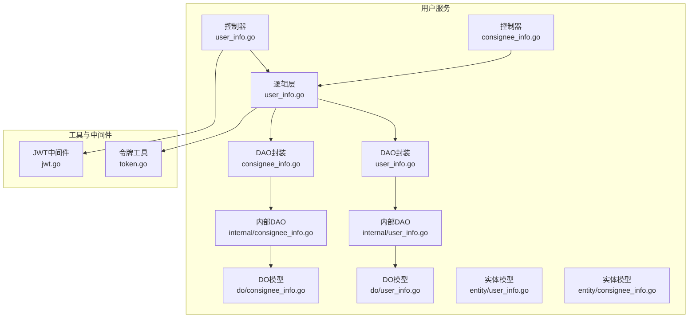
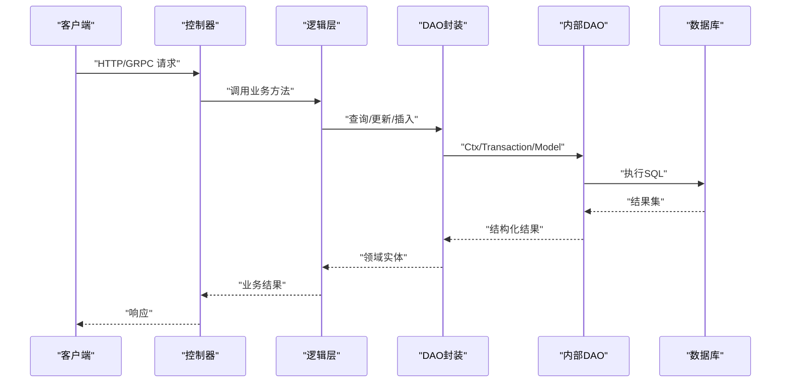
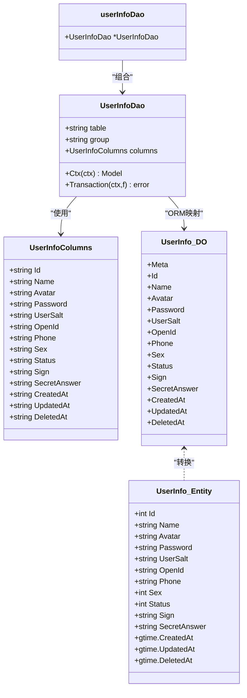
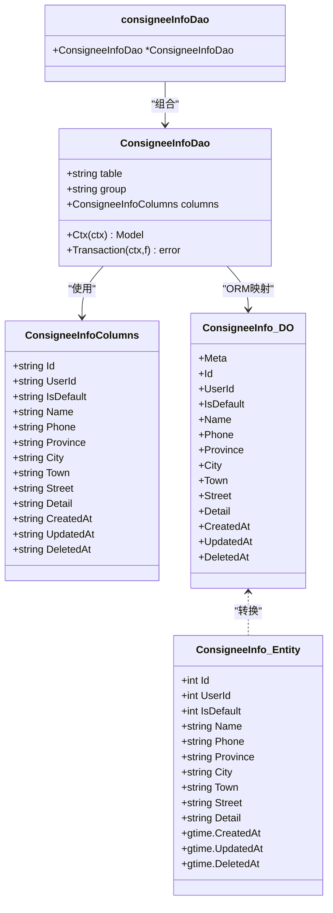
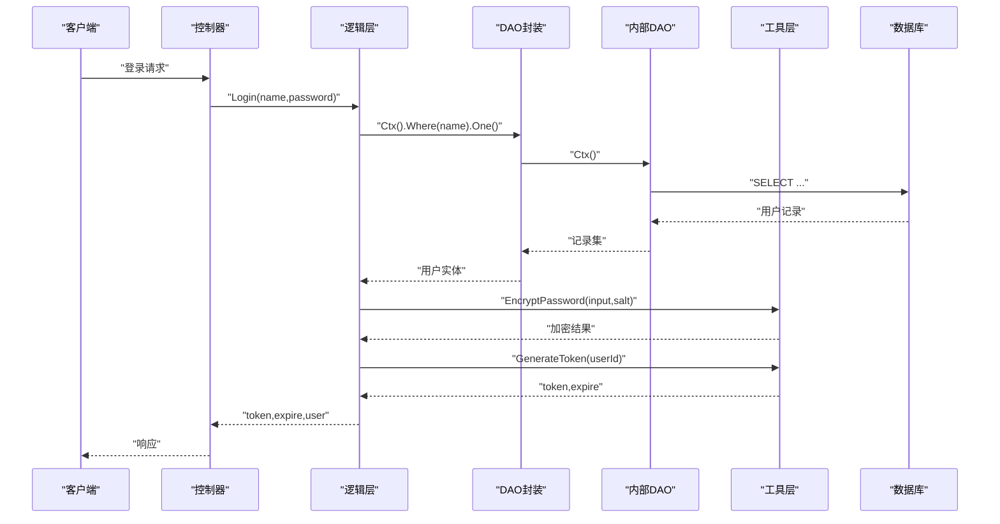
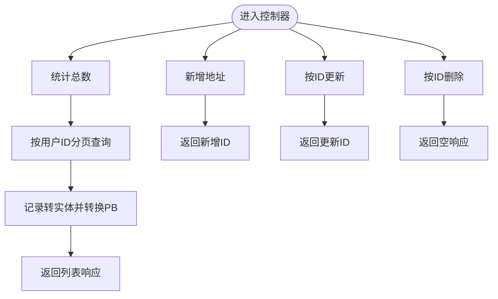
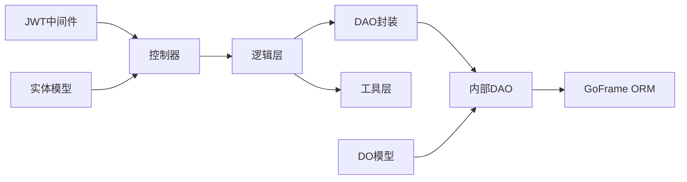

# 用户数据访问层

<cite>
**本文引用的文件**
- [app/user/internal/dao/user_info.go](file://app/user/internal/dao/user_info.go)
- [app/user/internal/dao/consignee_info.go](file://app/user/internal/dao/consignee_info.go)
- [app/user/internal/dao/internal/user_info.go](file://app/user/internal/dao/internal/user_info.go)
- [app/user/internal/dao/internal/consignee_info.go](file://app/user/internal/dao/internal/consignee_info.go)
- [app/user/internal/model/do/user_info.go](file://app/user/internal/model/do/user_info.go)
- [app/user/internal/model/do/consignee_info.go](file://app/user/internal/model/do/consignee_info.go)
- [app/user/internal/model/entity/user_info.go](file://app/user/internal/model/entity/user_info.go)
- [app/user/internal/model/entity/consignee_info.go](file://app/user/internal/model/entity/consignee_info.go)
- [app/user/internal/controller/user_info/user_info.go](file://app/user/internal/controller/user_info/user_info.go)
- [app/user/internal/controller/consignee_info/consignee_info.go](file://app/user/internal/controller/consignee_info/consignee_info.go)
- [app/user/internal/logic/user_info/user_info.go](file://app/user/internal/logic/user_info/user_info.go)
- [utility/token.go](file://utility/token.go)
- [utility/middleware/jwt.go](file://utility/middleware/jwt.go)
- [app/user/hack/user_info.sql](file://app/user/hack/user_info.sql)
- [doc/Redis缓存策略-穿透-击穿-雪崩全解决方案.md](file://doc/Redis缓存策略-穿透-击穿-雪崩全解决方案.md)
</cite>

## 目录
1. [简介](#简介)
2. [项目结构](#项目结构)
3. [核心组件](#核心组件)
4. [架构总览](#架构总览)
5. [组件详细分析](#组件详细分析)
6. [依赖关系分析](#依赖关系分析)
7. [性能考量](#性能考量)
8. [故障排查指南](#故障排查指南)
9. [结论](#结论)
10. [附录](#附录)

## 简介
本文件聚焦于用户数据访问层的设计与实现，覆盖用户信息与收货地址两大模块的DAO层、模型层、控制器层与逻辑层协作关系；详述数据库表结构映射、CRUD操作实现、查询优化策略、用户认证与密码加密处理、权限相关数据管理思路、以及与缓存层的交互模式与一致性保障。文档同时给出用户注册、登录验证、个人信息修改等核心业务的数据访问实现路径，并提供性能优化与故障排查建议。

## 项目结构
用户数据访问层位于独立的服务模块中，采用“控制器-逻辑-数据访问-模型”的分层组织方式，配合GoFrame ORM进行数据库操作，结合JWT中间件完成鉴权。

图表来源
- [app/user/internal/controller/user_info/user_info.go](file://app/user/internal/controller/user_info/user_info.go#L1-L268)
- [app/user/internal/controller/consignee_info/consignee_info.go](file://app/user/internal/controller/consignee_info/consignee_info.go#L1-L122)
- [app/user/internal/logic/user_info/user_info.go](file://app/user/internal/logic/user_info/user_info.go#L1-L132)
- [app/user/internal/dao/user_info.go](file://app/user/internal/dao/user_info.go#L1-L23)
- [app/user/internal/dao/consignee_info.go](file://app/user/internal/dao/consignee_info.go#L1-L23)
- [app/user/internal/dao/internal/user_info.go](file://app/user/internal/dao/internal/user_info.go#L1-L106)
- [app/user/internal/dao/internal/consignee_info.go](file://app/user/internal/dao/internal/consignee_info.go#L1-L104)
- [app/user/internal/model/do/user_info.go](file://app/user/internal/model/do/user_info.go#L1-L30)
- [app/user/internal/model/do/consignee_info.go](file://app/user/internal/model/do/consignee_info.go#L1-L29)
- [app/user/internal/model/entity/user_info.go](file://app/user/internal/model/entity/user_info.go#L1-L28)
- [app/user/internal/model/entity/consignee_info.go](file://app/user/internal/model/entity/consignee_info.go#L1-L27)
- [utility/token.go](file://utility/token.go#L1-L65)
- [utility/middleware/jwt.go](file://utility/middleware/jwt.go#L1-L39)

章节来源
- [app/user/internal/dao/user_info.go](file://app/user/internal/dao/user_info.go#L1-L23)
- [app/user/internal/dao/consignee_info.go](file://app/user/internal/dao/consignee_info.go#L1-L23)
- [app/user/internal/dao/internal/user_info.go](file://app/user/internal/dao/internal/user_info.go#L1-L106)
- [app/user/internal/dao/internal/consignee_info.go](file://app/user/internal/dao/internal/consignee_info.go#L1-L104)
- [app/user/internal/model/do/user_info.go](file://app/user/internal/model/do/user_info.go#L1-L30)
- [app/user/internal/model/do/consignee_info.go](file://app/user/internal/model/do/consignee_info.go#L1-L29)
- [app/user/internal/model/entity/user_info.go](file://app/user/internal/model/entity/user_info.go#L1-L28)
- [app/user/internal/model/entity/consignee_info.go](file://app/user/internal/model/entity/consignee_info.go#L1-L27)
- [app/user/internal/controller/user_info/user_info.go](file://app/user/internal/controller/user_info/user_info.go#L1-L268)
- [app/user/internal/controller/consignee_info/consignee_info.go](file://app/user/internal/controller/consignee_info/consignee_info.go#L1-L122)
- [app/user/internal/logic/user_info/user_info.go](file://app/user/internal/logic/user_info/user_info.go#L1-L132)
- [utility/token.go](file://utility/token.go#L1-L65)
- [utility/middleware/jwt.go](file://utility/middleware/jwt.go#L1-L39)

## 核心组件
- DAO封装层：对外暴露全局单例，内部委托内部DAO实现具体数据库操作。
- 内部DAO层：封装表名、列名、事务、上下文模型等通用能力。
- 模型层：DO模型用于ORM条件构造，实体模型用于对外传输与序列化。
- 控制器层：接收请求、参数校验、调用逻辑层、返回响应。
- 逻辑层：业务编排、密码加密、JWT签发、调用DAO完成持久化。
- 工具与中间件：令牌生成/解析、JWT鉴权中间件。

章节来源
- [app/user/internal/dao/user_info.go](file://app/user/internal/dao/user_info.go#L11-L20)
- [app/user/internal/dao/consignee_info.go](file://app/user/internal/dao/consignee_info.go#L11-L20)
- [app/user/internal/dao/internal/user_info.go](file://app/user/internal/dao/internal/user_info.go#L14-L105)
- [app/user/internal/dao/internal/consignee_info.go](file://app/user/internal/dao/internal/consignee_info.go#L14-L103)
- [app/user/internal/model/do/user_info.go](file://app/user/internal/model/do/user_info.go#L12-L29)
- [app/user/internal/model/do/consignee_info.go](file://app/user/internal/model/do/consignee_info.go#L12-L28)
- [app/user/internal/model/entity/user_info.go](file://app/user/internal/model/entity/user_info.go#L11-L27)
- [app/user/internal/model/entity/consignee_info.go](file://app/user/internal/model/entity/consignee_info.go#L11-L26)
- [app/user/internal/controller/user_info/user_info.go](file://app/user/internal/controller/user_info/user_info.go#L29-L35)
- [app/user/internal/controller/consignee_info/consignee_info.go](file://app/user/internal/controller/consignee_info/consignee_info.go#L19-L25)
- [app/user/internal/logic/user_info/user_info.go](file://app/user/internal/logic/user_info/user_info.go#L15-L51)
- [utility/token.go](file://utility/token.go#L20-L50)
- [utility/middleware/jwt.go](file://utility/middleware/jwt.go#L16-L38)

## 架构总览
用户数据访问层遵循“控制器-逻辑-DAO-模型”的分层架构，结合GoFrame ORM与JWT中间件，形成清晰的职责边界与可扩展的数据访问模式。

图表来源
- [app/user/internal/controller/user_info/user_info.go](file://app/user/internal/controller/user_info/user_info.go#L37-L69)
- [app/user/internal/logic/user_info/user_info.go](file://app/user/internal/logic/user_info/user_info.go#L15-L51)
- [app/user/internal/dao/user_info.go](file://app/user/internal/dao/user_info.go#L13-L19)
- [app/user/internal/dao/internal/user_info.go](file://app/user/internal/dao/internal/user_info.go#L88-L95)

## 组件详细分析

### 用户信息DAO与模型映射
- DAO封装：通过全局变量导出用户信息DAO实例，内部持有内部DAO指针，提供扩展方法入口。
- 内部DAO：定义表名、列名集合、上下文模型、事务包装等通用能力。
- DO模型：用于Where/Select/Data等ORM条件构造，屏蔽底层字段差异。
- 实体模型：面向传输的强类型结构，包含时间字段与注释描述。

图表来源
- [app/user/internal/dao/user_info.go](file://app/user/internal/dao/user_info.go#L13-L19)
- [app/user/internal/dao/internal/user_info.go](file://app/user/internal/dao/internal/user_info.go#L14-L81)
- [app/user/internal/model/do/user_info.go](file://app/user/internal/model/do/user_info.go#L12-L29)
- [app/user/internal/model/entity/user_info.go](file://app/user/internal/model/entity/user_info.go#L11-L27)

章节来源
- [app/user/internal/dao/user_info.go](file://app/user/internal/dao/user_info.go#L11-L20)
- [app/user/internal/dao/internal/user_info.go](file://app/user/internal/dao/internal/user_info.go#L14-L105)
- [app/user/internal/model/do/user_info.go](file://app/user/internal/model/do/user_info.go#L12-L29)
- [app/user/internal/model/entity/user_info.go](file://app/user/internal/model/entity/user_info.go#L11-L27)

### 收货地址DAO与模型映射
- DAO封装：提供全局单例ConsigeeInfo，委托内部DAO执行CRUD。
- 内部DAO：定义表名、列名集合、上下文模型、事务包装。
- DO/实体模型：与用户信息类似，面向ORM条件构造与对外传输。

图表来源
- [app/user/internal/dao/consignee_info.go](file://app/user/internal/dao/consignee_info.go#L13-L19)
- [app/user/internal/dao/internal/consignee_info.go](file://app/user/internal/dao/internal/consignee_info.go#L14-L83)
- [app/user/internal/model/do/consignee_info.go](file://app/user/internal/model/do/consignee_info.go#L12-L28)
- [app/user/internal/model/entity/consignee_info.go](file://app/user/internal/model/entity/consignee_info.go#L11-L26)

章节来源
- [app/user/internal/dao/consignee_info.go](file://app/user/internal/dao/consignee_info.go#L11-L20)
- [app/user/internal/dao/internal/consignee_info.go](file://app/user/internal/dao/internal/consignee_info.go#L14-L103)
- [app/user/internal/model/do/consignee_info.go](file://app/user/internal/model/do/consignee_info.go#L12-L28)
- [app/user/internal/model/entity/consignee_info.go](file://app/user/internal/model/entity/consignee_info.go#L11-L26)

### 用户认证与密码加密
- 登录流程：控制器调用逻辑层，逻辑层查询用户、校验密码、生成JWT并返回过期时间。
- 注册流程：逻辑层校验参数、生成盐值、双重MD5加密密码、设置默认状态并入库。
- 密码加密：工具层提供盐值生成与双重MD5加密；JWT中间件负责鉴权。
- 微信小程序登录：控制器发起微信授权，逻辑层绑定或创建用户并签发JWT。

图表来源
- [app/user/internal/controller/user_info/user_info.go](file://app/user/internal/controller/user_info/user_info.go#L37-L69)
- [app/user/internal/logic/user_info/user_info.go](file://app/user/internal/logic/user_info/user_info.go#L15-L51)
- [utility/token.go](file://utility/token.go#L25-L50)

章节来源
- [app/user/internal/controller/user_info/user_info.go](file://app/user/internal/controller/user_info/user_info.go#L37-L69)
- [app/user/internal/logic/user_info/user_info.go](file://app/user/internal/logic/user_info/user_info.go#L15-L51)
- [utility/token.go](file://utility/token.go#L20-L50)
- [utility/middleware/jwt.go](file://utility/middleware/jwt.go#L16-L38)

### 收货地址CRUD与分页查询
- 列表查询：统计总数、按用户ID过滤、分页读取、转换为PB实体并返回。
- 新增/更新/删除：使用InsertAndGetId、Where().Update、Where().Delete完成标准CRUD。

图表来源
- [app/user/internal/controller/consignee_info/consignee_info.go](file://app/user/internal/controller/consignee_info/consignee_info.go#L27-L78)
- [app/user/internal/controller/consignee_info/consignee_info.go](file://app/user/internal/controller/consignee_info/consignee_info.go#L80-L121)

章节来源
- [app/user/internal/controller/consignee_info/consignee_info.go](file://app/user/internal/controller/consignee_info/consignee_info.go#L27-L121)

### 数据库表结构映射
- 用户信息表：包含用户名、头像、密码、盐值、OpenID、手机号、性别、状态、签名、密保答案及时间戳。
- 收货地址表：包含用户ID、默认标志、收件人姓名电话、省市区县、街道详情及时间戳。

章节来源
- [app/user/hack/user_info.sql](file://app/user/hack/user_info.sql#L4-L21)
- [app/user/hack/user_info.sql](file://app/user/hack/user_info.sql#L36-L52)

## 依赖关系分析
- 控制器依赖逻辑层；逻辑层依赖DAO封装；DAO封装依赖内部DAO；内部DAO依赖GoFrame ORM与数据库。
- 工具层提供密码加密与JWT签发；JWT中间件在HTTP层拦截并注入用户上下文。
- 模型层DO与实体分离，前者用于ORM条件构造，后者用于对外传输。

图表来源
- [app/user/internal/controller/user_info/user_info.go](file://app/user/internal/controller/user_info/user_info.go#L29-L35)
- [app/user/internal/logic/user_info/user_info.go](file://app/user/internal/logic/user_info/user_info.go#L15-L51)
- [app/user/internal/dao/user_info.go](file://app/user/internal/dao/user_info.go#L13-L19)
- [app/user/internal/dao/internal/user_info.go](file://app/user/internal/dao/internal/user_info.go#L88-L95)
- [utility/token.go](file://utility/token.go#L25-L50)
- [utility/middleware/jwt.go](file://utility/middleware/jwt.go#L16-L38)
- [app/user/internal/model/do/user_info.go](file://app/user/internal/model/do/user_info.go#L12-L29)
- [app/user/internal/model/entity/user_info.go](file://app/user/internal/model/entity/user_info.go#L11-L27)

章节来源
- [app/user/internal/controller/user_info/user_info.go](file://app/user/internal/controller/user_info/user_info.go#L29-L35)
- [app/user/internal/logic/user_info/user_info.go](file://app/user/internal/logic/user_info/user_info.go#L15-L51)
- [app/user/internal/dao/user_info.go](file://app/user/internal/dao/user_info.go#L13-L19)
- [app/user/internal/dao/internal/user_info.go](file://app/user/internal/dao/internal/user_info.go#L88-L95)
- [utility/token.go](file://utility/token.go#L25-L50)
- [utility/middleware/jwt.go](file://utility/middleware/jwt.go#L16-L38)
- [app/user/internal/model/do/user_info.go](file://app/user/internal/model/do/user_info.go#L12-L29)
- [app/user/internal/model/entity/user_info.go](file://app/user/internal/model/entity/user_info.go#L11-L27)

## 性能考量
- 查询优化
  - 使用列名枚举与Where条件精确匹配，避免全表扫描。
  - 对高频查询建立合适索引（如用户表的用户名、OpenID，收货地址表的user_id）。
  - 分页查询时仅选择必要字段，避免SELECT *。
- 事务与并发
  - 通过内部DAO的Transaction封装统一事务边界，避免重复提交/回滚。
  - 对高并发写入场景，结合数据库层面的唯一约束与幂等设计。
- 缓存策略
  - 可借鉴通用缓存策略实现，针对用户信息与地址列表采用“空值缓存、本地互斥锁、抖动过期”等手段，缓解缓存穿透、击穿与雪崩。
  - 更新后采用延迟双删策略，确保缓存与数据库最终一致。

章节来源
- [doc/Redis缓存策略-穿透-击穿-雪崩全解决方案.md](file://doc/Redis缓存策略-穿透-击穿-雪崩全解决方案.md#L181-L564)

## 故障排查指南
- 登录失败
  - 检查用户名是否存在、密码加密算法与盐值是否匹配。
  - 关注控制器与逻辑层的日志输出，定位数据库查询与加密环节。
- 注册失败
  - 校验用户名唯一性、密码长度与盐值生成。
  - 观察插入ID与默认状态设置是否正确。
- 收货地址异常
  - 检查用户ID过滤条件、分页参数与实体转换过程。
  - 确认删除/更新是否按ID执行且无并发冲突。
- JWT鉴权失败
  - 核对Header中的Authorization格式、签名密钥与过期时间。
  - 中间件解析失败时，确认Token有效性与上下文注入。

章节来源
- [app/user/internal/controller/user_info/user_info.go](file://app/user/internal/controller/user_info/user_info.go#L37-L69)
- [app/user/internal/logic/user_info/user_info.go](file://app/user/internal/logic/user_info/user_info.go#L53-L93)
- [app/user/internal/controller/consignee_info/consignee_info.go](file://app/user/internal/controller/consignee_info/consignee_info.go#L27-L121)
- [utility/middleware/jwt.go](file://utility/middleware/jwt.go#L16-L38)

## 结论
用户数据访问层以清晰的分层与模型分离为基础，结合GoFrame ORM与JWT中间件，提供了稳定可靠的用户信息与收货地址数据访问能力。通过密码加密、事务封装与可扩展的DAO设计，能够满足注册、登录、信息修改等核心业务需求。配合缓存策略与索引优化，可在高并发场景下进一步提升性能与稳定性。

## 附录
- 数据库初始化脚本参考：用户信息表与收货地址表结构定义与示例数据。
- 缓存策略参考：空值缓存、本地互斥锁、抖动过期与延迟双删等通用实现。

章节来源
- [app/user/hack/user_info.sql](file://app/user/hack/user_info.sql#L4-L58)
- [doc/Redis缓存策略-穿透-击穿-雪崩全解决方案.md](file://doc/Redis缓存策略-穿透-击穿-雪崩全解决方案.md#L181-L564)