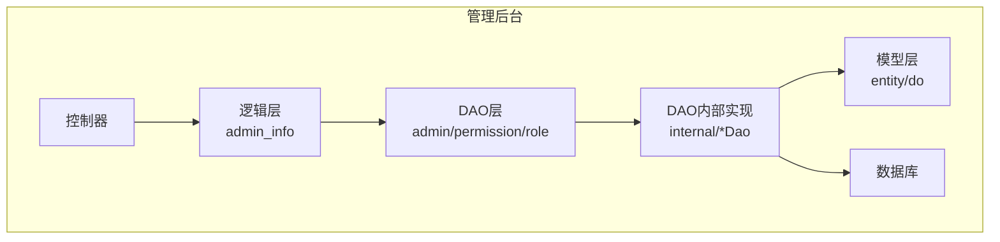
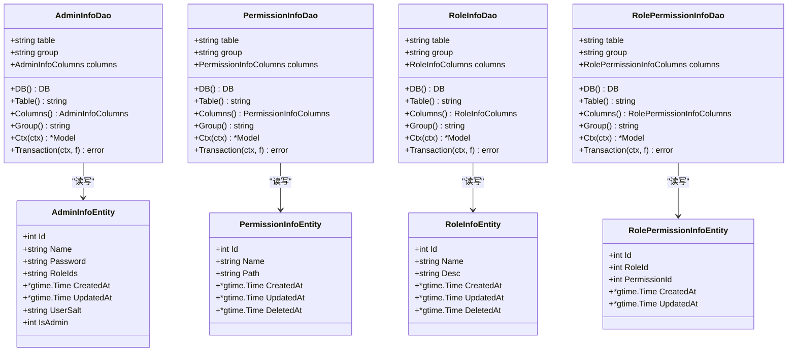
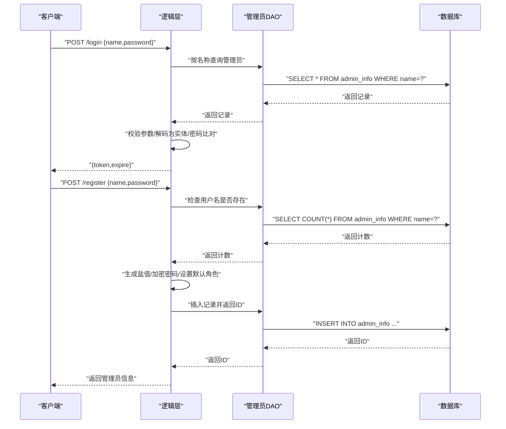
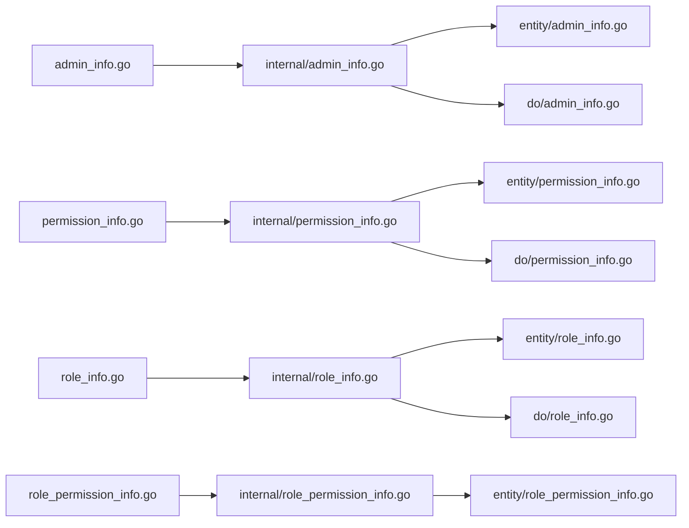

# 管理后台数据访问层

<cite>
**本文引用的文件**
- [app/admin/internal/dao/admin_info.go](file://app/admin/internal/dao/admin_info.go)
- [app/admin/internal/dao/permission_info.go](file://app/admin/internal/dao/permission_info.go)
- [app/admin/internal/dao/role_info.go](file://app/admin/internal/dao/role_info.go)
- [app/admin/internal/dao/role_permission_info.go](file://app/admin/internal/dao/role_permission_info.go)
- [app/admin/internal/dao/internal/admin_info.go](file://app/admin/internal/dao/internal/admin_info.go)
- [app/admin/internal/dao/internal/permission_info.go](file://app/admin/internal/dao/internal/permission_info.go)
- [app/admin/internal/dao/internal/role_info.go](file://app/admin/internal/dao/internal/role_info.go)
- [app/admin/internal/dao/internal/role_permission_info.go](file://app/admin/internal/dao/internal/role_permission_info.go)
- [app/admin/internal/model/entity/admin_info.go](file://app/admin/internal/model/entity/admin_info.go)
- [app/admin/internal/model/entity/permission_info.go](file://app/admin/internal/model/entity/permission_info.go)
- [app/admin/internal/model/entity/role_info.go](file://app/admin/internal/model/entity/role_info.go)
- [app/admin/internal/model/entity/role_permission_info.go](file://app/admin/internal/model/entity/role_permission_info.go)
- [app/admin/internal/model/do/admin_info.go](file://app/admin/internal/model/do/admin_info.go)
- [app/admin/internal/model/do/permission_info.go](file://app/admin/internal/model/do/permission_info.go)
- [app/admin/internal/model/do/role_info.go](file://app/admin/internal/model/do/role_info.go)
- [app/admin/internal/logic/admin_info/admin_info.go](file://app/admin/internal/logic/admin_info/admin_info.go)
</cite>

## 目录
1. [引言](#引言)
2. [项目结构](#项目结构)
3. [核心组件](#核心组件)
4. [架构总览](#架构总览)
5. [详细组件分析](#详细组件分析)
6. [依赖分析](#依赖分析)
7. [性能考虑](#性能考虑)
8. [故障排查指南](#故障排查指南)
9. [结论](#结论)

## 引言
本文件聚焦于管理后台的数据访问层（DAO），系统化梳理管理员、权限、角色及其关联表的DAO实现与数据访问模式。文档覆盖以下要点：
- RBAC权限模型在DAO层面的数据结构与访问接口
- 管理员账户登录/注册、角色分配、权限继承与验证机制
- 权限数据与缓存层的交互模式、权限验证优化与安全最佳实践
- 通过类图、序列图与流程图展示关键数据流与调用关系

## 项目结构
管理后台模块采用“控制器-逻辑层-数据访问层-模型层”的分层组织，DAO层位于逻辑层之下，向上提供统一的数据访问能力。核心目录与职责如下：
- dao：对外暴露的DAO对象，封装对内部DAO的组合与扩展
- dao/internal：基于GoFrame ORM自动生成的DAO实现，提供表级CRUD与事务封装
- model/entity：数据库表对应的实体结构体
- model/do：用于DAO条件构造（Where/Data）的查询对象
- logic/admin_info：管理员登录/注册等业务逻辑，直接依赖DAO进行数据访问

图表来源
- [app/admin/internal/dao/admin_info.go](file://app/admin/internal/dao/admin_info.go#L1-L23)
- [app/admin/internal/dao/internal/admin_info.go](file://app/admin/internal/dao/internal/admin_info.go#L1-L94)
- [app/admin/internal/model/entity/admin_info.go](file://app/admin/internal/model/entity/admin_info.go#L1-L22)
- [app/admin/internal/model/do/admin_info.go](file://app/admin/internal/model/do/admin_info.go#L1-L24)

章节来源
- [app/admin/internal/dao/admin_info.go](file://app/admin/internal/dao/admin_info.go#L1-L23)
- [app/admin/internal/dao/permission_info.go](file://app/admin/internal/dao/permission_info.go#L1-L23)
- [app/admin/internal/dao/role_info.go](file://app/admin/internal/dao/role_info.go#L1-L23)
- [app/admin/internal/dao/role_permission_info.go](file://app/admin/internal/dao/role_permission_info.go#L1-L23)

## 核心组件
本节概述四个核心DAO组件及其职责：
- 管理员DAO：负责管理员账户的增删改查、登录/注册、角色ID集合维护
- 权限DAO：负责权限项的增删改查与软删除字段支持
- 角色DAO：负责角色的增删改查与软删除字段支持
- 角色-权限DAO：负责角色与权限的关联关系维护

这些DAO均通过GoFrame ORM生成的internal/*Dao实现基础能力，并由外层dao/*Dao进行组合与扩展。

章节来源
- [app/admin/internal/dao/internal/admin_info.go](file://app/admin/internal/dao/internal/admin_info.go#L14-L94)
- [app/admin/internal/dao/internal/permission_info.go](file://app/admin/internal/dao/internal/permission_info.go#L14-L90)
- [app/admin/internal/dao/internal/role_info.go](file://app/admin/internal/dao/internal/role_info.go#L14-L90)
- [app/admin/internal/dao/internal/role_permission_info.go](file://app/admin/internal/dao/internal/role_permission_info.go#L14-L88)

## 架构总览
下图展示了管理后台DAO层的整体架构与数据流向，包括DAO内部实现、模型层以及数据库交互：

图表来源
- [app/admin/internal/dao/internal/admin_info.go](file://app/admin/internal/dao/internal/admin_info.go#L14-L94)
- [app/admin/internal/dao/internal/permission_info.go](file://app/admin/internal/dao/internal/permission_info.go#L14-L90)
- [app/admin/internal/dao/internal/role_info.go](file://app/admin/internal/dao/internal/role_info.go#L14-L90)
- [app/admin/internal/dao/internal/role_permission_info.go](file://app/admin/internal/dao/internal/role_permission_info.go#L14-L88)
- [app/admin/internal/model/entity/admin_info.go](file://app/admin/internal/model/entity/admin_info.go#L11-L21)
- [app/admin/internal/model/entity/permission_info.go](file://app/admin/internal/model/entity/permission_info.go#L11-L19)
- [app/admin/internal/model/entity/role_info.go](file://app/admin/internal/model/entity/role_info.go#L11-L19)
- [app/admin/internal/model/entity/role_permission_info.go](file://app/admin/internal/model/entity/role_permission_info.go#L11-L18)

## 详细组件分析

### 管理员DAO与登录/注册流程
管理员DAO负责管理员账户的登录与注册，核心流程如下：
- 登录：参数校验 → 查询管理员记录 → 结构化为实体 → 密码加密比对 → 生成JWT令牌
- 注册：参数校验 → 检查用户名唯一 → 生成盐值与加密密码 → 写入默认角色ID与时间戳 → 返回新记录

图表来源
- [app/admin/internal/logic/admin_info/admin_info.go](file://app/admin/internal/logic/admin_info/admin_info.go#L15-L46)
- [app/admin/internal/logic/admin_info/admin_info.go](file://app/admin/internal/logic/admin_info/admin_info.go#L48-L95)
- [app/admin/internal/dao/internal/admin_info.go](file://app/admin/internal/dao/internal/admin_info.go#L76-L93)

章节来源
- [app/admin/internal/logic/admin_info/admin_info.go](file://app/admin/internal/logic/admin_info/admin_info.go#L15-L95)
- [app/admin/internal/dao/internal/admin_info.go](file://app/admin/internal/dao/internal/admin_info.go#L14-L94)

### 权限DAO与软删除
权限DAO提供权限项的增删改查能力，并支持软删除字段。其列定义包含名称、路径、创建/更新/删除时间等字段，便于权限的快速检索与状态管理。

章节来源
- [app/admin/internal/dao/internal/permission_info.go](file://app/admin/internal/dao/internal/permission_info.go#L14-L90)
- [app/admin/internal/model/entity/permission_info.go](file://app/admin/internal/model/entity/permission_info.go#L11-L19)
- [app/admin/internal/model/do/permission_info.go](file://app/admin/internal/model/do/permission_info.go#L12-L21)

### 角色DAO与软删除
角色DAO提供角色的增删改查能力，并支持软删除字段。其列定义包含名称、描述、创建/更新/删除时间等字段，便于角色的快速检索与状态管理。

章节来源
- [app/admin/internal/dao/internal/role_info.go](file://app/admin/internal/dao/internal/role_info.go#L14-L90)
- [app/admin/internal/model/entity/role_info.go](file://app/admin/internal/model/entity/role_info.go#L11-L19)
- [app/admin/internal/model/do/role_info.go](file://app/admin/internal/model/do/role_info.go#L12-L21)

### 角色-权限DAO与权限继承
角色-权限DAO负责维护角色与权限的多对多关系。通过角色ID与权限ID的组合，形成权限继承的基础数据结构。逻辑层可基于该关系查询某管理员所拥有的全部权限集合。

章节来源
- [app/admin/internal/dao/internal/role_permission_info.go](file://app/admin/internal/dao/internal/role_permission_info.go#L14-L88)
- [app/admin/internal/model/entity/role_permission_info.go](file://app/admin/internal/model/entity/role_permission_info.go#L11-L18)

### RBAC权限模型的数据访问模式
RBAC模型在DAO层体现为三张核心表：
- 管理员表：存储管理员基本信息与角色ID集合
- 角色表：存储角色信息
- 角色-权限表：存储角色与权限的关联关系

数据访问模式要点：
- 管理员拥有多个角色（以字符串形式存储），逻辑层需解析后与角色-权限表进行关联查询
- 角色-权限表提供权限继承的直接映射，逻辑层可据此聚合管理员的全部权限
- 权限DAO与角色DAO提供软删除支持，便于权限与角色的生命周期管理

章节来源
- [app/admin/internal/model/entity/admin_info.go](file://app/admin/internal/model/entity/admin_info.go#L11-L21)
- [app/admin/internal/model/entity/role_info.go](file://app/admin/internal/model/entity/role_info.go#L11-L19)
- [app/admin/internal/model/entity/role_permission_info.go](file://app/admin/internal/model/entity/role_permission_info.go#L11-L18)

## 依赖分析
DAO层之间的依赖关系清晰，均为单向依赖，避免循环依赖：
- 外层dao/*Dao组合internal/*Dao，提供全局单例对象
- internal/*Dao依赖GoFrame ORM的Model与DB对象
- model/entity与model/do分别对应实体与查询对象，供DAO层使用

图表来源
- [app/admin/internal/dao/admin_info.go](file://app/admin/internal/dao/admin_info.go#L17-L19)
- [app/admin/internal/dao/permission_info.go](file://app/admin/internal/dao/permission_info.go#L17-L19)
- [app/admin/internal/dao/role_info.go](file://app/admin/internal/dao/role_info.go#L17-L19)
- [app/admin/internal/dao/role_permission_info.go](file://app/admin/internal/dao/role_permission_info.go#L17-L19)
- [app/admin/internal/dao/internal/admin_info.go](file://app/admin/internal/dao/internal/admin_info.go#L46-L53)
- [app/admin/internal/dao/internal/permission_info.go](file://app/admin/internal/dao/internal/permission_info.go#L42-L49)
- [app/admin/internal/dao/internal/role_info.go](file://app/admin/internal/dao/internal/role_info.go#L42-L49)
- [app/admin/internal/dao/internal/role_permission_info.go](file://app/admin/internal/dao/internal/role_permission_info.go#L40-L47)

章节来源
- [app/admin/internal/dao/admin_info.go](file://app/admin/internal/dao/admin_info.go#L1-L23)
- [app/admin/internal/dao/permission_info.go](file://app/admin/internal/dao/permission_info.go#L1-L23)
- [app/admin/internal/dao/role_info.go](file://app/admin/internal/dao/role_info.go#L1-L23)
- [app/admin/internal/dao/role_permission_info.go](file://app/admin/internal/dao/role_permission_info.go#L1-L23)

## 性能考虑
- 批量查询与缓存
  - 管理员权限集合建议在登录后缓存，结合角色-权限表的关联查询结果进行聚合，减少重复数据库访问
  - 对热点权限（如菜单/按钮级权限）可引入本地缓存或集中式缓存，降低延迟
- 索引与查询优化
  - 在管理员表的用户名字段建立唯一索引，确保登录与注册的查询高效
  - 在角色-权限表上建立复合索引（角色ID、权限ID），提升权限继承查询效率
- 事务与一致性
  - 管理员角色变更与权限继承更新建议在事务中完成，保证一致性
- 分页与软删除
  - 权限与角色表支持软删除，查询时需注意过滤deleted_at为空的记录，避免误读历史数据

## 故障排查指南
- 登录失败
  - 检查用户名是否存在与密码加密是否正确（盐值与加密算法）
  - 关注DAO查询返回空记录与结构化失败的日志
- 注册失败
  - 检查用户名唯一性约束与插入数据库的异常日志
  - 确认默认角色ID与时间戳赋值逻辑
- 权限验证异常
  - 核查角色-权限关联是否正确，以及缓存中的权限集合是否过期
  - 对软删除的权限进行过滤，避免误用已删除权限

章节来源
- [app/admin/internal/logic/admin_info/admin_info.go](file://app/admin/internal/logic/admin_info/admin_info.go#L15-L95)
- [app/admin/internal/dao/internal/admin_info.go](file://app/admin/internal/dao/internal/admin_info.go#L76-L93)

## 结论
管理后台数据访问层以GoFrame ORM为基础，通过DAO内部实现与外层组合对象的分层设计，提供了清晰、可扩展的RBAC权限模型数据访问能力。结合缓存与索引优化，可在保证安全性的同时显著提升权限验证与管理员操作的性能。建议在逻辑层完善权限聚合与缓存刷新策略，并持续关注软删除与事务一致性，确保系统的稳定与可维护性。