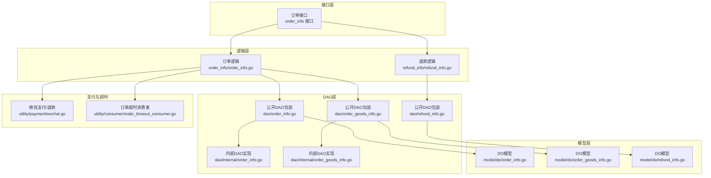
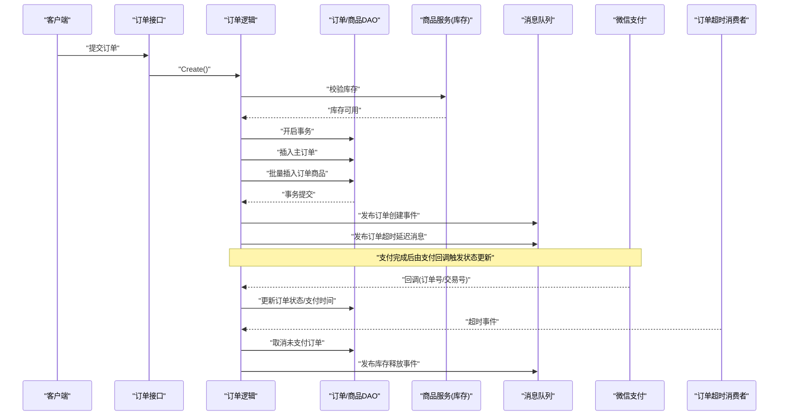
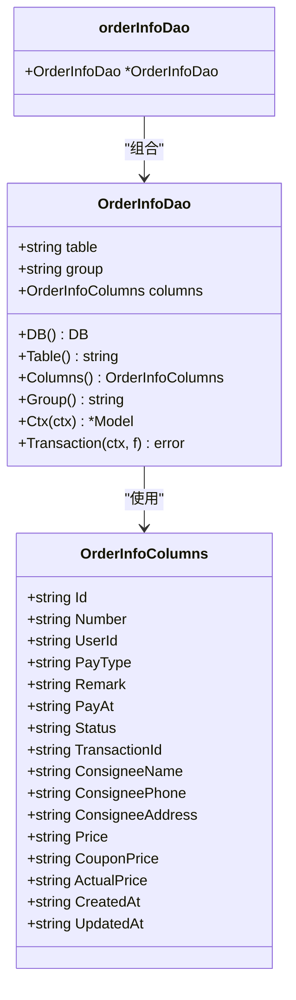
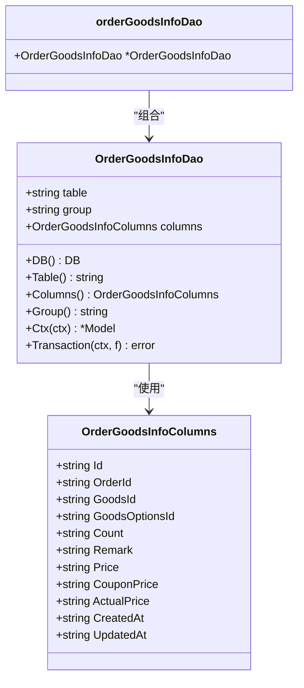
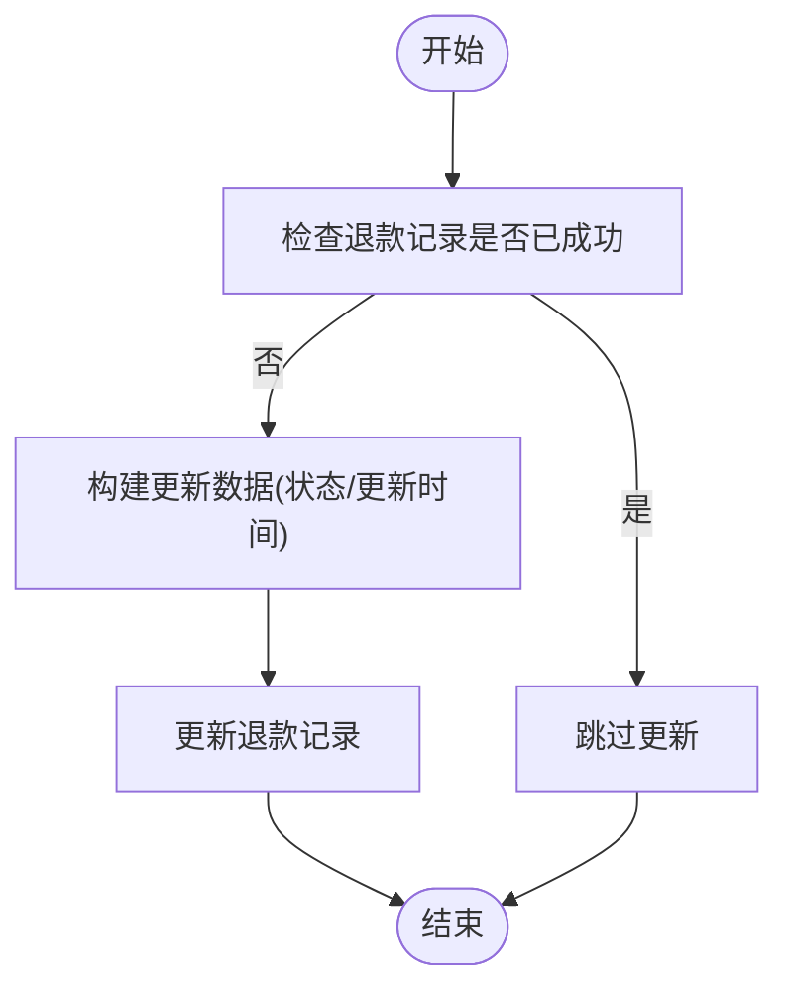
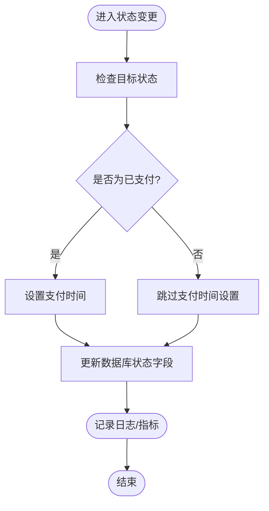
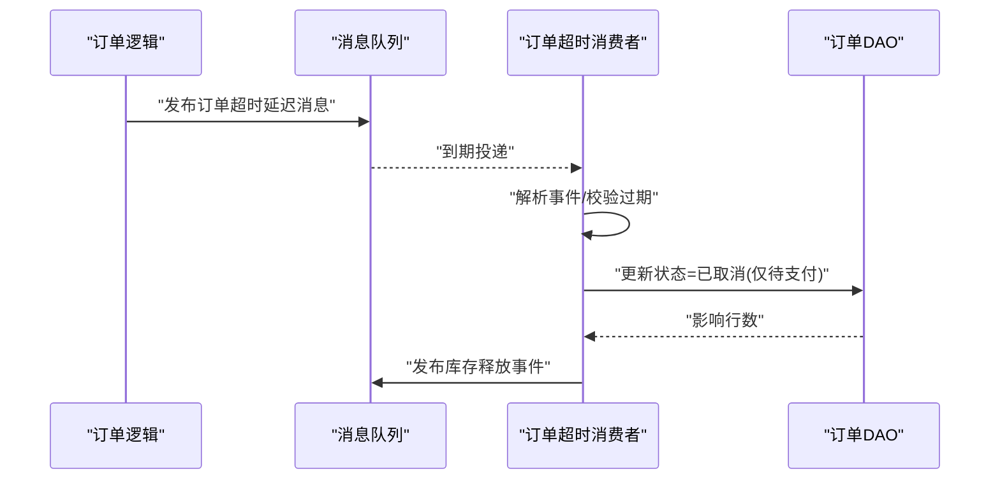
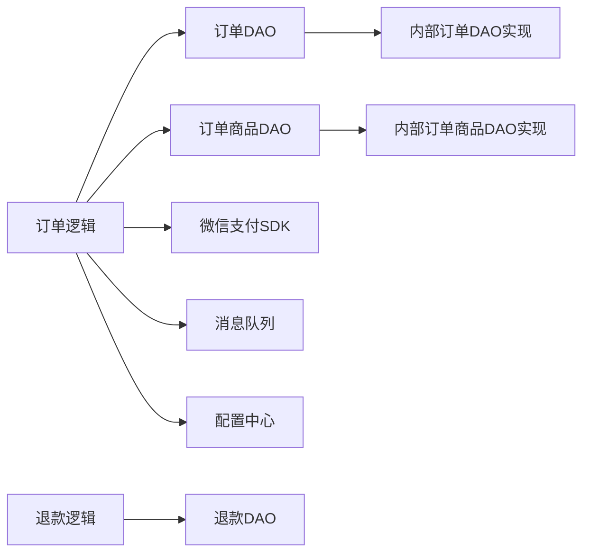

# 订单数据访问层

<cite>
**本文引用的文件**
- [app/order/internal/dao/order_info.go](file://app/order/internal/dao/order_info.go)
- [app/order/internal/dao/order_goods_info.go](file://app/order/internal/dao/order_goods_info.go)
- [app/order/internal/dao/refund_info.go](file://app/order/internal/dao/refund_info.go)
- [app/order/internal/dao/internal/order_info.go](file://app/order/internal/dao/internal/order_info.go)
- [app/order/internal/dao/internal/order_goods_info.go](file://app/order/internal/dao/internal/order_goods_info.go)
- [app/order/internal/model/do/order_info.go](file://app/order/internal/model/do/order_info.go)
- [app/order/internal/model/do/order_goods_info.go](file://app/order/internal/model/do/order_goods_info.go)
- [app/order/internal/model/do/refund_info.go](file://app/order/internal/model/do/refund_info.go)
- [app/order/internal/logic/order_info/order_info.go](file://app/order/internal/logic/order_info/order_info.go)
- [app/order/internal/logic/refund_info/refund_info.go](file://app/order/internal/logic/refund_info/refund_info.go)
- [app/order/internal/consts/order_status.go](file://app/order/internal/consts/order_status.go)
- [app/order/internal/config/refund_config.go](file://app/order/internal/config/refund_config.go)
- [app/order/utility/consumer/order_timeout_consumer.go](file://app/order/utility/consumer/order_timeout_consumer.go)
- [app/order/utility/payment/wxchat.go](file://app/order/utility/payment/wxchat.go)
- [utility/time.go](file://utility/time.go)
</cite>

## 目录
1. [引言](#引言)
2. [项目结构](#项目结构)
3. [核心组件](#核心组件)
4. [架构总览](#架构总览)
5. [组件详细分析](#组件详细分析)
6. [依赖关系分析](#依赖关系分析)
7. [性能考量](#性能考量)
8. [故障排查指南](#故障排查指南)
9. [结论](#结论)
10. [附录](#附录)

## 引言
本文件聚焦“订单数据访问层”的设计与实现，覆盖订单信息、退款信息、订单商品三类DAO的结构与职责；阐述订单状态管理的数据访问模式、状态变更的事务处理策略以及订单超时处理机制；并给出订单创建、支付处理、发货管理、退款处理等核心业务的数据访问实现路径。同时提供与支付系统的集成模式、订单号生成策略以及订单历史数据归档的处理建议。

## 项目结构
订单模块采用“接口层-逻辑层-DAO层-模型层”的分层组织，DAO层进一步细分为对外公开的包装层与内部生成的DAO实现层，保证了可扩展性与可维护性。

图表来源
- [app/order/internal/dao/order_info.go](file://app/order/internal/dao/order_info.go#L1-L23)
- [app/order/internal/dao/order_goods_info.go](file://app/order/internal/dao/order_goods_info.go#L1-L23)
- [app/order/internal/dao/refund_info.go](file://app/order/internal/dao/refund_info.go#L1-L30)
- [app/order/internal/dao/internal/order_info.go](file://app/order/internal/dao/internal/order_info.go#L1-L110)
- [app/order/internal/dao/internal/order_goods_info.go](file://app/order/internal/dao/internal/order_goods_info.go#L1-L100)
- [app/order/internal/model/do/order_info.go](file://app/order/internal/model/do/order_info.go#L1-L32)
- [app/order/internal/model/do/order_goods_info.go](file://app/order/internal/model/do/order_goods_info.go#L1-L27)
- [app/order/internal/model/do/refund_info.go](file://app/order/internal/model/do/refund_info.go#L1-L29)
- [app/order/internal/logic/order_info/order_info.go](file://app/order/internal/logic/order_info/order_info.go#L1-L502)
- [app/order/internal/logic/refund_info/refund_info.go](file://app/order/internal/logic/refund_info/refund_info.go#L1-L41)
- [app/order/utility/payment/wxchat.go](file://app/order/utility/payment/wxchat.go#L1-L328)
- [app/order/utility/consumer/order_timeout_consumer.go](file://app/order/utility/consumer/order_timeout_consumer.go#L1-L87)

章节来源
- [app/order/internal/dao/order_info.go](file://app/order/internal/dao/order_info.go#L1-L23)
- [app/order/internal/dao/order_goods_info.go](file://app/order/internal/dao/order_goods_info.go#L1-L23)
- [app/order/internal/dao/refund_info.go](file://app/order/internal/dao/refund_info.go#L1-L30)
- [app/order/internal/dao/internal/order_info.go](file://app/order/internal/dao/internal/order_info.go#L1-L110)
- [app/order/internal/dao/internal/order_goods_info.go](file://app/order/internal/dao/internal/order_goods_info.go#L1-L100)
- [app/order/internal/model/do/order_info.go](file://app/order/internal/model/do/order_info.go#L1-L32)
- [app/order/internal/model/do/order_goods_info.go](file://app/order/internal/model/do/order_goods_info.go#L1-L27)
- [app/order/internal/model/do/refund_info.go](file://app/order/internal/model/do/refund_info.go#L1-L29)
- [app/order/internal/logic/order_info/order_info.go](file://app/order/internal/logic/order_info/order_info.go#L1-L502)
- [app/order/internal/logic/refund_info/refund_info.go](file://app/order/internal/logic/refund_info/refund_info.go#L1-L41)
- [app/order/utility/payment/wxchat.go](file://app/order/utility/payment/wxchat.go#L1-L328)
- [app/order/utility/consumer/order_timeout_consumer.go](file://app/order/utility/consumer/order_timeout_consumer.go#L1-L87)

## 核心组件
- 订单DAO（OrderInfo）
  - 提供订单表的增删改查、事务封装、上下文模型创建等能力。
  - 内部实现基于GoFrame的gdb.Model，支持列名常量化与自定义处理器。
- 订单商品DAO（OrderGoodsInfo）
  - 提供订单商品明细表的增删改查、事务封装与上下文模型创建。
- 退款DAO（RefundInfo）
  - 提供退款记录表的按需模型获取与更新能力，支持延迟初始化。
- 订单逻辑（OrderInfo Logic）
  - 负责订单创建（含事务、库存校验、优惠券分配、事件发布）、订单详情查询、订单列表分页查询、状态更新、超时处理等。
- 退款逻辑（RefundInfo Logic）
  - 负责根据退款回调更新退款状态。
- 支付与退款（WeChat Payment/Refund）
  - 提供微信支付预下单、回调验签、退款发起与回调处理。
- 订单超时消费者（OrderTimeout Consumer）
  - 消费延迟队列中的订单超时事件，执行取消与库存释放。

章节来源
- [app/order/internal/dao/internal/order_info.go](file://app/order/internal/dao/internal/order_info.go#L1-L110)
- [app/order/internal/dao/internal/order_goods_info.go](file://app/order/internal/dao/internal/order_goods_info.go#L1-L100)
- [app/order/internal/dao/refund_info.go](file://app/order/internal/dao/refund_info.go#L1-L30)
- [app/order/internal/logic/order_info/order_info.go](file://app/order/internal/logic/order_info/order_info.go#L1-L502)
- [app/order/internal/logic/refund_info/refund_info.go](file://app/order/internal/logic/refund_info/refund_info.go#L1-L41)
- [app/order/utility/payment/wxchat.go](file://app/order/utility/payment/wxchat.go#L1-L328)
- [app/order/utility/consumer/order_timeout_consumer.go](file://app/order/utility/consumer/order_timeout_consumer.go#L1-L87)

## 架构总览
订单数据访问层围绕“事务一致性 + 分布式事件 + 延迟队列”的模式构建，确保订单生命周期内各环节的数据正确性与可观测性。

图表来源
- [app/order/internal/logic/order_info/order_info.go](file://app/order/internal/logic/order_info/order_info.go#L27-L212)
- [app/order/utility/consumer/order_timeout_consumer.go](file://app/order/utility/consumer/order_timeout_consumer.go#L39-L86)
- [app/order/utility/payment/wxchat.go](file://app/order/utility/payment/wxchat.go#L134-L171)

## 组件详细分析

### 订单DAO与内部实现
- 设计要点
  - 公开包装层仅持有内部DAO指针，便于扩展与替换。
  - 内部DAO实现提供列名常量、上下文模型、事务封装、分组配置等。
- 事务处理
  - 通过内部DAO的Transaction方法统一包裹业务函数，自动回滚/提交，避免重复样板代码。
- 上下文模型
  - Ctx(ctx)返回安全的gdb.Model，并注入自定义处理器，保证日志、审计等横切能力。

图表来源
- [app/order/internal/dao/internal/order_info.go](file://app/order/internal/dao/internal/order_info.go#L14-L109)
- [app/order/internal/dao/order_info.go](file://app/order/internal/dao/order_info.go#L11-L22)

章节来源
- [app/order/internal/dao/internal/order_info.go](file://app/order/internal/dao/internal/order_info.go#L1-L110)
- [app/order/internal/dao/order_info.go](file://app/order/internal/dao/order_info.go#L1-L23)

### 订单商品DAO与内部实现
- 设计要点
  - 与订单DAO一致的结构化列名、上下文模型与事务封装。
  - 批量插入订单商品，配合主订单事务一次性提交。
- 性能特性
  - 批量写入减少往返次数，提升创建吞吐。

图表来源
- [app/order/internal/dao/internal/order_goods_info.go](file://app/order/internal/dao/internal/order_goods_info.go#L14-L99)
- [app/order/internal/dao/order_goods_info.go](file://app/order/internal/dao/order_goods_info.go#L11-L22)

章节来源
- [app/order/internal/dao/internal/order_goods_info.go](file://app/order/internal/dao/internal/order_goods_info.go#L1-L100)
- [app/order/internal/dao/order_goods_info.go](file://app/order/internal/dao/order_goods_info.go#L1-L23)

### 退款DAO与退款逻辑
- 设计要点
  - 退款DAO采用延迟初始化模型，避免测试环境直接连接数据库。
  - 退款逻辑根据退款回调更新退款状态，避免重复更新。
- 退款状态配置
  - 提供退款状态常量、有效性校验与文案映射，便于前端展示与业务控制。

图表来源
- [app/order/internal/logic/refund_info/refund_info.go](file://app/order/internal/logic/refund_info/refund_info.go#L13-L40)
- [app/order/internal/config/refund_config.go](file://app/order/internal/config/refund_config.go#L77-L104)

章节来源
- [app/order/internal/dao/refund_info.go](file://app/order/internal/dao/refund_info.go#L1-L30)
- [app/order/internal/logic/refund_info/refund_info.go](file://app/order/internal/logic/refund_info/refund_info.go#L1-L41)
- [app/order/internal/config/refund_config.go](file://app/order/internal/config/refund_config.go#L1-L105)

### 订单状态管理与事务处理
- 状态枚举
  - 订单状态涵盖待支付、已支付待发货、已发货、已收货待评价、已评价、待确认（使用优惠券）、已取消、发起退款。
- 事务处理
  - 订单创建使用显式事务，确保主订单与订单商品的一致性；失败自动回滚。
- 状态变更
  - 支付回调仅在订单未处于“已支付”时更新状态并记录支付时间，避免重复写入。
  - 超时消费者仅对“待支付”状态执行取消，防止并发状态冲突。

图表来源
- [app/order/internal/logic/order_info/order_info.go](file://app/order/internal/logic/order_info/order_info.go#L338-L387)
- [app/order/internal/consts/order_status.go](file://app/order/internal/consts/order_status.go#L6-L16)

章节来源
- [app/order/internal/logic/order_info/order_info.go](file://app/order/internal/logic/order_info/order_info.go#L338-L387)
- [app/order/internal/consts/order_status.go](file://app/order/internal/consts/order_status.go#L1-L38)

### 订单超时处理机制
- 延迟队列
  - 订单创建成功后发布延迟消息，延迟时长来自配置。
- 消费者处理
  - 消费者解析事件、校验过期时间、调用超时处理逻辑，最终发布库存释放事件。
- 幂等与安全
  - 查询条件限定“待支付”状态，避免重复取消。

图表来源
- [app/order/internal/logic/order_info/order_info.go](file://app/order/internal/logic/order_info/order_info.go#L199-L201)
- [app/order/utility/consumer/order_timeout_consumer.go](file://app/order/utility/consumer/order_timeout_consumer.go#L39-L86)

章节来源
- [app/order/internal/logic/order_info/order_info.go](file://app/order/internal/logic/order_info/order_info.go#L451-L471)
- [app/order/utility/consumer/order_timeout_consumer.go](file://app/order/utility/consumer/order_timeout_consumer.go#L1-L87)

### 订单创建、支付处理、发货管理、退款处理的数据访问实现
- 订单创建
  - 参数校验、库存校验、优惠券分摊、事务插入主订单与订单商品、发布事件与延迟消息。
- 支付处理
  - 支付回调解析订单号与交易号，仅在非“已支付”状态下更新状态与支付时间。
- 发货管理
  - 通过状态更新接口将状态推进至“已发货”，并可结合物流信息扩展。
- 退款处理
  - 退款回调更新退款状态；退款逻辑负责幂等更新与状态一致性。

章节来源
- [app/order/internal/logic/order_info/order_info.go](file://app/order/internal/logic/order_info/order_info.go#L27-L212)
- [app/order/utility/payment/wxchat.go](file://app/order/utility/payment/wxchat.go#L134-L171)
- [app/order/internal/logic/refund_info/refund_info.go](file://app/order/internal/logic/refund_info/refund_info.go#L13-L40)

### 订单号生成策略
- 订单号规则
  - 采用“固定前缀 + 时间戳 + 四位随机数”的形式，保证全局唯一性与时间序。
- 售后单号
  - 售后单号采用类似策略，便于区分与检索。

章节来源
- [utility/time.go](file://utility/time.go#L22-L30)

### 订单历史数据归档处理
- 建议策略
  - 将历史订单（如完成/取消超过一定周期）迁移至归档库或冷存储，保留关键索引字段。
  - 归档前清理敏感字段或脱敏，满足合规要求。
  - 通过定时任务或事件驱动触发归档流程，避免阻塞主业务。

[本节为通用实践建议，不直接分析具体文件]

## 依赖关系分析
- DAO层耦合
  - 公开包装层仅依赖内部DAO，内部DAO依赖gdb.Model与列名常量，保持低耦合高内聚。
- 逻辑层依赖
  - 订单逻辑依赖DAO、支付SDK、消息队列与配置；退款逻辑依赖DAO与配置。
- 外部依赖
  - 支付SDK、消息中间件、数据库驱动。

图表来源
- [app/order/internal/logic/order_info/order_info.go](file://app/order/internal/logic/order_info/order_info.go#L1-L502)
- [app/order/internal/logic/refund_info/refund_info.go](file://app/order/internal/logic/refund_info/refund_info.go#L1-L41)
- [app/order/internal/dao/internal/order_info.go](file://app/order/internal/dao/internal/order_info.go#L1-L110)
- [app/order/internal/dao/internal/order_goods_info.go](file://app/order/internal/dao/internal/order_goods_info.go#L1-L100)

章节来源
- [app/order/internal/logic/order_info/order_info.go](file://app/order/internal/logic/order_info/order_info.go#L1-L502)
- [app/order/internal/logic/refund_info/refund_info.go](file://app/order/internal/logic/refund_info/refund_info.go#L1-L41)
- [app/order/internal/dao/internal/order_info.go](file://app/order/internal/dao/internal/order_info.go#L1-L110)
- [app/order/internal/dao/internal/order_goods_info.go](file://app/order/internal/dao/internal/order_goods_info.go#L1-L100)

## 性能考量
- 事务批处理
  - 主订单与订单商品在同一事务内提交，减少跨服务调用与网络抖动。
- 批量插入
  - 订单商品采用批量插入，降低数据库往返次数。
- 延迟队列
  - 使用延迟队列处理超时，避免轮询带来的CPU与带宽消耗。
- 幂等与索引
  - 在订单号、退款号等关键字段建立唯一索引，保障幂等更新与快速查询。

[本节提供通用指导，不直接分析具体文件]

## 故障排查指南
- 订单创建失败
  - 检查库存校验、参数校验与事务提交日志；关注指标埋点与错误码。
- 支付回调未生效
  - 核对回调验签、订单状态是否已为“已支付”、交易号是否正确。
- 退款状态不同步
  - 检查退款回调解析、状态幂等判断与数据库更新结果。
- 订单超时未取消
  - 检查延迟消息是否投递、消费者是否正确解析事件、状态过滤条件是否命中。

章节来源
- [app/order/internal/logic/order_info/order_info.go](file://app/order/internal/logic/order_info/order_info.go#L104-L173)
- [app/order/utility/payment/wxchat.go](file://app/order/utility/payment/wxchat.go#L134-L171)
- [app/order/internal/logic/refund_info/refund_info.go](file://app/order/internal/logic/refund_info/refund_info.go#L13-L40)
- [app/order/utility/consumer/order_timeout_consumer.go](file://app/order/utility/consumer/order_timeout_consumer.go#L39-L86)

## 结论
订单数据访问层通过清晰的分层与事务封装，实现了订单生命周期内关键节点的数据一致性；结合延迟队列与事件驱动，提升了系统的可观测性与可扩展性。支付与退款的集成遵循幂等与状态机原则，确保外部系统变化下的稳定性。建议在生产环境中持续完善归档与监控策略，保障长期运行质量。

## 附录
- 订单状态枚举与退款状态配置
  - 订单状态、退款审核状态、退款订单状态及其常量定义与文案映射。

章节来源
- [app/order/internal/consts/order_status.go](file://app/order/internal/consts/order_status.go#L1-L38)
- [app/order/internal/config/refund_config.go](file://app/order/internal/config/refund_config.go#L1-L105)