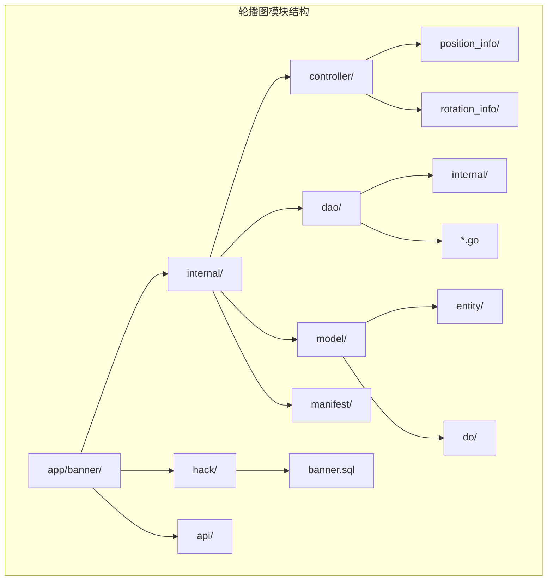
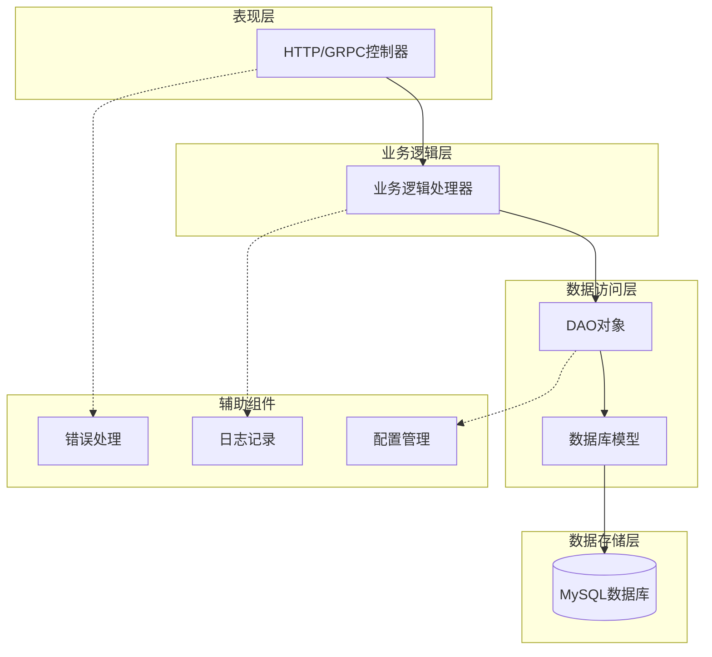
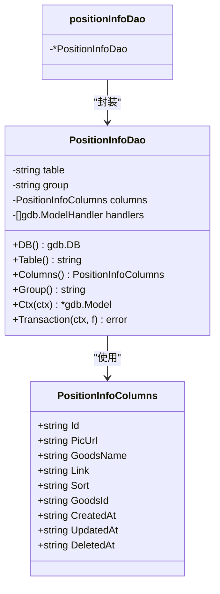
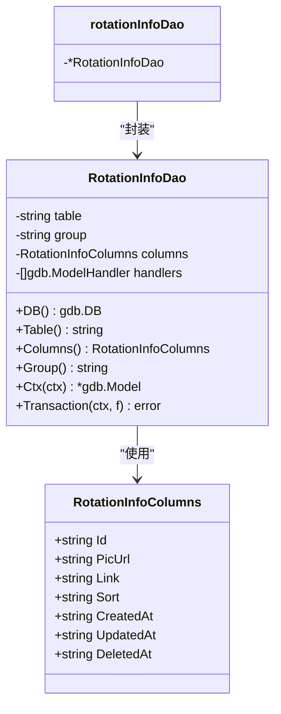
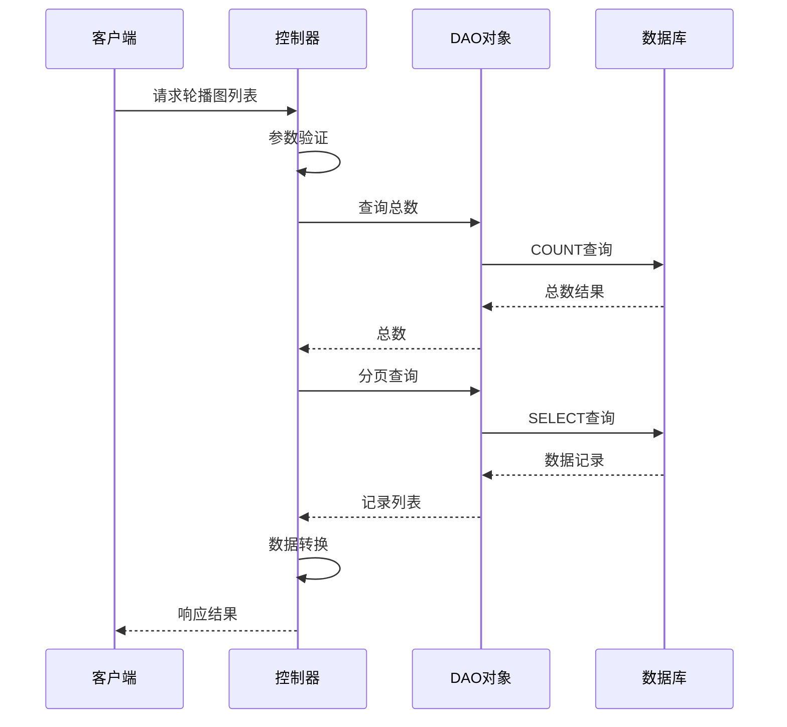
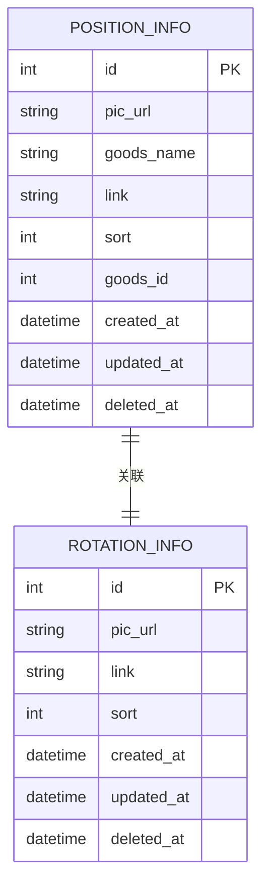
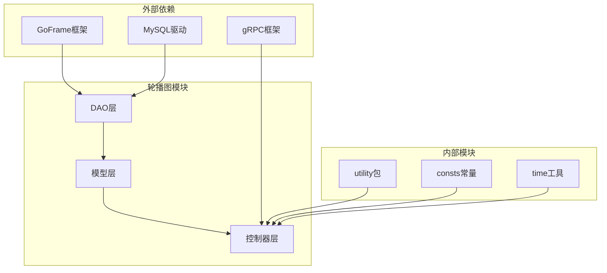
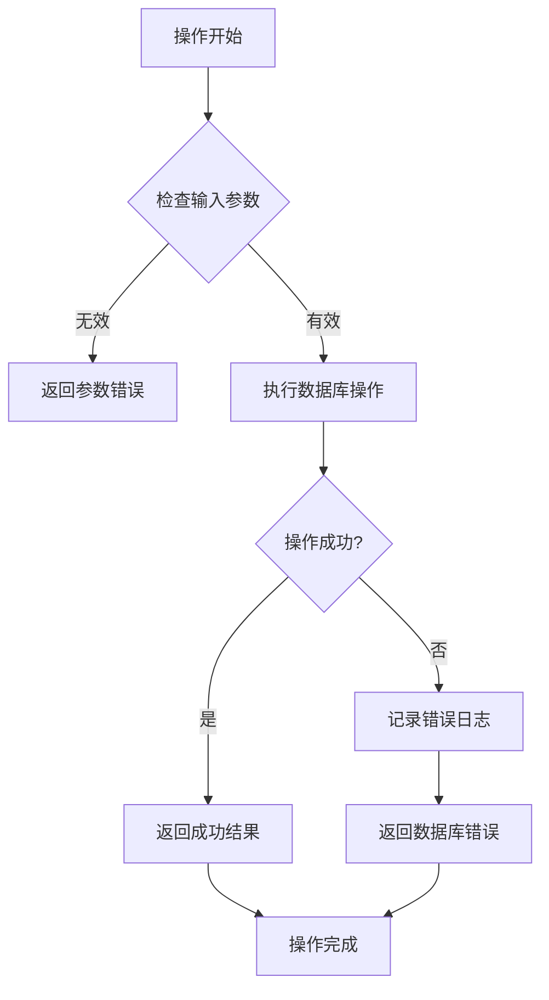

# 轮播图数据访问层

<cite>
**本文档引用的文件**
- [app/banner/internal/dao/position_info.go](file://app/banner/internal/dao/position_info.go)
- [app/banner/internal/dao/rotation_info.go](file://app/banner/internal/dao/rotation_info.go)
- [app/banner/internal/dao/internal/position_info.go](file://app/banner/internal/dao/internal/position_info.go)
- [app/banner/internal/dao/internal/rotation_info.go](file://app/banner/internal/dao/internal/rotation_info.go)
- [app/banner/internal/model/entity/position_info.go](file://app/banner/internal/model/entity/position_info.go)
- [app/banner/internal/model/entity/rotation_info.go](file://app/banner/internal/model/entity/rotation_info.go)
- [app/banner/internal/model/do/position_info.go](file://app/banner/internal/model/do/position_info.go)
- [app/banner/internal/model/do/rotation_info.go](file://app/banner/internal/model/do/rotation_info.go)
- [app/banner/internal/controller/position_info/position_info.go](file://app/banner/internal/controller/position_info/position_info.go)
- [app/banner/internal/controller/rotation_info/rotation_info.go](file://app/banner/internal/controller/rotation_info/rotation_info.go)
- [app/banner/hack/banner.sql](file://app/banner/hack/banner.sql)
- [utility/consts/consts.go](file://utility/consts/consts.go)
- [utility/time.go](file://utility/time.go)
- [app/gateway-h5/api/banner/v1/rotation_info.go](file://app/gateway-h5/api/banner/v1/rotation_info.go)
- [app/gateway-admin/api/banner/v1/rotation_info.go](file://app/gateway-admin/api/banner/v1/rotation_info.go)
</cite>

## 目录
1. [简介](#简介)
2. [项目结构](#项目结构)
3. [核心组件](#核心组件)
4. [架构概览](#架构概览)
5. [详细组件分析](#详细组件分析)
6. [依赖关系分析](#依赖关系分析)
7. [性能考虑](#性能考虑)
8. [故障排除指南](#故障排除指南)
9. [结论](#结论)

## 简介

轮播图数据访问层是电商微服务架构中的重要组成部分，负责管理轮播图位置和轮播信息的完整生命周期。该模块基于GoFrame框架构建，采用DAO（数据访问对象）模式实现，提供了完整的增删改查操作、排序管理、时间控制和状态管理功能。

本系统包含两个核心表：`position_info`（轮播图位置）和`rotation_info`（轮播信息）。通过统一的数据访问层设计，实现了高效的数据库操作和灵活的业务逻辑扩展。

## 项目结构

轮播图模块采用标准的GoFrame微服务架构组织方式：

**图表来源**
- [app/banner/internal/dao/position_info.go](file://app/banner/internal/dao/position_info.go#L1-L23)
- [app/banner/internal/dao/rotation_info.go](file://app/banner/internal/dao/rotation_info.go#L1-L23)

**章节来源**
- [app/banner/internal/dao/position_info.go](file://app/banner/internal/dao/position_info.go#L1-L23)
- [app/banner/internal/dao/rotation_info.go](file://app/banner/internal/dao/rotation_info.go#L1-L23)

## 核心组件

### 数据访问对象（DAO）

系统实现了两个主要的DAO对象：

1. **PositionInfoDao** - 负责轮播图位置数据的访问
2. **RotationInfoDao** - 负责轮播信息数据的访问

每个DAO都包含以下核心功能：
- 数据库连接管理
- 表结构映射
- CRUD操作支持
- 事务处理能力
- 排序和分页查询

### 实体模型

系统定义了对应的数据传输对象：

1. **PositionInfo** - 轮播图位置实体
   - 包含图片链接、商品名称、跳转链接、排序字段、商品ID等属性
   - 支持软删除机制

2. **RotationInfo** - 轮播信息实体  
   - 包含轮播图片、跳转链接、排序字段等核心属性
   - 提供完整的时间戳管理

**章节来源**
- [app/banner/internal/model/entity/position_info.go](file://app/banner/internal/model/entity/position_info.go#L11-L22)
- [app/banner/internal/model/entity/rotation_info.go](file://app/banner/internal/model/entity/rotation_info.go#L11-L20)

## 架构概览

轮播图数据访问层采用分层架构设计，确保了良好的代码组织和职责分离：

**图表来源**
- [app/banner/internal/controller/position_info/position_info.go](file://app/banner/internal/controller/position_info/position_info.go#L19-L25)
- [app/banner/internal/controller/rotation_info/rotation_info.go](file://app/banner/internal/controller/rotation_info/rotation_info.go#L19-L25)

## 详细组件分析

### PositionInfoDao 组件分析

PositionInfoDao专门负责轮播图位置数据的管理，提供了完整的数据访问功能：

**图表来源**
- [app/banner/internal/dao/internal/position_info.go](file://app/banner/internal/dao/internal/position_info.go#L14-L56)
- [app/banner/internal/dao/position_info.go](file://app/banner/internal/dao/position_info.go#L11-L22)

#### 核心功能特性

1. **数据库连接管理**
   - 默认使用"database"配置组
   - 支持自定义数据库连接
   - 提供安全的上下文传递

2. **表结构映射**
   - 自动映射驼峰命名到下划线命名
   - 支持所有标准SQL操作
   - 提供列名常量访问

3. **事务支持**
   - 内置事务管理
   - 自动回滚和提交
   - 支持嵌套事务

**章节来源**
- [app/banner/internal/dao/internal/position_info.go](file://app/banner/internal/dao/internal/position_info.go#L48-L96)

### RotationInfoDao 组件分析

RotationInfoDao负责轮播信息的完整数据管理：

**图表来源**
- [app/banner/internal/dao/internal/rotation_info.go](file://app/banner/internal/dao/internal/rotation_info.go#L14-L51)
- [app/banner/internal/dao/rotation_info.go](file://app/banner/internal/dao/rotation_info.go#L11-L22)

#### 数据访问模式

系统采用了GoFrame框架推荐的DAO模式，具有以下特点：

1. **类型安全**：通过结构体定义确保编译时类型检查
2. **链式调用**：支持流畅的查询构建语法
3. **自动映射**：ORM自动处理数据类型转换
4. **扩展性**：支持自定义方法和业务逻辑

**章节来源**
- [app/banner/internal/dao/internal/rotation_info.go](file://app/banner/internal/dao/internal/rotation_info.go#L44-L92)

### 控制器层分析

控制器层提供了HTTP/GRPC接口，处理外部请求并协调DAO层操作：

**图表来源**
- [app/banner/internal/controller/position_info/position_info.go](file://app/banner/internal/controller/position_info/position_info.go#L27-L79)
- [app/banner/internal/controller/rotation_info/rotation_info.go](file://app/banner/internal/controller/rotation_info/rotation_info.go#L27-L79)

#### API操作流程

系统提供了完整的CRUD操作：

1. **查询操作**
   - 支持分页查询
   - 支持排序控制（升序/降序）
   - 支持条件过滤

2. **创建操作**
   - 单条插入
   - 批量插入支持

3. **更新操作**
   - 条件更新
   - 字段选择性更新

4. **删除操作**
   - 硬删除
   - 软删除支持

**章节来源**
- [app/banner/internal/controller/position_info/position_info.go](file://app/banner/internal/controller/position_info/position_info.go#L82-L122)
- [app/banner/internal/controller/rotation_info/rotation_info.go](file://app/banner/internal/controller/rotation_info/rotation_info.go#L81-L121)

### 数据模型分析

系统采用了清晰的数据模型分层设计：

**图表来源**
- [app/banner/hack/banner.sql](file://app/banner/hack/banner.sql#L6-L16)
- [app/banner/hack/banner.sql](file://app/banner/hack/banner.sql#L26-L38)

#### 字段设计规范

1. **通用字段**
   - `id`: 主键标识
   - `created_at`: 创建时间
   - `updated_at`: 更新时间
   - `deleted_at`: 删除时间（软删除）

2. **业务字段**
   - `pic_url`: 图片资源链接
   - `link`: 跳转目标地址
   - `sort`: 排序权重
   - `goods_id`: 关联商品ID

**章节来源**
- [app/banner/internal/model/do/position_info.go](file://app/banner/internal/model/do/position_info.go#L13-L24)
- [app/banner/internal/model/do/rotation_info.go](file://app/banner/internal/model/do/rotation_info.go#L13-L22)

## 依赖关系分析

轮播图数据访问层的依赖关系体现了清晰的分层架构：

**图表来源**
- [app/banner/internal/controller/position_info/position_info.go](file://app/banner/internal/controller/position_info/position_info.go#L3-L17)
- [app/banner/internal/controller/rotation_info/rotation_info.go](file://app/banner/internal/controller/rotation_info/rotation_info.go#L3-L17)

### 外部依赖管理

系统对外部依赖进行了有效管理：

1. **GoFrame框架集成**
   - ORM自动映射
   - 数据库连接池
   - 日志系统集成

2. **数据库适配**
   - MySQL兼容性
   - 事务支持
   - 连接池管理

3. **RPC通信**
   - gRPC协议支持
   - 自动代码生成
   - 类型安全保证

**章节来源**
- [utility/consts/consts.go](file://utility/consts/consts.go#L3-L47)
- [utility/time.go](file://utility/time.go#L32-L38)

## 性能考虑

### 查询优化策略

1. **索引设计**
   - 主键自动索引
   - 排序字段索引
   - 软删除字段索引

2. **查询优化**
   - 分页查询避免全表扫描
   - 条件查询使用适当索引
   - 排序查询优化

3. **缓存策略**
   - 结合Redis实现缓存
   - 防缓存穿透机制
   - 防缓存击穿策略
   - 防缓存雪崩方案

### 并发处理

系统具备良好的并发处理能力：

1. **连接池管理**
   - 自动连接复用
   - 连接超时控制
   - 连接泄漏防护

2. **事务隔离**
   - 事务边界明确
   - 死锁预防
   - 回滚机制

3. **并发安全**
   - DAO对象无状态设计
   - 上下文传递
   - 线程安全保证

## 故障排除指南

### 常见问题诊断

1. **数据库连接问题**
   - 检查数据库配置
   - 验证连接参数
   - 查看连接池状态

2. **查询性能问题**
   - 分析慢查询日志
   - 检查索引使用
   - 优化查询条件

3. **事务异常**
   - 检查事务边界
   - 验证异常处理
   - 查看回滚日志

### 错误处理机制

系统实现了完善的错误处理：

**图表来源**
- [app/banner/internal/controller/position_info/position_info.go](file://app/banner/internal/controller/position_info/position_info.go#L28-L44)
- [app/banner/internal/controller/rotation_info/rotation_info.go](file://app/banner/internal/controller/rotation_info/rotation_info.go#L28-L44)

### 调试技巧

1. **日志分析**
   - 启用详细日志
   - 分析操作耗时
   - 跟踪事务状态

2. **性能监控**
   - 监控数据库连接
   - 分析查询性能
   - 跟踪缓存命中率

3. **错误追踪**
   - 捕获异常堆栈
   - 记录操作上下文
   - 分析错误模式

**章节来源**
- [utility/consts/consts.go](file://utility/consts/consts.go#L44-L47)

## 结论

轮播图数据访问层通过精心设计的架构和实现，为微服务系统提供了高效、可靠的数据管理能力。系统的主要优势包括：

1. **架构清晰**：分层设计确保了良好的代码组织和职责分离
2. **功能完整**：提供了完整的CRUD操作和高级查询功能
3. **性能优秀**：通过索引优化和连接池管理确保了高并发性能
4. **可靠性强**：完善的错误处理和事务管理保证了数据一致性
5. **扩展性强**：模块化设计便于功能扩展和维护

该实现为后续的功能扩展和性能优化奠定了坚实的基础，能够满足电商系统的高并发和高可用需求。