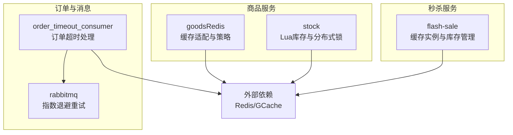
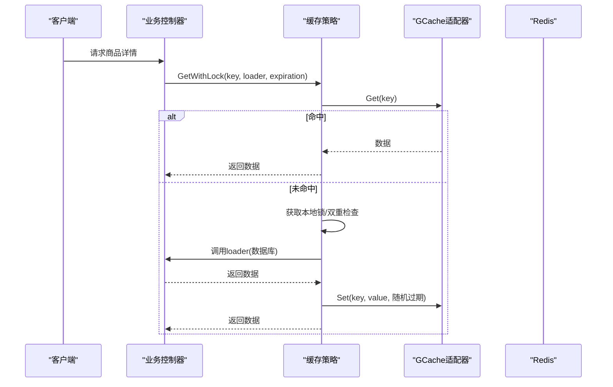
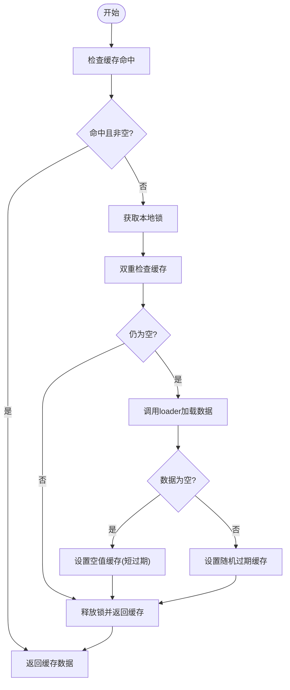
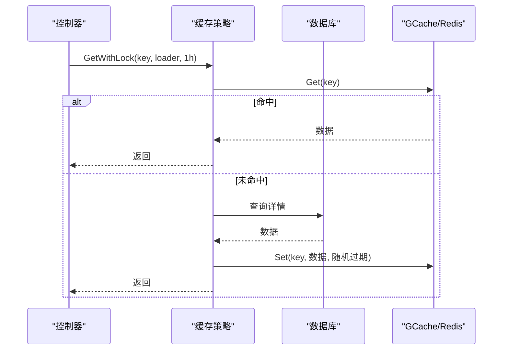
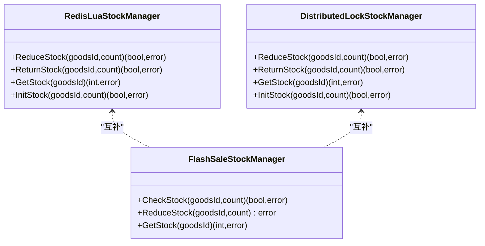
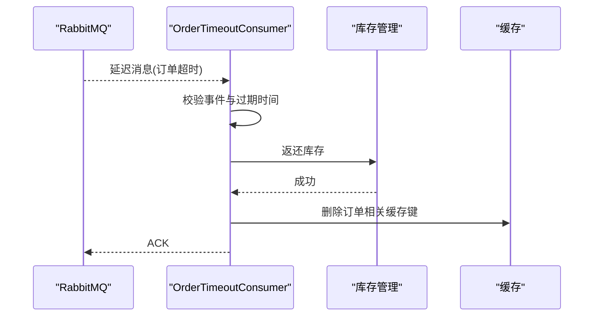
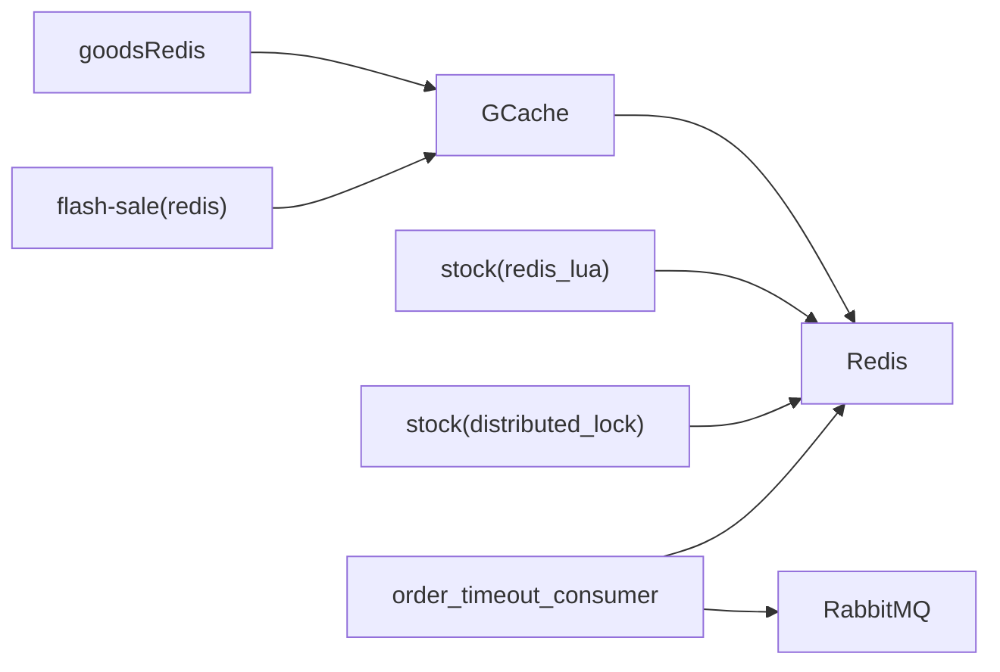

# 缓存策略

<cite>
**本文引用的文件**
- [app/goods/utility/goodsRedis/cache_strategy.go](file://app/goods/utility/goodsRedis/cache_strategy.go)
- [app/goods/utility/goodsRedis/redis.go](file://app/goods/utility/goodsRedis/redis.go)
- [app/goods/utility/goodsRedis/goods.go](file://app/goods/utility/goodsRedis/goods.go)
- [app/goods/utility/stock/redis_lua.go](file://app/goods/utility/stock/redis_lua.go)
- [app/goods/utility/stock/distributed_lock.go](file://app/goods/utility/stock/distributed_lock.go)
- [app/flash-sale/utility/redis.go](file://app/flash-sale/utility/redis.go)
- [app/flash-sale/utility/stock_manager.go](file://app/flash-sale/utility/stock_manager.go)
- [app/order/utility/consumer/order_timeout_consumer.go](file://app/order/utility/consumer/order_timeout_consumer.go)
- [utility/rabbitmq/rabbitmq.go](file://utility/rabbitmq/rabbitmq.go)
- [doc/Redis缓存策略-穿透-击穿-雪崩全解决方案.md](file://doc/Redis缓存策略-穿透-击穿-雪崩全解决方案.md)
</cite>

## 目录
1. [引言](#引言)
2. [项目结构](#项目结构)
3. [核心组件](#核心组件)
4. [架构总览](#架构总览)
5. [详细组件分析](#详细组件分析)
6. [依赖关系分析](#依赖关系分析)
7. [性能考量](#性能考量)
8. [故障排查指南](#故障排查指南)
9. [结论](#结论)
10. [附录](#附录)

## 引言
本文件系统化梳理本仓库的Redis缓存架构与使用策略，覆盖多级缓存思路、缓存穿透/击穿/雪崩的解决方案、商品信息缓存、用户信息缓存、订单状态缓存的实现要点，以及缓存键设计、过期策略、缓存更新与一致性保障、Redis集群/哨兵与持久化建议、性能优化与监控方案。内容以代码为依据，辅以图示与流程，帮助读者快速落地与演进缓存体系。

## 项目结构
围绕缓存的关键目录与文件如下：
- 商品服务缓存与库存
  - goodsRedis：统一的Redis缓存适配与策略封装
  - stock：基于Lua与分布式锁的库存扣减实现
- 秒杀服务缓存
  - flash-sale：独立的缓存实例与秒杀库存管理
- 订单与消息队列
  - order_timeout_consumer：基于RabbitMQ的订单超时处理，间接影响缓存一致性
  - rabbitmq：RabbitMQ客户端与指数退避重试，缓解消息风暴对缓存的影响

**图表来源**
- [app/goods/utility/goodsRedis/redis.go](file://app/goods/utility/goodsRedis/redis.go#L13-L43)
- [app/goods/utility/stock/redis_lua.go](file://app/goods/utility/stock/redis_lua.go#L12-L23)
- [app/goods/utility/stock/distributed_lock.go](file://app/goods/utility/stock/distributed_lock.go#L13-L19)
- [app/flash-sale/utility/redis.go](file://app/flash-sale/utility/redis.go#L16-L50)
- [app/order/utility/consumer/order_timeout_consumer.go](file://app/order/utility/consumer/order_timeout_consumer.go#L16-L37)
- [utility/rabbitmq/rabbitmq.go](file://utility/rabbitmq/rabbitmq.go#L19-L54)

**章节来源**
- [app/goods/utility/goodsRedis/redis.go](file://app/goods/utility/goodsRedis/redis.go#L13-L43)
- [app/flash-sale/utility/redis.go](file://app/flash-sale/utility/redis.go#L16-L50)

## 核心组件
- 缓存适配与策略
  - 基于GCache的Redis适配器，提供统一的Set/Get/Remove接口
  - 缓存策略接口与实现，支持带本地锁的击穿防护、随机过期时间的雪崩防护、空值缓存的穿透防护
- 商品缓存工具
  - 商品详情、分类全量数据的键设计与读写封装
  - 批量删除与延迟双删，保障更新一致性
- 库存管理
  - Lua脚本原子扣减/返还库存，避免竞态
  - 分布式锁保障高并发下的库存一致性
- 秒杀缓存
  - 独立缓存实例与内存级库存管理器，配合Lua/锁实现高性能扣减
- 订单超时与消息
  - 基于RabbitMQ延迟交换机的消息处理，触发库存返还与缓存清理

**章节来源**
- [app/goods/utility/goodsRedis/cache_strategy.go](file://app/goods/utility/goodsRedis/cache_strategy.go#L18-L30)
- [app/goods/utility/goodsRedis/goods.go](file://app/goods/utility/goodsRedis/goods.go#L12-L23)
- [app/goods/utility/stock/redis_lua.go](file://app/goods/utility/stock/redis_lua.go#L12-L23)
- [app/goods/utility/stock/distributed_lock.go](file://app/goods/utility/stock/distributed_lock.go#L13-L19)
- [app/flash-sale/utility/stock_manager.go](file://app/flash-sale/utility/stock_manager.go#L12-L16)

## 架构总览
整体采用“应用层缓存策略 + Redis远程缓存”的两级缓存思路：
- 应用层：GCache适配Redis，提供统一缓存接口；在热点路径上叠加本地锁与随机过期
- 远程缓存：Redis承载高频读取与跨节点共享；Lua与分布式锁保障关键写路径的强一致

**图表来源**
- [app/goods/utility/goodsRedis/cache_strategy.go](file://app/goods/utility/goodsRedis/cache_strategy.go#L32-L78)
- [app/goods/utility/goodsRedis/redis.go](file://app/goods/utility/goodsRedis/redis.go#L13-L43)

## 详细组件分析

### 缓存策略与键设计
- 接口与实现
  - 定义统一的缓存策略接口，支持Get、GetWithLock、Set、Delete、SetEmptyValue
  - GetWithLock通过本地互斥锁与双重检查，避免缓存击穿
  - SetWithRandomExpiration为每个键附加5%~15%的随机抖动，避免雪崩
  - 空值缓存（EmptyValue）短时过期，防止穿透
- 键设计
  - 商品详情：goods:detail:{id}
  - 分类全量：category:all:data
  - 秒杀库存：flash_sale:stock:{goodsId}
  - 库存键：goods:stock:{goodsId}
  - 分布式锁键：lock:stock:{goodsId}

**图表来源**
- [app/goods/utility/goodsRedis/cache_strategy.go](file://app/goods/utility/goodsRedis/cache_strategy.go#L32-L90)
- [app/goods/utility/goodsRedis/goods.go](file://app/goods/utility/goodsRedis/goods.go#L18-L36)

**章节来源**
- [app/goods/utility/goodsRedis/cache_strategy.go](file://app/goods/utility/goodsRedis/cache_strategy.go#L18-L90)
- [app/goods/utility/goodsRedis/goods.go](file://app/goods/utility/goodsRedis/goods.go#L12-L91)

### 商品信息缓存
- 读取流程
  - 控制器调用缓存策略的GetWithLock，若缓存未命中则加载数据库并写入缓存
  - 使用随机过期时间，避免集中过期引发雪崩
- 写入与一致性
  - 更新后执行批量删除与延迟双删，降低脏读概率
  - 对不存在的查询写入空值缓存，短时过期
- 过期策略
  - 商品详情：1小时
  - 分类全量：7天
  - 空值缓存：1分钟

**图表来源**
- [app/goods/utility/goodsRedis/cache_strategy.go](file://app/goods/utility/goodsRedis/cache_strategy.go#L32-L78)
- [app/goods/utility/goodsRedis/goods.go](file://app/goods/utility/goodsRedis/goods.go#L25-L52)

**章节来源**
- [app/goods/utility/goodsRedis/goods.go](file://app/goods/utility/goodsRedis/goods.go#L25-L91)

### 用户信息缓存
- 适用场景
  - 用户资料、收货地址等读多写少的信息
- 建议策略
  - 键设计：user:{userId}:profile
  - 过期时间：15~60分钟（根据更新频率）
  - 写路径：先更新数据库，再删除缓存；或使用延迟双删
  - 一致性：结合消息队列异步刷新，避免强一致带来的延迟

[本节为通用策略说明，不直接分析具体文件]

### 订单状态缓存
- 适用场景
  - 订单状态、支付状态、退款状态等高频查询
- 建议策略
  - 键设计：order:{orderId}:status
  - 过期时间：5~15分钟（状态变更频繁）
  - 写路径：订单状态变更事件驱动，先写数据库，再更新缓存
  - 一致性：通过RabbitMQ事件总线，确保跨服务一致

**章节来源**
- [app/order/utility/consumer/order_timeout_consumer.go](file://app/order/utility/consumer/order_timeout_consumer.go#L39-L86)

### 库存缓存与一致性
- Lua脚本扣减/返还库存
  - 原子性检查与扣减，避免竞态
  - 适合高并发场景下的强一致需求
- 分布式锁库存
  - NX+EX方式获取锁，Lua脚本释放锁，避免误删
  - 支持重试与超时控制，适合对一致性要求更高的场景
- 秒杀库存
  - 内存级库存管理器，无过期时间，依赖Lua/锁保证一致性
  - 与商品详情缓存联动：下单成功后扣减库存并删除商品详情缓存

**图表来源**
- [app/goods/utility/stock/redis_lua.go](file://app/goods/utility/stock/redis_lua.go#L12-L23)
- [app/goods/utility/stock/distributed_lock.go](file://app/goods/utility/stock/distributed_lock.go#L13-L19)
- [app/flash-sale/utility/stock_manager.go](file://app/flash-sale/utility/stock_manager.go#L12-L16)

**章节来源**
- [app/goods/utility/stock/redis_lua.go](file://app/goods/utility/stock/redis_lua.go#L75-L125)
- [app/goods/utility/stock/distributed_lock.go](file://app/goods/utility/stock/distributed_lock.go#L91-L159)
- [app/flash-sale/utility/stock_manager.go](file://app/flash-sale/utility/stock_manager.go#L33-L73)

### 秒杀缓存与库存
- 独立缓存实例
  - 通过独立配置初始化，隔离热点流量
- 内存级库存管理
  - 无过期时间，依赖Lua/锁保证一致性
  - 与订单超时事件联动，超时自动返还库存并清理缓存

**章节来源**
- [app/flash-sale/utility/redis.go](file://app/flash-sale/utility/redis.go#L16-L50)
- [app/flash-sale/utility/stock_manager.go](file://app/flash-sale/utility/stock_manager.go#L33-L89)

### 订单超时与缓存一致性
- 延迟队列与超时处理
  - 使用延迟交换机，订单超时不支付自动触发
  - 消费者侧返还库存并清理相关缓存键
- 指数退避与随机化
  - RabbitMQ客户端采用指数退避与随机化，避免重试风暴

**图表来源**
- [app/order/utility/consumer/order_timeout_consumer.go](file://app/order/utility/consumer/order_timeout_consumer.go#L39-L86)
- [utility/rabbitmq/rabbitmq.go](file://utility/rabbitmq/rabbitmq.go#L19-L54)

**章节来源**
- [app/order/utility/consumer/order_timeout_consumer.go](file://app/order/utility/consumer/order_timeout_consumer.go#L16-L86)
- [utility/rabbitmq/rabbitmq.go](file://utility/rabbitmq/rabbitmq.go#L19-L54)

## 依赖关系分析
- 组件耦合
  - goodsRedis与GCache/Redis紧密耦合，提供统一读写入口
  - stock模块与Lua/锁解耦，可按需选择实现
  - flash-sale独立缓存实例，降低热点冲击
- 外部依赖
  - Redis：远程缓存与原子操作
  - RabbitMQ：事件驱动与延迟队列，保障最终一致性

**图表来源**
- [app/goods/utility/goodsRedis/redis.go](file://app/goods/utility/goodsRedis/redis.go#L13-L43)
- [app/goods/utility/stock/redis_lua.go](file://app/goods/utility/stock/redis_lua.go#L12-L23)
- [app/goods/utility/stock/distributed_lock.go](file://app/goods/utility/stock/distributed_lock.go#L13-L19)
- [app/flash-sale/utility/redis.go](file://app/flash-sale/utility/redis.go#L16-L50)
- [app/order/utility/consumer/order_timeout_consumer.go](file://app/order/utility/consumer/order_timeout_consumer.go#L16-L37)

**章节来源**
- [app/goods/utility/goodsRedis/redis.go](file://app/goods/utility/goodsRedis/redis.go#L13-L43)
- [app/flash-sale/utility/redis.go](file://app/flash-sale/utility/redis.go#L16-L50)

## 性能考量
- 过期策略
  - 常规数据：1小时；空值缓存：1分钟；热点数据：30~120分钟；静态数据：120分钟以上
  - 雪崩防护：为每个键增加5%~15%随机抖动
- 读写路径
  - 读：优先GCache命中；未命中走本地锁+双重检查+随机过期写回
  - 写：数据库更新后立即删除缓存；延迟双删兜底
- 并发与一致性
  - 热点键使用本地锁与双重检查；非热点键可直接读写
  - 库存路径：高并发用Lua脚本；一致性要求更高用分布式锁
- 消息与重试
  - RabbitMQ指数退避与随机化，避免重试风暴

[本节提供通用指导，不直接分析具体文件]

## 故障排查指南
- 缓存穿透
  - 现象：大量不存在的请求直接打到数据库
  - 排查：确认空值缓存是否设置、过期时间是否生效
  - 处置：启用空值缓存与随机过期；必要时引入布隆过滤器
- 缓存击穿
  - 现象：热点键过期瞬间大量请求打到数据库
  - 排查：检查本地锁是否生效、双重检查是否遗漏
  - 处置：确保GetWithLock与本地锁双重检查
- 缓存雪崩
  - 现象：大量键同时过期，数据库瞬时压力剧增
  - 排查：核对过期时间是否相同、是否开启随机抖动
  - 处置：开启随机过期；热点数据加互斥锁；多级缓存
- 库存不一致
  - 现象：库存超卖或积压
  - 排查：Lua脚本是否原子执行、分布式锁是否正确释放
  - 处置：优先Lua脚本；失败重试与幂等；订单超时返还库存
- 消息重试风暴
  - 现象：RabbitMQ重试导致系统抖动
  - 排查：指数退避参数、随机化因子
  - 处置：调整退避参数；限流与熔断

**章节来源**
- [app/goods/utility/goodsRedis/cache_strategy.go](file://app/goods/utility/goodsRedis/cache_strategy.go#L32-L90)
- [app/goods/utility/stock/redis_lua.go](file://app/goods/utility/stock/redis_lua.go#L75-L125)
- [app/goods/utility/stock/distributed_lock.go](file://app/goods/utility/stock/distributed_lock.go#L91-L159)
- [utility/rabbitmq/rabbitmq.go](file://utility/rabbitmq/rabbitmq.go#L19-L54)

## 结论
本项目通过“统一缓存策略 + Redis适配 + Lua/锁”三位一体的设计，有效覆盖了穿透、击穿、雪崩三大问题，并在商品详情、库存、订单状态等关键路径上形成闭环。建议在生产环境中进一步完善：
- Redis集群/哨兵与持久化策略（见附录）
- 多级缓存（本地缓存+Redis）与容量规划
- 监控与告警（命中率、延迟、内存、过期率）

[本节为总结性内容，不直接分析具体文件]

## 附录

### Redis集群配置、哨兵模式与持久化策略
- 集群模式
  - 增加分片与副本，提升可用性与吞吐
  - 注意键空间分布与热点键迁移
- 哨兵模式
  - 主从自动切换，提升可用性
  - 配置合理的主从复制与故障检测
- 持久化
  - RDB快照：定期备份，恢复速度快
  - AOF追加：更强的数据安全性，建议开启
  - 混合持久化：兼顾恢复速度与数据安全

[本节为通用实践说明，不直接分析具体文件]

### 缓存键设计清单
- 商品详情：goods:detail:{id}
- 分类全量：category:all:data
- 库存：goods:stock:{goodsId}
- 分布式锁：lock:stock:{goodsId}
- 秒杀库存：flash_sale:stock:{goodsId}
- 用户资料：user:{userId}:profile
- 订单状态：order:{orderId}:status

**章节来源**
- [app/goods/utility/goodsRedis/goods.go](file://app/goods/utility/goodsRedis/goods.go#L12-L16)
- [app/goods/utility/stock/distributed_lock.go](file://app/goods/utility/stock/distributed_lock.go#L31-L39)
- [app/flash-sale/utility/stock_manager.go](file://app/flash-sale/utility/stock_manager.go#L34-L35)

### 过期策略与随机抖动
- 常规数据：1小时
- 空值缓存：1分钟
- 热点数据：30~120分钟
- 雪崩防护：为每个键增加5%~15%随机抖动

**章节来源**
- [app/goods/utility/goodsRedis/goods.go](file://app/goods/utility/goodsRedis/goods.go#L25-L71)
- [app/goods/utility/goodsRedis/cache_strategy.go](file://app/goods/utility/goodsRedis/cache_strategy.go#L80-L90)

### 缓存更新机制与一致性
- 写路径
  - 先更新数据库，再删除缓存；延迟双删兜底
  - 订单超时事件触发库存返还与缓存清理
- 读路径
  - GetWithLock + 本地锁 + 双重检查 + 随机过期
  - 空值缓存短时过期

**章节来源**
- [app/goods/utility/goodsRedis/goods.go](file://app/goods/utility/goodsRedis/goods.go#L93-L121)
- [app/order/utility/consumer/order_timeout_consumer.go](file://app/order/utility/consumer/order_timeout_consumer.go#L77-L84)