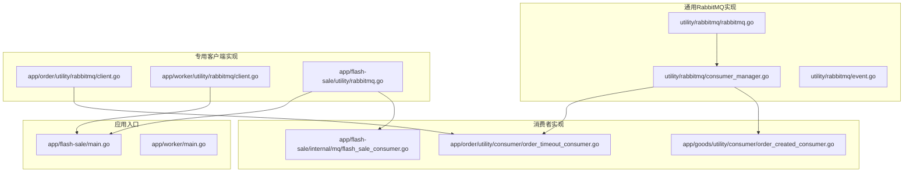
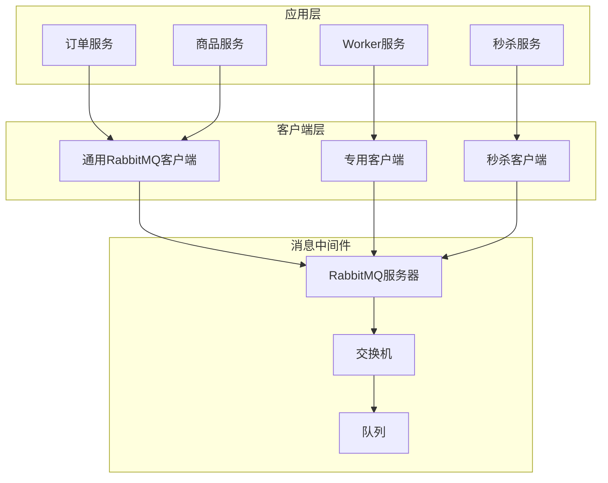
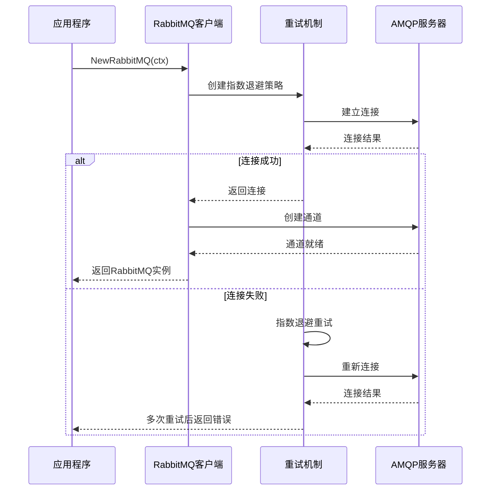
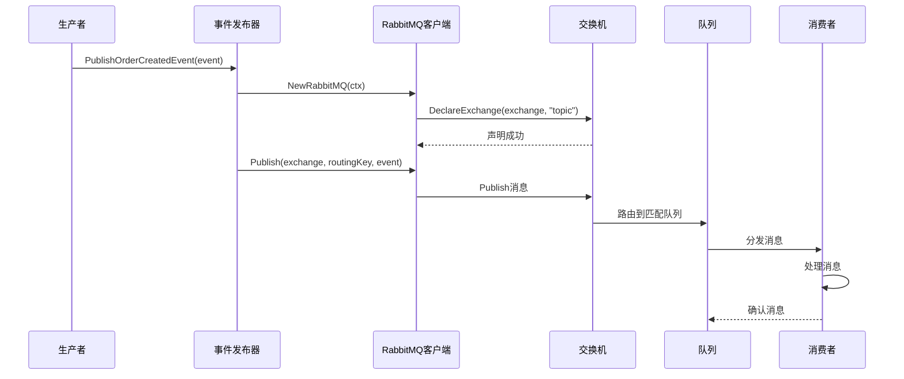
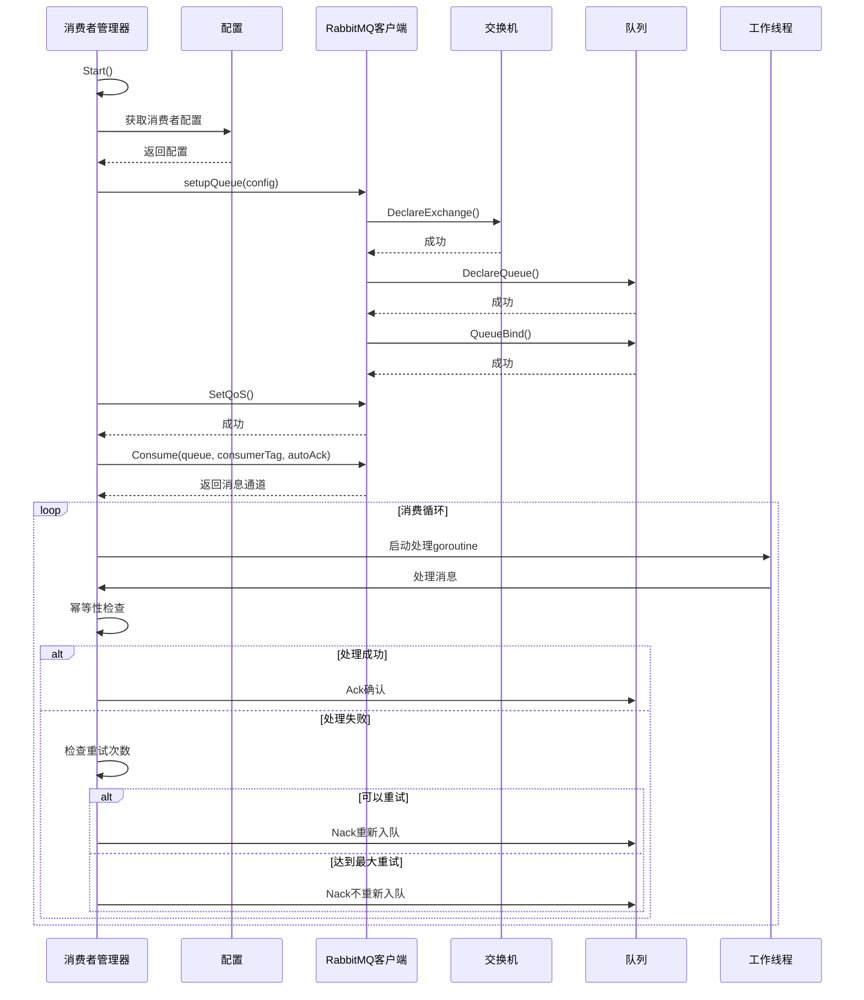
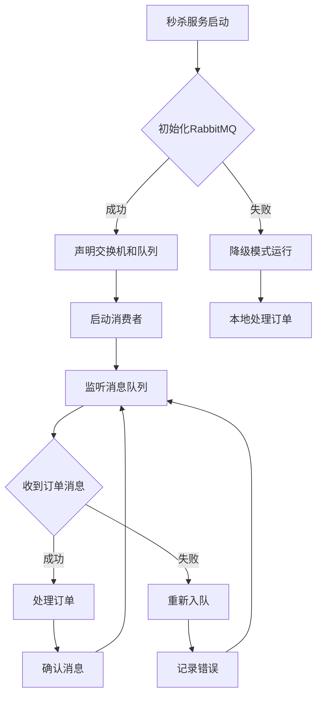
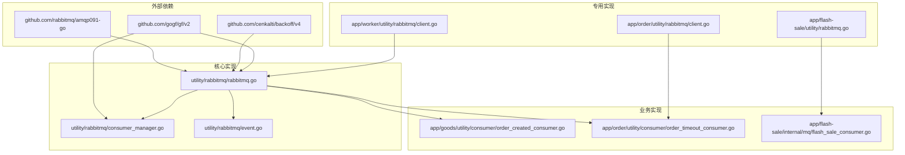

# RabbitMQ客户端实现

<cite>
**本文档引用的文件**
- [utility/rabbitmq/rabbitmq.go](file://utility/rabbitmq/rabbitmq.go)
- [utility/rabbitmq/consumer_manager.go](file://utility/rabbitmq/consumer_manager.go)
- [utility/rabbitmq/event.go](file://utility/rabbitmq/event.go)
- [app/flash-sale/utility/rabbitmq.go](file://app/flash-sale/utility/rabbitmq.go)
- [app/order/utility/rabbitmq/client.go](file://app/order/utility/rabbitmq/client.go)
- [app/worker/utility/rabbitmq/client.go](file://app/worker/utility/rabbitmq/client.go)
- [app/goods/utility/consumer/order_created_consumer.go](file://app/goods/utility/consumer/order_created_consumer.go)
- [app/order/utility/consumer/order_timeout_consumer.go](file://app/order/utility/consumer/order_timeout_consumer.go)
- [app/flash-sale/internal/mq/flash_sale_consumer.go](file://app/flash-sale/internal/mq/flash_sale_consumer.go)
- [app/flash-sale/main.go](file://app/flash-sale/main.go)
- [app/worker/main.go](file://app/worker/main.go)
</cite>

## 目录
1. [简介](#简介)
2. [项目结构](#项目结构)
3. [核心组件](#核心组件)
4. [架构概览](#架构概览)
5. [详细组件分析](#详细组件分析)
6. [依赖关系分析](#依赖关系分析)
7. [性能考虑](#性能考虑)
8. [故障排除指南](#故障排除指南)
9. [结论](#结论)

## 简介

本文档详细介绍了该Go微服务项目中的RabbitMQ客户端实现。项目实现了多种RabbitMQ客户端模式，包括通用客户端、专用客户端和秒杀服务客户端，提供了完整的连接管理、通道管理、消息发布和消费机制。

项目采用模块化设计，支持连接池、连接复用、错误处理和幂等性保证。通过统一的消费者管理器实现了灵活的消息处理架构，支持多种交换机类型和路由策略。

## 项目结构

项目中的RabbitMQ实现分布在多个模块中：



**图表来源**
- [utility/rabbitmq/rabbitmq.go](file://utility/rabbitmq/rabbitmq.go#L1-L196)
- [utility/rabbitmq/consumer_manager.go](file://utility/rabbitmq/consumer_manager.go#L1-L446)
- [app/flash-sale/utility/rabbitmq.go](file://app/flash-sale/utility/rabbitmq.go#L1-L132)

## 核心组件

### 通用RabbitMQ客户端

通用客户端提供了完整的RabbitMQ功能实现，包括连接管理、消息发布、消费和资源管理。

**关键特性：**
- 指数退避重试机制
- 连接池和连接复用
- 交换机和队列声明
- 消息持久化和确认机制
- 幂等性保证

**章节来源**
- [utility/rabbitmq/rabbitmq.go](file://utility/rabbitmq/rabbitmq.go#L13-L82)
- [utility/rabbitmq/rabbitmq.go](file://utility/rabbitmq/rabbitmq.go#L84-L196)

### 消费者管理器

消费者管理器提供了统一的消费者生命周期管理，支持并发消费和错误处理。

**核心功能：**
- 消费者注册和启动
- 队列声明和绑定
- 幂等性检查
- 重试机制和死信处理
- 优雅关闭和资源清理

**章节来源**
- [utility/rabbitmq/consumer_manager.go](file://utility/rabbitmq/consumer_manager.go#L48-L194)
- [utility/rabbitmq/consumer_manager.go](file://utility/rabbitmq/consumer_manager.go#L196-L320)

### 事件发布器

项目实现了多种预定义的事件发布函数，简化了消息发布的复杂性。

**支持的事件类型：**
- 用户注册事件
- 优惠券确认事件
- 订单超时事件
- 订单创建事件
- 库存返还事件

**章节来源**
- [utility/rabbitmq/event.go](file://utility/rabbitmq/event.go#L13-L269)

## 架构概览

项目采用了分层架构设计，实现了多种客户端模式以满足不同场景需求：



**图表来源**
- [utility/rabbitmq/rabbitmq.go](file://utility/rabbitmq/rabbitmq.go#L19-L54)
- [app/flash-sale/utility/rabbitmq.go](file://app/flash-sale/utility/rabbitmq.go#L21-L55)
- [app/order/utility/rabbitmq/client.go](file://app/order/utility/rabbitmq/client.go#L25-L105)

## 详细组件分析

### 通用RabbitMQ客户端类图

```mermaid
classDiagram
class RabbitMQ {
-conn : *amqp.Connection
-channel : *amqp.Channel
-ctx : context.Context
+NewRabbitMQ(ctx) *RabbitMQ, error
+Publish(exchange, routingKey, message) error
+PublishWithDelay(exchange, routingKey, message, delayMs) error
+Consume(queue, consumer, autoAck) <-chan amqp.Delivery, error
+DeclareExchange(name, kind) error
+DeclareQueue(name) amqp.Queue, error
+QueueBind(queue, key, exchange) error
+SetQoS(prefetchCount, prefetchSize, global) error
+Close() void
}
class ConsumerManager {
-rb : *RabbitMQ
-ctx : context.Context
-consumers : []Consumer
-wg : sync.WaitGroup
-done : chan struct{}
+NewConsumerManager(ctx) *ConsumerManager, error
+AddConsumer(consumer Consumer) void
+Start() error
+Stop() void
-startConsumer(consumer Consumer) void
-setupQueue(config ConsumerConfig) error
-handleMessage(consumer Consumer, msg amqp.Delivery) void
-checkIdempotency(consumer Consumer, msg amqp.Delivery) error
}
class Consumer {
<<interface>>
+GetName() string
+GetConfig() ConsumerConfig
+HandleMessage(ctx, msg) error
+GetBusinessID(data, event) string
}
class ConsumerConfig {
+Exchange : string
+ExchangeType : string
+Queue : string
+RoutingKey : string
+ConsumerTag : string
+AutoAck : bool
+PrefetchCount : int
+Durable : bool
+MaxRetries : int
}
RabbitMQ --> ConsumerManager : "used by"
ConsumerManager --> Consumer : "manages"
ConsumerManager --> ConsumerConfig : "uses"
```

**图表来源**
- [utility/rabbitmq/rabbitmq.go](file://utility/rabbitmq/rabbitmq.go#L13-L82)
- [utility/rabbitmq/consumer_manager.go](file://utility/rabbitmq/consumer_manager.go#L19-L71)
- [utility/rabbitmq/consumer_manager.go](file://utility/rabbitmq/consumer_manager.go#L35-L46)

### 连接管理流程



**图表来源**
- [utility/rabbitmq/rabbitmq.go](file://utility/rabbitmq/rabbitmq.go#L19-L54)
- [utility/rabbitmq/rabbitmq.go](file://utility/rabbitmq/rabbitmq.go#L57-L82)

### 消息发布流程



**图表来源**
- [utility/rabbitmq/event.go](file://utility/rabbitmq/event.go#L196-L224)
- [utility/rabbitmq/rabbitmq.go](file://utility/rabbitmq/rabbitmq.go#L84-L101)

### 消费者启动流程



**图表来源**
- [utility/rabbitmq/consumer_manager.go](file://utility/rabbitmq/consumer_manager.go#L79-L171)
- [utility/rabbitmq/consumer_manager.go](file://utility/rabbitmq/consumer_manager.go#L173-L194)

### 秒杀服务客户端

秒杀服务实现了独立的RabbitMQ客户端，专门处理高并发的秒杀订单消息。



**图表来源**
- [app/flash-sale/utility/rabbitmq.go](file://app/flash-sale/utility/rabbitmq.go#L21-L55)
- [app/flash-sale/main.go](file://app/flash-sale/main.go#L18-L37)

**章节来源**
- [app/flash-sale/utility/rabbitmq.go](file://app/flash-sale/utility/rabbitmq.go#L15-L132)
- [app/flash-sale/internal/mq/flash_sale_consumer.go](file://app/flash-sale/internal/mq/flash_sale_consumer.go#L28-L95)

### 订单超时消费者

订单超时消费者实现了复杂的超时处理逻辑，包括时间验证和库存管理。

**处理流程：**
1. 解析订单超时事件
2. 验证事件类型和时间戳
3. 检查是否到达超时时间
4. 调用订单处理逻辑
5. 触发库存返还流程

**章节来源**
- [app/order/utility/consumer/order_timeout_consumer.go](file://app/order/utility/consumer/order_timeout_consumer.go#L39-L87)

## 依赖关系分析

项目中的RabbitMQ实现具有清晰的依赖层次结构：



**图表来源**
- [utility/rabbitmq/rabbitmq.go](file://utility/rabbitmq/rabbitmq.go#L3-L11)
- [utility/rabbitmq/consumer_manager.go](file://utility/rabbitmq/consumer_manager.go#L3-L17)

**章节来源**
- [utility/rabbitmq/rabbitmq.go](file://utility/rabbitmq/rabbitmq.go#L1-L196)
- [utility/rabbitmq/consumer_manager.go](file://utility/rabbitmq/consumer_manager.go#L1-L446)

## 性能考虑

### 连接池和复用

项目实现了多种连接管理策略：

1. **通用客户端连接池**：使用指数退避重试机制，避免雪崩效应
2. **专用客户端单例模式**：确保连接复用，减少连接开销
3. **秒杀服务独立连接**：针对高并发场景的优化

### QoS配置

消费者通过QoS设置控制消息处理的并发度：

- **PrefetchCount**：限制每个通道未确认消息的数量
- **全局设置**：影响整个连接的QoS，而非单个通道
- **动态调整**：根据业务需求调整预取数量

### 幂等性保证

系统实现了多层次的幂等性检查：

1. **消息ID检查**：基于AMQP MessageId的唯一性
2. **业务ID检查**：从消息体或头部提取业务标识
3. **时间戳验证**：结合事件时间戳进行有效性检查
4. **Redis锁机制**：使用分布式锁确保跨实例的幂等性

## 故障排除指南

### 常见连接问题

**问题1：连接超时**
- 检查RabbitMQ服务器状态
- 验证网络连通性
- 检查认证凭据配置

**问题2：连接频繁断开**
- 检查keep-alive配置
- 验证防火墙设置
- 监控服务器负载

**问题3：通道创建失败**
- 检查权限配置
- 验证虚拟主机设置
- 确认服务器资源充足

### 消费问题

**问题1：消息重复消费**
- 检查AutoAck配置
- 验证幂等性实现
- 检查重试机制设置

**问题2：消息堆积**
- 调整PrefetchCount设置
- 增加消费者实例数量
- 优化消息处理逻辑

**问题3：消费者崩溃**
- 检查panic处理机制
- 验证优雅关闭流程
- 监控内存使用情况

### 性能问题

**问题1：吞吐量不足**
- 调整QoS参数
- 增加并发消费者
- 优化消息序列化

**问题2：延迟过高**
- 检查网络延迟
- 验证服务器性能
- 优化消息路由

**章节来源**
- [utility/rabbitmq/consumer_manager.go](file://utility/rabbitmq/consumer_manager.go#L322-L406)
- [utility/rabbitmq/rabbitmq.go](file://utility/rabbitmq/rabbitmq.go#L192-L196)

## 结论

该项目的RabbitMQ客户端实现展现了现代微服务架构的最佳实践：

1. **模块化设计**：通过多种客户端模式满足不同场景需求
2. **健壮性保障**：完善的错误处理和重试机制
3. **性能优化**：连接复用、QoS配置和幂等性保证
4. **可维护性**：清晰的架构层次和标准化的接口设计

推荐在生产环境中使用通用RabbitMQ客户端，它提供了最完整和灵活的功能集。对于特定场景，如秒杀服务，可以考虑使用专用客户端以获得更好的性能表现。

通过合理的配置和监控，这些实现能够支持高并发、低延迟的消息传递需求，为微服务架构提供可靠的消息中间件基础设施。