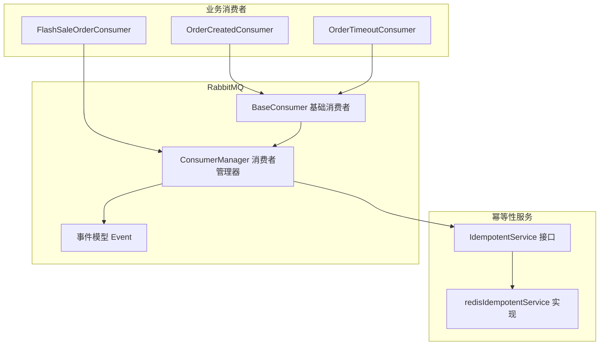
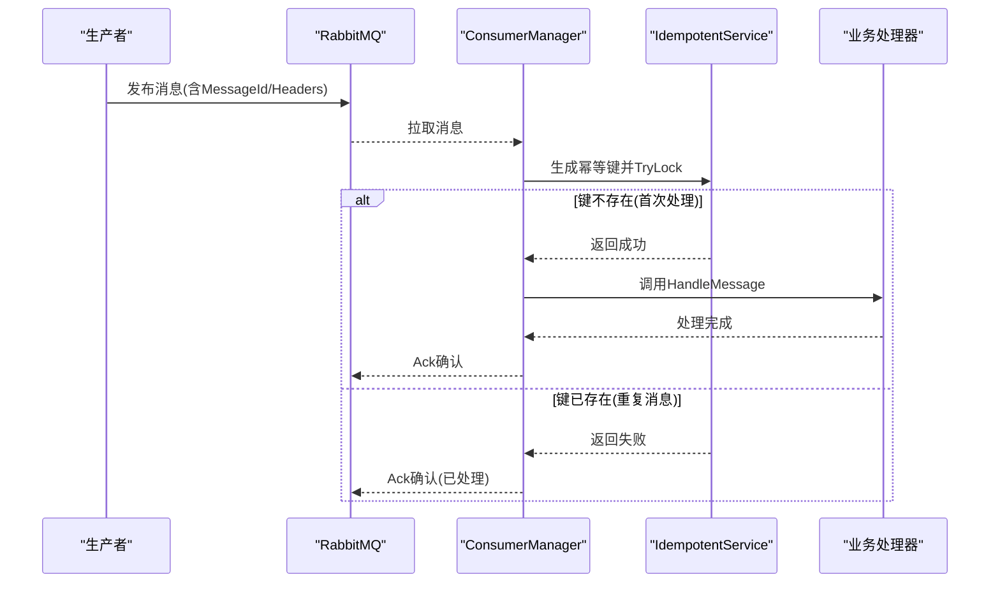
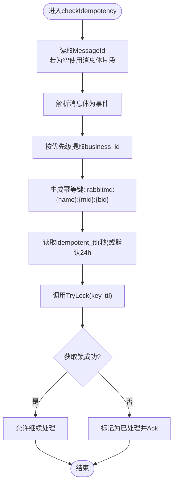
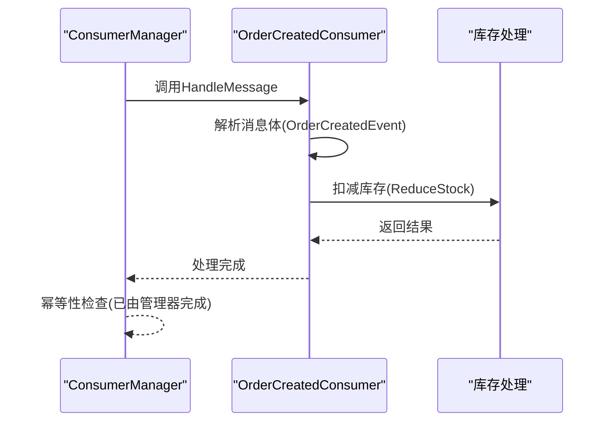
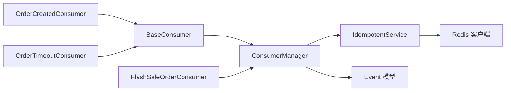

# 消息幂等性设计

<cite>
**本文档引用的文件**
- [utility/idempotent/idempotent.go](file://utility/idempotent/idempotent.go)
- [utility/idempotent/idempotent_test.go](file://utility/idempotent/idempotent_test.go)
- [utility/rabbitmq/consumer_manager.go](file://utility/rabbitmq/consumer_manager.go)
- [utility/rabbitmq/event.go](file://utility/rabbitmq/event.go)
- [utility/rabbitmq/rabbitmq.go](file://utility/rabbitmq/rabbitmq.go)
- [app/goods/utility/consumer/order_created_consumer.go](file://app/goods/utility/consumer/order_created_consumer.go)
- [app/order/utility/consumer/order_timeout_consumer.go](file://app/order/utility/consumer/order_timeout_consumer.go)
- [app/flash-sale/utility/rabbitmq.go](file://app/flash-sale/utility/rabbitmq.go)
- [app/flash-sale/internal/mq/flash_sale_consumer.go](file://app/flash-sale/internal/mq/flash_sale_consumer.go)
</cite>

## 目录
1. [引言](#引言)
2. [项目结构](#项目结构)
3. [核心组件](#核心组件)
4. [架构概览](#架构概览)
5. [详细组件分析](#详细组件分析)
6. [依赖关系分析](#依赖关系分析)
7. [性能考量](#性能考量)
8. [故障排查指南](#故障排查指南)
9. [结论](#结论)
10. [附录](#附录)

## 引言
本文件系统性阐述本仓库中消息幂等性设计的实现与应用，包括幂等性概念、重要性、Redis缓存实现策略、重复消息检测与去重机制、并发处理与过期时间设计、测试方法与验证策略，并结合实际代码路径给出可操作的优化建议。

## 项目结构
围绕消息幂等性设计，项目主要涉及以下模块：
- 幂等性服务：基于Redis的幂等性服务，提供TryLock、ReleaseLock、CheckAndLock与消息键生成能力
- RabbitMQ消费者管理：统一的消费者管理器，负责声明交换机/队列、消息消费、幂等性检查与重试控制
- 业务消费者：各服务内的消费者实现，遵循统一的幂等性检查流程
- 事件模型：定义跨服务传递的事件结构，便于从消息体中提取业务ID



**图表来源**
- [utility/idempotent/idempotent.go](file://utility/idempotent/idempotent.go#L11-L21)
- [utility/rabbitmq/consumer_manager.go](file://utility/rabbitmq/consumer_manager.go#L48-L56)
- [utility/rabbitmq/event.go](file://utility/rabbitmq/event.go#L13-L150)
- [app/goods/utility/consumer/order_created_consumer.go](file://app/goods/utility/consumer/order_created_consumer.go#L13-L30)
- [app/order/utility/consumer/order_timeout_consumer.go](file://app/order/utility/consumer/order_timeout_consumer.go#L16-L37)
- [app/flash-sale/internal/mq/flash_sale_consumer.go](file://app/flash-sale/internal/mq/flash_sale_consumer.go#L16-L26)

**章节来源**
- [utility/idempotent/idempotent.go](file://utility/idempotent/idempotent.go#L1-L153)
- [utility/rabbitmq/consumer_manager.go](file://utility/rabbitmq/consumer_manager.go#L1-L446)
- [utility/rabbitmq/event.go](file://utility/rabbitmq/event.go#L1-L269)
- [app/goods/utility/consumer/order_created_consumer.go](file://app/goods/utility/consumer/order_created_consumer.go#L1-L65)
- [app/order/utility/consumer/order_timeout_consumer.go](file://app/order/utility/consumer/order_timeout_consumer.go#L1-L87)
- [app/flash-sale/internal/mq/flash_sale_consumer.go](file://app/flash-sale/internal/mq/flash_sale_consumer.go#L1-L134)

## 核心组件
- 幂等性服务接口与实现
  - 提供TryLock、ReleaseLock、CheckAndLock与GenerateMessageKey方法
  - 基于Redis的SETNX实现分布式幂等控制，支持过期时间与全局默认实例
- 消费者管理器
  - 统一声明交换机/队列、设置QoS、并发消费
  - 在消息处理前执行幂等性检查，支持从消息体与消息头提取业务ID
  - 支持重试次数控制与错误类型判断
- 事件模型
  - 定义订单创建、订单超时、优惠券确认等事件结构，便于从消息体解析业务ID

**章节来源**
- [utility/idempotent/idempotent.go](file://utility/idempotent/idempotent.go#L11-L21)
- [utility/idempotent/idempotent.go](file://utility/idempotent/idempotent.go#L23-L85)
- [utility/rabbitmq/consumer_manager.go](file://utility/rabbitmq/consumer_manager.go#L265-L320)
- [utility/rabbitmq/event.go](file://utility/rabbitmq/event.go#L13-L150)

## 架构概览
消息从生产者发布到RabbitMQ，消费者管理器统一拉取消息并在处理前进行幂等性检查。幂等性检查通过生成唯一键（包含消费者名、消息ID、业务ID）并利用Redis SETNX实现“仅一次”处理保证。若消息已处理，则直接确认消息，避免重复执行。



**图表来源**
- [utility/rabbitmq/consumer_manager.go](file://utility/rabbitmq/consumer_manager.go#L196-L263)
- [utility/rabbitmq/consumer_manager.go](file://utility/rabbitmq/consumer_manager.go#L265-L320)
- [utility/idempotent/idempotent.go](file://utility/idempotent/idempotent.go#L41-L58)

## 详细组件分析

### 幂等性服务组件
- 接口职责
  - TryLock：使用Redis SETNX实现“仅一次”获取幂等锁
  - ReleaseLock：删除幂等键，释放锁
  - CheckAndLock：检查并加锁（内部复用TryLock）
  - GenerateMessageKey：生成格式化的幂等键
- Redis实现要点
  - 类型断言适配GoFrame Redis客户端链式调用风格
  - 使用纳秒级时间戳作为锁值，便于后续分析
  - 默认实例懒加载，支持全局便捷函数
- 并发与过期
  - 幂等键带过期时间，避免缓存长期占用
  - 幂等键粒度包含消费者名、消息ID与业务ID，确保跨消费者与跨业务隔离

```mermaid
classDiagram
class IdempotentService {
+TryLock(ctx, key, expiration) bool
+ReleaseLock(ctx, key) error
+CheckAndLock(ctx, key, expiration) bool
+GenerateMessageKey(prefix, messageID, businessID) string
}
class redisIdempotentService {
-redisClient interface{}
+TryLock(...)
+ReleaseLock(...)
+CheckAndLock(...)
+GenerateMessageKey(...)
}
IdempotentService <|.. redisIdempotentService
```

**图表来源**
- [utility/idempotent/idempotent.go](file://utility/idempotent/idempotent.go#L11-L21)
- [utility/idempotent/idempotent.go](file://utility/idempotent/idempotent.go#L23-L85)

**章节来源**
- [utility/idempotent/idempotent.go](file://utility/idempotent/idempotent.go#L11-L153)

### 消费者管理器与幂等性检查
- 幂等键生成策略
  - 格式：rabbitmq:{consumer_name}:{message_id}:{business_id}
  - business_id来源优先级：消息体解析 -> 消费者GetBusinessID -> 消息头business_id
- 过期时间控制
  - 默认24小时；可通过消息头idempotent_ttl覆盖（单位秒）
- 错误与重试
  - 幂等服务异常时记录错误并允许继续处理，避免阻塞业务
  - 重试次数通过消息头x-retry-count跟踪，支持临时性错误模式匹配



**图表来源**
- [utility/rabbitmq/consumer_manager.go](file://utility/rabbitmq/consumer_manager.go#L265-L320)

**章节来源**
- [utility/rabbitmq/consumer_manager.go](file://utility/rabbitmq/consumer_manager.go#L265-L320)

### 业务消费者与幂等性集成
- 订单创建消费者
  - 从消息体解析订单事件，执行库存扣减等业务逻辑
  - 幂等性由消费者管理器统一保障，无需在业务内重复实现
- 订单超时消费者
  - 解析超时事件，判断过期后再执行取消与库存返还
  - 同样受益于统一幂等性检查
- 秒杀消费者
  - 通过独立RabbitMQ封装消费队列消息
  - 若需幂等性，可在业务处理前调用幂等服务或通过消费者管理器统一处理



**图表来源**
- [app/goods/utility/consumer/order_created_consumer.go](file://app/goods/utility/consumer/order_created_consumer.go#L32-L64)
- [utility/rabbitmq/consumer_manager.go](file://utility/rabbitmq/consumer_manager.go#L196-L263)

**章节来源**
- [app/goods/utility/consumer/order_created_consumer.go](file://app/goods/utility/consumer/order_created_consumer.go#L1-L65)
- [app/order/utility/consumer/order_timeout_consumer.go](file://app/order/utility/consumer/order_timeout_consumer.go#L1-L87)
- [app/flash-sale/internal/mq/flash_sale_consumer.go](file://app/flash-sale/internal/mq/flash_sale_consumer.go#L1-L134)

### Redis缓存设计与并发处理
- 设计思路
  - 使用SETNX实现“仅一次”幂等控制，避免重复执行
  - 键命名包含消费者名、消息ID与业务ID，确保跨消费者与跨业务隔离
- 过期时间
  - 默认24小时，避免缓存长期占用
  - 可通过消息头idempotent_ttl动态调整
- 并发处理
  - TryLock采用类型断言适配不同Redis客户端，提升可测试性
  - ReleaseLock在业务完成后释放，确保幂等窗口期内不会被重复消费

**章节来源**
- [utility/idempotent/idempotent.go](file://utility/idempotent/idempotent.go#L35-L85)
- [utility/rabbitmq/consumer_manager.go](file://utility/rabbitmq/consumer_manager.go#L298-L304)

## 依赖关系分析
- 幂等性服务依赖Redis客户端接口，通过类型断言解耦具体实现
- 消费者管理器依赖幂等性服务与事件模型，统一处理幂等性与消息解析
- 业务消费者依赖消费者管理器提供的统一处理流程



**图表来源**
- [utility/idempotent/idempotent.go](file://utility/idempotent/idempotent.go#L23-L33)
- [utility/rabbitmq/consumer_manager.go](file://utility/rabbitmq/consumer_manager.go#L48-L56)
- [utility/rabbitmq/event.go](file://utility/rabbitmq/event.go#L13-L150)

**章节来源**
- [utility/idempotent/idempotent.go](file://utility/idempotent/idempotent.go#L1-L153)
- [utility/rabbitmq/consumer_manager.go](file://utility/rabbitmq/consumer_manager.go#L1-L446)

## 性能考量
- 幂等键过期时间设置
  - 默认24小时，建议根据业务最长处理时间与重试策略调整
  - 对高频短时业务可缩短ttl，降低缓存占用
- 并发与QoS
  - 消费者管理器默认PrefetchCount=1，避免重复消息并发处理
  - 可根据CPU与业务处理耗时调整PrefetchCount
- Redis性能
  - 幂等键为短字符串，SETNX与DEL均为O(1)，性能开销极小
  - 建议使用Redis集群或哨兵，确保高可用与低延迟

[本节为通用性能建议，无需特定文件引用]

## 故障排查指南
- 幂等性检查失败
  - 现象：消息被标记为已处理并确认
  - 排查：检查幂等键生成是否包含正确的消费者名、消息ID与业务ID
  - 参考路径：[幂等键生成与TryLock](file://utility/rabbitmq/consumer_manager.go#L290-L320)
- 幂等服务异常
  - 现象：幂等性服务错误但消息仍被处理
  - 排查：查看幂等服务初始化与Redis连接状态
  - 参考路径：[幂等服务初始化与全局函数](file://utility/idempotent/idempotent.go#L90-L153)
- 重试与确认
  - 现象：消息多次重试或未确认
  - 排查：检查错误类型与x-retry-count头，确认AutoAck配置
  - 参考路径：[消息处理与重试控制](file://utility/rabbitmq/consumer_manager.go#L196-L263)

**章节来源**
- [utility/rabbitmq/consumer_manager.go](file://utility/rabbitmq/consumer_manager.go#L196-L263)
- [utility/idempotent/idempotent.go](file://utility/idempotent/idempotent.go#L90-L153)

## 结论
本项目通过“消费者管理器+幂等性服务”的组合，在RabbitMQ消息处理中实现了可靠的幂等性控制。幂等键的生成策略确保了跨消费者与跨业务的隔离，Redis的SETNX提供了高效的“仅一次”保证。配合合理的过期时间与重试策略，系统在高并发场景下具备良好的稳定性与可维护性。

[本节为总结性内容，无需特定文件引用]

## 附录

### 幂等性测试方法与验证策略
- 单元测试
  - 验证TryLock/ReleaseLock/CheckAndLock的正确性与调用次数
  - 验证GenerateMessageKey的键格式
  - 参考路径：[幂等性单元测试](file://utility/idempotent/idempotent_test.go#L87-L214)
- 集成测试
  - 模拟完整幂等流程：生成键、TryLock、业务处理、ReleaseLock
  - 参考路径：[幂等性集成测试](file://utility/idempotent/idempotent_test.go#L180-L213)
- 并发测试
  - 模拟高并发重复消息，验证幂等性与Redis锁行为
  - 参考路径：[秒杀并发测试示例](file://app/flash-sale/PROJECT_SUMMARY.md#L360-L405)

**章节来源**
- [utility/idempotent/idempotent_test.go](file://utility/idempotent/idempotent_test.go#L1-L214)
- [app/flash-sale/PROJECT_SUMMARY.md](file://app/flash-sale/PROJECT_SUMMARY.md#L360-L405)

### 实际代码示例路径
- 幂等性服务接口与实现
  - [接口定义](file://utility/idempotent/idempotent.go#L11-L21)
  - [实现与Redis交互](file://utility/idempotent/idempotent.go#L23-L85)
- 消费者管理器幂等性检查
  - [幂等键生成与TryLock](file://utility/rabbitmq/consumer_manager.go#L290-L320)
- 业务消费者集成
  - [订单创建消费者](file://app/goods/utility/consumer/order_created_consumer.go#L32-L64)
  - [订单超时消费者](file://app/order/utility/consumer/order_timeout_consumer.go#L39-L86)
- 事件模型
  - [事件结构定义](file://utility/rabbitmq/event.go#L13-L150)

**章节来源**
- [utility/idempotent/idempotent.go](file://utility/idempotent/idempotent.go#L1-L153)
- [utility/rabbitmq/consumer_manager.go](file://utility/rabbitmq/consumer_manager.go#L265-L320)
- [app/goods/utility/consumer/order_created_consumer.go](file://app/goods/utility/consumer/order_created_consumer.go#L1-L65)
- [app/order/utility/consumer/order_timeout_consumer.go](file://app/order/utility/consumer/order_timeout_consumer.go#L1-L87)
- [utility/rabbitmq/event.go](file://utility/rabbitmq/event.go#L1-L269)