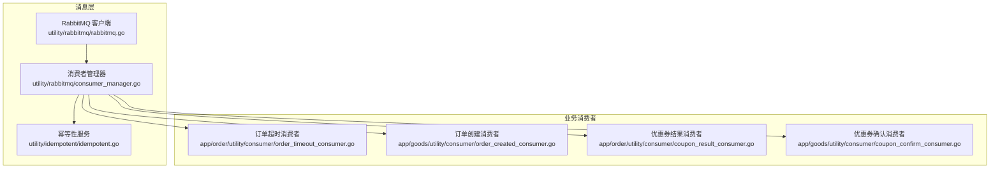
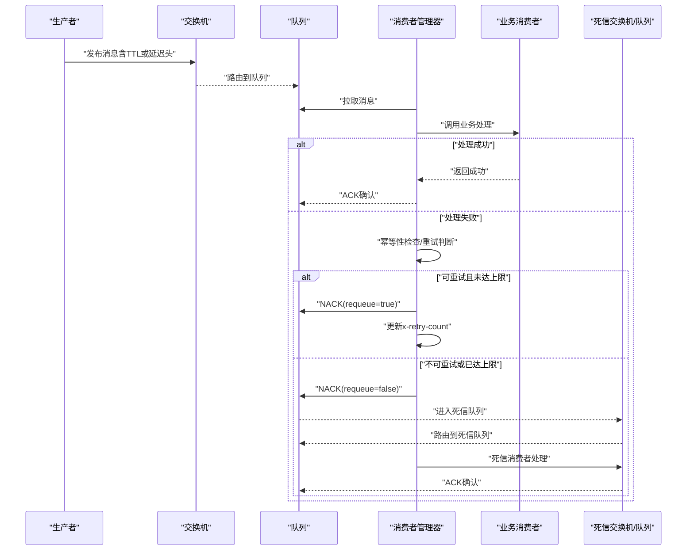
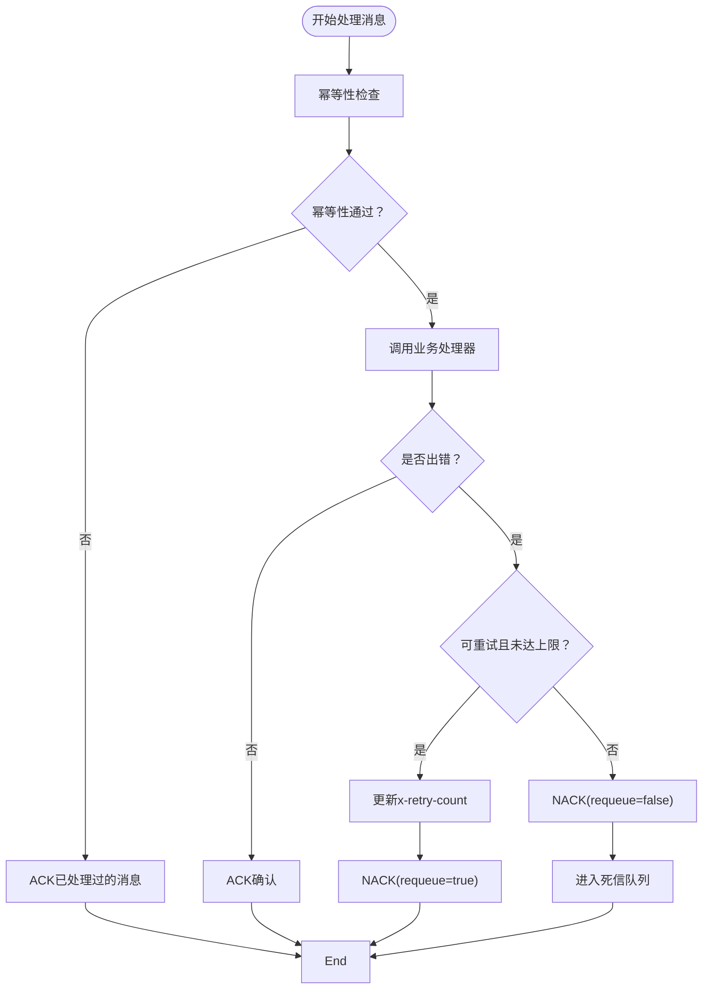
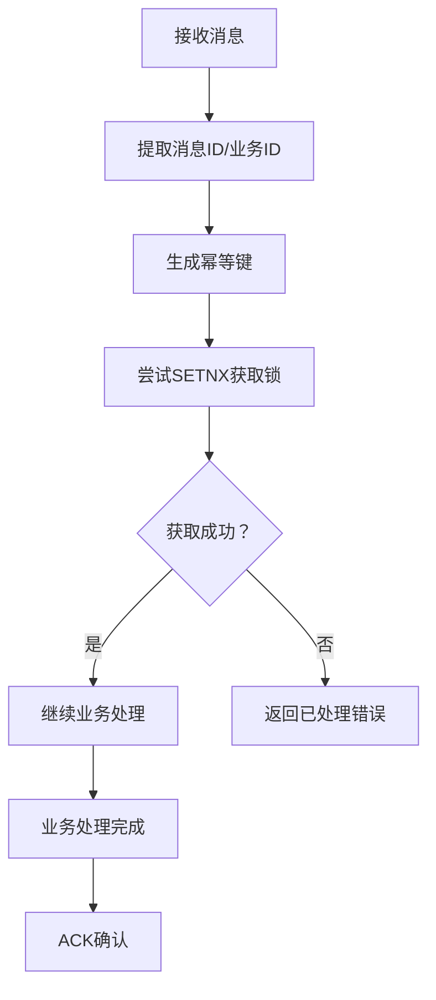
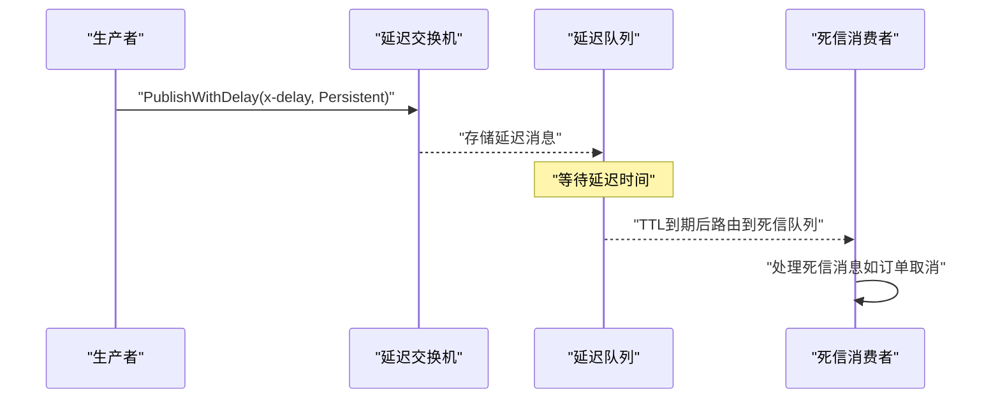
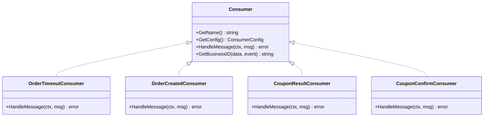
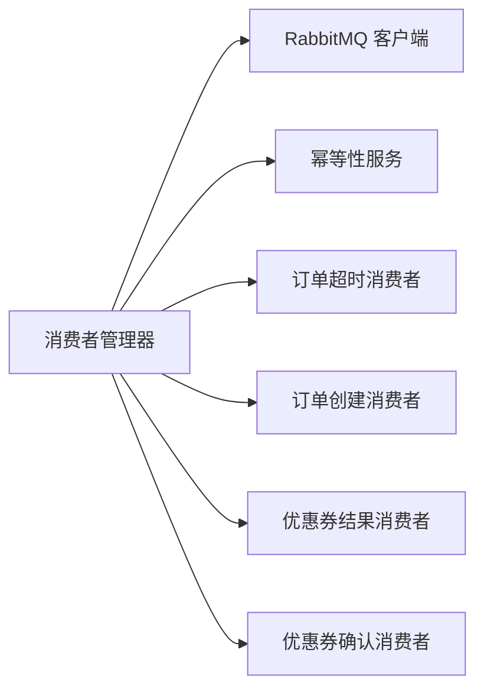

# 消息重试与死信队列

<cite>
**本文引用的文件**
- [utility/rabbitmq/consumer_manager.go](file://utility/rabbitmq/consumer_manager.go)
- [utility/rabbitmq/rabbitmq.go](file://utility/rabbitmq/rabbitmq.go)
- [utility/idempotent/idempotent.go](file://utility/idempotent/idempotent.go)
- [doc/RabbitMQ消息处理优化实战-幂等性与重试策略.md](file://doc/RabbitMQ消息处理优化实战-幂等性与重试策略.md)
- [doc/延迟队列处理订单超时（RabbitMQ死信队列实战）.md](file://doc/延迟队列处理订单超时（RabbitMQ死信队列实战）.md)
- [app/order/utility/consumer/order_timeout_consumer.go](file://app/order/utility/consumer/order_timeout_consumer.go)
- [app/goods/utility/consumer/order_created_consumer.go](file://app/goods/utility/consumer/order_created_consumer.go)
- [app/order/utility/consumer/coupon_result_consumer.go](file://app/order/utility/consumer/coupon_result_consumer.go)
- [app/goods/utility/consumer/coupon_confirm_consumer.go](file://app/goods/utility/consumer/coupon_confirm_consumer.go)
</cite>

## 目录
1. [简介](#简介)
2. [项目结构](#项目结构)
3. [核心组件](#核心组件)
4. [架构总览](#架构总览)
5. [详细组件分析](#详细组件分析)
6. [依赖关系分析](#依赖关系分析)
7. [性能考量](#性能考量)
8. [故障排查指南](#故障排查指南)
9. [结论](#结论)
10. [附录](#附录)

## 简介
本文件围绕消息重试与死信队列展开，结合项目中的 RabbitMQ 实现，系统阐述消息失败处理机制、重试策略、最大重试次数配置、退避算法与指数回退策略、死信队列配置与路由规则、TTL 设置、死信交换机绑定、异常消息的最终处理路径，以及消息重试监控、统计分析与性能影响评估，并提供实际配置示例与故障排查指南。

## 项目结构
项目采用 GoFrame 微服务架构，消息层由统一的 RabbitMQ 客户端与消费者管理器组成，幂等性通过 Redis 保障，文档中提供了延迟队列与死信队列的完整实现范式。

**图表来源**
- [utility/rabbitmq/rabbitmq.go](file://utility/rabbitmq/rabbitmq.go#L1-L196)
- [utility/rabbitmq/consumer_manager.go](file://utility/rabbitmq/consumer_manager.go#L1-L446)
- [utility/idempotent/idempotent.go](file://utility/idempotent/idempotent.go#L1-L153)
- [app/order/utility/consumer/order_timeout_consumer.go](file://app/order/utility/consumer/order_timeout_consumer.go#L1-L87)
- [app/goods/utility/consumer/order_created_consumer.go](file://app/goods/utility/consumer/order_created_consumer.go#L1-L65)
- [app/order/utility/consumer/coupon_result_consumer.go](file://app/order/utility/consumer/coupon_result_consumer.go#L1-L54)
- [app/goods/utility/consumer/coupon_confirm_consumer.go](file://app/goods/utility/consumer/coupon_confirm_consumer.go#L1-L55)

**章节来源**
- [utility/rabbitmq/rabbitmq.go](file://utility/rabbitmq/rabbitmq.go#L1-L196)
- [utility/rabbitmq/consumer_manager.go](file://utility/rabbitmq/consumer_manager.go#L1-L446)
- [utility/idempotent/idempotent.go](file://utility/idempotent/idempotent.go#L1-L153)
- [doc/RabbitMQ消息处理优化实战-幂等性与重试策略.md](file://doc/RabbitMQ消息处理优化实战-幂等性与重试策略.md#L1-L492)
- [doc/延迟队列处理订单超时（RabbitMQ死信队列实战）.md](file://doc/延迟队列处理订单超时（RabbitMQ死信队列实战）.md#L1-L437)

## 核心组件
- RabbitMQ 客户端：负责连接、声明交换机/队列、绑定、发布/消费消息、设置 QoS、指数退避重连。
- 消费者管理器：统一封装消费者生命周期、幂等性检查、重试判断与次数控制、错误分类与最终处理。
- 幂等性服务：基于 Redis 的 SETNX 分布式锁，保证消息仅被处理一次。
- 业务消费者：各服务内的具体消费者实现，遵循统一接口，处理业务逻辑。

**章节来源**
- [utility/rabbitmq/rabbitmq.go](file://utility/rabbitmq/rabbitmq.go#L1-L196)
- [utility/rabbitmq/consumer_manager.go](file://utility/rabbitmq/consumer_manager.go#L1-L446)
- [utility/idempotent/idempotent.go](file://utility/idempotent/idempotent.go#L1-L153)

## 架构总览
消息从生产者发布到交换机，消费者从队列拉取消息并进行幂等性校验与业务处理。若处理失败且满足重试条件，则更新消息头中的重试次数并重新入队；若达到最大重试次数或为永久性错误，则拒绝消息，交由死信队列处理。延迟队列通过延迟交换机实现，消息在 TTL 到期后进入死信队列，再由专门消费者处理。

**图表来源**
- [utility/rabbitmq/consumer_manager.go](file://utility/rabbitmq/consumer_manager.go#L196-L263)
- [utility/rabbitmq/rabbitmq.go](file://utility/rabbitmq/rabbitmq.go#L103-L124)
- [doc/延迟队列处理订单超时（RabbitMQ死信队列实战）.md](file://doc/延迟队列处理订单超时（RabbitMQ死信队列实战）.md#L111-L135)

## 详细组件分析

### 消费者管理器与重试策略
- 错误类型与判断
  - 临时性错误与永久性错误两类，通过错误类型与错误信息关键字判断是否可重试。
- 最大重试次数
  - 消费者配置中包含 MaxRetries 字段，默认值为 3；当达到上限或为永久性错误时不再重试。
- 重试次数跟踪
  - 通过消息头 x-retry-count 记录当前重试次数，每次重试递增。
- 重试触发与处理
  - 处理失败时，若可重试且未达上限，NACK(requeue=true) 重新入队；否则 NACK(requeue=false) 放入死信队列。

**图表来源**
- [utility/rabbitmq/consumer_manager.go](file://utility/rabbitmq/consumer_manager.go#L196-L263)
- [utility/rabbitmq/consumer_manager.go](file://utility/rabbitmq/consumer_manager.go#L367-L406)

**章节来源**
- [utility/rabbitmq/consumer_manager.go](file://utility/rabbitmq/consumer_manager.go#L35-L46)
- [utility/rabbitmq/consumer_manager.go](file://utility/rabbitmq/consumer_manager.go#L113-L171)
- [utility/rabbitmq/consumer_manager.go](file://utility/rabbitmq/consumer_manager.go#L196-L263)
- [utility/rabbitmq/consumer_manager.go](file://utility/rabbitmq/consumer_manager.go#L322-L406)
- [doc/RabbitMQ消息处理优化实战-幂等性与重试策略.md](file://doc/RabbitMQ消息处理优化实战-幂等性与重试策略.md#L215-L355)

### 幂等性保障
- 键生成：基于消费者名、消息ID与业务ID生成唯一幂等键，支持从消息头或业务事件中提取业务ID。
- 锁机制：使用 Redis SETNX 获取幂等锁，设置过期时间（默认 24 小时，可通过消息头 idempotent_ttl 覆盖）。
- 失败处理：幂等性服务异常时不阻塞业务，允许继续处理。

**图表来源**
- [utility/rabbitmq/consumer_manager.go](file://utility/rabbitmq/consumer_manager.go#L265-L320)
- [utility/idempotent/idempotent.go](file://utility/idempotent/idempotent.go#L41-L79)

**章节来源**
- [utility/rabbitmq/consumer_manager.go](file://utility/rabbitmq/consumer_manager.go#L265-L320)
- [utility/idempotent/idempotent.go](file://utility/idempotent/idempotent.go#L1-L153)

### 死信队列与延迟队列
- 死信队列
  - 消息被拒绝且 requeue=false、TTL 过期、队列达到最大长度时进入死信队列。
- 延迟队列
  - 使用 RabbitMQ Delayed Message Exchange 插件，交换机类型为 x-delayed-message，参数 x-delayed-type=direct。
  - 发布延迟消息时设置头部 x-delay（毫秒），DeliveryMode=Persistent。
- TTL 与路由
  - TTL 到期后消息进入死信队列，再由专用消费者处理（如订单超时）。

**图表来源**
- [utility/rabbitmq/rabbitmq.go](file://utility/rabbitmq/rabbitmq.go#L103-L124)
- [utility/rabbitmq/rabbitmq.go](file://utility/rabbitmq/rabbitmq.go#L149-L167)
- [doc/延迟队列处理订单超时（RabbitMQ死信队列实战）.md](file://doc/延迟队列处理订单超时（RabbitMQ死信队列实战）.md#L111-L135)

**章节来源**
- [doc/延迟队列处理订单超时（RabbitMQ死信队列实战）.md](file://doc/延迟队列处理订单超时（RabbitMQ死信队列实战）.md#L1-L437)
- [utility/rabbitmq/rabbitmq.go](file://utility/rabbitmq/rabbitmq.go#L103-L124)
- [utility/rabbitmq/rabbitmq.go](file://utility/rabbitmq/rabbitmq.go#L149-L167)

### 业务消费者示例
- 订单超时消费者：从延迟交换机绑定的队列消费，校验事件类型与时间，更新订单状态并触发库存返还。
- 订单创建消费者：从普通 topic 交换机消费，清理购物车并扣减库存，失败时拒绝消息。
- 优惠券相关消费者：分别处理优惠券确认与结果，按业务逻辑处理。

**图表来源**
- [app/order/utility/consumer/order_timeout_consumer.go](file://app/order/utility/consumer/order_timeout_consumer.go#L16-L87)
- [app/goods/utility/consumer/order_created_consumer.go](file://app/goods/utility/consumer/order_created_consumer.go#L13-L65)
- [app/order/utility/consumer/coupon_result_consumer.go](file://app/order/utility/consumer/coupon_result_consumer.go#L11-L54)
- [app/goods/utility/consumer/coupon_confirm_consumer.go](file://app/goods/utility/consumer/coupon_confirm_consumer.go#L11-L55)

**章节来源**
- [app/order/utility/consumer/order_timeout_consumer.go](file://app/order/utility/consumer/order_timeout_consumer.go#L1-L87)
- [app/goods/utility/consumer/order_created_consumer.go](file://app/goods/utility/consumer/order_created_consumer.go#L1-L65)
- [app/order/utility/consumer/coupon_result_consumer.go](file://app/order/utility/consumer/coupon_result_consumer.go#L1-L54)
- [app/goods/utility/consumer/coupon_confirm_consumer.go](file://app/goods/utility/consumer/coupon_confirm_consumer.go#L1-L55)

## 依赖关系分析
- 消费者管理器依赖 RabbitMQ 客户端进行连接、声明与消费；依赖幂等性服务进行去重。
- 业务消费者通过统一接口接入，遵循配置约定（交换机、队列、路由键、持久化、预取等）。
- 文档提供了延迟交换机与死信队列的完整实现路径，便于扩展到其他业务场景。

**图表来源**
- [utility/rabbitmq/consumer_manager.go](file://utility/rabbitmq/consumer_manager.go#L1-L446)
- [utility/rabbitmq/rabbitmq.go](file://utility/rabbitmq/rabbitmq.go#L1-L196)
- [utility/idempotent/idempotent.go](file://utility/idempotent/idempotent.go#L1-L153)

**章节来源**
- [utility/rabbitmq/consumer_manager.go](file://utility/rabbitmq/consumer_manager.go#L1-L446)
- [utility/rabbitmq/rabbitmq.go](file://utility/rabbitmq/rabbitmq.go#L1-L196)
- [utility/idempotent/idempotent.go](file://utility/idempotent/idempotent.go#L1-L153)

## 性能考量
- 指数退避重连：RabbitMQ 客户端在连接失败时使用指数退避策略，避免雪崩效应。
- QoS 与预取：通过设置 PrefetchCount 控制并发处理能力，平衡吞吐与内存占用。
- 幂等性开销：Redis SETNX 操作为 O(1)，对整体性能影响较小；建议合理设置幂等键过期时间。
- 死信队列分流：将失败消息转入死信队列，避免阻塞主队列，提升系统稳定性。

**章节来源**
- [utility/rabbitmq/rabbitmq.go](file://utility/rabbitmq/rabbitmq.go#L19-L54)
- [utility/rabbitmq/consumer_manager.go](file://utility/rabbitmq/consumer_manager.go#L142-L148)

## 故障排查指南
- 连接失败
  - 检查 RabbitMQ 地址、端口、用户名、密码与虚拟主机配置；查看指数退避日志。
- 消息未入队/未消费
  - 确认交换机/队列/绑定声明顺序与参数；检查路由键是否匹配。
- 重复消费
  - 核对幂等键生成逻辑与 Redis 键空间；确认幂等锁是否正确释放。
- 重试过多
  - 检查错误类型判断与 MaxRetries 配置；确认 x-retry-count 是否正确递增。
- 死信队列无消息
  - 确认消息是否被拒绝且 requeue=false；检查 TTL 设置与延迟交换机参数。
- 延迟消息未到达
  - 核对 x-delay 头部与延迟交换机类型；确认消息持久化与队列绑定。

**章节来源**
- [utility/rabbitmq/rabbitmq.go](file://utility/rabbitmq/rabbitmq.go#L19-L54)
- [utility/rabbitmq/consumer_manager.go](file://utility/rabbitmq/consumer_manager.go#L173-L194)
- [doc/延迟队列处理订单超时（RabbitMQ死信队列实战）.md](file://doc/延迟队列处理订单超时（RabbitMQ死信队列实战）.md#L111-L135)

## 结论
本项目通过统一的消费者管理器、幂等性服务与 RabbitMQ 客户端，构建了可靠的重试与死信队列体系。结合延迟交换机与 TTL，实现了订单超时等典型业务场景的高可靠处理。建议在生产环境中持续完善监控与告警，优化重试策略与 QoS 参数，确保系统在高并发与异常情况下保持稳定。

## 附录

### 配置清单与示例
- 消费者配置项
  - 交换机名称、交换机类型、队列名称、路由键、消费者标签、自动确认、预取数量、持久化、最大重试次数。
- 幂等性配置
  - 幂等键前缀、消息ID、业务ID；幂等键过期时间（秒）。
- 延迟与死信
  - 延迟交换机类型：x-delayed-message；x-delayed-type：direct；消息头部：x-delay（毫秒）；持久化：DeliveryMode=Persistent。

**章节来源**
- [utility/rabbitmq/consumer_manager.go](file://utility/rabbitmq/consumer_manager.go#L35-L46)
- [utility/rabbitmq/consumer_manager.go](file://utility/rabbitmq/consumer_manager.go#L298-L304)
- [utility/rabbitmq/rabbitmq.go](file://utility/rabbitmq/rabbitmq.go#L103-L124)
- [utility/rabbitmq/rabbitmq.go](file://utility/rabbitmq/rabbitmq.go#L149-L167)
- [doc/延迟队列处理订单超时（RabbitMQ死信队列实战）.md](file://doc/延迟队列处理订单超时（RabbitMQ死信队列实战）.md#L111-L135)