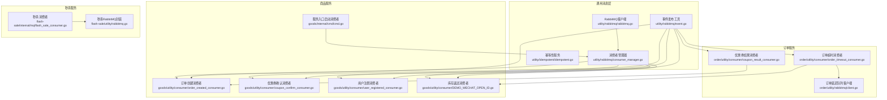
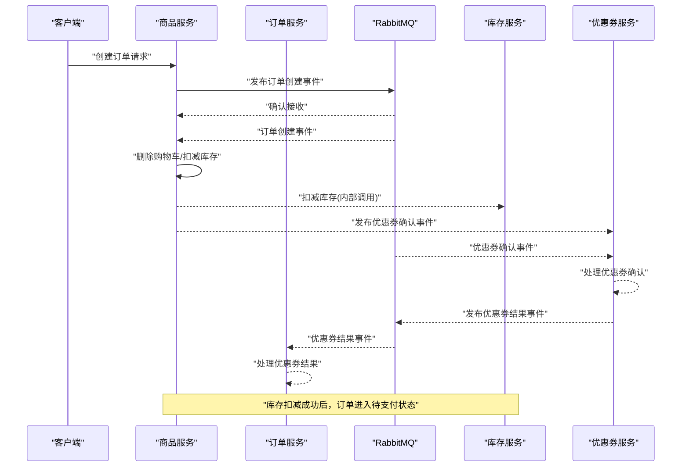
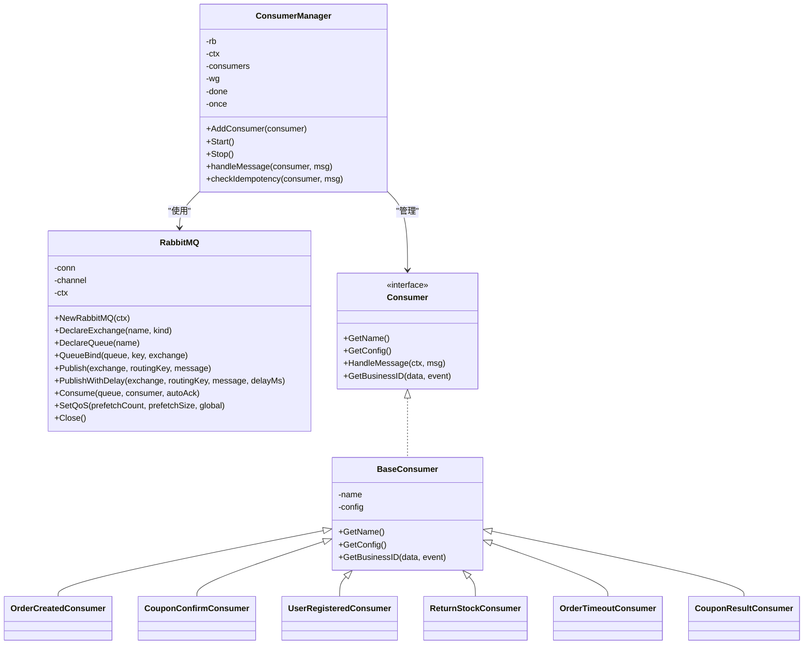
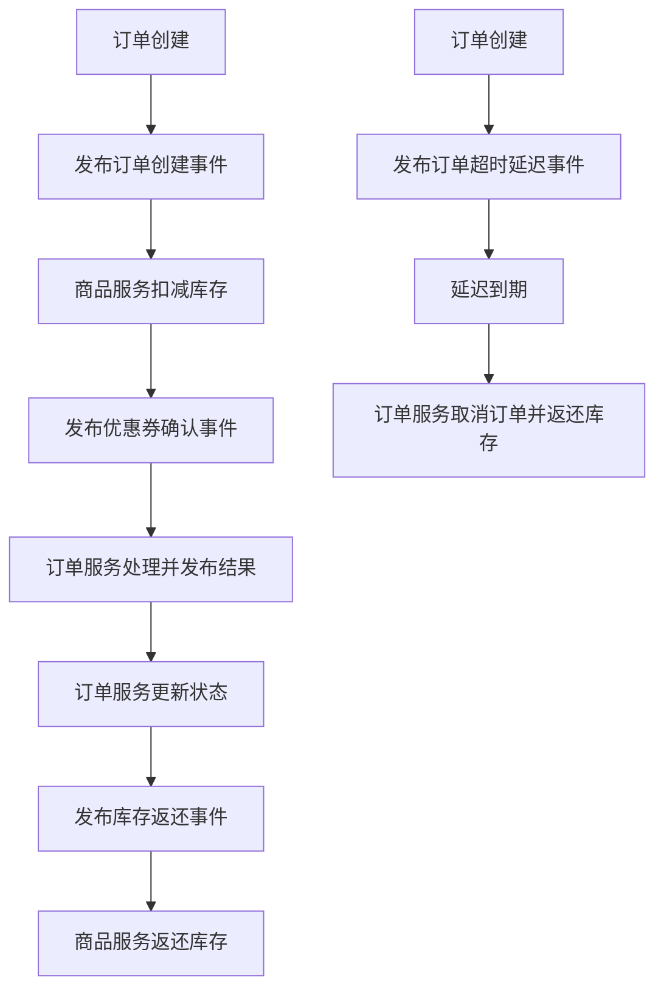
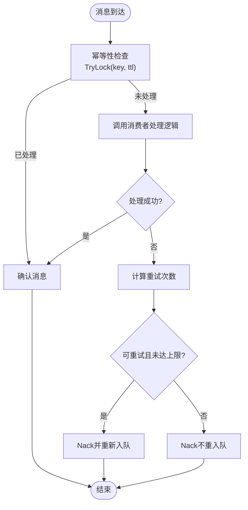
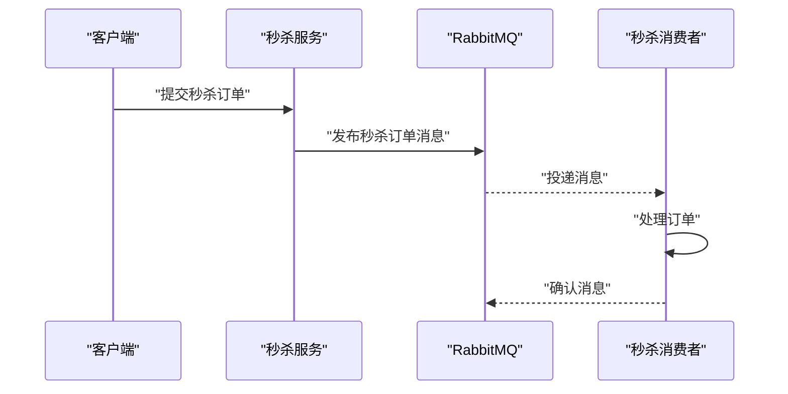
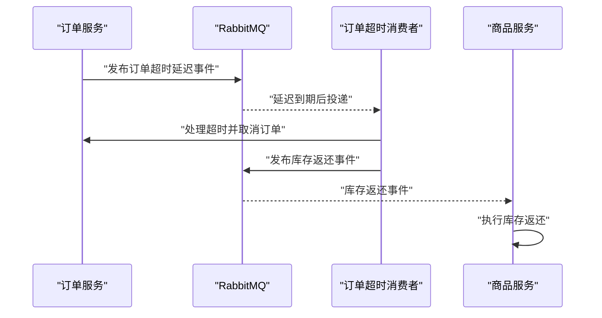
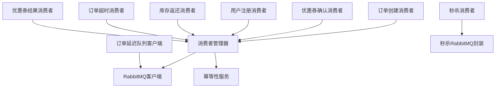

# 消息队列系统

<cite>
**本文档引用的文件**
- [utility/rabbitmq/rabbitmq.go](file://utility/rabbitmq/rabbitmq.go)
- [utility/rabbitmq/consumer_manager.go](file://utility/rabbitmq/consumer_manager.go)
- [utility/rabbitmq/event.go](file://utility/rabbitmq/event.go)
- [app/flash-sale/utility/rabbitmq.go](file://app/flash-sale/utility/rabbitmq.go)
- [app/order/utility/rabbitmq/client.go](file://app/order/utility/rabbitmq/client.go)
- [app/goods/utility/consumer/order_created_consumer.go](file://app/goods/utility/consumer/order_created_consumer.go)
- [app/goods/utility/consumer/coupon_confirm_consumer.go](file://app/goods/utility/consumer/coupon_confirm_consumer.go)
- [app/goods/utility/consumer/user_registered_consumer.go](file://app/goods/utility/consumer/user_registered_consumer.go)
- [app/goods/utility/consumer/DEMO_WECHAT_OPEN_ID.go](file://app/goods/utility/consumer/DEMO_WECHAT_OPEN_ID.go)
- [app/order/utility/consumer/order_timeout_consumer.go](file://app/order/utility/consumer/order_timeout_consumer.go)
- [app/order/utility/consumer/coupon_result_consumer.go](file://app/order/utility/consumer/coupon_result_consumer.go)
- [app/flash-sale/internal/mq/flash_sale_consumer.go](file://app/flash-sale/internal/mq/flash_sale_consumer.go)
- [app/goods/internal/cmd/cmd.go](file://app/goods/internal/cmd/cmd.go)
- [utility/idempotent/idempotent.go](file://utility/idempotent/idempotent.go)
- [doc/RabbitMQ消息处理优化实战-幂等性与重试策略.md](file://doc/RabbitMQ消息处理优化实战-幂等性与重试策略.md)
- [doc/延迟队列处理订单超时（RabbitMQ死信队列实战）.md](file://doc/延迟队列处理订单超时（RabbitMQ死信队列实战）.md)
</cite>

## 目录
1. [引言](#引言)
2. [项目结构](#项目结构)
3. [核心组件](#核心组件)
4. [架构总览](#架构总览)
5. [详细组件分析](#详细组件分析)
6. [依赖关系分析](#依赖关系分析)
7. [性能考虑](#性能考虑)
8. [故障排查指南](#故障排查指南)
9. [结论](#结论)
10. [附录](#附录)

## 引言
本文件面向微服务架构中的消息队列系统，重点围绕RabbitMQ在系统内的设计与实现展开，涵盖消息模型、可靠性保障、生产者与消费者模式、幂等性设计、重试与死信队列处理、秒杀系统异步处理、订单超时处理与库存返还等业务场景，并提供监控、调试与性能优化建议。文档旨在帮助开发者快速理解并高效使用消息队列能力。

## 项目结构
消息队列相关代码主要分布在以下模块：
- 通用RabbitMQ客户端与消费者管理器：utility/rabbitmq
- 各业务服务的消费者实现：app/goods/utility/consumer、app/order/utility/consumer
- 订单服务延迟队列专用客户端：app/order/utility/rabbitmq
- 秒杀服务专用RabbitMQ封装：app/flash-sale/utility/rabbitmq
- 幂等性服务：utility/idempotent
- 文档与最佳实践：doc目录下的RabbitMQ相关文档

图表来源
- [utility/rabbitmq/rabbitmq.go](file://utility/rabbitmq/rabbitmq.go#L1-L196)
- [utility/rabbitmq/consumer_manager.go](file://utility/rabbitmq/consumer_manager.go#L1-L446)
- [utility/rabbitmq/event.go](file://utility/rabbitmq/event.go#L1-L269)
- [app/goods/utility/consumer/order_created_consumer.go](file://app/goods/utility/consumer/order_created_consumer.go#L1-L65)
- [app/goods/utility/consumer/coupon_confirm_consumer.go](file://app/goods/utility/consumer/coupon_confirm_consumer.go#L1-L55)
- [app/goods/utility/consumer/user_registered_consumer.go](file://app/goods/utility/consumer/user_registered_consumer.go#L1-L55)
- [app/goods/utility/consumer/DEMO_WECHAT_OPEN_ID.go](file://app/goods/utility/consumer/DEMO_WECHAT_OPEN_ID.go#L1-L58)
- [app/order/utility/consumer/order_timeout_consumer.go](file://app/order/utility/consumer/order_timeout_consumer.go#L1-L87)
- [app/order/utility/consumer/coupon_result_consumer.go](file://app/order/utility/consumer/coupon_result_consumer.go#L1-L54)
- [app/order/utility/rabbitmq/client.go](file://app/order/utility/rabbitmq/client.go#L1-L253)
- [app/flash-sale/internal/mq/flash_sale_consumer.go](file://app/flash-sale/internal/mq/flash_sale_consumer.go#L1-L134)
- [app/flash-sale/utility/rabbitmq.go](file://app/flash-sale/utility/rabbitmq.go#L1-L132)
- [app/goods/internal/cmd/cmd.go](file://app/goods/internal/cmd/cmd.go#L1-L104)

章节来源
- [utility/rabbitmq/rabbitmq.go](file://utility/rabbitmq/rabbitmq.go#L1-L196)
- [utility/rabbitmq/consumer_manager.go](file://utility/rabbitmq/consumer_manager.go#L1-L446)
- [utility/rabbitmq/event.go](file://utility/rabbitmq/event.go#L1-L269)
- [app/goods/internal/cmd/cmd.go](file://app/goods/internal/cmd/cmd.go#L1-L104)

## 核心组件
- 通用RabbitMQ客户端：提供连接、声明交换机/队列、发布消息、延迟消息、消费消息、QoS设置、连接关闭等能力。
- 消费者管理器：统一管理消费者生命周期、队列声明与绑定、QoS、幂等性检查、重试与死信处理、优雅停机。
- 事件发布工具：封装常用业务事件（用户注册、优惠券确认/结果、订单创建、订单超时、库存返还）的发布逻辑。
- 幂等性服务：基于Redis实现分布式幂等锁，确保消息仅被处理一次。
- 业务消费者：各服务内实现具体业务逻辑的消费者，遵循统一接口规范。
- 订单延迟队列客户端：订单服务专用的延迟交换机与队列初始化及消息发送能力。
- 秒杀RabbitMQ封装：秒杀服务专用的连接、声明与消息发布能力。

章节来源
- [utility/rabbitmq/rabbitmq.go](file://utility/rabbitmq/rabbitmq.go#L13-L196)
- [utility/rabbitmq/consumer_manager.go](file://utility/rabbitmq/consumer_manager.go#L19-L446)
- [utility/rabbitmq/event.go](file://utility/rabbitmq/event.go#L9-L269)
- [utility/idempotent/idempotent.go](file://utility/idempotent/idempotent.go#L11-L153)
- [app/order/utility/rabbitmq/client.go](file://app/order/utility/rabbitmq/client.go#L13-L253)
- [app/flash-sale/utility/rabbitmq.go](file://app/flash-sale/utility/rabbitmq.go#L15-L132)

## 架构总览
消息队列在微服务中的作用：
- 异步解耦：订单创建、库存扣减、优惠券发放、用户注册联动等通过消息异步触发。
- 流量削峰：秒杀、促销活动等高并发场景通过消息队列缓冲瞬时流量。
- 可靠性保障：持久化消息、幂等性、重试与死信队列确保业务不丢失、不重复。

图表来源
- [utility/rabbitmq/event.go](file://utility/rabbitmq/event.go#L188-L224)
- [app/goods/utility/consumer/order_created_consumer.go](file://app/goods/utility/consumer/order_created_consumer.go#L32-L64)
- [app/goods/utility/consumer/coupon_confirm_consumer.go](file://app/goods/utility/consumer/coupon_confirm_consumer.go#L34-L54)
- [app/order/utility/consumer/coupon_result_consumer.go](file://app/order/utility/consumer/coupon_result_consumer.go#L34-L54)

## 详细组件分析

### 通用RabbitMQ客户端与消费者管理器
- 连接与重试：指数退避重试策略，避免雪崩效应，提升连接稳定性。
- 交换机/队列管理：支持声明交换机（含延迟交换机）、声明队列、绑定路由键。
- 发布与延迟：支持普通消息与延迟消息（x-delay），消息持久化。
- 消费：Consume接口，支持自动/手动确认。
- QoS：SetQoS设置预取消费数量，控制并发度。
- 消费者管理器：统一注册、启动、停止消费者；自动声明队列与绑定；幂等性检查；重试与死信处理；优雅停机。

图表来源
- [utility/rabbitmq/rabbitmq.go](file://utility/rabbitmq/rabbitmq.go#L13-L196)
- [utility/rabbitmq/consumer_manager.go](file://utility/rabbitmq/consumer_manager.go#L19-L446)
- [app/goods/utility/consumer/order_created_consumer.go](file://app/goods/utility/consumer/order_created_consumer.go#L13-L30)
- [app/goods/utility/consumer/coupon_confirm_consumer.go](file://app/goods/utility/consumer/coupon_confirm_consumer.go#L11-L32)
- [app/goods/utility/consumer/user_registered_consumer.go](file://app/goods/utility/consumer/user_registered_consumer.go#L11-L32)
- [app/goods/utility/consumer/DEMO_WECHAT_OPEN_ID.go](file://app/goods/utility/consumer/DEMO_WECHAT_OPEN_ID.go#L12-L29)
- [app/order/utility/consumer/order_timeout_consumer.go](file://app/order/utility/consumer/order_timeout_consumer.go#L16-L37)
- [app/order/utility/consumer/coupon_result_consumer.go](file://app/order/utility/consumer/coupon_result_consumer.go#L11-L32)

章节来源
- [utility/rabbitmq/rabbitmq.go](file://utility/rabbitmq/rabbitmq.go#L19-L196)
- [utility/rabbitmq/consumer_manager.go](file://utility/rabbitmq/consumer_manager.go#L48-L446)

### 事件发布与业务模型
- 用户注册事件：商品服务在用户注册后发布事件，优惠券服务接收并发放优惠券。
- 订单创建事件：商品服务在订单创建后发布事件，扣减库存并触发优惠券确认。
- 优惠券确认/结果事件：商品服务发布确认请求，订单服务处理并回传结果。
- 订单超时事件：订单服务发布延迟消息，超时后取消订单并返还库存。
- 库存返还事件：订单取消后，商品服务接收并执行库存返还。

图表来源
- [utility/rabbitmq/event.go](file://utility/rabbitmq/event.go#L13-L269)
- [app/goods/utility/consumer/order_created_consumer.go](file://app/goods/utility/consumer/order_created_consumer.go#L32-L64)
- [app/goods/utility/consumer/coupon_confirm_consumer.go](file://app/goods/utility/consumer/coupon_confirm_consumer.go#L34-L54)
- [app/order/utility/consumer/coupon_result_consumer.go](file://app/order/utility/consumer/coupon_result_consumer.go#L34-L54)
- [app/order/utility/consumer/order_timeout_consumer.go](file://app/order/utility/consumer/order_timeout_consumer.go#L39-L87)
- [app/goods/utility/consumer/DEMO_WECHAT_OPEN_ID.go](file://app/goods/utility/consumer/DEMO_WECHAT_OPEN_ID.go#L31-L57)

章节来源
- [utility/rabbitmq/event.go](file://utility/rabbitmq/event.go#L13-L269)

### 幂等性设计与重试策略
- 幂等性：基于Redis的SETNX实现分布式锁，生成唯一幂等键（消费者名+消息ID+业务ID），支持自定义TTL。
- 重试与死信：消费者管理器统一处理重试次数、错误类型识别（临时/永久）、Nack策略；支持最大重试次数限制。
- 错误分类：提供临时性错误与永久性错误包装类型，结合错误文本匹配实现智能重试判断。

图表来源
- [utility/rabbitmq/consumer_manager.go](file://utility/rabbitmq/consumer_manager.go#L196-L406)
- [utility/idempotent/idempotent.go](file://utility/idempotent/idempotent.go#L35-L85)

章节来源
- [utility/rabbitmq/consumer_manager.go](file://utility/rabbitmq/consumer_manager.go#L196-L406)
- [utility/idempotent/idempotent.go](file://utility/idempotent/idempotent.go#L35-L85)

### 秒杀系统异步处理
- 秒杀服务独立的RabbitMQ封装，声明direct交换机与队列，发布持久化消息。
- 消费者独立启动，消费队列消息并处理订单逻辑；若RabbitMQ未初始化，则本地降级处理。
- 与通用消费者管理器不同，秒杀消费者采用轻量实现，专注秒杀场景。

图表来源
- [app/flash-sale/utility/rabbitmq.go](file://app/flash-sale/utility/rabbitmq.go#L57-L120)
- [app/flash-sale/internal/mq/flash_sale_consumer.go](file://app/flash-sale/internal/mq/flash_sale_consumer.go#L28-L95)

章节来源
- [app/flash-sale/utility/rabbitmq.go](file://app/flash-sale/utility/rabbitmq.go#L57-L120)
- [app/flash-sale/internal/mq/flash_sale_consumer.go](file://app/flash-sale/internal/mq/flash_sale_consumer.go#L28-L95)

### 订单超时处理与库存返还
- 延迟交换机：使用x-delayed-message插件，消息携带x-delay头部实现延迟投递。
- 订单超时消费者：解析事件、校验类型与时间、执行取消逻辑、触发库存返还。
- 库存返还：订单取消后发布库存返还事件，商品服务消费并执行返还。

图表来源
- [utility/rabbitmq/event.go](file://utility/rabbitmq/event.go#L152-L186)
- [app/order/utility/consumer/order_timeout_consumer.go](file://app/order/utility/consumer/order_timeout_consumer.go#L39-L87)
- [app/goods/utility/consumer/DEMO_WECHAT_OPEN_ID.go](file://app/goods/utility/consumer/DEMO_WECHAT_OPEN_ID.go#L31-L57)

章节来源
- [utility/rabbitmq/event.go](file://utility/rabbitmq/event.go#L152-L186)
- [app/order/utility/consumer/order_timeout_consumer.go](file://app/order/utility/consumer/order_timeout_consumer.go#L39-L87)
- [app/goods/utility/consumer/DEMO_WECHAT_OPEN_ID.go](file://app/goods/utility/consumer/DEMO_WECHAT_OPEN_ID.go#L31-L57)

### 生产者与消费者的实现模式
- 生产者：通过事件发布工具或通用客户端发布消息，设置交换机、路由键、持久化与延迟。
- 消费者：实现统一接口，定义队列、路由键、消费者标签、QoS与重试策略；在HandleMessage中实现业务逻辑。
- 启动：商品服务通过命令入口创建消费者管理器并注册多个消费者，统一启动与优雅停机。

章节来源
- [utility/rabbitmq/event.go](file://utility/rabbitmq/event.go#L23-L269)
- [app/goods/utility/consumer/order_created_consumer.go](file://app/goods/utility/consumer/order_created_consumer.go#L18-L30)
- [app/goods/internal/cmd/cmd.go](file://app/goods/internal/cmd/cmd.go#L34-L103)

## 依赖关系分析
- 消费者管理器依赖通用RabbitMQ客户端与幂等性服务，统一处理队列声明、绑定、消费、幂等与重试。
- 业务消费者依赖消费者管理器提供的配置与生命周期管理，专注于业务处理。
- 订单延迟队列客户端独立于通用管理器，专门处理延迟消息场景。
- 秒杀服务拥有独立的RabbitMQ封装与消费者，降低耦合。

图表来源
- [utility/rabbitmq/consumer_manager.go](file://utility/rabbitmq/consumer_manager.go#L48-L194)
- [utility/idempotent/idempotent.go](file://utility/idempotent/idempotent.go#L11-L153)
- [app/order/utility/rabbitmq/client.go](file://app/order/utility/rabbitmq/client.go#L13-L188)
- [app/flash-sale/internal/mq/flash_sale_consumer.go](file://app/flash-sale/internal/mq/flash_sale_consumer.go#L16-L55)
- [app/flash-sale/utility/rabbitmq.go](file://app/flash-sale/utility/rabbitmq.go#L15-L96)

章节来源
- [utility/rabbitmq/consumer_manager.go](file://utility/rabbitmq/consumer_manager.go#L48-L194)
- [app/order/utility/rabbitmq/client.go](file://app/order/utility/rabbitmq/client.go#L13-L188)
- [app/flash-sale/internal/mq/flash_sale_consumer.go](file://app/flash-sale/internal/mq/flash_sale_consumer.go#L16-L55)

## 性能考虑
- QoS与并发：通过SetQoS控制预取数量，避免消费者过载；按服务负载合理设置PrefetchCount。
- 连接与重试：指数退避重试减少抖动，避免雪崩；连接池化与复用通道。
- 消息持久化：对关键业务消息开启持久化，配合队列持久化提升可靠性。
- 幂等性：通过幂等键避免重复处理，减少无效计算与资源消耗。
- 监控与告警：结合Grafana/Prometheus对消息积压、处理时延、重试次数、消费者存活等指标进行监控。

## 故障排查指南
- 连接失败：检查RabbitMQ地址、凭证、虚拟主机；查看指数退避重试日志定位问题。
- 消息未消费：确认交换机/队列声明与绑定是否正确；核对路由键与消费者标签。
- 重复消费：检查幂等性键生成与TTL设置；确认Redis可用性。
- 重试风暴：检查最大重试次数与错误类型识别；避免将永久性错误误判为临时性。
- 延迟消息未生效：确认延迟交换机类型与x-delay头部；检查消息持久化与延迟时间配置。
- 秒杀降级：若RabbitMQ不可用，检查本地降级处理逻辑是否执行。

章节来源
- [utility/rabbitmq/rabbitmq.go](file://utility/rabbitmq/rabbitmq.go#L19-L54)
- [utility/rabbitmq/consumer_manager.go](file://utility/rabbitmq/consumer_manager.go#L173-L194)
- [utility/idempotent/idempotent.go](file://utility/idempotent/idempotent.go#L117-L133)
- [app/order/utility/rabbitmq/client.go](file://app/order/utility/rabbitmq/client.go#L125-L188)
- [app/flash-sale/internal/mq/flash_sale_consumer.go](file://app/flash-sale/internal/mq/flash_sale_consumer.go#L97-L133)

## 结论
本项目通过统一的RabbitMQ客户端与消费者管理器，结合幂等性与智能重试策略，构建了高可靠、可扩展的消息队列体系。延迟队列与死信机制有效支撑订单超时与库存返还等关键业务，秒杀场景采用独立封装实现低耦合与高可用。建议持续完善监控与告警，结合业务增长动态调整QoS与重试策略，确保系统在高并发下的稳定性与一致性。

## 附录
- 参考文档：RabbitMQ消息处理优化实战、延迟队列处理订单超时（RabbitMQ死信队列实战）
- 相关实现：事件发布工具、消费者接口与基类、订单延迟队列客户端、秒杀RabbitMQ封装

章节来源
- [doc/RabbitMQ消息处理优化实战-幂等性与重试策略.md](file://doc/RabbitMQ消息处理优化实战-幂等性与重试策略.md#L1-L492)
- [doc/延迟队列处理订单超时（RabbitMQ死信队列实战）.md](file://doc/延迟队列处理订单超时（RabbitMQ死信队列实战）.md#L1-L437)