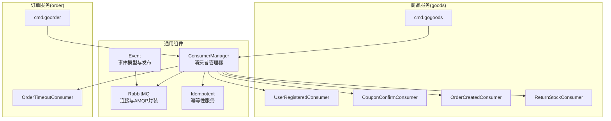
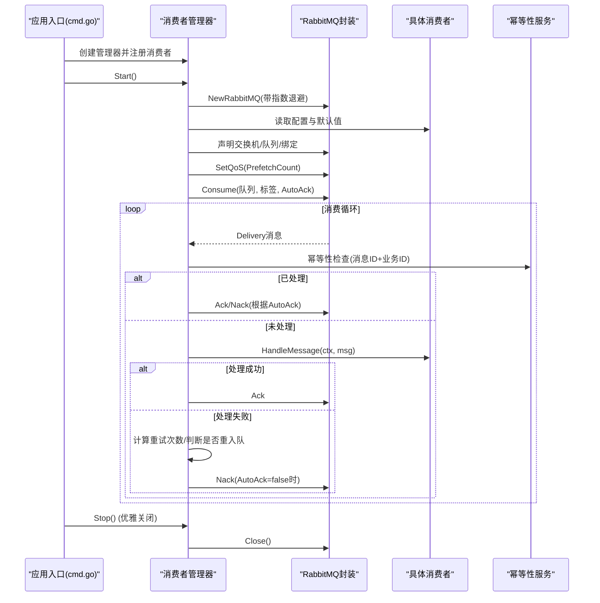
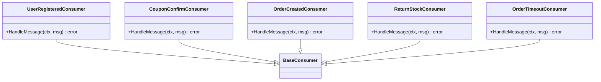
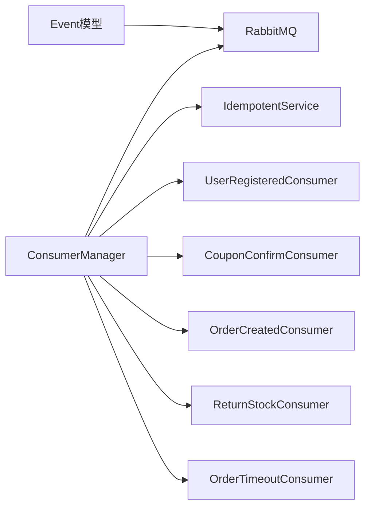

# 消费者管理机制

<cite>
**本文档引用的文件**
- [consumer_manager.go](file://utility/rabbitmq/consumer_manager.go)
- [rabbitmq.go](file://utility/rabbitmq/rabbitmq.go)
- [event.go](file://utility/rabbitmq/event.go)
- [idempotent.go](file://utility/idempotent/idempotent.go)
- [order_created_consumer.go](file://app/goods/utility/consumer/order_created_consumer.go)
- [user_registered_consumer.go](file://app/goods/utility/consumer/user_registered_consumer.go)
- [coupon_confirm_consumer.go](file://app/goods/utility/consumer/coupon_confirm_consumer.go)
- [DEMO_WECHAT_OPEN_ID.go](file://app/goods/utility/consumer/DEMO_WECHAT_OPEN_ID.go)
- [order_timeout_consumer.go](file://app/order/utility/consumer/order_timeout_consumer.go)
- [cmd.go（goods）](file://app/goods/internal/cmd/cmd.go)
- [cmd.go（order）](file://app/order/internal/cmd/cmd.go)
- [metrics.go](file://utility/metrics/metrics.go)
</cite>

## 目录
1. [简介](#简介)
2. [项目结构](#项目结构)
3. [核心组件](#核心组件)
4. [架构总览](#架构总览)
5. [详细组件分析](#详细组件分析)
6. [依赖关系分析](#依赖关系分析)
7. [性能考虑](#性能考虑)
8. [故障排查指南](#故障排查指南)
9. [结论](#结论)
10. [附录](#附录)

## 简介
本文件系统性阐述本仓库中的“消费者管理机制”，涵盖消费者注册、启动与停止的完整流程，消费者管理器的设计原理与实现细节（含生命周期管理与并发控制），事件驱动架构与回调注册机制，异常处理、重连与优雅关闭策略，并提供性能监控与调优建议及实际使用示例与最佳实践。

## 项目结构
围绕消费者管理机制的核心代码位于 utility/rabbitmq 与各应用模块的 utility/consumer 下，配合应用层的入口 cmd.go 完成消费者注册与生命周期管理。



**图表来源**
- [consumer_manager.go](file://utility/rabbitmq/consumer_manager.go#L48-L111)
- [rabbitmq.go](file://utility/rabbitmq/rabbitmq.go#L13-L82)
- [event.go](file://utility/rabbitmq/event.go#L24-L56)
- [idempotent.go](file://utility/idempotent/idempotent.go#L11-L102)
- [order_created_consumer.go](file://app/goods/utility/consumer/order_created_consumer.go#L14-L30)
- [user_registered_consumer.go](file://app/goods/utility/consumer/user_registered_consumer.go#L12-L27)
- [coupon_confirm_consumer.go](file://app/goods/utility/consumer/coupon_confirm_consumer.go#L12-L27)
- [DEMO_WECHAT_OPEN_ID.go](file://app/goods/utility/consumer/DEMO_WECHAT_OPEN_ID.go#L12-L25)
- [order_timeout_consumer.go](file://app/order/utility/consumer/order_timeout_consumer.go#L16-L32)
- [cmd.go（goods）](file://app/goods/internal/cmd/cmd.go#L34-L48)
- [cmd.go（order）](file://app/order/internal/cmd/cmd.go#L29-L44)

**章节来源**
- [consumer_manager.go](file://utility/rabbitmq/consumer_manager.go#L48-L111)
- [rabbitmq.go](file://utility/rabbitmq/rabbitmq.go#L13-L82)
- [cmd.go（goods）](file://app/goods/internal/cmd/cmd.go#L34-L48)
- [cmd.go（order）](file://app/order/internal/cmd/cmd.go#L29-L44)

## 核心组件
- 消费者接口与配置
  - 接口定义包含名称、配置、消息处理回调与可选的业务ID提取。
  - 配置项覆盖交换机/队列/路由键、消费者标签、自动确认、预取数量、持久化、最大重试次数等。
- 消费者管理器
  - 负责创建RabbitMQ连接、注册消费者、并发启动、统一优雅关闭。
  - 内部维护消费者列表、等待组、done信号与一次性的停止逻辑。
- RabbitMQ封装
  - 提供连接建立（带指数退避重试）、声明交换机/队列、绑定、发布（含延迟）、消费、QoS设置与关闭。
- 幂等性服务
  - 基于Redis的TryLock/ReleaseLock/CheckAndLock与消息幂等键生成，支持按消息ID与业务ID组合去重。
- 事件模型与发布
  - 定义用户注册、优惠券、订单、库存返还等事件结构与发布方法，支持普通与延迟消息发布。

**章节来源**
- [consumer_manager.go](file://utility/rabbitmq/consumer_manager.go#L19-L46)
- [consumer_manager.go](file://utility/rabbitmq/consumer_manager.go#L48-L71)
- [rabbitmq.go](file://utility/rabbitmq/rabbitmq.go#L19-L54)
- [rabbitmq.go](file://utility/rabbitmq/rabbitmq.go#L149-L195)
- [idempotent.go](file://utility/idempotent/idempotent.go#L11-L102)
- [event.go](file://utility/rabbitmq/event.go#L13-L186)

## 架构总览
消费者管理机制采用事件驱动架构：应用启动时创建消费者管理器，注册具体消费者，每个消费者独立声明/绑定队列并开始消费。消息到达后，管理器统一进行幂等性检查、错误分类与重试决策，最终确认或拒绝消息。



**图表来源**
- [cmd.go（goods）](file://app/goods/internal/cmd/cmd.go#L34-L57)
- [cmd.go（order）](file://app/order/internal/cmd/cmd.go#L29-L57)
- [consumer_manager.go](file://utility/rabbitmq/consumer_manager.go#L79-L171)
- [consumer_manager.go](file://utility/rabbitmq/consumer_manager.go#L196-L263)
- [rabbitmq.go](file://utility/rabbitmq/rabbitmq.go#L19-L54)
- [rabbitmq.go](file://utility/rabbitmq/rabbitmq.go#L126-L137)
- [idempotent.go](file://utility/idempotent/idempotent.go#L35-L79)

## 详细组件分析

### 消费者管理器（ConsumerManager）
- 设计要点
  - 单一职责：集中管理消费者生命周期、并发与资源回收。
  - 并发模型：每个消费者独立goroutine运行，使用WaitGroup等待全部退出。
  - 优雅关闭：once确保Stop只执行一次，关闭done信号，等待所有消费者退出后再关闭RabbitMQ连接。
- 关键流程
  - 启动：校验消费者列表，逐个启动，内部设置默认配置与QoS，订阅消息通道。
  - 消息处理：幂等性检查、错误分类（临时/永久）、重试计数与头部更新、确认或拒绝。
  - 停止：关闭done信号，等待wg，最后关闭RabbitMQ连接。

```mermaid
classDiagram
class ConsumerManager {
-rb : RabbitMQ
-ctx : context.Context
-consumers : []Consumer
-wg : sync.WaitGroup
-done : chan struct{}
-once : sync.Once
+AddConsumer(consumer)
+Start() error
+Stop()
-startConsumer(consumer)
-setupQueue(config)
-handleMessage(consumer, msg)
-checkIdempotency(consumer, msg) error
}
class RabbitMQ {
-conn : *amqp.Connection
-channel : *amqp.Channel
+NewRabbitMQ(ctx) *RabbitMQ
+DeclareExchange(name, kind)
+DeclareQueue(name) Queue
+QueueBind(queue, key, exchange)
+Consume(queue, consumer, autoAck)
+SetQoS(prefetchCount, prefetchSize, global)
+Publish(exchange, routingKey, message)
+PublishWithDelay(exchange, routingKey, message, delayMs)
+Close()
}
class Consumer {
<<interface>>
+GetName() string
+GetConfig() ConsumerConfig
+HandleMessage(ctx, msg) error
+GetBusinessID(data, event) string
}
class BaseConsumer {
-name : string
-config : ConsumerConfig
+GetName() string
+GetConfig() ConsumerConfig
+GetBusinessID(data, event) string
}
class IdempotentService {
<<interface>>
+TryLock(ctx, key, expiration) (bool, error)
+ReleaseLock(ctx, key) error
+CheckAndLock(ctx, key, expiration) (bool, error)
+GenerateMessageKey(prefix, messageID, businessID) string
}
ConsumerManager --> RabbitMQ : "使用"
ConsumerManager --> Consumer : "管理"
BaseConsumer ..|> Consumer
ConsumerManager --> IdempotentService : "幂等性"
```

**图表来源**
- [consumer_manager.go](file://utility/rabbitmq/consumer_manager.go#L48-L56)
- [consumer_manager.go](file://utility/rabbitmq/consumer_manager.go#L113-L171)
- [consumer_manager.go](file://utility/rabbitmq/consumer_manager.go#L196-L320)
- [rabbitmq.go](file://utility/rabbitmq/rabbitmq.go#L13-L82)
- [idempotent.go](file://utility/idempotent/idempotent.go#L11-L21)

**章节来源**
- [consumer_manager.go](file://utility/rabbitmq/consumer_manager.go#L79-L111)
- [consumer_manager.go](file://utility/rabbitmq/consumer_manager.go#L113-L171)
- [consumer_manager.go](file://utility/rabbitmq/consumer_manager.go#L196-L263)
- [consumer_manager.go](file://utility/rabbitmq/consumer_manager.go#L265-L320)

### RabbitMQ封装（连接与AMQP操作）
- 连接建立：使用指数退避重试策略，避免雪崩效应，限定最大重试时间。
- AMQP操作：声明交换机（含延迟交换机参数）、声明队列、绑定、发布（含延迟）、消费、QoS设置、关闭连接。
- 错误处理：对连接失败进行重试与日志记录，保证服务可用性。

**章节来源**
- [rabbitmq.go](file://utility/rabbitmq/rabbitmq.go#L19-L54)
- [rabbitmq.go](file://utility/rabbitmq/rabbitmq.go#L149-L195)

### 幂等性服务（基于Redis）
- 设计目标：防止重复处理同一条消息，结合消息ID与业务ID生成唯一键，设置过期时间。
- 方法族：TryLock/ReleaseLock/CheckAndLock，支持全局函数与服务实例两种调用方式。
- 默认实现：基于GoFrame Redis客户端，通过类型断言适配不同客户端形态。

**章节来源**
- [idempotent.go](file://utility/idempotent/idempotent.go#L35-L79)
- [idempotent.go](file://utility/idempotent/idempotent.go#L117-L153)

### 事件模型与发布
- 事件类型：用户注册、优惠券发放/确认/结果、订单创建、订单超时、库存返还等。
- 发布流程：声明交换机、构造事件、发布（普通/延迟），并记录日志。
- 延迟消息：通过延迟交换机与消息头x-delay实现。

**章节来源**
- [event.go](file://utility/rabbitmq/event.go#L13-L186)

### 具体消费者实现
- 商品服务消费者
  - 用户注册事件消费者：发放优惠券。
  - 优惠券确认消费者：处理订单确认消息。
  - 订单创建消费者：清空购物车、扣减库存。
  - 订单库存返还消费者：返还库存。
- 订单服务消费者
  - 订单超时未支付消费者：到期判断、取消订单、发布库存返还事件。



**图表来源**
- [user_registered_consumer.go](file://app/goods/utility/consumer/user_registered_consumer.go#L11-L32)
- [coupon_confirm_consumer.go](file://app/goods/utility/consumer/coupon_confirm_consumer.go#L11-L27)
- [order_created_consumer.go](file://app/goods/utility/consumer/order_created_consumer.go#L13-L29)
- [DEMO_WECHAT_OPEN_ID.go](file://app/goods/utility/consumer/DEMO_WECHAT_OPEN_ID.go#L12-L25)
- [order_timeout_consumer.go](file://app/order/utility/consumer/order_timeout_consumer.go#L16-L32)

**章节来源**
- [user_registered_consumer.go](file://app/goods/utility/consumer/user_registered_consumer.go#L34-L54)
- [coupon_confirm_consumer.go](file://app/goods/utility/consumer/coupon_confirm_consumer.go#L34-L54)
- [order_created_consumer.go](file://app/goods/utility/consumer/order_created_consumer.go#L32-L64)
- [DEMO_WECHAT_OPEN_ID.go](file://app/goods/utility/consumer/DEMO_WECHAT_OPEN_ID.go#L31-L57)
- [order_timeout_consumer.go](file://app/order/utility/consumer/order_timeout_consumer.go#L39-L86)

### 生命周期与并发控制
- 注册：应用入口调用管理器的AddConsumer注册具体消费者。
- 启动：Start遍历消费者，为每个消费者启动独立goroutine，设置QoS与队列绑定。
- 并发：每个消费者独立消费，互不影响；通过WaitGroup聚合等待。
- 停止：Stop仅执行一次，关闭done信号，等待wg，最后关闭RabbitMQ连接。

**章节来源**
- [cmd.go（goods）](file://app/goods/internal/cmd/cmd.go#L82-L103)
- [cmd.go（order）](file://app/order/internal/cmd/cmd.go#L76-L89)
- [consumer_manager.go](file://utility/rabbitmq/consumer_manager.go#L79-L111)

### 事件驱动与回调注册机制
- 回调注册：通过AddConsumer将实现Consumer接口的实例注册到管理器。
- 消息分发：Consume返回的消息通道在管理器内部循环监听，异步交给handleMessage处理。
- 事件模型：事件结构体与发布函数解耦，便于跨服务通信。

**章节来源**
- [consumer_manager.go](file://utility/rabbitmq/consumer_manager.go#L73-L77)
- [consumer_manager.go](file://utility/rabbitmq/consumer_manager.go#L149-L170)
- [event.go](file://utility/rabbitmq/event.go#L24-L56)

### 异常处理、重连与优雅关闭
- 异常处理
  - panic恢复：handleMessage内defer recover，遇到panic时记录错误并Nack。
  - 错误分类：提供TemporaryError/PermanentError两类包装，辅助shouldRequeue判断。
  - 重试策略：根据错误类型与重试次数决定是否重新入队；重试次数存储在消息头x-retry-count。
- 重连机制
  - RabbitMQ连接：NewRabbitMQ使用指数退避重试，避免雪崩；最大重试时间限制。
- 优雅关闭
  - Stop使用once确保只执行一次；关闭done信号后等待所有消费者退出，再关闭RabbitMQ连接。

**章节来源**
- [consumer_manager.go](file://utility/rabbitmq/consumer_manager.go#L196-L263)
- [consumer_manager.go](file://utility/rabbitmq/consumer_manager.go#L322-L406)
- [rabbitmq.go](file://utility/rabbitmq/rabbitmq.go#L19-L54)
- [consumer_manager.go](file://utility/rabbitmq/consumer_manager.go#L97-L111)

### 性能监控与调优
- 指标采集
  - HTTP请求计数、延迟直方图、错误计数等指标通过Prometheus导出。
  - 在gHTTP服务器上注册/metrics端点，便于Prometheus抓取。
- 调优建议
  - 预取数量（PrefetchCount）：根据消费者处理能力调整，避免积压或饥饿。
  - 并发消费者数量：按CPU/IO瓶颈与队列长度平衡，避免过度并发导致上下文切换开销。
  - 幂等键过期：根据消息处理时长与重试策略合理设置TTL，避免过短导致误判或过长占用空间。
  - 重试上限：结合MaxRetries与shouldRequeue策略，减少无效重试。

**章节来源**
- [metrics.go](file://utility/metrics/metrics.go#L14-L71)

## 依赖关系分析
- 模块耦合
  - ConsumerManager依赖RabbitMQ封装与幂等性服务，面向接口编程，降低耦合。
  - 具体消费者依赖业务DAO/Logic与公共事件模型，保持业务无关性。
- 外部依赖
  - RabbitMQ客户端、GoFrame框架、Prometheus客户端。
- 潜在风险
  - 幂等性服务依赖Redis，需确保高可用与容量规划。
  - 消费者处理逻辑若阻塞，会影响整个消费者线程池吞吐。



**图表来源**
- [consumer_manager.go](file://utility/rabbitmq/consumer_manager.go#L48-L56)
- [rabbitmq.go](file://utility/rabbitmq/rabbitmq.go#L13-L82)
- [idempotent.go](file://utility/idempotent/idempotent.go#L11-L21)
- [event.go](file://utility/rabbitmq/event.go#L13-L186)

**章节来源**
- [consumer_manager.go](file://utility/rabbitmq/consumer_manager.go#L48-L56)
- [rabbitmq.go](file://utility/rabbitmq/rabbitmq.go#L13-L82)
- [idempotent.go](file://utility/idempotent/idempotent.go#L11-L21)

## 性能考虑
- 并发与背压
  - 使用QoS限制未确认消息数量，避免消费者过载。
  - 合理设置PrefetchCount，结合消费者处理时延与吞吐量调优。
- 幂等性成本
  - 幂等键TTL与Redis写入带来一定开销，建议批量或异步处理非关键路径。
- 重试与死信
  - 通过消息头记录重试次数，必要时接入死信队列处理永久性错误。
- 监控与告警
  - 结合Prometheus指标与日志，建立延迟、错误率、重试次数的告警阈值。

[本节为通用性能讨论，无需特定文件引用]

## 故障排查指南
- 连接失败
  - 检查RabbitMQ地址、凭证与虚拟主机配置；查看指数退避重试日志。
- 消费停滞
  - 检查QoS设置、消费者处理耗时、是否出现大量Nack导致重入队。
- 重复消费
  - 核对幂等键生成规则（消费者名、消息ID、业务ID），确认Redis可用性与TTL设置。
- 优雅关闭异常
  - 确认Stop仅调用一次，信号处理是否正确触发；检查WaitGroup是否阻塞。

**章节来源**
- [rabbitmq.go](file://utility/rabbitmq/rabbitmq.go#L19-L54)
- [consumer_manager.go](file://utility/rabbitmq/consumer_manager.go#L97-L111)
- [idempotent.go](file://utility/idempotent/idempotent.go#L35-L79)

## 结论
该消费者管理机制通过清晰的接口抽象、统一的生命周期管理与幂等性保障，实现了高可靠、可观测、易扩展的消息消费体系。结合指数退避重试、QoS与重试策略，能够在复杂生产环境中稳定运行。建议在生产中完善监控与告警、持续优化预取与重试参数，并对关键路径进行压力测试与容量规划。

[本节为总结性内容，无需特定文件引用]

## 附录

### 实际使用示例与最佳实践
- 注册消费者
  - 在应用入口调用管理器的AddConsumer注册具体消费者实例。
  - 示例参考：商品服务与订单服务的cmd.go中setupConsumers调用。
- 启动与停止
  - 启动：调用Start()；停止：捕获系统信号后调用Stop()。
- 幂等性最佳实践
  - 明确业务ID提取逻辑，确保消息ID唯一且稳定。
  - TTL设置应覆盖最长重试窗口，避免误释放。
- 重试与错误分类
  - 对网络类错误使用TemporaryError，对参数/业务错误使用PermanentError，避免无意义重试。
- 监控与调优
  - 暴露/metrics端点，关注消息处理延迟、重试次数与错误分布，动态调整PrefetchCount与重试上限。

**章节来源**
- [cmd.go（goods）](file://app/goods/internal/cmd/cmd.go#L82-L103)
- [cmd.go（order）](file://app/order/internal/cmd/cmd.go#L76-L89)
- [consumer_manager.go](file://utility/rabbitmq/consumer_manager.go#L322-L406)
- [metrics.go](file://utility/metrics/metrics.go#L45-L71)