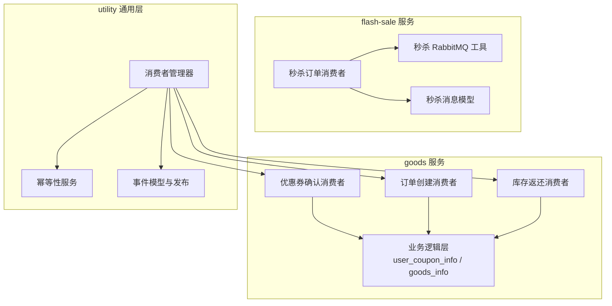
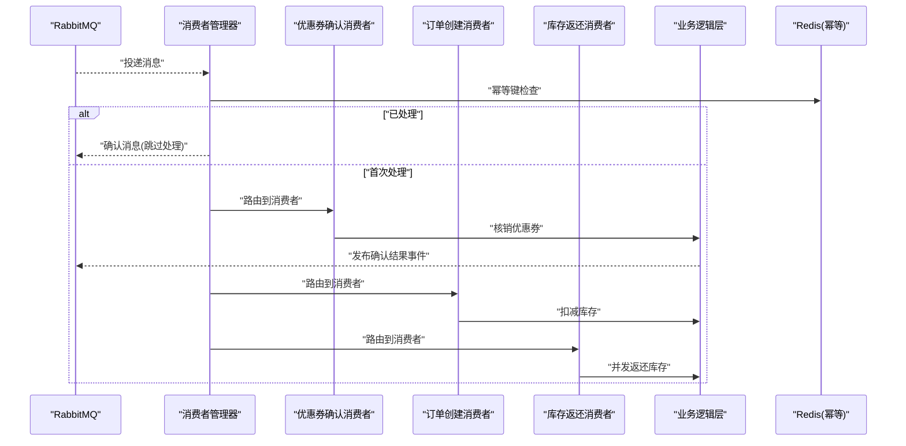
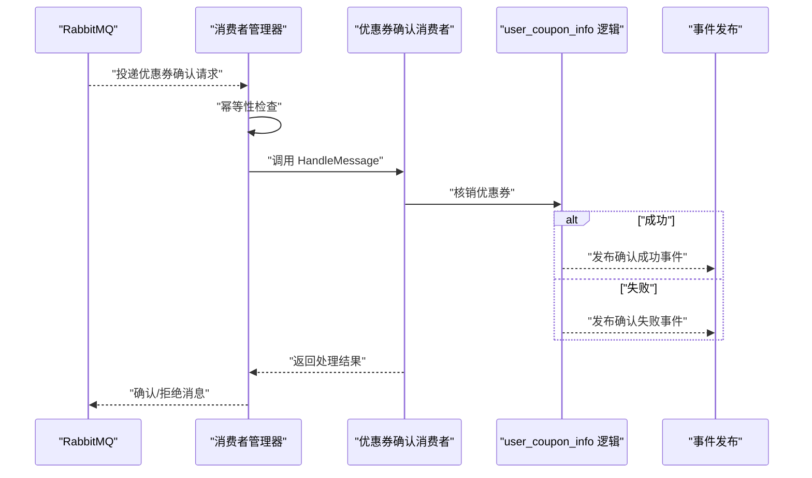
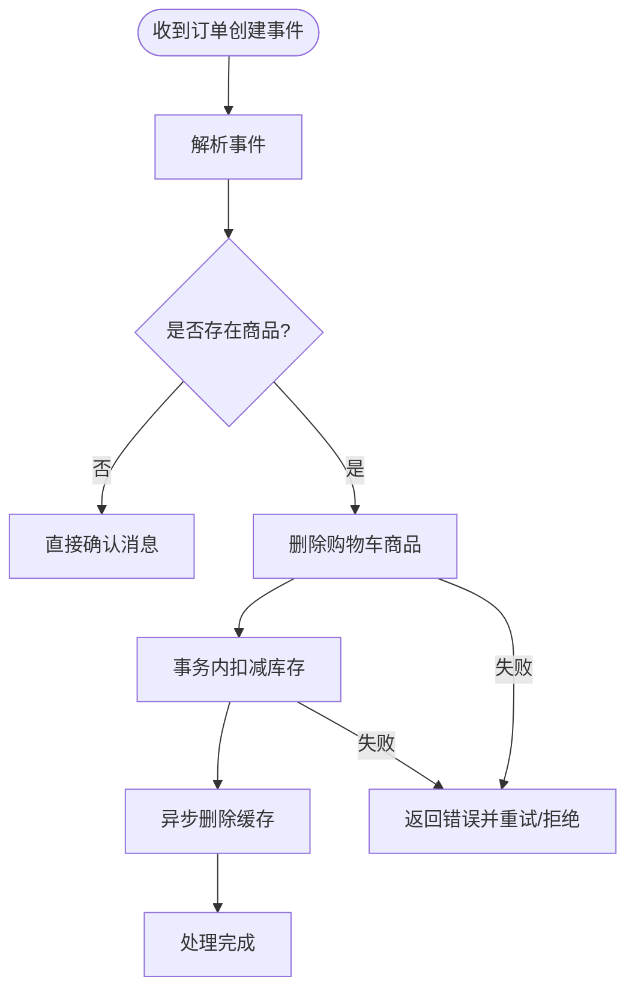
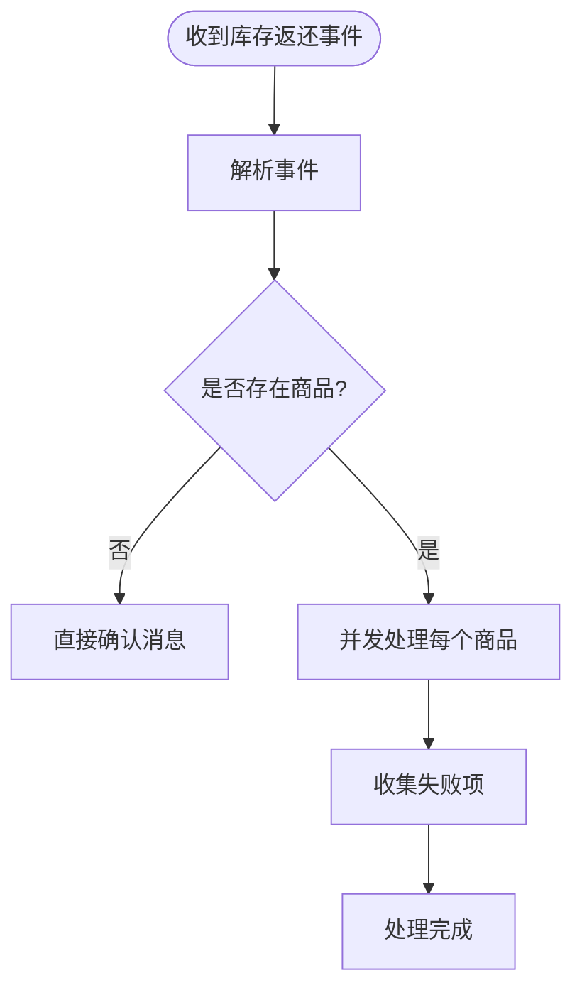
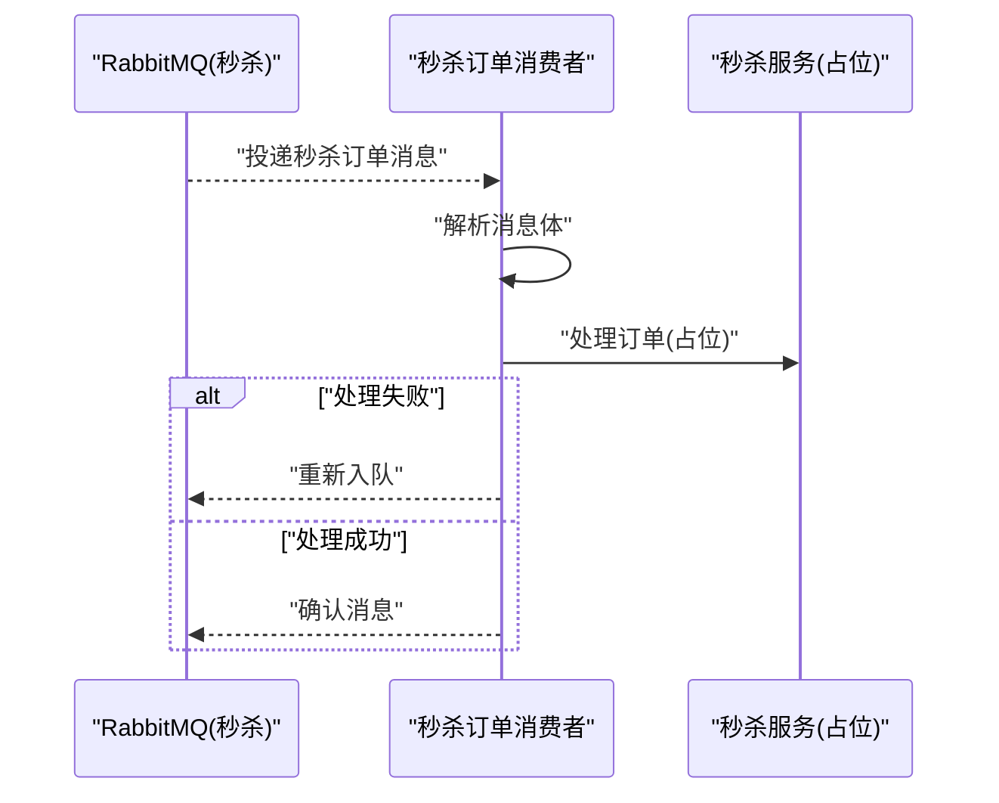
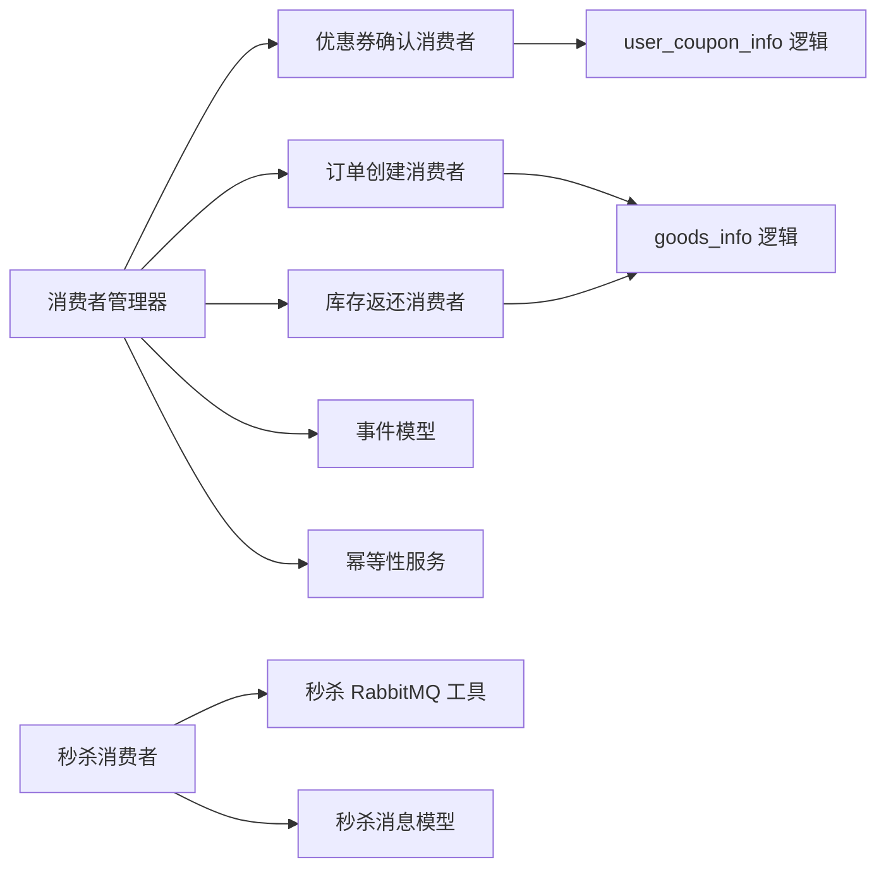

# 秒杀系统消费者

<cite>
**本文引用的文件**
- [app/goods/utility/consumer/coupon_confirm_consumer.go](file://app/goods/utility/consumer/coupon_confirm_consumer.go)
- [app/goods/utility/consumer/order_created_consumer.go](file://app/goods/utility/consumer/order_created_consumer.go)
- [app/goods/utility/consumer/DEMO_WECHAT_OPEN_ID.go](file://app/goods/utility/consumer/DEMO_WECHAT_OPEN_ID.go)
- [app/goods/utility/consumer/user_registered_consumer.go](file://app/goods/utility/consumer/user_registered_consumer.go)
- [app/goods/internal/logic/user_coupon_info/user_coupon_info.go](file://app/goods/internal/logic/user_coupon_info/user_coupon_info.go)
- [app/goods/internal/logic/goods_info/goods_info.go](file://app/goods/internal/logic/goods_info/goods_info.go)
- [app/goods/manifest/config/config.prod.yaml](file://app/goods/manifest/config/config.prod.yaml)
- [utility/rabbitmq/consumer_manager.go](file://utility/rabbitmq/consumer_manager.go)
- [utility/rabbitmq/event.go](file://utility/rabbitmq/event.go)
- [utility/idempotent/idempotent.go](file://utility/idempotent/idempotent.go)
- [app/flash-sale/internal/mq/flash_sale_consumer.go](file://app/flash-sale/internal/mq/flash_sale_consumer.go)
- [app/flash-sale/utility/rabbitmq.go](file://app/flash-sale/utility/rabbitmq.go)
- [app/flash-sale/internal/model/flash_sale_message.go](file://app/flash-sale/internal/model/flash_sale_message.go)
- [app/goods/utility/stock/flash_sale_stock.go](file://app/goods/utility/stock/flash_sale_stock.go)
</cite>

## 目录
1. [引言](#引言)
2. [项目结构](#项目结构)
3. [核心组件](#核心组件)
4. [架构总览](#架构总览)
5. [详细组件分析](#详细组件分析)
6. [依赖关系分析](#依赖关系分析)
7. [性能考量](#性能考量)
8. [故障排查指南](#故障排查指南)
9. [结论](#结论)
10. [附录](#附录)

## 引言
本文件聚焦秒杀系统中“消息消费者”的设计与实现，围绕优惠券确认消费者、订单创建消费者、库存返还消费者以及秒杀订单消费者展开，系统性阐述各消费者的职责、消息处理流程、异常处理机制、幂等性与去重策略、状态管理、性能优化与并发控制，并给出最佳实践与故障处理策略。

## 项目结构
本项目采用微服务分层组织，消息消费者主要分布在以下模块：
- goods 服务：负责订单创建、库存扣减/返还、优惠券确认等事件处理
- flash-sale 服务：负责秒杀订单消息的消费与处理
- utility 层：提供通用 RabbitMQ 消费管理器、幂等性服务、事件模型与工具

图表来源
- [app/goods/utility/consumer/coupon_confirm_consumer.go](file://app/goods/utility/consumer/coupon_confirm_consumer.go#L1-L55)
- [app/goods/utility/consumer/order_created_consumer.go](file://app/goods/utility/consumer/order_created_consumer.go#L1-L65)
- [app/goods/utility/consumer/DEMO_WECHAT_OPEN_ID.go](file://app/goods/utility/consumer/DEMO_WECHAT_OPEN_ID.go#L1-L58)
- [app/flash-sale/internal/mq/flash_sale_consumer.go](file://app/flash-sale/internal/mq/flash_sale_consumer.go#L1-L134)
- [utility/rabbitmq/consumer_manager.go](file://utility/rabbitmq/consumer_manager.go#L1-L446)
- [utility/idempotent/idempotent.go](file://utility/idempotent/idempotent.go#L1-L153)
- [utility/rabbitmq/event.go](file://utility/rabbitmq/event.go#L1-L269)

章节来源
- [app/goods/utility/consumer/coupon_confirm_consumer.go](file://app/goods/utility/consumer/coupon_confirm_consumer.go#L1-L55)
- [app/goods/utility/consumer/order_created_consumer.go](file://app/goods/utility/consumer/order_created_consumer.go#L1-L65)
- [app/goods/utility/consumer/DEMO_WECHAT_OPEN_ID.go](file://app/goods/utility/consumer/DEMO_WECHAT_OPEN_ID.go#L1-L58)
- [app/flash-sale/internal/mq/flash_sale_consumer.go](file://app/flash-sale/internal/mq/flash_sale_consumer.go#L1-L134)
- [utility/rabbitmq/consumer_manager.go](file://utility/rabbitmq/consumer_manager.go#L1-L446)
- [utility/idempotent/idempotent.go](file://utility/idempotent/idempotent.go#L1-L153)
- [utility/rabbitmq/event.go](file://utility/rabbitmq/event.go#L1-L269)

## 核心组件
- 优惠券确认消费者：订阅“优惠券确认请求”主题，解析事件后调用业务逻辑核销优惠券，并发布确认结果事件。
- 订单创建消费者：订阅“订单创建”事件，清理购物车并扣减库存，失败时拒绝消息并支持重试。
- 库存返还消费者：订阅“库存返还”事件，按商品并发返还库存，失败项收集并可重试。
- 秒杀订单消费者：独立的秒杀消费者，直接从专用队列消费，处理失败时重新入队。
- 通用消费者管理器：统一管理交换机/队列声明、QoS、幂等性检查、重试与确认/拒绝逻辑。
- 幂等性服务：基于 Redis 的消息幂等键生成与加锁，避免重复处理。
- 事件模型与发布：统一的事件结构与发布工具，确保跨服务解耦。

章节来源
- [app/goods/utility/consumer/coupon_confirm_consumer.go](file://app/goods/utility/consumer/coupon_confirm_consumer.go#L11-L32)
- [app/goods/utility/consumer/order_created_consumer.go](file://app/goods/utility/consumer/order_created_consumer.go#L13-L30)
- [app/goods/utility/consumer/DEMO_WECHAT_OPEN_ID.go](file://app/goods/utility/consumer/DEMO_WECHAT_OPEN_ID.go#L12-L29)
- [app/flash-sale/internal/mq/flash_sale_consumer.go](file://app/flash-sale/internal/mq/flash_sale_consumer.go#L16-L26)
- [utility/rabbitmq/consumer_manager.go](file://utility/rabbitmq/consumer_manager.go#L48-L95)
- [utility/idempotent/idempotent.go](file://utility/idempotent/idempotent.go#L11-L21)

## 架构总览
下图展示秒杀场景下消费者与事件的交互关系，包括幂等性与重试控制：

图表来源
- [utility/rabbitmq/consumer_manager.go](file://utility/rabbitmq/consumer_manager.go#L196-L263)
- [utility/idempotent/idempotent.go](file://utility/idempotent/idempotent.go#L41-L58)
- [app/goods/utility/consumer/coupon_confirm_consumer.go](file://app/goods/utility/consumer/coupon_confirm_consumer.go#L34-L54)
- [app/goods/utility/consumer/order_created_consumer.go](file://app/goods/utility/consumer/order_created_consumer.go#L32-L64)
- [app/goods/utility/consumer/DEMO_WECHAT_OPEN_ID.go](file://app/goods/utility/consumer/DEMO_WECHAT_OPEN_ID.go#L31-L57)

## 详细组件分析

### 优惠券确认消费者
- 职责：接收“优惠券确认请求”事件，核销用户可用优惠券，发布“确认结果”事件。
- 消息处理流程：
  - 解析事件结构，记录日志
  - 调用业务逻辑层核销优惠券（状态更新）
  - 发布确认结果事件（成功/失败）
- 异常处理：解析失败、核销失败均返回错误，交由通用管理器进行重试或拒绝。
- 幂等性：由通用管理器在消费者启动前完成交换机/队列声明与幂等键检查，避免重复核销。

图表来源
- [app/goods/utility/consumer/coupon_confirm_consumer.go](file://app/goods/utility/consumer/coupon_confirm_consumer.go#L34-L54)
- [app/goods/internal/logic/user_coupon_info/user_coupon_info.go](file://app/goods/internal/logic/user_coupon_info/user_coupon_info.go#L37-L75)
- [utility/rabbitmq/consumer_manager.go](file://utility/rabbitmq/consumer_manager.go#L196-L263)

章节来源
- [app/goods/utility/consumer/coupon_confirm_consumer.go](file://app/goods/utility/consumer/coupon_confirm_consumer.go#L11-L54)
- [app/goods/internal/logic/user_coupon_info/user_coupon_info.go](file://app/goods/internal/logic/user_coupon_info/user_coupon_info.go#L37-L75)
- [utility/rabbitmq/consumer_manager.go](file://utility/rabbitmq/consumer_manager.go#L265-L320)

### 订单创建消费者
- 职责：处理“订单创建”事件，清理购物车并扣减库存。
- 消息处理流程：
  - 解析事件，若无商品直接确认
  - 删除购物车对应商品
  - 扣减库存（事务内），异步删除缓存
  - 失败时返回错误，触发重试或拒绝
- 异常处理：删除购物车失败、扣减库存失败均返回错误，交由通用管理器控制重试策略。
- 幂等性：通过通用管理器的幂等键避免重复扣减。

图表来源
- [app/goods/utility/consumer/order_created_consumer.go](file://app/goods/utility/consumer/order_created_consumer.go#L32-L64)
- [app/goods/internal/logic/goods_info/goods_info.go](file://app/goods/internal/logic/goods_info/goods_info.go#L83-L138)
- [utility/rabbitmq/consumer_manager.go](file://utility/rabbitmq/consumer_manager.go#L196-L263)

章节来源
- [app/goods/utility/consumer/order_created_consumer.go](file://app/goods/utility/consumer/order_created_consumer.go#L13-L64)
- [app/goods/internal/logic/goods_info/goods_info.go](file://app/goods/internal/logic/goods_info/goods_info.go#L83-L138)

### 库存返还消费者
- 职责：处理“库存返还”事件，按商品并发返还库存。
- 消息处理流程：
  - 解析事件，若无商品直接确认
  - 并发处理每个商品的库存返还，捕获 panic，收集失败项
  - 返回未成功的商品列表，支持上层重试
- 异常处理：单个商品失败不影响整体流程，失败项单独返回。
- 幂等性：通过通用管理器幂等键避免重复返还。

图表来源
- [app/goods/utility/consumer/DEMO_WECHAT_OPEN_ID.go](file://app/goods/utility/consumer/DEMO_WECHAT_OPEN_ID.go#L31-L57)
- [app/goods/internal/logic/goods_info/goods_info.go](file://app/goods/internal/logic/goods_info/goods_info.go#L16-L81)
- [utility/rabbitmq/consumer_manager.go](file://utility/rabbitmq/consumer_manager.go#L196-L263)

章节来源
- [app/goods/utility/consumer/DEMO_WECHAT_OPEN_ID.go](file://app/goods/utility/consumer/DEMO_WECHAT_OPEN_ID.go#L12-L57)
- [app/goods/internal/logic/goods_info/goods_info.go](file://app/goods/internal/logic/goods_info/goods_info.go#L16-L81)

### 秒杀订单消费者
- 职责：消费秒杀专用队列，处理秒杀订单消息。
- 消息处理流程：
  - 从专用队列消费消息
  - 解析消息体，调用服务处理（当前示例为占位逻辑）
  - 失败时重新入队，成功时确认消息
- 异常处理：解析失败、服务调用失败均触发重新入队。
- 幂等性：通过通用管理器幂等键避免重复处理。

图表来源
- [app/flash-sale/internal/mq/flash_sale_consumer.go](file://app/flash-sale/internal/mq/flash_sale_consumer.go#L57-L95)
- [app/flash-sale/utility/rabbitmq.go](file://app/flash-sale/utility/rabbitmq.go#L57-L96)
- [app/flash-sale/internal/model/flash_sale_message.go](file://app/flash-sale/internal/model/flash_sale_message.go#L5-L16)

章节来源
- [app/flash-sale/internal/mq/flash_sale_consumer.go](file://app/flash-sale/internal/mq/flash_sale_consumer.go#L16-L95)
- [app/flash-sale/utility/rabbitmq.go](file://app/flash-sale/utility/rabbitmq.go#L57-L96)
- [app/flash-sale/internal/model/flash_sale_message.go](file://app/flash-sale/internal/model/flash_sale_message.go#L5-L16)

## 依赖关系分析
- 消费者依赖通用消费者管理器进行队列声明、QoS、幂等性与重试控制。
- 业务逻辑层提供核销优惠券、扣减/返还库存等核心能力。
- 事件模型统一了消息结构，便于跨服务扩展。
- 秒杀消费者独立于通用管理器，直接使用专用 RabbitMQ 工具与队列。

图表来源
- [utility/rabbitmq/consumer_manager.go](file://utility/rabbitmq/consumer_manager.go#L48-L95)
- [app/goods/utility/consumer/coupon_confirm_consumer.go](file://app/goods/utility/consumer/coupon_confirm_consumer.go#L11-L32)
- [app/goods/utility/consumer/order_created_consumer.go](file://app/goods/utility/consumer/order_created_consumer.go#L13-L30)
- [app/goods/utility/consumer/DEMO_WECHAT_OPEN_ID.go](file://app/goods/utility/consumer/DEMO_WECHAT_OPEN_ID.go#L12-L29)
- [app/goods/internal/logic/user_coupon_info/user_coupon_info.go](file://app/goods/internal/logic/user_coupon_info/user_coupon_info.go#L37-L75)
- [app/goods/internal/logic/goods_info/goods_info.go](file://app/goods/internal/logic/goods_info/goods_info.go#L83-L138)
- [utility/rabbitmq/event.go](file://utility/rabbitmq/event.go#L58-L144)
- [utility/idempotent/idempotent.go](file://utility/idempotent/idempotent.go#L11-L21)
- [app/flash-sale/internal/mq/flash_sale_consumer.go](file://app/flash-sale/internal/mq/flash_sale_consumer.go#L16-L26)
- [app/flash-sale/utility/rabbitmq.go](file://app/flash-sale/utility/rabbitmq.go#L57-L96)
- [app/flash-sale/internal/model/flash_sale_message.go](file://app/flash-sale/internal/model/flash_sale_message.go#L5-L16)

章节来源
- [utility/rabbitmq/consumer_manager.go](file://utility/rabbitmq/consumer_manager.go#L1-L446)
- [utility/rabbitmq/event.go](file://utility/rabbitmq/event.go#L1-L269)
- [utility/idempotent/idempotent.go](file://utility/idempotent/idempotent.go#L1-L153)
- [app/flash-sale/internal/mq/flash_sale_consumer.go](file://app/flash-sale/internal/mq/flash_sale_consumer.go#L1-L134)

## 性能考量
- 并发控制
  - 订单创建消费者对每个订单内的商品采用并发处理库存返还，提升吞吐。
  - 通用消费者管理器通过 QoS 控制预取消息数量，避免单消费者过载。
- 事务与缓存
  - 库存扣减在事务内完成，保证一致性；异步删除缓存降低主流程延迟。
- 幂等性与重试
  - 幂等键结合 Redis SetNX 实现分布式幂等，避免重复处理。
  - 重试策略区分临时性与永久性错误，控制最大重试次数，防止雪崩。
- 秒杀库存
  - 秒杀库存管理器使用 Redis Lua 原子扣减与用户购买记录缓存，减少竞争与回滚成本。

章节来源
- [app/goods/internal/logic/goods_info/goods_info.go](file://app/goods/internal/logic/goods_info/goods_info.go#L16-L81)
- [utility/rabbitmq/consumer_manager.go](file://utility/rabbitmq/consumer_manager.go#L142-L148)
- [utility/idempotent/idempotent.go](file://utility/idempotent/idempotent.go#L41-L58)
- [app/goods/utility/stock/flash_sale_stock.go](file://app/goods/utility/stock/flash_sale_stock.go#L52-L99)

## 故障排查指南
- 幂等性问题
  - 症状：消息重复处理或幂等键冲突
  - 排查：检查幂等键生成规则与 TTL 设置，确认 Redis 可用性
- 重试风暴
  - 症状：消息频繁重试导致系统压力增大
  - 排查：检查错误类型识别与最大重试次数配置，区分临时性与永久性错误
- 库存不一致
  - 症状：库存扣减/返还后不一致
  - 排查：确认事务内扣减与异步缓存删除的顺序与异常恢复逻辑
- 秒杀超卖
  - 症状：秒杀商品超卖
  - 排查：确认 Redis Lua 原子扣减与用户购买记录缓存是否生效

章节来源
- [utility/rabbitmq/consumer_manager.go](file://utility/rabbitmq/consumer_manager.go#L265-L406)
- [app/goods/internal/logic/goods_info/goods_info.go](file://app/goods/internal/logic/goods_info/goods_info.go#L83-L138)
- [app/goods/utility/stock/flash_sale_stock.go](file://app/goods/utility/stock/flash_sale_stock.go#L52-L99)

## 结论
本文档系统梳理了秒杀场景下的消息消费者设计与实现，明确了各消费者职责、处理流程与异常策略，并给出了幂等性、重试与性能优化方案。通过通用消费者管理器与幂等性服务，系统在高并发与复杂业务场景下具备良好的稳定性与可维护性。

## 附录
- 配置参考：交换机、队列与路由键配置位于 goods 服务配置文件中，确保消费者与事件发布端一致。
- 事件模型：统一的事件结构便于扩展新的消费者与事件类型。

章节来源
- [app/goods/manifest/config/config.prod.yaml](file://app/goods/manifest/config/config.prod.yaml#L33-L59)
- [utility/rabbitmq/event.go](file://utility/rabbitmq/event.go#L188-L268)