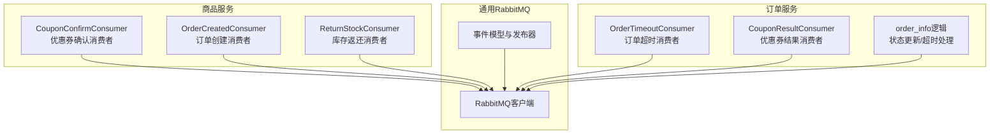
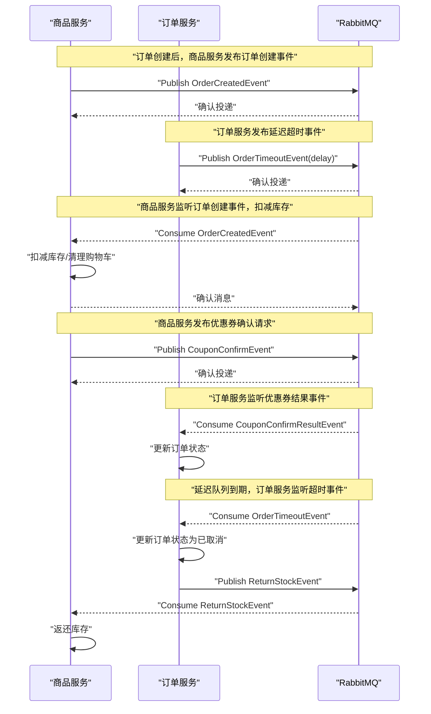
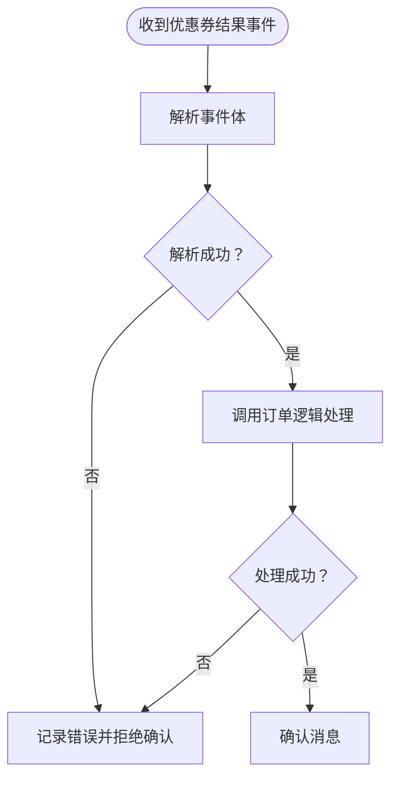
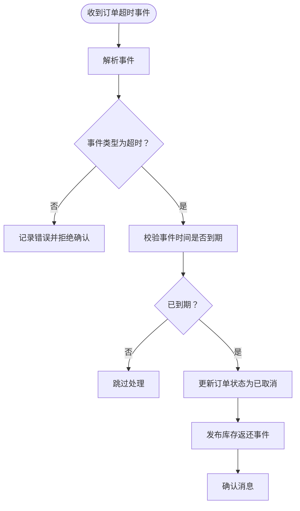
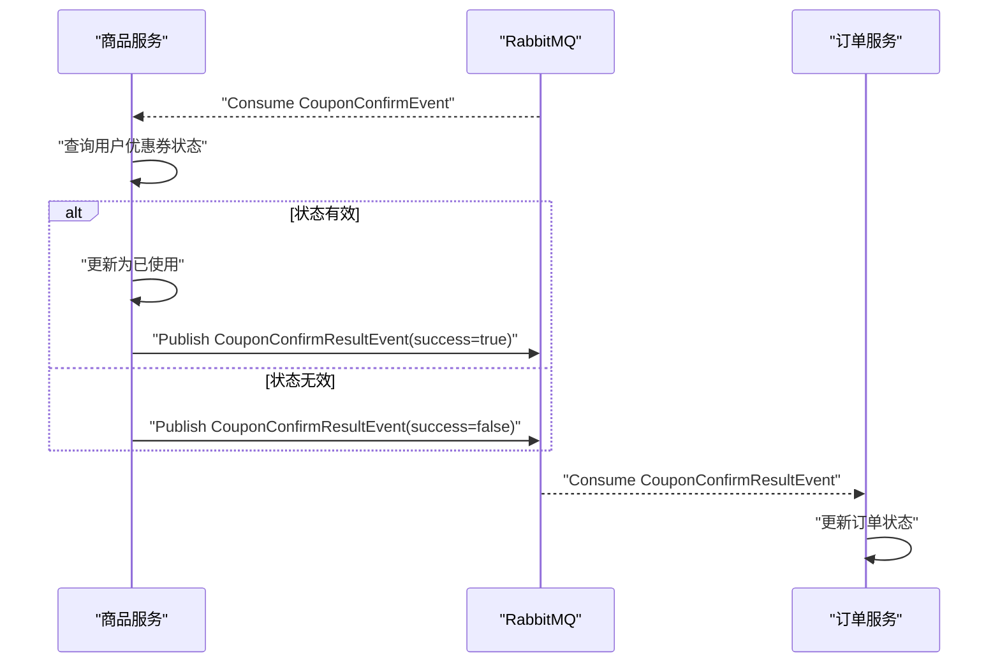
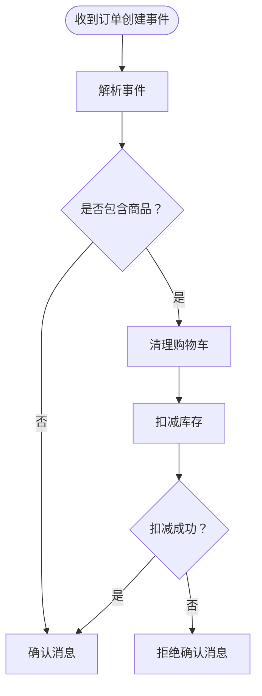
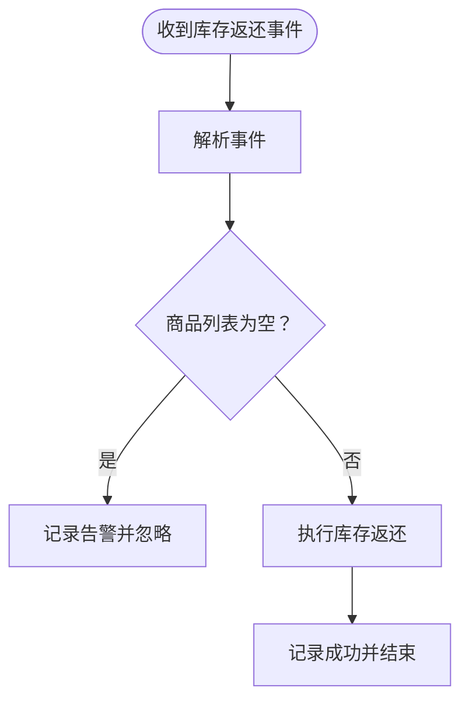
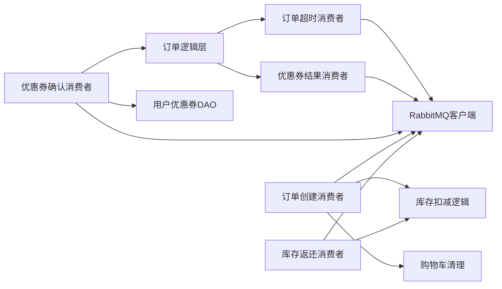

# 订单系统消费者

<cite>
**本文引用的文件**
- [app/order/utility/consumer/coupon_result_consumer.go](file://app/order/utility/consumer/coupon_result_consumer.go)
- [app/order/utility/consumer/order_timeout_consumer.go](file://app/order/utility/consumer/order_timeout_consumer.go)
- [app/order/internal/logic/order_info/order_info.go](file://app/order/internal/logic/order_info/order_info.go)
- [app/order/internal/consts/order_status.go](file://app/order/internal/consts/order_status.go)
- [app/order/manifest/config/config.prod.yaml](file://app/order/manifest/config/config.prod.yaml)
- [app/goods/utility/consumer/coupon_confirm_consumer.go](file://app/goods/utility/consumer/coupon_confirm_consumer.go)
- [app/goods/utility/consumer/order_created_consumer.go](file://app/goods/utility/consumer/order_created_consumer.go)
- [app/goods/utility/consumer/DEMO_WECHAT_OPEN_ID.go](file://app/goods/utility/consumer/DEMO_WECHAT_OPEN_ID.go)
- [app/goods/internal/logic/user_coupon_info/user_coupon_info.go](file://app/goods/internal/logic/user_coupon_info/user_coupon_info.go)
- [utility/rabbitmq/rabbitmq.go](file://utility/rabbitmq/rabbitmq.go)
- [utility/rabbitmq/event.go](file://utility/rabbitmq/event.go)
</cite>

## 目录
1. [引言](#引言)
2. [项目结构](#项目结构)
3. [核心组件](#核心组件)
4. [架构总览](#架构总览)
5. [详细组件分析](#详细组件分析)
6. [依赖关系分析](#依赖关系分析)
7. [性能考量](#性能考量)
8. [故障排查指南](#故障排查指南)
9. [结论](#结论)
10. [附录](#附录)

## 引言
本文聚焦订单系统中的消息消费者实现，围绕“优惠券结果消费者”和“订单超时消费者”的业务逻辑与处理流程展开，结合订单状态同步、超时处理机制、异常恢复策略、消费者与订单服务的集成方式、消息路由与处理优先级、可靠性保障与性能优化、以及监控与故障排查方法进行全面阐述。

## 项目结构
订单系统消费者位于订单服务模块内，配合商品服务与通用RabbitMQ工具完成跨服务事件编排。关键目录与文件如下：
- 订单服务消费者：优惠券结果消费者、订单超时消费者
- 商品服务消费者：优惠券确认消费者、订单创建消费者、库存返还消费者
- 通用RabbitMQ：连接、声明交换机/队列、发布与消费、事件模型
- 订单服务逻辑：订单状态更新、超时处理、订单详情查询
- 配置：RabbitMQ交换机/队列/路由键、业务超时时间

图表来源
- [app/order/utility/consumer/order_timeout_consumer.go](file://app/order/utility/consumer/order_timeout_consumer.go#L1-L87)
- [app/order/utility/consumer/coupon_result_consumer.go](file://app/order/utility/consumer/coupon_result_consumer.go#L1-L54)
- [app/goods/utility/consumer/order_created_consumer.go](file://app/goods/utility/consumer/order_created_consumer.go#L1-L65)
- [app/goods/utility/consumer/coupon_confirm_consumer.go](file://app/goods/utility/consumer/coupon_confirm_consumer.go#L1-L55)
- [app/goods/utility/consumer/DEMO_WECHAT_OPEN_ID.go](file://app/goods/utility/consumer/DEMO_WECHAT_OPEN_ID.go#L1-L58)
- [utility/rabbitmq/rabbitmq.go](file://utility/rabbitmq/rabbitmq.go#L1-L196)
- [utility/rabbitmq/event.go](file://utility/rabbitmq/event.go#L1-L269)

章节来源
- [app/order/utility/consumer/order_timeout_consumer.go](file://app/order/utility/consumer/order_timeout_consumer.go#L1-L87)
- [app/order/utility/consumer/coupon_result_consumer.go](file://app/order/utility/consumer/coupon_result_consumer.go#L1-L54)
- [app/goods/utility/consumer/order_created_consumer.go](file://app/goods/utility/consumer/order_created_consumer.go#L1-L65)
- [app/goods/utility/consumer/coupon_confirm_consumer.go](file://app/goods/utility/consumer/coupon_confirm_consumer.go#L1-L55)
- [app/goods/utility/consumer/DEMO_WECHAT_OPEN_ID.go](file://app/goods/utility/consumer/DEMO_WECHAT_OPEN_ID.go#L1-L58)
- [utility/rabbitmq/rabbitmq.go](file://utility/rabbitmq/rabbitmq.go#L1-L196)
- [utility/rabbitmq/event.go](file://utility/rabbitmq/event.go#L1-L269)

## 核心组件
- 优惠券结果消费者（订单服务）
  - 监听优惠券确认结果事件，根据成功/失败更新订单状态；失败时直接置为已取消。
- 订单超时消费者（订单服务）
  - 监听延迟交换机投递的订单超时事件，校验事件类型与时间窗口，若到期则将待支付订单置为已取消，并触发库存返还流程。
- 优惠券确认消费者（商品服务）
  - 接收订单创建时发布的优惠券确认请求，校验用户优惠券状态并更新为已使用，随后向订单服务发布结果事件。
- 订单创建消费者（商品服务）
  - 接收订单创建事件，清理购物车并尝试扣减库存；失败时拒绝确认消息以便重试。
- 库存返还消费者（商品服务）
  - 接收订单取消/超时导致的库存返还事件，执行库存返还；失败时可考虑重试策略（代码中留有注释）。

章节来源
- [app/order/utility/consumer/coupon_result_consumer.go](file://app/order/utility/consumer/coupon_result_consumer.go#L1-L54)
- [app/order/utility/consumer/order_timeout_consumer.go](file://app/order/utility/consumer/order_timeout_consumer.go#L1-L87)
- [app/goods/utility/consumer/coupon_confirm_consumer.go](file://app/goods/utility/consumer/coupon_confirm_consumer.go#L1-L55)
- [app/goods/utility/consumer/order_created_consumer.go](file://app/goods/utility/consumer/order_created_consumer.go#L1-L65)
- [app/goods/utility/consumer/DEMO_WECHAT_OPEN_ID.go](file://app/goods/utility/consumer/DEMO_WECHAT_OPEN_ID.go#L1-L58)

## 架构总览
订单系统通过RabbitMQ实现跨服务解耦：订单服务负责状态编排与超时控制，商品服务负责库存与优惠券生命周期管理。事件驱动的处理流程确保各模块职责清晰、可扩展性强。

图表来源
- [utility/rabbitmq/event.go](file://utility/rabbitmq/event.go#L146-L186)
- [utility/rabbitmq/event.go](file://utility/rabbitmq/event.go#L188-L224)
- [utility/rabbitmq/event.go](file://utility/rabbitmq/event.go#L58-L107)
- [utility/rabbitmq/event.go](file://utility/rabbitmq/event.go#L109-L144)
- [utility/rabbitmq/event.go](file://utility/rabbitmq/event.go#L226-L268)
- [app/order/utility/consumer/order_timeout_consumer.go](file://app/order/utility/consumer/order_timeout_consumer.go#L39-L86)
- [app/order/utility/consumer/coupon_result_consumer.go](file://app/order/utility/consumer/coupon_result_consumer.go#L34-L54)
- [app/goods/utility/consumer/order_created_consumer.go](file://app/goods/utility/consumer/order_created_consumer.go#L32-L64)
- [app/goods/utility/consumer/coupon_confirm_consumer.go](file://app/goods/utility/consumer/coupon_confirm_consumer.go#L34-L54)
- [app/goods/utility/consumer/DEMO_WECHAT_OPEN_ID.go](file://app/goods/utility/consumer/DEMO_WECHAT_OPEN_ID.go#L31-L57)

## 详细组件分析

### 优惠券结果消费者（订单服务）
- 监听主题交换机“coupon.confirm.result”，路由键为“coupon.confirm.result”
- 解析事件后调用订单逻辑层的处理函数，按成功/失败分别将订单置为“待支付”或“已取消”
- 幂等性：基于事件体中的订单ID进行状态更新，避免重复处理造成状态错乱
- 错误处理：解析失败或处理失败均记录日志并拒绝确认消息，交由RabbitMQ重试

图表来源
- [app/order/utility/consumer/coupon_result_consumer.go](file://app/order/utility/consumer/coupon_result_consumer.go#L34-L54)
- [app/order/internal/logic/order_info/order_info.go](file://app/order/internal/logic/order_info/order_info.go#L389-L414)

章节来源
- [app/order/utility/consumer/coupon_result_consumer.go](file://app/order/utility/consumer/coupon_result_consumer.go#L1-L54)
- [app/order/internal/logic/order_info/order_info.go](file://app/order/internal/logic/order_info/order_info.go#L389-L414)

### 订单超时消费者（订单服务）
- 监听延迟交换机“order.delay.exchange”，路由键为“order.timeout”
- 解析事件后校验事件类型与时间戳，仅在到达超时窗口时处理
- 将处于“待支付”的订单更新为“已取消”，并触发库存返还事件
- 幂等性：更新条件包含状态判断，避免重复取消

图表来源
- [app/order/utility/consumer/order_timeout_consumer.go](file://app/order/utility/consumer/order_timeout_consumer.go#L39-L86)
- [app/order/internal/logic/order_info/order_info.go](file://app/order/internal/logic/order_info/order_info.go#L451-L471)
- [utility/rabbitmq/event.go](file://utility/rabbitmq/event.go#L146-L186)

章节来源
- [app/order/utility/consumer/order_timeout_consumer.go](file://app/order/utility/consumer/order_timeout_consumer.go#L1-L87)
- [app/order/internal/logic/order_info/order_info.go](file://app/order/internal/logic/order_info/order_info.go#L451-L471)

### 优惠券确认消费者（商品服务）
- 监听主题交换机“coupon.confirm.exchange”，路由键为“coupon.confirm.request”
- 根据用户ID与优惠券ID查询用户优惠券状态，若为“待使用”则更新为“已使用”，并向订单服务发布结果事件
- 失败路径：未找到或状态非“待使用”时，发布失败结果事件

图表来源
- [app/goods/utility/consumer/coupon_confirm_consumer.go](file://app/goods/utility/consumer/coupon_confirm_consumer.go#L34-L54)
- [app/goods/internal/logic/user_coupon_info/user_coupon_info.go](file://app/goods/internal/logic/user_coupon_info/user_coupon_info.go#L37-L75)
- [utility/rabbitmq/event.go](file://utility/rabbitmq/event.go#L58-L107)
- [utility/rabbitmq/event.go](file://utility/rabbitmq/event.go#L109-L144)
- [app/order/utility/consumer/coupon_result_consumer.go](file://app/order/utility/consumer/coupon_result_consumer.go#L34-L54)

章节来源
- [app/goods/utility/consumer/coupon_confirm_consumer.go](file://app/goods/utility/consumer/coupon_confirm_consumer.go#L1-L55)
- [app/goods/internal/logic/user_coupon_info/user_coupon_info.go](file://app/goods/internal/logic/user_coupon_info/user_coupon_info.go#L37-L75)

### 订单创建消费者（商品服务）
- 监听主题交换机“order.events.exchange”，路由键为“order.created”
- 清理购物车并尝试扣减库存；失败时拒绝确认消息以便重试
- 成功路径：记录日志并确认消息

图表来源
- [app/goods/utility/consumer/order_created_consumer.go](file://app/goods/utility/consumer/order_created_consumer.go#L32-L64)

章节来源
- [app/goods/utility/consumer/order_created_consumer.go](file://app/goods/utility/consumer/order_created_consumer.go#L1-L65)

### 库存返还消费者（商品服务）
- 监听主题交换机“goods.stock.exchange”，路由键为“goods.stock”
- 对事件中的商品执行库存返还；失败时可考虑重试策略（代码中留有注释）

图表来源
- [app/goods/utility/consumer/DEMO_WECHAT_OPEN_ID.go](file://app/goods/utility/consumer/DEMO_WECHAT_OPEN_ID.go#L31-L57)

章节来源
- [app/goods/utility/consumer/DEMO_WECHAT_OPEN_ID.go](file://app/goods/utility/consumer/DEMO_WECHAT_OPEN_ID.go#L1-L58)

## 依赖关系分析
- 订单服务依赖
  - 订单逻辑层：状态更新、超时处理、订单详情查询
  - RabbitMQ工具：事件发布/订阅、延迟消息、交换机/队列声明
  - 配置：RabbitMQ交换机/队列/路由键、业务超时时间
- 商品服务依赖
  - 用户优惠券DAO与实体：查询与更新用户优惠券状态
  - 订单创建消费者：清理购物车、扣减库存
  - 库存返还消费者：接收取消/超时后的库存返还事件
- 通用RabbitMQ
  - 连接管理与指数退避重试
  - 事件模型与发布器（含延迟交换机支持）

图表来源
- [app/order/internal/logic/order_info/order_info.go](file://app/order/internal/logic/order_info/order_info.go#L338-L387)
- [app/order/utility/consumer/order_timeout_consumer.go](file://app/order/utility/consumer/order_timeout_consumer.go#L39-L86)
- [app/order/utility/consumer/coupon_result_consumer.go](file://app/order/utility/consumer/coupon_result_consumer.go#L34-L54)
- [app/goods/utility/consumer/coupon_confirm_consumer.go](file://app/goods/utility/consumer/coupon_confirm_consumer.go#L34-L54)
- [app/goods/utility/consumer/order_created_consumer.go](file://app/goods/utility/consumer/order_created_consumer.go#L32-L64)
- [app/goods/utility/consumer/DEMO_WECHAT_OPEN_ID.go](file://app/goods/utility/consumer/DEMO_WECHAT_OPEN_ID.go#L31-L57)
- [utility/rabbitmq/rabbitmq.go](file://utility/rabbitmq/rabbitmq.go#L1-L196)

章节来源
- [app/order/internal/logic/order_info/order_info.go](file://app/order/internal/logic/order_info/order_info.go#L1-L502)
- [app/order/utility/consumer/order_timeout_consumer.go](file://app/order/utility/consumer/order_timeout_consumer.go#L1-L87)
- [app/order/utility/consumer/coupon_result_consumer.go](file://app/order/utility/consumer/coupon_result_consumer.go#L1-L54)
- [app/goods/utility/consumer/coupon_confirm_consumer.go](file://app/goods/utility/consumer/coupon_confirm_consumer.go#L1-L55)
- [app/goods/utility/consumer/order_created_consumer.go](file://app/goods/utility/consumer/order_created_consumer.go#L1-L65)
- [app/goods/utility/consumer/DEMO_WECHAT_OPEN_ID.go](file://app/goods/utility/consumer/DEMO_WECHAT_OPEN_ID.go#L1-L58)
- [utility/rabbitmq/rabbitmq.go](file://utility/rabbitmq/rabbitmq.go#L1-L196)

## 性能考量
- 并发与限流
  - 消费者采用PrefetchCount=1保证单条消息串行处理，避免并发竞争；可根据业务吞吐调整
- 延迟队列与超时控制
  - 使用延迟交换机实现订单超时，避免轮询扫描；超时时间通过配置统一管理
- 指数退避与持久化
  - RabbitMQ客户端连接采用指数退避重试，降低瞬时故障影响；消息持久化与队列/交换机持久化提升可靠性
- 事务与幂等
  - 订单状态更新与库存操作均具备幂等判断，避免重复处理导致的数据不一致

章节来源
- [app/order/utility/consumer/order_timeout_consumer.go](file://app/order/utility/consumer/order_timeout_consumer.go#L22-L36)
- [app/order/utility/consumer/coupon_result_consumer.go](file://app/order/utility/consumer/coupon_result_consumer.go#L16-L31)
- [utility/rabbitmq/rabbitmq.go](file://utility/rabbitmq/rabbitmq.go#L19-L54)
- [app/order/manifest/config/config.prod.yaml](file://app/order/manifest/config/config.prod.yaml#L46-L47)

## 故障排查指南
- 消息未被消费
  - 检查消费者配置（交换机/队列/路由键）与RabbitMQ声明是否一致
  - 查看消费者日志，确认是否出现解析失败或处理异常
- 超时事件未触发
  - 核对延迟交换机声明与路由键；检查订单创建时是否正确发布延迟事件
  - 校验业务超时时间配置是否合理
- 优惠券状态不一致
  - 核对商品服务的优惠券状态更新逻辑与订单服务的结果处理逻辑
  - 检查用户优惠券状态是否为“待使用”且存在对应记录
- 库存扣减/返还失败
  - 查看商品服务消费者日志，确认扣减/返还接口调用是否成功
  - 对于失败场景，可考虑引入重试策略（参考代码注释）

章节来源
- [app/order/utility/consumer/order_timeout_consumer.go](file://app/order/utility/consumer/order_timeout_consumer.go#L39-L86)
- [app/order/utility/consumer/coupon_result_consumer.go](file://app/order/utility/consumer/coupon_result_consumer.go#L34-L54)
- [app/goods/utility/consumer/order_created_consumer.go](file://app/goods/utility/consumer/order_created_consumer.go#L32-L64)
- [app/goods/utility/consumer/DEMO_WECHAT_OPEN_ID.go](file://app/goods/utility/consumer/DEMO_WECHAT_OPEN_ID.go#L31-L57)
- [app/goods/internal/logic/user_coupon_info/user_coupon_info.go](file://app/goods/internal/logic/user_coupon_info/user_coupon_info.go#L37-L75)

## 结论
订单系统通过RabbitMQ实现跨服务事件编排，消费者承担了关键的业务编排职责。优惠券结果消费者与订单超时消费者分别覆盖“确认结果回传”和“超时自动取消”两大核心路径，配合商品服务的库存与优惠券生命周期管理，形成闭环。通过持久化、延迟队列、指数退避与幂等设计，系统在可靠性与性能之间取得平衡。

## 附录
- 订单状态枚举（用于状态更新与校验）
  - 待支付、已支付待发货、已发货、已收货待评价、已评价、待确认（使用优惠券）、已取消、发起退款
- 关键配置项
  - RabbitMQ交换机/队列/路由键、业务超时时间（毫秒）

章节来源
- [app/order/internal/consts/order_status.go](file://app/order/internal/consts/order_status.go#L3-L16)
- [app/order/manifest/config/config.prod.yaml](file://app/order/manifest/config/config.prod.yaml#L23-L47)