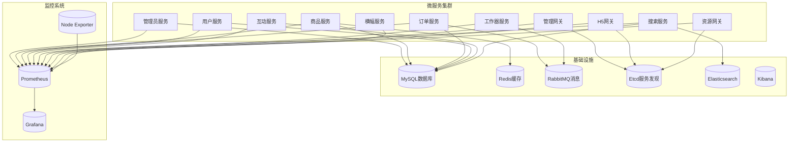
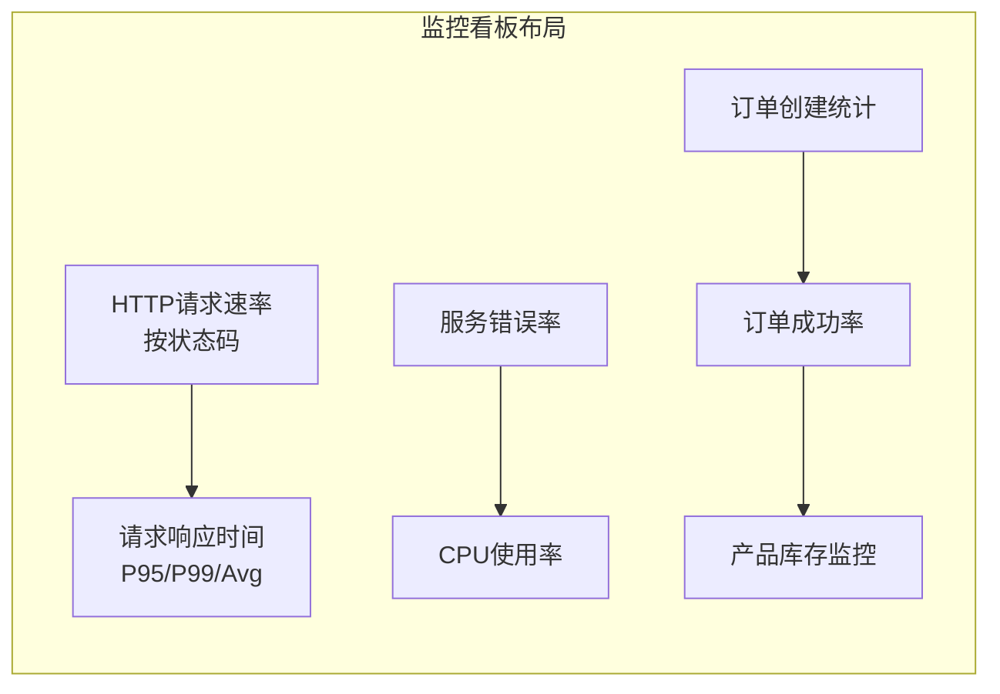
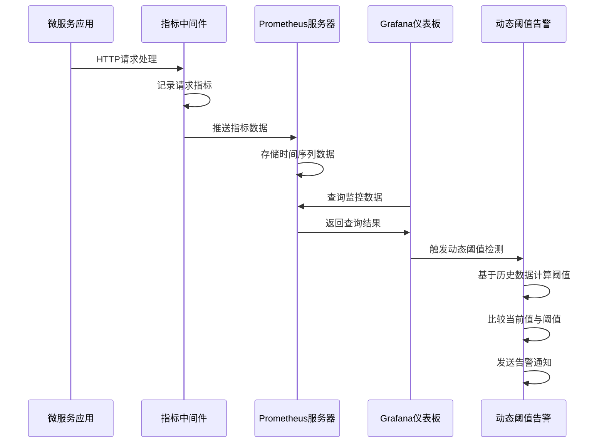
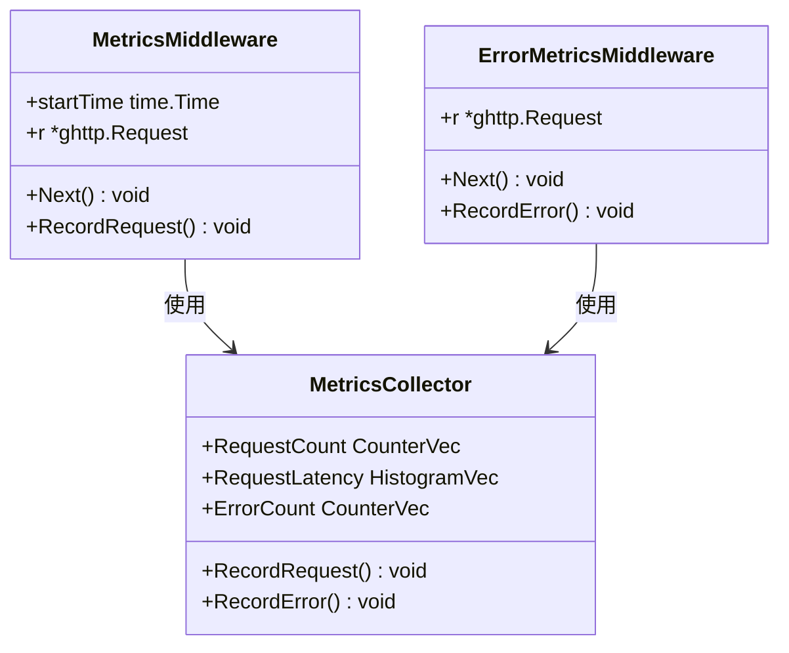
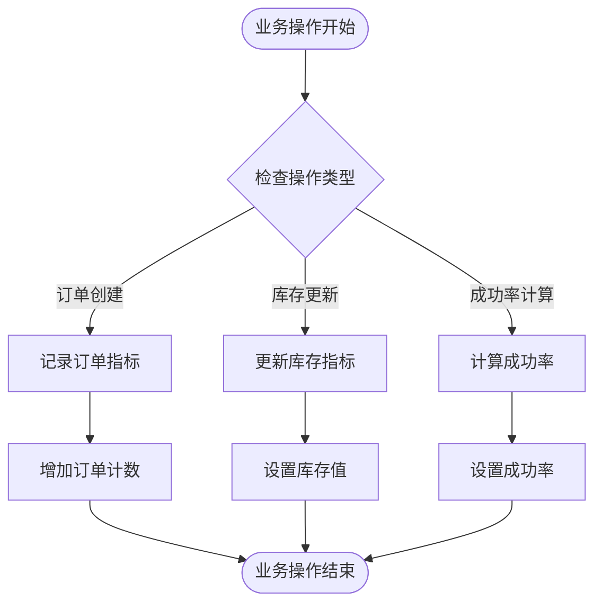
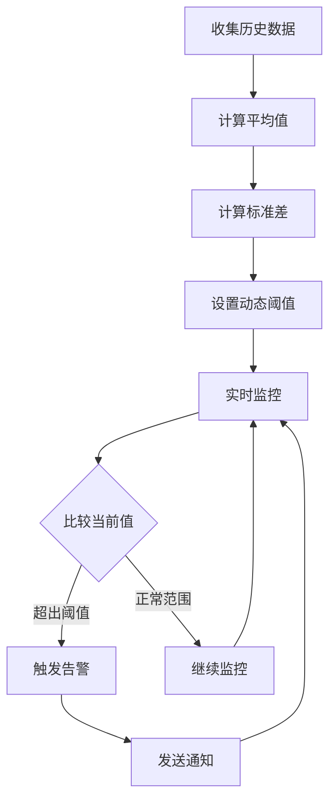
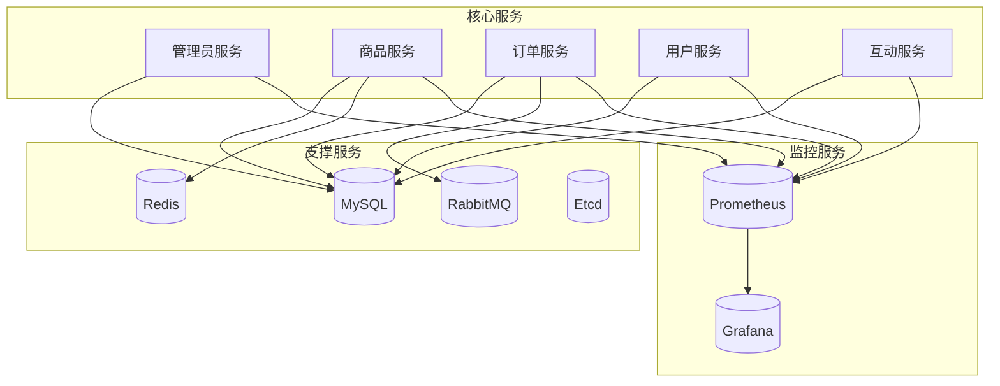

# Grafana仪表板配置

<cite>
**本文档引用的文件**
- [go-service-monitoring.json](file://doc/grafana/dashboards/go-service-monitoring.json)
- [dynamic-alerts.yml](file://doc/grafana/alert-rules/dynamic-alerts.yml)
- [使用说明.md](file://doc/grafana/使用说明.md)
- [测试验证方法.md](file://doc/grafana/测试验证方法.md)
- [metrics.go](file://utility/metrics/metrics.go)
- [middleware.go](file://utility/metrics/middleware.go)
- [business.go](file://utility/metrics/business.go)
- [docker-compose.yml](file://docker-compose.yml)
- [config.prod.yaml](file://app/admin/manifest/config/config.prod.yaml)
</cite>

## 目录
1. [简介](#简介)
2. [项目结构](#项目结构)
3. [核心组件](#核心组件)
4. [架构概览](#架构概览)
5. [详细组件分析](#详细组件分析)
6. [依赖关系分析](#依赖关系分析)
7. [性能考虑](#性能考虑)
8. [故障排查指南](#故障排查指南)
9. [结论](#结论)
10. [附录](#附录)

## 简介

本文档提供了Grafana仪表板配置的综合指南，专注于Go微服务监控系统的可视化和告警配置。该配置基于GoFrame框架开发的微服务项目，包含了完整的监控看板模板、动态阈值告警规则以及详细的实施指导。

项目采用现代化的微服务架构，包含多个独立的服务模块，每个服务都集成了Prometheus指标收集功能，为Grafana监控提供了丰富的数据源。

## 项目结构

该项目采用模块化的微服务架构，主要包含以下核心服务：



**图表来源**
- [docker-compose.yml](file://docker-compose.yml#L1-L355)

**章节来源**
- [docker-compose.yml](file://docker-compose.yml#L1-L355)

## 核心组件

### 监控指标体系

项目实现了完整的Prometheus指标收集体系，包含系统性能指标和业务指标两大类：

#### 系统性能指标
- **HTTP请求计数** (`http_requests_total`): 记录所有HTTP请求的数量，包含方法、路径、状态码标签
- **HTTP请求延迟** (`http_request_duration_seconds`): 记录请求处理时间分布，使用直方图类型
- **服务错误计数** (`service_errors_total`): 记录服务产生的各类错误，包含错误类型和服务标签

#### 业务指标
- **订单创建计数** (`business_order_create_total`): 记录订单创建情况，包含状态标签
- **订单成功率** (`business_order_success_ratio`): 记录订单处理的成功比例，使用Gauge类型
- **产品库存** (`business_inventory_count`): 记录各产品的当前库存，包含产品ID标签

**章节来源**
- [metrics.go](file://utility/metrics/metrics.go#L14-L43)
- [business.go](file://utility/metrics/business.go#L10-L37)

### 监控看板设计

Go服务监控看板包含7个核心面板，覆盖了服务健康状态、性能指标趋势和业务指标监控三个维度：



**图表来源**
- [go-service-monitoring.json](file://doc/grafana/dashboards/go-service-monitoring.json#L20-L697)

**章节来源**
- [go-service-monitoring.json](file://doc/grafana/dashboards/go-service-monitoring.json#L1-L715)

### 动态阈值告警系统

动态阈值告警是Grafana 8.0+版本的重要功能，能够基于历史数据自动计算告警阈值，适应业务波动：

#### 服务性能指标告警
- **动态错误率异常**: 基于历史同期平均值1.5倍的阈值检测
- **动态响应时间异常**: P95响应时间超过历史平均值1.8倍
- **动态CPU使用率异常**: CPU使用率超过历史平均值1.3倍
- **动态流量波动异常**: 请求量低于历史平均值50%

#### 业务指标告警
- **动态库存变化异常**: 库存变化幅度超过历史平均值2倍
- **动态订单量波动异常**: 订单量低于历史平均值60%
- **订单成功率异常降低**: 成功率低于历史平均值80%

**章节来源**
- [dynamic-alerts.yml](file://doc/grafana/alert-rules/dynamic-alerts.yml#L5-L112)

## 架构概览

### 监控架构设计



**图表来源**
- [metrics.go](file://utility/metrics/metrics.go#L46-L55)
- [middleware.go](file://utility/metrics/middleware.go#L9-L34)

### 数据流分析

监控系统采用推送式数据收集模式，每个微服务应用通过中间件自动收集指标并推送到Prometheus服务器：

1. **指标收集**: 中间件在请求处理前后自动记录相关指标
2. **数据存储**: Prometheus服务器定时抓取各服务的/metrics端点
3. **数据查询**: Grafana通过PromQL查询历史和实时数据
4. **告警触发**: 动态阈值算法基于历史模式计算当前阈值
5. **通知发送**: 告警通过配置的通知渠道发送给相关人员

**章节来源**
- [middleware.go](file://utility/metrics/middleware.go#L10-L61)
- [metrics.go](file://utility/metrics/metrics.go#L46-L71)

## 详细组件分析

### 指标中间件实现

指标中间件是监控系统的核心组件，负责在HTTP请求生命周期中自动收集相关指标：



**图表来源**
- [middleware.go](file://utility/metrics/middleware.go#L9-L61)
- [metrics.go](file://utility/metrics/metrics.go#L14-L71)

#### 中间件工作流程

1. **请求拦截**: 中间件在请求进入时记录开始时间
2. **处理执行**: 调用后续处理器处理请求
3. **耗时计算**: 计算请求处理耗时
4. **指标记录**: 记录请求计数和延迟指标
5. **错误检测**: 检测并记录错误指标

**章节来源**
- [middleware.go](file://utility/metrics/middleware.go#L10-L61)

### 业务指标管理

业务指标模块提供了专门的业务监控能力，支持订单、库存等核心业务指标的收集：



**图表来源**
- [business.go](file://utility/metrics/business.go#L41-L58)

#### 业务指标类型

- **计数型指标**: 订单创建次数、错误次数等
- **比率型指标**: 订单成功率、库存周转率等
- **状态型指标**: 当前库存数量、活跃用户数等

**章节来源**
- [business.go](file://utility/metrics/business.go#L10-L37)

### 监控看板配置

Go服务监控看板采用响应式布局设计，包含7个精心设计的面板：

#### 面板1: HTTP请求速率
- **指标**: `sum(rate(http_requests_total[1m])) by (status)`
- **用途**: 监控服务整体请求量和状态分布
- **可视化**: 折线图，按状态码分组显示

#### 面板2: 服务错误率
- **指标**: `sum(rate(service_errors_total[1m])) by (error_type, service)`
- **用途**: 监控服务错误情况和错误类型分布
- **可视化**: 折线图，按错误类型和服务分组

#### 面板3: 请求响应时间
- **指标**: P95、P99、Avg响应时间
- **用途**: 监控服务性能表现
- **可视化**: 折线图，按路径分组

#### 面板4: CPU使用率
- **指标**: `sum(rate(process_cpu_seconds_total[5m])) by (instance)`
- **用途**: 监控服务资源使用情况
- **可视化**: 折线图，按实例分组

#### 面板5: 订单创建统计
- **指标**: `sum(rate(business_order_create_total[1m])) by (status)`
- **用途**: 监控业务交易活动
- **可视化**: 折线图，按订单状态分组

#### 面板6: 订单成功率
- **指标**: `business_order_success_ratio`
- **用途**: 监控业务处理质量
- **可视化**: 折线图

#### 面板7: 产品库存监控
- **指标**: `business_inventory_count`
- **用途**: 监控核心业务资产
- **可视化**: 折线图，按产品ID分组

**章节来源**
- [go-service-monitoring.json](file://doc/grafana/dashboards/go-service-monitoring.json#L67-L696)

### 动态阈值告警配置

动态阈值告警系统提供了智能化的异常检测能力：

#### 阈值计算算法



**图表来源**
- [dynamic-alerts.yml](file://doc/grafana/alert-rules/dynamic-alerts.yml#L10-L47)

#### 参数调优指南

- **学习周期**: 7-14天，捕获完整的工作日/周末模式
- **敏感度**: Low/Medium/High，平衡误报和漏报
- **检测模式**: Above/Below/Above & Below，根据指标特性选择
- **边界设置**: 上限/下限/双向，适应不同的业务需求

**章节来源**
- [dynamic-alerts.yml](file://doc/grafana/alert-rules/dynamic-alerts.yml#L103-L112)

## 依赖关系分析

### 服务间依赖关系



**图表来源**
- [docker-compose.yml](file://docker-compose.yml#L134-L230)

### 指标依赖关系

监控指标之间存在层次化的关系：

- **基础指标**: HTTP请求、错误、延迟
- **派生指标**: 错误率、吞吐量、响应时间百分位数
- **业务指标**: 订单、库存、成功率等

**章节来源**
- [docker-compose.yml](file://docker-compose.yml#L1-L355)

## 性能考虑

### 监控系统性能优化

#### 指标基数控制
- **路径标签**: 使用路由模式而非具体路径，避免高基数问题
- **标签数量**: 控制每个指标的标签数量，建议不超过10个
- **时间窗口**: 合理设置查询时间窗口，避免过大的数据量

#### 查询优化策略
- **聚合查询**: 使用rate()、increase()等聚合函数减少数据量
- **分组查询**: 按业务维度分组，避免全量查询
- **时间范围**: 合理设置时间范围，避免长时间跨度查询

#### 存储优化
- **数据保留**: 根据业务需求设置合理的数据保留策略
- **压缩策略**: 利用Prometheus的压缩机制减少存储空间
- **分层存储**: 对历史数据采用分层存储策略

### 系统容量规划

#### 服务规模估算
- **单服务指标**: 约10-20个指标，每个指标约10-50个时间序列
- **总时间序列**: N个服务 × M个指标 × K个标签组合
- **存储需求**: 每个时间序列约1-2KB，按保留天数计算

#### 性能基准
- **查询延迟**: 单指标查询应在1-5秒内完成
- **并发查询**: 支持10-50个并发查询
- **数据更新**: 指标更新延迟应小于1秒

## 故障排查指南

### 常见问题诊断

#### 指标无法采集
1. **检查服务状态**: 确认微服务正常运行
2. **验证端点访问**: 直接访问`/metrics`端点确认指标暴露
3. **检查网络连通**: 验证Prometheus能够访问各服务的/metrics端点
4. **查看日志输出**: 检查服务启动日志中的指标注册信息

#### Grafana看板显示异常
1. **数据源配置**: 确认Prometheus数据源配置正确
2. **查询语法**: 验证PromQL查询表达式的正确性
3. **时间范围**: 检查时间选择器设置是否合理
4. **权限配置**: 确认Grafana用户具有足够的数据访问权限

#### 动态阈值告警不生效
1. **版本兼容**: 确认Grafana版本为8.0+
2. **学习周期**: 等待学习周期完成，通常需要7天
3. **数据质量**: 检查历史数据的完整性和准确性
4. **参数设置**: 调整敏感度和检测模式参数

### 诊断工具和方法

#### 指标验证命令
```bash
# 检查单个服务指标
curl http://localhost:31003/metrics | grep http_requests_total

# 检查指标标签
curl http://localhost:31003/metrics | grep -E "(http_requests_total|service_errors_total)"

# 验证Prometheus抓取
curl http://localhost:9090/api/v1/series?match[]={__name__=~"(http_requests_total|service_errors_total)"}
```

#### Grafana查询验证
```sql
# 验证HTTP请求指标
rate(http_requests_total[5m])

# 验证错误率计算
sum(rate(service_errors_total[5m])) / sum(rate(http_requests_total[5m]))

# 验证响应时间
histogram_quantile(0.95, sum(rate(http_request_duration_seconds_bucket[5m])) by (le))
```

### 性能调优建议

#### 监控系统调优
1. **Prometheus配置优化**
   - 调整scrape_interval和evaluation_interval
   - 配置适当的内存和磁盘限制
   - 设置合理的查询超时时间

2. **Grafana配置优化**
   - 调整查询缓存策略
   - 配置合适的图表渲染参数
   - 优化数据库连接池大小

3. **网络和存储优化**
   - 使用专用网络连接监控组件
   - 配置存储卷的I/O优化
   - 实施数据备份和恢复策略

**章节来源**
- [使用说明.md](file://doc/grafana/使用说明.md#L129-L149)

## 结论

本Grafana仪表板配置方案为Go微服务系统提供了完整的监控解决方案。通过精心设计的监控指标体系、直观的可视化界面和智能化的动态阈值告警，能够有效支撑微服务架构的运维需求。

### 主要优势

1. **全面覆盖**: 涵盖系统性能、业务指标和资源使用等全方位监控
2. **智能告警**: 基于历史数据的动态阈值，适应业务波动
3. **易于扩展**: 模块化设计，便于添加新的监控指标和告警规则
4. **性能优化**: 针对微服务架构的特殊需求进行了优化配置

### 实施建议

1. **分阶段部署**: 先部署核心监控指标，再逐步扩展到其他服务
2. **参数调优**: 根据实际业务情况调整动态阈值参数
3. **定期审查**: 建立定期审查机制，持续优化监控效果
4. **团队培训**: 对运维和开发团队进行监控系统使用培训

## 附录

### 快速开始指南

#### 1. 环境准备
```bash
# 启动监控基础设施
docker-compose up -d prometheus grafana node-exporter

# 启动微服务应用
docker-compose up -d admin-service goods-service order-service
```

#### 2. Grafana配置步骤
1. 访问Grafana界面：http://localhost:3000
2. 添加Prometheus数据源
3. 导入监控看板配置
4. 配置动态阈值告警规则

#### 3. 验证监控效果
```bash
# 生成测试流量
curl http://localhost:31003/api/users

# 检查指标是否正常
curl http://localhost:3000/metrics | grep http_requests_total
```

### 监控最佳实践

#### 指标设计原则
1. **明确性**: 指标名称清晰表达含义
2. **一致性**: 相同类别的指标命名风格统一
3. **可维护性**: 指标结构简单，便于理解和维护
4. **性能友好**: 避免高基数标签，控制指标数量

#### 告警策略建议
1. **分级管理**: 根据业务影响设置不同严重级别的告警
2. **去噪处理**: 配置适当的告警抑制和静默规则
3. **通知渠道**: 为不同类型告警配置合适的通知方式
4. **SLA管理**: 建立告警响应时间和服务级别协议

#### 运维流程规范
1. **变更管理**: 所有监控配置变更必须经过审批
2. **回滚机制**: 建立监控配置的快速回滚能力
3. **知识管理**: 维护监控系统的操作手册和故障案例
4. **持续改进**: 定期评估监控效果，持续优化配置