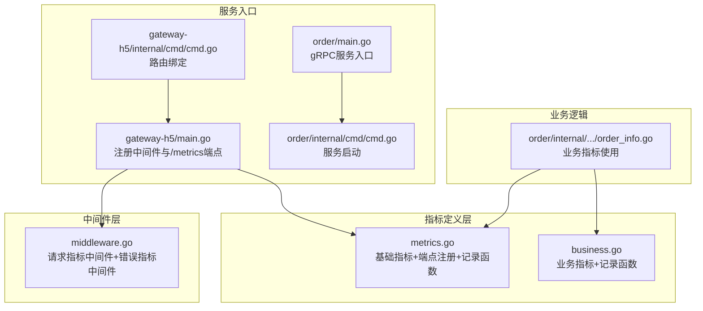
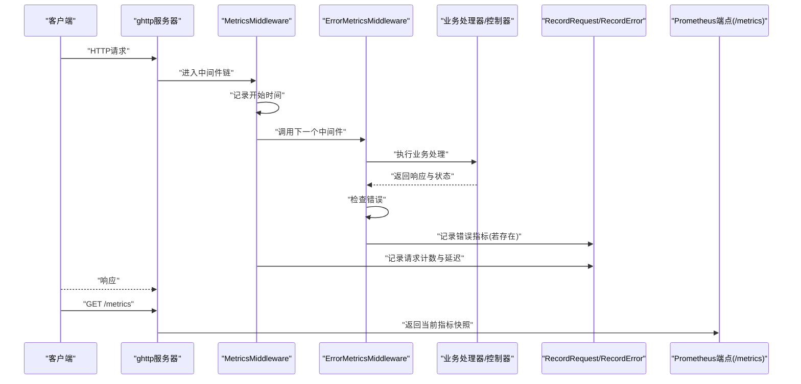
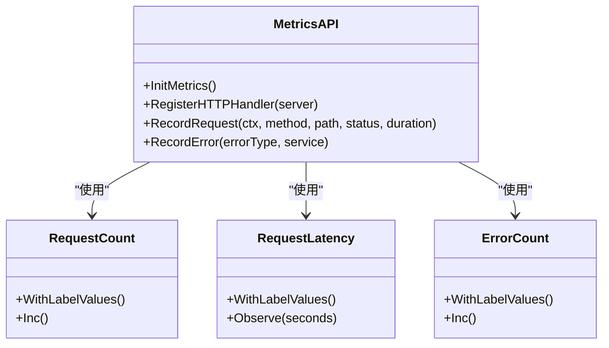
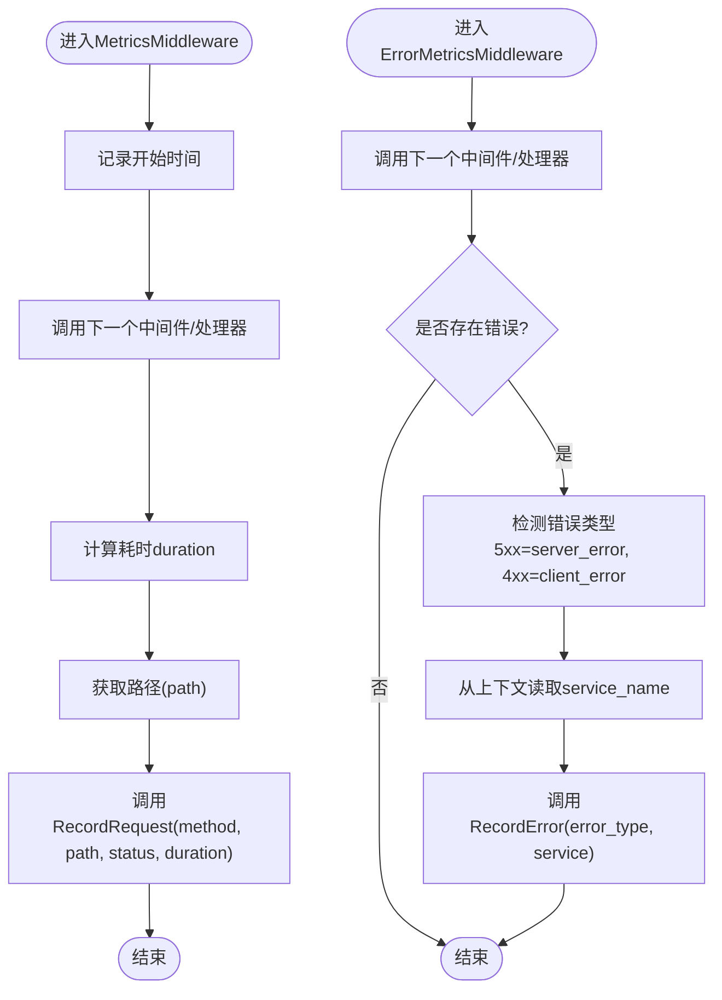
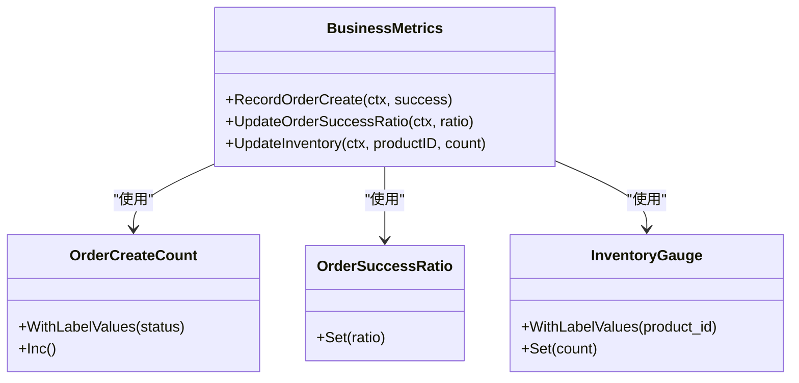
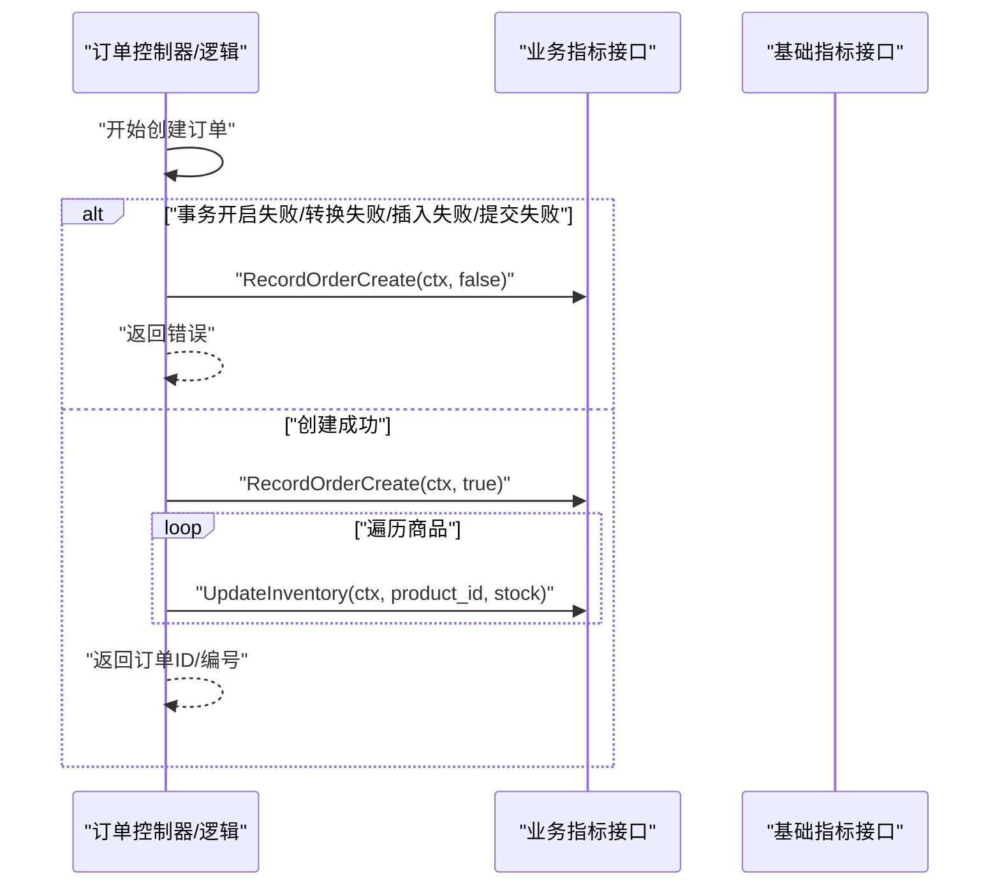
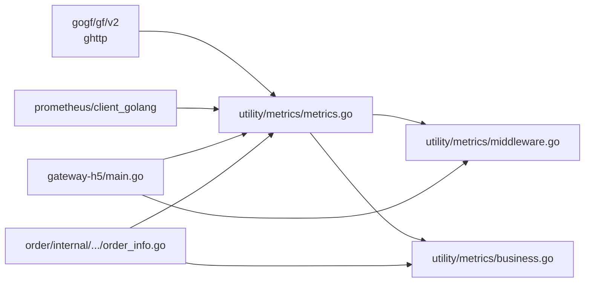

# Prometheus指标监控

<cite>
**本文引用的文件**
- [metrics.go](file://utility/metrics/metrics.go)
- [middleware.go](file://utility/metrics/middleware.go)
- [business.go](file://utility/metrics/business.go)
- [gateway-h5/main.go](file://app/gateway-h5/main.go)
- [gateway-h5/cmd/cmd.go](file://app/gateway-h5/internal/cmd/cmd.go)
- [order/main.go](file://app/order/main.go)
- [order/cmd/cmd.go](file://app/order/internal/cmd/cmd.go)
- [order_info.go](file://app/order/internal/logic/order_info/order_info.go)
- [Prometheus指标埋点设计与实现方案.md](file://doc/Prometheus指标埋点设计与实现方案.md)
- [go-service-monitoring.json](file://doc/grafana/dashboards/go-service-monitoring.json)
- [go.mod](file://go.mod)
</cite>

## 目录
1. [简介](#简介)
2. [项目结构](#项目结构)
3. [核心组件](#核心组件)
4. [架构总览](#架构总览)
5. [组件详细分析](#组件详细分析)
6. [依赖关系分析](#依赖关系分析)
7. [性能考量](#性能考量)
8. [故障排查指南](#故障排查指南)
9. [结论](#结论)
10. [附录](#附录)

## 简介
本文件系统化阐述基于Goframe微服务的Prometheus指标监控实现，涵盖基础HTTP请求指标（请求计数、请求延迟、错误计数）与业务指标（订单创建、成功率、库存）的设计原理与落地方案。文档重点解析utility/metrics目录下的核心指标定义、HTTP中间件实现与业务指标接口，并提供服务初始化、中间件注册与指标端点配置的完整集成流程，辅以测试验证方法与Prometheus查询语句，帮助读者快速在生产环境中落地可观测性。

## 项目结构
与Prometheus指标监控直接相关的模块位于utility/metrics目录，以及各服务的入口与路由配置处：
- utility/metrics：指标定义与中间件
  - metrics.go：基础指标定义、指标端点注册、记录函数
  - middleware.go：HTTP请求指标中间件与错误指标中间件
  - business.go：业务指标定义与记录函数
- 服务入口与路由
  - app/gateway-h5：演示HTTP中间件与/metrics端点注册
  - app/order：演示业务指标在订单流程中的使用
- 文档与依赖
  - doc/Prometheus指标埋点设计与实现方案.md：整体设计说明
  - go.mod：Prometheus客户端依赖声明

**图表来源**
- [metrics.go](file://utility/metrics/metrics.go#L1-L71)
- [business.go](file://utility/metrics/business.go#L1-L70)
- [middleware.go](file://utility/metrics/middleware.go#L1-L62)
- [gateway-h5/main.go](file://app/gateway-h5/main.go#L1-L38)
- [gateway-h5/cmd/cmd.go](file://app/gateway-h5/internal/cmd/cmd.go#L1-L100)
- [order/main.go](file://app/order/main.go#L1-L23)
- [order/cmd/cmd.go](file://app/order/internal/cmd/cmd.go#L1-L90)
- [order_info.go](file://app/order/internal/logic/order_info/order_info.go#L100-L212)

**章节来源**
- [metrics.go](file://utility/metrics/metrics.go#L1-L71)
- [business.go](file://utility/metrics/business.go#L1-L70)
- [middleware.go](file://utility/metrics/middleware.go#L1-L62)
- [gateway-h5/main.go](file://app/gateway-h5/main.go#L1-L38)
- [gateway-h5/cmd/cmd.go](file://app/gateway-h5/internal/cmd/cmd.go#L1-L100)
- [order/main.go](file://app/order/main.go#L1-L23)
- [order/cmd/cmd.go](file://app/order/internal/cmd/cmd.go#L1-L90)
- [order_info.go](file://app/order/internal/logic/order_info/order_info.go#L100-L212)

## 核心组件
- 基础指标定义与端点注册
  - 请求计数：按方法、路径、状态码聚合
  - 请求延迟：按方法、路径记录直方图
  - 错误计数：按错误类型、服务名聚合
  - 指标端点：/metrics，由ghttp服务器统一暴露
- HTTP中间件
  - MetricsMiddleware：自动采集请求耗时与状态，记录请求计数与延迟
  - ErrorMetricsMiddleware：在出现错误时记录错误类型与服务名
- 业务指标接口
  - 订单创建计数：按成功/失败统计
  - 订单成功率：当前成功比例
  - 库存指标：按商品ID记录当前库存

**章节来源**
- [metrics.go](file://utility/metrics/metrics.go#L14-L71)
- [middleware.go](file://utility/metrics/middleware.go#L9-L62)
- [business.go](file://utility/metrics/business.go#L10-L70)

## 架构总览
Prometheus指标监控在服务中的运行时架构如下：

**图表来源**
- [gateway-h5/main.go](file://app/gateway-h5/main.go#L23-L35)
- [middleware.go](file://utility/metrics/middleware.go#L10-L61)
- [metrics.go](file://utility/metrics/metrics.go#L46-L71)

## 组件详细分析

### 基础指标与端点注册（metrics.go）
- 指标定义
  - http_requests_total：CounterVec，标签method、path、status
  - http_request_duration_seconds：HistogramVec，标签method、path、status
  - service_errors_total：CounterVec，标签error_type、service
- 端点注册
  - 在ghttp服务器上注册/metrics路由，使用promhttp.Handler输出指标
- 记录函数
  - RecordRequest：记录请求计数与延迟
  - RecordError：记录错误计数

**图表来源**
- [metrics.go](file://utility/metrics/metrics.go#L14-L71)

**章节来源**
- [metrics.go](file://utility/metrics/metrics.go#L14-L71)

### HTTP中间件（middleware.go）
- MetricsMiddleware
  - 记录请求开始时间
  - 调用后续中间件/处理器
  - 计算耗时，获取路径（优先Router.Uri，否则URL.Path）
  - 调用RecordRequest记录请求计数与延迟
- ErrorMetricsMiddleware
  - 调用后续中间件/处理器
  - 若r.GetError()非空，推断错误类型（5xx为server_error，4xx为client_error，其余general_error）
  - 从上下文提取service_name，调用RecordError记录

**图表来源**
- [middleware.go](file://utility/metrics/middleware.go#L10-L61)

**章节来源**
- [middleware.go](file://utility/metrics/middleware.go#L9-L62)

### 业务指标接口（business.go）
- 指标定义
  - business_order_create_total：按status（success/failed）统计
  - business_order_success_ratio：当前成功率（Gauge）
  - business_inventory_count：按product_id统计当前库存（GaugeVec）
- 记录函数
  - RecordOrderCreate：根据success设置status并递增计数
  - UpdateOrderSuccessRatio：设置成功率
  - UpdateInventory：按product_id设置库存

**图表来源**
- [business.go](file://utility/metrics/business.go#L10-L70)

**章节来源**
- [business.go](file://utility/metrics/business.go#L10-L70)

### 业务指标在订单流程中的使用（order_info.go）
- 订单创建失败路径：在事务开启、数据转换、插入、提交等环节失败时记录失败指标
- 订单创建成功路径：记录成功指标，并对每个商品更新库存指标

**图表来源**
- [order_info.go](file://app/order/internal/logic/order_info/order_info.go#L100-L212)
- [business.go](file://utility/metrics/business.go#L41-L58)
- [metrics.go](file://utility/metrics/metrics.go#L62-L71)

**章节来源**
- [order_info.go](file://app/order/internal/logic/order_info/order_info.go#L100-L212)
- [business.go](file://utility/metrics/business.go#L41-L58)
- [metrics.go](file://utility/metrics/metrics.go#L62-L71)

## 依赖关系分析
- 指标库依赖
  - github.com/prometheus/client_golang：Prometheus客户端
  - github.com/prometheus/client_model、github.com/prometheus/common、github.com/prometheus/procfs：底层模型与工具
- 服务框架依赖
  - github.com/gogf/gf/v2：ghttp服务器与中间件链
- 服务集成点
  - gateway-h5：在main.go中注册中间件与/metrics端点
  - order：在业务逻辑中调用业务指标接口

**图表来源**
- [go.mod](file://go.mod#L14-L21)
- [gateway-h5/main.go](file://app/gateway-h5/main.go#L9-L35)
- [order_info.go](file://app/order/internal/logic/order_info/order_info.go#L200-L209)
- [metrics.go](file://utility/metrics/metrics.go#L1-L12)

**章节来源**
- [go.mod](file://go.mod#L14-L21)
- [gateway-h5/main.go](file://app/gateway-h5/main.go#L9-L35)
- [order_info.go](file://app/order/internal/logic/order_info/order_info.go#L200-L209)

## 性能考量
- 指标基数控制
  - 路径标签建议使用路由模式而非具体ID，避免高基数导致时间序列爆炸
  - 商品ID、用户ID等应谨慎作为标签，必要时做采样或归一化
- 直方图桶设置
  - 使用默认桶（DefBuckets）即可覆盖大多数场景；针对长尾延迟可自定义桶
- 中间件顺序
  - MetricsMiddleware置于链路前端，ErrorMetricsMiddleware置于链路末端，保证错误捕获与指标记录的完整性
- 端点暴露
  - /metrics端点仅暴露当前指标快照，避免在高频路径中重复序列化
- 内存与GC
  - 避免在热路径频繁创建新标签值；尽量复用常见标签组合

[本节为通用指导，无需“章节来源”]

## 故障排查指南
- 指标未出现在/metrics端点
  - 确认已在服务入口注册RegisterHTTPHandler
  - 检查ghttp服务器是否正确启动
- 指标标签异常
  - 检查MetricsMiddleware中路径获取逻辑（Router.Uri优先）
  - 确认错误中间件上下文中的service_name是否正确注入
- 业务指标未更新
  - 确认在成功/失败路径均调用了RecordOrderCreate
  - 确认UpdateInventory传入的product_id格式与定义一致
- 查询验证
  - 使用Prometheus查询验证：总请求数、P95延迟、错误率、订单成功率、库存变化趋势

**章节来源**
- [gateway-h5/main.go](file://app/gateway-h5/main.go#L23-L35)
- [middleware.go](file://utility/metrics/middleware.go#L20-L33)
- [order_info.go](file://app/order/internal/logic/order_info/order_info.go#L108-L209)

## 结论
该实现以utility/metrics为核心，提供基础HTTP指标与业务指标的统一抽象与便捷使用方式。通过HTTP中间件自动采集请求与错误指标，结合业务逻辑中的关键节点埋点，形成从基础设施到业务层面的全链路可观测能力。配合Grafana看板与动态阈值告警，可有效支撑服务稳定性与业务健康度监控。

[本节为总结，无需“章节来源”]

## 附录

### 集成方案（服务初始化、中间件注册、指标端点配置）
- 在服务入口初始化指标、注册中间件与/metrics端点
  - 初始化：metrics.InitMetrics()
  - 注册中间件：s.Use(metrics.MetricsMiddleware)、s.Use(metrics.ErrorMetricsMiddleware)
  - 注册端点：metrics.RegisterHTTPHandler(s)
- 在业务逻辑中使用业务指标
  - 订单创建：metrics.RecordOrderCreate(ctx, success)
  - 库存更新：metrics.UpdateInventory(ctx, productID, count)

**章节来源**
- [gateway-h5/main.go](file://app/gateway-h5/main.go#L23-L35)
- [order_info.go](file://app/order/internal/logic/order_info/order_info.go#L203-L209)
- [Prometheus指标埋点设计与实现方案.md](file://doc/Prometheus指标埋点设计与实现方案.md#L120-L147)

### 测试验证方法
- 编译验证：下载依赖并编译相关服务
- 运行时验证：启动服务，访问/metrics端点，执行业务操作观察指标变化
- Grafana看板：导入go-service-monitoring.json，验证面板与告警规则

**章节来源**
- [Prometheus指标埋点设计与实现方案.md](file://doc/Prometheus指标埋点设计与实现方案.md#L149-L167)
- [go-service-monitoring.json](file://doc/grafana/dashboards/go-service-monitoring.json#L460-L466)

### Prometheus查询语句示例
- 总请求数：sum(http_requests_total)
- 订单成功率：rate(business_order_create_total[5m]) 通过status标签区分success与failed后聚合
- P95请求延迟：histogram_quantile(0.95, sum(rate(http_request_duration_seconds_bucket[5m])) by (le))

**章节来源**
- [Prometheus指标埋点设计与实现方案.md](file://doc/Prometheus指标埋点设计与实现方案.md#L170-L181)