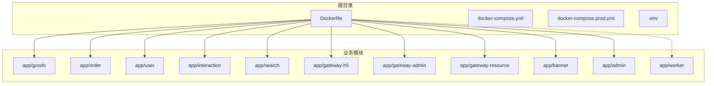
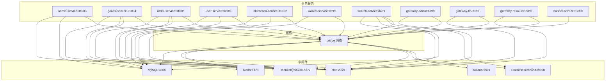
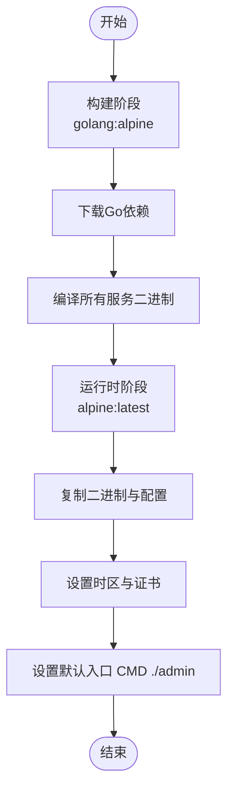
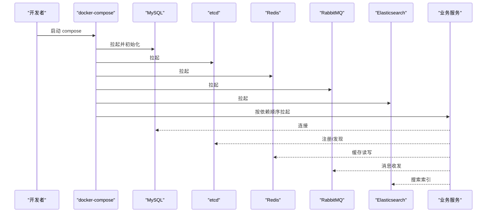
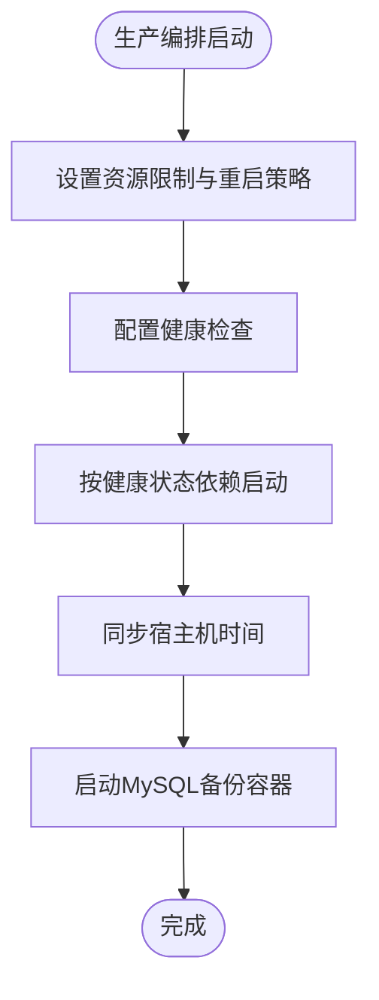
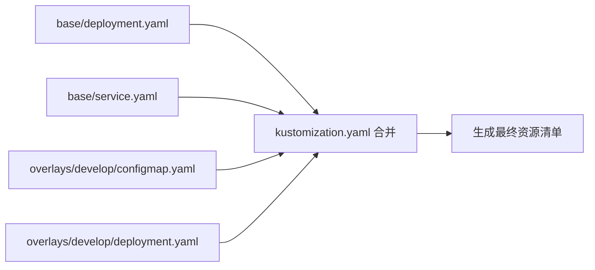
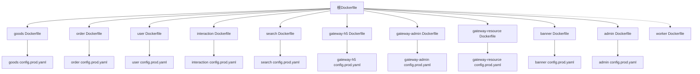

# 容器化部署与编排

<cite>
**本文引用的文件**
- [Dockerfile](file://Dockerfile)
- [docker-compose.yml](file://docker-compose.yml)
- [docker-compose.prod.yml](file://docker-compose.prod.yml)
- [.env](file://.env)
- [app/admin/manifest/docker/Dockerfile](file://app/admin/manifest/docker/Dockerfile)
- [app/goods/manifest/docker/Dockerfile](file://app/goods/manifest/docker/Dockerfile)
- [app/admin/manifest/deploy/kustomize/base/kustomization.yaml](file://app/admin/manifest/deploy/kustomize/base/kustomization.yaml)
- [app/admin/manifest/deploy/kustomize/base/deployment.yaml](file://app/admin/manifest/deploy/kustomize/base/deployment.yaml)
- [app/admin/manifest/deploy/kustomize/base/service.yaml](file://app/admin/manifest/deploy/kustomize/base/service.yaml)
- [app/admin/manifest/deploy/kustomize/overlays/develop/kustomization.yaml](file://app/admin/manifest/deploy/kustomize/overlays/develop/kustomization.yaml)
- [app/admin/manifest/deploy/kustomize/overlays/develop/configmap.yaml](file://app/admin/manifest/deploy/kustomize/overlays/develop/configmap.yaml)
- [app/admin/manifest/config/config.prod.yaml](file://app/admin/manifest/config/config.prod.yaml)
- [app/goods/manifest/docker/docker.sh](file://app/goods/manifest/docker/docker.sh)
- [app/admin/manifest/docker/docker.sh](file://app/admin/manifest/docker/docker.sh)
</cite>

## 目录
1. [简介](#简介)
2. [项目结构](#项目结构)
3. [核心组件](#核心组件)
4. [架构总览](#架构总览)
5. [详细组件分析](#详细组件分析)
6. [依赖关系分析](#依赖关系分析)
7. [性能考量](#性能考量)
8. [故障排查指南](#故障排查指南)
9. [结论](#结论)
10. [附录](#附录)

## 简介
本文件面向容器化部署与编排，系统性阐述该仓库的多阶段Docker镜像构建、docker-compose服务编排以及Kubernetes/Kustomize资源管理方案。内容覆盖：
- Dockerfile构建配置与镜像优化
- docker-compose开发与生产环境编排
- Kubernetes/Kustomize基础资源与环境覆盖
- 生产与开发环境差异配置
- 服务发现、负载均衡、滚动更新与健康检查
- 完整部署流程、环境配置与故障排查

## 项目结构
该项目采用“单仓多服务”的组织方式，每个业务模块（如 goods、order、user、gateway-* 等）均包含独立的Dockerfile与Kubernetes/Kustomize资源，便于按需构建与部署。

图表来源
- [Dockerfile](file://Dockerfile#L1-L49)
- [docker-compose.yml](file://docker-compose.yml#L1-L355)
- [docker-compose.prod.yml](file://docker-compose.prod.yml#L1-L551)

章节来源
- [Dockerfile](file://Dockerfile#L1-L49)
- [docker-compose.yml](file://docker-compose.yml#L1-L355)
- [docker-compose.prod.yml](file://docker-compose.prod.yml#L1-L551)
- [.env](file://.env#L1-L28)

## 核心组件
- 多阶段Dockerfile：统一在根目录构建所有服务二进制，最终以Alpine为基础镜像，仅拷贝二进制与配置，实现最小镜像体积与快速启动。
- 单仓多服务：每个模块拥有独立的Dockerfile与Kustomize资源，便于独立构建与部署。
- docker-compose：提供开发与生产两套编排，涵盖数据库、缓存、消息队列、搜索引擎、网关与各业务服务。
- Kustomize：以base定义通用资源，overlay覆盖不同环境（如develop），支持ConfigMap注入与补丁合并。

章节来源
- [Dockerfile](file://Dockerfile#L1-L49)
- [app/admin/manifest/docker/Dockerfile](file://app/admin/manifest/docker/Dockerfile#L1-L17)
- [app/goods/manifest/docker/Dockerfile](file://app/goods/manifest/docker/Dockerfile#L1-L17)
- [docker-compose.yml](file://docker-compose.yml#L1-L355)
- [docker-compose.prod.yml](file://docker-compose.prod.yml#L1-L551)
- [app/admin/manifest/deploy/kustomize/base/kustomization.yaml](file://app/admin/manifest/deploy/kustomize/base/kustomization.yaml#L1-L9)
- [app/admin/manifest/deploy/kustomize/overlays/develop/kustomization.yaml](file://app/admin/manifest/deploy/kustomize/overlays/develop/kustomization.yaml#L1-L15)

## 架构总览
下图展示开发与生产环境的容器化架构，包括核心中间件与业务服务之间的依赖关系与端口映射。

图表来源
- [docker-compose.yml](file://docker-compose.yml#L1-L355)
- [docker-compose.prod.yml](file://docker-compose.prod.yml#L1-L551)

章节来源
- [docker-compose.yml](file://docker-compose.yml#L1-L355)
- [docker-compose.prod.yml](file://docker-compose.prod.yml#L1-L551)

## 详细组件分析

### Dockerfile 构建配置
- 多阶段构建：第一阶段使用golang:alpine作为构建环境，下载依赖并编译所有服务二进制；第二阶段使用Alpine作为运行时，仅拷贝二进制与配置，减少镜像体积。
- 运行时依赖：安装证书与时区数据，确保TLS与日志时间正确。
- 默认入口：CMD指向admin服务，便于本地快速启动；生产环境通过docker-compose指定具体服务入口。

图表来源
- [Dockerfile](file://Dockerfile#L1-L49)

章节来源
- [Dockerfile](file://Dockerfile#L1-L49)

### docker-compose 开发环境
- 网络与卷：统一bridge网络与持久化卷，便于数据持久与服务互通。
- 中间件：MySQL、etcd、Redis、RabbitMQ、Elasticsearch、Kibana均定义了健康检查与重启策略。
- 业务服务：每个服务均挂载对应模块的配置目录与日志目录，并通过depends_on声明依赖顺序。
- 端口映射：为各服务与中间件分配固定端口，便于本地调试与联调。

图表来源
- [docker-compose.yml](file://docker-compose.yml#L1-L355)

章节来源
- [docker-compose.yml](file://docker-compose.yml#L1-L355)
- [.env](file://.env#L1-L28)

### docker-compose 生产环境
- 资源限制：为每个服务与中间件设置内存与CPU上限与预留，提升资源利用率与稳定性。
- 健康检查：对MySQL、etcd、Redis、RabbitMQ、Elasticsearch、Kibana及各业务服务配置健康检查，结合restart策略实现自愈。
- 网络与时间同步：桥接网络与宿主机时间同步，保证集群内通信与日志时间一致。
- 独立Dockerfile：业务服务使用各自模块的Dockerfile，实现更细粒度的构建与优化。
- 备份服务：内置MySQL定时备份容器，保留指定天数的历史备份并清理过期备份。

图表来源
- [docker-compose.prod.yml](file://docker-compose.prod.yml#L1-L551)

章节来源
- [docker-compose.prod.yml](file://docker-compose.prod.yml#L1-L551)

### Kubernetes/Kustomize 基础与覆盖
- Base资源：定义通用的Deployment与Service，用于承载业务应用。
- Overlay覆盖：以develop为例，合并base资源并通过补丁与ConfigMap覆盖实现环境差异化。
- ConfigMap注入：通过overlay注入配置，避免硬编码在镜像中，提升灵活性。

图表来源
- [app/admin/manifest/deploy/kustomize/base/deployment.yaml](file://app/admin/manifest/deploy/kustomize/base/deployment.yaml#L1-L22)
- [app/admin/manifest/deploy/kustomize/base/service.yaml](file://app/admin/manifest/deploy/kustomize/base/service.yaml#L1-L13)
- [app/admin/manifest/deploy/kustomize/base/kustomization.yaml](file://app/admin/manifest/deploy/kustomize/base/kustomization.yaml#L1-L9)
- [app/admin/manifest/deploy/kustomize/overlays/develop/kustomization.yaml](file://app/admin/manifest/deploy/kustomize/overlays/develop/kustomization.yaml#L1-L15)
- [app/admin/manifest/deploy/kustomize/overlays/develop/configmap.yaml](file://app/admin/manifest/deploy/kustomize/overlays/develop/configmap.yaml#L1-L15)

章节来源
- [app/admin/manifest/deploy/kustomize/base/kustomization.yaml](file://app/admin/manifest/deploy/kustomize/base/kustomization.yaml#L1-L9)
- [app/admin/manifest/deploy/kustomize/base/deployment.yaml](file://app/admin/manifest/deploy/kustomize/base/deployment.yaml#L1-L22)
- [app/admin/manifest/deploy/kustomize/base/service.yaml](file://app/admin/manifest/deploy/kustomize/base/service.yaml#L1-L13)
- [app/admin/manifest/deploy/kustomize/overlays/develop/kustomization.yaml](file://app/admin/manifest/deploy/kustomize/overlays/develop/kustomization.yaml#L1-L15)
- [app/admin/manifest/deploy/kustomize/overlays/develop/configmap.yaml](file://app/admin/manifest/deploy/kustomize/overlays/develop/configmap.yaml#L1-L15)

### 配置与环境差异
- 开发环境：通过.env集中管理中间件连接参数，compose按模块挂载配置目录，便于热更新与调试。
- 生产环境：各服务使用独立的config.prod.yaml，数据库密码等敏感信息在compose中集中管理，避免硬编码。
- 网关与资源：gateway-*服务通过环境变量注入第三方密钥（如七牛云），并在compose中进行挂载与暴露。

章节来源
- [.env](file://.env#L1-L28)
- [app/admin/manifest/config/config.prod.yaml](file://app/admin/manifest/config/config.prod.yaml#L1-L22)
- [docker-compose.yml](file://docker-compose.yml#L313-L315)
- [docker-compose.prod.yml](file://docker-compose.prod.yml#L399-L430)

### 服务发现、负载均衡与滚动更新
- 服务发现：业务服务通过etcd注册与发现，确保服务间动态寻址。
- 负载均衡：Kubernetes Service提供服务级负载均衡；docker-compose通过端口映射与内部网络实现服务访问。
- 滚动更新：Kustomize可通过补丁更新镜像版本或副本数，配合健康检查实现平滑发布；docker-compose通过重建与重启策略实现更新。

章节来源
- [docker-compose.yml](file://docker-compose.yml#L26-L37)
- [docker-compose.prod.yml](file://docker-compose.prod.yml#L45-L61)
- [app/admin/manifest/deploy/kustomize/base/service.yaml](file://app/admin/manifest/deploy/kustomize/base/service.yaml#L1-L13)

## 依赖关系分析
- 构建依赖：根Dockerfile统一编译所有服务，模块Dockerfile用于独立构建与部署。
- 运行依赖：业务服务依赖etcd、MySQL、Redis、RabbitMQ、Elasticsearch等中间件；部分服务（如search、order）有更强的依赖链。
- 配置依赖：各服务通过挂载配置文件或ConfigMap注入配置，避免硬编码。

图表来源
- [Dockerfile](file://Dockerfile#L1-L49)
- [app/goods/manifest/docker/Dockerfile](file://app/goods/manifest/docker/Dockerfile#L1-L17)
- [app/admin/manifest/docker/Dockerfile](file://app/admin/manifest/docker/Dockerfile#L1-L17)
- [app/admin/manifest/config/config.prod.yaml](file://app/admin/manifest/config/config.prod.yaml#L1-L22)

章节来源
- [Dockerfile](file://Dockerfile#L1-L49)
- [app/goods/manifest/docker/Dockerfile](file://app/goods/manifest/docker/Dockerfile#L1-L17)
- [app/admin/manifest/docker/Dockerfile](file://app/admin/manifest/docker/Dockerfile#L1-L17)
- [app/admin/manifest/config/config.prod.yaml](file://app/admin/manifest/config/config.prod.yaml#L1-L22)

## 性能考量
- 镜像体积：多阶段构建与Alpine运行时显著降低镜像大小，缩短拉取与启动时间。
- 资源配额：生产环境为中间件与业务服务设置内存/CPU上限与预留，避免资源争抢。
- 健康检查：通过健康检查与重启策略提升系统可用性与自愈能力。
- 存储与备份：持久化卷与定时备份保障数据安全与可恢复性。

## 故障排查指南
- 服务无法启动
  - 检查依赖中间件是否健康（compose中配置了健康检查），确认端口未被占用。
  - 查看对应服务的日志挂载目录，定位启动错误。
- 数据库连接失败
  - 核对.env与config.prod.yaml中的数据库地址、账号与密码。
  - 确认compose网络与容器间连通性。
- 消息队列异常
  - 检查RabbitMQ插件是否启用成功，确认管理界面端口映射。
- 搜索服务异常
  - 确认Elasticsearch插件安装与健康状态，检查IK分词器加载情况。
- 配置不生效
  - docker-compose开发环境：确认配置挂载路径正确。
  - Kubernetes/Kustomize：确认overlay合并与ConfigMap注入生效。

章节来源
- [docker-compose.yml](file://docker-compose.yml#L19-L24)
- [docker-compose.yml](file://docker-compose.yml#L101-L106)
- [docker-compose.prod.yml](file://docker-compose.prod.yml#L117-L122)
- [docker-compose.prod.yml](file://docker-compose.prod.yml#L153-L158)

## 结论
本项目提供了从单仓多服务到容器化编排的完整方案：根Dockerfile统一构建、模块Dockerfile独立部署、compose开发与生产双轨编排、Kustomize基础与覆盖的Kubernetes资源管理。通过健康检查、资源限制与备份机制，兼顾易用性与生产稳定性。建议在生产环境中优先采用独立Dockerfile与Kustomize覆盖，结合CI/CD自动化构建与发布。

## 附录
- 部署流程建议
  - 开发环境：使用docker-compose.yml，先启动中间件，再启动业务服务，挂载配置与日志目录。
  - 生产环境：使用docker-compose.prod.yml，按健康检查与资源限制策略部署，定期执行备份任务。
  - Kubernetes：使用Kustomize base与overlay生成最终清单，结合滚动更新与健康检查实现平滑发布。

章节来源
- [docker-compose.yml](file://docker-compose.yml#L1-L355)
- [docker-compose.prod.yml](file://docker-compose.prod.yml#L1-L551)
- [app/admin/manifest/deploy/kustomize/base/kustomization.yaml](file://app/admin/manifest/deploy/kustomize/base/kustomization.yaml#L1-L9)
- [app/admin/manifest/deploy/kustomize/overlays/develop/kustomization.yaml](file://app/admin/manifest/deploy/kustomize/overlays/develop/kustomization.yaml#L1-L15)