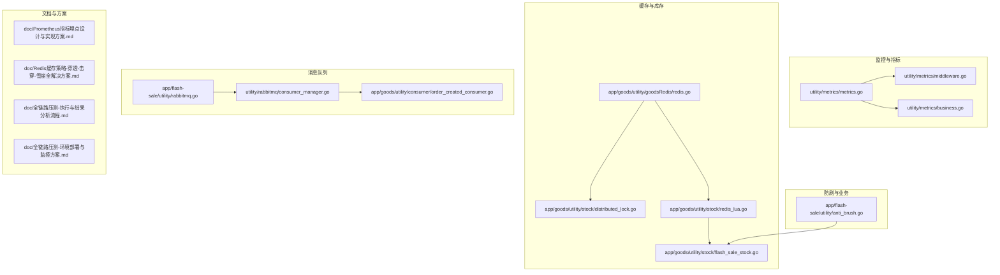
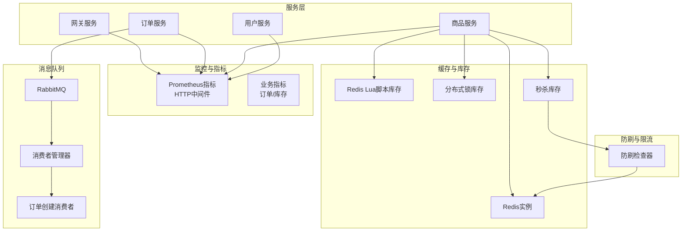
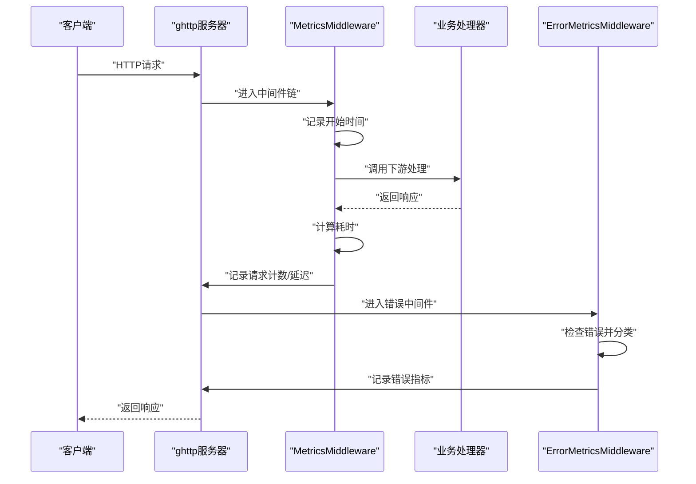
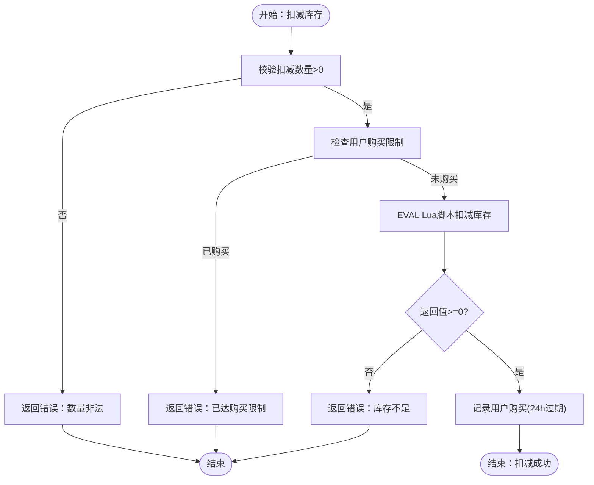
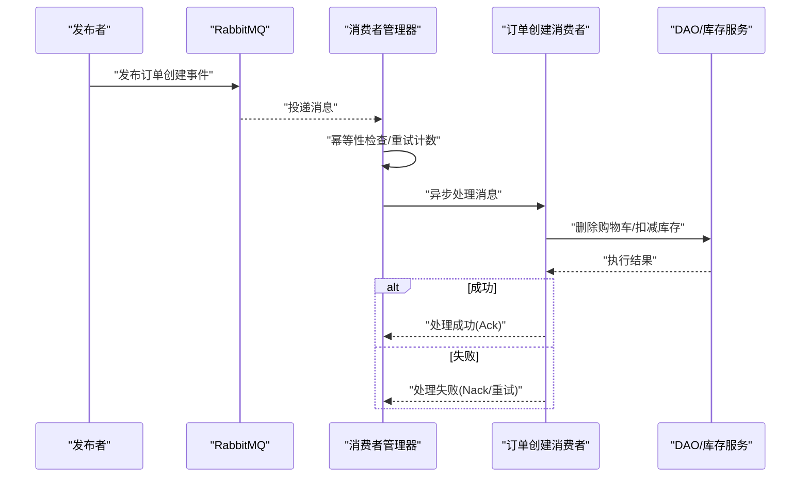
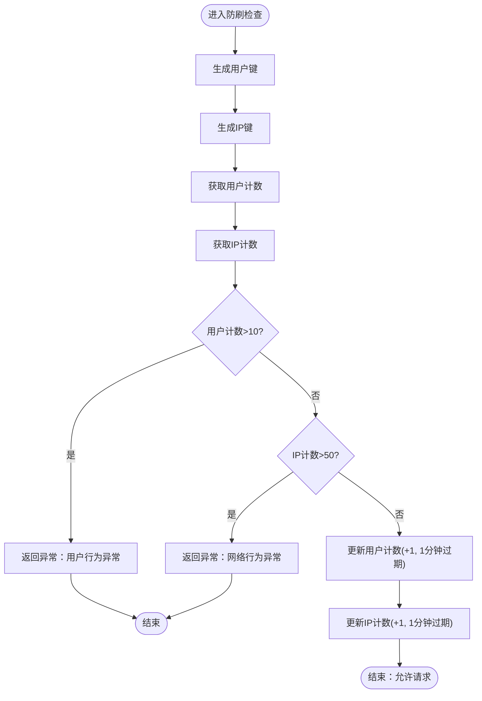
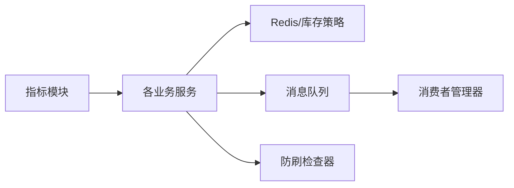

# 性能监控与优化

<cite>
**本文引用的文件**
- [utility/metrics/metrics.go](file://utility/metrics/metrics.go)
- [utility/metrics/business.go](file://utility/metrics/business.go)
- [utility/metrics/middleware.go](file://utility/metrics/middleware.go)
- [app/goods/utility/goodsRedis/redis.go](file://app/goods/utility/goodsRedis/redis.go)
- [app/goods/utility/stock/distributed_lock.go](file://app/goods/utility/stock/distributed_lock.go)
- [app/goods/utility/stock/redis_lua.go](file://app/goods/utility/stock/redis_lua.go)
- [app/goods/utility/stock/flash_sale_stock.go](file://app/goods/utility/stock/flash_sale_stock.go)
- [app/flash-sale/utility/anti_brush.go](file://app/flash-sale/utility/anti_brush.go)
- [app/flash-sale/utility/rabbitmq.go](file://app/flash-sale/utility/rabbitmq.go)
- [app/goods/utility/consumer/order_created_consumer.go](file://app/goods/utility/consumer/order_created_consumer.go)
- [utility/rabbitmq/consumer_manager.go](file://utility/rabbitmq/consumer_manager.go)
- [doc/Prometheus指标埋点设计与实现方案.md](file://doc/Prometheus指标埋点设计与实现方案.md)
- [doc/Redis缓存策略-穿透-击穿-雪崩全解决方案.md](file://doc/Redis缓存策略-穿透-击穿-雪崩全解决方案.md)
- [doc/全链路压测-执行与结果分析流程.md](file://doc/全链路压测-执行与结果分析流程.md)
- [doc/全链路压测-环境部署与监控方案.md](file://doc/全链路压测-环境部署与监控方案.md)
</cite>

## 目录
1. [引言](#引言)
2. [项目结构](#项目结构)
3. [核心组件](#核心组件)
4. [架构概览](#架构概览)
5. [详细组件分析](#详细组件分析)
6. [依赖分析](#依赖分析)
7. [性能考量](#性能考量)
8. [故障排查指南](#故障排查指南)
9. [结论](#结论)
10. [附录](#附录)

## 引言
本文件面向性能监控与优化主题，围绕微服务架构中的Redis缓存、数据库查询、消息队列与接口响应时间等关键指标，系统阐述监控策略、瓶颈识别方法、优化技术与容量规划。结合项目中已有的Prometheus指标埋点、Redis缓存策略、消息队列消费者管理与压测方案，给出可落地的监控方案与调优实践，帮助通过监控数据驱动系统优化决策。

## 项目结构
本项目采用多服务微架构，关键性能相关模块集中在以下位置：
- 指标埋点与中间件：utility/metrics
- Redis缓存与库存管理：app/goods/utility/goodsRedis、app/goods/utility/stock
- 秒杀与防刷：app/flash-sale/utility
- 消息队列：app/flash-sale/utility、utility/rabbitmq
- 压测与监控：doc 下的 Prometheus、Redis 缓存策略、全链路压测文档

图表来源
- [utility/metrics/metrics.go](file://utility/metrics/metrics.go#L1-L71)
- [utility/metrics/middleware.go](file://utility/metrics/middleware.go#L1-L62)
- [utility/metrics/business.go](file://utility/metrics/business.go#L1-L70)
- [app/goods/utility/goodsRedis/redis.go](file://app/goods/utility/goodsRedis/redis.go#L1-L49)
- [app/goods/utility/stock/distributed_lock.go](file://app/goods/utility/stock/distributed_lock.go#L1-L266)
- [app/goods/utility/stock/redis_lua.go](file://app/goods/utility/stock/redis_lua.go#L1-L166)
- [app/goods/utility/stock/flash_sale_stock.go](file://app/goods/utility/stock/flash_sale_stock.go#L1-L152)
- [app/flash-sale/utility/rabbitmq.go](file://app/flash-sale/utility/rabbitmq.go#L1-L132)
- [utility/rabbitmq/consumer_manager.go](file://utility/rabbitmq/consumer_manager.go#L1-L446)
- [app/goods/utility/consumer/order_created_consumer.go](file://app/goods/utility/consumer/order_created_consumer.go#L1-L65)
- [app/flash-sale/utility/anti_brush.go](file://app/flash-sale/utility/anti_brush.go#L1-L81)
- [doc/Prometheus指标埋点设计与实现方案.md](file://doc/Prometheus指标埋点设计与实现方案.md#L1-L195)
- [doc/Redis缓存策略-穿透-击穿-雪崩全解决方案.md](file://doc/Redis缓存策略-穿透-击穿-雪崩全解决方案.md#L1-L587)
- [doc/全链路压测-执行与结果分析流程.md](file://doc/全链路压测-执行与结果分析流程.md#L1-L467)
- [doc/全链路压测-环境部署与监控方案.md](file://doc/全链路压测-环境部署与监控方案.md#L1-L502)

章节来源
- [doc/Prometheus指标埋点设计与实现方案.md](file://doc/Prometheus指标埋点设计与实现方案.md#L1-L195)
- [doc/Redis缓存策略-穿透-击穿-雪崩全解决方案.md](file://doc/Redis缓存策略-穿透-击穿-雪崩全解决方案.md#L1-L587)
- [doc/全链路压测-执行与结果分析流程.md](file://doc/全链路压测-执行与结果分析流程.md#L1-L467)
- [doc/全链路压测-环境部署与监控方案.md](file://doc/全链路压测-环境部署与监控方案.md#L1-L502)

## 核心组件
- 指标埋点与中间件：提供HTTP请求计数、延迟分布与错误计数的基础指标，以及业务指标（订单创建、库存、成功率）。
- Redis缓存与库存：提供Redis初始化、缓存适配器、Lua脚本库存扣减、分布式锁库存管理与秒杀库存管理。
- 消息队列：RabbitMQ连接封装、消费者管理器（QoS、幂等、重试、自动确认/手动确认）与订单创建消费者。
- 防刷与限流：基于缓存的用户/IP行为频控，配合Redis Lua脚本与幂等机制。
- 压测与监控：分布式压测架构、监控指标体系、告警规则与资源隔离策略。

章节来源
- [utility/metrics/metrics.go](file://utility/metrics/metrics.go#L1-L71)
- [utility/metrics/business.go](file://utility/metrics/business.go#L1-L70)
- [utility/metrics/middleware.go](file://utility/metrics/middleware.go#L1-L62)
- [app/goods/utility/goodsRedis/redis.go](file://app/goods/utility/goodsRedis/redis.go#L1-L49)
- [app/goods/utility/stock/redis_lua.go](file://app/goods/utility/stock/redis_lua.go#L1-L166)
- [app/goods/utility/stock/distributed_lock.go](file://app/goods/utility/stock/distributed_lock.go#L1-L266)
- [app/goods/utility/stock/flash_sale_stock.go](file://app/goods/utility/stock/flash_sale_stock.go#L1-L152)
- [app/flash-sale/utility/rabbitmq.go](file://app/flash-sale/utility/rabbitmq.go#L1-L132)
- [utility/rabbitmq/consumer_manager.go](file://utility/rabbitmq/consumer_manager.go#L1-L446)
- [app/goods/utility/consumer/order_created_consumer.go](file://app/goods/utility/consumer/order_created_consumer.go#L1-L65)
- [app/flash-sale/utility/anti_brush.go](file://app/flash-sale/utility/anti_brush.go#L1-L81)

## 架构概览
下图展示了性能监控与优化涉及的关键组件及其交互关系，涵盖指标采集、缓存与库存、消息队列与防刷等模块。

图表来源
- [utility/metrics/metrics.go](file://utility/metrics/metrics.go#L1-L71)
- [utility/metrics/business.go](file://utility/metrics/business.go#L1-L70)
- [app/goods/utility/goodsRedis/redis.go](file://app/goods/utility/goodsRedis/redis.go#L1-L49)
- [app/goods/utility/stock/redis_lua.go](file://app/goods/utility/stock/redis_lua.go#L1-L166)
- [app/goods/utility/stock/distributed_lock.go](file://app/goods/utility/stock/distributed_lock.go#L1-L266)
- [app/goods/utility/stock/flash_sale_stock.go](file://app/goods/utility/stock/flash_sale_stock.go#L1-L152)
- [app/flash-sale/utility/rabbitmq.go](file://app/flash-sale/utility/rabbitmq.go#L1-L132)
- [utility/rabbitmq/consumer_manager.go](file://utility/rabbitmq/consumer_manager.go#L1-L446)
- [app/goods/utility/consumer/order_created_consumer.go](file://app/goods/utility/consumer/order_created_consumer.go#L1-L65)
- [app/flash-sale/utility/anti_brush.go](file://app/flash-sale/utility/anti_brush.go#L1-L81)

## 详细组件分析

### 指标埋点与中间件
- 基础指标：HTTP请求总量、请求延迟分布、服务错误计数，标签包含方法、路径、状态码等。
- 中间件：MetricsMiddleware自动记录请求耗时与状态；ErrorMetricsMiddleware根据响应状态分类错误类型并记录。
- 业务指标：订单创建计数/成功率、库存指标，便于业务侧观测。

图表来源
- [utility/metrics/middleware.go](file://utility/metrics/middleware.go#L1-L62)
- [utility/metrics/metrics.go](file://utility/metrics/metrics.go#L1-L71)
- [utility/metrics/business.go](file://utility/metrics/business.go#L1-L70)

章节来源
- [utility/metrics/metrics.go](file://utility/metrics/metrics.go#L1-L71)
- [utility/metrics/middleware.go](file://utility/metrics/middleware.go#L1-L62)
- [utility/metrics/business.go](file://utility/metrics/business.go#L1-L70)
- [doc/Prometheus指标埋点设计与实现方案.md](file://doc/Prometheus指标埋点设计与实现方案.md#L1-L195)

### Redis缓存与库存
- Redis初始化：从配置读取连接参数，创建Redis实例并接入gcache适配器，提供缓存实例获取。
- Lua脚本库存：基于Redis EVAL的原子扣减/返还，避免超卖与并发竞争。
- 分布式锁库存：基于SET NX EX的分布式锁，配合Lua脚本安全释放，适合非Lua场景。
- 秒杀库存：继承基础库存接口，增加用户购买限制与购买记录缓存，结合防刷检查器与缓存幂等。

图表来源
- [app/goods/utility/stock/flash_sale_stock.go](file://app/goods/utility/stock/flash_sale_stock.go#L52-L99)
- [app/goods/utility/stock/redis_lua.go](file://app/goods/utility/stock/redis_lua.go#L75-L102)
- [app/flash-sale/utility/anti_brush.go](file://app/flash-sale/utility/anti_brush.go#L24-L81)

章节来源
- [app/goods/utility/goodsRedis/redis.go](file://app/goods/utility/goodsRedis/redis.go#L1-L49)
- [app/goods/utility/stock/redis_lua.go](file://app/goods/utility/stock/redis_lua.go#L1-L166)
- [app/goods/utility/stock/distributed_lock.go](file://app/goods/utility/stock/distributed_lock.go#L1-L266)
- [app/goods/utility/stock/flash_sale_stock.go](file://app/goods/utility/stock/flash_sale_stock.go#L1-L152)
- [doc/Redis缓存策略-穿透-击穿-雪崩全解决方案.md](file://doc/Redis缓存策略-穿透-击穿-雪崩全解决方案.md#L1-L587)

### 消息队列与消费者管理
- RabbitMQ封装：连接建立、交换机/队列声明与持久化、消息发布。
- 消费者管理器：统一管理多个消费者，设置QoS、预取数量、自动/手动确认；实现幂等性检查、重试策略与错误分类。
- 订单创建消费者：监听订单创建事件，删除购物车、扣减库存并记录日志。

图表来源
- [app/flash-sale/utility/rabbitmq.go](file://app/flash-sale/utility/rabbitmq.go#L103-L120)
- [utility/rabbitmq/consumer_manager.go](file://utility/rabbitmq/consumer_manager.go#L196-L263)
- [app/goods/utility/consumer/order_created_consumer.go](file://app/goods/utility/consumer/order_created_consumer.go#L32-L64)

章节来源
- [app/flash-sale/utility/rabbitmq.go](file://app/flash-sale/utility/rabbitmq.go#L1-L132)
- [utility/rabbitmq/consumer_manager.go](file://utility/rabbitmq/consumer_manager.go#L1-L446)
- [app/goods/utility/consumer/order_created_consumer.go](file://app/goods/utility/consumer/order_created_consumer.go#L1-L65)

### 防刷与限流
- 行为检查：基于缓存统计用户/IP每分钟请求次数，超过阈值则拒绝。
- 秒杀场景：结合用户购买限制与购买记录缓存，防止超买与刷单。

图表来源
- [app/flash-sale/utility/anti_brush.go](file://app/flash-sale/utility/anti_brush.go#L24-L81)

章节来源
- [app/flash-sale/utility/anti_brush.go](file://app/flash-sale/utility/anti_brush.go#L1-L81)

## 依赖分析
- 指标模块与服务层解耦，通过中间件自动采集，业务层仅需调用业务指标接口。
- Redis库存实现通过Lua脚本与分布式锁两种策略互补，满足不同场景的性能与一致性需求。
- 消费者管理器统一处理幂等、重试与确认策略，降低各消费者重复实现成本。
- 防刷与库存策略协同，从入口与内部执行两个层面控制风险。

图表来源
- [utility/metrics/metrics.go](file://utility/metrics/metrics.go#L1-L71)
- [app/goods/utility/goodsRedis/redis.go](file://app/goods/utility/goodsRedis/redis.go#L1-L49)
- [app/goods/utility/stock/redis_lua.go](file://app/goods/utility/stock/redis_lua.go#L1-L166)
- [utility/rabbitmq/consumer_manager.go](file://utility/rabbitmq/consumer_manager.go#L1-L446)
- [app/flash-sale/utility/anti_brush.go](file://app/flash-sale/utility/anti_brush.go#L1-L81)

## 性能考量
- Redis缓存
  - 穿透/击穿/雪崩：通过空值缓存、本地锁、随机过期与延迟双删缓解；结合文档中的统一缓存策略接口与实现。
  - 命中率与延迟：监控缓存命中率与延迟，避免高基数标签；热点键可结合本地缓存与多级缓存。
- 数据库查询
  - SQL优化与索引：压测中识别慢查询，结合连接池使用率与获取耗时定位瓶颈。
  - 事务与锁：减少长事务与锁持有时间，避免阻塞放大。
- 消息队列吞吐量
  - QoS与预取：根据消费者处理能力设置PrefetchCount，平衡吞吐与堆积。
  - 幂等与重试：区分临时性与永久性错误，避免无限重试导致积压。
- 接口响应时间
  - 中间件自动采集P95/P99延迟，结合业务指标（成功率、库存）综合评估。
  - 压测中观察响应时间分布与错误率拐点，识别系统瓶颈。

章节来源
- [doc/Redis缓存策略-穿透-击穿-雪崩全解决方案.md](file://doc/Redis缓存策略-穿透-击穿-雪崩全解决方案.md#L1-L587)
- [doc/全链路压测-执行与结果分析流程.md](file://doc/全链路压测-执行与结果分析流程.md#L268-L467)
- [doc/全链路压测-环境部署与监控方案.md](file://doc/全链路压测-环境部署与监控方案.md#L111-L502)

## 故障排查指南
- 指标异常
  - 请求延迟升高：检查中间件是否正确记录；结合业务指标（订单成功率、库存变化）定位。
  - 错误率上升：区分客户端/服务端错误，结合错误中间件标签定位。
- Redis问题
  - 命中率低：检查键设计与过期策略；确认延迟双删是否生效。
  - 超卖/并发冲突：确认使用Lua脚本或分布式锁；核对重试与幂等逻辑。
- 消息队列
  - 消息堆积：检查QoS与预取设置；核对重试策略与幂等实现。
  - 消费失败：区分临时性与永久性错误，必要时引入死信队列。
- 压测问题
  - 资源饱和：CPU/内存/数据库连接池使用率过高，逐步加压并优化。
  - 数据污染：确保压测数据隔离与限流策略。

章节来源
- [utility/metrics/middleware.go](file://utility/metrics/middleware.go#L1-L62)
- [utility/metrics/metrics.go](file://utility/metrics/metrics.go#L1-L71)
- [app/goods/utility/stock/redis_lua.go](file://app/goods/utility/stock/redis_lua.go#L1-L166)
- [app/goods/utility/stock/distributed_lock.go](file://app/goods/utility/stock/distributed_lock.go#L1-L266)
- [utility/rabbitmq/consumer_manager.go](file://utility/rabbitmq/consumer_manager.go#L1-L446)
- [doc/全链路压测-执行与结果分析流程.md](file://doc/全链路压测-执行与结果分析流程.md#L177-L207)

## 结论
通过统一的指标埋点、完善的Redis缓存策略、可靠的消费者管理与防刷机制，以及系统化的压测与监控方案，项目具备了从指标到业务、从入口到内部执行的全链路性能治理能力。建议持续：
- 基于Prometheus/Grafana建立关键指标看板；
- 将缓存策略接口化，统一接入；
- 优化消息队列QoS与重试策略；
- 定期开展压测，形成性能基线与优化闭环。

## 附录
- 性能监控方案
  - 业务指标：订单创建/成功率、库存变化、用户行为频控。
  - 系统资源：CPU/内存/网络/磁盘、数据库连接池、Redis内存使用率。
  - 用户体验：接口响应时间（P50/P95/P99）、错误率、吞吐量。
- 性能测试与压测
  - 场景设计：浏览、下单、退款等核心流程；混合场景占比与并发梯度。
  - 执行流程：预热、逐步加压、稳定运行、极限测试；实时监控与紧急停止条件。
  - 结果分析：响应时间、吞吐量、资源使用与错误根因分析。
- 调优最佳实践
  - 缓存：随机过期、延迟双删、本地锁、多级缓存。
  - 数据库：慢查询分析、连接池优化、索引与事务。
  - 消息队列：QoS、幂等、重试策略、死信队列。
  - 接口：中间件自动埋点、标签规范化、高基数规避。

章节来源
- [doc/Prometheus指标埋点设计与实现方案.md](file://doc/Prometheus指标埋点设计与实现方案.md#L1-L195)
- [doc/全链路压测-执行与结果分析流程.md](file://doc/全链路压测-执行与结果分析流程.md#L1-L467)
- [doc/全链路压测-环境部署与监控方案.md](file://doc/全链路压测-环境部署与监控方案.md#L1-L502)
- [doc/Redis缓存策略-穿透-击穿-雪崩全解决方案.md](file://doc/Redis缓存策略-穿透-击穿-雪崩全解决方案.md#L1-L587)