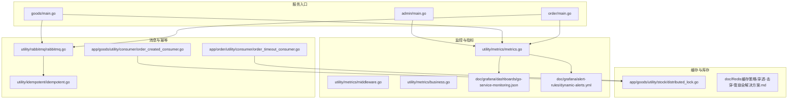
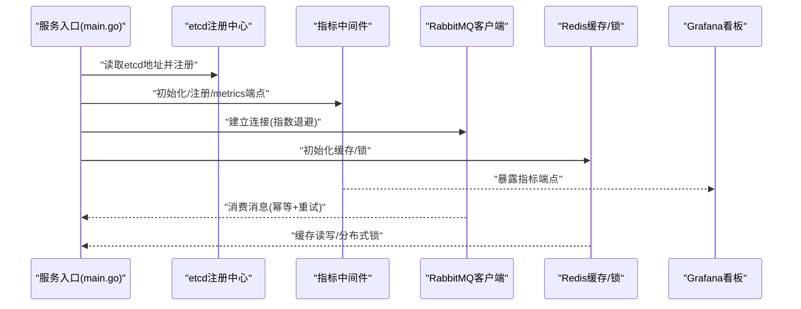
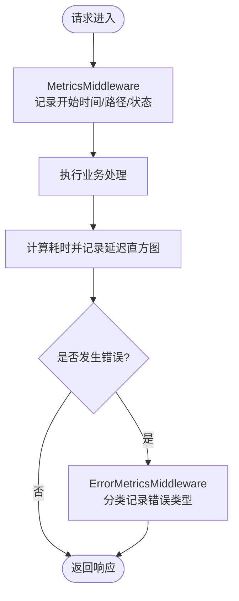
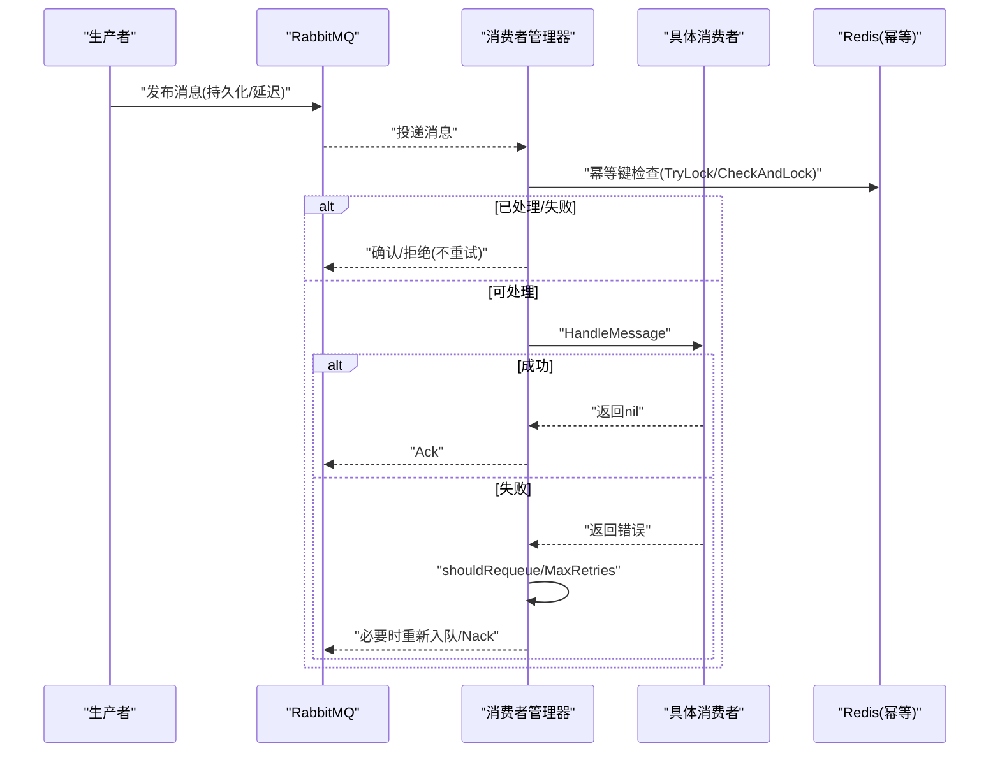
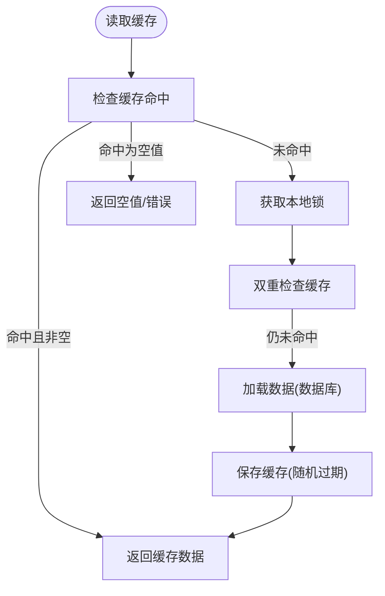
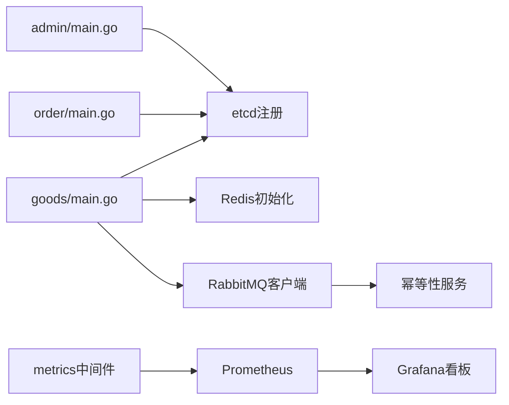

# 故障排查与应急响应

<cite>
**本文引用的文件**
- [app/admin/main.go](file://app/admin/main.go)
- [app/goods/main.go](file://app/goods/main.go)
- [app/order/main.go](file://app/order/main.go)
- [utility/metrics/metrics.go](file://utility/metrics/metrics.go)
- [utility/metrics/middleware.go](file://utility/metrics/middleware.go)
- [utility/metrics/business.go](file://utility/metrics/business.go)
- [utility/rabbitmq/rabbitmq.go](file://utility/rabbitmq/rabbitmq.go)
- [utility/idempotent/idempotent.go](file://utility/idempotent/idempotent.go)
- [app/goods/utility/consumer/order_created_consumer.go](file://app/goods/utility/consumer/order_created_consumer.go)
- [app/order/utility/consumer/order_timeout_consumer.go](file://app/order/utility/consumer/order_timeout_consumer.go)
- [app/goods/utility/stock/distributed_lock.go](file://app/goods/utility/stock/distributed_lock.go)
- [doc/Prometheus指标埋点设计与实现方案.md](file://doc/Prometheus指标埋点设计与实现方案.md)
- [doc/RabbitMQ消息处理优化实战-幂等性与重试策略.md](file://doc/RabbitMQ消息处理优化实战-幂等性与重试策略.md)
- [doc/Redis缓存策略-穿透-击穿-雪崩全解决方案.md](file://doc/Redis缓存策略-穿透-击穿-雪崩全解决方案.md)
- [doc/grafana/dashboards/go-service-monitoring.json](file://doc/grafana/dashboards/go-service-monitoring.json)
- [doc/grafana/alert-rules/dynamic-alerts.yml](file://doc/grafana/alert-rules/dynamic-alerts.yml)
</cite>

## 目录
1. [简介](#简介)
2. [项目结构](#项目结构)
3. [核心组件](#核心组件)
4. [架构总览](#架构总览)
5. [详细组件分析](#详细组件分析)
6. [依赖关系分析](#依赖关系分析)
7. [性能考量](#性能考量)
8. [故障排查指南](#故障排查指南)
9. [结论](#结论)
10. [附录](#附录)

## 简介
本指南面向微服务架构下的故障排查与应急响应，围绕服务不可用、性能下降、数据不一致、网络异常等典型问题，提供可操作的诊断流程、应急预案与恢复策略。文档结合项目中已有的监控指标埋点、日志记录、消息队列幂等与重试、缓存一致性与降级、分布式锁等组件，给出标准化的故障定位与恢复方法，并补充预防与风险控制建议。

## 项目结构
项目采用多模块微服务架构，服务通过 gRPC/HTTP 提供接口，使用 etcd 作为服务注册与发现，Prometheus/Grafana 进行指标采集与可视化，RabbitMQ 实现跨服务解耦与异步处理，Redis 提供缓存与分布式锁能力。关键入口位于各服务的 main.go 文件，监控与中间件集中在 utility/metrics，消息队列与幂等性在 utility/rabbitmq 与 utility/idempotent，缓存与库存在 app/goods 下的 utility 中。

图表来源
- [app/admin/main.go](file://app/admin/main.go#L1-L25)
- [app/goods/main.go](file://app/goods/main.go#L1-L35)
- [app/order/main.go](file://app/order/main.go#L1-L23)
- [utility/metrics/metrics.go](file://utility/metrics/metrics.go#L1-L71)
- [utility/metrics/middleware.go](file://utility/metrics/middleware.go#L1-L62)
- [utility/metrics/business.go](file://utility/metrics/business.go#L1-L70)
- [utility/rabbitmq/rabbitmq.go](file://utility/rabbitmq/rabbitmq.go#L1-L196)
- [utility/idempotent/idempotent.go](file://utility/idempotent/idempotent.go#L1-L153)
- [app/goods/utility/consumer/order_created_consumer.go](file://app/goods/utility/consumer/order_created_consumer.go#L1-L65)
- [app/order/utility/consumer/order_timeout_consumer.go](file://app/order/utility/consumer/order_timeout_consumer.go#L1-L87)
- [app/goods/utility/stock/distributed_lock.go](file://app/goods/utility/stock/distributed_lock.go#L1-L266)
- [doc/grafana/dashboards/go-service-monitoring.json](file://doc/grafana/dashboards/go-service-monitoring.json#L1-L715)
- [doc/grafana/alert-rules/dynamic-alerts.yml](file://doc/grafana/alert-rules/dynamic-alerts.yml#L1-L112)

章节来源
- [app/admin/main.go](file://app/admin/main.go#L1-L25)
- [app/goods/main.go](file://app/goods/main.go#L1-L35)
- [app/order/main.go](file://app/order/main.go#L1-L23)

## 核心组件
- 指标与监控：Prometheus 指标定义、HTTP 中间件、业务指标接口，配合 Grafana 看板与动态阈值告警。
- 消息与幂等：RabbitMQ 客户端封装、指数退避重连、消息幂等与智能重试、最大重试次数控制。
- 缓存与一致性：Redis 缓存策略（空值缓存、本地锁、随机过期抖动）、延迟双删、缓存键管理。
- 分布式锁与库存：基于 Redis 的分布式锁实现，Lua 脚本安全释放，库存增删改查。
- 服务入口与注册：各服务 main.go 通过 etcd 注册与发现，统一启动流程。

章节来源
- [utility/metrics/metrics.go](file://utility/metrics/metrics.go#L1-L71)
- [utility/metrics/middleware.go](file://utility/metrics/middleware.go#L1-L62)
- [utility/metrics/business.go](file://utility/metrics/business.go#L1-L70)
- [utility/rabbitmq/rabbitmq.go](file://utility/rabbitmq/rabbitmq.go#L1-L196)
- [utility/idempotent/idempotent.go](file://utility/idempotent/idempotent.go#L1-L153)
- [app/goods/utility/stock/distributed_lock.go](file://app/goods/utility/stock/distributed_lock.go#L1-L266)
- [doc/Prometheus指标埋点设计与实现方案.md](file://doc/Prometheus指标埋点设计与实现方案.md#L1-L195)
- [doc/RabbitMQ消息处理优化实战-幂等性与重试策略.md](file://doc/RabbitMQ消息处理优化实战-幂等性与重试策略.md#L1-L492)
- [doc/Redis缓存策略-穿透-击穿-雪崩全解决方案.md](file://doc/Redis缓存策略-穿透-击穿-雪崩全解决方案.md#L1-L587)

## 架构总览
下图展示了服务启动、注册、监控、消息与缓存的关键交互路径，以及故障发生时的定位与恢复要点。

图表来源
- [app/admin/main.go](file://app/admin/main.go#L13-L24)
- [app/goods/main.go](file://app/goods/main.go#L15-L34)
- [app/order/main.go](file://app/order/main.go#L12-L22)
- [utility/metrics/metrics.go](file://utility/metrics/metrics.go#L46-L55)
- [utility/rabbitmq/rabbitmq.go](file://utility/rabbitmq/rabbitmq.go#L19-L54)
- [doc/grafana/dashboards/go-service-monitoring.json](file://doc/grafana/dashboards/go-service-monitoring.json#L1-L715)

## 详细组件分析

### 指标与监控组件
- 指标定义：请求总量、请求延迟直方图、服务错误计数；业务指标：订单创建、成功率、库存。
- 中间件：自动记录请求耗时、状态码、路径；错误中间件按状态分类记录错误类型。
- 集成：在服务 main 中初始化指标、注册中间件、暴露 /metrics 端点。
- 可视化：Grafana 看板包含请求速率、错误率、P95/P99 响应时间、CPU 使用、业务指标等面板。
- 告警：动态阈值告警规则，基于历史均值的同比/环比阈值触发。

图表来源
- [utility/metrics/middleware.go](file://utility/metrics/middleware.go#L9-L34)
- [utility/metrics/middleware.go](file://utility/metrics/middleware.go#L36-L61)
- [utility/metrics/metrics.go](file://utility/metrics/metrics.go#L62-L71)

章节来源
- [utility/metrics/metrics.go](file://utility/metrics/metrics.go#L1-L71)
- [utility/metrics/middleware.go](file://utility/metrics/middleware.go#L1-L62)
- [utility/metrics/business.go](file://utility/metrics/business.go#L1-L70)
- [doc/Prometheus指标埋点设计与实现方案.md](file://doc/Prometheus指标埋点设计与实现方案.md#L1-L195)
- [doc/grafana/dashboards/go-service-monitoring.json](file://doc/grafana/dashboards/go-service-monitoring.json#L1-L715)
- [doc/grafana/alert-rules/dynamic-alerts.yml](file://doc/grafana/alert-rules/dynamic-alerts.yml#L1-L112)

### 消息与幂等组件
- 连接与重试：NewRabbitMQ 使用指数退避策略，最大重试时间、最大间隔、随机化因子，避免雪崩。
- 幂等性：基于 Redis SETNX 的幂等键生成与检查，支持 TTL 控制与业务 ID 组合键。
- 智能重试：区分临时/永久错误，结合最大重试次数与消息头 x-retry-count 控制重试。
- 消费者：订单创建、订单超时等消费者示例，处理失败时按策略决定重试或拒绝。

图表来源
- [utility/rabbitmq/rabbitmq.go](file://utility/rabbitmq/rabbitmq.go#L19-L54)
- [utility/idempotent/idempotent.go](file://utility/idempotent/idempotent.go#L35-L85)
- [app/goods/utility/consumer/order_created_consumer.go](file://app/goods/utility/consumer/order_created_consumer.go#L32-L64)
- [app/order/utility/consumer/order_timeout_consumer.go](file://app/order/utility/consumer/order_timeout_consumer.go#L40-L86)

章节来源
- [utility/rabbitmq/rabbitmq.go](file://utility/rabbitmq/rabbitmq.go#L1-L196)
- [utility/idempotent/idempotent.go](file://utility/idempotent/idempotent.go#L1-L153)
- [doc/RabbitMQ消息处理优化实战-幂等性与重试策略.md](file://doc/RabbitMQ消息处理优化实战-幂等性与重试策略.md#L1-L492)
- [app/goods/utility/consumer/order_created_consumer.go](file://app/goods/utility/consumer/order_created_consumer.go#L1-L65)
- [app/order/utility/consumer/order_timeout_consumer.go](file://app/order/utility/consumer/order_timeout_consumer.go#L1-L87)

### 缓存与库存组件
- 缓存策略：空值缓存、本地锁防击穿、随机过期抖动防雪崩、延迟双删保证一致性。
- 分布式锁：基于 Redis 的 SET NX + Lua 脚本释放，保障库存扣减原子性。
- 键管理：统一的缓存键命名规范，便于检索与运维。

图表来源
- [doc/Redis缓存策略-穿透-击穿-雪崩全解决方案.md](file://doc/Redis缓存策略-穿透-击穿-雪崩全解决方案.md#L177-L424)
- [app/goods/utility/stock/distributed_lock.go](file://app/goods/utility/stock/distributed_lock.go#L91-L159)

章节来源
- [doc/Redis缓存策略-穿透-击穿-雪崩全解决方案.md](file://doc/Redis缓存策略-穿透-击穿-雪崩全解决方案.md#L1-L587)
- [app/goods/utility/stock/distributed_lock.go](file://app/goods/utility/stock/distributed_lock.go#L1-L266)

## 依赖关系分析
- 服务入口依赖 etcd 注册与 gRPC 解析器，依赖监控中间件与指标导出。
- 商品服务依赖 Redis 初始化与消费者启动；订单服务依赖 etcd 注册。
- 指标组件被各服务复用，形成统一的可观测性基座。
- 消息组件与幂等组件相互协作，保障跨服务事件处理的可靠性。

图表来源
- [app/admin/main.go](file://app/admin/main.go#L13-L24)
- [app/goods/main.go](file://app/goods/main.go#L15-L34)
- [app/order/main.go](file://app/order/main.go#L12-L22)
- [utility/metrics/metrics.go](file://utility/metrics/metrics.go#L46-L55)
- [utility/rabbitmq/rabbitmq.go](file://utility/rabbitmq/rabbitmq.go#L19-L54)
- [utility/idempotent/idempotent.go](file://utility/idempotent/idempotent.go#L87-L102)

章节来源
- [app/admin/main.go](file://app/admin/main.go#L1-L25)
- [app/goods/main.go](file://app/goods/main.go#L1-L35)
- [app/order/main.go](file://app/order/main.go#L1-L23)
- [utility/metrics/metrics.go](file://utility/metrics/metrics.go#L1-L71)
- [utility/rabbitmq/rabbitmq.go](file://utility/rabbitmq/rabbitmq.go#L1-L196)
- [utility/idempotent/idempotent.go](file://utility/idempotent/idempotent.go#L1-L153)

## 性能考量
- 指标采集：中间件仅记录关键维度，避免高基数标签；直方图桶设置参考默认值，兼顾精度与开销。
- 消息处理：QoS 设置与 PrefetchCount 控制并发；指数退避避免重试风暴；最大重试次数限制防止无限循环。
- 缓存策略：随机过期抖动分散过期高峰；本地锁降低热点击穿概率；延迟双删平衡一致性与时效性。
- 分布式锁：Lua 脚本释放避免误删；锁超时与重试参数需结合业务峰值吞吐调整。

## 故障排查指南

### 一、服务不可用
- 快速定位
  - 检查 /metrics 端点是否可达，确认指标导出正常。
  - 查看 Grafana 看板：请求速率、错误率、CPU 使用率是否异常。
  - 核对 etcd 注册状态，确认服务健康探针与注册信息。
- 隔离范围
  - 通过服务名/实例维度筛选，定位具体实例。
  - 结合错误类型（5xx/4xx）与路径，缩小到具体模块。
- 恢复策略
  - 重启服务或触发滚动更新；若 etcd 异常，检查 etcd 地址配置与网络连通性。
  - 若指标端点异常，检查中间件注册顺序与端口占用。

章节来源
- [utility/metrics/metrics.go](file://utility/metrics/metrics.go#L46-L55)
- [doc/grafana/dashboards/go-service-monitoring.json](file://doc/grafana/dashboards/go-service-monitoring.json#L1-L715)
- [app/admin/main.go](file://app/admin/main.go#L13-L24)
- [app/order/main.go](file://app/order/main.go#L12-L22)

### 二、性能下降
- 快速定位
  - 观察 P95/P99 响应时间面板，识别慢路径。
  - 对比错误率与请求速率，判断是否由外部依赖拖累。
- 隔离范围
  - 按路径/方法聚合，定位热点接口。
  - 检查 CPU 使用率与 goroutine 数量，判断是否存在阻塞或死循环。
- 恢复策略
  - 限流/熔断热点接口；优化数据库/缓存访问路径；增加并发或扩容实例。
  - 结合动态阈值告警，设置短期保护阈值，快速止损。

章节来源
- [doc/grafana/dashboards/go-service-monitoring.json](file://doc/grafana/dashboards/go-service-monitoring.json#L209-L317)
- [doc/grafana/alert-rules/dynamic-alerts.yml](file://doc/grafana/alert-rules/dynamic-alerts.yml#L23-L48)

### 三、数据不一致
- 快速定位
  - 核查业务指标：订单成功率、库存变化是否异常。
  - 检查消息消费日志：是否重复处理、是否达到最大重试次数。
- 隔离范围
  - 订单超时/库存扣减等关键流程，核对幂等键与业务 ID 组合。
  - 核对延迟双删是否生效，确认 Redis 键过期策略。
- 恢复策略
  - 手工补偿：对账并回填库存；对未达最大重试的消息进行人工重放。
  - 修复幂等键生成逻辑，确保业务 ID 正确传递；调整最大重试次数与退避策略。

章节来源
- [utility/idempotent/idempotent.go](file://utility/idempotent/idempotent.go#L81-L85)
- [app/goods/utility/consumer/order_created_consumer.go](file://app/goods/utility/consumer/order_created_consumer.go#L32-L64)
- [app/order/utility/consumer/order_timeout_consumer.go](file://app/order/utility/consumer/order_timeout_consumer.go#L40-L86)
- [doc/Redis缓存策略-穿透-击穿-雪崩全解决方案.md](file://doc/Redis缓存策略-穿透-击穿-雪崩全解决方案.md#L486-L514)

### 四、网络异常
- 快速定位
  - 检查 etcd 连接与解析器注册是否成功。
  - 核查 RabbitMQ 连接日志与指数退避是否生效。
- 隔离范围
  - 通过服务间调用链路定位网络抖动点；区分 DNS/防火墙/负载均衡问题。
- 恢复策略
  - 重试连接（指数退避）；切换 etcd 集群节点；检查 RabbitMQ 集群状态与权限。

章节来源
- [app/admin/main.go](file://app/admin/main.go#L13-L24)
- [app/goods/main.go](file://app/goods/main.go#L15-L34)
- [utility/rabbitmq/rabbitmq.go](file://utility/rabbitmq/rabbitmq.go#L19-L54)

### 五、应急响应预案
- 标准流程
  - 发现告警 → 快速分级 → 定位根因 → 隔离影响 → 临时缓解 → 恢复服务 → 复盘改进。
- 快速处置
  - 限流/熔断 → 降级缓存/禁用非关键功能 → 重启/滚动更新 → 重试/补偿。
- 指标与日志
  - 以 /metrics 与 Grafana 为依据，结合服务日志与消息队列日志进行交叉验证。
- 回滚与演练
  - 保留最近一次稳定版本镜像；定期进行故障演练，验证告警与恢复流程。

章节来源
- [doc/grafana/alert-rules/dynamic-alerts.yml](file://doc/grafana/alert-rules/dynamic-alerts.yml#L1-L112)
- [utility/metrics/metrics.go](file://utility/metrics/metrics.go#L46-L55)

## 结论
通过统一的监控指标、消息幂等与重试、缓存一致性与分布式锁等机制，项目具备了较强的故障自愈与快速恢复能力。建议持续完善告警策略、定期演练与复盘，强化变更管理与容量规划，进一步降低故障发生概率与影响面。

## 附录

### A. 常见故障案例与解决思路
- 案例1：订单超时未支付事件未处理
  - 现象：订单长时间处于待支付状态。
  - 排查：检查订单超时消费者日志、RabbitMQ 延迟队列配置、事件时间戳解析。
  - 解决：修复事件时间戳解析逻辑，确认延迟队列与消费者配置一致。
  
  章节来源
  - [app/order/utility/consumer/order_timeout_consumer.go](file://app/order/utility/consumer/order_timeout_consumer.go#L40-L86)

- 案例2：库存扣减失败导致订单无法完成
  - 现象：订单创建成功但库存未扣减。
  - 排查：检查分布式锁获取与释放、Lua 脚本执行、Redis 连接状态。
  - 解决：确保锁值与释放脚本匹配，增加重试与超时保护。

  章节来源
  - [app/goods/utility/stock/distributed_lock.go](file://app/goods/utility/stock/distributed_lock.go#L66-L89)

- 案例3：缓存穿透导致数据库压力激增
  - 现象：查询不存在的商品ID导致数据库负载飙升。
  - 排查：检查空值缓存是否生效、过期时间是否合理。
  - 解决：启用空值缓存并缩短 TTL，结合布隆过滤器（可选）进一步拦截。

  章节来源
  - [doc/Redis缓存策略-穿透-击穿-雪崩全解决方案.md](file://doc/Redis缓存策略-穿透-击穿-雪崩全解决方案.md#L124-L128)

### B. 监控与告警清单
- 关键指标
  - HTTP 请求速率/状态分布、P95/P99 响应时间、服务错误率、CPU 使用率。
  - 业务指标：订单创建总数/成功率、库存变化。
- 告警规则
  - 动态阈值：错误率/响应时间/CPU/流量/库存/订单量波动异常。
  - 建议学习周期与敏感度：7-14天、中等敏感度起步。

章节来源
- [doc/grafana/dashboards/go-service-monitoring.json](file://doc/grafana/dashboards/go-service-monitoring.json#L68-L715)
- [doc/grafana/alert-rules/dynamic-alerts.yml](file://doc/grafana/alert-rules/dynamic-alerts.yml#L1-L112)