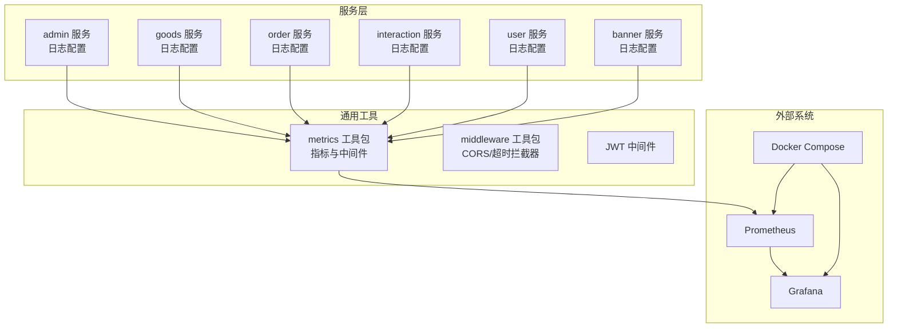
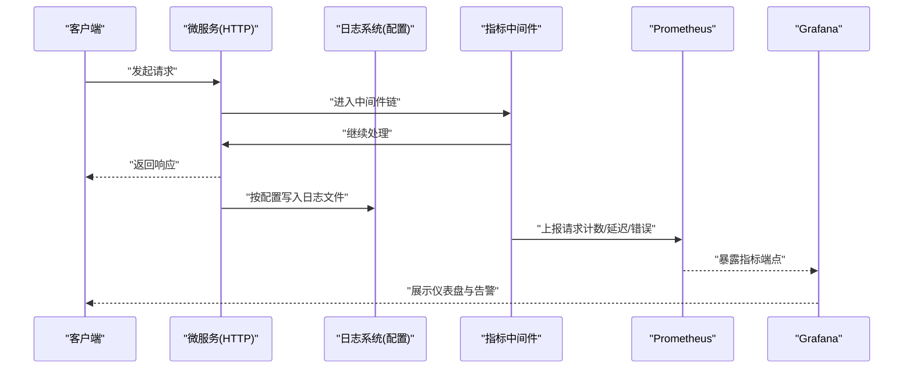
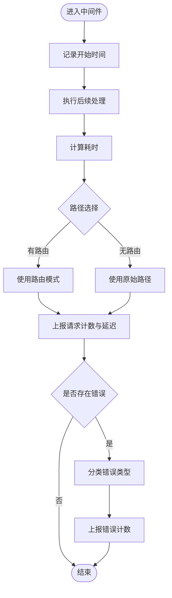
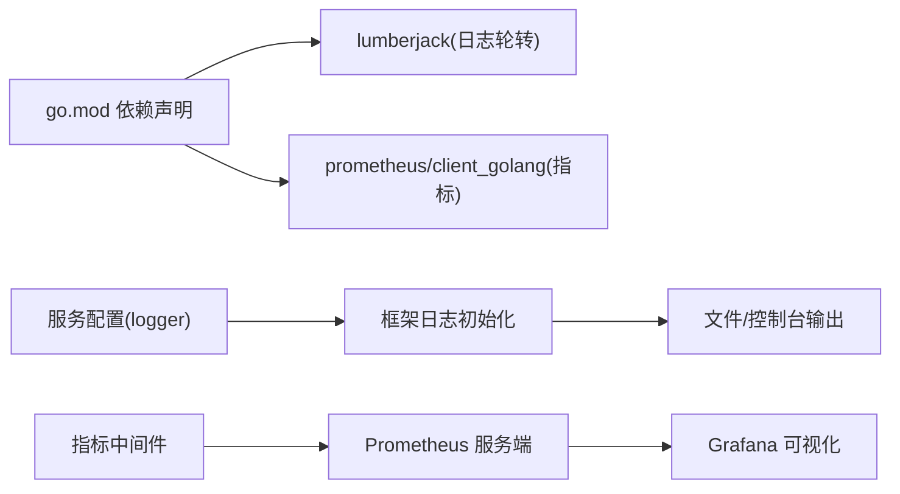

# 日志收集与分析

<cite>
**本文引用的文件**
- [秒杀系统设计方案.md](file://doc/秒杀系统设计方案.md)
- [config.prod.yaml（admin）](file://app/admin/manifest/config/config.prod.yaml)
- [config.prod.yaml（goods）](file://app/goods/manifest/config/config.prod.yaml)
- [config.prod.yaml（order）](file://app/order/manifest/config/config.prod.yaml)
- [config.prod.yaml（interaction）](file://app/interaction/manifest/config/config.prod.yaml)
- [config.prod.yaml（user）](file://app/user/manifest/config/config.prod.yaml)
- [config.prod.yaml（banner）](file://app/banner/manifest/config/config.prod.yaml)
- [go.mod](file://go.mod)
- [metrics.go](file://utility/metrics/metrics.go)
- [middleware.go（metrics）](file://utility/metrics/middleware.go)
- [middleware.go（通用）](file://utility/middleware/middleware.go)
- [jwt.go](file://utility/middleware/jwt.go)
- [docker-compose.yml](file://docker-compose.yml)
- [docker-compose.prod.yml](file://docker-compose.prod.yml)
- [动态告警规则.yml](file://doc/grafana/alert-rules/dynamic-alerts.yml)
- [Grafana监控仪表盘.json](file://doc/grafana/dashboards/go-service-monitoring.json)
</cite>

## 目录
1. [引言](#引言)
2. [项目结构](#项目结构)
3. [核心组件](#核心组件)
4. [架构总览](#架构总览)
5. [详细组件分析](#详细组件分析)
6. [依赖关系分析](#依赖关系分析)
7. [性能考虑](#性能考虑)
8. [故障排查指南](#故障排查指南)
9. [结论](#结论)
10. [附录](#附录)

## 引言
本文件面向微服务日志收集与分析体系，结合仓库中已有的日志配置与指标埋点实践，系统化阐述日志架构设计、中间件日志记录、业务日志输出、错误日志处理、日志格式标准化、日志级别管理、日志轮转策略、日志聚合与存储检索方案、日志分析与性能分析方法，以及日志监控告警与故障诊断流程。目标是帮助开发者在不改变现有实现的前提下，快速落地可运维、可观测的日志体系。

## 项目结构
本项目采用多模块微服务架构，每个服务均通过独立的配置文件定义日志参数，并在通用工具包中提供指标采集中间件。日志配置主要集中在各服务的配置文件中，日志输出与轮转由框架内置能力支持；同时，Prometheus指标与Grafana告警规则为日志分析提供了可观测性基础。

图表来源
- [config.prod.yaml（admin）](file://app/admin/manifest/config/config.prod.yaml#L1-L22)
- [config.prod.yaml（goods）](file://app/goods/manifest/config/config.prod.yaml#L1-L60)
- [config.prod.yaml（order）](file://app/order/manifest/config/config.prod.yaml#L1-L86)
- [config.prod.yaml（interaction）](file://app/interaction/manifest/config/config.prod.yaml#L1-L22)
- [config.prod.yaml（user）](file://app/user/manifest/config/config.prod.yaml#L1-L42)
- [config.prod.yaml（banner）](file://app/banner/manifest/config/config.prod.yaml#L1-L21)
- [metrics.go](file://utility/metrics/metrics.go#L1-L71)
- [middleware.go（metrics）](file://utility/metrics/middleware.go#L1-L62)
- [middleware.go（通用）](file://utility/middleware/middleware.go#L1-L35)
- [docker-compose.yml](file://docker-compose.yml)
- [docker-compose.prod.yml](file://docker-compose.prod.yml)

章节来源
- [config.prod.yaml（admin）](file://app/admin/manifest/config/config.prod.yaml#L1-L22)
- [config.prod.yaml（goods）](file://app/goods/manifest/config/config.prod.yaml#L1-L60)
- [config.prod.yaml（order）](file://app/order/manifest/config/config.prod.yaml#L1-L86)
- [config.prod.yaml（interaction）](file://app/interaction/manifest/config/config.prod.yaml#L1-L22)
- [config.prod.yaml（user）](file://app/user/manifest/config/config.prod.yaml#L1-L42)
- [config.prod.yaml（banner）](file://app/banner/manifest/config/config.prod.yaml#L1-L21)
- [metrics.go](file://utility/metrics/metrics.go#L1-L71)
- [middleware.go（metrics）](file://utility/metrics/middleware.go#L1-L62)
- [middleware.go（通用）](file://utility/middleware/middleware.go#L1-L35)
- [docker-compose.yml](file://docker-compose.yml)
- [docker-compose.prod.yml](file://docker-compose.prod.yml)

## 核心组件
- 日志配置与轮转
  - 各服务通过配置文件统一声明日志路径、文件名模板、级别、是否输出到标准输出、轮转大小与备份数量、上下文键（如 traceId）、时间格式等关键参数。
  - 示例：服务配置中的 logger 字段包含 path、file、prefix、level、stdout、rotateSize、rotateBackupLimit、ctxKeys、timeFormat 等键位。
- 框架日志初始化
  - 文档中提供了基于框架的初始化示例，展示如何设置控制台与文件输出、错误日志与运行时日志的差异化配置，以及文件大小、保留天数、压缩等轮转参数。
- 指标与中间件
  - 提供 HTTP 请求计数、延迟分布与错误计数的指标定义与中间件封装，用于将日志与指标打通，便于统一分析与告警。
- CORS 与 gRPC 超时拦截器
  - 提供跨域与客户端调用超时控制，保障日志与指标采集的稳定性。

章节来源
- [秒杀系统设计方案.md](file://doc/秒杀系统设计方案.md#L3752-L3803)
- [config.prod.yaml（admin）](file://app/admin/manifest/config/config.prod.yaml#L4-L13)
- [config.prod.yaml（goods）](file://app/goods/manifest/config/config.prod.yaml#L4-L13)
- [config.prod.yaml（order）](file://app/order/manifest/config/config.prod.yaml#L4-L13)
- [config.prod.yaml（interaction）](file://app/interaction/manifest/config/config.prod.yaml#L4-L13)
- [config.prod.yaml（user）](file://app/user/manifest/config/config.prod.yaml#L4-L13)
- [config.prod.yaml（banner）](file://app/banner/manifest/config/config.prod.yaml#L4-L13)
- [metrics.go](file://utility/metrics/metrics.go#L14-L43)
- [middleware.go（metrics）](file://utility/metrics/middleware.go#L9-L34)
- [middleware.go（通用）](file://utility/middleware/middleware.go#L10-L34)

## 架构总览
下图展示了日志从服务侧产生、经由配置落盘与轮转，再到指标采集与可视化监控的整体流程。

图表来源
- [metrics.go](file://utility/metrics/metrics.go#L45-L55)
- [middleware.go（metrics）](file://utility/metrics/middleware.go#L9-L34)
- [config.prod.yaml（admin）](file://app/admin/manifest/config/config.prod.yaml#L4-L13)
- [docker-compose.yml](file://docker-compose.yml)
- [docker-compose.prod.yml](file://docker-compose.prod.yml)

## 详细组件分析

### 日志配置与轮转策略
- 配置要点
  - 日志路径与文件模板：path 与 file，支持日期模板与前缀 prefix，便于按服务与日期归档。
  - 输出级别与标准输出：level 与 stdout，便于开发与生产环境差异化输出。
  - 上下文键与时间格式：ctxKeys 与 timeFormat，便于日志关联与可读性。
  - 轮转参数：rotateSize（字节）与 rotateBackupLimit（备份数），确保磁盘空间可控。
- 实施建议
  - 统一服务命名前缀，便于日志聚合与检索。
  - 生产环境建议关闭 stdout，避免容器日志重复。
  - 合理设置轮转大小与备份数，结合存储容量规划。

章节来源
- [config.prod.yaml（admin）](file://app/admin/manifest/config/config.prod.yaml#L4-L13)
- [config.prod.yaml（goods）](file://app/goods/manifest/config/config.prod.yaml#L4-L13)
- [config.prod.yaml（order）](file://app/order/manifest/config/config.prod.yaml#L4-L13)
- [config.prod.yaml（interaction）](file://app/interaction/manifest/config/config.prod.yaml#L4-L13)
- [config.prod.yaml（user）](file://app/user/manifest/config/config.prod.yaml#L4-L13)
- [config.prod.yaml（banner）](file://app/banner/manifest/config/config.prod.yaml#L4-L13)

### 框架日志初始化与差异化配置
- 初始化方式
  - 通过框架提供的日志接口设置控制台与文件输出，支持错误日志与运行时日志的差异化配置。
  - 支持文件大小上限、保留天数、压缩等轮转参数，确保长期稳定运行。
- 与服务配置的关系
  - 服务配置文件中的 logger 字段与框架初始化配置相辅相成，前者决定输出位置与格式，后者决定轮转与级别。

章节来源
- [秒杀系统设计方案.md](file://doc/秒杀系统设计方案.md#L3752-L3803)

### 中间件日志记录与指标采集
- HTTP 中间件
  - MetricsMiddleware：记录请求方法、路径、状态码与耗时，自动更新请求计数与延迟直方图。
  - ErrorMetricsMiddleware：在出现错误时，根据状态码分类错误类型并上报错误计数。
- 指标注册
  - 通过 ghttp 服务器注册 /metrics 端点，Prometheus 抓取后进行聚合分析。
- 关联上下文
  - 结合 ctxKeys（如 traceId）可在日志与指标中建立统一追踪线索。

图表来源
- [middleware.go（metrics）](file://utility/metrics/middleware.go#L9-L34)
- [middleware.go（metrics）](file://utility/metrics/middleware.go#L36-L61)
- [metrics.go](file://utility/metrics/metrics.go#L45-L55)

章节来源
- [middleware.go（metrics）](file://utility/metrics/middleware.go#L9-L34)
- [middleware.go（metrics）](file://utility/metrics/middleware.go#L36-L61)
- [metrics.go](file://utility/metrics/metrics.go#L14-L43)
- [metrics.go](file://utility/metrics/metrics.go#L45-L55)

### 业务日志输出与错误日志处理
- 业务日志
  - 建议在业务关键节点输出结构化日志，包含 traceId、服务名、操作、参数摘要、结果状态等字段，便于问题定位与审计。
- 错误日志
  - 对于 4xx/5xx 错误，结合 ErrorMetricsMiddleware 自动统计错误类型与服务维度，辅助故障分析。
- JWT 与鉴权
  - JWTAuth 中间件负责鉴权失败场景的日志与错误返回，可配合指标统计鉴权失败率。

章节来源
- [jwt.go](file://utility/middleware/jwt.go#L16-L37)
- [middleware.go（metrics）](file://utility/metrics/middleware.go#L36-L61)

### 日志格式标准化与级别管理
- 格式标准化
  - 统一时间格式与上下文键（如 traceId），确保跨服务日志可串联。
  - 建议采用结构化 JSON 输出，便于下游解析与检索。
- 级别管理
  - 开发环境可设为较低级别以便调试；生产环境建议提升到 info 或更高，减少噪声。
  - 对错误日志单独配置文件，便于独立轮转与告警。

章节来源
- [config.prod.yaml（admin）](file://app/admin/manifest/config/config.prod.yaml#L4-L13)
- [config.prod.yaml（goods）](file://app/goods/manifest/config/config.prod.yaml#L4-L13)
- [config.prod.yaml（order）](file://app/order/manifest/config/config.prod.yaml#L4-L13)
- [config.prod.yaml（interaction）](file://app/interaction/manifest/config/config.prod.yaml#L4-L13)
- [config.prod.yaml（user）](file://app/user/manifest/config/config.prod.yaml#L4-L13)
- [config.prod.yaml（banner）](file://app/banner/manifest/config/config.prod.yaml#L4-L13)

### 日志轮转策略
- 参数说明
  - rotateSize：单文件最大大小（字节），超过则滚动。
  - rotateBackupLimit：保留的备份数量，超出按时间淘汰。
- 建议
  - 结合服务吞吐量与磁盘容量设定合理阈值；对高频服务适当减小轮转大小以降低单文件体积。
  - 生产环境开启压缩，进一步节省空间。

章节来源
- [config.prod.yaml（admin）](file://app/admin/manifest/config/config.prod.yaml#L10-L11)
- [config.prod.yaml（goods）](file://app/goods/manifest/config/config.prod.yaml#L10-L11)
- [config.prod.yaml（order）](file://app/order/manifest/config/config.prod.yaml#L10-L11)
- [config.prod.yaml（interaction）](file://app/interaction/manifest/config/config.prod.yaml#L10-L11)
- [config.prod.yaml（user）](file://app/user/manifest/config/config.prod.yaml#L10-L11)
- [config.prod.yaml（banner）](file://app/banner/manifest/config/config.prod.yaml#L10-L11)

### 日志收集管道与存储检索
- 收集与聚合
  - 容器日志目录映射到宿主机或集中式日志系统，结合日志文件轮转策略进行采集。
  - 建议使用结构化 JSON 输出，便于下游解析与过滤。
- 存储与检索
  - 可将日志导入集中式存储（如对象存储或日志平台），并建立索引以便检索。
  - 对高频错误与异常日志建立专门索引，提高检索效率。
- 指标联动
  - 将日志中的错误事件与 Prometheus 指标联动，形成“日志+指标”的双视角分析。

章节来源
- [docker-compose.yml](file://docker-compose.yml)
- [docker-compose.prod.yml](file://docker-compose.prod.yml)

### 日志分析方法与性能分析
- 常见模式识别
  - 通过错误类型与服务维度统计，识别热点错误与异常趋势。
  - 结合 traceId 关联请求链路，定位慢调用与失败根因。
- 性能分析
  - 利用延迟直方图观察 P50/P95/P99 耗时变化，识别性能退化。
  - 结合请求计数与错误计数，评估变更影响与回归风险。

章节来源
- [metrics.go](file://utility/metrics/metrics.go#L14-L43)
- [middleware.go（metrics）](file://utility/metrics/middleware.go#L9-L34)

### 监控告警与故障诊断流程
- 监控与告警
  - Grafana 仪表盘展示关键指标，动态告警规则根据阈值触发。
  - 建议针对错误率、延迟、请求量等关键指标设置阈值与静默窗口。
- 故障诊断
  - 以 traceId 为主线，结合日志与指标回溯请求链路。
  - 快速定位错误类型与发生时间，缩小排查范围。

章节来源
- [Grafana监控仪表盘.json](file://doc/grafana/dashboards/go-service-monitoring.json)
- [动态告警规则.yml](file://doc/grafana/alert-rules/dynamic-alerts.yml)

## 依赖关系分析
- 外部依赖
  - 日志轮转：依赖第三方库（如 lumberjack）实现文件滚动与压缩。
  - 指标采集：依赖 Prometheus 客户端与 HTTP 处理器。
  - 日志格式：建议采用结构化输出，便于下游解析。
- 内部耦合
  - 服务配置文件与框架日志初始化存在强关联，需保持一致的键位与语义。
  - 指标中间件与 HTTP 服务器紧密耦合，需确保 /metrics 端点可用。

图表来源
- [go.mod](file://go.mod#L52-L52)
- [go.mod](file://go.mod#L14-L14)
- [config.prod.yaml（admin）](file://app/admin/manifest/config/config.prod.yaml#L4-L13)
- [秒杀系统设计方案.md](file://doc/秒杀系统设计方案.md#L3752-L3803)
- [metrics.go](file://utility/metrics/metrics.go#L45-L55)

章节来源
- [go.mod](file://go.mod#L52-L52)
- [go.mod](file://go.mod#L14-L14)
- [config.prod.yaml（admin）](file://app/admin/manifest/config/config.prod.yaml#L4-L13)
- [秒杀系统设计方案.md](file://doc/秒杀系统设计方案.md#L3752-L3803)
- [metrics.go](file://utility/metrics/metrics.go#L45-L55)

## 性能考虑
- 日志写入
  - 控制日志级别与输出频率，避免在高并发场景下成为瓶颈。
  - 使用异步写入或批量刷盘策略，减少阻塞。
- 轮转与压缩
  - 合理设置轮转大小与备份数，避免频繁滚动造成 IO 峰值。
  - 启用压缩可显著降低磁盘占用，但会增加 CPU 开销。
- 指标开销
  - 路径标签应避免高基数，建议使用路由模式而非完整 URL。
  - 采样策略可用于极端高流量场景，平衡精度与成本。

## 故障排查指南
- 常见问题
  - 日志不落盘：检查 stdout 与 path 配置，确认容器挂载与权限。
  - 日志过大：调整 rotateSize 与 rotateBackupLimit，必要时启用压缩。
  - 指标缺失：确认 /metrics 端点是否注册，Prometheus 抓取是否正常。
- 排查步骤
  - 以 traceId 串联日志与指标，定位异常发生的时间窗口与调用链。
  - 分析错误类型分布与趋势，结合业务变更点判断根因。
  - 对比不同环境配置差异，复现问题并验证修复。

章节来源
- [middleware.go（metrics）](file://utility/metrics/middleware.go#L36-L61)
- [metrics.go](file://utility/metrics/metrics.go#L45-L55)
- [config.prod.yaml（admin）](file://app/admin/manifest/config/config.prod.yaml#L4-L13)

## 结论
本项目已在服务配置层面实现了统一的日志参数管理，并通过框架初始化与指标中间件形成了“日志+指标”的可观测闭环。建议在此基础上完善结构化日志输出、强化错误分类与告警联动，并持续优化轮转与压缩策略，以满足生产环境的稳定性与可维护性要求。

## 附录
- 配置键位参考
  - path：日志输出路径
  - file：文件名模板（支持日期）
  - prefix：服务名前缀
  - level：日志级别
  - stdout：是否输出到标准输出
  - rotateSize：单文件最大大小（字节）
  - rotateBackupLimit：备份数量
  - ctxKeys：上下文键（如 traceId）
  - timeFormat：时间格式
- 指标键位参考
  - http_requests_total：请求计数（method、path、status）
  - http_request_duration_seconds：请求延迟（method、path、status）
  - service_errors_total：错误计数（error_type、service）