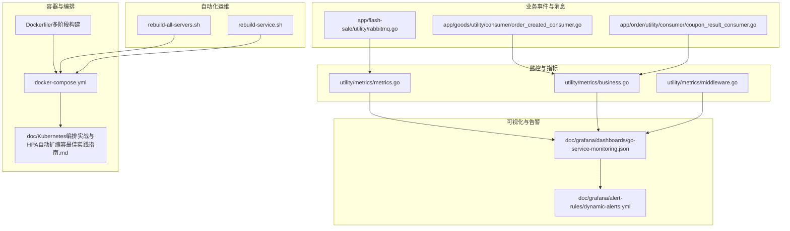
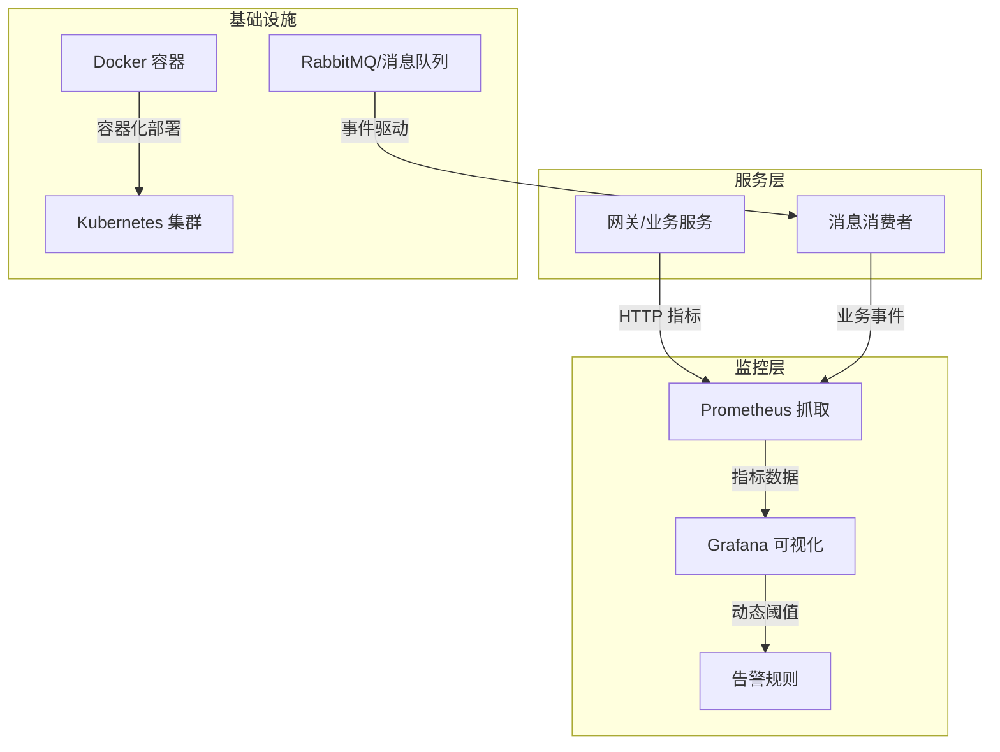
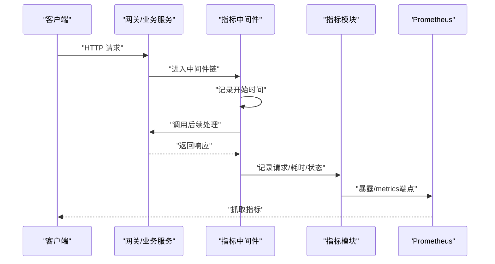
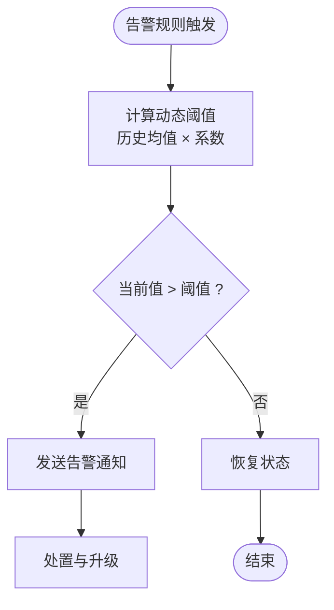
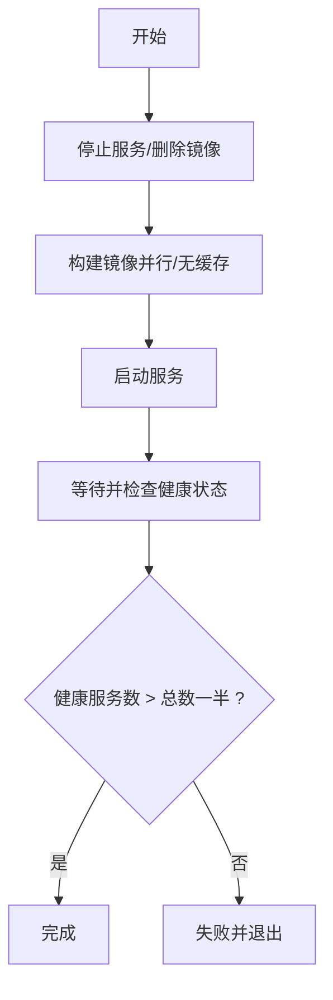
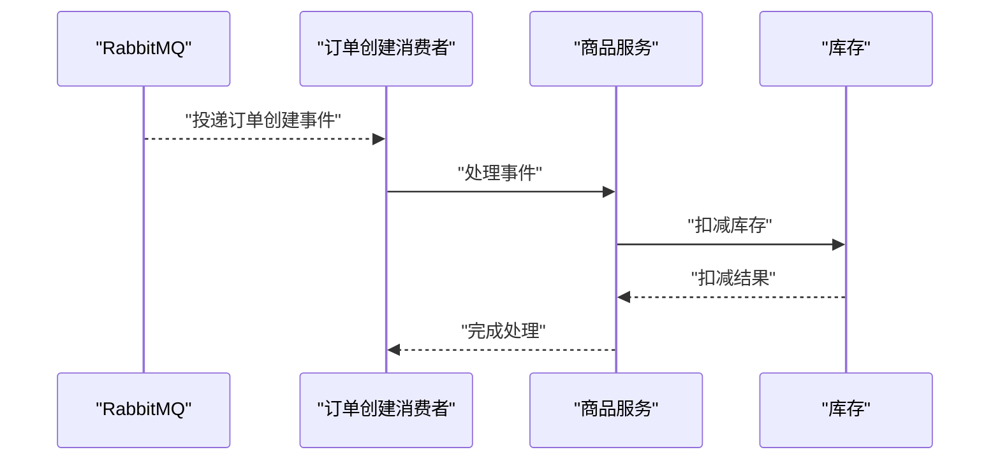

# 监控与运维

<cite>
**本文引用的文件**
- [utility/metrics/metrics.go](file://utility/metrics/metrics.go)
- [utility/metrics/business.go](file://utility/metrics/business.go)
- [utility/metrics/middleware.go](file://utility/metrics/middleware.go)
- [doc/Prometheus指标埋点设计与实现方案.md](file://doc/Prometheus指标埋点设计与实现方案.md)
- [doc/grafana/dashboards/go-service-monitoring.json](file://doc/grafana/dashboards/go-service-monitoring.json)
- [doc/grafana/alert-rules/dynamic-alerts.yml](file://doc/grafana/alert-rules/dynamic-alerts.yml)
- [doc/Kubernetes编排实战与HPA自动扩缩容最佳实践指南.md](file://doc/Kubernetes编排实战与HPA自动扩缩容最佳实践指南.md)
- [doc/Docker多阶段构建与Alpine镜像优化实践指南.md](file://doc/Docker多阶段构建与Alpine镜像优化实践指南.md)
- [docker-compose.yml](file://docker-compose.yml)
- [app/goods/manifest/config/config.prod.yaml](file://app/goods/manifest/config/config.prod.yaml)
- [app/order/manifest/config/config.prod.yaml](file://app/order/manifest/config/config.prod.yaml)
- [app/gateway-h5/manifest/config/config.prod.yaml](file://app/gateway-h5/manifest/config/config.prod.yaml)
- [rebuild-all-servers.sh](file://rebuild-all-servers.sh)
- [rebuild-service.sh](file://rebuild-service.sh)
- [app/goods/utility/consumer/order_created_consumer.go](file://app/goods/utility/consumer/order_created_consumer.go)
- [app/order/utility/consumer/coupon_result_consumer.go](file://app/order/utility/consumer/coupon_result_consumer.go)
- [app/flash-sale/utility/rabbitmq.go](file://app/flash-sale/utility/rabbitmq.go)
</cite>

## 目录
1. [简介](#简介)
2. [项目结构](#项目结构)
3. [核心组件](#核心组件)
4. [架构总览](#架构总览)
5. [详细组件分析](#详细组件分析)
6. [依赖分析](#依赖分析)
7. [性能考量](#性能考量)
8. [故障排查指南](#故障排查指南)
9. [结论](#结论)
10. [附录](#附录)

## 简介
本文件面向监控与运维团队，系统化梳理本微服务项目的监控与运维体系，涵盖 Prometheus 指标采集（业务指标、系统指标、自定义指标）、Grafana 仪表板与告警、日志与消息队列、性能监控与容量规划、容器化与编排（Docker/Kubernetes）及自动化运维流程，并提供故障排查与应急响应建议。

## 项目结构
围绕监控与运维的关键目录与文件：
- 指标采集与中间件：utility/metrics
- Grafana 仪表板与告警：doc/grafana
- 容器化与编排：doc、docker-compose.yml、各服务 manifest
- 自动化运维脚本：rebuild-all-servers.sh、rebuild-service.sh
- 业务事件与消息队列：app/*/utility/consumer、app/*/utility/rabbitmq.go

图表来源
- [utility/metrics/metrics.go](file://utility/metrics/metrics.go#L1-L71)
- [utility/metrics/business.go](file://utility/metrics/business.go#L1-L70)
- [utility/metrics/middleware.go](file://utility/metrics/middleware.go#L1-L62)
- [doc/grafana/dashboards/go-service-monitoring.json](file://doc/grafana/dashboards/go-service-monitoring.json#L1-L715)
- [doc/grafana/alert-rules/dynamic-alerts.yml](file://doc/grafana/alert-rules/dynamic-alerts.yml#L1-L112)
- [docker-compose.yml](file://docker-compose.yml#L1-L355)
- [doc/Kubernetes编排实战与HPA自动扩缩容最佳实践指南.md](file://doc/Kubernetes编排实战与HPA自动扩缩容最佳实践指南.md#L1-L288)
- [doc/Docker多阶段构建与Alpine镜像优化实践指南.md](file://doc/Docker多阶段构建与Alpine镜像优化实践指南.md#L1-L282)
- [rebuild-all-servers.sh](file://rebuild-all-servers.sh#L1-L129)
- [rebuild-service.sh](file://rebuild-service.sh#L1-L543)
- [app/goods/utility/consumer/order_created_consumer.go](file://app/goods/utility/consumer/order_created_consumer.go#L1-L65)
- [app/order/utility/consumer/coupon_result_consumer.go](file://app/order/utility/consumer/coupon_result_consumer.go#L1-L54)
- [app/flash-sale/utility/rabbitmq.go](file://app/flash-sale/utility/rabbitmq.go#L1-L132)

章节来源
- [docker-compose.yml](file://docker-compose.yml#L1-L355)
- [doc/Kubernetes编排实战与HPA自动扩缩容最佳实践指南.md](file://doc/Kubernetes编排实战与HPA自动扩缩容最佳实践指南.md#L1-L288)
- [doc/Docker多阶段构建与Alpine镜像优化实践指南.md](file://doc/Docker多阶段构建与Alpine镜像优化实践指南.md#L1-L282)

## 核心组件
- 指标采集与中间件
  - 基础指标：请求总量、请求耗时直方图、服务错误计数
  - 业务指标：订单创建计数/成功率、库存指标
  - 中间件：自动记录请求与错误指标
- Grafana 仪表板与告警
  - 面向 HTTP、业务、系统资源的可视化面板
  - 动态阈值告警规则，支持历史基线对比
- 容器化与编排
  - Docker 多阶段构建与 Alpine 镜像优化
  - docker-compose 快速本地编排
  - Kubernetes HPA 自动扩缩容最佳实践
- 自动化运维
  - 一键重建与健康检查脚本
- 事件与消息
  - 订单/优惠券等事件消费，联动业务指标

章节来源
- [utility/metrics/metrics.go](file://utility/metrics/metrics.go#L1-L71)
- [utility/metrics/business.go](file://utility/metrics/business.go#L1-L70)
- [utility/metrics/middleware.go](file://utility/metrics/middleware.go#L1-L62)
- [doc/grafana/dashboards/go-service-monitoring.json](file://doc/grafana/dashboards/go-service-monitoring.json#L1-L715)
- [doc/grafana/alert-rules/dynamic-alerts.yml](file://doc/grafana/alert-rules/dynamic-alerts.yml#L1-L112)
- [doc/Docker多阶段构建与Alpine镜像优化实践指南.md](file://doc/Docker多阶段构建与Alpine镜像优化实践指南.md#L1-L282)
- [doc/Kubernetes编排实战与HPA自动扩缩容最佳实践指南.md](file://doc/Kubernetes编排实战与HPA自动扩缩容最佳实践指南.md#L1-L288)
- [rebuild-all-servers.sh](file://rebuild-all-servers.sh#L1-L129)
- [rebuild-service.sh](file://rebuild-service.sh#L1-L543)

## 架构总览
监控与运维整体架构由“指标采集—数据存储—可视化与告警—自动化运维—容器与编排”构成。

图表来源
- [utility/metrics/metrics.go](file://utility/metrics/metrics.go#L1-L71)
- [utility/metrics/business.go](file://utility/metrics/business.go#L1-L70)
- [doc/grafana/dashboards/go-service-monitoring.json](file://doc/grafana/dashboards/go-service-monitoring.json#L1-L715)
- [doc/grafana/alert-rules/dynamic-alerts.yml](file://doc/grafana/alert-rules/dynamic-alerts.yml#L1-L112)
- [docker-compose.yml](file://docker-compose.yml#L1-L355)
- [app/goods/utility/consumer/order_created_consumer.go](file://app/goods/utility/consumer/order_created_consumer.go#L1-L65)
- [app/order/utility/consumer/coupon_result_consumer.go](file://app/order/utility/consumer/coupon_result_consumer.go#L1-L54)

## 详细组件分析

### 指标采集与埋点策略
- 基础指标
  - http_requests_total：按方法、路径、状态码聚合
  - http_request_duration_seconds：按方法、路径的耗时分布
  - service_errors_total：按错误类型、服务聚合
- 业务指标
  - business_order_create_total：订单创建成功/失败计数
  - business_order_success_ratio：订单成功率
  - business_inventory_count：商品库存
- 中间件
  - MetricsMiddleware：自动记录请求耗时与状态
  - ErrorMetricsMiddleware：自动记录错误类型与服务名

图表来源
- [utility/metrics/middleware.go](file://utility/metrics/middleware.go#L1-L62)
- [utility/metrics/metrics.go](file://utility/metrics/metrics.go#L1-L71)

章节来源
- [utility/metrics/metrics.go](file://utility/metrics/metrics.go#L1-L71)
- [utility/metrics/business.go](file://utility/metrics/business.go#L1-L70)
- [utility/metrics/middleware.go](file://utility/metrics/middleware.go#L1-L62)
- [doc/Prometheus指标埋点设计与实现方案.md](file://doc/Prometheus指标埋点设计与实现方案.md#L1-L195)

### Grafana 仪表板与告警
- 仪表板
  - HTTP 请求速率（按状态码）
  - 服务错误率（按错误类型与服务）
  - 请求响应时间（P95/P99/Avg）
  - CPU 使用率
  - 订单创建统计与成功率
  - 库存监控
- 告警
  - 动态阈值：基于历史均值×系数的异常检测
  - 时间维度：支持工作日/周末差异与时序学习周期
  - 类型：错误率、响应时间、CPU、流量波动、库存/订单量异常

图表来源
- [doc/grafana/alert-rules/dynamic-alerts.yml](file://doc/grafana/alert-rules/dynamic-alerts.yml#L1-L112)
- [doc/grafana/dashboards/go-service-monitoring.json](file://doc/grafana/dashboards/go-service-monitoring.json#L1-L715)

章节来源
- [doc/grafana/dashboards/go-service-monitoring.json](file://doc/grafana/dashboards/go-service-monitoring.json#L1-L715)
- [doc/grafana/alert-rules/dynamic-alerts.yml](file://doc/grafana/alert-rules/dynamic-alerts.yml#L1-L112)

### 日志收集与分析
- 日志配置
  - 服务侧日志：按日期轮转、大小限制、控制台输出、上下文键 traceId
  - 网关侧日志：统一路径与格式
- 建议
  - 使用集中式日志（如 ELK/EFK）采集容器日志
  - 为关键业务事件打上 traceId，便于链路追踪
  - 结合消息队列日志，定位事件投递与消费异常

章节来源
- [app/goods/manifest/config/config.prod.yaml](file://app/goods/manifest/config/config.prod.yaml#L1-L60)
- [app/order/manifest/config/config.prod.yaml](file://app/order/manifest/config/config.prod.yaml#L1-L86)
- [app/gateway-h5/manifest/config/config.prod.yaml](file://app/gateway-h5/manifest/config/config.prod.yaml#L1-L18)

### 告警规则配置
- 动态阈值告警
  - 错误率异常：基于历史均值×1.5
  - 响应时间异常：P95 超过历史均值×1.8
  - CPU 使用率异常：超过历史均值×1.3
  - 流量波动：请求量低于历史均值×0.5
  - 业务指标异常：库存/订单量变化幅度异常
- 告警注解与标签
  - 包含摘要、描述、严重级别、阈值类型
  - 建议配置静默窗口与抑制关系，避免风暴

章节来源
- [doc/grafana/alert-rules/dynamic-alerts.yml](file://doc/grafana/alert-rules/dynamic-alerts.yml#L1-L112)

### 性能监控与容量规划
- 指标关注
  - QPS/响应时间（P50/P95/P99）、错误率、CPU/内存使用率
  - 业务指标：订单成功率、库存变化、活动峰值下的吞吐
- 容量规划
  - 基于历史峰值与增长趋势设定资源请求/限制
  - HPA：CPU/内存利用率与业务指标（如 QPS）双轨策略
  - 网关与核心服务优先保障资源冗余

章节来源
- [doc/Kubernetes编排实战与HPA自动扩缩容最佳实践指南.md](file://doc/Kubernetes编排实战与HPA自动扩缩容最佳实践指南.md#L1-L288)

### Docker 容器化与镜像优化
- 多阶段构建
  - 构建阶段：golang:alpine + go mod download + go build
  - 运行阶段：alpine + 仅复制二进制与必要配置
- 镜像优化
  - Alpine 基础镜像、--no-cache 安装、仅包含必要文件
- 实际效果
  - 显著减小镜像体积、提升构建与部署效率、增强安全性

章节来源
- [doc/Docker多阶段构建与Alpine镜像优化实践指南.md](file://doc/Docker多阶段构建与Alpine镜像优化实践指南.md#L1-L282)
- [docker-compose.yml](file://docker-compose.yml#L1-L355)

### Kubernetes 编排与自动化运维
- 编排要点
  - Deployment：资源请求/限制、健康检查（liveness/readiness）
  - Service：ClusterIP/NodePort/LoadBalancer 选择
  - ConfigMap/Secret：配置与密钥分离
  - HPA：CPU/内存利用率与业务指标双轨
- 自动化脚本
  - rebuild-all-servers.sh：一键停止/删除镜像/重建/启动/健康检查
  - rebuild-service.sh：单服务/全量重建，带日志与健康检查

图表来源
- [rebuild-all-servers.sh](file://rebuild-all-servers.sh#L1-L129)
- [rebuild-service.sh](file://rebuild-service.sh#L1-L543)

章节来源
- [doc/Kubernetes编排实战与HPA自动扩缩容最佳实践指南.md](file://doc/Kubernetes编排实战与HPA自动扩缩容最佳实践指南.md#L1-L288)
- [rebuild-all-servers.sh](file://rebuild-all-servers.sh#L1-L129)
- [rebuild-service.sh](file://rebuild-service.sh#L1-L543)

### 事件与消息队列
- 订单创建事件消费者：从购物车移除商品、扣减库存
- 优惠券确认结果消费者：处理优惠券确认结果
- 秒杀消息：声明交换机/队列并发布持久化消息

图表来源
- [app/goods/utility/consumer/order_created_consumer.go](file://app/goods/utility/consumer/order_created_consumer.go#L1-L65)
- [app/order/utility/consumer/coupon_result_consumer.go](file://app/order/utility/consumer/coupon_result_consumer.go#L1-L54)
- [app/flash-sale/utility/rabbitmq.go](file://app/flash-sale/utility/rabbitmq.go#L1-L132)

章节来源
- [app/goods/utility/consumer/order_created_consumer.go](file://app/goods/utility/consumer/order_created_consumer.go#L1-L65)
- [app/order/utility/consumer/coupon_result_consumer.go](file://app/order/utility/consumer/coupon_result_consumer.go#L1-L54)
- [app/flash-sale/utility/rabbitmq.go](file://app/flash-sale/utility/rabbitmq.go#L1-L132)

## 依赖分析
- 指标模块依赖
  - Prometheus 客户端库：定义 Counter/Histogram/Gauge
  - ghttp 中间件：自动采集请求指标
- 业务事件与指标耦合
  - 订单/库存事件消费路径与业务指标更新强相关
- 可视化与告警依赖
  - Grafana 面板依赖 Prometheus 查询表达式
  - 动态阈值依赖长期历史数据学习

图表来源
- [utility/metrics/metrics.go](file://utility/metrics/metrics.go#L1-L71)
- [utility/metrics/business.go](file://utility/metrics/business.go#L1-L70)
- [doc/grafana/dashboards/go-service-monitoring.json](file://doc/grafana/dashboards/go-service-monitoring.json#L1-L715)
- [doc/grafana/alert-rules/dynamic-alerts.yml](file://doc/grafana/alert-rules/dynamic-alerts.yml#L1-L112)
- [app/goods/utility/consumer/order_created_consumer.go](file://app/goods/utility/consumer/order_created_consumer.go#L1-L65)

章节来源
- [utility/metrics/metrics.go](file://utility/metrics/metrics.go#L1-L71)
- [utility/metrics/business.go](file://utility/metrics/business.go#L1-L70)
- [utility/metrics/middleware.go](file://utility/metrics/middleware.go#L1-L62)
- [doc/grafana/dashboards/go-service-monitoring.json](file://doc/grafana/dashboards/go-service-monitoring.json#L1-L715)
- [doc/grafana/alert-rules/dynamic-alerts.yml](file://doc/grafana/alert-rules/dynamic-alerts.yml#L1-L112)

## 性能考量
- 指标采集开销
  - Histogram 分桶数量与标签基数控制，避免高基数标签
  - 中间件链路尽量短，避免重复计算
- 容器与编排
  - 合理设置 requests/limits，避免 OOM/饥饿
  - HPA 稳定窗口与步长，防止抖动
- 日志与事件
  - 控制日志级别与轮转，避免磁盘 IO 压力
  - 消息队列幂等与重试策略，避免重复消费

## 故障排查指南
- 指标不可见
  - 检查服务是否注册 /metrics 端点
  - 检查 Prometheus 抓取任务与目标发现
- 告警误报/漏报
  - 调整动态阈值系数与学习周期
  - 校验时间分组与边界设置
- 服务启动失败
  - 使用 rebuild-all-servers.sh 或 rebuild-service.sh 检查健康状态
  - 查看容器日志与端口占用
- 消息积压
  - 检查消费者处理逻辑与重试策略
  - 校验队列/交换机绑定与持久化

章节来源
- [rebuild-all-servers.sh](file://rebuild-all-servers.sh#L1-L129)
- [rebuild-service.sh](file://rebuild-service.sh#L1-L543)
- [doc/grafana/alert-rules/dynamic-alerts.yml](file://doc/grafana/alert-rules/dynamic-alerts.yml#L1-L112)

## 结论
本项目已形成完善的监控与运维闭环：通过 Prometheus 指标采集与 Grafana 可视化、动态阈值告警、容器化与 Kubernetes 编排、自动化运维脚本，以及事件驱动的业务指标联动，能够有效支撑业务可观测性与稳定性。建议持续优化指标标签与查询表达式，完善告警抑制与升级策略，并结合容量规划与压测演练，提升系统韧性。

## 附录
- 快速验证
  - 访问服务 /metrics 端点，确认指标拉取成功
  - 在 Grafana 中加载仪表板 JSON，验证面板渲染
  - 执行自动化脚本，验证健康检查与日志输出
- 常用命令
  - docker compose -f docker-compose.prod.yml ps/logs/up/down
  - kubectl get hpa -n <namespace>；kubectl top pods -n <namespace>