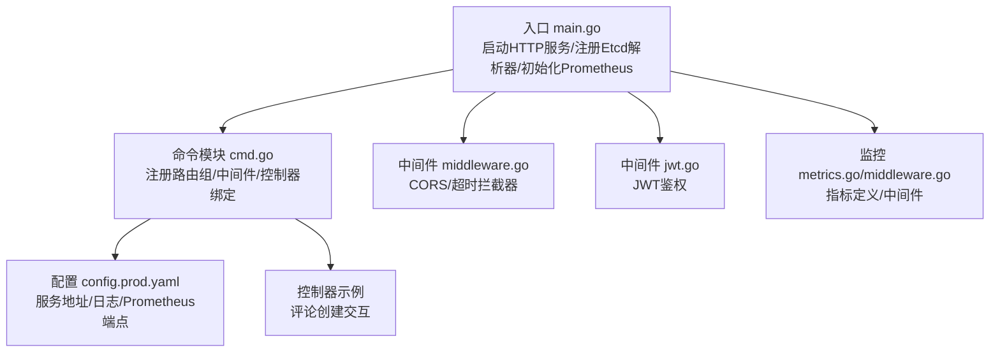
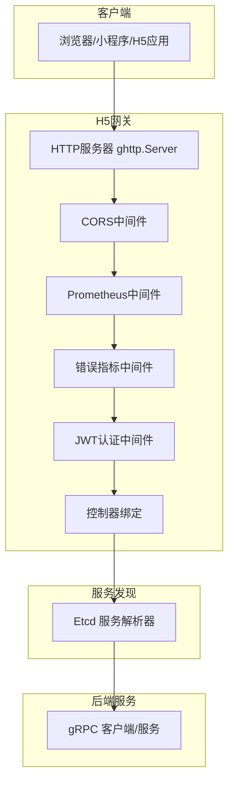
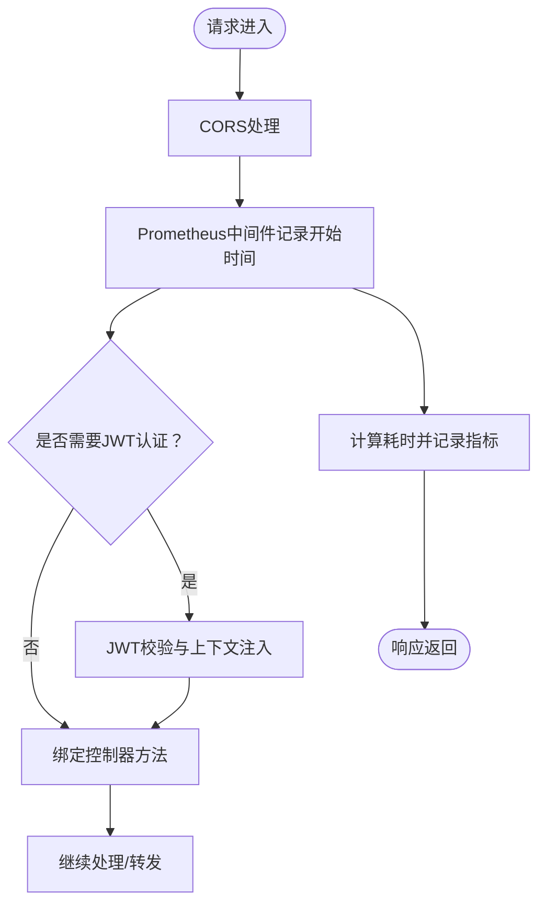
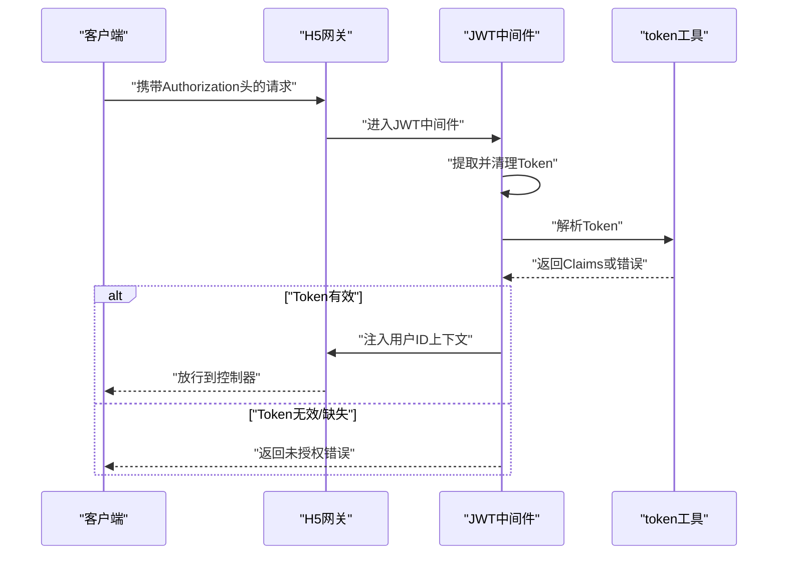
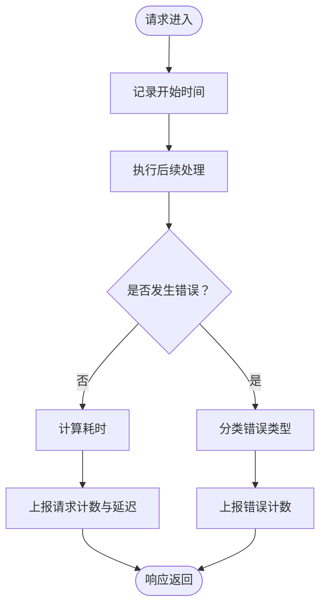
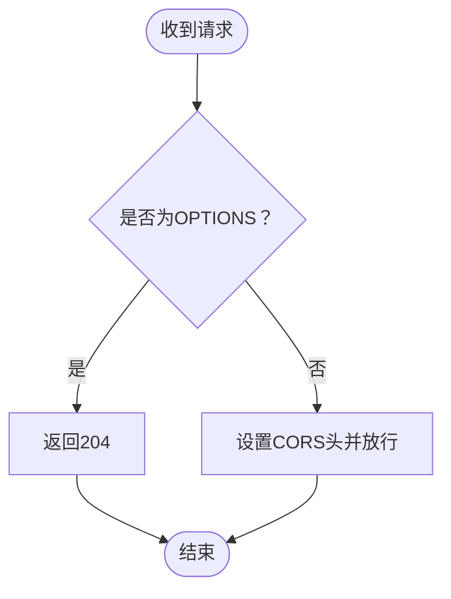
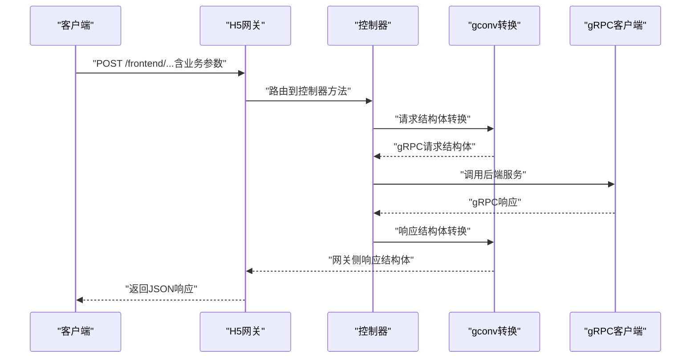
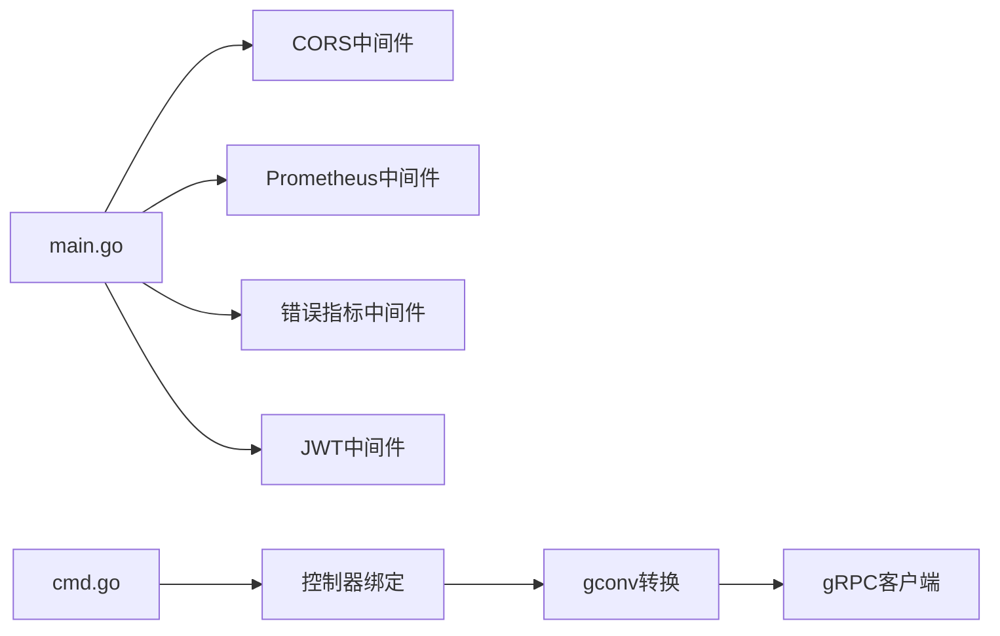

# H5网关服务

<cite>
**本文引用的文件**
- [app/gateway-h5/main.go](file://app/gateway-h5/main.go)
- [app/gateway-h5/internal/cmd/cmd.go](file://app/gateway-h5/internal/cmd/cmd.go)
- [app/gateway-h5/manifest/config/config.prod.yaml](file://app/gateway-h5/manifest/config/config.prod.yaml)
- [utility/middleware/middleware.go](file://utility/middleware/middleware.go)
- [utility/middleware/jwt.go](file://utility/middleware/jwt.go)
- [utility/metrics/metrics.go](file://utility/metrics/metrics.go)
- [utility/metrics/middleware.go](file://utility/metrics/middleware.go)
- [utility/token.go](file://utility/token.go)
- [app/gateway-h5/internal/controller/interaction/interaction_v1_comment_info_create.go](file://app/gateway-h5/internal/controller/interaction/interaction_v1_comment_info_create.go)
</cite>

## 目录
1. [简介](#简介)
2. [项目结构](#项目结构)
3. [核心组件](#核心组件)
4. [架构总览](#架构总览)
5. [详细组件分析](#详细组件分析)
6. [依赖分析](#依赖分析)
7. [性能考虑](#性能考虑)
8. [故障排查指南](#故障排查指南)
9. [结论](#结论)
10. [附录](#附录)

## 简介
本文件面向H5网关服务的使用者与维护者，系统化阐述其作为用户端API网关的核心职责：统一接入层、路由与中间件链（CORS、Prometheus监控、JWT认证）、请求转发至后端微服务（gRPC），以及与监控体系的集成。文档覆盖用户认证、商品浏览、订单管理、支付处理等核心业务场景，并提供典型调用示例、API接口说明、请求参数、响应格式与错误处理指引。

## 项目结构
H5网关采用GoFrame框架，入口在main中完成Etcd服务发现注册、Prometheus指标初始化、CORS与监控中间件挂载，并通过命令模块注册路由组与控制器绑定。配置文件提供服务监听地址、日志与Etcd地址等运行参数。

图表来源
- [app/gateway-h5/main.go](file://app/gateway-h5/main.go#L13-L37)
- [app/gateway-h5/internal/cmd/cmd.go](file://app/gateway-h5/internal/cmd/cmd.go#L18-L96)
- [app/gateway-h5/manifest/config/config.prod.yaml](file://app/gateway-h5/manifest/config/config.prod.yaml#L1-L18)
- [utility/middleware/middleware.go](file://utility/middleware/middleware.go#L10-L34)
- [utility/middleware/jwt.go](file://utility/middleware/jwt.go#L16-L38)
- [utility/metrics/metrics.go](file://utility/metrics/metrics.go#L45-L60)
- [utility/metrics/middleware.go](file://utility/metrics/middleware.go#L9-L34)
- [app/gateway-h5/internal/controller/interaction/interaction_v1_comment_info_create.go](file://app/gateway-h5/internal/controller/interaction/interaction_v1_comment_info_create.go#L11-L24)

章节来源
- [app/gateway-h5/main.go](file://app/gateway-h5/main.go#L1-L38)
- [app/gateway-h5/internal/cmd/cmd.go](file://app/gateway-h5/internal/cmd/cmd.go#L1-L100)
- [app/gateway-h5/manifest/config/config.prod.yaml](file://app/gateway-h5/manifest/config/config.prod.yaml#L1-L18)

## 核心组件
- 服务启动与中间件链
  - CORS中间件：允许跨域请求，处理预检请求。
  - Prometheus中间件：记录请求次数与延迟；错误中间件：按状态分类统计错误。
  - JWT认证中间件：校验Authorization头中的Bearer Token，注入用户上下文。
- 路由与分组
  - 前缀“/frontend”，内含无需认证与需要JWT认证两组路由。
  - 绑定用户、商品、互动、订单等控制器方法。
- gRPC集成
  - 通过Etcd服务发现解析后端服务地址。
  - 控制器内部使用gconv进行请求/响应结构体转换，并调用对应gRPC客户端方法。
- 监控与指标
  - 定义请求总量、延迟直方图、错误计数指标；注册/metrics端点。

章节来源
- [app/gateway-h5/main.go](file://app/gateway-h5/main.go#L23-L36)
- [utility/middleware/middleware.go](file://utility/middleware/middleware.go#L10-L34)
- [utility/metrics/metrics.go](file://utility/metrics/metrics.go#L14-L43)
- [utility/metrics/middleware.go](file://utility/metrics/middleware.go#L9-L61)
- [utility/middleware/jwt.go](file://utility/middleware/jwt.go#L16-L38)
- [app/gateway-h5/internal/cmd/cmd.go](file://app/gateway-h5/internal/cmd/cmd.go#L33-L91)

## 架构总览
H5网关作为统一入口，接收前端HTTP请求，经由中间件链处理后，将请求转发给对应后端微服务（通过gRPC）。Prometheus中间件负责采集指标，CORS与JWT中间件分别处理跨域与认证。

图表来源
- [app/gateway-h5/main.go](file://app/gateway-h5/main.go#L21-L36)
- [utility/middleware/middleware.go](file://utility/middleware/middleware.go#L10-L34)
- [utility/metrics/middleware.go](file://utility/metrics/middleware.go#L9-L61)
- [utility/middleware/jwt.go](file://utility/middleware/jwt.go#L16-L38)
- [app/gateway-h5/internal/cmd/cmd.go](file://app/gateway-h5/internal/cmd/cmd.go#L33-L91)

## 详细组件分析

### 路由与中间件链
- 路由分组
  - 无需认证：登录、注册、商品列表/详情、轮播、Banner等公开接口。
  - 需要认证：收货地址、购物车、优惠券、互动、订单、支付、取消订单等。
- 中间件顺序
  - CORS → Prometheus → 错误指标 → JWT（仅认证组）。
- 控制器绑定
  - 用户、商品、互动、订单等控制器实例化后统一绑定到路由组。

图表来源
- [app/gateway-h5/internal/cmd/cmd.go](file://app/gateway-h5/internal/cmd/cmd.go#L33-L91)
- [utility/metrics/middleware.go](file://utility/metrics/middleware.go#L9-L34)
- [utility/middleware/jwt.go](file://utility/middleware/jwt.go#L16-L38)

章节来源
- [app/gateway-h5/internal/cmd/cmd.go](file://app/gateway-h5/internal/cmd/cmd.go#L33-L91)

### JWT认证流程
- Header读取Authorization，去除Bearer前缀。
- 使用共享密钥解析JWT，失败则返回未授权错误。
- 成功后将用户ID写入上下文，供后续业务使用。

图表来源
- [utility/middleware/jwt.go](file://utility/middleware/jwt.go#L16-L38)
- [utility/token.go](file://utility/token.go#L52-L64)

章节来源
- [utility/middleware/jwt.go](file://utility/middleware/jwt.go#L16-L38)
- [utility/token.go](file://utility/token.go#L52-L64)

### Prometheus监控与指标
- 指标类型
  - http_requests_total：按方法、路径、状态码统计请求总数。
  - http_request_duration_seconds：请求耗时直方图。
  - service_errors_total：按错误类型与服务名统计错误数。
- 中间件行为
  - MetricsMiddleware：记录开始时间、执行后续处理、计算耗时并上报。
  - ErrorMetricsMiddleware：检查错误并按状态分类上报。

图表来源
- [utility/metrics/middleware.go](file://utility/metrics/middleware.go#L9-L61)
- [utility/metrics/metrics.go](file://utility/metrics/metrics.go#L14-L43)

章节来源
- [utility/metrics/metrics.go](file://utility/metrics/metrics.go#L14-L71)
- [utility/metrics/middleware.go](file://utility/metrics/middleware.go#L9-L61)

### CORS跨域处理
- 放行Origin与常见方法/头部。
- 对OPTIONS预检请求直接返回204。

图表来源
- [utility/middleware/middleware.go](file://utility/middleware/middleware.go#L10-L23)

章节来源
- [utility/middleware/middleware.go](file://utility/middleware/middleware.go#L10-L23)

### gRPC请求转发与结构体转换
- 控制器内部使用gconv将网关侧请求结构体转换为gRPC请求结构体。
- 调用对应gRPC客户端方法，再将响应转换回网关侧响应结构体。
- 示例：评论创建接口。

图表来源
- [app/gateway-h5/internal/controller/interaction/interaction_v1_comment_info_create.go](file://app/gateway-h5/internal/controller/interaction/interaction_v1_comment_info_create.go#L11-L24)

章节来源
- [app/gateway-h5/internal/controller/interaction/interaction_v1_comment_info_create.go](file://app/gateway-h5/internal/controller/interaction/interaction_v1_comment_info_create.go#L11-L24)

### API接口说明与调用示例

- 登录/注册（无需认证）
  - 接口：POST /frontend/...（登录/注册）
  - 请求参数：账号、密码、验证码等（以实际proto定义为准）
  - 响应：令牌与用户信息
  - 错误：未提供Token/无效Token（认证接口）

- 商品浏览（无需认证）
  - 接口：GET /frontend/goods/category/list、GET /frontend/goods/info/detail
  - 请求参数：分类ID、分页、关键词等
  - 响应：商品列表/详情
  - 错误：参数校验失败、服务内部错误

- 互动（无需认证）
  - 接口：GET /frontend/banner/list、GET /frontend/rotation/list
  - 请求参数：位置、状态等
  - 响应：轮播/广告位列表
  - 错误：查询异常

- 互动（需要认证）
  - 接口：POST /frontend/interaction/comment/create
  - 请求参数：内容、关联ID等
  - 响应：评论ID
  - 错误：未授权、参数错误、服务异常

- 订单与支付（需要认证）
  - 接口：POST /frontend/order/create、POST /frontend/order/payment、POST /frontend/order/cancel
  - 请求参数：收货地址、商品清单、支付方式等
  - 响应：订单号、支付参数
  - 错误：未授权、库存不足、支付失败

- 收货地址（需要认证）
  - 接口：POST /frontend/user/consignee/create、GET /frontend/user/consignee/list
  - 请求参数：姓名、电话、省市区、详细地址等
  - 响应：地址列表/创建结果
  - 错误：未授权、参数错误

- 购物车（需要认证）
  - 接口：GET /frontend/goods/cart/list、POST /frontend/goods/cart/create、DELETE /frontend/goods/cart/delete
  - 请求参数：商品ID、数量等
  - 响应：购物车列表/操作结果
  - 错误：未授权、参数错误

- 优惠券（需要认证）
  - 接口：GET /frontend/goods/user_coupon/list
  - 请求参数：状态、分页
  - 响应：可用/已用/过期列表
  - 错误：未授权、查询异常

- 折价/砍价（需要认证）
  - 接口：POST /frontend/goods/bargain/create、GET /frontend/goods/bargain/history
  - 请求参数：商品ID、邀请好友等
  - 响应：砍价活动/历史
  - 错误：未授权、活动规则限制

- 退款（需要认证）
  - 接口：POST /frontend/order/refund/create、GET /frontend/order/refund/detail
  - 请求参数：订单号、原因
  - 响应：退款单号/状态
  - 错误：未授权、订单状态不符

章节来源
- [app/gateway-h5/internal/cmd/cmd.go](file://app/gateway-h5/internal/cmd/cmd.go#L36-L90)

## 依赖分析
- 启动阶段
  - main注册Etcd解析器，启用Prometheus指标，挂载CORS与监控中间件，启动HTTP服务。
- 控制器与gRPC
  - 控制器通过gconv转换请求/响应，调用后端gRPC客户端，实现业务编排。
- 中间件链
  - CORS最先处理跨域；Prometheus中间件记录指标；错误中间件在下游处理后汇总错误；JWT在认证组生效。

图表来源
- [app/gateway-h5/main.go](file://app/gateway-h5/main.go#L21-L36)
- [app/gateway-h5/internal/cmd/cmd.go](file://app/gateway-h5/internal/cmd/cmd.go#L26-L31)
- [utility/middleware/middleware.go](file://utility/middleware/middleware.go#L10-L34)
- [utility/metrics/middleware.go](file://utility/metrics/middleware.go#L9-L61)
- [utility/middleware/jwt.go](file://utility/middleware/jwt.go#L16-L38)

章节来源
- [app/gateway-h5/main.go](file://app/gateway-h5/main.go#L21-L36)
- [app/gateway-h5/internal/cmd/cmd.go](file://app/gateway-h5/internal/cmd/cmd.go#L26-L31)

## 性能考虑
- 中间件顺序影响性能：CORS与预检处理开销低，但应避免在高频路径上重复计算。
- gRPC超时控制：建议在客户端拦截器中设置合理超时，防止阻塞。
- 指标维度：路径标签可能导致高基数，建议对路径做模式化处理以降低维度。
- 并发与连接池：结合后端服务的并发能力与连接池配置，避免上游拥塞。

## 故障排查指南
- 未提供Token或无效Token
  - 现象：返回未授权错误。
  - 排查：确认Header中Authorization格式为Bearer <token>，且Token未过期。
- 跨域失败
  - 现象：浏览器报跨域错误。
  - 排查：确认CORS中间件已挂载，Origin/Methods/Headers匹配。
- Prometheus指标未采集
  - 现象：访问/metrics无数据。
  - 排查：确认已注册/metrics端点，Prometheus抓取目标可达。
- gRPC调用超时
  - 现象：请求长时间无响应。
  - 排查：检查后端服务健康、网络连通性、Etcd解析是否正确、客户端超时设置。
- 订单/支付异常
  - 现象：创建订单失败或支付回调异常。
  - 排查：核对签名、参数完整性、库存与分布式锁状态、退款回调幂等性。

章节来源
- [utility/middleware/jwt.go](file://utility/middleware/jwt.go#L16-L38)
- [utility/metrics/middleware.go](file://utility/metrics/middleware.go#L36-L61)
- [utility/middleware/middleware.go](file://utility/middleware/middleware.go#L10-L23)

## 结论
H5网关通过清晰的路由分组、完善的中间件链与gRPC转发机制，实现了用户端的统一接入与可观测性。结合Etcd服务发现与Prometheus监控，能够稳定支撑用户认证、商品浏览、订单管理与支付处理等核心业务场景。建议在生产环境中持续关注高基数指标、超时与错误分类策略，并完善告警与限流机制。

## 附录

### 配置项说明
- 服务监听
  - address：HTTP监听地址，默认":8199"
- 日志
  - logger.path/file/prefix/level/stdout/rotate*：日志输出路径、文件名模板、级别、控制台输出与轮转策略
- Prometheus
  - /metrics端点已内置注册，可通过Prometheus抓取
- Etcd
  - etcd.address：服务发现地址，默认"etcd:2379"

章节来源
- [app/gateway-h5/manifest/config/config.prod.yaml](file://app/gateway-h5/manifest/config/config.prod.yaml#L1-L18)