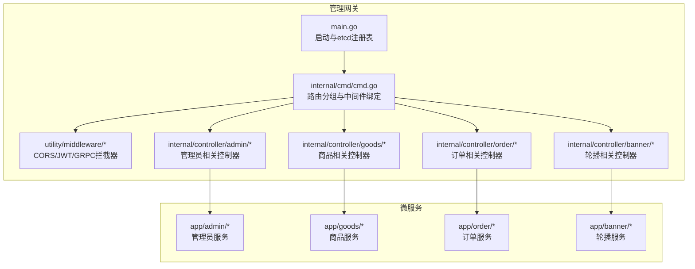
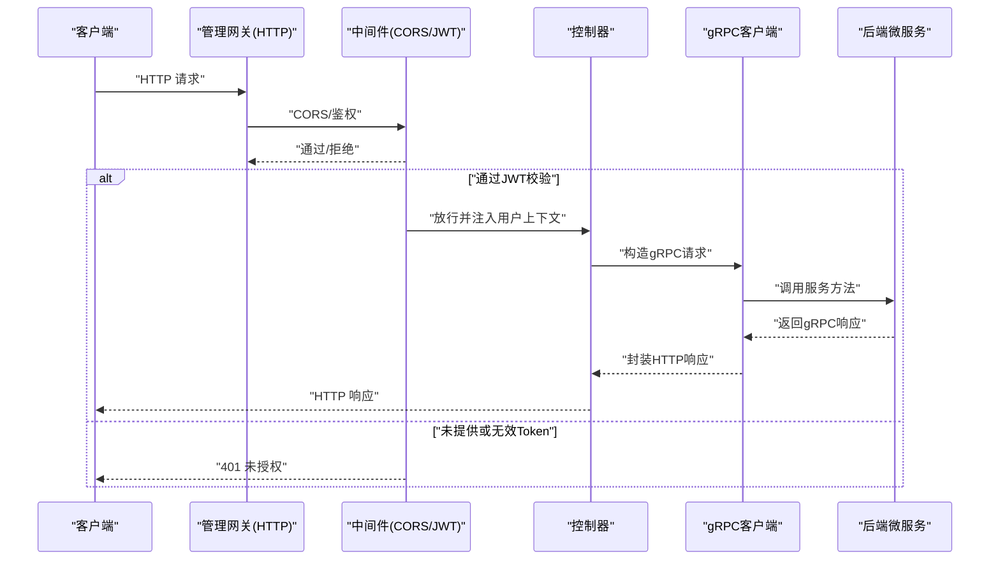
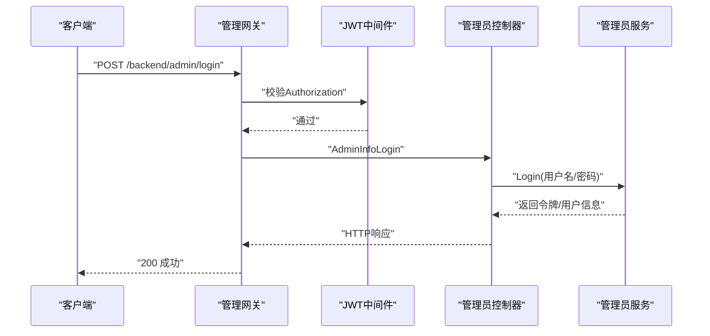
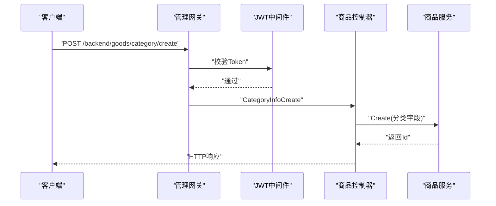
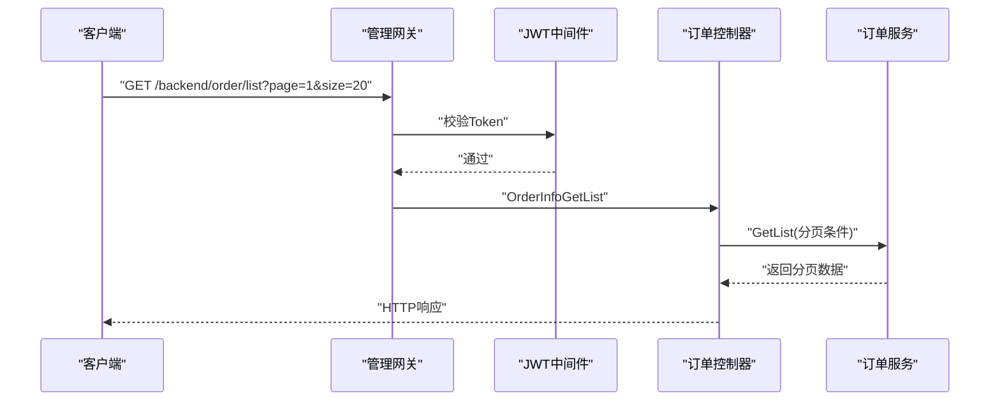
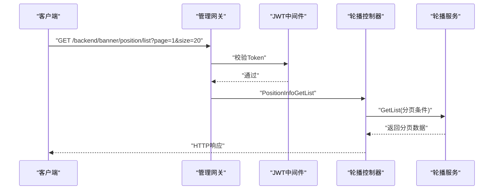
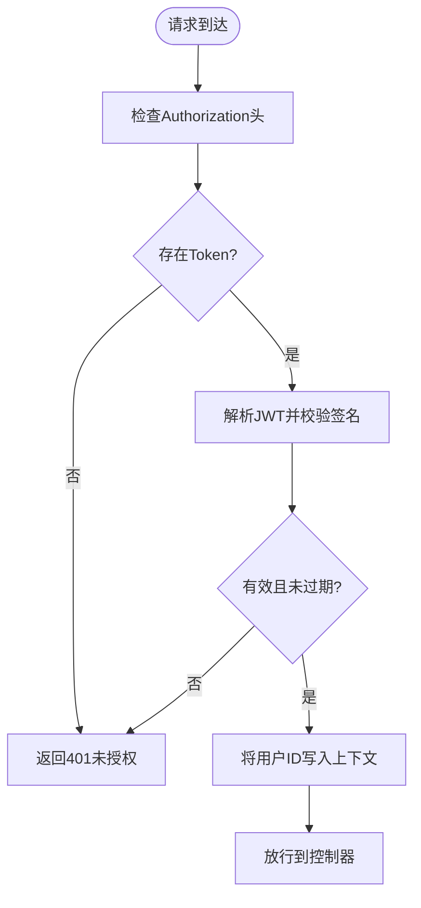
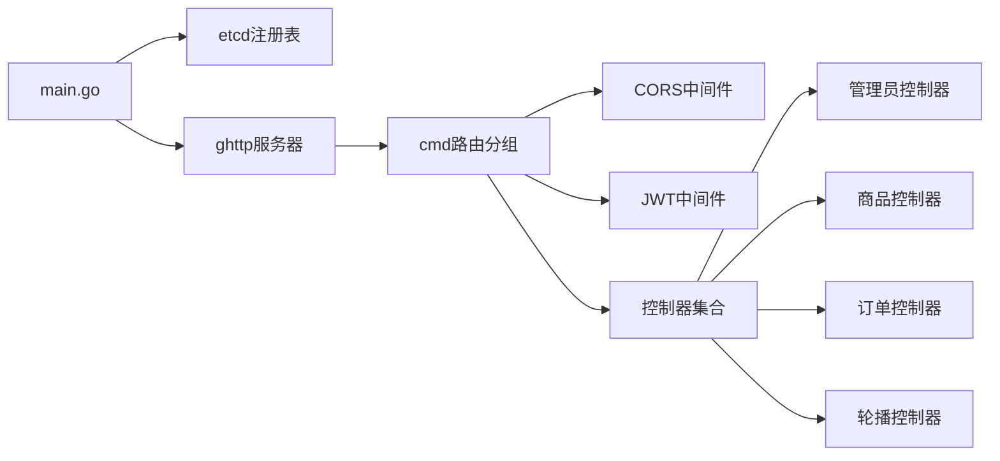

# 管理网关服务

<cite>
**本文引用的文件**
- [main.go](file://app/gateway-admin/main.go)
- [cmd.go](file://app/gateway-admin/internal/cmd/cmd.go)
- [jwt.go](file://utility/middleware/jwt.go)
- [middleware.go](file://utility/middleware/middleware.go)
- [token.go](file://utility/token.go)
- [admin_v1_admin_info_login.go](file://app/gateway-admin/internal/controller/admin/admin_v1_admin_info_login.go)
- [admin_v1_admin_info_register.go](file://app/gateway-admin/internal/controller/admin/admin_v1_admin_info_register.go)
- [goods_v1_category_info_create.go](file://app/gateway-admin/internal/controller/goods/goods_v1_category_info_create.go)
- [goods_v1_goods_info_get_list.go](file://app/gateway-admin/internal/controller/goods/goods_v1_goods_info_get_list.go)
- [DEMO_WECHAT_OPEN_ID.go](file://app/gateway-admin/internal/controller/order/DEMO_WECHAT_OPEN_ID.go)
- [banner_v1_position_info_get_list.go](file://app/gateway-admin/internal/controller/banner/banner_v1_position_info_get_list.go)
- [role_permission_info.go](file://app/admin/internal/dao/role_permission_info.go)
- [permission_info.go](file://app/admin/internal/dao/permission_info.go)
</cite>

## 目录
1. [简介](#简介)
2. [项目结构](#项目结构)
3. [核心组件](#核心组件)
4. [架构总览](#架构总览)
5. [详细组件分析](#详细组件分析)
6. [依赖关系分析](#依赖关系分析)
7. [性能考虑](#性能考虑)
8. [故障排查指南](#故障排查指南)
9. [结论](#结论)
10. [附录：API 接口清单与调用示例](#附录api-接口清单与调用示例)

## 简介
本文件面向“管理网关服务”，系统性阐述其作为后台管理系统 API 网关的功能定位与实现方式。管理网关负责：
- 管理员认证与会话管理（登录、注册、JWT 验证）
- 商品管理（分类、图片、商品信息）
- 订单管理（订单列表查询）
- 内容管理（轮播位与轮播图）

同时，文档将重点解释网关的权限控制机制、中间件配置、请求处理流程，并给出 RBAC 权限控制的落地思路、会话管理与权限验证的实现细节，以及后台管理操作的完整调用示例与最佳实践。

## 项目结构
管理网关采用 GoFrame 框架与 gRPC 服务发现（etcd）进行路由与服务解析，通过中间件统一处理跨域与 JWT 校验，控制器层负责将 HTTP 请求转发至对应微服务的 gRPC 接口。

图表来源
- [main.go](file://app/gateway-admin/main.go#L1-L30)
- [cmd.go](file://app/gateway-admin/internal/cmd/cmd.go#L1-L46)
- [jwt.go](file://utility/middleware/jwt.go#L1-L39)
- [middleware.go](file://utility/middleware/middleware.go#L1-L35)

章节来源
- [main.go](file://app/gateway-admin/main.go#L1-L30)
- [cmd.go](file://app/gateway-admin/internal/cmd/cmd.go#L1-L46)

## 核心组件
- 启动与服务发现
  - 通过 etcd 注册表解析 gRPC 服务地址，确保网关能动态发现后端微服务。
- 路由与中间件
  - 统一设置 CORS 头，支持前端跨域访问。
  - 定义 JWT 认证中间件，校验管理员令牌并在上下文中注入用户标识。
- 控制器层
  - 管理员：登录、注册
  - 商品：分类、图片、商品信息的增删改查与列表查询
  - 订单：订单列表查询
  - 轮播：轮播位与轮播图的列表查询
- 权限控制与会话
  - JWT 令牌签发与解析，基于用户 ID 的上下文传递。
  - RBAC 权限模型在后台服务侧（admin 服务）通过角色-权限关联表实现，网关通过中间件完成会话校验。

章节来源
- [jwt.go](file://utility/middleware/jwt.go#L1-L39)
- [middleware.go](file://utility/middleware/middleware.go#L1-L35)
- [token.go](file://utility/token.go#L1-L65)

## 架构总览
管理网关以 HTTP 为入口，内部通过 gRPC 调用各微服务。请求在进入具体控制器前，先经过中间件处理（CORS、JWT）。控制器负责参数转换与调用对应微服务的 gRPC 接口，并将响应转换回 HTTP 返回。

图表来源
- [cmd.go](file://app/gateway-admin/internal/cmd/cmd.go#L20-L39)
- [jwt.go](file://utility/middleware/jwt.go#L16-L38)
- [admin_v1_admin_info_login.go](file://app/gateway-admin/internal/controller/admin/admin_v1_admin_info_login.go#L14-L37)

## 详细组件分析

### 管理员认证与会话管理
- 登录
  - 控制器接收用户名/密码，转换为 gRPC 请求，调用管理员服务登录接口，返回令牌与用户信息。
- 注册
  - 控制器接收注册信息，转换为 gRPC 请求，调用管理员服务注册接口，返回用户 ID。
- JWT 中间件
  - 从请求头提取 Authorization，去除 Bearer 前缀，解析 JWT，校验失败直接返回未授权；成功则将用户 ID 写入上下文供后续逻辑使用。

图表来源
- [admin_v1_admin_info_login.go](file://app/gateway-admin/internal/controller/admin/admin_v1_admin_info_login.go#L14-L37)
- [jwt.go](file://utility/middleware/jwt.go#L16-L38)

章节来源
- [admin_v1_admin_info_login.go](file://app/gateway-admin/internal/controller/admin/admin_v1_admin_info_login.go#L1-L38)
- [admin_v1_admin_info_register.go](file://app/gateway-admin/internal/controller/admin/admin_v1_admin_info_register.go#L1-L27)
- [jwt.go](file://utility/middleware/jwt.go#L1-L39)
- [token.go](file://utility/token.go#L31-L64)

### 商品管理
- 分类管理
  - 控制器将请求转换为 gRPC 请求，调用商品服务的分类创建接口，返回新分类 ID。
- 商品信息列表
  - 控制器将请求转换为 gRPC 请求，调用商品服务的商品列表接口，封装分页与列表数据返回。

图表来源
- [goods_v1_category_info_create.go](file://app/gateway-admin/internal/controller/goods/goods_v1_category_info_create.go#L11-L24)
- [goods_v1_goods_info_get_list.go](file://app/gateway-admin/internal/controller/goods/goods_v1_goods_info_get_list.go#L11-L38)

章节来源
- [goods_v1_category_info_create.go](file://app/gateway-admin/internal/controller/goods/goods_v1_category_info_create.go#L1-L25)
- [goods_v1_goods_info_get_list.go](file://app/gateway-admin/internal/controller/goods/goods_v1_goods_info_get_list.go#L1-L39)

### 订单管理
- 订单列表查询
  - 控制器将请求转换为 gRPC 请求，调用订单服务的订单列表接口，封装分页与列表数据返回。

图表来源
- [DEMO_WECHAT_OPEN_ID.go](file://app/gateway-admin/internal/controller/order/DEMO_WECHAT_OPEN_ID.go#L11-L38)

章节来源
- [DEMO_WECHAT_OPEN_ID.go](file://app/gateway-admin/internal/controller/order/DEMO_WECHAT_OPEN_ID.go#L1-L39)

### 内容管理（轮播）
- 轮播位列表查询
  - 控制器将请求转换为 gRPC 请求，调用轮播服务的轮播位列表接口，封装分页与列表数据返回。

图表来源
- [banner_v1_position_info_get_list.go](file://app/gateway-admin/internal/controller/banner/banner_v1_position_info_get_list.go#L11-L38)

章节来源
- [banner_v1_position_info_get_list.go](file://app/gateway-admin/internal/controller/banner/banner_v1_position_info_get_list.go#L1-L39)

### RBAC 权限控制与会话管理
- 会话管理
  - 管理员登录成功后，服务端签发 JWT，包含用户 ID 与过期时间；前端在后续请求中携带 Authorization: Bearer <token>。
  - 网关中间件解析并校验令牌，将用户 ID 写入请求上下文，供业务逻辑使用。
- 权限控制
  - 网关侧通过 JWT 中间件实现“是否已登录”的基础校验；更细粒度的权限判断（如“能否删除商品”）应在后端服务侧（admin 服务）基于角色-权限映射表进行。
  - 后端服务侧的数据访问对象（DAO）提供了角色-权限关联表与权限表的抽象，用于实现 RBAC。

图表来源
- [jwt.go](file://utility/middleware/jwt.go#L16-L38)
- [token.go](file://utility/token.go#L52-L64)

章节来源
- [jwt.go](file://utility/middleware/jwt.go#L1-L39)
- [token.go](file://utility/token.go#L1-L65)
- [role_permission_info.go](file://app/admin/internal/dao/role_permission_info.go#L1-L22)
- [permission_info.go](file://app/admin/internal/dao/permission_info.go#L1-L22)

## 依赖关系分析
- 网关启动依赖 etcd 服务发现，确保 gRPC 客户端能解析服务地址。
- 路由分组与中间件绑定决定哪些接口需要 JWT 校验。
- 控制器仅负责参数转换与调用 gRPC，不包含业务逻辑，职责清晰。
- 中间件提供 CORS 与 JWT 校验能力，保证跨域与安全。

图表来源
- [main.go](file://app/gateway-admin/main.go#L13-L29)
- [cmd.go](file://app/gateway-admin/internal/cmd/cmd.go#L20-L39)
- [middleware.go](file://utility/middleware/middleware.go#L10-L23)
- [jwt.go](file://utility/middleware/jwt.go#L16-L38)

章节来源
- [main.go](file://app/gateway-admin/main.go#L1-L30)
- [cmd.go](file://app/gateway-admin/internal/cmd/cmd.go#L1-L46)
- [middleware.go](file://utility/middleware/middleware.go#L1-L35)

## 性能考虑
- gRPC 超时控制：建议在网关侧为 gRPC 客户端设置合理的超时时间，避免下游慢请求拖垮网关。
- 中间件顺序：CORS 与 JWT 中间件应尽量前置，减少不必要的后续处理。
- 响应转换：批量转换（如列表）时注意内存占用与序列化开销，必要时采用流式或分批处理。
- 缓存与降级：对于高频读取接口（如商品列表、轮播位），可在网关或服务侧引入缓存与降级策略。

## 故障排查指南
- 401 未授权
  - 检查请求头是否包含 Authorization，格式是否为 Bearer <token>。
  - 校验令牌是否过期或签名无效。
- CORS 跨域失败
  - 确认网关已设置允许的源、方法与头部，预检请求返回 204。
- gRPC 调用失败
  - 检查服务发现配置（etcd 地址）、服务名称与版本，确认目标服务正常运行。
- 参数转换错误
  - 控制器层使用结构体转换，需确保字段名一致与类型匹配。

章节来源
- [jwt.go](file://utility/middleware/jwt.go#L16-L38)
- [middleware.go](file://utility/middleware/middleware.go#L10-L23)
- [main.go](file://app/gateway-admin/main.go#L15-L21)

## 结论
管理网关通过清晰的中间件体系与控制器分层，实现了后台管理系统的统一入口。JWT 中间件保障了会话安全，路由分组明确了受保护接口范围；控制器层专注于协议转换与调用后端服务。RBAC 权限控制建议在后端服务侧实现，结合角色-权限映射表完成细粒度授权。配合合理的超时与缓存策略，可进一步提升系统稳定性与性能。

## 附录：API 接口清单与调用示例

- 管理员
  - 登录
    - 方法与路径：POST /backend/admin/login
    - 请求体字段：用户名、密码
    - 返回：令牌与用户信息
    - 示例：携带 Authorization: Bearer <token> 访问受保护接口
  - 注册
    - 方法与路径：POST /backend/admin/register
    - 请求体字段：注册信息
    - 返回：用户 ID

- 商品
  - 分类创建
    - 方法与路径：POST /backend/goods/category/create
    - 请求体字段：分类字段
    - 返回：新分类 ID
  - 商品列表
    - 方法与路径：GET /backend/goods/list
    - 查询参数：page、size
    - 返回：分页数据与列表项

- 订单
  - 订单列表
    - 方法与路径：GET /backend/order/list
    - 查询参数：page、size
    - 返回：分页数据与列表项

- 轮播
  - 轮播位列表
    - 方法与路径：GET /backend/banner/position/list
    - 查询参数：page、size
    - 返回：分页数据与列表项

最佳实践建议
- 前端统一在请求头添加 Authorization: Bearer <token>
- 对受保护接口统一走 JWT 中间件校验
- 列表查询建议分页参数合理设置默认值与上限
- 错误码与提示保持一致，便于前端统一处理