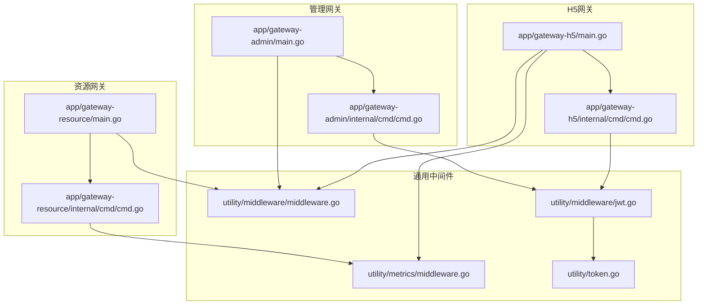
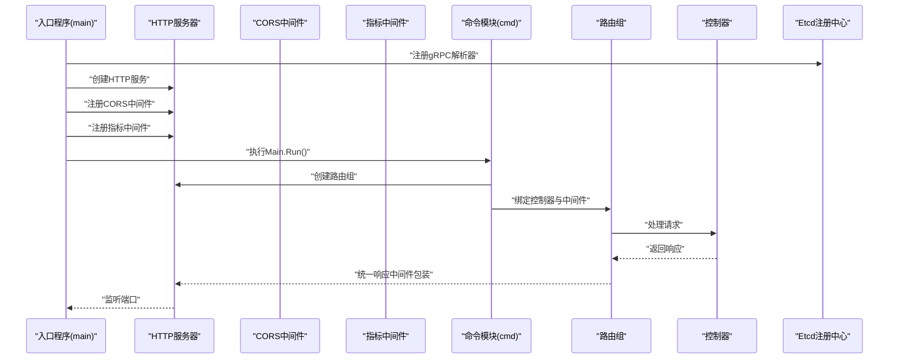
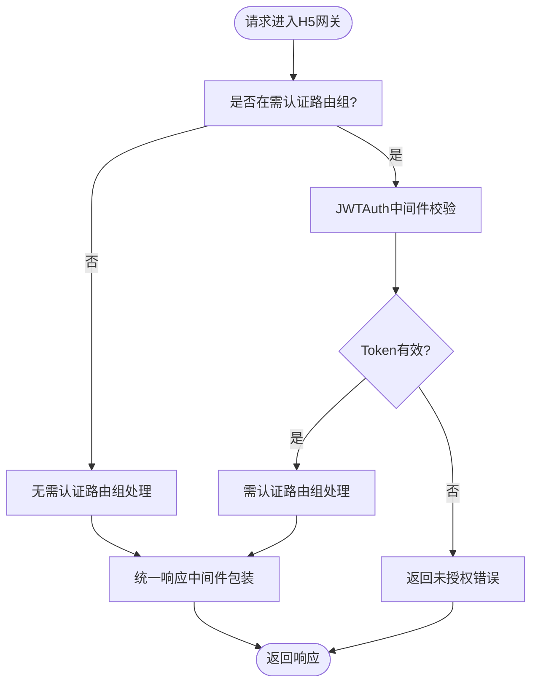
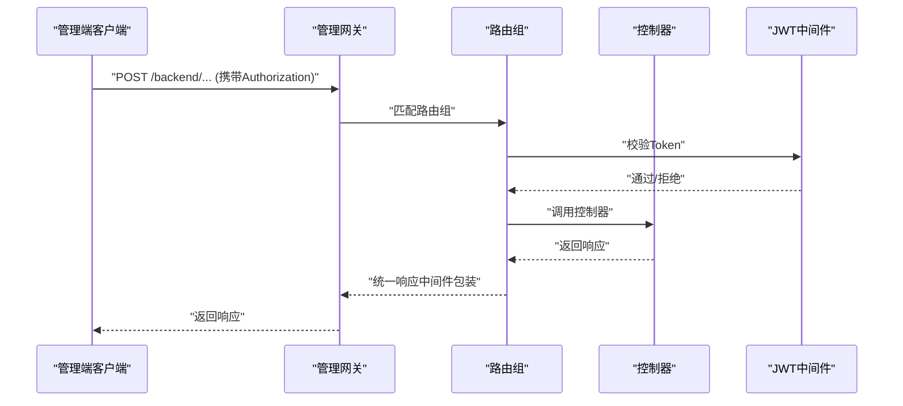
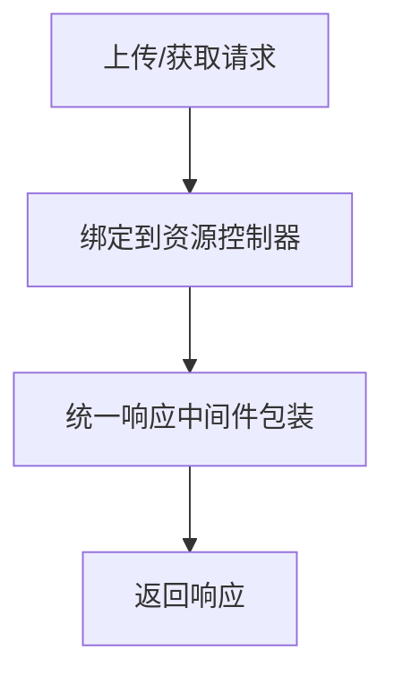
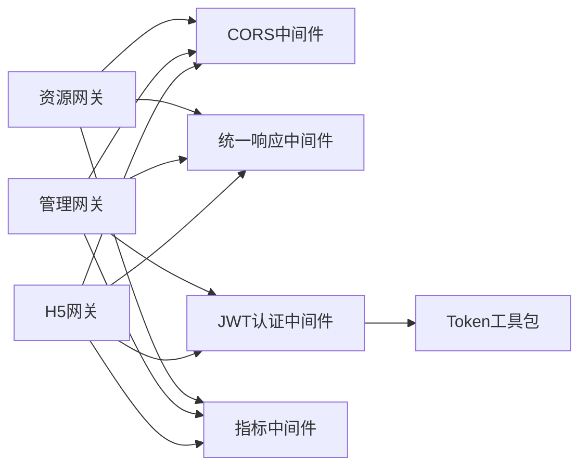

# 网关服务详解

<cite>
**本文引用的文件**
- [app/gateway-h5/main.go](file://app/gateway-h5/main.go)
- [app/gateway-h5/internal/cmd/cmd.go](file://app/gateway-h5/internal/cmd/cmd.go)
- [app/gateway-admin/main.go](file://app/gateway-admin/main.go)
- [app/gateway-admin/internal/cmd/cmd.go](file://app/gateway-admin/internal/cmd/cmd.go)
- [app/gateway-resource/main.go](file://app/gateway-resource/main.go)
- [app/gateway-resource/internal/cmd/cmd.go](file://app/gateway-resource/internal/cmd/cmd.go)
- [utility/middleware/middleware.go](file://utility/middleware/middleware.go)
- [utility/middleware/jwt.go](file://utility/middleware/jwt.go)
- [utility/token.go](file://utility/token.go)
- [utility/metrics/middleware.go](file://utility/metrics/middleware.go)
</cite>

## 目录
1. [简介](#简介)
2. [项目结构](#项目结构)
3. [核心组件](#核心组件)
4. [架构总览](#架构总览)
5. [详细组件分析](#详细组件分析)
6. [依赖关系分析](#依赖关系分析)
7. [性能考虑](#性能考虑)
8. [故障排查指南](#故障排查指南)
9. [结论](#结论)
10. [附录：API调用示例与最佳实践](#附录api调用示例与最佳实践)

## 简介
本文件系统性梳理三类网关服务的设计理念与实现细节，覆盖以下目标：
- H5网关：面向移动端/前端用户的统一入口，提供无需认证与需要JWT认证的路由分组，统一响应格式化与跨域支持。
- 管理网关：面向后台管理系统的统一入口，提供无需认证与需要JWT认证的路由分组，统一响应格式化与跨域支持。
- 资源网关：面向文件上传与静态资源访问的专用入口，提供图片上传与头像获取等能力。

文档重点阐述：
- 路由规则与中间件配置
- 认证授权机制（基于JWT）
- 请求转发到后端服务的流程（通过gRPC解析器与Etcd注册中心）
- 错误处理与响应格式化
- Prometheus指标采集与错误分类统计
- 典型API调用示例与最佳实践

## 项目结构
三类网关均采用GoFrame框架，遵循“入口程序 + 命令模块 + 控制器”的分层组织方式：
- 入口程序负责初始化Etcd服务发现、注册CORS与Prometheus中间件、启动HTTP服务。
- 命令模块负责路由分组、绑定控制器、设置中间件。
- 控制器层负责业务路由绑定（由命令模块统一注册）。

图表来源
- [app/gateway-h5/main.go](file://app/gateway-h5/main.go#L13-L37)
- [app/gateway-h5/internal/cmd/cmd.go](file://app/gateway-h5/internal/cmd/cmd.go#L18-L96)
- [app/gateway-admin/main.go](file://app/gateway-admin/main.go#L13-L29)
- [app/gateway-admin/internal/cmd/cmd.go](file://app/gateway-admin/internal/cmd/cmd.go#L16-L43)
- [app/gateway-resource/main.go](file://app/gateway-resource/main.go#L13-L29)
- [app/gateway-resource/internal/cmd/cmd.go](file://app/gateway-resource/internal/cmd/cmd.go#L12-L30)
- [utility/middleware/middleware.go](file://utility/middleware/middleware.go#L10-L23)
- [utility/middleware/jwt.go](file://utility/middleware/jwt.go#L16-L38)
- [utility/token.go](file://utility/token.go#L10-L64)
- [utility/metrics/middleware.go](file://utility/metrics/middleware.go#L9-L61)

章节来源
- [app/gateway-h5/main.go](file://app/gateway-h5/main.go#L1-L38)
- [app/gateway-h5/internal/cmd/cmd.go](file://app/gateway-h5/internal/cmd/cmd.go#L1-L100)
- [app/gateway-admin/main.go](file://app/gateway-admin/main.go#L1-L30)
- [app/gateway-admin/internal/cmd/cmd.go](file://app/gateway-admin/internal/cmd/cmd.go#L1-L46)
- [app/gateway-resource/main.go](file://app/gateway-resource/main.go#L1-L30)
- [app/gateway-resource/internal/cmd/cmd.go](file://app/gateway-resource/internal/cmd/cmd.go#L1-L31)
- [utility/middleware/middleware.go](file://utility/middleware/middleware.go#L1-L35)
- [utility/middleware/jwt.go](file://utility/middleware/jwt.go#L1-L39)
- [utility/token.go](file://utility/token.go#L1-L65)
- [utility/metrics/middleware.go](file://utility/metrics/middleware.go#L1-L62)

## 核心组件
- 网关入口与服务发现
  - 通过Etcd注册中心启用gRPC解析器，使网关能以服务名形式调用后端微服务。
  - 启动HTTP服务并注册CORS中间件，确保跨域请求正常。
- 统一响应中间件
  - 在各网关命令模块中，为路由组绑定统一响应中间件，保证所有接口返回一致的响应结构。
- 认证授权中间件
  - JWTAuth中间件从请求头读取Authorization，校验Token有效性并将用户ID写入上下文。
- 指标采集中间件
  - Prometheus指标中间件记录请求耗时、状态码等；错误中间件按5xx/4xx分类记录错误指标。
- Token签发与解析
  - 提供自定义Claims结构，签发24小时有效期的JWT，并提供解析函数。

章节来源
- [app/gateway-h5/main.go](file://app/gateway-h5/main.go#L13-L37)
- [app/gateway-admin/main.go](file://app/gateway-admin/main.go#L13-L29)
- [app/gateway-resource/main.go](file://app/gateway-resource/main.go#L13-L29)
- [app/gateway-h5/internal/cmd/cmd.go](file://app/gateway-h5/internal/cmd/cmd.go#L33-L91)
- [app/gateway-admin/internal/cmd/cmd.go](file://app/gateway-admin/internal/cmd/cmd.go#L22-L39)
- [app/gateway-resource/internal/cmd/cmd.go](file://app/gateway-resource/internal/cmd/cmd.go#L19-L25)
- [utility/middleware/jwt.go](file://utility/middleware/jwt.go#L16-L38)
- [utility/metrics/middleware.go](file://utility/metrics/middleware.go#L9-L61)
- [utility/token.go](file://utility/token.go#L10-L64)

## 架构总览
下图展示三类网关的启动流程、中间件装配与路由分组策略：

图表来源
- [app/gateway-h5/main.go](file://app/gateway-h5/main.go#L13-L37)
- [app/gateway-h5/internal/cmd/cmd.go](file://app/gateway-h5/internal/cmd/cmd.go#L18-L96)
- [app/gateway-admin/main.go](file://app/gateway-admin/main.go#L13-L29)
- [app/gateway-admin/internal/cmd/cmd.go](file://app/gateway-admin/internal/cmd/cmd.go#L16-L43)
- [app/gateway-resource/main.go](file://app/gateway-resource/main.go#L13-L29)
- [app/gateway-resource/internal/cmd/cmd.go](file://app/gateway-resource/internal/cmd/cmd.go#L12-L30)
- [utility/middleware/middleware.go](file://utility/middleware/middleware.go#L10-L23)
- [utility/metrics/middleware.go](file://utility/metrics/middleware.go#L9-L61)

## 详细组件分析

### H5网关（用户端）
- 设计理念
  - 将用户侧接口分为“无需认证”和“需要JWT认证”两类，分别置于不同路由组，便于权限控制与日志审计。
  - 统一响应中间件确保所有接口返回一致的结构，简化前端处理。
- 路由规则
  - 前缀：/frontend
  - 无需认证组：用户注册/登录、订单回调、商品列表/详情、轮播图等公开接口。
  - 需认证组：收货地址、用户信息、购物车、优惠券、互动、订单创建/查询/取消/退款等。
- 中间件配置
  - CORS：允许跨域请求。
  - 统一响应中间件：对所有接口进行响应包装。
  - JWT认证中间件：对需认证组生效，校验失败直接返回未授权错误。
- 认证授权机制
  - 从请求头提取Authorization，去除Bearer前缀后解析JWT，将用户ID写入上下文。
- 错误处理与响应格式化
  - 统一响应中间件在控制器返回后进行封装；JWT中间件在鉴权失败时设置错误。
- 请求转发到后端服务
  - 通过gRPC解析器与Etcd注册中心，以服务名为目标进行调用（由控制器实现）。

图表来源
- [app/gateway-h5/internal/cmd/cmd.go](file://app/gateway-h5/internal/cmd/cmd.go#L33-L91)
- [utility/middleware/jwt.go](file://utility/middleware/jwt.go#L16-L38)

章节来源
- [app/gateway-h5/internal/cmd/cmd.go](file://app/gateway-h5/internal/cmd/cmd.go#L18-L96)
- [utility/middleware/jwt.go](file://utility/middleware/jwt.go#L16-L38)

### 管理网关（后台管理）
- 设计理念
  - 后台管理接口通常需要严格权限控制，因此同样采用“无需认证”和“需要JWT认证”两组路由。
  - 统一响应中间件保证管理端接口风格一致。
- 路由规则
  - 前缀：/backend
  - 无需认证组：管理员登录/注册等。
  - 需认证组：商品、订单、轮播图等后台管理接口。
- 中间件配置
  - CORS：允许跨域请求。
  - 统一响应中间件：对所有接口进行响应包装。
  - JWT认证中间件：对需认证组生效。
- 错误处理与响应格式化
  - 统一响应中间件在控制器返回后进行封装；JWT中间件在鉴权失败时设置错误。

图表来源
- [app/gateway-admin/internal/cmd/cmd.go](file://app/gateway-admin/internal/cmd/cmd.go#L22-L39)
- [utility/middleware/jwt.go](file://utility/middleware/jwt.go#L16-L38)

章节来源
- [app/gateway-admin/internal/cmd/cmd.go](file://app/gateway-admin/internal/cmd/cmd.go#L16-L43)
- [utility/middleware/jwt.go](file://utility/middleware/jwt.go#L16-L38)

### 资源网关（文件服务）
- 设计理念
  - 专注于文件上传与静态资源访问，提供简洁明确的路由与响应格式。
- 路由规则
  - 前缀：/
  - 无需认证组：图片上传、头像获取等。
- 中间件配置
  - CORS：允许跨域请求。
  - 统一响应中间件：对所有接口进行响应包装。
- 错误处理与响应格式化
  - 统一响应中间件在控制器返回后进行封装。

图表来源
- [app/gateway-resource/internal/cmd/cmd.go](file://app/gateway-resource/internal/cmd/cmd.go#L19-L25)

章节来源
- [app/gateway-resource/internal/cmd/cmd.go](file://app/gateway-resource/internal/cmd/cmd.go#L12-L30)

## 依赖关系分析
- 服务发现与调用
  - 三类网关均通过Etcd注册中心启用gRPC解析器，以服务名为目标进行调用。
- 中间件依赖
  - H5与管理网关：CORS + 统一响应 + JWT认证。
  - 资源网关：CORS + 统一响应。
  - 指标中间件：Prometheus指标采集与错误分类统计。
- 认证依赖
  - JWT中间件依赖于通用Token工具包中的签名与解析逻辑。

图表来源
- [app/gateway-h5/main.go](file://app/gateway-h5/main.go#L13-L37)
- [app/gateway-admin/main.go](file://app/gateway-admin/main.go#L13-L29)
- [app/gateway-resource/main.go](file://app/gateway-resource/main.go#L13-L29)
- [utility/middleware/middleware.go](file://utility/middleware/middleware.go#L10-L23)
- [utility/middleware/jwt.go](file://utility/middleware/jwt.go#L16-L38)
- [utility/token.go](file://utility/token.go#L10-L64)
- [utility/metrics/middleware.go](file://utility/metrics/middleware.go#L9-L61)

章节来源
- [app/gateway-h5/main.go](file://app/gateway-h5/main.go#L13-L37)
- [app/gateway-admin/main.go](file://app/gateway-admin/main.go#L13-L29)
- [app/gateway-resource/main.go](file://app/gateway-resource/main.go#L13-L29)
- [utility/middleware/middleware.go](file://utility/middleware/middleware.go#L10-L23)
- [utility/middleware/jwt.go](file://utility/middleware/jwt.go#L16-L38)
- [utility/token.go](file://utility/token.go#L10-L64)
- [utility/metrics/middleware.go](file://utility/metrics/middleware.go#L9-L61)

## 性能考虑
- 指标采集
  - 使用指标中间件记录请求耗时与状态码，便于定位慢接口与异常。
  - 错误中间件按5xx/4xx分类统计，辅助快速识别服务端或客户端问题。
- 超时控制
  - gRPC客户端拦截器设置默认超时，避免下游阻塞影响整体性能。
- 跨域与统一响应
  - CORS中间件减少前端兼容性问题；统一响应中间件降低前端适配成本。

章节来源
- [utility/metrics/middleware.go](file://utility/metrics/middleware.go#L9-L61)
- [utility/middleware/middleware.go](file://utility/middleware/middleware.go#L26-L34)

## 故障排查指南
- 未提供Token或Token无效
  - 现象：返回未授权错误。
  - 排查：确认Authorization头格式为Bearer <token>，检查Token是否过期或签名不正确。
- 跨域失败
  - 现象：浏览器报跨域错误。
  - 排查：确认已注册CORS中间件且允许的方法/头部包含当前请求类型。
- 请求无响应或超时
  - 现象：接口长时间无响应。
  - 排查：检查后端服务健康状态、Etcd注册情况、gRPC调用超时设置。
- 响应格式异常
  - 现象：前端收到非预期的响应结构。
  - 排查：确认已绑定统一响应中间件，检查控制器返回值是否符合约定。

章节来源
- [utility/middleware/jwt.go](file://utility/middleware/jwt.go#L16-L38)
- [utility/middleware/middleware.go](file://utility/middleware/middleware.go#L10-L23)
- [utility/metrics/middleware.go](file://utility/metrics/middleware.go#L36-L61)

## 结论
三类网关通过统一的中间件体系与清晰的路由分组，实现了用户端、后台管理与文件服务的差异化需求。结合Etcd服务发现与JWT认证机制，既保证了易用性，也兼顾了安全性与可观测性。建议在生产环境中进一步完善限流、熔断与灰度发布策略，持续优化指标维度与告警阈值。

## 附录：API调用示例与最佳实践
- API调用示例（示意）
  - 用户登录（无需认证）
    - 方法：POST
    - 路径：/frontend
    - 示例请求头：Authorization: Bearer <token>
    - 返回：统一响应结构
  - 商品列表（无需认证）
    - 方法：GET
    - 路径：/frontend/goods/list
    - 返回：统一响应结构
  - 下单（需认证）
    - 方法：POST
    - 路径：/frontend/order/create
    - 请求头：Authorization: Bearer <token>
    - 返回：统一响应结构
  - 管理员登录（无需认证）
    - 方法：POST
    - 路径：/backend/admin/login
    - 返回：统一响应结构
  - 图片上传（无需认证）
    - 方法：POST
    - 路径：/upload/image
    - 返回：统一响应结构
- 最佳实践
  - 明确区分“无需认证”与“需要认证”的路由组，避免权限泄露。
  - 统一使用Bearer Token格式，前后端保持一致。
  - 对外暴露的接口必须绑定统一响应中间件，确保前端稳定消费。
  - 定期轮换JWT密钥，严格控制Token有效期。
  - 结合Prometheus指标与日志，建立完善的监控与告警体系。