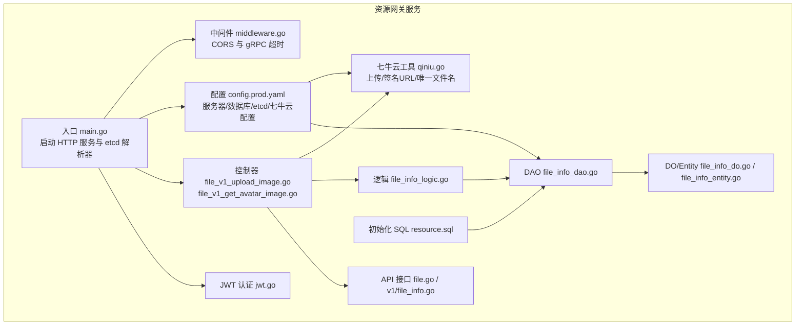
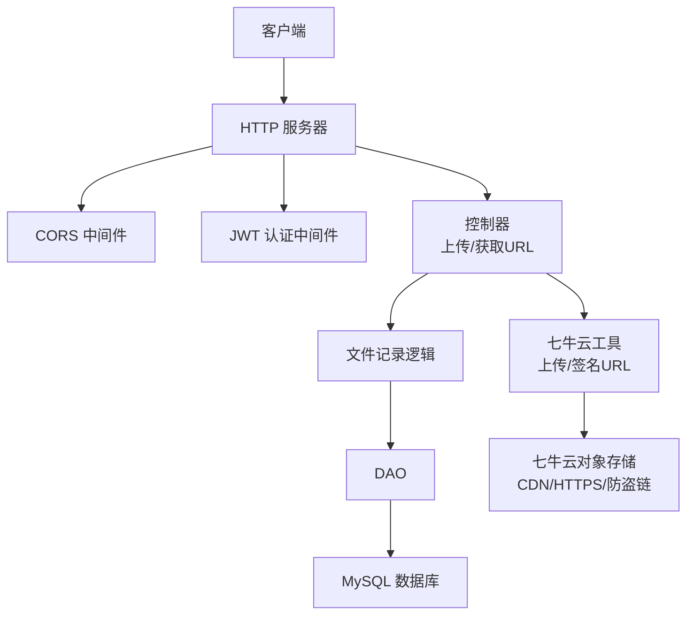
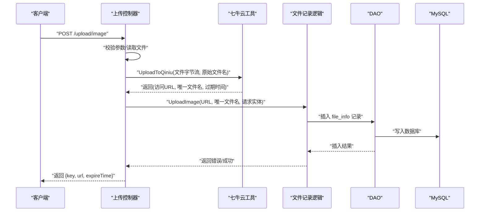
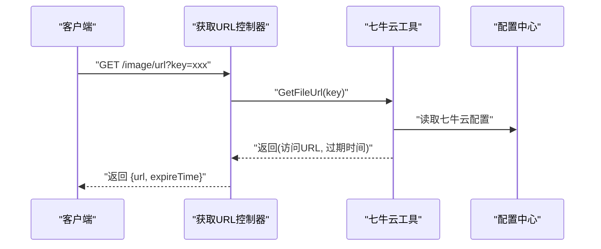
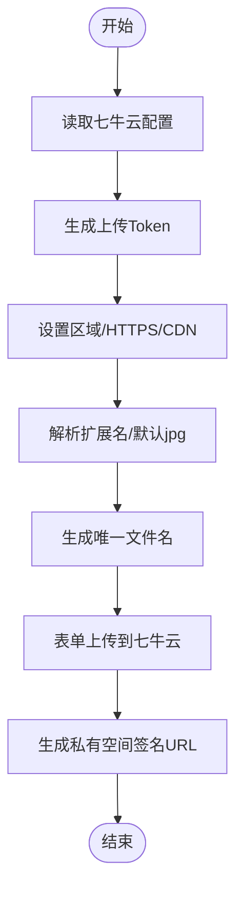
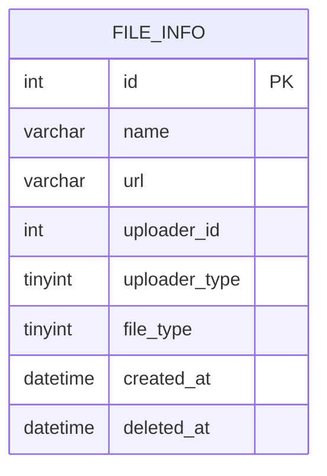
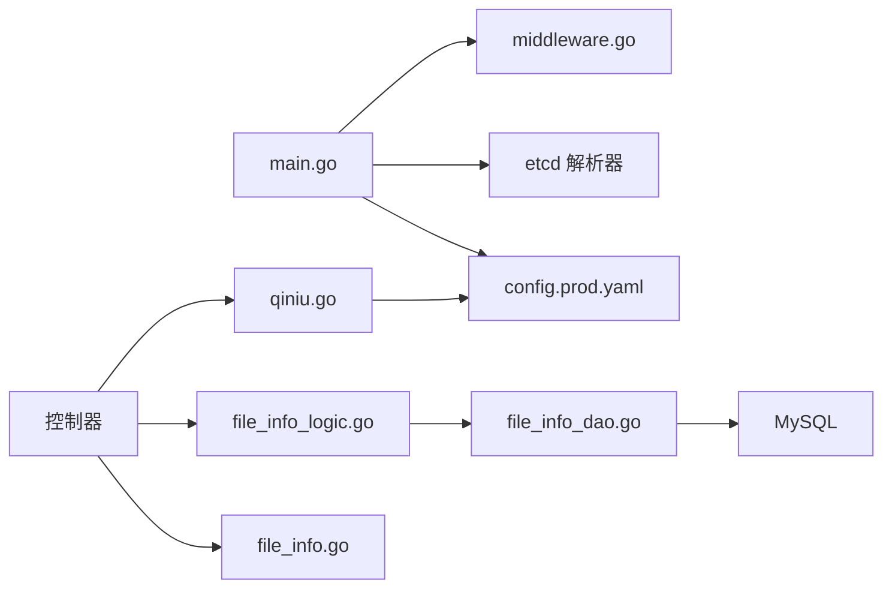

# 资源网关服务

<cite>
**本文引用的文件**
- [main.go](file://app/gateway-resource/main.go)
- [config.prod.yaml](file://app/gateway-resource/manifest/config/config.prod.yaml)
- [middleware.go](file://utility/middleware/middleware.go)
- [jwt.go](file://utility/middleware/jwt.go)
- [qiniu.go](file://app/gateway-resource/utility/qiniu.go)
- [file.go](file://app/gateway-resource/api/file/file.go)
- [file_info.go](file://app/gateway-resource/api/file/v1/file_info.go)
- [file_v1_upload_image.go](file://app/gateway-resource/internal/controller/file/file_v1_upload_image.go)
- [file_v1_get_avatar_image.go](file://app/gateway-resource/internal/controller/file/file_v1_get_avatar_image.go)
- [file_info_dao.go](file://app/gateway-resource/internal/dao/file_info.go)
- [file_info_do.go](file://app/gateway-resource/internal/model/do/file_info.go)
- [file_info_entity.go](file://app/gateway-resource/internal/model/entity/file_info.go)
- [file_info_logic.go](file://app/gateway-resource/internal/logic/file_info/file_info.go)
- [resource.sql](file://app/gateway-resource/hack/resource.sql)
</cite>

## 目录
1. [简介](#简介)
2. [项目结构](#项目结构)
3. [核心组件](#核心组件)
4. [架构总览](#架构总览)
5. [详细组件分析](#详细组件分析)
6. [依赖关系分析](#依赖关系分析)
7. [性能考虑](#性能考虑)
8. [故障排查指南](#故障排查指南)
9. [结论](#结论)
10. [附录](#附录)

## 简介
资源网关服务是一个面向文件资源访问的网关，主要职责包括：
- 图片上传与处理：接收前端上传的图片，调用七牛云对象存储进行存储，并返回带有效期的访问链接。
- 头像与静态资源访问：为已上传的文件生成带签名的有效访问链接，支持私有空间访问控制。
- 文件信息持久化：将上传的文件元信息写入统一的文件存储表，便于后续管理与审计。

该服务基于 GoFrame 框架构建，通过 etcd 注册中心发现与 gRPC 客户端通信，内置 CORS 中间件与 JWT 认证中间件，结合七牛云 SDK 实现对象存储集成与 CDN 加速、防盗链能力。

## 项目结构
资源网关服务位于 app/gateway-resource 目录，采用分层架构：
- api 层：定义对外暴露的接口契约与请求/响应模型。
- internal/controller 层：HTTP 控制器实现，负责请求解析、参数校验、调用业务逻辑与返回结果。
- internal/logic 层：业务逻辑封装，如文件记录入库。
- internal/dao 层：数据访问对象，封装数据库操作。
- internal/model：数据模型，包含 DO（用于查询条件）与实体（用于序列化）。
- utility：工具模块，包含七牛云上传与 URL 生成、文件名清理等。
- manifest/config：运行配置，包含服务器、数据库、etcd、七牛云等配置项。
- hack：初始化 SQL 脚本，创建统一文件存储表。

**图表来源**
- [main.go](file://app/gateway-resource/main.go#L1-L30)
- [config.prod.yaml](file://app/gateway-resource/manifest/config/config.prod.yaml#L1-L30)
- [middleware.go](file://utility/middleware/middleware.go#L1-L35)
- [jwt.go](file://utility/middleware/jwt.go#L1-L39)
- [qiniu.go](file://app/gateway-resource/utility/qiniu.go#L1-L141)
- [file.go](file://app/gateway-resource/api/file/file.go#L1-L17)
- [file_info.go](file://app/gateway-resource/api/file/v1/file_info.go#L1-L30)
- [file_v1_upload_image.go](file://app/gateway-resource/internal/controller/file/file_v1_upload_image.go#L1-L71)
- [file_v1_get_avatar_image.go](file://app/gateway-resource/internal/controller/file/file_v1_get_avatar_image.go#L1-L22)
- [file_info_dao.go](file://app/gateway-resource/internal/dao/file_info.go#L1-L23)
- [file_info_do.go](file://app/gateway-resource/internal/model/do/file_info.go#L1-L24)
- [file_info_entity.go](file://app/gateway-resource/internal/model/entity/file_info.go#L1-L22)
- [file_info_logic.go](file://app/gateway-resource/internal/logic/file_info/file_info.go#L1-L26)
- [resource.sql](file://app/gateway-resource/hack/resource.sql#L1-L13)

**章节来源**
- [main.go](file://app/gateway-resource/main.go#L1-L30)
- [config.prod.yaml](file://app/gateway-resource/manifest/config/config.prod.yaml#L1-L30)

## 核心组件
- HTTP 服务与注册中心集成：通过 etcd 解析器注册 gRPC 服务地址，便于服务间发现与调用。
- CORS 中间件：允许跨域请求，支持常见方法与头部。
- JWT 认证中间件：从请求头提取 Authorization，校验令牌并注入用户上下文。
- 七牛云工具：封装上传、签名 URL 生成、唯一文件名生成与清理、区域与 HTTPS/CDN 配置。
- 文件上传控制器：处理图片上传，读取文件内容，调用七牛云上传，持久化文件记录。
- 文件访问控制器：根据文件 key 生成带有效期的访问链接。
- 数据模型与 DAO：统一文件存储表的 DO/Entity 与 DAO 封装。

**章节来源**
- [middleware.go](file://utility/middleware/middleware.go#L1-L35)
- [jwt.go](file://utility/middleware/jwt.go#L1-L39)
- [qiniu.go](file://app/gateway-resource/utility/qiniu.go#L1-L141)
- [file_v1_upload_image.go](file://app/gateway-resource/internal/controller/file/file_v1_upload_image.go#L1-L71)
- [file_v1_get_avatar_image.go](file://app/gateway-resource/internal/controller/file/file_v1_get_avatar_image.go#L1-L22)
- [file_info_dao.go](file://app/gateway-resource/internal/dao/file_info.go#L1-L23)
- [file_info_do.go](file://app/gateway-resource/internal/model/do/file_info.go#L1-L24)
- [file_info_entity.go](file://app/gateway-resource/internal/model/entity/file_info.go#L1-L22)

## 架构总览
资源网关服务的运行架构如下：
- 启动时加载 etcd 地址，注册 gRPC 解析器，使服务具备服务发现能力。
- 初始化 HTTP 服务器，设置 CORS 中间件。
- 对外暴露文件上传与文件 URL 获取两个核心接口。
- 上传流程调用七牛云 SDK 完成对象存储上传，并生成带有效期的访问链接。
- 文件信息写入统一表 file_info，便于后续管理与审计。

**图表来源**
- [main.go](file://app/gateway-resource/main.go#L13-L29)
- [middleware.go](file://utility/middleware/middleware.go#L10-L23)
- [jwt.go](file://utility/middleware/jwt.go#L16-L38)
- [file_v1_upload_image.go](file://app/gateway-resource/internal/controller/file/file_v1_upload_image.go#L20-L71)
- [file_v1_get_avatar_image.go](file://app/gateway-resource/internal/controller/file/file_v1_get_avatar_image.go#L13-L22)
- [qiniu.go](file://app/gateway-resource/utility/qiniu.go#L18-L79)
- [file_info_logic.go](file://app/gateway-resource/internal/logic/file_info/file_info.go#L11-L25)
- [file_info_dao.go](file://app/gateway-resource/internal/dao/file_info.go#L13-L20)
- [resource.sql](file://app/gateway-resource/hack/resource.sql#L3-L12)

## 详细组件分析

### 文件上传接口（上传图片）
- 接口定义：POST /upload/image，请求体包含上传文件、上传者 ID、上传者类型、文件类型。
- 参数校验：必填字段校验，文件存在性校验。
- 处理流程：
  1) 打开上传文件并读取字节流。
  2) 调用七牛云工具上传，生成带有效期的访问链接与唯一文件名。
  3) 将请求参数转换为实体对象，调用文件记录逻辑写入数据库。
  4) 返回 key、url、expireTime。

**图表来源**
- [file_v1_upload_image.go](file://app/gateway-resource/internal/controller/file/file_v1_upload_image.go#L20-L71)
- [qiniu.go](file://app/gateway-resource/utility/qiniu.go#L18-L79)
- [file_info_logic.go](file://app/gateway-resource/internal/logic/file_info/file_info.go#L11-L25)
- [file_info_dao.go](file://app/gateway-resource/internal/dao/file_info.go#L13-L20)
- [resource.sql](file://app/gateway-resource/hack/resource.sql#L3-L12)

**章节来源**
- [file_info.go](file://app/gateway-resource/api/file/v1/file_info.go#L8-L20)
- [file_v1_upload_image.go](file://app/gateway-resource/internal/controller/file/file_v1_upload_image.go#L20-L71)
- [qiniu.go](file://app/gateway-resource/utility/qiniu.go#L18-L79)
- [file_info_logic.go](file://app/gateway-resource/internal/logic/file_info/file_info.go#L11-L25)
- [file_info_dao.go](file://app/gateway-resource/internal/dao/file_info.go#L13-L20)
- [resource.sql](file://app/gateway-resource/hack/resource.sql#L3-L12)

### 头像获取接口（获取文件 URL）
- 接口定义：GET /image/url，请求参数包含文件唯一标识 key。
- 处理流程：
  1) 从配置读取七牛云密钥与域名。
  2) 调用工具生成带有效期的私有空间访问链接。
  3) 返回 url 与 expireTime。

**图表来源**
- [file_v1_get_avatar_image.go](file://app/gateway-resource/internal/controller/file/file_v1_get_avatar_image.go#L13-L22)
- [qiniu.go](file://app/gateway-resource/utility/qiniu.go#L81-L101)
- [config.prod.yaml](file://app/gateway-resource/manifest/config/config.prod.yaml#L24-L30)

**章节来源**
- [file_info.go](file://app/gateway-resource/api/file/v1/file_info.go#L22-L30)
- [file_v1_get_avatar_image.go](file://app/gateway-resource/internal/controller/file/file_v1_get_avatar_image.go#L13-L22)
- [qiniu.go](file://app/gateway-resource/utility/qiniu.go#L81-L101)

### 七牛云存储集成
- 上传凭证生成：基于 accessKey/secretKey/bucket 生成 PutPolicy 并签发上传 Token。
- 区域与协议：配置为华南区，启用 HTTPS 与 CDN 域名。
- 文件命名：保留原始文件名，追加时间戳与随机数，清理非法字符，确保唯一性。
- URL 签名：私有空间生成带有效期的访问链接，支持防盗链。
- 配置项：accessKey、secretKey、bucket、domain、expireTime。

**图表来源**
- [qiniu.go](file://app/gateway-resource/utility/qiniu.go#L18-L79)
- [config.prod.yaml](file://app/gateway-resource/manifest/config/config.prod.yaml#L24-L30)

**章节来源**
- [qiniu.go](file://app/gateway-resource/utility/qiniu.go#L18-L141)
- [config.prod.yaml](file://app/gateway-resource/manifest/config/config.prod.yaml#L24-L30)

### 文件安全验证、大小限制与格式校验
- 必填参数校验：上传接口对文件、上传者 ID、上传者类型、文件类型进行必填校验。
- 文件读取：读取上传文件字节流，便于后续处理。
- 文件名清理：移除非法字符，避免存储与访问异常。
- 大小限制：当前实现未在网关层显式限制文件大小，可在控制器中增加大小阈值校验以满足安全要求。
- 格式校验：当前实现未在网关层显式限制文件格式，可在控制器中增加 MIME 类型或扩展名校验以满足安全要求。

**章节来源**
- [file_info.go](file://app/gateway-resource/api/file/v1/file_info.go#L8-L14)
- [file_v1_upload_image.go](file://app/gateway-resource/internal/controller/file/file_v1_upload_image.go#L20-L38)
- [qiniu.go](file://app/gateway-resource/utility/qiniu.go#L103-L140)

### 文件访问权限控制
- CORS：允许跨域请求，支持常见方法与头部；可根据业务需求调整允许来源。
- JWT：从请求头提取 Authorization，校验令牌有效性并将用户 ID 注入上下文；可在控制器中进一步校验上传者身份与权限。
- 七牛云私有空间：生成带有效期的签名 URL，默认一周过期；可通过配置项调整过期时间。

**章节来源**
- [middleware.go](file://utility/middleware/middleware.go#L10-L23)
- [jwt.go](file://utility/middleware/jwt.go#L16-L38)
- [config.prod.yaml](file://app/gateway-resource/manifest/config/config.prod.yaml#L24-L30)

### 数据模型与持久化
- 统一文件存储表 file_info：包含文件 ID、名称、URL、上传者 ID/类型、文件类型、创建时间等字段。
- DO/Entity：分别用于查询条件与序列化输出。
- DAO：封装插入操作，写入文件记录。

**图表来源**
- [resource.sql](file://app/gateway-resource/hack/resource.sql#L3-L12)
- [file_info_do.go](file://app/gateway-resource/internal/model/do/file_info.go#L12-L23)
- [file_info_entity.go](file://app/gateway-resource/internal/model/entity/file_info.go#L11-L21)

**章节来源**
- [resource.sql](file://app/gateway-resource/hack/resource.sql#L3-L12)
- [file_info_do.go](file://app/gateway-resource/internal/model/do/file_info.go#L12-L23)
- [file_info_entity.go](file://app/gateway-resource/internal/model/entity/file_info.go#L11-L21)
- [file_info_dao.go](file://app/gateway-resource/internal/dao/file_info.go#L13-L20)
- [file_info_logic.go](file://app/gateway-resource/internal/logic/file_info/file_info.go#L11-L25)

## 依赖关系分析
- 入口依赖：main.go 依赖 etcd 注册器与中间件。
- 控制器依赖：控制器依赖七牛云工具与文件记录逻辑。
- 逻辑层依赖：逻辑层依赖 DAO 与模型。
- DAO 依赖：DAO 依赖内部实现与数据库连接。
- 配置依赖：所有组件依赖配置中心提供的 etcd、数据库与七牛云配置。

**图表来源**
- [main.go](file://app/gateway-resource/main.go#L13-L29)
- [middleware.go](file://utility/middleware/middleware.go#L10-L23)
- [file_v1_upload_image.go](file://app/gateway-resource/internal/controller/file/file_v1_upload_image.go#L20-L71)
- [file_info_logic.go](file://app/gateway-resource/internal/logic/file_info/file_info.go#L11-L25)
- [file_info_dao.go](file://app/gateway-resource/internal/dao/file_info.go#L13-L20)
- [qiniu.go](file://app/gateway-resource/utility/qiniu.go#L18-L79)
- [config.prod.yaml](file://app/gateway-resource/manifest/config/config.prod.yaml#L16-L30)

**章节来源**
- [main.go](file://app/gateway-resource/main.go#L13-L29)
- [file_v1_upload_image.go](file://app/gateway-resource/internal/controller/file/file_v1_upload_image.go#L20-L71)
- [file_info_logic.go](file://app/gateway-resource/internal/logic/file_info/file_info.go#L11-L25)
- [file_info_dao.go](file://app/gateway-resource/internal/dao/file_info.go#L13-L20)
- [qiniu.go](file://app/gateway-resource/utility/qiniu.go#L18-L79)
- [config.prod.yaml](file://app/gateway-resource/manifest/config/config.prod.yaml#L16-L30)

## 性能考虑
- 上传性能：当前实现将整个文件读入内存，适合中小文件；对于大文件建议采用分块上传或流式上传以降低内存占用。
- 七牛云配置：启用 HTTPS 与 CDN 域名可提升访问速度与安全性；合理设置过期时间平衡安全与用户体验。
- 数据库写入：单次插入操作，建议在高并发场景下关注数据库连接池与索引设计。
- 中间件：CORS 与 JWT 中间件开销较低，但需注意预检请求处理与令牌解析成本。

[本节为通用性能建议，不直接分析具体文件]

## 故障排查指南
- 七牛云配置缺失：检查配置中心是否正确提供 accessKey、secretKey、bucket、domain、expireTime。
- 上传失败：确认上传文件是否存在、网络连通性、七牛云服务状态。
- URL 生成失败：确认 key 是否正确、签名算法与过期时间设置。
- 数据库写入失败：检查 file_info 表结构与连接配置，确认插入语句执行日志。
- CORS/鉴权问题：检查浏览器控制台跨域响应头与请求头 Authorization 是否正确传递。

**章节来源**
- [qiniu.go](file://app/gateway-resource/utility/qiniu.go#L18-L24)
- [file_v1_upload_image.go](file://app/gateway-resource/internal/controller/file/file_v1_upload_image.go#L20-L43)
- [file_v1_get_avatar_image.go](file://app/gateway-resource/internal/controller/file/file_v1_get_avatar_image.go#L13-L22)
- [resource.sql](file://app/gateway-resource/hack/resource.sql#L3-L12)

## 结论
资源网关服务提供了简洁高效的文件上传与访问能力，结合七牛云实现了对象存储、CDN 加速与防盗链。通过统一的文件存储表，便于后续扩展与审计。建议在生产环境中补充文件大小与格式校验、针对大文件优化上传策略，并完善鉴权与权限控制机制。

[本节为总结性内容，不直接分析具体文件]

## 附录

### API 接口清单
- 上传图片
  - 方法：POST
  - 路径：/upload/image
  - 请求参数：文件、上传者 ID、上传者类型、文件类型
  - 响应：key、url、expireTime
- 获取文件 URL
  - 方法：GET
  - 路径：/image/url
  - 请求参数：key
  - 响应：url、expireTime

**章节来源**
- [file_info.go](file://app/gateway-resource/api/file/v1/file_info.go#L8-L30)

### 配置项说明
- server：服务器监听地址、OpenAPI/Swagger 路径、日志配置。
- database：默认数据库连接信息。
- etcd：服务发现地址。
- qiniu：七牛云 accessKey、secretKey、bucket、domain、expireTime。

**章节来源**
- [config.prod.yaml](file://app/gateway-resource/manifest/config/config.prod.yaml#L1-L30)